# SEU 生存指南 2.0 - 完整离线版

> 源站：https://geekdaxue.co/read/chengqing-ddfhl@ckpcv7/cr8aqk
> 抓取时间：2026-09-02 15:28:10
> 文章数：65

---

## 目录

- [致谢](#%E8%87%B4%E8%B0%A2)
- [序言](#%E5%BA%8F%E8%A8%80)
- [观点篇](#%E8%A7%82%E7%82%B9%E7%AF%87)
  - [开篇：你想成为怎样一个人](#%E5%BC%80%E7%AF%87%EF%BC%9A%E4%BD%A0%E6%83%B3%E6%88%90%E4%B8%BA%E6%80%8E%E6%A0%B7%E4%B8%80%E4%B8%AA%E4%BA%BA)
  - [1 认识](#1%20%E8%AE%A4%E8%AF%86)
  - [2 改变](#2%20%E6%94%B9%E5%8F%98)
  - [3 碰撞](#3%20%E7%A2%B0%E6%92%9E)
  - [4 拓展](#4%20%E6%8B%93%E5%B1%95)
- [方向篇](#%E6%96%B9%E5%90%91%E7%AF%87)
  - [升学](#%E5%8D%87%E5%AD%A6)
    - [1 保研篇](#1%20%E4%BF%9D%E7%A0%94%E7%AF%87)
    - [2 考研篇](#2%20%E8%80%83%E7%A0%94%E7%AF%87)
    - [3 辅导员篇](#3%20%E8%BE%85%E5%AF%BC%E5%91%98%E7%AF%87)
    - [4 出国篇](#4%20%E5%87%BA%E5%9B%BD%E7%AF%87)
    - [5 支教篇](#5%20%E6%94%AF%E6%95%99%E7%AF%87)
  - [求职](#%E6%B1%82%E8%81%8C)
    - [开篇：东南求职规划浅析](#%E5%BC%80%E7%AF%87%EF%BC%9A%E4%B8%9C%E5%8D%97%E6%B1%82%E8%81%8C%E8%A7%84%E5%88%92%E6%B5%85%E6%9E%90)
    - [1 东南大学2019年就业报告浅析](#1%20%E4%B8%9C%E5%8D%97%E5%A4%A7%E5%AD%A62019%E5%B9%B4%E5%B0%B1%E4%B8%9A%E6%8A%A5%E5%91%8A%E6%B5%85%E6%9E%90)
    - [2 求职观念](#2%20%E6%B1%82%E8%81%8C%E8%A7%82%E5%BF%B5)
    - [3 求职方法论](#3%20%E6%B1%82%E8%81%8C%E6%96%B9%E6%B3%95%E8%AE%BA)
    - [4 关于职业规划](#4%20%E5%85%B3%E4%BA%8E%E8%81%8C%E4%B8%9A%E8%A7%84%E5%88%92)
    - [5 行业、岗位分享](#5%20%E8%A1%8C%E4%B8%9A%E3%80%81%E5%B2%97%E4%BD%8D%E5%88%86%E4%BA%AB)
      - [泛IT类岗位](#%E6%B3%9BIT%E7%B1%BB%E5%B2%97%E4%BD%8D)
        - [互联网运营岗](#%E4%BA%92%E8%81%94%E7%BD%91%E8%BF%90%E8%90%A5%E5%B2%97)
        - [互联网前端开发岗](#%E4%BA%92%E8%81%94%E7%BD%91%E5%89%8D%E7%AB%AF%E5%BC%80%E5%8F%91%E5%B2%97)
        - [互联网游戏开发岗](#%E4%BA%92%E8%81%94%E7%BD%91%E6%B8%B8%E6%88%8F%E5%BC%80%E5%8F%91%E5%B2%97)
        - [互联网产品岗](#%E4%BA%92%E8%81%94%E7%BD%91%E4%BA%A7%E5%93%81%E5%B2%97)
        - [互联网软件测试岗位](#%E4%BA%92%E8%81%94%E7%BD%91%E8%BD%AF%E4%BB%B6%E6%B5%8B%E8%AF%95%E5%B2%97%E4%BD%8D)
      - [地产篇](#%E5%9C%B0%E4%BA%A7%E7%AF%87)
      - [金融行业岗位](#%E9%87%91%E8%9E%8D%E8%A1%8C%E4%B8%9A%E5%B2%97%E4%BD%8D)
      - [销售类岗位](#%E9%94%80%E5%94%AE%E7%B1%BB%E5%B2%97%E4%BD%8D)
    - [6 城市：人才政策](#6%20%E5%9F%8E%E5%B8%82%EF%BC%9A%E4%BA%BA%E6%89%8D%E6%94%BF%E7%AD%96)
      - [南京](#%E5%8D%97%E4%BA%AC)
  - [选调考公](#%E9%80%89%E8%B0%83%E8%80%83%E5%85%AC)
    - [关于选调生](#%E5%85%B3%E4%BA%8E%E9%80%89%E8%B0%83%E7%94%9F)
    - [【选调】一个意识流青年的碎碎念](#%E3%80%90%E9%80%89%E8%B0%83%E3%80%91%E4%B8%80%E4%B8%AA%E6%84%8F%E8%AF%86%E6%B5%81%E9%9D%92%E5%B9%B4%E7%9A%84%E7%A2%8E%E7%A2%8E%E5%BF%B5)
  - [从军](#%E4%BB%8E%E5%86%9B)
  - [创业](#%E5%88%9B%E4%B8%9A)
    - [开篇](#%E5%BC%80%E7%AF%87)
    - [1 为什么不鼓励创业？](#1%20%E4%B8%BA%E4%BB%80%E4%B9%88%E4%B8%8D%E9%BC%93%E5%8A%B1%E5%88%9B%E4%B8%9A%EF%BC%9F)
    - [2 为什么不反对创业？](#2%20%E4%B8%BA%E4%BB%80%E4%B9%88%E4%B8%8D%E5%8F%8D%E5%AF%B9%E5%88%9B%E4%B8%9A%EF%BC%9F)
    - [3 我们聊聊创业比赛](#3%20%E6%88%91%E4%BB%AC%E8%81%8A%E8%81%8A%E5%88%9B%E4%B8%9A%E6%AF%94%E8%B5%9B)
    - [4 在东南，如果你决定创业](#4%20%E5%9C%A8%E4%B8%9C%E5%8D%97%EF%BC%8C%E5%A6%82%E6%9E%9C%E4%BD%A0%E5%86%B3%E5%AE%9A%E5%88%9B%E4%B8%9A)
  - [其他](#%E5%85%B6%E4%BB%96)
    - [自由职业](#%E8%87%AA%E7%94%B1%E8%81%8C%E4%B8%9A)
    - [待业/GAP](#%E5%BE%85%E4%B8%9A/GAP)
- [学习篇](#%E5%AD%A6%E4%B9%A0%E7%AF%87)
  - [学业](#%E5%AD%A6%E4%B8%9A)
    - [1 基础性学习](#1%20%E5%9F%BA%E7%A1%80%E6%80%A7%E5%AD%A6%E4%B9%A0)
      - [关于学习的一些小心得](#%E5%85%B3%E4%BA%8E%E5%AD%A6%E4%B9%A0%E7%9A%84%E4%B8%80%E4%BA%9B%E5%B0%8F%E5%BF%83%E5%BE%97)
      - [有关基础性学习的一些分享](#%E6%9C%89%E5%85%B3%E5%9F%BA%E7%A1%80%E6%80%A7%E5%AD%A6%E4%B9%A0%E7%9A%84%E4%B8%80%E4%BA%9B%E5%88%86%E4%BA%AB)
    - [2 拓展性学习](#2%20%E6%8B%93%E5%B1%95%E6%80%A7%E5%AD%A6%E4%B9%A0)
      - [竞赛相关](#%E7%AB%9E%E8%B5%9B%E7%9B%B8%E5%85%B3)
      - [SRTP项目](#SRTP%E9%A1%B9%E7%9B%AE)
      - [科研相关](#%E7%A7%91%E7%A0%94%E7%9B%B8%E5%85%B3)
      - [关于实习](#%E5%85%B3%E4%BA%8E%E5%AE%9E%E4%B9%A0)
      - [海外交流](#%E6%B5%B7%E5%A4%96%E4%BA%A4%E6%B5%81)
        - [海外交流体会（一）](#%E6%B5%B7%E5%A4%96%E4%BA%A4%E6%B5%81%E4%BD%93%E4%BC%9A%EF%BC%88%E4%B8%80%EF%BC%89)
        - [海外交流体会（二）](#%E6%B5%B7%E5%A4%96%E4%BA%A4%E6%B5%81%E4%BD%93%E4%BC%9A%EF%BC%88%E4%BA%8C%EF%BC%89)
  - [转专业](#%E8%BD%AC%E4%B8%93%E4%B8%9A)
    - [1 写在前面](#1%20%E5%86%99%E5%9C%A8%E5%89%8D%E9%9D%A2)
    - [2 心得分享](#2%20%E5%BF%83%E5%BE%97%E5%88%86%E4%BA%AB)
    - [3 常规转专业](#3%20%E5%B8%B8%E8%A7%84%E8%BD%AC%E4%B8%93%E4%B8%9A)
      - [转仪科，保研转计算机](#%E8%BD%AC%E4%BB%AA%E7%A7%91%EF%BC%8C%E4%BF%9D%E7%A0%94%E8%BD%AC%E8%AE%A1%E7%AE%97%E6%9C%BA)
      - [转系分享-stella](#%E8%BD%AC%E7%B3%BB%E5%88%86%E4%BA%AB-stella)
      - [转人工智能](#%E8%BD%AC%E4%BA%BA%E5%B7%A5%E6%99%BA%E8%83%BD)
        - [附件](#%E9%99%84%E4%BB%B6)
      - [转电子](#%E8%BD%AC%E7%94%B5%E5%AD%90)
    - [4 学习困难转专业](#4%20%E5%AD%A6%E4%B9%A0%E5%9B%B0%E9%9A%BE%E8%BD%AC%E4%B8%93%E4%B8%9A)
      - [学困转中文](#%E5%AD%A6%E5%9B%B0%E8%BD%AC%E4%B8%AD%E6%96%87)
      - [学困转社会学](#%E5%AD%A6%E5%9B%B0%E8%BD%AC%E7%A4%BE%E4%BC%9A%E5%AD%A6)
  - [暂停键：休学](#%E6%9A%82%E5%81%9C%E9%94%AE%EF%BC%9A%E4%BC%91%E5%AD%A6)
- [生活篇](#%E7%94%9F%E6%B4%BB%E7%AF%87)
  - [1 生活家说](#1%20%E7%94%9F%E6%B4%BB%E5%AE%B6%E8%AF%B4)
    - [南京玩乐](#%E5%8D%97%E4%BA%AC%E7%8E%A9%E4%B9%90)
    - [爱好](#%E7%88%B1%E5%A5%BD)
    - [生活观察](#%E7%94%9F%E6%B4%BB%E8%A7%82%E5%AF%9F)
  - [2 “心理健康”](#2%20%E2%80%9C%E5%BF%83%E7%90%86%E5%81%A5%E5%BA%B7%E2%80%9D)
  - [3 恋爱](#3%20%E6%81%8B%E7%88%B1)
  - [4 美妆](#4%20%E7%BE%8E%E5%A6%86)
  - [5 宿舍生活](#5%20%E5%AE%BF%E8%88%8D%E7%94%9F%E6%B4%BB)
- [校友篇](#%E6%A0%A1%E5%8F%8B%E7%AF%87)
  - [开篇：每一代人都不一样，也都大差不差](#%E5%BC%80%E7%AF%87%EF%BC%9A%E6%AF%8F%E4%B8%80%E4%BB%A3%E4%BA%BA%E9%83%BD%E4%B8%8D%E4%B8%80%E6%A0%B7%EF%BC%8C%E4%B9%9F%E9%83%BD%E5%A4%A7%E5%B7%AE%E4%B8%8D%E5%B7%AE)
  - [三年之后](#%E4%B8%89%E5%B9%B4%E4%B9%8B%E5%90%8E)
  - [五年之后](#%E4%BA%94%E5%B9%B4%E4%B9%8B%E5%90%8E)
  - [十年之后](#%E5%8D%81%E5%B9%B4%E4%B9%8B%E5%90%8E)
- [我们想对你说](#%E6%88%91%E4%BB%AC%E6%83%B3%E5%AF%B9%E4%BD%A0%E8%AF%B4)

---

# 致谢

- [个人：](#6jw1e0)
[组织、团队、平台：](#8eooej)

*排序不分先后，按署名姓氏/组织名称的笔画排序，整理匆忙，如有遗漏或错误还望见谅，请联系主创团队（微信18088398808），将尽快修正。*

### 个人：

2016-Fei2015-经管-Index材料-James Kobe2016-经管-Jove2015-Mr.mc2012-电气-PCLiu2018-土木-VV2016-经管-龙哥2017-公卫-陈睿楠2014-软件-陈雄辉2018-电子-程冠宇2017-程清2017-代光志2016-电气-点石晨金2016-土木-董浩哲2016-电子-杜舒婷2016-机械-冯海钊2018-吴院-龚子豪2016-数学-顾芯怡2016-生医-郝世杰2016-信息-侯宏卫2016-交通-雷明月2016-经管-李路遥2016-信息-李想2017-信息-李哲2018-信息-刘天祺(祺小宁)2017-计算机-桥段ccc2016-电子-秦育彬2017-能环-尚小宇2016-信息-帅润2015-人文-孙文婷2018-土木-王辉2018-人文-王佳钰2017-计算机-王振宇2016-电子-王宗辉2018-经管-小海螺经管-小园2017-材料-徐潇航2016-外国语-许婕2015-电子-旋转的荷兰人号2016-信息-薛彤2016-吴院-严格信息-余耀2016-机械-张乐2017-能环-张一凡2016-人文-赵鹏风2016-电子(ASIC)-周远航2013-电子-吉星宇2015-电子-王楠鑫2015-会计-户晓雅2015-高谦2016-电子-曹宗元2016-人文-王颖怡2016-电子-陆瑶2016-人文-杨昊月2016-人文-高佳琪2018-土木 -徐何霖2015-计算机-陈婉宁

**2.0新增**2017-土木-小司2017-仪器科学-招梓枫2017-仪科-王天恩2017-罗蕴轩2017-汪涵2017-程清2018（硕）-陆立锦2018-轰轰2018-贝壳2019-信息-Stella2019-外国语-小摩尔2019-计软智-曾晗2020-人文-贾东晓2020-海滢2020-狸捉盐2020-顾盼 2021（硕）-建筑-赵于畅

### 组织、团队、平台：

SEU校友圈团队东大小宝团队东南Clab工作室东南大学飞跃手册团队东南大学国防军事实践团东南大学学生创业协会(ASE)东南大学学生职业发展协会(SCDA)东南大学国家大学科技园东南大学学生创业协会20周年溯源调研团微信公众号[胡诌老王]微信公众号[资己]微信公众号[祺小宁的妙想]微信公众号[SEU20级信息一班]东南大学[爱你37℃]平台东南大学[东南大学生活服务墙]平台

---

# 序言

- [初心](#5y88nf)
- [过程](#6r3uc9)
- [Hello World！](#39x7lk)
[一切才刚刚开始](#1r9z6m)

### 初心

“在进化算法中，有种情况叫局部最优陷阱，即从局部来看某个解是最优的，但如果从全局的角度看来，却会陷入瓶颈。

**想想生活也不过如此——很多时候做出的选择取决于我们的视角。**

如果你只看到眼前的30分钟，那再玩盘游戏才是性价比最高的选择；

如果你能看到几个月后的期末考试，也许你会思考如何高效地听讲、完成作业；

如果你看到了毕业前的各种岔路口，也许你会更有方向地去准备实习、准备考试、准备竞赛等；

如果你再看到往后十年，那整个大学也不过一个阶段，至于眼下的小磕小碰或是小名小利——那都不叫事儿。”

**

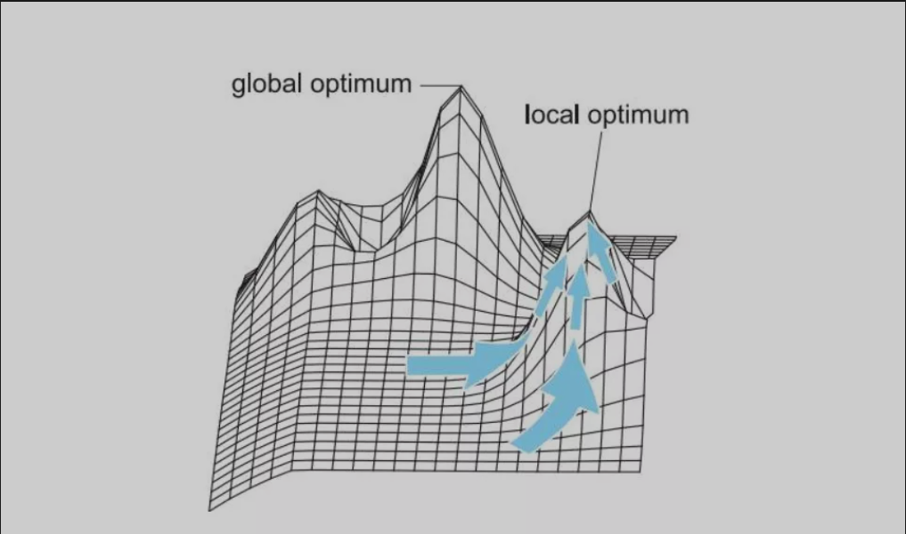

****六个月前，我写下了如上文字。

**那个时候的我们几个人，临近毕业，站在东南四年的终点回看起点，才第一次深刻地理解了视野和选择的重要。**

我们中太多人因为没能提前看到一些更多的可能性或缺少“前路人”的鼓励，而错失了本能够抓住的机会。对于刚从高考书山题海中爬出来的孩子们，视野从来都是不对称的、时间局限的、圈子局限的、背景局限的，百年东南的平台很大、资源不少，可不见得谁都能利用好，四年时间一晃而过……

弥合这个问题，学校能实现的只是其中一环，如何构建更牢固的学缘关系，补全一所学校本科「育人自生态」中的另外一环——同样是我们该思考的。

有天偶然间看到一份十年前上交前辈写下的《上海交通大学学生生存手册》，据说曾鼓励指引了一代人：

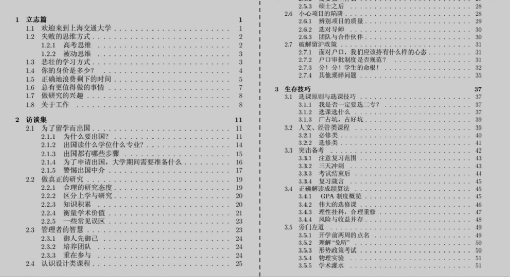

感谢前人探路，站在前人的肩膀上，我们有理由相信十年后的自己能做得更好——做一份面向全体东南人的公益、开源的中文分享项目【SEU·生存指南】。

**同时我们也相信这不会是一场自我感动的努力——因为从起步阶段开始，我们就持续得到了太多朋友的留言、鼓励和支持——感谢每一个人：**

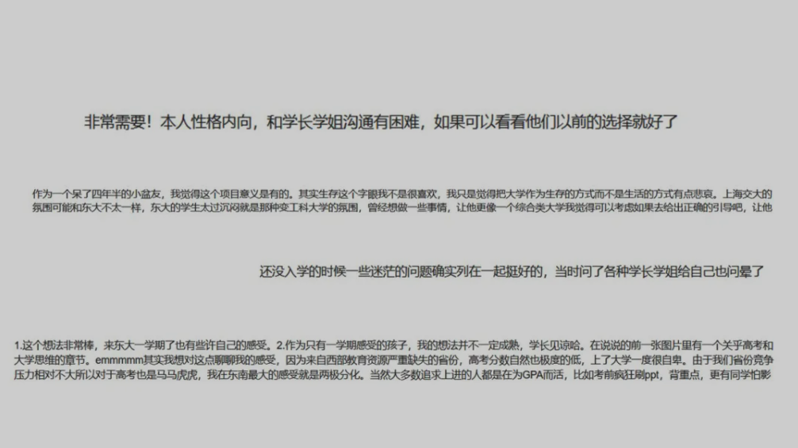

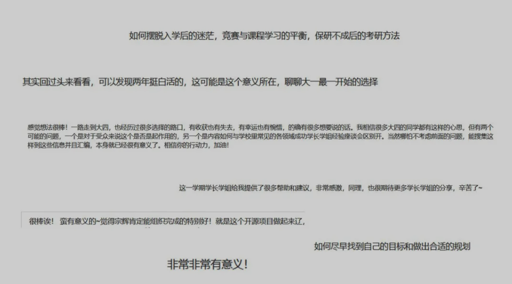

### 过程

**SEU生存指南的想法得到了很多人的支持，尤其包括几十位公益参与进行分享创作的参与者，以及多个公益组织、团队：**

在大家的支持下，项目得以顺利启动。

但不得不承认，落地过程并不顺利，我们遇到了很多困难，工作量也比预想中要大得多。

设计框架、调研平台、制定协作规范、召集团队、协调分工、联系资源、采访调研、撰写内容、查漏补缺、审核校对、排版整理……

每一步都不曾有人走过，我们在期待、鼓励、困难、质疑中摸索前进，压力铺面而来，进度一度停滞……

跌跌撞撞、走走停停——好在我们没放弃，坚持了下来，交出了这份羽翼还不丰满但总算还是五脏俱全的1.0版本。

### Hello World！

终于，它今天面世了——

项目主体分为四大板块：**

- **观点篇(认识|改变|碰撞|拓展)**
- **方向篇(保研|创业|出国|从军|辅导员|考研|就业|选调考公|支教|自由职业)**
- **综合篇(基础学习|拓展学习|实践|生活娱乐|校园攻略)**
- **校友篇(三年之后|五年之后|十年之后)**

****观点篇：**侧重观点讨论，旨在为每位同学顺利完成高中到大学的过渡提供帮助，引导同学们在大学中独立思考、独立判断。**方向篇：**侧重于大学发展方向的经验整理，展示在东南的每一种发展可能、每一条路。**综合篇：**侧重于展示一些贴“东南地气儿”的生存技巧与玩耍策略。**校友篇：**以采访交流的形式，带大家一起看看一代代东南人毕业多年之后的故事，逆向重构回今天。

另外，在每个篇章中，对应的伙伴独立设计整理了二级甚至三级目录。**但无论内容和形式如何，我们都秉承着**“拒绝爹味”**的初心，**不安利或否认任何选择，只是告诉你所有的可能性以及它们对应的得与失**——这是你本应得的，本该了解更多、看到更多。

而最终作何选择，什么才是一段不会后悔的大学时光？**观者自见，自己定义就好。****我们也希望看到这份手册的同学，**能够跳出“局部最优陷阱”，在看到更多可能性的同时，选择那条最合适、最喜欢的路，最终成为想要成为的那个自己。****

### 一切才刚刚开始

一切才刚开始，我们不过起了个头。

**我觉得要真正成为一流高校，一方面靠的是学科建设、授课体系、科研力量、社会资源；另一方面靠的是牢固的学缘关系、浓厚的校友感情、在时间维度上构建起育人生态的自循环。**

后者靠的是每位SEUer的共同参与。

过去的几个月的努力和这份小成果的发布，意味着我们迈出了第一步。接下来的第二、第三步乃至于未来的所有可能，靠我们远远不够。

**需要更多的SEUers来参与、完善、共同成长！****如果你也怀有一份对大学时光的些许遗憾，如果你有想要对后来的朋友说的话，如果你也期待着为这份生存指南给出自己的那份温暖，如果你想要找到志同道合的朋友……

**那么我们在这里怀着同样的期许，等待与你相遇。👇****

SEU生存指南公众号：合作推广 | 联合发布 | 参与迭代 | 共同进步

策划 | SEU·生存指南运营团队内容 | 王宗辉审核 | 程清

---

# 开篇：你想成为怎样一个人

各位同学，欢迎大家来到东南大学。现在在这些文字背后的，是各位新生们的学长学姐。不断回首是人类的一个优点，我们已经走过了本科的四年、研究生的三年甚至博士的四年，回过头去看，有许多矛盾和对比、荒谬和真诚、乏味和乐趣。这些鲜活如颗粒的经历，让我们思考着学习与教育、成长与成熟、理想与命运、现实与自我的话题。校园里充斥着伟大的话题和渺小的自我，我们希望，所有同学都能在某一个时刻，突如其来般觉醒，从而将自己斤斤计较的生活放置到他人、社会和国家的视角。以此，拓宽胸怀、提升格局，慢慢走进更为成熟的阶段。

人生阶段的过渡总是需要时间，然而，当大家终于意识到大学的可能性时，时间或已多逝。为了加速这个认知过程，我们整理并编写了这本东大生存指南。尽管这本册子内容较多、信息含量较大、范围较广，甚至有“追名逐利”之嫌，但它的核心依然是你曾经在很小的时候便已回答过的问题，“你想成为一个怎样的人”？也许你曾经的答案是，“我想当科学家！”但你现在一定很难过，自己其实并不知道如何来回答这个问题，因为你所期待的、想要经历的、想要感受的精彩人生，已然无法用一句话简单地概括，更无法去定义你想要成为的人。这个问题的答案，将藏匿在你在大学的自我要求、重要抉择和日常思考中，而这些方面一定会涉及到后文的种种事项。当你们和我们一样，走在认识自己的道路上，那么毕业之际，也就是真正的“成人”之时。请相信，这本册子一定不是为了帮助所有人都实现高分绩点、保研成功和实习丰富等，而是基于这些我们不得不经历的极为现实的事情，大声地提醒所有人——

**在思考中找到你自己！**

---

# 1 认识

- [1.1 大学的定义](#dcb876)
[1.2 大学里的成绩观](#2pkzkx)

## 1.1 大学的定义

各位亲爱的同学，恭喜你们在即将成年或刚刚成年之际，终于结束长达12年的刻苦学习，正式迈入大学。尤其在过去的三年里，你的生活可能只有课程和考试，你的思想漂流到最远的地方也仅仅是手里的那本《读者》。然而现在，你来到大学，终于可以开启这段身体与心灵自由的追寻之旅——大学是一个自由的地方，尽管它通过自己的规章制度来约束你的行为，但是它绝不会有意去压制你的想法。简单来说，大学是一个探索的契机、改变的阶段、思考的过程和自学的场所。从此刻开始，那些老套的道理、热血式的激情，将重新以认识、改变、碰撞、拓展的形式，构成你未来的成熟魅力。

大学是一个探索的契机。大学之大，在其丰盛的事物。这里的丰盛，绝不仅仅是社团众多。有形的物品、无形的思考，具象的个体、抽象的集群，那些你曾经感兴趣的或可能感兴趣的事物，就像一碗珍珠翡翠白玉汤，全搅在了这个校园里。大学也许不能提供所有问题的答案，也许不能去满足你所有的奢求，但它高度聚集的资源一定能提供给你一个出发的端口，从这里开始，旅行将是一件美妙的事情。事物的尝试其实是一种内心的访问，对于各类事物的不断接触也是在追寻自我。但是，没有付出努力的体验都不算探索，反复犹豫而只在脑海里经历的体验更不算探索。总之，美景需要出发和走过才算获得。

大学是一个改变的阶段。许多人可能都听说过一句话，“大学是个整容所”，意在形容那些大学之后外貌和气质发生巨大变化的人。从个体的角度而言，大学的确是一个用来改变自我的绝佳阶段。我们在校内经常会发现，有些同学每隔一段时间，就会以更加全新的面貌出现，这种快速的变化反映出其不断吸收、不断挑战和突破的状态。从知识储备的提升，到谈吐的愈发清晰沉稳，再到精神面貌的自信和大方，甚至是衣着风格的成熟，这些由内而外的改变更新速度越快，越能体现出一个人在自我升级上的强烈意愿和辛苦付出。长期保持在一个状态、一个模样，也许是一种对生活简化的坚守，但也有可能是一种舒适的腐化。

大学是一个思考的过程。我想，经历过高考议论文训练的同学，都很熟悉模式化的方法论。然而，对于那些自由的、宽泛的、零碎的甚至是不成逻辑的想象和思索，总是陌生而缺乏知觉。人们有时生活得太循规蹈矩，才会忘记思考身边事物存在的真实性、合理性和有效性。比如，东南大学为什么要把蓝色的教室门漆成灰色？2020年下半年校园实施封闭式管理的成本和收益孰低孰高？桃园新食堂的跳跃式涨价是校企合谋还是单方面的企业垄断？我在什么时候可以感觉到情绪的变化，亦或从来只是任由情绪游走？假如我读了博士，我是走进了知识的自由还是时间的自由？学校管理、生活现象、未来规划，正是这些面向世界的思考，才让你我的生活不止于陆地、校园和自己。

大学是一个自学的场所。大学校园里有句俗语，“大学=大不了自己学。”从这句话可以看出，**自学其实是大学生活的一种常态**。自学既可能来自听不懂，也可能来自想多学。总之，在大学，等待老师来培养一个丰盛而圆满的你是不可能的。想要获得什么，几乎都要依赖自己。本科教育的内容多且杂，但又不够深入，如果想要获得更为系统的体验，只有通过自学完善知识体系。**上课+自学的模式将成为每一个人未来日子里的主流模式**，所以这就是为什么有的人永远都有东西可学，而有人总觉得无事可做。

综上，大学需要每一位同学来贡献好奇、思想和行动力，如此，大学也将反馈给同学们成长的收获。然而，即便大学似乎蕴藏了无数的好处，我们也要清晰地意识到，每一所学校必然有其优缺。东南大学作为一个工科强势学校，校园人文气息的不足和行政管理的低效众所皆知。作为这所学校的一员，我们不仅要感恩学校带给我们的利处，更要去发现那些呆滞的、沉闷的、落后的局部文化，只有在不断反思中清醒，我们才能和学校实现真正的共进退。个体需要修炼，大学需要改革。

## 1.2 大学里的成绩观

各位亲爱的同学们，很抱歉我们这么快就要进入一个极为现实的话题，一个我们所有学生曾经都十分熟悉和在意的话题——成绩。我相信许多人都对大学抱有更为宽广的想象，并且决心不再让成绩束缚自己，创造出一个独具魅力的、丰富多彩的大学生活。但是随着本科生活的结束，我们才愈发感受到，成绩的重要性绝不会随着高中的结束而逐渐降低。在我们开启职业生涯、彻底走进真正的社会之前，成绩是评价我们个人能力的最为重要的标尺。

我想了很久关于中国人的成绩观，不明白为何“成绩不是一切”在大学里依然显得微不足道。中国人对于成绩如此执着地追求，我想最终可以归为三个原因：文化观念、人口众多和自动化的发展。**其一，文化观念根深蒂固。“成绩优异”带着其与生俱来的荣誉感，**自动美化了他人对这类学生的幻想，随之而来的是良好的品德、自律的生活、出众的实力……与此同时，尽管中国是一个典型的关系社会，但是中国人往往追求一种“客观”的公平，尤其是成绩这种数字标准。潜意识下，获得优异的成绩是一种理所应当的行为。**其二，人口众多导致竞争激烈。**直白地说，中国人口实在太多了，为了缓解就业压力而不断扩招的大学生更多。对于企业而言，成绩是最简单、最直接、最便捷的用人筛选标准。**其三，自动化迅速发展，人力需求直线下降，进一步加剧竞争。**曾经我飞去东北的一家汽车制造工厂实习调研，不解为何厂内仍以半自动化生产器械为主。后来，有关负责人告诉我，当地政府不允许企业实现全自动化，强迫企业增加就业岗位。尽管该企业已具备实现全自动化的能力和拥有进一步降低成本的机会，但是在政府的调控下，仍然要采取落后的、高成本的生产模式。如今，高端人才口号虽好，但大部分人仍然很难成为真正的高端人才。在自动化、互联网、人工智能等现代技术的强势发展下，学生之间的竞争变得更为激烈，而成绩显然仅仅只是提高竞争力的第一步。

成绩作为大学生硬实力的典型代表，最为关键是其带有资源效应。从现有的校园现象来看，成绩优异的人在科研竞赛、评奖评优、人际交往、学生活动、就业选择等众多方面的确具备更加出色的表现。**不难看出，人们在提高成绩的过程中往往大概率地提高了自身综合实力。**但是，总有侥幸的人往往忽略这浅而易见的道理，决心要做成绩一般而综合实力高的强者，可是这样的人终归只是极少数，大多数不过是为逃避努力学习而自欺欺人。

成绩虽然很重要，但仍需其他方面加持。正如前述所说，中国学生间的竞争超乎想象，要想脱颖而出，除了基本的高绩点，在科研竞赛、学生工作、实习经历、校园活动、兴趣特长等方面也得有相应的表现。狭义的成绩的确仅仅只是课程成绩，在短暂的校园生活内，它的确可以带来荣誉和奖金，但对于更为长久的未来而言，能够持续发挥作用的依旧是包含了成绩、科研、竞赛、工作、实习等广义的成绩。表现在个体身上，就是你的经历经验、思维能力、演讲能力、领导能力等。**如果你面对大学不知所措，那就先拿到高绩点；如果你能够轻松解决学习任务，那就进一步拓展自己。**

---

# 2 改变

- [2.1 沉默的呆滞性](#en0ovh)
[2.2 时间的机会成本](#cfcc3o)

## 2.1 沉默的呆滞性

作为年少时期青春涌动的压制剂和中国历来谦卑谨慎的传统观念，沉默是金一向是我国教育中的铁杆理念。我的身边也不乏众多沉默者，主要包括以下两类：第一类是言语上的沉默，不善言谈、不爱表达、不喜交流，把自己封闭在一个只属于自己的舒适区内；第二类是行动上的“沉默”，生活三点一线（教室-食堂-宿舍），没有社团或社团很少参与，从不主动参加学校内的其它文化活动、各类竞赛，基本只做迫不得已必须完成的任务，完全被动地生活着。

“沉默”的原因是复杂多样的。在东大这个有着来自五湖四海的同学们的校园里，每个个体都是丰富且多层次的，很难简单用一个维度来概括一个人行为方式背后的原因。但就我的个人经验和观察来说，大家沉默的原因主要包括个人性格、出身背景和所处环境。**其一，个人性格。**内向与沉默有着很强的相关性以及一定的因果性：沉默者中内向者比例很高，长期内向、自我封闭则容易导致沉默。然而，有些人会将沉默完全归因于内向的性格，然后又以性格是天生的为借口来逃避改变。**其二，出身背景。**地区文化差异和家庭条件的不同创造出了认知水平不一和表达方式各异的同学们，当大家聚集到同一个平台上时，总会产生各式各样的落差。此时，难免有人陷入自卑的沉默。另外，还有更多的同学由于行为习惯和思维方式的束缚，对于大学里的一些选择与机会缺乏感知，尤其对信息获取不敏感，对大学的理解依旧停留在上课和考试层面，限制了自身的拓展。**其三，所处环境。**热情开朗的舍友、学生工作出色的学院、玩得开心的社团，良好环境的确能够促进与他人交流、表达与展现自己；但如果整个宿舍的人都不爱交流，在学院或者社团中找不到归属感，也可能会导致在大学生活里的“沉默”。

常常会听到这么一种说法，叫“沉默的大多数”。人群中大多数声音都是由为数不多的活跃分子发出的，而大多数人都不会发出自己的声音。沉默的人，往往改变不了这个世界。我相信，即使许多同学明白自身的慵懒与沉默，但也会坚守在这种封闭和落后的状态里，始终不敢打破故步自封的安全，从而感受突如其来的不确定性。各位同学，如果你察觉到自己的过于沉默，如果你想为改变二字附加一些实际行动，那么我有以下三点简单的建议。首先，走出舒适区，积累在人前表达的经验。比如，一次pre、一次主动与陌生人的交流、一次水群的经历，经历多了胆量就有了。可能会难受，或者暂时看不到效果，但时间会给你带来成果。其次，给自己找一个好的环境。这里的好是指有更多的交流机会、更好的学习对象、更高的容错率等等。改变一种习惯甚至性格一部分是需要发挥很大主观能动性的，耗费很多心力，如果在一个不合适的环境中，即使下了很大决心也很容易被消磨殆尽。最后，找到一个有归属感的集体。在一个有归属感的集体中更容易获得积极开放的心态。这个集体可以是班级、可以是宿舍、当然更可能是社团。和小伙伴之间互相学习，积极交流，也更容易得到更多的活动信息和机会，把握住，也许某一次机会就将彻底改变自己。

## 2.2 时间的机会成本

从定义上来看，机会成本是指为了完成任务A而放弃任务B的机会，被放弃的任务B应得的收益就是正在做的任务A的机会成本。例如，你有1万美金，但你选择花掉换来短暂的物质享受，那么你得到的就是购买的各种物品；然而，如果用这笔钱去做生意或者投资，你也许能够赚到10万美金，这10万美金就是你损失的机会成本。你原本以为物质享受的成本仅仅是那1万美金，可事实上，愉快消费的背后是整整10万美金的成本。知道这一点，我想在如何花掉那一万的问题上，你一定会不自觉地多加斟酌。

在商业环境中，企业可以通过分析机会成本来优化项目的选择，其依据是实际收益大于机会成本，从而使有限的资源得到最佳配置。**这一点，对于大学里的时间规划管理也很有启发。**简单来说，有很多事情在你面前可以选择，比如学业、社团、竞赛、科研、实习、娱乐等，但每个人的时间都是有限的。把大学四年有限的时间用于做什么事情来达到什么目标，这其实都是选择，而选择必定是有得亦有失。**可见，选择是有成本的。因此，做选择不仅仅要看它能带来什么，还要看它会让你失去什么可能性。**为了让得大于失，或是理解为时间效用最大化、收益最大化，我觉得有两点很重要，首先，将时间投入在正确的方向上；其次，提高时间的有效利用率。

进入大学，你的思维将不再只关注“我用A能干B和C”，更应加上一句“我用A能干B和C，但干了B就不能干C，这意味着我失去了D和E的机会，那我是否还应该干B呢？或者说，我是否还有更好的选择呢？”而且，不仅是金钱，任何可配置可消耗的资源一旦加入长远的考虑，“机会成本”都是你需要的观察视角。其中，“时间”资源尤其如此。同样一段时间用在这儿就不能用在那儿，浪费掉就注定无法重新来过。如果说钱没了还能再赚，时间一旦度过不仅无法再生而且瞬间凝固，用“历史”的名号定义着我们的未来。现在的我们没办法修改过去，因为过去的总和就是现在的我们，我们能做的，唯有把手里的时间用好。

---

# 3 碰撞

- [3.1 “表面努力”，你还要骗自己多久？](#88mpto)
- [3.2 “鸽王盛行”，宽容与尊重的调剂](#4qhdgc)
[3.3 “小组合作”，你最害怕听见的四个字](#7wr14k)

## 3.1 “表面努力”，你还要骗自己多久？

每天早上9:00图书馆固定打卡，晚上7:00晒好看的沙拉照片，和朋友开口第一句就是“我又胖了”。其实我们都明白，你没有很在乎。9:00到图书馆，玩2个小时手机，11:00就去吃饭。晚饭吃的是沙拉，夜宵吃的是麻辣烫。体重多一斤少一斤都无所谓，因为这只是一个话题。用互联网的方式来生活的最大好处是，不用付出实质的行动。许多人在朋友圈晒的那些美好和奋斗，如同网红打开自己的摄像头一般，是如此的精心和刻意。在这些表面的行为下，应该是一具懒惰到麻木的身体。“表面努力”包括以下几种类型：

- **（1）自我感动式努力**自我感动式努力一般的表现就是看上去很努力，但是实际上真正投入学习或工作中的精力远远不足，而自己却以为自己很努力，用看起来很努力来麻痹自己。例如，早上六点起床吃了早饭后背着书包去图书馆学习一天，晚上还不忘配个励志文字发个朋友圈让自己看起来是个很努力很正能量的人（当然不是说发朋友圈不对啊），可是真正投入学习的时间只有两三个小时；还有例如项目前期疯狂拖延，到DDL前几天熬夜通宵赶方案，自己却觉得自己废寝忘食努力工作，真是“努力到感动自己”。
- **（2）昙花一现式努力**换句话说叫“三分钟热度”，看到周围的人很努力，心里也很羡慕，希望能和他们看齐，于是给自己制定了计划，然而计划执行了两天就不了了之了，间接性踌躇满志，持续性混吃等死。这也是“表面努力”的一种很常见的形式。
- **（3）盲目焦虑式努力**进入大学之后，我们可能每天看起来都很忙，忙着各种组织的开会、各种竞赛项目的讨论，但是忙过之后可能留给自己的是一种茫然失措的感觉。这种情况就是一种盲目焦虑式努力，每天在“盲”，但不知道自己忙些什么，不知道忙的目的是什么，也不及时去复盘总结，只是凭着一腔热血地忙，这种情况很容易导致自己过度消耗自己的时间和精力在不必要的事情上，从而成为“表面努力”的工作狂。

或许时代充满了很多变数，或许生活潜藏着许多变故，但是，总有一些道理和品质，坚守着枯燥乏味的同时，也坚守着拼搏和改变的力量。针对以上的“表面努力”的现象，如何去避免陷入“表面努力”的陷阱之中呢？

- **（1）客观地认识自己**剖析自己的行为习惯是否存在“表面努力”的现象，不能用战术上的勤奋掩盖战略上的懒惰，**低质量的努力其实就是一种懒惰。**客观地评价自己并承认自己的不足，不能麻痹自我，自欺欺人。当意识到自己存在这样的问题时，那么就要从各个方面去寻求改变和提升。另外，在认识层面一定要纠正一个观念：投入时间不等于勤奋程度。一般而言，工作或学习的成果与投入时间成正相关，但是这是在保证效率的前提下。千万不要把花在某件事情上的时间等同于勤奋，这证明不了什么，需要用结果去衡量努力的过程。
- **（2）明确自己的目标**勤奋之前一定要先思考，想清楚自己想要什么？如何才能达成自己的目标？所谓“磨刀不误砍柴工”、“选择有时候比努力更重要”，关键就在于在努力之前有一个清晰的目标和可执行的体系。从战略层面分解目标，合理规划。在决定做事情前可以思考一下这件事是否与自己的目标是契合的，如果一点也不契合，完全可以选择拒绝这件事情。真正能规划好自己生活的人，往往需要去拒绝一些事情。
- **（3）强化执行力**有了目标，很多时候难以执行下去，比如昙花一现式努力。这时候很多时候我们会归因于自己不够自律。然而， “自律”本身就是个伪命题，因为不够自律是大脑的天性，惰性也是大脑的天性，人的自控力往往是有限的，过度消耗之后会对新的诱惑感到无力。那么，如何保证自己的执行力呢？答案是需要一个系统规划后的可执行体系和习惯的养成。系统规划后的可执行体系关键在于，在可行目标的引导下，每天雷打不动地坚定地执行规划安排的任务量，初期可能会比较艰难，但是习惯养成后，就可以让我们再不需要付出太多“自律”的情况下去做一件事情，做到可持续性地执行。
- **（4）复盘实现正循环**复盘本是围棋术语，指对弈结束后复演记录，以检查对局中的招法优劣与得失关键。其实就是定期总结自己在执行、在“努力”过程中的长进与不足，及时复盘，调整自己的执行体系对于实现长期目标至关重要。

## 3.2 “鸽王盛行”，宽容与尊重的调剂

“我被鸽了”，这是2018-2019年我看到的最多的朋友圈文案。被鸽指被对方放鸽子或对方未按照约定时间现。“能鸽善咕”是人类的本质，当我进入大学之后，更坚信了这一点。如今鸽已经成为大学生的常态，且表现形式丰富多样，迟到属于小鸽，缺席属于大鸽，一个人鸽叫独具一鸽，一群人鸽叫鸽显神通，没有被鸽过的大学生活是不完整的。你可能时常会面临着“四面楚鸽”的情形，朋友见面甚至是约定时间往往是出门的时间，社团活动或是团建总有那么一些人迟到或是临时缺席，上课前5分钟永远是高峰期，每节课总会有人迟到偷偷溜进教室。

在看见朋友圈的大量“被鸽”文案前，我从未想过，有一天，人们会将爽约和迟到视作习以为常，以一种超脱世俗的巨大包容来理解这样的行为。在多年的教育之下，守时一直是我做人的基本准则之一。而如今，缺乏原则的行为不断出现，我们却用朋友间的情谊不断掩饰此中无奈。姗姗来迟好美，但在快节奏的今天，守时更为重要。

## 3.3 “小组合作”，你最害怕听见的四个字

如果说，大学里第一恐怖的东西是DDL，那么第二恐怖的便是小组合作。在不断强调“Team Work”的现代化教育中，小组合作成功让校内学生提前了解到社会的“凶险”。当我们经历过几次小组合作后，就会在绝望中明白，即便是在985大学，拉胯（拖后腿）的人依旧存在。这部分人很少在小组群内发言，线下讨论要么迟到要么不去，被安排的任务内容永远迟迟不交……当你充满幻想决心带领全组脱颖而出时，这些不积极的、毫无想法的、甚至想白嫖的队友才让你明白，原来不是所有的人都想达到优秀的标准、做出创新的东西。组建一支值得信赖的团队既需要才能，也需要运气。课程上络绎不绝的小组合作，更多地成为了一种“当团队合作不顺利时怎么办”的练习，大家都明白，只要战胜基本的团队合作问题，便已然能在小组表现中获得佳绩。

---

# 4 拓展

- [4.1 全民学Python的日子真的来了吗](#13d3s9)
- [4.2 我为什么建议每个人都学会计](#2mijf)
- [4.3 社交媒体的功能外延和群众的过度期待](#cvza82)
[4.4 审美其实是一种观察的能力](#evz8yd)

各位亲爱的同学，本章名为拓展。这里不是介绍如何拓展兴趣爱好或者人际资源，而是在学科交叉背景下，从不同专业的事物里，抽选出部分与各位现在或将来的生活紧密相连的东西，以督促各位不要在自己的专业里固步自封，举例的四门专业分别为：计软、会计、传媒和艺术。学科交叉不仅是希望各位提高木桶效应里的短板，更是直指“你想成为一个怎样的人”的思考。你是否意识到这些生活现象的存在？你是否察觉到周遭事物的变化？

## 4.1 全民学Python的日子真的来了吗

各位同学，你也许不是计软专业的，但你毕业后很有可能成了程序员。互联网公司们的不断扩张创造出对具有编程能力人才的大量需求，此时，Python成功凭借其在上手速度、开发效率、应用范围的综合实力成为最受广大学子喜欢的课外语言。关于Python学习的广告也迅速在微信、微博、QQ、知乎等社交媒体上蔓延。相对于C++、Java、Rube等其他编程语言而言，Python的开发效率更高，上手也更加容易，且功能强大。在大数据挖掘的背景下，它不但可以搜集和处理数据，也能开发桌面应用程序、软件、网络及网站后端，同时还能应用到网络智能、科学计算及人工智能等。对于非工科专业的学生而言，Python的数据搜集和处理能力尤为出众，许多经管岗位的招聘简介上甚至直言，“会使用Python者优先”。当你进入大学，发现原来“大学”就是“大不了自己学” 后，Python会是你绝佳的自学技能之一。那些将计算机二级作为电脑技术上限的同学，终归是要在互联网高速发展中逐渐沉没下去。也许你对编程语言是什么还不够了解，也许你现在依旧觉得这是与自己无关的技能，但是没关系，总有一天，总有一个时机，你将突然绝望于人工的落后，那时你定会想起，曾经自己早已见识过Python的魅力。现在来看一看东南大学的学长学姐们用Python做了什么吧？

- **（1）SRTP学分计算小程序**

- **（2）爬取网络情话**

- **（3）图书馆研修间预约辅助系统**

- **（4）爬取炉石传说全卡数据表格**

- **（5）院系课外研学网站系统后端**

- **（6）全校开课时间地点查询系统**

- **（7）服务型虚拟QQ机器人（作者: 东大小宝团队技术组）**

## 4.2 我为什么建议每个人都学会计

会计，是一个很少被合理理解的专业。在大多数人眼中，会计意味着平淡无奇地做账，意味着精打细算和财务造假，意味着在重复性的生活中一眼望得到头的精力枯竭。它所带的老派气质，和医生、教师、公务员一样，被人们赋予了很多正经又稳妥的幻想。人们甚至没法很好地区别学会计、做会计、当会计和会计的用处，却已经认定它在时代浪潮里退步。对于许多高校教师而言，会计是萎缩的，大家为这门专业所保留的最后一点前景是中国市场上不太流行的管理会计，所谓的智能会计也不过是数据收集和处理能力的增强。

对于广大的普通个体而言，会计的真正用处在于，培养认识企业的能力，帮助进行个人理财和金融投资。首先，为什么要进行个人理财与金融投资？因为在资本市场快速发展的当下，不会利用钱去赚钱就是故步自封，是不经济、不划算的。尤其中国的个人投资环境十分宽松，支付宝、微信更是直接与投资平台连通，极大地简化了投资手续、降低了投资门槛。不仅如此，购买理财产品和基金的实践方式能够有效帮助个人从资本市场的角度去了解各行业动态，倒逼着投资者去更好地了解这个世界。其次，投资为什么要靠会计，而不是金融？其实，**会计与金融的关系十分微妙。**不仅两者在专业内容上存在着交叉之处，而且会计信息是金融决策的重要依据之一。所以为什么要以会计的眼光去投资，因为此时你识别出的企业信息是一手的、直接的、更为客观的。在这个金融盛行的时代，会计的落寞在于，它读得懂金融，却读不懂群众。我在本科结束时留下的唯一一个疑惑便是，“为什么大家还不懂会计多么有用？”

我想，来到东南大学的各位同学，无论你就读于什么专业，无论你怀揣着什么梦想，无论你的经济是否富裕，你都应该主动去了解一些会计知识，进而去看看这个世界上资本的翻搅。面对所谓“民族咖啡”瑞幸的崩盘、Tiktok的贱卖危机、土货快手的崛起、美团对滴滴的收购和还没有收回来的单车租金，如果你坚持无视这些商业的残酷与自己的学习无关、与自己的专业无关、与自己的发展无关，那么我只能祝你单纯而美好。但如果，**你想要活的大气从容，不为各种优惠券费尽心力，想要了解一家企业的虚实，想要对现在的经济下行有所感知，那么，请学一点会计吧！**利用会计来更好地生活和工作，绝不是一句空话。

## 4.3 社交媒体的功能外延和群众的过度期待

各位同学，你的手机里有QQ和微信吗？我想绝大部分的同学应该都是有的。社交媒体的广泛应用让我们逐渐放弃了“短信”的使用，QQ、微信、微博等成为现在的主流交友软件。社交媒体，顾名思义，是用来进行社会交际的。然而，事物不会总是一成不变。如果你还在简单地将社交媒体看做聊天和分享动态的工具，那么不免略显老套。尤其对于微博、知乎这样的以信息传递、资源共享为主的平台，社交反而不是最重要的。之所以在这里提到社交媒体，是因为与之相关的一些有趣现象和逻辑，恰好适合作为我们日常思考的例子。

我发现，其一，社交媒体的功能的确正不断外延，它们从最初的社交平台逐渐演变成监督平台、交易平台，甚至具备了金融的功能；其二，人们也许并未意识到这种功能的外延，却用非商业的逻辑对这些外延的功能有了更多期待。然而，事实上，对于微博、微信、QQ这些软件所代表的企业而言，做“合理”的事并不意味着就是做“正确”的事，因为企业绝非慈善机构。

2020年，微博凭借其大量的用户基础和快速的信息传递，在这次新冠疫情的防控中发挥了重要作用。过去半年，由于居家防控，人们花在社交媒体上的时间也更多。逐渐地，大家愈发清晰地发现，微博不仅可以交友，还可以获取资源，更可以“让某地连夜成立公安组”、“帮助破解虚假冤案”、“实名举报违法行为”……微博通过信息传递引起公众关注，在媒体的不断发酵和民众的持续呼喊中，公共治理作用得到了切实的体现。通过这些积极的事件，微博似乎是正义、善良、富有社会责任感的。然而，也正是在这些正义事件中，许多网友发出震耳的一问，“今天微博倒闭了吗？”原因在于，微博内容审核的过度严格和花钱降热搜的捞钱模式，阻碍了大家对自由、公平和正义的追求。

网友是冲动而直白的。我们有时过于坚持充满了道德感的原则，却忘记了微博也不过是一个需要获取利益的软件。它的生存之道，也许就是小心翼翼地审核内容和想尽办法收钱。因为，它可能既不想触碰到政府的底线，又不想在资本力量的蓄积中落于人后。但我并没有说微博如此严格的审核机制和只要有钱就能操纵热搜的行为就是绝对正确的，因为我们并不知道这是众压下的权衡之策，还是我行我素的企业理念。我只是在说，强烈的社会责任感无法适用于所有场景，即使现在的微博倒闭，下一个微博也会迅速崛起，而你无法保证，明天一定会更好。

## 4.4 审美其实是一种观察的能力

各位同学，如果你对艺术、设计、质感、情趣这些词语感兴趣的话，那么欢迎你来到这个探究美感的部分。我要很抱歉地告诉大家，这里绝不会探讨心灵美、内在美，反而是为了去发现那些可见的、直观的、物质的、外在的美。这次，我绝不避讳人对外在美的努力追求，不再一本正经地用心灵美的精神高度去压制外在美的欲望深度。因为，在这个肉眼可见的世界里，色彩的搭配、物品的陈列、服饰的选择、角度的转换、材质的触摸等等，将世界装扮地更具风韵。

个体之间存在不同的人生追求，每个人也拥有不同的生活方式和自我发展模式。但是，很多时候，我们明确了自己要做一个怎样的人，却总是忘记要做一个怎样气质的人，全权将这份气质交给了性格。然而，我说过，这是一个充满了外在美的世界，你的气质虽然不是实体，却能在肉眼下清晰可见。通过气质来分辨人，是我经常做的一个生活游戏。气质是一个人的综合体现，它反映着个体的品质、性格、品位和能力。因此，在认识一个个体时，我们不仅会去了解其已有的成就，更会去观察他的穿衣风格、书桌上物品的摆放、语言表达、走路气势……反过来而言，如果你想要培养自己的气质，你就要明白，气质是以上各个方面的综合体现，它比性格更能反映一个综合的你。

说了这么多，我想表达的是，如果你想成就一个更为丰富、更具质感、更具特色的自己，那你就要往前述方面提升，并且，是从美的角度，而不仅是技术的角度。比如，学习摄影时，以追求照片的美感为先，而不以器材和参数代表的技术为先；再比如，日常穿搭时，用色彩搭配和层次来塑造风格，而不再仅仅只是舒服就好；又或者，在你的书桌上，研究花瓶、书籍和笔的摆放，一杯蜡烛点燃，就是一个宁静的夜晚。当然，如果你对艺术的情趣毫无兴趣，下定决心精简生活，并且毫不在意审美一事，只愿钟情于技术研发、学术研究这类更具价值的事上，那也是极好的。但如果，你想要脱胎换骨般改变自己，那么你就要时刻提醒自己对于审美的要求，质感二字将是你一生的追求。

很不幸的是，生活在九龙湖校区的各位同学，你们来到了一处缺乏设计的地方。在强工科思维的引导下，我们学校的建筑物结构、墙壁色彩、园林造型、室内软装等体现出明显的死板风格。我在学校里寻找了很久，最终发现，焦标的粉色墙壁是这座灰色城堡里最具有现代价值的呐喊。从今往后，于寂寞无声处呐喊、于平淡乏味处寻美，将是各位的艰巨任务。

---

# 1 保研篇

- [1.保研之路的开启](#8sj8zg)
- [1.1 保研是什么](#8dx3ar)
- [1.2 保研的分类](#733wm4)
- [1.3 保研流程](#frupmy)

[2.保研之路的铸就](#bcxeus)

- [2.1基础条件](#8xmkic)
- [2.2 保研是一场持久战](#b3fe7d)[一、课内学习](#1jolz3)
- [二、科研准备与竞赛](#1o93xt)
- [三、英语](#5i1wuv)

[2.3 保研过程当中各种经验](#eu6sxg)

- [关于信息搜集。](#2p6swi)
- [关于材料准备。](#9wpfmq)
- [关于材料投递。](#5guoqw)
- [关于导师选择与联系。](#bjt6p4)
- [关于面试经验。](#bbo94)
- [关于保研心态。](#bfd06j)

[3. 保研之路的延续](#5f6kod)[4. 关于保研，我想和你说](#4hpvdi)

- [4.1 保研案例分享](#cgh7ve)[1.我的大学之路](#fn7747)
- [2.一个万万没想到能保研的人的保研之路](#dottc0)
- [3.东南大学经济管理学院保研至上海交通大学中美物流研究院](#2t8o81)
- [4.经济管理学院物流管理，保研至南京大学工程管理学院物流工程与管理专硕。](#9mvqs5)
- [5.仪器科学与工程学院测控技术与仪器专业，保研至北大深研院学硕](#81vph7)

[4.2 保研真的是大学最优解吗](#eaetlp)

# 1.保研之路的开启

## 

## 1.1 保研是什么

保研（全称：推荐优秀应届本科毕业生免试攻读硕士学位研究生），又称推免，顾名思义，保送者不经过全国考研统考笔试等初复试一些程序，通过一个考评形式鉴定学生的学习成绩、综合素质等，在一个允许的范围内，直接由学校保送读研究生。在东大，保研成为很大一部分本科阶段的目标，东大每年的保研率控制在**学生总人数20%-30%**，在**吴健雄学院、建筑学院、部分学院的荣誉班的保研率更高**。**支教保研、流动助教保研等特殊情况不在本方向讨论范围内。**

## 1.2 保研的分类

**·学硕**学术型硕士一般是指拥有学术型学位(academic degree)的人员，按学科设立，其以学术研究为导向，偏重理论和研究，培养大学教师和科研机构的研究人员为主。

**·专硕**专业型硕士的简称，取得专业学位（professional degree），中国学位类型的一种，与之对应的是学术型学位（academic degree）。专业学位与学术型学位处于同一层次，培养规格各有侧重，在培养目标上各自有明确的定位。专硕的目的是培养具有扎实理论基础，并适应特定行业或职业实际工作需要的应用型高层次专门人才。值得注意的是，当前许多高校和专业的专硕培养与学硕并无二致，在保研过程中需要相对应了解。

**·硕博连读**硕博连读指招生单位从本单位已完成规定课程学习，成绩优秀，且具有较强创新精神和科研能力的在学硕士生中择优遴选博士生的招生方式。拟进行硕博连读的学生需根据招生单位规定提出申请，并通过招生单位组织的博士生入学考试或考核，被录取后才能进入博士阶段的学习。

**·直博**直接攻博的简称，是博士招生方式之一（统考招生、硕博连读、提前攻博、直接攻博）。简而言之，就是本科生直接读博士学位。通常是在获得保研资格的学生里面选拔优秀学生直接攻读博士。直博是无需参与博士入学考试的，获得直博资格，就从硕士开始，一路直接读到博士毕业。

**·保内**指具备保研资格后，保送至自己本科就读的学校，一般是直升原专业对应的研究生方向。

**·保外**指具备本校推免资格后，保送到其他学校读研。保外的话可以跨专业，也可以不变专业。

**·跨保**指跨专业保研，即具备保研资格后，选择与本科所学专业不同的跨学科的另一种专业读研，其具体流程和保研类似，如申请夏令营、九月推免等。

## 1.3 保研流程

申请推荐免试研究生一般有如下几个阶段：

**一、3月-7/8月 **

具备招收推荐免试研究生资格的高校院系陆续发布保研夏令营办法或者保研简章，预计具备保研资格的学生按高校院系要求准备申请材料在规定期限内寄送/邮件给高校院系，并根据是否入选去参加对方高校考核，并将考核依据作为是否录取的重要标准。

如果夏令营录取情况不理想不要灰心。因为毕竟是**第一波录取**，各路大神喜欢抢很多offer托底，因为清华北大不是所有学院都开夏令营，这波大神会等着9推的时候推一波清华北大，夏令营先收割一波offer留底。

**二、8-9月 **

具备招收推荐免试研究生资格的高校院系陆续发布保研办法或者保研简章，此阶段简称**“预推免”**，具体流程同上，并将考核依据作为是否录取的重要标准。在这一阶段，自己院系会确定你是否具备保研资格。

**三、9月28日 **

经历保研夏令营与预推免后，最终确定去向，填写全国推免系统，此时大部分学生的保研之路已经完成。

**四、9月28日以后  **

**正式推免**，但这一阶段绝大部分高校已经结束保研工作，极少高校未收满或特殊情况会再进行招募，捡漏机会较少。

注：2020年由于疫情，考研复试时间线往后移，相应导致部分高校保研工作延后，所以今年全国推免系统时间节点不再是9.28，而是相应后延，这是特殊情况，按往年经验都是9.28，所以看疫情发展不知道明年会不会改变时间点，时间点仅是参照，特此说明。

**五、10月-   推免生公示**

具体来讲，**保研精华过程就是夏令营和九推**。夏令营一般都在大三暑假期间，各学校的夏令营招生简章基本上在每年的3-4月份发布，要多收集相关信息。

夏令营过程中一般时间较长（3-5天），期间会**包含听讲座、参观校园、与大咖交流、面试笔试等等环节**，内容丰富，可以遇到各个学校优秀的小伙伴们。如果夏令营获得了优秀营员或成绩合格，学校会在结束后发放拟录取通知，这就相当于自己已经有了接收的学校，那么在九月份本校的资格面试中获取推免资格后填报系统即可。现在各大高校基本上都是通过夏令营来招收推免生，是保外的主要渠道。

**九推九推，顾名思义，九月正式推免**，就是国家推免服务系统开始到结束的时间，推免服务系统正式开放时间是9月28日，在9月28日到10月25日之间，各院校会根据自己的招生名额进行招生，一般是进行名额补录。九推所交材料较为简单，考核也较为简单，一般只有笔试面试。

除了夏令营和九推，还有一种形式叫**预推免**，通常我们也会把它算作九推的一部分，因为时间和九推很近，一般在8-9月份。有的学校或专业没有夏令营，只有预推免，例如东大部分院系就只有预推免。预推免的流程一般也较为简单，获取复试邀请后参加复试（笔试+面试或纯面试）即可。

综上所述保研的流程，能概括为分两步，不管是保内还是保外。

**第一步：拿到保研资格，东大放你走人。**也就是8月-9月的东大院系保研流程通过后，你的综合排名在可以保研的名额内，你就算是拿到保研资格了。

**第二步：有目标学校正式接收你读书。**这里如果保内就是联系本校的导师，让本校接收你，如果是保外就是联系外校的导师，让外校接收你。

这里有必要提一句，因为为了让本院的学生在保研第二步有优先权，所以**如果选择了保内，那么学院就会给你在第二步的时候预留名额**，然后把剩余的可以接收推免学生的名额留给外校的推免生。这样一来在拿到保研资格后你必须决定你是保外还是保内，**两条路不能并行，一旦选择了保外就没有回头路**，最焦虑的情况是决定了保外但是夏令营没参加或者没有保底offer，这时候预推免阶段压力就会很大，所以建议多尝试夏令营，9月初的预推免是你最后的机会，撕破脸皮去抢offer吧。

# 2.保研之路的铸就

## 2.1基础条件

**基本条件（以东大为例）**

被推荐的学生应是政治思想表现良好，学习成绩优秀，综合能力强，学术研究兴趣浓厚，有较强的创新意识、创新能力和专业能力的优秀应届本科生，并须符合以下基本条件：

（1）思想品德优良，无任何考试作弊、剽窃他人学术成果以及其他违法违纪受记过及以上处分记录。

（2）身心健康并达到体育教学基本要求。

（3）学习成绩优秀，修完并通过前三年（五年制前四年）所属专业指导性教学计划中规定的所有课程。

（4）前三年（五年制前四年）所属专业指导性教学计划中必修和限选课课程平均学分绩点 (按课程首修成绩计算)在**专业排名前40%**(吴健雄学院的学生平均学分绩点在年级排名前 60%)。

（5）**英语水平要求 CET-6 在 430 分及以上或 CET-4 在 520分及以上或TOEFL 100分及以上或IELTS 7分**（单项分不低于6.0分）及以上；小语种参照上述标准执行。**英语专业的学生要求TEM-4在70分及以上**。

**破格条件**

基本条件中的第（1）、（2）、（3）款为必须具备的条件，不能破格。申请对第（4）或第（5）款破格的学生，平均学分绩点至少在**专业排名前 45％**，或**英语 CET-4 应达到 425 分及以上或TEM-4达到60分及以上或TOEFL 95分及以上或IELTS 6.5分（单项分不低于6.0分）**及以上。

（1）一般破格

在本科学习期间具备以下条件之一者可进行一般破格，**至多只能在基本条件中的平均学分绩点或英语要求中破一项**。 ① 获得相关专业的具有学术意义的省级一等奖、国家二等奖以上各类学科竞赛（见《大学生手册》中的竞赛项目）奖项（第一获奖人）。

② 在规定刊物（见《东南大学学位与研究生教育重要刊物目录》）上发表过与所学本科专业有关的学术论文（第一作者）。

③ 参加科研课题的研究，有较强的科研实践能力并取得优秀成果者（通过省级及以上成果鉴定前2名或取得授权发明专利的第一发明人）。

④ 省级及以上“三好学生”、“优秀学生干部”、“优秀团员”，校长奖学金获得者、校级“三好生标兵”、校“学习优秀生”。

⑤ 平均学分绩点3.0及以上，同时满足专业排名前5％或前三名者。

⑥ 申请西部支教计划。

（2）特殊破格

在本科学习期间具备以下条件之一者可进行**特殊破格**：

① 获得全国挑战杯课外科技作品竞赛特等奖或全国挑战杯 创业计划大赛金奖的第1、第2、第3人，可破基本条件中的平均学分绩点和英语要求二项，第1获奖人破平均学分绩点排名时，可不受排名位次的限制。

② 获得数学建模竞赛国际特等奖的第1、第2、第3 人，可破基本条件中的平均学分绩点和英语要求二项。

③ 获得数学建模竞赛国际一等奖或全国一等奖、在本科学习期间获得经校推免生工作领导小组认定的相关专业的具有学术意义的全国竞赛一等奖的第1人，可破基本条件中的平均学分绩点和英语要求二项。

④ 对个别确有特殊学术专长或具有突出培养潜质的学生，经三名以上本校本专业教授推荐，学生申请及有关说明、每位教授的推荐信和学院审核签署意见表等材料，必须进行公示，报学校推免生工作领导小组审定。

（3）**申请破格程序：**

① 学生本人填写申请表，并向学院推免生工作领导小组提交符合破格条件的相关证明材料（原件和复印件）。

② 学院推免生工作领导小组和专家考核（审核）小组，可会同相关期刊杂志单位、赛事主办单位等，对申请者的科研创新成果、论文（文章）、竞赛获奖奖项及内容进行审核鉴定，排除抄袭、造假、冒名及有名无实等情况，并组织相关学生在一定范围进行公开答辩，专家审核小组及每位成员都要给出明确审核鉴定意见并签字存档。

**答辩全程要录音录像，**答辩结果要公开公示，未通过审核鉴定或答辩的学生不得推荐。学院将经学院领导小组组长签字、加盖学院公章的符合破格条件的申请者申请表和汇总表上报教务处。

③ 经学校推免生工作领导小组审定批准后，学生所在学院方可公示申请者名单并填写相关表格。

**其他说明**

不同院系在进行推免工作确定保研名额时，主要是根据最终综合排名，按序录取。若学生自愿放弃录取资格，须签署相关声明。各学院的加分条件不一致，部分学院没有综合加分，主要以学习成绩作为重要参考条件。

## 2.2 保研是一场持久战

### 一、课内学习

关于课内学习。绝大部分“过来人”都认为关键在于如何**高效利用课上时间**尽可能多的去获取知识，从而节省出课下时间去做自己想做的事情。绝大部分人在考试周没到之前不会刷题，主要还是**上课听，然后尽快完成作业和老师的任务**。

有一些学长学姐传下来的一套说法是“平时不学，考试突击”，有一定概率能取得不错的成绩，但是学知识不是为了考试。并且考前突击真的很累，每个学期东大的考试周都有在通宵自习室学习，然后第二天在考场上晕倒的。也有学长学姐说：“我上课不听，我课下自学”。实话说，大学的知识，你上课不听课下自学确实能够学会，但是，如果你计算一下时间成本，还是上课认真听合适。课都是要上的，你上课不尽量去听的话，你课下补的时候就吃力很多，这样时间就没了，就很难再去做竞赛、项目，而且你还会学的很累。

关于大佬的**时间管理**：

*“我的时间管理不敢说很好，但是很独特，我大一的时候中午如果是11：25下课，一下课我就立刻收拾好冲到楼下，骑上车，到达梅园食堂（我住桃园为什么去梅园吃饭呢？当时还没有桃园新食堂，一般教学楼下课的同学都去旧食堂，我如果去桃园食堂的话骑车就没有**时间优势**，照样得排队；于是我骑车去梅园，到那也没多少人，因为大多数人都是走路的；然后我买了饭，吃完饭大概11：45左右），到达宿舍11：50，写个40分钟的作业到12：30，再睡一个小时的午觉，就准备去上课。**课总有没满的时候，没课的时候如果作业还没写完就接着写。***

*这样的话一般到了晚自习之前就写的差不多了。**那晚自习干嘛呢？我当时是看其他方面的书，心理学的、法学的、经济学的，当时也是想多学一点。下了晚自习之后有的时候还要去排练。**周六日呢？做志愿、做竞赛？都可以。所以，其实**你效率够高的话，课下的时候花在课业上的时间是很少的**。—— 李想”*

许多学长学姐都强调**重视课本**。为什么呢？因为很多人课下光拿着老师的PPT在看，丝毫不看课本，觉得课本内容多，废话多，没有必要看，在PPT上的内容都是重点，只要看重点就行了，而且省时省力。其实这是错误的，课本的叙述具备完整性，具有逻辑和脉络，但从应试角度来讲光看课本和光看PPT都不可取。**“过来人”的建议是，平时的时候看课本，等到考前（也就是著名的考试周期间）看PPT。**换句话说就是，平时掌握牢固，考试抓重点（有些院系部分老师的PPT是自己做的不按照课本的，那就更应该重视课堂学习，往往老师会有推荐书目或者课本，这时候也就又是重视课本了）。

课内学习一个很有趣的现象，年级越高（一直到大三），我们越会发现身边的同学们上课出勤率变高、听课的专注度和回答问题的频率变高、课后拥上讲台向老师请教问题的次数变多，因为他们意识到了成绩的重要性，但往往在大家都知道努力的时候你再努力就已经来不及了，**因此如果想要保研，大一、大二时期的成绩是非常重要的**，保研看的是大学前三年的综合成绩，因此对每一门课都不能掉以轻心。

如果学弟学妹们想要保研，那一定要尽早准备。当然也不要为了绩点放弃所有的大学活动，在组织活动与参与活动的过程中自己的沟通、表达能力是能够得到提升的。如果决定了要做一件事情，就不要轻易放弃，大家都知道学习成绩很重要，但能够坚持下来的人不多，如果你坚持下来了，你其实就已经成功了。

**关于刷题。**这个是困扰许多学生的问题，甚至也有人因为不刷题吃过亏。东大有著名的《东南小题》就是应试法宝，大多数进入大学是比较讨厌刷题的，因为高中的时候刷的太多了，到了大学就怎么也不想刷题，都大学了为什么还要刷题，实际上是需要的。

慢慢的你们会发现，有些人平时不咋学，考前疯狂刷题也能考个还算可以的成绩，这是因为，东大的考试卷都很套路，几乎所有科目，每一年的题目分布啊，题型啊都差不多。你不刷，就会发现可能你跟那些人考的差不多，虽然你知识掌握的比他们牢固。为了不出现这种尴尬的情况，**“过来人”建议，需要刷题。**

而考试周期间大部分人基本上可以快速地刷完往年题。但是这个刷要讲方法，有时候没有必要非要动笔去做一整套。

拿大一时的高数为例，比如有10套往年试卷，其中7套一般拿来用眼睛扫，看哪些题目第一眼看到没有思路，如果有这种题目，通过看课本，跟同学讨论甚至直接看答案的方式弄明白，基本上看到第4、5套的时候就掌握套路了。最后3套用于练手，练什么？练练看你会的题能不能做对，不因马虎而丢分，避免眼高手低，高数课大部分人都提及课堂只要平时高数听懂了就会快很多。

**关于专业基础课与通识课。**专业基础课“过来人”觉得功利一点讲应该按照学分，然后是个人兴趣爱好来划分重要等级，虽然都很重要，但你若做不到面面俱到，门门高分，还是应该明确一下的。

像高数，大物，线代几代（线性代数几何代数）抑或是C++这样的高学分有难度课程，一定是要排在高等级重视度的行列，为什么很多院系都有吃大一大二绩点的说法，就是因为**专业基础课较专业课相对好拿高分**，学分高，所以可以提供给你之后大三大四比较高的下限成绩。关于思政课类通识课，学分多，所以不要不重视，对绩点影响很大，而这些课，大概率你上课多互动（即便是不会讲也应该积极发言让老师记住你），再加上考前背背就不会有太大问题。

**关于专业课。**相较于专业基础课，专业课的学习相信各大院系都有共通之处，就是难度大，学分中等偏高，都要求你**和老师保持比较积极的交流**，刷题在专业基础课的作用较大，在专业课这里也一样重要，只是除了刷题，理解和课堂交流互动格外重要，这里需要你花更多的心思去慢慢消化，保研需要好成绩，很大程度上取决于2-3年的专业课学习，认真完成专业课老师的任务，积极参与课堂，善于表达想法和讨论，给老师留下好印象，都是很不错的提升成绩的办法。

### 二、科研准备与竞赛

**关于找老师尽快铺垫科研经历。**保研过程当中，**具有科研经历和基础**，会是你最重要的敲门砖，许多学长学姐建议**在有条件的情况下尽早进组**，多向学长学姐打听哪个老师会管本科生，然后直接发邮件联系，不要怕。大不了就是一个拒绝，再联系下一个，问题不大。**在保外中，对科研的看重一般是大于竞赛的。**

快的人从大一时候就已经进了老师的课题组，等到了大二的时候就已经在国际期刊发表论文了，大学不会有人催着你，有老师主动找你，说“你要不要来考虑一下我的项目？”这种情况是不存在的。要尽量主动一点，尽量抢占先机，可以先从你们的任课老师开始了解，然后问问学长学姐，甚至是研究生学长学姐：这个老师带不带本科生，管不管本科生？本科生找老师带的话，**不要过于要求老师的实力**，老师的实力强你也用不到，主要找一些对你负责，愿意帮你管你的老师。

**关于大学生科研训练项目（SRTP）。**

科研不能算成绩，更多的是荣誉和经历，东大学生大多有选择SRTP项目的机会，可以尝试，一些人是为了混SRTP学分，不得不说，无数学子进了东大校门被告知SRTP很难得到，需要重视，但其实这个没什么用，不需要太过重视，只要你想毕业，2分总能得到，所以这个SRTP项目更亮眼的是那张省创或者国创的证书，更大的意义是**通过项目进行的科研尝试、论文写作和发表尝试、团队合作、导师指导及结识的人脉关系**。

在这个过程中队友需要给力，建议大家找到几个**靠谱的队友**就一直保持联系，抓住别轻易放走，既然都培养出了默契，真没必要参加下一个项目的时候就换人，几个人熟悉了也好协调工作。从项目里面延伸出来创新想法可以转化成专利、写论文、或者跟老师紧密交流向挑战杯发展。

项目方向问题也需要重视，既然是科研，不免谈到你以后的研究生方向，大家可能会说，我现在只知道做项目攒经历，还不知道以后读研是啥方向呢，但是你肯定有一个兴趣点或者有个大概的选择，那就不要做太多样化的，可以抓住一个方向多做一些项目，简历看起来会好看许多。

**是奔校创还是奔国创还是奔省创：**校创是基础，有校创项目，你可以在这个基础上添加内容和创新点来申请省创或者国创，所以觉得校创不需要多谈，省创和国创看你个人选择，能国创就一定要国创，其实含金量和工作量没有很大的区别，就是手续方面复杂一些，但你之后面试可以说自己做过国创项目，会好听一些。

**关于paper和会议。**科研除了SRTP项目以外，不得不谈的就是文章和出国参加国际学术交流会议。本科生也是可以写文章的但万事开头难，所以比较费时，但你花心思进去就能得到一些回报，可能也会失败，但积累下来的经验都会在你之后的科研生活之中被用到。文章的内容可以是你的SRTP项目或者你的竞赛部分，做出一些拓展，一旦见刊，具有非常大的含金量，哪怕不是SCI或者EI，是一个核心期刊论文也会让你的简历多出一行亮眼的内容。

出国的经历看机会，很多东大学子本科生参加国际学术交流会议，要相信自己，如果**有类似的学术性质的出国机会**大家还是要把握住，注意是学术性质，非学术性质的出去玩看你自己选择，“过来人”觉得有时间就去，没时间自己成绩也不够稳就不要浪了。因为你最后保研面试什么的有国际性的内容介绍还是很加分的，哪怕是比较low的一些活动。

文科专业同学而言，从身边的保研经验来看，**文科专业的同学在本科期间是否发表过论文并不重要**，发过核心期刊的当然另当别论，这种同学天赋异禀，人数极少。对于大部分同学而言，**发一篇“水刊”对保研的作用并不大**，老师们一眼就能看出你的论文质量如何，如果论文本身的质量不高，发再多篇也无济于事。如果你发表过论文，老师对你第一印象会比较不错，因为你有发论文、搞研究的意识，但并不是谁发的论文多就录取谁，老师最看重的是你的**思想的深度、你的人生态度、你的专业能力和研究潜力**。那上述能力老师该如何对你进行考核呢？在面试的过程中，老师问你几个问题，就能把你的底细摸个大概。所以想要保研成功，必须有真材实料。

**关于竞赛的认识**。竞赛与科研并驾齐驱，往往会被广大学子取舍发展，学术强而竞赛弱，竞赛多而科研薄，身边诸多同学也难逃精力有限，但也有少数并驾齐驱，皆露锋芒，所以二者非鱼和熊掌。

见过很多学生把本专业所有相关竞赛全参加并获奖了的，这很难确实，但有机会，就上竞赛校网报名呗，报名没有成本，找几个之前在科研部分中介绍过的靠谱稳定三两队友一起拼搏一波，你竞赛越全，奖项等级越高，之后面试初始啥的就越亮眼，也要考虑竞赛和科研的相辅相成，若是能够将竞赛的奖项和科研有机结合，方向和内容相辅相成，帮助自己在相关领域的个人自述更具优势，那就是本来就强的AD带了辅助加了C了。

**关于竞赛的过程。**第一点，**提高自身实力**永远是最重要的。要抱着学习的态度去做竞赛，尽量让自己成为carry全队的那个，至少是不拖后腿的那个。第二点，除了像高数竞赛这种单枪匹马式的，很多竞赛都需要组队，有的时候队伍组的好不好就决定了你能不能获奖。找队友的话，实力和责任心要兼顾，但这两者在不同的情况下占的比重不一样。比如像数学建模这种竞赛，队友的合适与否会极大程度地影响你的参赛体验，像这种比赛，**找更负责任的队友比找更有实力的队友要好得多**。良好的竞赛体验，可以收获友情，更可以收获爱情。

做竞赛是要**吃苦头**的，比如数模、电设之类的一般来讲都是要**熬夜**的。那个时候你会在金智楼或在教学楼下观看日出的全过程。不要害怕啊，其实那个时候还是蛮有成就感的。比如我做机器人大赛的时候，比赛那四天每天只睡4个小时不到，凌晨2点睡，6点左右就要起，去调试。有的时候突然想到代码应该怎么改了，会惊坐而起，下床，改代码。参加竞赛，也能锻炼你的一些意志品质，你也会收获很多。

竞赛也没你想象的那么难，大多数竞赛都比较好拿奖，所以**尽量参加自己感兴趣的竞赛。做自己不感兴趣的竞赛就很容易在潜意识里划水**。随着年级的增加，竞赛做的数目要减少.。乍一看，跟刚刚讲的，要广泛地体验竞赛似乎有些矛盾。其实是不矛盾的，建议你们**广泛的参加竞赛，是为了试错**，去寻找自己的兴趣点。等到了你大二大三的时候，你们要学着去**缩小竞赛的范围，要更专，更精**。尽量别把时间花费在对你自己发展而言无意义的竞赛上。

### 三、英语

保研对英语要求不高的，六级过线、四级过520就够用了，考级前刷刷题就行。但是强烈建议学弟学妹们，大一大二入学的时候就学一学托福或者雅思，选择面会更广，况且现在搞科研都是老美那一套，都必须要**有一定的英语阅读与写作能力**。保研和出国要求的东西有很大一部分是重合的，对于材料学科，绩点、科研，这都是核心竞争力。大一大二努努力学学语言，在保研/出国季就会有更多的选择。总而言之，英语好可以拓展人生更多的可能性，更容易选到适合自己的路。

## 2.3 保研过程当中各种经验

### 关于信息搜集。

有人常常说保研是一场**信息战**，不管是在准备申请还是准备参营阶段，信息获取程度都会对保研结果产生很大的影响。对于申请学校、学院、项目和学科领域等方面，都有大量信息需要及时获取，以免影响申请。保研信息收集渠道主要有以下几个：

**（一）保研公众号（信息分享类+知识分享类）**

微信公众号上不仅仅能找到保研信息汇总、经验分享，也有很多知识分享型的公众号会提供很多学习资料。

1. **保研类：**保研人、保研夏令营、保研福利社、保研网、保研论坛、易保研、中公保研。该类公众号会综合梳理各类专业的项目信息，能节省自己搜集信息的时间。但要注意有时会出现遗漏或者没有及时更新新增项目信息的情况，可能会影响自己错过申请时间而错失机会，这些保研类平台，大多不是公益的，**东大这样的学生建议只使用信息就可以，那些让你报班、保研保过的都是忽悠，东大的学生不需要这些辅导**，这些辅导经验你很大程度上自己就可以积累或者问学长学姐就可以取得。
2. **思享系列高校公众号**：在微信搜索 “思享”即可，会出现各个高校的思享公众号，也有大量保研经验贴。学长学姐会详细地分享自己的保研经验，包括申请时间线、项目偏好、笔面试经验等。这些信息能加深你对于申请项目的了解，从而在申请阶段有针对性地写材料，在入营准备期间全面备考。
3. **目标院校/学院/项目公众号**：大部分学院或者项目都会有自己的公众号，除了会和官网同步发布项目官方通知，也会分享以往夏令营/推免信息、学院学习就业情况等。关注公众号后能及时看到最新的申请通知，比每天查看官网会更便利（**值得注意的是，许多院系夏令营通知会发布在官网，蹲守公众号可能会落空，千万以官网为准，要蹲守目标院系官网的实时动态！**）。

**（二）保研群**

很多保研公众号上会发布群号，可以直接加入。相关项目或者专业的保研群里，大家会在群里讨论一些共性的问题，比如是否有人收到入营通知、学校的官方回应、申请进度等，信息会比较及时，也能与申请同方向的同学有更多交流。

**（三）院校官网、咨询电话**

在官网上都能找到对应项目的咨询电话。对于通知中不明确的内容或者在申请过程中出现的问题都可以**直接打电话**问，这是最直接、准确、有效的途径，相关负责老师也会耐心给出解答，**遇到疑问自信大胆打电话发邮件**，是获取直接信息和解答的最好途径。将目标院校发布信息的网页收藏，每天点进去浏览一下。一定要注意找准该院校发布保研信息的网站是院系官网还是研究生院，如果因为信息缺失而错过报名会很可惜。

**（四）老师和学长学姐**

自己院系的人能去什么样的学校，本科老师最清楚，老师也有很多的人脉、门生故吏、学术圈子，所以有时候**老师推荐或者打招呼**有很大用处（这时候千万要注意自己甄别，老师很可能会为了维护关系或者其他原因想让你去某个地方抑或想把你留在本校，这些情况不可避免，自己注意抉择）！而很多人的保研之路其实是重复学长学姐走过的路，这时候他们的经验至关重要，对于你了解**对方高校的套路、老师的脾气、面笔试的喜好**等等有很大帮助！

### 关于材料准备。

**保外一般需要以下一些材料**：成绩单（加盖教务公章）、院教务出具的排名证明、简历（注意与求职简历有所区别）、个人陈述、推荐信（一般需要两位老师的推荐信）、英语成绩证明、各种证书奖励的复印件/扫描件、部分专业需要作品集等。

1. 教务处的成绩单可以在机器上自己打印，多打印几份，并**扫描存档**，有些学校需要网上提交扫描件。
2. 院系出具的成绩排名证明记得提**前准备**，因为要**加盖院公章**，有些院系公章可能需要跨校区去盖，因此要注意提前准备。并尽可能多准备几份。
3. 简历与个人陈述主要要结合自身情况及申请学校或专业的特点进行撰写，**多参考案例**，有条件的同学也可以选择参考例如保研论坛、保研人举办的活动，学习一下相关专业的文书技巧。
4. **推荐信一般都是自己写好，找老师签名**，最好找比较熟悉的老师，给自己上过课的老师签名。
5. **将自己的获奖经历、荣誉称号、科研项目、论文发表等信息提前编辑好放在一个文档里**，这样省去了在后面填报各校系统时的繁琐与重复性工作。
6. 将各类证书材料提前扫描、存档，最好去打印店扫描，不要用手机扫描全能王之类的，质量还是有差别的。
7. **所有文件记得备份！！！**

在准备材料的过程中注意不断打磨、完善自己的材料，尤其是简历和个人陈述，要突出自身特色和闪光点。保研是一个双向匹配的过程，**你不仅需要论证自己有实力，更需要论证自己为什么适合这个项目、能够给这个项目带来什么。**所以，丰富的个人经历需要和项目特点及要求挂钩，同样的经历在申请不同方向、不同项目时，呈现在简历和个人陈述中的内容是全然不同的。

**可能用得到的小tips：**大部分院校都要求申请者**寄送纸质版材料且要发送电子版材料**到某邮箱。有一个整理纸质报名材料的小细节，你可以买一包**长条形的那种彩色便利贴**，首先将上述的9种材料**按目标院系的要求按顺序排好**，然后**在便利贴上写上“申请表”、“个人陈述”等等，贴在每种材料的第一页**，这样一来，可以为负责整理报名材料的老师节省很多时间，增加他们对自己的好感度，有利于申请成功。

### 关于材料投递。

无数过来人的经验都是认为**夏令营一定要海投**，主要原因是前面保研流程里已经提及，夏令营是“保底”阶段，有了保底预推免就可以从容不迫“选优冲优”，每个学校要求准备的材料在官网都清楚有写，但不外乎成绩单，简历，个人陈述，英语成绩等。

但不排除自己院系老师不希望你海投的情况，因为考虑到你夏令营拿到offer但最后没去，会对后续的产生影响，但其实从学长学姐的建议来讲，夏令营可以海投，因为绝大多数开夏令营的高校都会知道最后的优秀营员转化率，每年都有大量的人选择更好的放弃原有的，**最不道德的是为了自己的利益，满口答应对方高校并把话说的很满但最终不去的人**，这种情况建议不要发生因为会对后续的可持续产生影响。

### 关于导师选择与联系。

从导师角度来看，你的**本科背景及项目经历**与**他的领域**是否贴合？如何通过**你已有的项目经历**令他信服你**在他的领域**会有很好的建树？导师录取学生的时候也会看这个学生的背景是否能够吸引到他，所以一个做什么方向的导师就会去寻找做过类似方向的学生，毕竟这样的话导师会觉得你既然做过一些这个方向，他会默认你在这个方向将来会得心应手一些；同样，如果自己将来想做什么方向，那么做项目的时候就要有选择的贴近这个方向，这样才有机会被青睐有加。

从“术”上来看，联系导师的过程一般称作“套磁”，在保研过程当中一般都会提前联系老师，在前期联系老师有三个节点。第一个节点是夏令营通知出来后联系意向老师问他的招生意愿，这时候可能会增加你进入夏令营以及夏令营成功的概率，第二个节点是夏令营入营后，这时候代表你已经通过院系初筛，所以导师认为你能来的概率比较大会更有信心一些，第三个节点是在营期积极和老师保持联系，最好在营期约时间提前见面聊聊，可以增加夏令营成功概率。

而在预推免阶段，也是同理，没有规定一定什么时候联系，自己按照实际情况联系，值得注意的是**不要联系同一个院系的两个老师“脚踏两只船”**，很容易翻船，要在这个老师对你没有太大意愿或者没有招生名额时，再联系别的老师。而在导师联系和选择过程中，通过导师评价网、前人读研经验等评判导师是否适合自己也是很重要的一环，**如果你有老师和意向导师熟识，最好是让你本科老师帮你牵牵线说说话**，有这个背书，会大大增加成功概率。

### 关于面试经验。

面试是保研复试过程中一个很重要的环节，在综合分数评价中占比较高，有些院校院系只有面试，有些院校院系会有笔试加复试，有些院校会根据本科出身和综合情况评定一个加成分，但无论如何，面试都是不可避免的。无论是夏令营还是预推免，面试的过程一般是：**自我介绍（中/英文）+专业英语问答+导师提问（针对简历、自述、发表论文及获奖各方面的情况）+导师答疑（部分会在结束前让面试学生问老师问题**）,也有院校会采取PPT汇报的方式（介绍自己大学成果或者自己做过的一个研究项目）然后老师提问。

在面试环节老师主要也是看着简历对学生进行提问，所以**简历上最好把科研经历都列上**，并且着重标明自己的参与度与贡献。面试之前最好准备好自我介绍，熟悉自己做过的项目。面试时尽量表现自然，没有什么把握的问题也试着思考，拓展一下思路，向老师展现一下思考能力，千万不能不懂装懂。每一次面试也是经验积累的机会，多入几个营，多参加几次面试这套路就自然而然熟悉了，面起来也更得心应手，所以呀，还是要海投。

首先谈谈自我介绍的准备与注意事项。一般自我介绍都要求英文进行，时间一般在1-3分钟不等，建议大家可以多准备两份，比如准备一份一分钟的介绍，一份三分钟的介绍，有备无患，这样的话如果老师有时间要求，也不会惊慌失措。在准备自我介绍讲稿过程中，首先要有一个**逻辑框架**将自己大学三年的学习生活串起来，同时注意突出自己**在科研、竞赛等方面的特点和长处**，尤其是突出**与自己申请专业的契合度**。准备好讲稿后多练习，可以用录音器录下自己练习的过程，以便纠正错误的读音。

在导师提问环节，可能会涉及到方方面面的问题，比如介绍一下你对专业的认知和理解；为什么你的论文写的和专业不太相关？研究生阶段准备朝哪个方向学习？毕业论文准备做什么？还有就是专业相关的一些问题等等。这个环节一般时间比较长，问的内容和方向也大不相同，建议在准备阶段多找找所报学校和专业的面经，提前准备一下。另外就是面试前在面试间外的等待环节，可以多和周边一同面试的同学简单交流交流，尽可能多的获取信息。

有些面试中老师可能会问：“你有什么问题想问我们吗？”这个环节就坦诚提问就好，但是**不要问得太过分或者太功利**。

其他就是一些细节上要注意的地方:

1. 着装要求。尤其是商科专业面试，很多学校要求必须着正装参加面试。**即使没有特殊要求，也尽可能穿得正式一些。**
2. 礼仪。敲门问好这些就不用提了，另外就是要听从现场的安排。例如是否可以坐下面试。有些面试室内即使有椅子，但是还是要求全程站着参与面试（虽然有点奇怪，但是还是**不要一进去就坐下了**，因为下一秒老师可能会问：谁让你坐下的？）
3. 保持阳光与自信。在面试的全过程中，保持积极向上的精神面貌，保持阳光与自信，即使遇到不会的问题也不要惊慌，可以思考下自己的知识库里有没有相关的一些信息，尽可能说出一些，实在不懂也不要瞎编，可以坦诚地说不太了解，后面继续加强学习。
4. 不要顶撞老师，保持谦虚谨慎的态度。

### 关于保研心态。

在准备保研期间，很多人都会面临压力大的情况，所以找到适合自己的方式来调节压力很重要，也要注意劳逸结合；在参营的时候不要紧张，保持自信从容的状态，只要充分展现出自己的优秀就肯定没问题；如果夏令营没有拿到优秀营员也别灰心。

虽然可能会觉得周围同学已经定好了升学方向而自己似乎还前途未卜，因此产生更大的心理压力。但是，8、9月预推免和9月推免还是有机会的，**也有很多同学是在九推成功保研心仪的学校，或是从夏令营中的“待定”资格变为正式offer**，要相信自己到最后一定会收到好消息的。

# 3. 保研之路的延续

关于**保研后的生活**。于保研的同学而言，9月底基本就确定了研究生的去向，加之大四课程相对较少，因此相比于考研、出国或是找工作的同学而言，保研同学就多出了将近一个学期的相对闲暇的时间。然而**保研之后并非万事大吉**，因为大四之后将迎来研究生的学习生活与更加艰巨的挑战。因此，对于保研后相对空闲的这段大四时光，一定要好好规划，因为时间过的很快，尽量不要虚度。

“凡事预则立不预则废”。首先，需要思考一下**研究生阶段的规划**，建议可以准备一下**研究生阶段学习计划的撰写。**因为对于硕士研究生而言，**一方面是硕士毕业，另一方面就是研究生结束后的选择**（是就业还是继续读博？）。

在硕士毕业方面，要考虑**硕士毕业的要求**，需要什么样的研究成果，从而规划自己在研究生阶段大体的科研计划及进度安排，最好还可以和导师提前联系沟通下；在**毕业后的选择**上，如果是考虑好了继续读博，那在硕士阶段的学习中就应该做好相应科研计划，掌握需要的技术和知识，尽可能地顺利毕业；如果是决定了研究生毕业后要就业，那意向的行业是什么？除了科研学习成果之外，还需要哪些技能和知识？是否要去公司或单位进行实习？

建议可以利用大四的这段时间去好好思考和安排一下这些事情，这样也可以结合后面研究生阶段的学习生活不断进行调整，从而实现自己的**目标**。

另外就是大四阶段空闲时间的安排了。当然这段空闲的时间可以选择“放羊”水过去，但是考虑到后面的研究生阶段的学习生活，还是建议大家有所规划，珍惜这宝贵的半年时间。

如果是**研究生毕业后准备就业**的同学，这半年时间可以选择去进行一份高质量的实习，从而为后面的学习和求职增加经验；除此之外，能做的还有很多，比如学习英语，把雅思托福考出来；学习一些技能、考一些职业相关的证书等等；旅行+读书，所谓“读万卷书，行万里路”，多看看自己感兴趣的书扩大知识面，利用这段空闲时间出去旅行，见识不同地方的风土人情；健身锻炼，保持良好的身体状态，即使不锻炼也不要过度糟蹋身体，规律作息，健康饮食。

保研后的时间能做的还有很多，希望大家都能珍惜时间，利用好这段宝贵的时间给自己充电。保研之后应该做两件事，**一是弥补大学前三年的遗憾，二是为未来做打算。**

在保研成功以后我在大四做了很多之前因为太忙而没有时间做的事情，比如出去旅行，学游泳，看每一场校园里的演出，在跨年晚会上唱歌等等，这些事情其实是丰富的大学生活中很重要的一部分，但这些有意思的事情对大二或大三的我来说实在是有点奢侈，毕业后才知道大学生活是多么可贵，好好享受最后的大学时光吧，你的研究生时期的生活，真的未必有本科时期这样丰富多彩。

在**为未来做打算**方面，**你可以联系自己未来的导师，加入他的课题组，提前为研究生阶段的学习与研究做准备。**也可以看得更长远一点，如果你未来不打算读博，想要就业的话，可以在保研后的日子里去实习，如果不知道自己想找什么样的工作，那就多去实习几次，每次都换一个行业、换一个岗位，用大四这段时间去思考到底选择怎样的人生道路才能发挥自我最大的价值、实现自己的人生理想。**也可以考证，多参加一些招聘会和宣讲会**。

# 4. 关于保研，我想和你说

## 4.1 保研案例分享

### 1.我的大学之路

写在前面：“希望本是无所谓有，无所谓无的。这正如地上的路；其实地上本没有路，走的人多了，也便成了路。”谨以此文纪念自己大学四年走过的路。

——2016 级机械工程学院本科生冯海钊

其实我并不是一个很自律的人，我只是一直知道自己想要什么，并愿意为自己想要得到的，去承受别人承受不了的。

**【那些曾经有过的迷茫】**

故事从四年前讲起，高考考得并不如意，当时心气高，一度想复读一年。后来来到这座城市，走进东大的校门，很大程度上就是想离我女朋友近一点，她在上财，十八岁的想法单纯而青涩。

大学的生活和高中的确完全不同，我大一学习成绩并不突出，普普通通，平平庸庸，朋友倒是交了不少。成绩不算优秀，那个时候打心底觉得绩点不太重要，因为短期内看不到它能带给我什么我想要的。倒是挺想转个专业，想去信息，也谈不上喜欢，仅仅是因为听说东大信息最牛逼。

转专业考试记忆中考得不低，奈何当时信息转专业竞争最激烈，失败了，上大学第一次感受到挫败。失落了几天，自己自尊心也还是挺强的。大一成绩平庸，转专业失败，我开始认真思考我想要什么。心里一直觉得研究生还是必须要读的，不甘继续平庸，**决心还是好好学习至少争取个保研机会**。

**【未来的不确定应该成为活在当下的笃定】**

我其实曾经一度比较怀疑大学教育的意义，好像学的很多知识就是为了应付考试，考完就扔。未来也似乎有太多的不确定性。大学，跟我曾经想象的高大上好像不太一样。所以，我打算找个机会**接触一下实验室里“高端”的事物**。通过 SRTP项目，我进入到了江苏省微纳医疗器械重点实验室。身边的同学好多都参加 SRTP项目，但大多是划划水，中期和结题前胡乱赶赶进度。我做的东西是关于一个电化学刻蚀的项目，需要反复的实验，一开始项目的目标和规划都很不明确，但自己也没考虑那么多，就是想做出点同龄人做不出的成果。

这个项目几乎贯穿我整个大学的生活，过程其实蛮枯燥，一周去两三次实验室，一去就是一整天。过程中总有那么些瓶颈，经历的绝望真的只有自己知道，好几次想要放弃。但就是觉得不甘，投入了那么多时间，别人在寝室打游戏，我在实验室“吸盐酸”，故而还是坚持了下来。**整个大二一年和大三上的一学期都在做实验**，暑假也没回家，倒也不觉得可惜，因为心里有想要的东西，就觉得付出得比别人更多也是应该的。

生活渐渐地充实起来，天空也变得明朗。我渐渐地明白，**自信来源于对生活的掌握力，而未来的不确定性更应该成为活在当下的笃定**。与此同时，自己在学习上认真了很多，尤其考前的两周还算刻苦，早出晚归。排名和绩点每学期一直都在上升，学习之余也参加了一些竞赛。大二结束，我的综合排名在大一比较糟糕的情况下，已经可以碰到保研线了，有幸还凭大二的成绩拿了一回校长奖学金。大三上结束，获得保研资格对于我而言，基本算是水到渠成的一件事了。

其间不得不提，在创协的三年，从部员到部长再到主席团的三年。坦承地讲，我自身的成长离不开在这里的经历，在创协我结识了东大最优秀最有想法的一群朋友，事实证明，这群朋友的出路都非常棒。主席团的三位搭档，一个保研去了上交，一位从能环跨保金融去了人大，还有一位是今年东大最具影响力毕业生；当部长时的搭档，一位跟了院士，一位去了华为。是和这一群人共同成长的经历，让我渐渐明白：**优秀的定义有一百种，不是路不同，仅仅是选择不同。**

创协的会训叫“为吹过的牛逼奋斗终身”，在这里有个有趣的传统，每年换届的时候，新任会长和部长要上台吹个牛逼，然后努力去实现它。尽管当时我并没有作为代表上台，但在心里也暗自吹了个牛逼：**要成为学院第一个发表一作 SCI 论文的本科生。**

幸运的是，自己吹的这个牛逼前一段时间实现了。毕竟，越努力，越幸运。

**【想要成为卓越，就得承受孤独】**

大三上结束，获得保研资格，对于当时的我，已经不算挑战。通过一年半的时间，算是实现了大一刚刚结束，经历挫败后自己定下的目标。 也许这样的经历，对于绝大部分同学，已经算是升学道路上的大逆转了。但人心，总是会膨胀的。其实我从来不觉得自我膨胀是一件坏事，坏事的仅仅是，有野心却没魄力。自我膨胀的过程会让你知道，自己想要得到的更多。当站在时间的节点上重新审视自己，我发现保研本校已经不能满足自己的欲望，交大和浙大成为当时自己的心之所向。然而，虽然保研资格十拿九稳，但新的目标无疑需要更丰满的软性背景。

简单讲一下大三下的背景，作为保研资格确定前的最后一学期，大家似乎都格外拼命，想方设法地争取保研加分的各种条件。然而机械学院大三下的课程并不轻松，4 门专业必选课，2 门专业限选课，数不尽的实验报告和项目大作业。当所有人都疲于应付繁重的课程压力时，这些在我日程表里仅是冰山一角。

严格地讲，**大三下这学期我的时间和精力几乎全部集中在三件事上：参加竞赛**，我几乎把一个机械学生能参加的竞赛都做了一遍，二月的数模美赛，三月的江苏省工程训练大赛，四月的 CAD 竞赛，五月的机械设计竞赛。其中经历的曲折可能永远无法用语言描述清楚，也数不清熬了多少夜，只是记得竞赛肝项目期间半夜两三点的工培是常态。好在这些数不清的熬过的夜，基本都换来了满意的成绩和结果。

修改论文，前前后后做了一年半的实验，我无比迫切地希望能把它整理成文，投稿发表，我就是想做到别人不曾做到的事情。**一篇 SCI 论文**无疑会在保研外校的过程中给予核心竞争力极大的加成。然而，撰写一篇逻辑清晰、数据完整、图片美观的英文论文对于一个大三的本科生来说谈何容易。

每一个从零到一的过程都是值得被铭记的。也忘不了，那些在图书馆四楼的窗边撰写修改论文的晚上。和指导老师每周一个来回，反复修改，前前后后历经了十二个版本。然而，论文修改完成并不意味着结束，接下来是繁琐的投稿和无尽的等待过程，期间还可能遭遇拒稿、邀请不到审稿人等各种不可预料的糟糕情况。总而言之，这对于当时的我来说，绝对是一件费力又费神的工作。

准备夏令营，我一直觉得做事情，策略非常重要，加上自己的性格比较细腻，整个学期从四月开始，花了非常多的时间去准备和策划。在工培有一间小教室，绝大多数时候我都会一个人到那里研究和准备夏令营相关的事务，也是经常忙到深夜。要想成为卓越，就得承受孤独。我其实是一个特别喜欢热闹的人，但我也无比享受这种孤独感，看似矛盾其实不，因为我享受的是这种通过自己的精细谋划去掌控一件事情走向的感觉。

其实并不是所有事情都能如你所愿，但站在某个时间的结点回望过往，会发现这些实现了的和没实现的事情，按照一定比例组成了你来时的路。而比例的高低，很大程度上取决于你策划事情的态度。大概就这样，**超级硬核**地度过了我的大三下，之前五个学期还会经常练练枪法吃吃鸡或在峡谷里逛逛街放松一下，大三下真就忙到没玩一局电脑游戏。现在再回想走过的那段路，依然还是感慨万千，也不知道自己当时怎么坚持过来的，

但还是无比感激那个不断膨胀且不曾认输的自己。

**【从六朝松下到水木清华】**

保研季自己花了许多时间，研究目标高校的夏令营政策和往年招生情况，有针对性的准备各项材料。当时准备的对象是清华、交大、浙大和中科院。期间历经的波折，几千字的文字可能根本描述不清，就简单分享一下其中的一两个片段。

想要收获与众不同的成功，就要敢去做别人甚至不敢想的事情。保研季我也做了一个现在自己都觉得很疯狂的选择。作为一个**非电类机械的学生**，我却投了清华电类微电子的夏令营，并幸运地通过了初审进入夏令营。前面提过，虽然当时保研交大和浙大是我的阶段性目标。但清华无疑是我从高中到现在心中一直的梦，无可替代，确切地讲，她更像是心中的一种情结，有着其他高校都无法比拟的情愫。

但当时情况远比想象复杂，与清华微电子夏令营入营邮件同时来的，还有中科院的入营邮件，但是二者时间完全冲突。二十二年的人生，我也曾遇到过很多两难的选择，但无疑的是，我从来没有如此纠结过。中科院那边在收到通知之前已经联系过了导师，竞争小，参营很可能就能成功拿到我保研季的第一个 offer。

而清华，要面临的是层层的考核和爆炸的竞争，除了面试以外，还有笔试，内容为三门我从未学过的电子课程，且即使通过所有考核拿到优秀营员，也还得参加九月的复试。求稳还是从心，抉择之际，想起了高三同样面临极大升学压力时，女朋友塞我抽屉里的一张卡片，上面写着八个字：“子梦清华，岂付东流”。我最终还是选择了后者，因为真的没有办法拒绝清华的诱惑，哪怕九死一生，也要了我心中的情结。

然而**留给我的时间只剩四天，面对三门从未学过的专业课**，只能从头学起，上网课，找视频。四天的时间里，每天的学习 14-16 个小时，没睡过一个安稳觉，甚至到夏令营报到之后的下午都还在清华的教学楼自习。即使到考前，我都没能完整地学完三门课，也是意料之内。但我还是把能做的题都做了，看不懂的坦然放弃，最后也算顺利地通过了笔试。夏令营的面试和之后九月复试的面试多多少少也遇到了一些问题，不过都顺利地解决了。终于，我成为了**一个从非电类跨保电类的清华直博生**。

讲到这里，我大学四年的故事可能就要接近尾声了。

故事还很温热，未来依然可期。

**写在最后**：后头再看，觉得人生真的很长很长，长到**过往每个无比焦虑的时刻，不过是时间生命长线上一个小小的点**。愿每一个人都能活成自己心中想要的模样。

### 2.一个万万没想到能保研的人的保研之路

杜舒婷（电子学院大四学生 现保研至东南大学电子学院MEMS教育部重点实验室）

入学时我的专业是机械工程，大二转入电子学院。大一时我在机械学院的专业排名还是不错的，根据以往惯例，保持住排名获得研究生推免资格完全没有问题，但是综合很多因素考虑之后，我还是坚定地选择了转专业。电子学院算得上是东大的招牌之一，成功转专业自然是好事，但是迎接我的也是更艰巨的重重挑战。

刚转入电子学院不久，我便发现我身边的**学习环境**不尽相同。也可能是因为我们班是成绩最好的一个班，大家在课堂上和老师积极互动，课余时间排队找老师答疑，从低年级起就有利用空闲时间参加各种竞赛和项目的习惯。最开始我以为自己还是像以前那样边玩边学，便能融入这个优秀的群体。事实证明我错了，转专业之后放松了一学期，大二上结束时的绩点下降了0.2。

我很快意识到问题的严重性，并且之后我一直努力弥补自己的过失，不敢再松懈。虽然之后成绩有了不小的提升，但是排名鲜有变化。优秀的同学之所以优秀，就是有时自己就算拼尽全力也不一定能追赶上他们。尺有所短，寸有所长。我没再和自己较劲，只要在自己能力范围内做到最好就行。当然心中保研的想法也就随之打消了。

不能保研，读研的计划也不能打乱。我自己一直有出国留学的打算，家里也比较赞成，于是在大二我就做了**读美研**的决定。大二之后我几乎不再参加社团活动，但是每一天依然非常充实。**每天认真复习课堂内容，努力刷绩点，同时抽出固定时间准备语言考试，余下不多的时间去找老师做项目积攒科研经历。**

忙碌的日子一直持续到大三下，那个时候大家的专业排名已经基本固定了，谁能进最终的免研大名单一目了然。我的专业排名最终只冲进了前30%左右，和保研要求的前20%相差甚远。有些人羡慕出国党，我也羡慕保研党。那时候我的语言成绩还是没有考出来，始终不太理想，留给我的时间不多了，美研录取是公认的玄学，以后有没有学上很难说，而保研看起来就看似简单了很多，有好的成绩只少保到本校就成功了一大半。

理想是丰满的，然而现实却是骨感的，我想绷着劲沉下心做好每一件事，为自己的未来努力，事实上患得患失成了家常便饭，惶惶不可终日。我没有考研的打算，而保研需要积攒的很多加分项我也欠缺，既然自己选择了出国，只能横下心一条路走到黑。

转眼就到了大四，八月底一切都出现了转折。那个时候出国的很多条件都已具备，唯有语言关还没过，八月我仍然在准备接下来的几场考试。与此同时，**院内推免报名开始了，我的成绩符合报名资格**，出于对自己出国选择的不自信，我也递交了推免材料，虽然我知道这一切可能都是徒劳。

电子学院推免资格的获得不仅仅由成绩决定，每个人的最终分数由成绩和加分项两部分组成，其中三年的学习成绩占90%，剩余10%的加分需要荣誉证书、社会工作、各类竞赛和项目获得，加分权重也各不相同。**虽然有保研加分细则，但是不到最后一刻，谁也不知道哪些证书是有用的，谁会以0.1分的优势排在谁的前面。**在准备证书和材料的同时，我抱有一丝侥幸，于是早早联系了本校意向实验室的几位导师，导师们都很热情，欢迎我的加入，只等我的推免资格落定。

随之而来的是本校本院的保研面试，根据往年经验，我填报的实验室对本校学生要求并不会太过苛刻，加之我没有为保研做太多准备，我的面试表现一般却也拿到了录取资格。几天之后免研资格公布，由于我没参加过很多加分权重大的竞赛，大学三年积攒的杂七杂八相关证书都拿出来，也只加了三分左右，**最终与推免资格失之交臂**，总分数比最后一名只低零点几分。

有人为我感到惋惜，但是我知道和其他很多大佬同台竞争，自己确实优势不大，内心比较平静。辅导员也和我聊过，让我再等等，往年可能会第二批免研资格，听完我也没往心里去，只当全是老师的安慰罢了，内心觉得希望渺茫，认为保研这件事就到此为止了。直到一周之后的一个晚上，院网发布消息称我院有第二批有一个补充名额，学院教务老师也给我发消息，告诉我获得了免研资格。我盯了手机很久试图平静下来，但还是觉得不可思议，这个名额宛如天降馅饼。

第二天早上我和之前联系过的导师们重新取得联系，确认是否还有带学生名额，然而终究还是晚了，面试后一周的时间内大部分导师都和有意向的学生进行了双选，留给我的选择不多。经过和上一届的学长学姐联系，我**对可选择的导师有了更多了解并重新进行评估，最终在比较之后确定了自己的导师。**（导师没有好坏之分，但是全面了解各位老师，并根据自己和导师的特点选择适合自己的导师非常重要，会对自己之后三年的学习生活状态有较大影响。）

补充一些我的心得：

**1.做好充分准备**

保研和出国留学两条路看似毫不相干，其实有一些共通之处，如果时间充裕的话，可以多做一些准备。

首先，**成绩**是国内保研和国外院校都很重视的部分。对于保研而言，需要前期通过比较靠前的专业排名和其他加分项来获得本科院校的推免资格，同时一些院校对于报名参加保研的学生的专业排名有一定的要求；对于留学而言，绩点非常重要，大部分院校对于申请的学生有一定的最低绩点要求，甚至有时其重要程度高于语言成绩。

其次，**参加竞赛和科研项目**对于工科生的实践能力培养非常重要，但是国内侧重点稍有不同。国内保研比较看重学生参加过的竞赛，竞赛和科研都是免研综合评定的加分，但是一般竞赛加分更多，同时竞赛和科研也都是面试的重点提问内容；国外院校则更看重科研项目经历，通过学生在项目中的学习和工作细节判定科研能力，对策是可以多找老师参加科研项目，或者参加项目体系比较完整的竞赛。

最后，**社团和学生工作起到锦上添花的作用，加分作用不大**。国内保研对于个人荣誉和社会工作贡献的加分比重很小；国外院校需要通过参加过的社会活动了解学生的综合实力，但是**不以这部分作为录取的主要评判依据**。

**2.能不能保研不要太早下定论**

本科前三年的成绩确实在免研资格认定排名中占很大比重，但是不是决定性的，往往是大家加分项的微小区别拉开了差距。有的同学成绩排名非常靠前，本以为保研问题不大，但是却因为加分项太少，失去保研机会；同样有的同学成绩刚刚够保研资格，但是加分很多，可以比较轻松地获得免研推免。所以在准备保研的过程中，需要多关注学院的保研政策，同时多了解可能存在竞争关系的同学的思想动态，万万不可掉以轻心。

**3.哪条路**

如果自己兼具保研和出国的条件，最好尽早做出选择，避免过多不必要的焦虑，完成自己的预定计划。

### 3.东南大学经济管理学院保研至上海交通大学中美物流研究院

2016-经管-李路遥

**踏实学好课程**

我是大二上学期结束才决定保研的，因为本身我是转系生，大二除了要学习专业安排的课程，还要补修大一的一些课程，例如高数、管理学、C语言等等。所以刚进入大二的时候并不敢有保研的想法，只是想着把每一门课都扎扎实实学好。对于大学之后的规划只有一个粗略的读研的想法，也没有想一定要保研，后来大二上学期结束后，成绩排名还可以，所以就努力争取保研的机会。在此也建议大家不论是否决定读研，最好都能**踏实学好课程**，这样再以后才会有更多选择的机会。

**戒骄戒躁，保持良好心态**

大二下一学期的努力让我大二一年的综合成绩排到了专业第一，这让我保研的意向更加强烈。但与此同时，大三上学期学习之外的压力也相对较大，一方面作为社团主席事情较多，另一方面还做了院系的助管、参加支教志愿活动、参加各类竞赛，这些事情都占用了较多的时间，由于日常时间安排的不合理，加之课程比较难，在最后期末考试过程中很多课程没来得及复习就去考了。结果大三上成绩大幅度下滑，综合排名到了第五，一般我们专业能推免六个同学左右，排名第五的话保研相对选择就少了很多，并且有被挤掉的风险（因为大家绩点相差都很少），所以大三下的压力就比较大。

在大三下，其实内心有些动摇，当时想着如果能够有不错的工作机会就选择去工作，于是在大三下稳绩点的同时，投入了实习春招的大潮中。大三下的学习生活其实还是挺忐忑的，因为心里有时候也会有些患得患失、焦躁不安。后来在实习求职中，发现求职选择似乎也还可以，**有了兜底的选择**，内心后来踏实了很多，在学习中底气也越来越足。最终三年成绩排名稳在了保研范围内。

无论在保研过程中遇到什么样的意外或者问题，希望大家都能保持一个良好的心态，戒骄戒躁，稳扎稳打，不要一直患得患失。即使调整。

**锐意进取，把握机会**

经过了两个月的实习，我更加坚定了自己读研的想法，一方面觉得自己修炼不够，另一方面，实习结束后我认为如果能继续在学校，那我就有更大的可能性去突破自我。

在实习期间，每天下班后，我都会抽时间看看专业课，背背英语，略带焦虑地等待着保研资格面试。保研资格面试后，我的综合排名在第四名，此时的我内心已经相对轻松了不少，本校的接收面试一般问题都不大。但是，又有个机会摆在了我面前。

我之前**一直在关注上交的中美物流研究院**，但是2019年由于学位改革，研究院一直没有发布推免接收通知，直到本校接收面试结束后才看到招生通知。怀着试一试的心态发了材料，结果意外地收到了复试通知，收到复试通知还是有点纠结，因为已经提前联系了本校一位很好的导师，所以准备放弃这个机会。偶然的机会在院楼碰见了导师，聊了这个事情，导师很支持我去参加复试，当时真的是很感谢导师。于是又怀着忐忑的心情准备中美物流研究院的复试。

恰巧当时刚刚保研面试结束，很想出去玩，但是考虑到复试还是压着性子每天在教室里复习，大概复习了四五天的时间就去上交参加考试了，有些小紧张，但更多是坦然。考试题并没有我想象的那么难，加之在求职面试中积累的各种面试经验和实习经验，在面试中和老师们交流得也很好，最后顺利拿到了上交的offer。

其实事后还是没有想到最后会拿到上交的offer，因为本身成绩排名确实不突出，加上准备时间较短，复习很仓促。能拿到上交的offer一方面是自己平时的积累和努力，另一方面也要感谢老师朋友和自己的选择。

**总体回忆下来，想总结三点：**

1.不论未来如何选择，要**保持一个不错的成绩**，因为这将给自己更多选择的权利。

2.心态很重要，保研之路可能很艰辛，但是请**保持踏踏实实、坦坦荡荡的心态**，不要过于患得患失，否则只会影响个人水平的发挥与选择。

3**.把握每一次可能的机会，对未知报以自信**。

### 4.经济管理学院物流管理，保研至南京大学工程管理学院物流工程与管理专硕。

2016-经管-Jove

保研过程中参加了同济大学经济管理学院管理科学与工程硕博连读夏令营和南京大学工程管理学院二期夏令营，都拿到优秀营员。

我是一个真**边缘人**，边缘到什么程度呢？我们专业一共6个名额，直到大三结束，也就是保研绩点尘埃落定后，我的排名依然是第七，而且我前面的同学都不打算放弃名额。我们院保研也没有任何竞赛加分，保研成绩组成由面试25%+均分75%决定，但是往年几乎没有靠靠面试逆袭的。

是的，我可能是一个非常特殊的例子，一是我**通过面试逆袭拿到专业最后一个名额**，二是我**以一个保研线外人的身份拿到两个学校的优秀营员**。这个过程很艰难也很戏剧，连同学都说：“你这大概是不可复制了。”这个结果，我觉得运气大于实力，我自知还有很多很多的不足，真的感谢运气的眷顾。

之前把保研看得很重，经历了之后会觉得这不过是拿到了下一段旅程的门票，自身还有诸多的不足，学历和学校只是暂时的光环，未来要学习的还有很多。

这个过程真的走得蛮难的，大二转专业来到现在的院系，奔着保研的目标很认真地去学，课也很满，然而几门很认真去学的课都考砸了，最难过的是考完金融学的晚上，最失望的是概率论出分的时候，最艰难的一天大概就是考数据库和高数的前一天，在自习室呆了超过十四个小时，所幸这两门的结果都还不错。

大二下在课最多的时候做了两个竞赛（数模和创青春）、申了一个国创，身心俱疲，而且那个学期有点放飞自我，结果就是排名从大二上的专业第6直接跌倒大二下的专业第23，并且竞赛和国创也做得并不好，辅导员告诉我的时候整个人都是懵的，知道会崩，没想到崩得这么厉害，难过了一整个暑假，算是完完全全地怀疑自我的一个时期。

大三努力地去追赶差距，在上学期结束看到自己的本学期排名还是第十的时候想：就去考研吧，也没什么大不了的。于是在大三下开始着手考研，同时希望自己还能再追一追（当时的综排是第七，距离保研名额差一名）。五六月份的时候，班上前面的同学都在疯狂申请夏令营，但我真的没有什么底气，当时想的是，如果侥幸保上了，留在本校也不错。

后来同济来学校宣讲，正好也是我考研的目标院校，于是抱着试一试的心态投了同济的夏令营，不过当时没有想过会进，或者进了也没想过会过，没想到在考完线性代数那一天收到了入营电话，真的完完全全没有想到，因为当时我的综排还在保研线外，其他方面也不算突出，或许正如后来在面试现场引导我们的同济学姐所说：我和这个学校有缘，只可惜，最后我还是放弃了这个缘分。

去同济的当晚，全部课程的成绩出来了，两门我比较有把握的课程都爆冷，我厚着脸要了前面同学的成绩，算了好几遍才总算接受了现实：均分差0.13，真的非常崩溃，当晚失眠到三点左右，一直在想这三年白费了，在想后面考研的种种困难，在想自己就差了这么一点······

第二天昏昏沉沉办完了同济的手续、答完了笔试，第三天的面试也很神奇，老师们开开心心和我聊了五分钟天，当时觉得凉了，这大概是不想要我吧。

从同济回来的第二天收到了我联系的导师的邮件，当时他也在面试现场，人很NICE，这封邮件给了我希望，觉得优秀营员有戏。

参加完同济夏令营之后就回家了，打算休息一个礼拜后回学校开始备战考研，结果在回来的前一天傍晚，家里下了暴风雨，我想起来去关房间后窗的时候，好巧不巧被掉下来的窗玻璃砸到（玻璃胶老化松动，加上我关窗户带来的震动，整块玻璃碎了砸到我），腿上缝了针休息了半个月。

当时的想法就是，凉了，前面准备得也不是很好，这样下来接近一个月被浪费。回到学校后一直进入不了状态，在此期间还遇到了一些别的糟心事，前前后后就来到了八月中下旬，当时真的觉得自己考不上了。

八月中下旬的时候申请了南大工程管理学院的二期营，可能当时还是不死心吧，结果八月底的某一天，南大的老师打电话给我了解了一下我的情况，虽然没有说录我，但我还是觉得有戏，非常激动。

然后当晚和之前的辅导员聊天，**被泼了很多盆冷水**，他告诉我基本不可能靠面试，还告诉我如果有机会走第二批也无法去外校，并且第二批的机会也很渺茫，我听完心如死灰，毫无意外的，那天晚上我失眠了······

自那天之后，情绪陷入了一个怪圈，一方面心有不甘，觉得已经拿到了外校却拿不到本校，另一方面并没有做好双重失败的心理准备，那段时间每天晚上都失眠，越失眠越想多，越想多越想哭。

有朋友劝我不要抱太大希望，该怎么样怎么样，能上最后；也有朋友劝我不要去南大的营了，免得给自己增加失望。但是情绪陷进去了，只有自己知道，走出来有多难。

最后还是硬着头皮去南大参加了复试，面试的时候被问到：”你的排名能拿到保研资格吗？“，我心里那个时候认定自己是拿不到了，但还是笑着回答可以。

从南大回来之后继续不死心地复习校内面试，也和同学做了好几次模拟。9月10号那天，真的很紧张很紧张，面试到我们专业的时候感觉老师已经很疲了，最后连自我介绍都省了，直接抽问题回答。

面完觉得挺凉的，在宿舍发呆了一下午，到傍晚实在觉得太自闭了，感觉学也学不进去了，索性叫了同学出去吃烤肉。

大概晚上六点多，突然收到了同学的一句“恭喜！！！！”，然后一看官方群，天呐！结果出来了！忐忑的打开发现自己的面试比前一位同学高了一分，反超了！

当晚收到了很多的祝福，然后突然想到了大一转系的时候去找文数老师签免听，当时他说：“你们不可能成功的。”，后来，我还是做到了啊。

我并不是一个多么厉害的人，否则也不会有这么坎坷的保研经历了，自身也有很多很多的不足需要在以后不断弥补，前三年偶尔有些功利，偶尔有些自我放弃，但还是选择了坚持，**无论是大二下跌到23的时候，还是最后综排依然在线外的时候，甚至是大一选择转系的时候，都从一而终地坚持了下来。**

最后想和大家说一些心里话：也许现在看起来保研的是最轻松的一批人，但是**“你不能一觉得痛苦就怀疑自己选得对不对，因为根本不存在好走的路”**，大家都会经历那个迷茫痛苦的阶段，但旁人都会只看到光环，看不到光环下的阴影。

第二个就是我希望和我一样处于边缘的同学不管什么时候都不要放弃希望，也不要因为当下看不到收获就放弃努力，因为光，总是留给走到洞口的人。并且也要积极地参加夏令营，一方面夏令营是一个很好的学习+公费旅游的机会（大部分夏令营都会包食宿和车票），另一方面如果最后拿到名额，不至于因为这个而后悔。

第三个是**不一定非要在读研这一颗树上吊死**，保研后我思考了很多，其实本科985学历对于大部分工作、尤其是非技术性工作都够用了，学历之外，与岗位的匹配度和个人能力更为重要。不妨把眼界打开，思考一下自己是否真的需要读研，毕竟两三年的工作历练可以让你在一条赛道上成长很多。所以本科期间对于自己要有一个认知，做好规划，不能完全受大环境的影响。

洋洋洒洒写了那么多，在最后很俗气地祝大家，前程似锦，万事胜意！

### 5.仪器科学与工程学院测控技术与仪器专业，保研至北大深研院学硕

2017级 仪器科学与工程学院 测控技术与仪器 招梓枫

保研分为保内和保外。由于获得保研资格即能保内，故不做额外的讨论了。大家一般更关心的是如何获得保研资格、政策保研，以及如何保外校。

**一、保研资格的获取**

保研条例一般由学院自行制定，除每年的一些动态调整外，大方针和侧重点基本较稳定，因此**往往可以根据前2年的政策来估计自己是否能拿到保研资格。**

保研排名一般会综合考虑前三年学习中的各种表现，包括专业课成绩、学术成果、竞赛获奖、国际交流等。其中，专业成绩是最重要的(占比最高，视学院从80%到99%不等)，其他环节一般都以加分项的形式出现，且有数量限制。近2年来，为响应教育部政策，加分开始向志愿服务、国际交流、服兵役等功利性较弱的经历倾斜，而削弱学术加分和竞赛加分(大概率是因为前段时间小学生发论文的丑闻，好一个蝴蝶效应……)。

**保研流程：**

保研排名一般在大四的短学期进行(对于新学制有可能在大三暑校或大四刚开学时进行)。首先教育部向各高校下发保研名额，然后学校、教务处、学院举行联席会议确认各学院的名额分配方案(包括常规保研、政策保研)，然后保研名额从学校下发到学院。

在此期间，学院发布保研通知并公示本届学生的保研条例细则、征集保研意向、收集材料(学生提交加分项支撑材料，**一般有3天到1周的准备时间**)。学院收集材料后，对有保研意向的学生进行综合成绩计算并排名(一般由院教务员完成)。排名完成后，根据本年度名额划线并公示录取名单，公示无异议后学院报备学校，最终学校将名单上报教育部。

**二、政策保研**

留任辅导员、西部支教等，可以进行额外的保研加分。一般预估在保研线附近或者相差5-10名以内的同学有机会通过这个加分搭上保研的末班车，但相应的条件是留任1-2年辅导员或者到帮扶地区进行1年(带薪)支教。

虽然多花了一些时间，但对于有从政想法的同学未尝是件坏事，因为这段时间也是一种工作经验和基层履历的积累。**缺点是政策保研只能保本校**，且在选导师方面优先级更低(政策保研占用导师当年的招生指标却不能到岗，相当于导师在当年少了招1个人，有的导师会婉拒)。

对于辅导员保研，**精力充沛且学院允许的情况下也可以边做科研边做学工**，利用好时间的话也有可能与同期的同学一起3年顺利毕业。

**三、保外校**

保外除了需要顺利获得本校推免资格之外，还需要通过夏令营、预推免等额外的招生考核获取外校的录取资格。

**1.夏令营**

夏令营一般在大三结束的暑假，即6～8月期间举行。

首先(对方学校相关)学院发通知公布入营规则，然后学生有半个月左右的时间准备申请材料。材料一般通过网上或邮寄方式提交。学院接收到海量的申请材料后，逐一审核并综合考虑成绩、科研经历等确认入营名单。获得入营资格的学生可以自行选择是否参加，如果参加则需进行进一步的笔试/面试考核。如果通过夏令营考核则获得“优秀营员”称号，即对方学院录取你的offer。

**2.预推免**

预推免在8～9月举行，所谓“预推免”指的是在9月底10月初的推免系统填报之前的一次预先考核，性质、参加方式与夏令营基本无异。

夏令营/预推免不具有排他性，即无论是线上还是线下举行的，理论上来说只要时间安排得当都可以去参加，多拿一些offer。

注意，**只有最终通过了夏令营/预推免的考核才算拿到offer，只入营是没用的**。如果夏令营/预推免都没有拿到目标院校的offer，也可以尝试在9月底10月初的推免系统填报之前(大概1-2周)自行联系相关教务老师或学科导师，询问是否还有多余的保研招生名额，但一般大部分的招生名额会在夏令营/预推免中发放完。

教育部推免系统的正式填报大约是在9月底10月初进行，根据院教务老师给的指引操作即可。系统上一共可以选填3个平行志愿，且以“先确认先录取”的规则进行投档录取。

每次投档都经历3次握手确认的过程：首先选择填报第x个志愿，然后选择目标院校，确认后系统向所填院校发送投档请求(1次握手)；对方收到请求后检查你是否在名单上，若在名单上则向你回复录取确认(2次握手)；你收到录取消息后确认要被录取(3次握手)。双方进行3次确认后你的投档即被对方收走，投档到此结束，无法再投别的院校。

所以需要**在填系统之前一定要先确定好自己到底要去哪个(拿到了offer)的院校**，根据他们给出的指引进行操作。**切不可几个学校同时填**，否则很有可能被没那么想去的学校截胡录取了。

关于保研资讯，在【保研论坛】上有很多最新的夏令营/预推免通知汇总、面经和讨论，保外期间最好多多关注。

利益相关：保研北大深研院学硕

## 4.2 保研真的是大学最优解吗

和保研、考研等所有想要读研的同学们说，**不要为了逃避进入社会而选择读研**，也不要因为别人都在准备保研、考研而选择读研，在做人生的下一步打算时，一定要先问问自己**我想要的是什么，我的职业规划是怎样的，我到底想要成为一个怎样的人**。

对于很多人而言，保研其实也没有想象的那么轻松。首先，要保持近三年的优异成绩，平时还要提高英语水平，参与各项科研项目、竞赛、实习、实践、志愿活动来提高自己的综合能力和经历。其次，现在想保研的同学都会有意识地提早准备，不给自己留短板，所以在大家准备越来越充分的情况下，保研的竞争压力相比前几年也越来越大。此外，如果保研失败再转战考研或者秋招，准备时间也很短。

相比考研，能保研就尽量保研，东大保研比例还是很高的。虽然这版块的“过来人”没有经历过考研，但从了解的信息来看，**“千军万马过独木桥”的考研会有更大的精神压力**，因为①要用大半年的时间去专心投入到考研复习，②在名额有限的情况下考研的竞争对手也比保研更多，③保研能同时报名多个项目而考研只能选择一个专业。

相比出国读研，国内读研对于英语水平的要求没有那么高，而且学费等费用也更低，部分项目还会根据考核成绩等方面给予全额/部分奖学金，对家庭经济条件没有特别高的要求。

**从保研经历来看，保研还有以下几点优势或者收获：**

① 相比出国读研或者考研的同学，保研同学在**确定录取后有近一年的时间是相对轻松、自由、可支配的**。选择硕博或者学硕的同学可以提早和研究生导师沟通联系，开展研究生学习的准备工作。专硕的同学可以用这一年的时间去参加实习，提高实践能力。

② 在**保研过程中，特别是参加保外校的项目，可以认识来自其他学校的优秀同学，感受不同学校的氛围和特色**。一般夏令营都会在笔面试之外安排几场学术讲座，由业内专家、教授们分享他们关注的行业热点、研究方向和学术成果，可以与他们近距离沟通和提问，这是很宝贵的交流机会

③ 此外，**自己的各方面能力、水平和心态都会有很大的提升，比如抗压能力、沟通交流能力、对专业前景的认识水平等等**。在准备材料的过程中，比如写个人陈述时要梳理自身优劣势和能力，也要提及未来研究或者发展方向，所以在这个过程中会对自己未来的学术、职业发展前景有更清晰的认识，能更好地认识自己。

当然，**不管选择哪一个方向，肯定会有得有失**。保研要看前五或前六个学期的成绩，所以可能要放弃本科期间出国交流的想法。因为用学期时间去交流的话，并不是所有课程都能换回学分（如思政类、体育和部分专业课），就可能会影响保研资格的获取。如果想保研又想有出国交流体验的话，可以选择在暑假或者寒假去短期交流，或者到研究生阶段再尝试出国交流，也可以直接申请国内与国外大学合作的保研项目。

保研篇主编者：2016-人文-赵鹏风

---

# 2 考研篇

- [1 开篇](#c4fce7)
- [2 考研基础知识](#83uv1n)[2.1 考研是什么](#e637eg)
- [2.2 考研报名条件](#cylcpe)
- [2.3 考研时间线](#caburr)
- [2.4 考研初试](#4g649x)
- [2.5 考研复试](#cclrll)
- [2.6 考研调剂](#f53yof)

[3. 考研经验分享【分享人+上岸方向】](#cijhbh)

- [3.1 吉星宇：17年-东南大学-电子](#ek5mum)
- [3.2 王楠鑫：19年-北京大学-软微](#6p13ts)
- [3.3 户晓雅：19年-北京大学-会计](#dwnhc6)
- [3.4 高谦：19年-北京大学-软微](#fpcbyg)
- [3.5 曹宗元：20年-东南大学-电子](#3gnut7)
- [3.6 周远航：20年-东南大学-电子](#2lrzff)
- [3.7 王颖怡：20年-复旦大学-图书情报](#9gfouq)
- [3.8 陆瑶：20年-复旦大学-微电子](#flvs6k)
- [3.9 杨昊月：20年-江苏省委党校-社会学](#1xq6kn)
- [3.10 高佳琪：20年-南京大学-社会学](#8hfnrx)
- [3.11 王舒园：20年-中山大学-金融](#2n3zar)
- [3.12 刘鹏程：博士-东南大学-电气工程](#fvq1xe)
[3.13 汪涵：21年-东南大学-网安](#69ebb)

# 1 开篇

我一直都知道来到东南大学的每一个学子都是优秀的，大家穿着绿色的军训服打成一片的时候，谁也不知道各自轨道只是在这里短暂的交汇，脱下军训服，开始正式的大学生活之后，各自便划出完全不同的轨迹，在大学毕业的时候大家的感触会尤为强烈，发现和同辈的**差距**竟已经如此之大。

大家处在相同的平台，时间对每个人也都是平等的，为什么最后的结果会有如此差异呢？我们了解投资领域里投资收益和未知风险总是正相关的，想要稳定地拿到满意的收益，必须收集足够信息消除信息熵，减低未知风险。**其实自我发展的过程也是一种投资**，很多人没有抓住更好的机会，并非是由于自身能力不够，而是因为缺乏信息，找不到正确的目标、找不到合适的路径、没有正确的自我认识和评估、面临机会却不敢尝试甚至是对机会浑然不知……在大学结束之际回头满是遗憾。

针对这个普遍存在的问题，我们通过收集整理相关知识与经验，帮助后来的学子尽可能多地了解在大学里将面临的各种情况，虽然路还是要自己努力自己走，但是至少可以提前开一下视野，一览副本地图，更加清晰地自我，根据自身情况选择合适的道路，做出规划，把握大学这数年黄金时间好好地发展自己，我相信大家都能够得到自己满意的结果。

回到本版块的内容，对于升学比例很高的东大来说，出国、保研以及考研这三条升学选项中，考研似乎是看起来是最退而求其次的选择，但是实际情况因人而异，如果你想换一个平台、换一个专业赛道或者是只想继续在学校环境里深造和发展，考研都给你提供了一个相对低门槛和低成本的机会，这个角度看它也是一个很有价值的选项。

或许你正在犹豫要不要选择考研；或许你已经决定考研，但是并不知道如何走好它；或许你已经在路上，但是有一些彷徨和迷茫。但是今天你所面临的，有许多人早已经历过，所以我们不仅整理了一些考研必备的**基础性知识**，还有一些**过来人的经验**，每个人的背景和经历都不同，希望能给你提供一些有价值的参考和帮助。

考研终归只是漫漫人生征途中的一站，不如你作何选择，结果如何，人生不会到在这里止步，人生也不会因此而被决定。希望大家能够直视自己内心的想法，立足现实需求理性分析，做出自己的选择。希望每个人都能得偿所愿，不虚此行。

最后要**特别感谢**参与到参与考研部分的王彬龙、吴冰晶、尚小宇、王宗辉、田蕾、刘鹏程、吉星宇、王楠鑫、户晓雅、高谦、曹宗元、周远航、王颖怡、陆瑶、杨昊月、高佳琪、王舒园等诸位校友，感谢大家的倾力支持与帮助，正是因为大家对我们这个项目宗旨的共同认可之意、对母校发展的热切期待之情，对后进学子的善意提携之心，让大家能结缘于此，共同参与到这个项目之中，共同推进这个考研版块顺利面世，我相信今后会有更多身怀此心、志同道合的伙伴会加入进来，大家的努力也会发挥出应有的价值。

需要承认的是，由于缺乏经验、缺乏准备、投入不够等诸多因素，我们的工作尚存在许多不足，希望大家多多指正。但是止于至善是一直在路上的事，我们只是跨出了从0到1的一步，希望这个项目和精神能够一直传承下去，各个版块也能不断迭代更新，内容越来越科学、越来越充实、越来越贴近大家的实际需求。非常感谢这个项目让我认识到了如此多有趣又有才华、热心善良又有责任心的伙伴，聚是一团火，散是满天星，希望每一位学子都能在大学收获属于自己的精彩，希望东南大学能走出越来越多的优秀校友，希望母校能发展成真正卓越的世界一流高校，任重而道远，大家都在路上。

考研篇主编者 20届-电子科学与工程学院-聂杰文

# 2 考研基础知识

## 2.1 考研是什么

考研（全称：全国硕士研究生统一招生考试），是应届本科毕业生、本科毕业及同等学历学生攻读高校硕士研究生的招生考试，由国家考试主管部门和招生单位组织的初试和复试组成。考研是大学毕业生获得硕士、博士学位的主要通道，是考生从前期准备、择校、报名、初试、成绩公布、国家线公布、调剂、复试、录取等一系列过程的总称，参加研究生考试的人员必须符合教育部《研究生入学考试招生简章》的相关规定。严谨地说，它可分为硕士研究生考试和博士研究生考试两大类，但一般情况下，人们把考研狭义的理解为硕士研究生考试。

**【考研分类】**

**【学硕】**学术型硕士一般是指拥有学术型学位（academic degree）的人员，按学科设立，其以学术研究为导向，偏重理论和研究，培养大学教师和科研机构的研究人员为主。**学硕一般可以调剂到专硕**，学术型硕士的考试科目一般比专业型硕士的初试科目难度要高或者达到专业型硕士的考试难度。

**【专硕】**专业型硕士的简称，取得专业学位（professional degree），中国学位类型的一种，与之对应的是学术型学位（academic degree）。专业学位与学术型学位处于同一层次，培养规格各有侧重，在培养目标上各自有明确的定位。专硕的目的是培养具有扎实理论基础，并**适应特定行业或职业实际工作需要**的**应用型**高层次专门人才。值得注意的是，当前许多高校和专业的专硕培养与学硕并无二致，在考研过程中需要相对应了解。有些学校专硕的考试科目和考试难度相较于学硕略低一点，这时**专硕几乎没有调剂到学硕的可能**。

**【硕博连读】**遴选出完成规定的课程学习、成绩优异且具有较强创新精神和科研能力的学生并通过博士生资格考核后确定为博士生。

**【考内】**报考单位选择自己本科就读的学校。

**【考外】**报考单位选择非自己本科就读的学校。

**【跨考】**指跨专业考研，选择与本科所学专业不同的报考方向。

## 2.2 考研报名条件

报名参加全国硕士研究生招生考试的人员，须符合下列条件：

1.中华人民共和国公民。

2.拥护中国共产党的领导，品德良好，遵纪守法。

3.身体健康状况符合国家和招生单位规定的体检要求。

4.考生学业水平必须符合下列条件之一：

（1）国家承认学历的应届本科毕业生（含普通高校、成人高校、普通高校举办的成人高等学历教育应届本科毕业生）及自学考试和网络教育届时可毕业本科生。考生录取当年入学前必须取得国家承认的本科毕业证书，否则录取资格无效。

（2）具有国家承认的大学本科毕业学历的人员。

（3）获得国家承认的高职高专毕业学历后满2年（从毕业后到录 取当年入学之日，下同）或2年以上的人员，以及国家承认学历的本科结业生，须同时满足以下三个条件，可以按本科毕业同等学力身份报考：①自考或成人本科进修通过本科6门主干课程（与报考专 业相关，现场确认和复试资格审查时须提供相应成绩管理部门出具的成绩单）；②必须在省级以上刊物以第一作者身份发表与报考专业相关的学术论文一篇；③报考专业与所学专业相同或相近。以同等学力身份报考的考生，复试时须加试两门本专业本科主干课程。

（4）已获硕士、博士学位的人员。在校研究生报考须在报名前征得所在培养单位同意。在现场确认和复试资格审查时需提供原培养单位研究生主管部门出具的同意报考的证明材料，否则取消其报考及复试资格。

## 2.3 考研时间线

**【2月-4月】调研&规划**

在这个阶段要了解**考研报考条件、考研学校、考研报录比、考研科目等相关的考研基本知识**，要结合自身实际情况，综合**拟报考学校所在城市、专业发展、师资情况、就业前景**等因素进行考虑，然后初步确定考研目标。院校、专业的选择是考研中的关键一步，提早确定专业方向和院校，对考研专业课复习是更有针对性的。这一阶段也要**准备复习材料**，多征求该专业的学长学姐的复习建议，了解往年考试的重点难点，从而对公共课和专业课考研试题有整体认识，还要搜集备考资料，购买备考辅导书，制订复习计划，有序推进复习进程。

**【5月-6月】基础复习**

这个时间段开始全面进入**第一轮复习**，是打好基础的重要阶段，对公共课复习要细致，英语方面要注重英语单词的积累，数学要多练多算，政治上要有知识的储备，了解今年的时事新闻的等等。在专业课的复习上，同学们时时跟进目标院校的专业课方向，有针对性地收集专业课的复习资料，包括往年专业课试题和老师的讲义、论文、专著等。可登录相关院校网站查找上一年备考数目，查找不到可向学长学姐了解信息，最好能借阅到他们的备考资料。同时，还要在前期资料的基础上总结形成自己的笔记，构建自己的专业课复习的知识框架。

**【6月-8月】暑假重点突破**

要根据自身情况制定复习计划并严格执行，突破自己弥补弱项，制订的复习计划要尽量细致，但也不能不合实际，先给自己定个小目标，要让自己每天都有成就感，暑期是**提高薄弱科目**的好时机，要多安排时间复习薄弱科目，尤其要进行专项突破。此外，对于自制能力比较弱的同学可有针对性地参加辅导班，通过有规律地听课控制复习进度，听取老师监督指点，课后及时整理消化知识，有效掌握知识点。 **【9月-10月】大纲及计划发布&网上报名**

**9月份公共课考研大纲会相继的公布，学校招生单位的招生简章、专业目录和招生计划也会陆续公布**，这个时段不仅要**注重复习**还要**关注目标学校研究生网站的信息发布**，并**认真阅读政策和考研大纲**，**查看专业是否取消招生计划或者考试科目，这对是否继续该专业复习有着决定性的意义**。这个时段考生还要注意**预报名时间**，按时登录**中国研究生招生信息网**进行**预报名和正式报名**。 **【11月-12月】现场确认&材料准备&冲刺复习&正式考试**

**11月进入现场确认阶段。**考生要到**根据官网公布的时间到指定地点现场或网上确认网报信息**，**采集本人图像等相关电子信息，并按规定缴纳报考费**。12月中旬初试临近，考生应登录研招网下载**打印准考证**。准考证使用A4纸打印，正、反两面在使用期间不得涂改或书写。12月下旬初试，一般在四六级考试后一周周末。考生复习也进入最后的冲刺阶段，调整心态，认真复习。 *_【考研报名】包括**网上报名**和**现场确认**两个阶段。所有参加硕士研究生招生考试的考生**均须进行网上报名**，并到*报考点现场确认*网报信息和采集本人图像等相关电子信息，同时按规定缴纳报考费。_

***应届本科毕业生**原则上应选择**就读学校所在地****省级**教育招生考试机构**指定的报考点**办理网上报名和现场确认手续；**单独考试考生**应选择**招生单位所在地****省级**教育招生考试机构**指定的报考点**办理网上报名和现场确认手续；**其他考生（含工商管理、公共管理、旅游管理、工程管理等专业学位考生）**应选择**工作或户口所在地****省级**教育招生考试机构**指定的报考点**办理网上报名和现场确认手续。*

*网上报名技术服务工作由**全国高等学校学生信息咨询与就业指导中心**负责。现场确认由**省级教育招生考试机构**负责组织相关报考点进行。*

*报考点工作人员发现有考生伪造证件时，应通知公安机关并配合公安机关暂扣相关证件。*

**【次年 1月-4月】查分&准备复试&下一步打算**

每年查分大致在2月-3月，分数较高，开始准备第一志愿院校和专业的**复试**；分数较低但参考往年可以过线，准备第一志愿院校和专业的复试，同时要时时观察研究生网站的信息发布，联系**调剂院校**；分数较低但总分和单科分数线参考往年可以过线，联系调剂院校。

一般调剂分校内调剂和校外调剂，校内调剂为报考单位有一些院系和专业未达到招生计划，可以从相近专业未过该专业分数线的考生中选拔一些学生安排复试，校外调剂为除报考单位外的院校未达到招生计划在全国范围内招收相近或相同专业考生安排复试。

教育部根据全国不同地区经济发展情况和教育水平等，分为**一类地区**和**二类地区**，前者国家分数线高，后者稍低。一类地区为：北京、天津、上海、江苏、浙江、福建、山东、河南、湖北、湖南、广东、河北、山西、辽宁、吉林、黑龙江、安徽、江西、重庆、四川、陕西。二类地区为：内蒙古、广西、海南、贵州、云南、西藏、甘肃、青海、宁夏、新疆。

**调剂时报考一类地区的同学可调剂到二类地区，报考二类地区的同学也可以调剂到一类地区，但过了二类地区分数线没过一类地区分数线不能往一类地区调剂。**调剂除院校外，还可关注各个研究所，可多找几个合适的调剂院校，关注复试科目及时间安排，做出合理选择。考生需按报考单位要求准备材料，在规定时间内参加复试。复试考试过后也要时时关注报考学校的复试分数线、调剂信息、复试录取名单、录取之后需要准备的材料等等信息。往年复试在4月底结束，2020年由于疫情推迟至6月底，2021年未知。 **【次年 4月-6月】拟录取名单公示**拟录取名单公示，一般可在复试结果出来之后**联系心仪导师**，争取选择感兴趣的导师和喜欢的方向。

## 2.4 考研初试

**【初试时间】**2021年12月26日-27日**(具体时间依据每年研招网发布时间)** **【初试科目】**1.硕士研究生招生初试一般设置四个单元考试科目，即**思想政治理论、外国语、业务课一和业务课二**，满分分别为**100分、100分、150分、150分**。

2.教育学、历史学、医学门类初试设置三个单元考试科目，即思想政治理论、外国语、专业基础综合，满分分别为100分、100分、300分。

3.体育、应用心理、文物与博物馆、药学、中药学、临床医学、口腔医学、中医、公共卫生、护理等专业学位硕士初试设置三个单元考试科目，即思想政治理论、外国语、专业基础综合，满分分别为100分、100分、300分。

4.会计、图书情报、工商管理、公共管理、旅游管理、工程管理和审计等专业学位硕士初试设置两个单元考试科目，即外国语、管理类联考综合能力，满分分别为100分、200分。

5.金融、应用统计、税务、国际商务、保险、资产评估等专业学位硕士初试第三单元业务课一设置经济类综合能力考试科目，供试点学校选考，满分为150分。

6.硕士研究生招生考试的全国统考科目为思想政治理论、英语一、英语二、俄语、日语、数学一、数学二、数学三、教育学专业基础综合、心理学专业基础综合、历史学基础、临床医学综合能力（中医）、临床医学综合能力（西医）；

全国联考科目为数学（农）、化学（农）、植物生理学与生物化学、动物生理学与生物化学、计算机学科专业基础综合、管理类联考综合能力、法硕联考专业基础（非法学）、法硕联考综合（非法学）、法硕联考专业基础（法学）、法硕联考综合（法学）。

其中，教育学专业基础综合、心理学专业基础综合、历史学基础、数学（农）、化学（农）、植物生理学与生物化学、动物生理学与生物化学、计算机学科专业基础综合试题由招生单位自主选择使用；口腔医学专业学位既可选用统一命题的临床医学综合能力，也可由招生单位自主命题。

7.医学学术学位硕士研究生初试业务课科目由招生单位按一级学科自主命题。 **【初试内容】**

初试方式均为**笔试**

12月26日上午8:30—11:30思想政治理论、管理类联考综合能力12月26日下午14:00—17:00外国语12月27日上午8:30—11:30业务课一12月27日下午14:00—17:00业务课二12月28日 考试时间超过3小时的考试科目

每科考试时间一般为**3小时**；建筑设计等特殊科目考试时间最长不超过6小时。详细考试时间、考试科目及有关要求等由考点和招生单位予以公布。 **【有关规定】**

1.初试的组织工作和考务工作由教育部考试中心及各级教育招生考试机构按照相关文件规定执行。

2.单独考试须在省级教育招生考试机构指定的考点组织进行。

3.因试卷错寄、漏寄、邮递故障**等非考生本人原因**而无法正常考试的考生可参加**补考**。补考程序为：招生单位将初步审查同意补考的考生姓名、报考单位、补考科目及补考原因一一写明，报所在省级教育招生考试机构审核批准后，自行安排或协商有关考点在规定时间内组织补考。各补考科目均由招生单位命题。补考试题的形式和难易程度应与原试题相一致。补考一般安排在考试结束后1个月内进行，具体时间由相关招生单位确定。

## 2.5 考研复试

**【复试】**复试是硕士研究生招生考试的重要组成部分，用于考查考生的创新能力、专业素养和综合素质等，是硕士研究生录取的必要环节，复试不合格者不予录取。

1.复试时间、地点、内容、方式、成绩使用办法、组织管理等由招生单位按教育部有关规定自主确定。复试办法和程序**由招生单位公布**。全部复试工作一般应**在录取当年4月底前完成**。

2.教育部按照**一区、二区**制定并公布参加全国统考和联考考生进入复试的初试成绩基本要求。一区包括北京、天津、河北、山西、辽宁、吉林、黑龙江、上海、江苏、浙江、安徽、福建、江西、山东、河南、湖北、湖南、广东、重庆、四川、陕西等21省（市）；二区包括内蒙古、广西、海南、贵州、云南、西藏、甘肃、青海、宁夏、新疆等10省（区）。

**报考地处二区招生单位**且**毕业后在国务院公布的民族区域自治地方定向就业**的**少数民族普通高校应届本科毕业生**；或者**工作单位和户籍在国务院公布的民族区域自治地方**，且**定向就业单位为原单位**的**少数民族在职人员考生**，可按规定享受**少数民族照顾政策**。

3.招生单位在国家确定的初试成绩基本要求基础上，结合生源和招生计划等情况，自主确定本单位考生进入复试的初试成绩要求及其他学术要求，但不得出台歧视性或其他有违公平的规定。

经教育部批准的部分招生单位可直接自主确定考生进入复试的初试成绩要求及其他学术要求，相关要求须报省级教育招生考试机构备案，未经备案的不得公布执行。参加单独考试的考生进入复试的初试成绩要求由招生单位依据教育部有关政策自行确定。

相关招生单位依据教育部有关政策自主确定并公布“退役大学生士兵”专项计划考生进入复试的初试成绩要求和接受其他招生单位该计划考生调剂的初试成绩要求。

相关招生单位自主确定并公布报考本单位临床医学、口腔医学和中医（以下简称临床医学类）专业学位硕士研究生进入复试的初试成绩要求。教育部划定临床医学类专业学位硕士研究生初试成绩基本要求供招生单位参考。

招生单位自主划定的总分要求低于教育部划定的初试成绩基本要求的，下一年度不得扩大该专业招生规模（不含“退役大学生士兵”专项计划）。

4.对初试公共科目成绩略低于全国初试成绩基本要求，但专业科目成绩特别优异或在科研创新方面具有突出表现的考生，可允许其破格参加第一志愿报考单位第一志愿专业复试（简称**破格复试**）。破格复试应优先考虑基础学科、艰苦专业以及国家急需但生源相对不足的学科、专业。对一志愿合格生源不足的专业，招生单位要积极做好调剂工作，不得单纯为完成招生计划或保护一志愿生源而降低标准进行破格复试。合格生源（含调剂生源）充足的招生专业一般不再进行破格复试。破格复试考生不得调剂。

5.**复试应采取差额形式**，招生单位自主确定复试差额比例并提前公布，差额比例一般不低于120%。招生单位要按照教育部有关规定制定本单位的复试录取办法和各院系实施细则，提前在本单位网站向社会公布并严格执行。复试录取办法中应当明确考生进入复试的初试成绩和其他业务要求，以及复试、调剂、录取等各环节具体规定，特别要明确破格复试条件和程序。未按要求提前公布的复试录取规定一律无效。

6.**招生单位在复试前应当对考生的居民身份证、学历学位证书、学历学籍核验结果、学生证等报名材料原件及考生资格进行严格审查，对不符合规定者，不予复试。**考生学历（学籍）信息核验有问题的，招生单位应当要求考生在规定时间内完成学历（学籍）核验。少数民族考生身份以报考时查验的身份证为准，复试时不得更改。少数民族地区以国务院有关部门公布的《全国民族区域自治地方简表》为准。

7.以**同等学历**参加复试的考生，在复试中**须加试至少两门与报考专业相关的本科主干课程**。加试科目不得与初试科目相同。加试方式为笔试。报考法律硕士（非法学）、工商管理硕士、公共管理硕士、工程管理硕士或旅游管理硕士的同等学历考生可以不加试。对成人教育应届本科毕业生及复试时尚未取得本科毕业证书的自考和网络教育考生，招生单位可自主确定是否加试，相关办法应在招生章程中提前公布。

8.会计硕士、图书情报硕士、工商管理硕士、公共管理硕士、旅游管理硕士、工程管理硕士和审计硕士的思想政治理论考试由招生单位在复试中进行，成绩计入复试总成绩。

9.**外国语听力及口语测试**均在复试中进行，由招生单位自行组织，成绩计入复试总成绩。

10.招生单位认为**有必要**时，可对考生**再次复试**。

11.参加**“大学生志愿服务西部计划”“三支一扶计划”“农村义务教育阶段学校教师特设岗位计划”“赴外汉语教师志愿者”**等**项目服务期满、考核合格**的考生，**3年内**参加全国硕士研究生招生考试的，**初试总分加10分**，同等条件下优先录取。

高校学生**应征入伍服现役退役**，达到报考条件后，3年内参加全国硕士研究生招生考试的考生，**初试总分加10分**，同等条件下优先录取。纳入“退役大学生士兵”专项计划招录的，不再享受退役大学生士兵初试加分政策。在部队荣立二等功以上，符合全国硕士研究生招生考试报考条件的，可申请免试（初试）攻读硕士研究生。

参加**“选聘高校毕业生到村任职”**项目服务期满、考核称职以上的考生，3年内参加全国硕士研究生招生考试的，**初试总分加10分**，同等条件下优先录取，其中报考**人文社科类专业**研究生的，**初试总分加15分**。

加分项目不累计，同时满足两项以上加分条件的考生**按最高项加分**。各省级教育招生考试机构、各招生单位应严格规范执行硕士研究生招生考试的初试总分加分政策，除教育部统一规定的范围和标准外，不得擅自扩大范围、另设标准。招生单位应对加分项目考生提供的相关证明材料进行认真核实。

12.**考生体检工作**由招生单位在考生**拟录取后组织进行**。招生单位参照教育部、原卫生部、中国残联印发的《普通高等学校招生体检工作指导意见》（教学〔2003〕3号）要求，按照《教育部办公厅 卫生部办公厅关于普通高等学校招生学生入学身体检查取消乙肝项目检测有关问题的通知》（教学厅〔2010〕2号）规定，结合招生专业实际情况，提出本单位体检要求。

## 2.6 考研调剂

**【调剂基本条件】**

1.符合调入专业的**报考条件**。

2.**初试成绩**符合第一志愿报考专业在调入地区的**全国初试成绩基本要求**。

3.**调入专业**与第一志愿报考**专业相同或相近**。

4.**初试科目**与**调入专业初试科目相同或相**近，其中**统考科目原则上应当相**同。

5.第一志愿报考照顾专业（指体育学及体育硕士，中医学、中西医结合及中医硕士，工学照顾专业，下同）的考生若**调剂出本类照顾专业**，其初试成绩必须达到调入地区该照顾专业所在学科门类（类别）的全国初试成绩基本要求。第一志愿报考非照顾专业的考生若**调入照顾专业**，其初试成绩必须符合调入地区对应的非照顾专业学科门类（类别）的全国初试成绩基本要求。体育学与体育硕士，中医学、中西医结合与中医硕士，工学照顾专业之间调剂按照顾专业内部调剂政策执行。

6.第一志愿报考工商管理、公共管理、旅游管理、工程管理、会计、图书情报、审计专业学位硕士的考生，在满足调入专业报考条件的基础上，可申请相互调剂，但不得调入其他专业；其他专业考生也不得调入以上专业。第一志愿报考法律（非法学）专业学位硕士的考生不得调入其他专业，其他专业的考生也不得调入该专业。

7**.报考“少数民族高层次骨干人才计划”的考生不得调剂到该计划以外录取**；未报考的不得调剂入该计划录取。

8.报考**“退役大学生士兵”专项计划**的考生，申请调剂到普通计划录取，其初试成绩须达到调入地区相关专业所在学科门类（专业学位类别）的全国初试成绩基本要求，符合条件的，可按规定享受退役大学生士兵初试加分政策。

报考**普通计划**的考生，**符合“退役大学生士兵”专项计划报考条件的**，可**申请调剂到该专项计划录取**，其初试成绩须符合相关招生单位确定的接受“退役大学生士兵”专项计划考生调剂的初试成绩要求。调入“退役大学生士兵”专项计划招录的考生，不再享受退役大学生士兵初试加分政策。

9.相关招生单位自主确定并公布本单位接受报考其他单位**临床医学类专业学位**硕士研究生调剂的成绩要求。教育部划定临床医学类专业学位硕士研究生初试成绩基本要求作为报考临床医学类专业学位硕士研究生的考生调剂到其他专业的基本成绩要求。

报考临床医学类专业学位硕士研究生的考生可按相关政策调剂到其他专业，报考其他专业（含医学学术学位）的考生不可调剂到临床医学类专业学位。

10.**参加单独考试（含强军计划、援藏计划）的考生不得调剂。**

11.符合调剂条件的**国防生**考生，可在允许招收国防生硕士研究生的招生单位间相互调剂。

12.**自划线高校**校内调剂政策按上述要求自行确定。

**【特别注意】**1.招生单位接收所有调剂考生（既包括接收外单位调剂考生，也包括接收本单位内部调剂考生）必须通过教育部指定的**“全国硕士生招生调剂服务系统”**进行（各加分项目考生、享受少数民族政策考生可除外）。

2.招生单位每次开放调剂系统持续时间不得低于12个小时。对申请同一招生单位同一专业、初试科目完全相同的调剂考生，招生单位应当按考生初试成绩择优遴选进入复试的考生名单。不得简单以考生提交调剂志愿的时间先后顺序等非学业水平标准作为遴选依据。

3**.考生调剂志愿锁定时间由招生单位自主设定，**最长不超过36小时。锁定时间到达后，如招生单位未明确受理意见，锁定解除，考生可继续填报其他志愿。

4.招生单位应根据本单位实际复试录取情况，通过“全国硕士生招生调剂服务系统”及时、准确发布计划余额信息及接收考生调剂申请的初试成绩等基本要求，并积极利用调剂系统在线留言功能、咨询电话等渠道为考生调剂提供良好服务。

# 3. 考研经验分享【分享人+上岸方向】

## 3.1 吉星宇：17年-东南大学-电子

**为什么选择考研，选择这个方向？**

原因：我本科前三年忙于社团活动，专业排名和竞赛成绩方面都不是很有竞争力，也并没有好好考虑过自己想做什么工作，对什么行业和岗位有兴趣，转眼间到了大三下学期，觉得考研对自己来说是一个性价比挺高的选项，可以给自己更多的时间去**感受科研**，也可以去**思考自己到底喜欢什么样的工作和岗位**。

方向：我对于**考研方向的理解**是一定要**具体到导师的研究方向**，因为我在读研期间的感受是：虽然我们专业的导师都是归在显示中心这个实验室里面，但是他们研究的方向都有着很大的差异，有研究图像处理算法的，有做FPGA的，有做光学实验的，还有做材料研究的，五花八门；在和其他实验室同学聊天的过程中也发现了这个现象。因为研究生不是统一培养的，大部分的时间还是跟着自己的导师做实验做项目，所以建议各位同学在确定自己报考方向的时候尽可能地多在网站上还有正在读研的学长学姐那里了解导师的相关情况。

**你觉得考研对一个人来说意味着什么？**

考研对于我来说是一次成长，一次锻炼，也是一次自信心的树立；收获主要是最后让我顺利通过考研初试的**一个好成绩**以及**内心的磨练**吧。

**在考研过程中有经历哪些心路坎坷？**

**坎坷**：当室友们都安排好了自己的下一步，开始享受大学最后的时光，自己却要每天7点起床，10点以后才能返回寝室的那份坚持；16年11月的时候有几门大四的课程需要交大作业了，当时自己一边忙着复习一边想着不会做的大作业心里很痛苦；还有就是**考研其实是一个人慢慢付出努力的过程，并不像高考备战那样会有一大帮同学和你一起有一个拼搏的氛围，而且过程中也不会模拟考试，所以也并不清楚自己到底是进步了还是退步了，没有信息其实比有坏的消息更加让人痛苦**。

**克服**：比较幸运的是，我大学本科的一个好朋友当时和我一起准备考研，我们基本上每天都在一起复习，有不懂的问题可以相互讨论，彼此有心事也会相互交流；还有就是我**提前联系**了所在实验室的师兄师姐，和他们进行了很多的交流，偶尔也会向他们**求助自己考研过程中的问题**。

**如何确定目标院校的？**

对于我而言，研究生不是人生的终点，只是自我提升过程中的一环，它是为下一步服务的，想要**继续深造读博做研究**和**想要工作**的**目的不同**，选择不同目标院校和专业的情况是不一样的。我自己是**想要工作**的，下面谈谈自己的情况，工作在我看来其实也分两大类，第一类是做**与自己专业相关**的，第二类是做**与自己专业无关**的；第一类的话则需要找到**学科实力较强，项目经验对于自己以后求职有帮助**的导师；第二类的话则最好可以找到**能够给予学生比较多的时间去自我培养，能够允许学生实习**（至少是暑假实习的）

**信息收集渠道？**

我考本校本专业，多和身边的同学还有已经考上研究生的学长学姐聊聊天就好了，跨校跨专业真的很难，在这里向各位跨考的朋友致敬Respect

**备考过程中的时间规划？**

整体节奏7月-9月 数学基础知识 英语阅读和单词；9月-11月 数学刷题 英语刷题 政治基础知识 专业课复习；12月 整合冲刺 背政治押题；

每天建议把上午刚开始的时间留给背英语单词，然后在自己头脑清醒，思维活跃的时候进行数学和英语的学习输入，在**效率较低**的时候进行**相关整理和总结**，具体时间因人而异。

**提高效率的方法？**

手机开飞行模式，去图书馆复习，**政治可以买网课**，会给你理清很多重点。

**复习效果最好的是哪一门课？对于这门课有什么学习方法嘛？**

说白了其实都是**坚持，重复，多总结，不懂就问**

**总结考研前后以及过程中，您觉得自己最有价值体会和经验是什么？**

1. 弄清楚自己到底**为了什么**而考研，如果明确了自己以后不是想要做与读研相关的工作**单纯地为了提高学历来读研的话真的没有必要**，我自己就是最好的例子，为了读研而考研，就像为了恋爱去追求一样，你一开始读研你就后悔了，如果读研的生活对于你来说真的没有什么吸引力和必要的话，真的不建议大家读研，科研没有那么的容易，为了获得学历而浪费自己三年的青春真的不太划算。
2. 各位同学在**选择导师的时候一定要慎之又慎**，综合考虑，因为读研三年导师一直会管理你的生活，导师的**管理模式**你能不能接受，也不排除存在国内某些导师过分压榨学生的情况，这些情况希望大家多了解，之后经过综合的思考再做出选择真的很有必要。
3. 希望各位学弟学妹们能在**大二结束之后大三刚开始**的时候或者是更早就开始思考自己下一步需要做什么，我虽然考研成功了，但我把我的经历中很多的因素归结于幸运，可能由于自己数学几门基础课和英语底子本来就不错，可能是本校考本校所以有着很多有力条件，希望各位学弟学妹们在参考我的经验的时候也能看到这些东西，不要单纯地以为可以**复制**任何一个人的经历就能成功。

## 3.2 王楠鑫：19年-北京大学-软微

**你为什么选择读研？是什么具体原因和经历让您选择考研以及选择这个方向？**

因为觉得微电子这个专业需要**进一步深入的学习**，感觉本科才入了个门，所以想趁着年轻在学习几年。而且考虑到本科自己不太认真，出来之后很有可能比较难找到专业对口的工作，而浪费了本科四年的学习。

**你觉得考研对一个人来说意味着什么？在考研过程中有哪些收获?**

我觉得考研是一场非常**孤独**的斗争，对我来说考研真正让我把心收起来了，在本科四年中自己一直比较放松，只有考试周才会努力学习，但是考研的这段时间，我能够**真正地自己有计划地按时学习**，自己的自律性提高了，并且最重要的是经过考研的磨练，**对于研究生的生活更加珍惜**，更加愿意认真钻研学习了。

**在考研过程中有经历哪些心路坎坷？怎么克服的？**

其实我觉得考研路上最大的坎坷就是**日复一日地复习真的非常枯燥**，每天做重复地事情，没有人交流，时间久了确实会感觉想放弃。但是我自己来说我还是对自己的自律能力比较放心的，所以当**不想学习的时候**约朋友出去吃个晚饭或者玩一个晚上，在不耽误第二天学习的情况下我觉得还是比较可取的。

**如何确定自己的目标院校的？**

**报录比**很重要，一定要量力而行。

**考研过程中收集信息的渠道有哪些？**

**QQ群，以及一些考研公众号**中获得的，因为我这个学校的这个专业好像我没有了解到有学长学姐报考过，所以我找这些资源确实花了很大的力气。

**有什么值得分享的考试科目的经验？（特殊科目，考得好，复习心得）**

**关于考研有什么需要避开的误区？**

首先一个误区就是**选学校太纠结**，到处看经验贴然后加各种群，疯狂水群然而**复习并没有真正地抓起来**。我觉得选学校和专业确实是需要好好决定，但是这些时间一定不能影响自己复习地时间，在决定了学校和专业，拿到相应资料后，群消息什么地能不看就别看，考研群里影响复习心态的发言是很多的。

然后就是考研一定不是谁复习得久就好得，**效率很重要**，我也不推荐把战线拉得太长。在暑假之前可以都是利用课余时间复习，暑假开始重点发力。期间一定要注意适当放松，不要太压迫自己了。我个人非常反对通宵复习，或者早上起很早就开始复习，中午不睡觉复习，晚上12点了还在复习的那种模式。如我经验贴中写的，每天高质量复习10小时足够了。

还有就是尽量结交研友，一起交流问题，一起疏通情绪问题会有很大的帮助。

## 3.3 户晓雅：19年-北京大学-会计

**基本情况介绍：东南大学经济管理学院2019届毕业生户晓雅，在2018年参加了全国研究生笔试，以第八名的初试成绩进入了北京大学光华管理学院攻读MPAcc（会计硕士）。考研英语二成绩：88，管理类联考成绩：168**

**确定自己的目标院校**

首先考虑**城市**，由于我家在河北，所以北京算是首选城市，而且北京学校众多，于是就在北京几所院校中进行了选择。

其次考虑北京各所院校的**初试和复试的占比、复试的考核方式**。我对于初试把握很大，所以选择了北京大学（只有北京大学初试成绩占总成绩70%，比例相当之高），此外北京大学复试考核只有综合素质面试，更多侧重学生的综合素质。而其他几所院校无一例外都包含专业笔试，**在外校参加笔试我们学校的学生可能并不占优势（考虑培养模式和答题习惯等因素）。**

最后就是**名校情结**，但这一点在我的最终决定中影响不大，更多影响我的是第二条原因。因为考研毕竟只有一次机会，**还是劝大家要选择有把握的院校**。不过我也曾和阻止自己的家人说过：就算我考不上北大，我也不会后悔，但是不让我去尝试，这将是我永远的遗憾。

之所以会规劝大家选择有把握的院校一方面是因为我的决定曾给我带来巨大风险，运气不好的话可能大家就不会看到这篇文章，大半年的辛苦也付之一炬，另一方面也是真心希望各位学弟学妹能在毕业季的时候拥有更明媚的未来，希望能为你们探明道路，但是又不希望你们承担过多的压力。

**整个备考过程的时间规划**

我在2018年12月份参加考研，同年三月份便开始确定了要考取会计专硕，并查阅、购买各种相关资料（包括考研经验分享，各个科目老师的教科书和网课）。但是我在3月份到7月份每日学习时间始终不长，直到暑假我提前返校在八月初开始认真进入考研模式。

都说暑假很关键，刚返校的我像打了鸡血每天6点起床，中午不休息，晚上学到10点才回宿舍。但这些其实都是在感动自己，每天去J2-209都顶着黑眼圈昏昏沉沉。到九月份我开始**注意提高自己的效率**，每天早上七点半起床，中午会午休，晚上也不会熬到很晚，**每天学习时间大概只有八个小时**，但是这八个小时每一分每一秒我都用自己最好的状态来学习，事实证明，**效率才是关键**。

进入北京大学之后，我问到身边的同学，发现大家都是很注意效率的，并不是一味追求学习时长。当然学习时长也很重要，我前前后后进行了**三四轮的复习回顾**，每天都是在**完成自己规定的任务之后才会去休息或娱乐**。这里就是希望大家能够完成一个**正循环**：**提高效率——较为高效迅速的完成每日学习任务——有较多的时间休息。**

关于具体复习情况，我是在3月份到7月份进行的第一轮复习，由于基础比较好，我基本上都是看看网课做一些简单的题目（比如老吕的基础题目）；8月份到10月份我开始做一些较难的题目（例如陈剑高分指南，历年真题），并且将错题都记录在错题本上，但同时我也会回顾基础知识；11月份我重新将所有的历年真题进行“模拟考”，在这一轮中记录重复做错的题目；12月份我只是偶尔做一些真题保持手感，更多的是回归基础看自己**重复做错的题目**（错题本划重点，会考的）。

**英语二和199联考经验分享**

英语二：因为很久没有接触英语，一开始我会错4或者5个阅读，后来每天练习，我的英语水平渐渐得到提升，但是还是会错1到2个阅读。由于会计专硕的考试每一分都很重要，所以如何把错误消灭到0我花费了很大力气，也给我留下很深刻的印象。我开始**认真的翻译每一篇真题**（注意英语二一定要回归真题），所有的英语二的阅读我都手写进行了翻译，在翻译中留意单词、句型等。事实证明笨方法总是有一定功效，最后我的英语成绩在北京地区很高。

199联考：联考里的数学我很擅长，几乎没有花费过多时间，所以跟大家分享的可能就是一定要**细心**吧，不要因为粗心丢分，这会很让人沮丧。逻辑对于大家来说都是新的起点，认真跟好一个老师按部就班就能取得不错的成绩（这里推荐**赵鑫全老师**，他的思路很不错）。对于写作，我的建议是**多写多练**，不用写太多题目，好好**把握真题**即可。**一开始可以仿写，后面就要不断地修正自己的文笔、自己的表达。**写作我是找了研友互批的，这的确让我们进步很多，在互相批改中可以发现自己很多不足。

**备考过程中如何调整好心态**

回想本科我所做的一些事情，有很多没有坚持下来的，也有很多没有取得预想的结果，只有很少的一些事有了还不错的结局。在此我十分感谢考研阶段所有包容我的朋友、室友甚至陌生人、对于考研，我最想说的就是**开心的去做这件事**。压力巨大的时候大家可能很难去体会到开心，更多的是焦虑和莫名其妙的烦躁。但是这些都需要你在做这件事的时候褪去而不是蔓延。要把每次完成规定任务当做是一个**小里程碑**，给自己一些**奖励**；也要认真的投入到每一次做题中，这样就不会因为心不在焉导致出错而产生焦虑。

我们的愤怒大多源于自己的**无能**，我认为调整自己心态的最好的方式就是提升自己的实力，如果每一次真题模拟都能拿到不错的分数，每一个难题都能在绞尽脑汁后通关，那我相信这种快乐会延伸到你的生活，会缓解你的压力，会给予你一个又一个的正反馈。

**信息搜集渠道**

说一下我搜集信息的渠道：（1）知乎经验贴；（2）哔哩哔哩经验贴；（3）学长学姐经验分享会；（4）微信强大的搜索框。

最后一点是我最推崇的，也是我对**微信**对心水的一点，**具体操作步骤：打开微信，搜索关键词“会计硕士 考研经验”进行搜索，点击搜索文章资讯**，你会发现宝藏（这算是给看完我废话的学弟学妹们的隐藏福利吧）！

**考研路上有哪些需要避开的坑**

第一个就是**复习时长**的问题，我认为每天完成自己学习任务就可以从J2-209拎包走人，不要在意其他人的目光，前提是你已经高效的完成了学习任务，那就让自己放松一下。人不是机器，懂得劳逸结合才是打持久战的关键。

第二个就是**不要迷信某些考研辅导机构**，在做决定前一定要认真咨询学长学姐~

**外校复试经验**

外校的复试会很容易让人**抓不住重点**，你不清楚自己会被哪位老师面试，也不清楚外校考试的风格，这里**一定一定一定要咨询学长学姐**，如果没有学长学姐可以像我刚刚说的**在微信搜索复试经验贴**，做好充足的了解；实在找不到的话也可以添加一下我的联系方式，我会尽最大努力去帮你找到可以指导的学长学姐（但其实我认识的同学相对有限，可能只能在北京这几所高校帮忙寻找）。

当时我错过了一个北大的学长开办的辅导班，那个辅导班是让你在实际复试的教室里进行数次模拟，成功上岸的学长学姐会亲自帮你修改个人陈述，会迅速的帮你复习面试重点提问的专业知识，所有的去辅导班的同学都成功上岸。我在这里不是说辅导班的重要性，是说**复试其实更多的是一场信息战**，了解足够的信息会让你更加顺利。

**写在最后**：我周围有很多人考研成功，也有更多人考研失败。希望学弟学妹不要被“**经管每年就十几个人能考上**”这样的话困扰到，既然选择了这条路，就要坚持走下去，总有人能行，为什么不能是你呢？考研对于我来说更像是一场性格的淬炼，我珍视现在的一切，这是当时我自己拼尽了全力换来的，我从此再不敢有半分的松懈，因为我懂得这一切有多么难得。我希望通过这个决定，大家都能为自己的未来奋斗一次。于我而言，不过是在这条路上比你们早了一两年、两三年，仅仅能为大家提供一些个人的建议。希望有更多问题的学弟学妹与我联系，我会尽力回答，也希望每位学弟学妹青春无悔！

## 3.4 高谦：19年-北京大学-软微

**为什么选择考研，选择这个方向？**

当然是**计算机热门，工资高**啦。而且，我个人觉得，在信息时代，计算机肯定是未来的一个大风向，**顺应时代潮流**总没错。

**您觉得考研对一个人来说意味着什么？**

对我来说，可能就是给自己一个**缓冲期**，去**弥补和科班的差距**，毕竟自己是跨专业；而且，自己暂时也不想工作，所以选择考研。

**在考研过程中有经历哪些心路坎坷？**

关于学习方面的都还好，网上有很多**学长学姐的经验贴**，跟着他们的步子走就行了。比较大的困难是宿舍太吵，和室友也协商不过来。无奈9月开始只能自己花钱出去租房，这样给自己一个舒服的学习和休息环境，虽然租房有点贵，但是现在回过头来看，这笔投资还是蛮值的。

**确定目标院校**

因为是一心想考计算机，而且不想留在本校继续读硕士，并且结合自己是跨考，基础薄弱这样一个情况，一开始考虑了大概以下几个院校：浙大计算机/软院，中科大软院，上交计算机，南大软院，北大信科/叉院/软微。

**浙大**的好处就是全程都很公平，初试专业课试408，**复试有上机**，上机可以用那个pat考试的成绩替代，一年好像有两次考的机会，然后听说面试也很公平。这也是我一开始的考虑。

**上交**计算机，名额少，考408，而且好像也要上机。

**南大**软院，专业课不算很难，名额也还算多，研究生在鼓楼校区。

**中科大**软院，在19年之前几乎年年都招不满，会收很大一批调剂，然后培养方式是放养，所以我也没优先考虑，因为我想着可以考别的学校，然后万一没考上，调剂到中科大也是美滋滋（结果19年就不收校外调剂了）

**北大**信科/叉院：专业课自主命题，据说题目是从mooc和某几本书上出的，有复习套路，但是分数线忽高忽低，某些年爆高，某些年爆低，也要上机，考虑到自己是跨考，也不敢赌，也就没考虑这两个院。

**北大**软微：专业课不难，北大牌子，大概率可以研二甚至研一就出去实习，或者联系本部老师，进本部实验室；**缺点是据说北京公共课压分严重**（考完发现并没有，研一需要在大兴区上课（不在本部燕园），和本部有点脱节的感觉，然后前几年因为生源问题也被黑得蛮惨的(300上北大的梗不是假的)，不过近几年生源有所改善，虽然比不上本部，但是也不算很差了。按照往年来说初试380左右差不多就可以稳录了，还是蛮香的。所以最后选择了它。

**信息收集渠道**

（1）北大信科/软微考研qq群：分分钟99+，群友疯狂吹逼，适合复习放松的时候看看。当然，群文件里面有很多**往届的一些考研信息和复习资料**，自己可以下载下来看看。

（2）王道论坛：上面有很多学长学姐的经验贴，一定要去看

（3）淘宝/公众号/b站：**公共课视频**，你懂的

（4）知乎/贴吧：看了一些**计算机考研院线推荐和难度分析**的帖子

另外，**想考北大计算机的话，建议百度搜索“北大cs考研百问”**，这是一个学长写的关于北大计算机的四个院：信科/叉院/信工/软微的考研分析，还算很全面的。

**备考过程中的时间规划**

**3月：**决定考研学校，然后看经验贴，找资料

**4-6月初：**

数学：结合视频，把数学一看了一遍

英语：背了一些高频词，做了00年左右的几套真题（只做了阅读）

专业课：开始看数据结构

**6月中旬：**考试周复习

**7-8月：**在家复习，每天9个小时左右（个人感觉效率有点低，在家总是感觉慢悠悠的，没有那种紧迫感，但是实在不想留宿舍复习了，因为很吵）

数学：把全书高数部分看了一遍，开始做660

英语：继续背单词做真题，大概做到了09年之前的

专业课：结束数据结构的一轮复习，开始复习（学习）操作系统。

**8月底-9月上旬：**学院要求实习，于是自己去实习了一段时间，975的生活作息，期间没怎么复习，利用空余时间看了看英语单词，零零散散地跟着强化班视频把线代和数理统计又看了一遍，把660做完了，专业课基本没怎么看。

**9月-考前：**每天12小时+

政治：买了肖秀荣全套，对着书做了一遍1000题。大题则是考前买了肖8肖4，做了他们的选择题，然后背了肖4大题（本来想背小黄书的，奈何太懒了，还好肖老永远滴神，肖4压中很多原题）

数学：开始做考研真题，大概是三天两套的速度，做了快两遍，同时看了冲刺班视频，查漏补缺，把660的错题再看了一遍。之后还买了一些模拟卷来做，个人觉得比较好的有李正元，合工大的卷子，张宇的是真的难…个人觉得没有必要做。

专业课：开始看计算机网络，最后把三科专业课再过了一遍。买了408真题和王道的模拟题做了（软微有些题目选自408）

英语：把真题做完（留了16/17/18年的卷子做考前模拟)，整理自己的作文模版。

**备考过程中有哪些提高效率的方法？**

像课表那样，把**今天各个时段要复习的内容写出来**，这样显得清晰，有计划。

**复习效果最好的是哪一门课？对于这门课有什么学习方法嘛？**

感觉除了政治，其他都普普通通，中规中矩的样子（政治差点没过线233），所以在这里我反向建议一波：**千万别认为某一门课不重要，就放松它**，万一到时候总分过线了，单科线没过，那真是欲哭无泪。比如政治，其实我大题答得还不错（肖4压得准），但是选择题惨不忍睹，这可能是因为我政治没看视频，然后1000题也才勉勉强强做了一遍，没怎么记忆，个人平时对政治时事也没有过多了解，基础比较薄弱。

**复试经验**

首先肯定是要有充分的准备。去王道论坛看经验贴，加复试群以便及时获取信息。然后**如果是跨考的话，肯定在项目和专业基础上和科班的有差距，这个自己在复试的时候要体现出来**（可以是写在简历上，也可以是现场自我介绍的时候提一提），这样老师可能不会过多为难你（仅针对软微，软微属于跨考友好型）。

在现场面试的时候，肯定会有些问题自己不怎么确定，甚至不知道的，但是这时候不能在那儿一直沉默，可以**利用已有的知识，从各种角度上往老师问的问题上靠，老师可能会指出你的某些错误，这时候你虚心接受就好**，千万不要和老师争。

如果是**准备得早**的话，比如**大二就有换专业的想法**，但是又错过大一那次换专业的机会，可以自己联系计算机学院的老师，进实验室，做做项目，丰富简历（有同学是这样做的）。

**需要避开的误区**

**考软微的话，不用找所谓的学长学姐买资料；真题都是公开的。**复习资料则看看王道的三本书就行了，还有余力的话可以做做课本的课后题。

考研其实是有很大的运气成分的，个人感觉很容易爆冷或者爆热，特别是计算机这种热门专业，所以前期自己一定要花精力从各种渠道搜集信息，结合个人基础，选择报考学校，学校和专业选对了，考研就成功了一半。

总结考研前后以及过程中，您觉得自己最有价值体会和经验是什么？（您认为最值得告诉学弟学妹的东西、您觉得做的好的地方和遗憾的地方等）

**如果我要重考一次，那我会选择把一本书做三遍，而不是把三本书做一遍。**考研其实就是**熟练度**，它没有高考那么灵活。

各科都要重视，该做的题目要做，该背的要背。

数学模拟题不用太重视分数，不要被分数影响心情，主要目的是查漏补缺。

英语作文要重视。

锻炼身体，保持愉快的心情。

## 3.5 曹宗元：20年-东南大学-电子

**为什么选择考研，选择这个方向？**

本科课程内容较浅，研究不深。另外，本科期间感觉自己表现不好，很多想做的事、想拿的荣誉都没有时间付诸行动，所以我觉得我应该考上研究生，有一个全新的起点来证明自己。

**您觉得考研对一个人来说意味着什么？**

考研的过程中，我渐渐明白了这个决定不仅需要明确的目标，也需要坚强的**意志**，就好像军训一样，随时都想要产生放弃的想法。我是一名**二战**的考生，因此，这一过程比初战考研的同学更加艰辛，这其中的甘甜坎坷只有经历过的人才能体会。

考研的收获：一是自学，通过各种资料书本，制定学习计划，**自学**是成为研究生的必要课程。二是自律，二战的话每天在家更容易懒散起来，和父母说好，约束好自己，最好每天去图书馆自习，不要在家里放羊。

**在考研过程中经历的心路坎坷**

一战还好，有大把同学陪着，虽然没考上那咱就不提了，主要是二战，一起考的同学也不是很多了，经常会希望快速结束这个无尽的折磨(好在有一个大学同学和我一起考，虽然远在两地但是还是有鼓舞效果的）。

这里我要说一下二战的同学，一般辅导员会**劝退**二战的考生，除非你是因为意外没有过复试，我也被劝退过。大四的时候，因为要考研和去工作心里做的巨大斗争经常难以入眠，经过长期的思想斗争，我决定还是考研吧，二战不行那就工作呗。结果被我们亲爱的辅导员叫过去泼了一盆冷水。

这里倒是没有指责的一说，确实这里是辅导员考量**家庭条件和学习成绩**做出的劝告，但是我和另一个同学还是坚持选择了考研，总不能被一句话打到吧:-) 结果是，当时和我一起被叫去劝退的三个同学今年都考上了，也是有感而发，可能自己的力量超乎自己想象，面对恐惧对好的办法就是微笑着面对它，加油，奥力给！

**确定目标院校**

主要是环境熟悉，工科强校（有个学上就不错了）

**信息收集渠道**

信息无所谓，有加**东大的考研群**的话信息大大的有，注意是非盈利的群，不是卖资料的

**备考过程中的时间规划**

时间规划是老生常谈的问题，这对于考研这种自学过程尤为重要，认清自己的实力，以此确定自己的学习计划。利用便签来规划短期内目标，注意是**短期目标，最好在十天到一个月的时间**，每次制定短期计划都是一个审查进度的过程。首先明确此时是考研的哪一个**时间段**，一般很多人在6月开始，以此为起点，到九月左右是一个时间节点，时间节点不同复习的课程和比重有所差别，一般考生会在6到9月集中复习数学、英语，这里建议**政治视频课和选择题**可以抽空作为调节心情的科目。在9月后英语的比重有所降低，转向复习专业课这一个分数占比很高的项目。

我复习的时间是从七月开始的，一战的时候**数学**视频课刷了张宇的高数、汤家凤的概率和李永乐的线代，题目做了张宇的1000题，说实话1000题偏难，导致大把时间花在这本书上，打乱了我的很多计划，真题也刷晚了。这里我推荐**刷完视频课后，用考研数学全书过一遍里面的概念和例题，习题，再刷汤家凤的1800题**。此时时间大约是九月份，数学就可以开始刷真题了，注意数学真题占据考研数学复习过程的半壁江山，非常重要，不建议拖到最后刷。

与此同时，**英语**除了要**每天背单词**外，可以先找时间听一下长难句的视频课，相信大多数人在东大英语课真的是“一笑而过”了，要明白考研英语**除了词汇量的考查，就是长难句的理解**，所以要先打基础。等基础差不多了就直接开始刷真题，**先开始可以只刷阅读和新题型，不管完型**（这货分数占比实在太低，划不来）。先开始基础不太好的可能一下午做不了几篇阅读，但是要坚持就会改善。**英语真题的视频课推荐看唐迟的《阅读的逻辑》**，如果感觉找不见阅读方法可以配合此视频复习，讲的十分清晰明了，但是缺点是比较费时间。

**政治**方面可以看看视频课，刷刷选择题，慢慢就会有收获。

从**九月或者十月**开始，数学的时间比重基本不变，但是要开始**刷真题**了。开始同样会刷的很慢，很多错误，这是必经之路，但是要经常总结才能有效果。英语的话应该刷完一遍真题，并且听完讲解了，这时候还要刷英语真题，重复刷，才能明白英语阅读的考点其实挺明确的，这需要一个过程！此时英语真题刷的就比较快了，下午腾出的时间来复习专业课，我复习的是数模电，数电推荐看江晓安教授，模电推荐看华成英教授。内容比较多，记忆理解也多，需要较多的时间精力。政治方面继续刷选择题，也可以抽出时间把肖秀荣的精讲精练过一遍，梳理政治时间轴。

到11月份就是各种查缺补漏冲刺模拟阶段了，这时候数学、英语真题要至少刷三遍，政治的肖秀荣八套卷已出，至少刷完选择题，专业课应该已经刷了一部分真题了。出了各种模拟卷，可以把数学的做一做。一直到考试都是各种总结、查缺补漏、不停地刷题。

**提高效率的方法？**

没啥，这个因人而异，我的效率从来没高过，不玩游戏就高些，玩游戏就低些。

**复习效果最好的是哪一门课？对于这门课有什么学习方法嘛？**

最好的一门课应该就是**数学**了吧，虽然不是太高也不算低吧，一战考了96二战考了121。数学我刷真题的时间比较早，真题方面总结了很多类型和知识点。

说到数学学习，我最有效的学习方法就是**总结**，考研数学有很多类似题型，除了个别特别难的题目，**很多题目都可以归类的**，用一个活页本，随时把不太熟练的数学题总结起来，分析一下题目的类型，把他们总结到一起，然后在同一类型题目旁边写上一些简单的解题思路。

当然这个战术要首先**刷足够的题目**，我的题目来源首先是汤家凤的1800题，其中很多经典题目大类聚在一起，很方便总结。再后来就是把真题总结进去，再后来就是李林等人的模拟题。其实题海战术的前提就是刷套路，我在11月之前总共刷完了数学复习全书660题，汤的1800题，数学真题至少三遍，李林的八套卷，合工大的模拟题，要是没有总结的可能做题会比较慢（每一次看到题目都是新题，吐了的感觉）。

**复试有什么经验和注意事项？**

建议保研。

**需要避开的误区**

**准确自我定位**：大家都是考到东南大学的学生，都不是太差的，别给自己立下太低的目标，要是喜欢集成电路，那就向着asic出发，首先给自己定下太低的目标那可能到最后都没勇气推自己一把，所以，年轻人应该头铁一点，一开始就向着最好的方向努力，要是发现实在不行，九月份也有回头的机会。

**总结考研前后以及过程中，您觉得自己最有价值体会和经验是什么？**

第一点：做**时间规划**，时间管理是离开家门，不受父母约束的第一件要学会的事，不恰当的时间规划可能会造成恶性循环，导致放弃目标，**建议常驻远大计划，修订短期计划，量力而行，留下缓冲时间。**

第二点：**精神强大**，很多考研或者二战的考生缺乏强大的精神，从而中途放弃。**内心强大，经常暗示自己要坚持，不被外界环境和说法影响，决定的事不要轻易放弃**。考研经常有人劝退自己，本来做出考研就是一个艰难就的决定，万万不可被这一根稻草压倒。虽然说这种东西不是嘴上说说而已，但是考研确实需要强大的内心，这可能就是一种锻炼吧。

第三点：**不能分心**，第一年考研的时候有点迷上电脑DIY，这种东西很费时间，考研很枯燥， 可能会有其他东西转移你的注意，要尽量少接触这些东西。**游戏微博等等各种分心的东西都应该封印半年**，但是要是完全投入考研还是太难了，生活没有一点色彩，给谁也受不了，于是二战的时候简单养了几条小鱼，有时候看看鱼也能调节心情，毕竟也要劳逸结合。

遗憾的东西就是专业课明明很拿手但是考的比数学低，专业课我确实投入了大量时间精力，但是考试的时候就有些失误，很遗憾，没有考的更高。

## 3.6 周远航：20年-东南大学-电子

首先说明，**本文只针对考研初试**，在写本文时，我还在准备复试（受疫情影响），因此较难提供有关于复试的帮助。同时，本人报考的是本校且是本科所学专业，因此**对于考外校或是跨专业考试的同学只能提供有限的帮助**。

想要考研的各位，肯定经常能在微信公众号，微博或者是知乎上刷到“五月份开始准备考研还来得及吗”这种类似的推送。在这里我可以给出肯定的回答，（对于考本校本专业的同学来说）肯定来得及。我在2019年9月15日，**保研没有成功之后才开始着手准备考研，前后总共复习了90天**，最后以专业第五的成绩顺利通过初试。考研所需的时间远没有网络上所说的那么紧张，需要学习的内容也没有那么多，大家放平心态，稳步学习即可。

**影响考研复习的最大因素我觉得是心理状态。**当大家都已经尘埃落定的时候，你还在苦苦的准备考研，也不知道能不能上岸，真的是很折磨人。我在刚开始复习的时候也经历过这么一段时间，当时并不清楚三个月准备考研是否足够，不知道自己能不能成功，看着身边已经找到出路的同学，心中很慌张。这种心理状态对自己的学习也造成了不小的困扰。遗憾的是，我到考试前也未能很好的解决这一问题（也许这就是每个考研人所拥有的焦虑？），但我确实找到了比较好的方法来缓解这一焦虑——**去图书馆埋头学习**。宿舍有太多打消学习动力的内容了，往往在宿舍就会颓废一天；而在图书馆则坐满了同样考研的同学们，和他们一起，会渐渐的融入学习的氛围中，在学习中减缓自己的焦虑。

上面说的这些其实就想告诉大家，**考研不可怕**，每个人都有充足的时间去准备，肯定能取得理想的成绩。下面我就来分享一下我的考研速成经验，给需要的同学带来一些干货。

首先，一定要去了解自己所考的科目是哪些科目。考研科目每年都有可能更改，大纲每年都会变，一定要去了解有哪些变化，知道自己需要学习哪些知识从而有目的性的开始复习。这里就涉及到**收集信息，搜集资料**的这一方面了。

主要有4个途径：1.**向学长学姐借阅之前留下来的考研资料**，这绝对是学长学姐的心血，上面会有很多的笔记心得；2.加入**xxx校xxx考研群**，这里面会有很多一起考研的小伙伴，遇到问题可以相互讨论，同时群文件里也会有很多珍贵的资料，特别是专业课的内容，往往能在群文件里找到；3.**微信公众号**，我希望大家能时不时看一眼公众号的推送，会有很多资料送出；4.最后就是**各大贴吧、知乎、论坛**等，不过里面的帖子多是经验之谈，并没有什么干货。

接着，要对自己做理性的分析，明白自己**擅长的科目**是什么，需要**着重攻关的科目**是什么，能帮助自己更好的分配时间。就像我自己，数学和英语比较强势，专业课当初学的也比较扎实，政治则是完全没有接触。因此在后续的复试进度中，我适当减少了英语的学习时间，更多的花在专业课与政治的复习上。

**关于数学：**

我的考研数学是数学一，包含了高等数学，几何与代数以及概率论这三方面的内容。虽然说大一和大二的时候都学过，但时隔两年很多知识都已经忘记了。因此第一步就是潜下心来认认真真地跟着“教材”把所有的内容梳理一遍，重新学习一次。

这里的“教材”并不是本科学习时的课堂教材，而是“张宇高数18讲”之类的教材，我用的是“**张宇36讲**”，很推荐大家也去使用。因为张老师有很丰富的考研经验，编写的教材完全针对每一年的大纲考点，覆盖了所有的知识点，能帮助大家扫清知识盲区。我建议大家每天完成1讲的学习内容，一讲的内容并不多，但是一定要学的透彻，要想明白。这一轮复习过后很可能没有第二轮的复习时间，因此一定要**争取第一遍复习就能理清知识点**，之后用习题巩固记忆。

在跟随教材复习完第一轮后，就可以开始做题目了。题目分为两部分：教材配套习题+真题练习。**我并不建议大家边复习边做题**，**一是时间不允许，二是数学学习是有体系的，**往往前后所学内容互相之间有联系，只有在学完所有的内容后做题时才能更好的解读题目所涉及的知识点，更好的巩固所学的知识，毕竟题目的意义也是如此。教材配套的习题很多而且很难，我觉得大家并不需要全部会做，**70%的基础题会做就很好了，剩下的20%的中档题努力攻克，还剩10%的高难度题目量力而行即可**。

**做真题**是考研数学最关键的一部分，建议从十一月份开始每天做一套，一定要定时完成！！！做的过程中一定不要翻书！做完一定花时间对着答案看过每一道题，找出所包含的知识点！没什么好多说的，认真做到这三点真没什么问题了。做完这些，就可以开始整理错题，做做名师模拟卷什么的，主要就是保持做题的手感即可。总的来说，数学是一门先苦后甜的科目。前期的复习真的挺痛苦的，往往难以坚持下去，但是经历了两个月的魔鬼练习后就会感觉考研数学不是那么难，做起题目来也得心应手！

**关于英语：**

由于时间有限，我真的只花了很少的时间去复习英语甚至于连作文都没有看就去考试了，因此我只对非作文的部分提出建议。说起英语，我想每个人都会想到背单词这三个字，但其实我觉得**考研英语背单词真的是一件很浪费时间的事情而且很没有效率。**

考研所涉及到的高频词汇其实并不多，通常只需要在做题的时候多留心一下就能记住。而且背单词对很多同学来说都是一件不怎么痛快的事情，背单词的时候往往也只能事倍功半。在我看来，英语的复习也比较简单，那就是**直接做黄皮书上的真题，做完以后对着答案进行复习**。黄皮书的答案非常的详细，详细到每个单词都会翻译出来，每个难句都有解释。因此我们所需要的做的就是**对着这份详细的答案逐词逐句的翻译所做过的每一篇阅读，记住里面常出现的高频词汇**。

**关于政治：**政治的复习其实比较直接，没有什么花里胡哨的东西。第一步：上徐涛的政治网课，跟着他学完所有的政治内容；第二步，做肖秀荣所编写的选择题，用题目来巩固记忆之前所学的内容；第三步，做真题+肖四+肖八的选择题，注意还是做选择题；最后一步，背诵肖四的主观题，在最后一步之前，真的不需要背诵主观题，要做的只是狂做选择题，记住知识点。

**关于专业课（电子科技）：**

我个人认为专业课应该是复习起来最轻松的一门科目了。专业课的复习资料大多都是本科学习所留下来的，都是最新的第一手资料。复习方向我觉得还是**从课本入手，跟着老师之前上课时所留下的PPT以及当时学习的资料重新学一遍即可**。并且，专业课的考试题型其实每年都差不多，在复习完以后去考研群里多找几份真题试卷做一做，琢磨一下。而且，考本校的同学如果遇到了难以解决的问题，也可以**向专业课老师寻求帮助**呀，老师们都是很热心的，而且往往能顺便帮你梳理一下知识脉络，很不错哦。专业课总体来说并没有大家想的这么难。

**有关时间安排：**先说一下整体的考研安排↓（我9月15日开始复习，因为这一学期还有课要上，因此并不能把全部时间投入到复习中。）

- 从9/15-10/10，复习完张宇考研数学36讲，空闲时间背了一些单词。
- 从10/10-11/1，用了3个礼拜的时间做完了张宇配套教材的习题；同时每4-5天做一份英语的真题卷；开始复习专业课的书本；每天晚上跟着徐涛老师上政治网课；
- 11月份，这是一个很关键的时间段，对我来说这是一个冲刺的时间段，这一个月里，我坚持每天做一份数学的卷子；仍旧是4-5天完成一份英语真题（因为我的目标是做完所有的真题即可）；这个月也会做完所有的政治选择题；对于专业课，其实我是比较忽视的，因为我自认为基础不错，因此只是每天抽取一部分时间看书，做当时做过的课后习题。
- 12/1-12/20，**我在月初对自己进行了一下评估，觉得数学和英语的复习结果还不错，因此决定把更多的冲刺时间留给专业课和政治。**在这个月，**每天会做一套专业课的真题卷子**，与同学讨论分析，并且开始**有计划的背诵肖四肖八的主观题内容**，同时**空闲时间里会看一些英语范文**，了解英语写作的格式。这20天的时间固然紧迫，但我觉得大家需要更**注重休息，养好身体**，没必要像之前那么拼命了。

每天的时间规划，这其实看个人的实际情况。我比较喜欢上午复习数学，下午复习专业课，把英语和政治留到晚上。关于每一天要做点什么，我建议大家首先做一份上面我所说的整体的规划，然后按照计划来，保证自己在计划的监督下进行复习。

下面是我当时的备忘录↓

希望大家也能一次上岸！

## 3.7 王颖怡：20年-复旦大学-图书情报

由于家里比较支持，个人也想要获取更丰富的知识技能，考研对我来说是一个很固定的选择。但是确定专业方向就是一件有缘的事了，我算是跨专业考研，**本科汉语言文学考的是纸质文物保护与修复**，完全是依据个人兴趣而做的选择，希望我的经验可以帮助到大家！

**为什么选择考研和这个方向？**

学习汉语言文学的期间，我接触到了很多古籍文献，和我的研究方向也是有一定关系的。至于对文物保护的兴趣，一切都要从一部纪录片说起——《我在故宫修文物》，这种执念从高三带入了大三。**如果说高考志愿很大程度上还是跟父母妥协的结果，考研可能是唯一能够改变自己学习路线的机会了**，对我来说，这也是能够深入研究个人爱好的唯一机会。

家长常说，等你上了大学你就能去玩自己的爱好了、等你工作和生活稳定下来你就能发展个人兴趣了……也不能说他们的话是谎言，社会新闻常有“70岁老奶奶成为画家”之类的励志鸡汤，而现实只会马不停蹄地抽打你，**失去了学习环境与资源就很可能永远地与深入研究告别，仅仅停留在及其业余的水平上**。所以，如果你有什么想做的，勇敢地站出来吧，把自己三年的时间留给它。

**确定目标院校与收集信息的渠道？**

复旦大学的文献信息中心往年开设有古籍修复的方向，今年新增了纸质文物保护与修复方向。

文保专业的高等教育在国内是非常少的，国内文物修复教育中，有5年制莫愁中等专业学校古籍修复专业、4年制本科如南京艺术学院文物鉴赏与修复系、金陵科技学院古典文献学系以及上海视觉艺术学院文物修复学院等；硕士课程包括中山大学、复旦大学、南京艺术学院、天津师范大学、中国社会科学院所设立的专业硕士，学制2-3年。

所以可选择的院校不算多，社科院的文物修复据说与故宫有所联动，但20万的学费如果只看性价比可能是不符的。另外**文物保护修复对于理科生是很欢迎的**哈，毕竟现在文保不断在利用科技手段，检测技术以及新材料的运用对于理化知识都是有很高要求的~

关于信息收集，建议大家**在知乎、考研帮等平台搜索经验**，豆瓣似乎用处较少，确定院校之后时刻关注该校官网，了解专业信息。一个很简单的方法是**在QQ搜索某某专业考研交流群**，一般都叫这样的名字，里面可能会有学长学姐还是很方便的，不过要注意甄别虚假广告。另外，关于考研辅导班，如果知乎经验贴写的很详细（我这么冷门的专业都有！）或者有学长学姐指点一下，真的没有必要报名高价辅导班的，相信大家是有基础的学习自觉性哒~

**初试复习安排与课程学习？**

我总共考两门，一是199管理类联考，二是英语二。总复习时长1个月，我直到10月才基本确定了目标。

10月我对我要考的所有科目进行了评估与安排，管理类联考中包含数学（高中内容）、逻辑和写作三项，另一门英语我一直比较擅长，除了基础背单词外最后也只复习了两三天，考了87分也算高回报啦。数学虽然是高中内容但是也忘得差不多了，向高中老师借了一本53配合陈剑的数学练习。

逻辑和写作是我们从来没有接触过的科目，需要从头学习，这里要推荐大家看网课，纯看教材是很难理解的，毕竟相当于一种新的语言。**网课方面我个人有一个建议，就是很不推荐大家跟所谓的名师**，上课视频常常被截取下来放在QQ空间和微博当段子的那种，我觉得平时刷到激发一下学习兴趣可以，但是在争分夺秒的复习期间，这种课就是浪费时间。

如果有**考管理类联考**的我私心推荐一下**薛睿老师的逻辑和写作**，毫无废话并且生动易懂，因为我还是以写一个普适性的经验为主，所以就不深入介绍我具体科目的复习啦，有需要的同学可以联系我问我~再加上本来我的复习时长就较短，短时间学习大量知识再复习几轮，这样的方法十分推荐接受能力强、讲究效率的同学试试。

**复试经验？**

复旦大学的初试与复试都是按照50%折算的，同学们要了解一下**目标院校的比例**呀。今年（2020）复试很特殊，采用线上形式，其实一定程度上减缓了紧张。如果之后恢复线下，我还是推荐大家着装上轻微正式一些，可以穿一件衬衫，不用穿西装那么严肃啦，大方平稳，对于复试老师来说就是连续几天的面试工作中的一缕清风了哈哈。

复试很大程度上能够展示你对于这个专业的个人认知，所以不要受初试影响，如果是因为喜欢而选择了这个专业，就更是显现个人决心、展现个人能力的舞台，既然选择了，就要对它负责呀！剧透一下，**老师特别喜欢问你本科什么专业，为什么选择我们专业**。

最后，对于考研，确定选择前可能会有各种困扰，各种难处，如果感觉自己不能承受了一定要找信任的人沟通呀，学长学姐、曾经和现在的老师都会尽力地帮助大家，我也是受到了老师的鼓励才能坚持走下来。**一旦确定了方向就不要轻易变动了，全力以赴，对个人负责而不是随随便便抱团混时间**，祝大家都成功上岸！！！

## 3.8 陆瑶：20年-复旦大学-微电子

**为什么选择考研，选择这个方向？**

保研困难，想换个环境学习，还不想离家太远（江苏人），所以选择了上海复旦大学，依然选择微电子是因为时代潮流，相比计算机而言有一定的门槛保护，本科已有的平台不想轻易放弃。

**在考研过程中有哪些收获?**

我觉得意味着你**额外获得一次和保研大佬收获同样学习平台的机会**。在学习公共课和专业课时深刻意识到当初的学习非常不踏实，对于专业基础课有了更深刻的了解。

**如何选择目标院校？**

和买房一样：地段+专业排名

**信息收集渠道？**

专业课：研分网站

公共课：各种微信公众号提供的免费盗版视频

**课程复习经验？**

英语一考了82，但实际上最后看来英语和政治花的时间如果匀一些给专业课会更“划算”。英语单词背的八九不离十之后，就是全部做真题，**自己整理一套适合自己的作文模板**，不要盲目背现成的。后期为了提高，逐句翻译了阅读理解，既可以复习单词，也可以练习翻译，一举多得（前提是时间充裕）。

**关于考研有什么误区需要避开的？**

考外校看实力也看选择，可能有时候选择更重要。

考研群进一两个搜集消息就足够了，大部分考研群里水群的人都是**动摇你的军心**的罪魁祸首。

**总结考研前后以及过程中，您觉得自己最有价值体会和经验是什么？**

如果能重来，我要选高数，这次考研有运气成分在，遗憾就是数学离自己复习的预期蛮远的，和考完当时对答案的估分差了20多分，问题大概率出在解答题的过程，盲目听信了**不扣过程分**的谣言。

## 3.9 杨昊月：20年-江苏省委党校-社会学

**为什么选择考研和这个方向？**

其实打心里是喜欢社会学的，走进田野，进入不同群体的生存空间，麻风病人，老矿工、抑郁症患者……我渐渐去接近最真实的社会，但这些还远远不够，书写出他们的故事可能更为重要，而**不仅仅是把他们的苦难当作是自己的阅历**。社会学者更像是一群理想主义者，但是在没有话语权的时候，所发现的种种社会问题更像是给自己添堵，也是基于此很多人会走在抑郁边缘，在结构面前显得无能为力，**我始终带着对这一学科的反思，也始终在寻找答案，我觉得我还需要向前再走一走，给自己的身份一个定位，给社会学一个定位。**

考研对于我而言仅仅是一个工具，或者只是一个桥梁，**非要讲什么收获的话，那边是日复一日的“自律”和真实的满足感**，像高三的时候生活，突然就有了目标，又不太像，因为没有人会把复习资料放到你手里，精力也远不如高三。其实这种被迫的自律在这一阶段结束后很容易完全崩塌，不断的去反思自己怎么做到真正的自律才更重要。

**在考研过程中有经历哪些心路坎坷？**

其实最焦虑的时候应该是复试前，2020年是如此特殊，高考推迟、复试也推迟了近三个月，所有的行程和安排都是不确定的，每天焦虑地复习、焦虑地等消息，难受的时候一个人悄悄的抹眼泪，却改变不了什么。**在最低谷的时候，我去找人倾诉，选择了一个我认为可以给我想要的答案的人，这种做法是功利的，也是有效的，**他和我讲每个人在毕业前都有一段难熬的日子，只不过没有人拿出来讲罢了，原话我记不得了，就记得当时有了一种“原来大家都和我一样”的感觉，既然大家都如此，我又何必为自己黯然神伤。**扛不住的时候就去和信任的朋友或者父母聊聊吧**。

**确定目标院校**

考研像是一场随波逐流的游戏，人人皆此，虽然很不愿意承认。考研去找老师询问了很多条出路，如直接申请美国的博士、跨考图书情报、考本校如此如此，在做了很多挣扎之后，**选择了人大社会学，觉得人大的报录比可观、试题风格与东大类似**，仅此而已。

**信息搜集渠道**

无论是考研哪一科，渠道都是殊途同归的，**用各种方法联系到学长学姐以及老师会受益颇多**，只可惜我在调剂的时候才懂得这个道理。

**备考过程中的时间规划？**

太过具体的规划不是每个人都适用，大家都是在一边看别人的经验贴一边总结出一套独属于自己的学习方案。在这里谈谈我备考中的感受吧。

我的考研复习是在7月初正式开始的，从大三上时开始做一些英语阅读，阅读一些备考书目。暑假开始之后在教2-309复习，从早上8:00到晚上10:00，日子越往后，晚上回去的时间越晚。第1遍看书的时候心情是愉悦的，第一遍看完书的时候内心要兴奋死了，但是等到第3遍第4遍，要把这些东西全部印在脑海里的时候，真的很不容易，我经常在4楼的天台上背书，位置并不固定，但是必须在台上踱来踱去，**只觉得文科生的东西也得讲出来，背出来才记得住。**我的专业课的分数很普通，只在一百一十多分，可能是在于我太执着于背诵了，把厚的书读薄了，却没再把薄的笔记读厚。

在考研前半个月，我给自己安排了最后一轮复习，我天真地想过自己会在考研前十天或者前五天爆发出惊人的记忆力，但事实是那几天能把肖四背下来已经很不错了。我第一次真切地感受到：**人的精力时有限的**。要正确认识自己属实不容易。

但有些方法还是有参考价值的，比如**白天复习，晚上离开前会拿一张a4纸，回想记忆白天复习的内容**，每天回宿舍的时候觉得是充实的，满足的。以及**考研前半个月给自己安排了一场模拟考**。

**备考过程中提高效率的方法？**

**选择了自己的备考学校之后，就不要轻易动摇**，回看自己考研时候的随笔，每当自己对学校动摇的时候，往往会浪费掉一上午或者一下午的时间，去查询其他学校的报录比，查询公务员、选调生、军队文职、企业工作诸如此类，时间其实是浪费了。

**复习效果最好的一门课的学习方法？**

复习效果最好的应该是政治，76分，一个还算不错的成绩，在考试前其实也是在按照大家的说法，按部就班的去买肖秀荣的几套卷子，但是从来没有看过视频课，因为自己是文科生的背景，所以觉得自己完全hold住。**但是并不是说是文科生就会在政治上占很大的优势**，我能做的就是在出了各种模拟题之后，把各个机构所出的押题卷子的选择题都做了一遍（网盘里找的pdf），大概50多套的样子。其实**每天都有花30分钟来刷政治题去查漏补缺，甚至还做了一个错题本。**事实证明它是有用的。

**复试有什么经验**

万不得已走到调剂这一步的话，**开放调剂前一定要和对方学校联系好，确定是有名额的**。此外**同时开放的三个调剂不要一下子填满**，总有一些学校会放出一些出其不意的名额。

**关于考研有什么误区需要避开的？**

- 选择很重要
- 人的精力是有限的，不要妄想可以像**考试周**一样一周或者一个月复习完。

**总结考研前后以及过程中，您觉得自己最有价值体会和经验是什么？**

老师其实是我们能用得上的最好的资源，前提是我们的能力确实在那里，或许是你曾经做的项目很受老师的赏识，或许是你的考研分数还不算太低，**请一定多向老师求助**，无论是保研考研还是调剂都适用。

## 3.10 高佳琪：20年-南京大学-社会学

**为什么选择考研和这个方向？**

一开始决定考研主要出于以下几个考虑：

（1）现实情况

我们的培养方案是大一上通识课，然后大一暑假分流，选择之后要学的专业，相当于大学四年只有三年的时间读社会学。不评价这样安排的好处与否，只是需要提醒学弟学妹，**千万不要轻视大一的课程**，因为大一的学分占的比例实在是太多了！！！由于我当时的轻视，花费了大量的时间往社团里跑，所以当时绩点不是很高，是以倒数第几的排名进了社会班。

这对考研的影响就是，尽管我大二开始意识到这些问题，并且开始奋起直追，但是最后还远远达不到保研的资格。大二时我的排名大致是10/30左右，大三学年我的绩点排名是1/30，而最后总和前几学期我的排名就只是14/30了。像我们专业保研的话第10名之外（除去前几名出国的放弃保研资格）基本上就没有太大希望了。

**一方面是没办法保研，另一方面，我自己本科期间也没有出去实习的经历**，只有作为学校社团会长的工作经历，出去找工作的话有些没有头绪，而且也没有自己喜欢的方向，所以决定继续读书。加上家里的一些情况，最后只有考研的这条路。

（2）个人实际情况

除去一些客观的现实情况，我觉得个人对**学科和专业的兴趣**也是很重要的一部分。就我个人而言，在学习社会学的这三年，凭良心讲，社会学的主干课程我学的还是不错的。比如社会研究方法、西方社会学理论、社会统计学，这几门当时还是用心学了，最后成绩也都不错，而且方法和理论还拿过几次课程奖。

而考研的话，基本上社会学的专业课也是考这几门，理论算专业课一，然后专业课二包括方法与统计。同时，我个人对社会学理论还是有比较大的兴趣，想要继续深入的了解和学习。所以基于我学习的实际情况和我个人的兴趣，我决定考研，而且计划继续学习本专业。

**确定目标院校与收集信息的渠道**

在这一方面我做的还是比较失败的，现在想来如果一开始就选定方向的话会节省很多时间。我自己选学校的过程是比较坎坷的，而且当时我自己也对自己没有太清晰的认识，一开始就只是想着弥补高考时候的遗憾，考南大的社会学，然后我们一个老师听说了之后，又建议我考中山大学的社会学，我当时又有点心动，准备转战中山。然后从开始复习，一直到九月份考研预报名我都是按照中山大学的考纲复习的，但是对他们考纲的侧重点，以及难度，我个人认识并不是很清楚。加上到九月份的时候，因为久坐，我身体又开始出问题，基本上九月的前两周我总是在往医院跑。那时候就有点受打击，开始怀疑自己，想着要不然转战本校好了，可以稍微容易一点。

而且的确**预报名的时候我是报了本校社会学的**，我们专业的老师都很好，而且都很熟悉，当时想着身体都这样了，要不然留下算了。这时候要感谢**我们专业的另一位老师**，他自身很有经验，而且也比较了解我，在听说了我的情况，然后对**社会学理论方向比较感兴趣之后，给我做了分析**。大致的内容就是，**南大的社会学考研理论部分会特别难，然后方法和统计会相对来说比较简单**，同时我自身又对理论比较感兴趣，所以**执行起来有难度，但不是特别大**，只要找好侧重点就可以，我们专业的学生应对他们的方法和统计试题难度不太大。听了老师这么说，加上我自己的不甘心，还是想往更高的地方走，最后就填报了南京大学的社会学。

通过这个经历我的教训是：**报学校之前一定一定要了解目标学校的考纲侧重点，难易程度，以及了解自身的水平和兴趣所在。**具体渠道的话，可以多和本专业的老师好好聊聊（多参考几位老师的意见），然后参照网上的反馈贴，还有就是一定要找到目标学校近十年来的真题，实在不行的话花一两天时间自己摸索，自己比较，自己总结出试题的特点。我觉得花费两三天的时间好好研究这些，之后可能会节省大量犹豫、徘徊、打退堂鼓的时间。毕竟只有理由充分了，才会有力量坚持做这件事情。

**备考时间规划**

我是大三的暑假才开始正式复习考研的，我们班有些打算早的，大三下学期就开始了。我这个人是那种“不撞南墙不回头”的性格，大三下学期的时候我还在认真听课，想要用绩点逆转来着，有点傻，但是再来一次的话我可能还会这样。而且我自身也很难做到老师在上面讲课，然后我在下面学其他的，但是有些人就可以，所以我觉得什么时候开始复习还是看个人情况吧。不跨考，然后对自己有自信的话可以稍微晚一点，不过也不要浪费暑假，我是这么觉得的。

**专业复习**

我的教训就是：**不要买所有的目标学校的参考书**，因为这样既浪费钱，同时你也没时间看（我就这么做了，然后好多书都是新的，最多翻了几页）。因为市面上，方法、统计还有理论的参考书基本上都是大同小异的，很多内容也是重复的，同时可能有针对跨考的，对社会学了解比较少的学生吧，有的学校就会推荐一些又厚又贵的社会学入门书，而这些书对于本专业的学生来说可能几乎就没有作用。我觉得还是主要在**前期了解的基础上关注目标学校的主要参考书**，例如南大社会学的理论部分主要就是宋林飞老师的那本和周晓虹老师的那本，而其他人的理论书可以作为参考，但是并不必要每本都看过去。

对于理论来说，我的感受是，**参考书目只是有个大致的框架**，就是哪个社会学家有什么样的理论，比较重要的是在了解这些之后，在时间上能把每个时间段串起来，然后同一时代或者不同时代的不同社会学家的理论进行比较，自己总结他们理论的相同点和不同点。

同时，一定要**多多关注目标学校近年来老师发表的论文，以及他们提出的观点**，只看参考书上的内容肯定是不够的，对于关键的社会学家以及关键的理论一定要深挖，看不懂就多找核心期刊上的论文来看，**形成自己的理论框架**是非常重要的。还有一点就是，许多学校现在越来越**注重学生对于原著的阅读**，考研初试的时间紧，但起码**复试之前也要争取多看基本社会学的经典书目**，这个也是很重要的。

对于方法和统计，主要就是时间安排的问题，因为我的目标学校理论的难度很大，我就花费了大量的时间看理论，然后分配给方法和统计的时间比较少。然后最后就栽了跟头，最后的初试成绩出来，这一部分的成绩反而没有理论的成绩高，而且基本上都是我能做对，但是后期没有时间复习而导致的低级错误。**对于考研来说，怎么安排和利用时间，也是挺重要的**，可是我没有做的太好，差点让我付出沉重的代价。

**复试的话主要就是专业课和英语**，相较于初试来说难度更大了，我的排名比较靠后，甚至如果没有复试，或者复试占比较小的话，那我肯定没法上岸。

现在想来重要的就是：**不要花费太多时间在联系对方学校的老师上（没有说这个不重要的意思）**，只是需要更关注于自己的学术兴趣，然后提升自己的水平。其实这个时间蛮紧张的，所以基本上考研结束休息休息就赶紧复习，特别是对于初试成绩不太理想的朋友们来说，完全没有放纵和焦虑的时间，抛开杂念抓紧学习才更重要。

**专业课就多看看目标院校老师的论文，然后多看基本社会学原著之类的**，可以按照自己的兴趣，或者目标学校老师们的关注点来，同时也**不要忘记复习一下初试准备的方法和统计部分**，部分学校有复试笔试这个也会考。考什么，怎么考，还是要多问问之前的学长学姐，因为仅凭自己想象肯定是不行的。

英语的话，其实我觉得我做的不太好，**考研结束之后其实就应该多背背单词、准备可能问到的问题的答案，然后练练口语的**，我当时开始的太晚了，所以复试的时候发挥的不是很好。但是我觉得，**考研复试特别是面试，特别特别特别重要的就是你自身的表达能力和心态**，我知道的很多人就是紧张到什么也说不出来，然后初试高分却没上岸。对那种特别容易紧张的人来说，可以在考试前多模拟几次。我当时没有时间了，所以就直接上了，幸好因为之前的社团经历，对我来说我不太怕和陌生人交流，所以当时表现就还好，其实保险一点，应该是要提前演练的。

**心得体会**

总的来说，我觉得考研这条路是充满不确定性的，除了自身的惰性之外，总是有各种各样的你无法控制的意外情况需要面对，有时候把自己做好真的都是万幸了，因为不会所有的事情都满足“努力一定会有成果”这句话。

我觉得还是需要把自己的心态放平缓，开始准备初试的时候真的因为一点点小事“浪费”了我的时间，我都会马上忧心忡忡，在想“我是不是考不上了“，然后中途一直生病，从九月到十一月，就是上一个病刚好，隔一周，又有下一个病。当时真的崩溃过很多次，感受过很多绝望、不确定和焦虑的情绪。

后面也慢慢想明白，就像社会学所说的一样，**人本身具有社会性，是生活在层层的关系网中的，不可能完全生活在一个不受打扰的真空里面。**有了问题，就去解决，比怨天尤人有用多了。然后就是，一定要好好锻炼身体，学习的间隙活动一下还是有这个时间的，不然像我最后颈椎又出了问题，头晕到没法看书，那时候已经十一月份了，能尽早避免这样的意外就尽量避免吧。

**如果真的出了问题，那就勇敢的去解决，尽早治好尽早学习。**初试之后，复试也是充满太多不确定性，甚至这里面的其他因素我们也很难看到，担心忧虑是正常的，但将这种情绪作为动力做好自己该做的事情可能更重要。这条路走不通那总有适合自己走的路嘛，调整心情继续找到适合自己的就好了。

## 3.11 王舒园：20年-中山大学-金融

**为什么选择考研和这个方向**

就目前的状况来说，不管是为了找个更好的工作，或者是继续从事研究，读研都成为了必要的条件，而读研的途径：保研，考研和出国，最后就选择了考研啦。

**对考研的体会**

考研意味着在**合理的学习安排（进度和内容）下持续不断的坚持。**

**确定目标院校**

首先如果有特别执着的学校，除了它其他都不考虑，那肯定是选择这个学校。如果不是第一种情况，那可以从你想报考的专业的**学校排名**入手，从前往后了解一下各个学校的**统考招生人数**，**每年的报录比，以及它的考试科目和内容**。最好**选择自己擅长和把握大一些的学校**作为自己的目标院校。

**信息搜集渠道**

除了上面提到的这些渠道，还有考研QQ群，群文件一般会有往年专业课真题，录取名单什么的，遇到不会的题还可以在群里讨论，也可以加上研友的联系方式互相咨询信息。

**备考过程中的时间规划**

一个整体的复习进度大框架还是要有的，比如**几月份做什么，最迟几月份要开始看政治**等。特别细致的像每天的规划，如果喜欢计划每天做什么的可以写写几点到几点干什么，如果不爱写可以保证当天有效率的学习即可，不用特别详细。具体的时间安排大家可以搜索你选择的大学的这个专业的经验贴看，然后结合自己的时间进行安排。

**课程复习经验，学习方法**

数学三，刷题，改错。

**需要避开的误区**

**不必花大价钱买考研机构的课**，政治有徐涛或者其他老师的网课足以。**不需要买太多参考资料**，市面上每门课程都有很多质量参差不齐的资料，选择一直以来口碑不错的就持续坚持用就可以，买太多可能根本就没有时间看，还会增加焦虑。

**一些好的习惯**

讲一些我觉得有用的小习惯和一些小细节（有些自己都没有做到hh）。

1. **减少使用手机的时间**。有好多时候拿起手机说查个题，或者怎么怎么，查着查着就变成玩手机了，这种行为多几次累积起来就很多时间了，毕竟手机肯定比学习好玩。
2. **保持健康**。可以吃晚饭之后带着耳机散个步，喜欢跑步的同学可以每天慢跑，保持身体健康很重要，在考研途中生病真的很难受，而且病了之后真的不想看书。
3. **做题计时**。比如后期做数学卷子，可以给自己计个时，慢慢锻炼自己。
4. 有专业课考试的同学，请**考前买好小刀**（用来拆专业课试卷袋）。
5. 英语作文，不管是大作文还是小作文，**作文模板真的很好用**。也不需要太早开始，**在11月后旬开始背模板就好，还要自己写几篇练练手**。

**最有价值体会和经验：**

1.保持好状态（**心态**）。

不要把考研当成一件特别难、特别痛苦的事情。在复习过程中，可能会有看完就忘、背完也忘、做题不会、一做全错（尤其政治多选题）这种情况。这个时候就一定要稳住，因为大家都会这样，但你一定要调整好心态，客观的看待这个事实，继续重复的复习下去，**考研复习就是一个不断重复的过程**。心态很重要，有个好心态才能有一个好的复习效率，才能事半功倍。

2.持续的坚持学习。

重要的还是**坚持**，只要你每天按部就班，把考研复习当成一个习惯，就会持续的坚持下去，就像高中那样。最多不要超过一周不学习（最多最多），在这个过程中，无论是政治还是专业课，你都会切切实实地感觉到自己的进步和知识的积累。

## 3.12 刘鹏程：博士-东南大学-电气工程

**为什么选择考研，选择这个方向？**

有几点原因一起促成了这个事情：

1、大四上学期保研的时候我也在面试范围内，但是由于大一学年成绩比较差导致后来绩点拉不回来了，所以保研失败。同时了解到**每年基本上能有10位大四的同学考上本院的研究生**，感觉机会还蛮大的，于是就准备试一下；

2、大学参加了一些竞赛，特别是电子设计竞赛的经历让我觉得我对于电路，硬件以及软件编程是**有兴趣**的（至少不讨厌），我以后也更愿意能从事研发这方面的工作，而我所了解到的本科生的毕业出路大多是电网（基本上告别研发），去企业也基本上是销售，所以打算读个研究生提高一下科研能力，也比较符合人生规划。

**在考研过程中有哪些收获**

回想起当时考研的情况后，我觉得考研对于大部分的面临这个情况的大学生来说，可能首先意味着在你人生中，第一次要真实地面对自己，并做出选择：你是否做好了走入社会的准备？你本科毕业找的工作是否能让你满意，是否符合你未来的人生规划？你对继续读书是否有兴趣？你对科研生活是否有兴趣？**读研究生除了又是三年的学生生涯以外，你想在研究生的学习中得到什么？**

不要怕麻烦，有些人生节点，想想清楚一些事情，才会走得更顺畅。当时上大学时大家都还年纪尚小，对未来也没有什么认识，经历了大学三年我也不敢说大部分人就能真正了解自己想要什么。而考研正是这样一个机会，让你去真实地面对自己，而做出哪种选择则无所谓对错，只要这是你真实的选择。退一万步来说，即使现在选错了，我们还年轻，未来还有选择的机会。眼下可能你想清楚了，对学习已经了无兴趣，那么就从此告别学生时代成为一个社会人就是一个好选择；你也可能想清楚了对科研有兴趣（至少不讨厌），也可能还没想清楚不知道想要什么，那么选择考研也无不可，未来何去何从则是三年的研究生生涯之后要考虑的了。

我觉得我在考研过程中的收获就是**我好好地和自己对话了一次，尝试着去想清楚自己想要的是什么**。而后面考研，我感觉**不过就是一场普通的针对4门科目考试的时间长了一点的准备过程而已。**当然，在日复一日的准备过程中我也磨练了我的耐心和毅力，也更好的学会了时间规划和安排的能力。同时，考研成功也给了我很大的信心，让我感觉只要下定决心，付出努力，很多事情都是可以做到的。

**在考研过程中的心路坎坷**

考研过程中可能遇到的坎坷有几种情况：1、考研过程和找工作的时间重叠，两者如何权衡是一个比较麻烦的事情（因为你不能保证一定能考得上，所以也想找个工作来保个底）；2、考研准备的时间可能比较长，准备的过程比较枯燥，能不能忍受也是一个问题；3、当周围的同学去向都定下来了，保研的还有工作找好的同学们都浪了起来，受到的诱惑和干扰也是一个问题。

像我基本上是属于目标明确的，**考研那个学期的招聘我基本上没有关注，心里想的是就算考不上的话下学期也有找工作的机会，目前就好好准备考试。**再加上我也比较有耐心能应对日复一日的复习生活，所以整个准备过程比较平静。而当时我是和一群小伙伴一起复习的，在这个过程中他们对遇到的这些问题就做出了不同的反应：有些就是一边参加工作面试，一边复习考研；还有找好工作的，每天虽然也一起复习，但是效率并不高，晚出早归。

我是属于普通型选手，对于也觉得自己是普通型选手的同学们我的建议就是：1、**目标明确**，不要三心二意，有时候选择太多是不是意味着你还没有想清楚自己要什么。2、**规律生活**，早出晚归，这样能让你省去很多精力去面对诱惑和干扰，能够更加全心全意地复习。

**确定目标院校**

目标院校大体上而言无非两种：考内还是考外（这里我就只谈考本专业的，这个相对清晰明了，跨考的涉及到相换一个专业，更复杂一点，我就不是很了解了）。我当时也有想过既然都准备读研了，不如考个浙大试试看，一来可以感受一下不同的学校氛围，二也算圆自己高中时的一个梦想。后来考虑到**准备时间还有考试内容**的因素，还是选择考的本校。

时间上我是保研失败后才想起来要考研的，所以留给我的准备时间是**9-12四个月。**我知道很多同学准备的时间很早，有大四开始前那个暑假就开始准备，还有大三下学期就开始准备的。我的感觉是大三结束以后再准备应该是比较合适的，一方面大学前三年还有课程，学生活动和竞赛等事情，等暑假或者大四上学期再开始没有其他事情的影响，可以比较专心地准备；另一方面时间太长也未必是好事，拖得太久后面容易动力不足。

考试内容上准备本校的可以容易找到复习资料，还有学长学姐的经验和一起复习的同学，考场也是熟悉的环境，复试也是熟悉的老师，这是相对而言比较容易的；而考外面临的可能就是孤军奋战，在准备的考试专业内容上也和大家不太一样，谈论起来不太方便，还有涉及到考场还有复试等的一系列问题。

**信息搜集渠道**

最有价值的渠道来源：1、往届考研的学长学姐，他们的经验还有复习资料是一等一的宝贵，可以避免少走弯路；2、学校旁边的打印店的**往年的专业课考研题目**（虽然有点违规）；3、和你一起复习的小伙伴们，要多和他们交流，谁知道他们就有什么宝贵资料呢。

像往届官方信息，招生数据，分数线是可以在（东南大学研究生招生办公室：[https://yzb.seu.edu.cn/）上找到的，官方而且来源可靠；还有就是要备考的学院的官网（像东南大学电气学院就是：https://ee.seu.edu.cn/）可以看看。经验贴，论坛，公共课建议开始看一下制定适合自己的计划，后面开始复习就不要看了，**主要还是靠自己看书和做题**。](https://yzb.seu.edu.cn/）上找到的，官方而且来源可靠；还有就是要备考的学院的官网（像东南大学电气学院就是：https://ee.seu.edu.cn/）可以看看。经验贴，论坛，公共课建议开始看一下制定适合自己的计划，后面开始复习就不要看了，**主要还是靠自己看书和做题**。)

**备考过程时间规划**

考研主考四门课。数学和电路（专业课）各150分，英语和政治各100分。所以数学和电路是大头，花的时间也比较多。我认为比较好的思路应该是了解往年的分数线，然后根据分数线划定每门课具体要达到多少分（比如数学125，专业课125，英语政治各65，那么总分就是380分，以此为目标努力），根据目标分制定复习计划，后面再根据实际情况调整。

整体的规划的话：数学我一共复习了三轮。第一次花了一个月把高数上下，几代的课本粗略地看了一遍，回忆一下内容；第二次花了两个月认真地把李永乐的复习全书看了一遍，习题也都自己做过一遍。第三次花了一个月又快速地过了一遍复习全书，同时把十年的真题都做了。

专业课我把邱关源的《电路》需要考的章节都复习了一遍，同时那些章节的课后习题全部做了一遍。然后把2000-15年的电路真题都做了一遍。**电路真题的每道题最好都会**，有些比较难，多和同学交流。

英语我4个月背了一遍5400+个考研单词，同时三个月把**张剑的《历年英语真题解析》**做了一遍。英语做真题的意义在于**做好阅读**。英语的阅读是重点，然而阅读里面有很多坑。**做真题就是识别这些坑**，然后考试的时候不被坑到。

政治一开始没有看最后花了两个月粗略地看了肖秀荣的书《命题人知识点精讲精练》《命题人1000题》。**政治最重要的是：最后狂背《终极预测四套卷》（真的非常重要）**。政治真心没有什么好看的，在我看来就是纯粹记忆而已,以及在做完数学无聊的时候的一个调剂而已。

每天的规划的话：我每天在教室有效的学习时间在9-10小时左右。**回宿舍以后也是看政治，背单词。**每天的安排也分3个阶段不同。第一个月每天上午和下午都在做数学，看课本。晚上做电路，看邱关源的《电路》以及做课后习题。闲暇的时候背英语单词。没有开始政治。第二个月开始，上午做数学，看《复习全书》，下午做数学和电路，晚上把电路没有复习完的复习完，然后开始做英语真题，没有开始政治。第三，四个月每天上午做数学，下午做电路，晚上做英语和政治，全都开始复习。

**最后一个月各科的试卷都要做起来**，开始形成一个习惯。数学的复习周期长，要靠做卷子把知识点都记起来。电路只要会了就是会了，不用担心。英语政治最后复习不错的，考试也不用担心。

**提高效率的方法**

**规律生活！规律生活！规律生活！**每天规定几点出去几点回来，什么时间复习什么严格执行，时间长了养成习惯就不会感觉很枯燥和难受。劳逸结合：**多打水，多背单词，少刷手机，少吃零食**。

**课程复习经验**

复习最好的是专业课。学习方法就是**对照考试大纲和往年的专业课试卷，把每一个知识点都真正掌握**。多和同学交流，讨论问题，**同学有疑惑能教就教**，这是一个输出的过程，也是检验你掌握程度的过程。

**复试经验**

本校的面试一般比较友好。好好准备英文自我介绍，回答好专业题，多和老师交流（本科时哪门课是面试老师教的）就好了。

**总结考研前后以及过程中，您觉得自己最有价值体会和经验是什么？**

磨刀不误砍柴工，想清楚了（参见Part1第2问）再去做。

好好享受大学前三年的时光。我指的不是逃课，不是窝在宿舍打游戏这种。如果你知道自己喜欢什么，那么恭喜你，你很幸运，东南大学一定有展示你的平台；如果你不知道自己要干什么，那么不要整天呆在宿舍盯着电脑，不要以为上完课考完试了就是上了大学了，要**学着去突破自己**，多去参加一些文体活动，多去参加学生社团，志愿服务，科研竞赛，或许大学会过得很忙碌，但你会认识很多有趣的人，而且**只有在不断的体验中我们才有机会找到自己想要的**。

如果你选择考研，那么请珍惜，能够没有杂念地全心全意去做一件事的机会很少。以及：**少刷手机，多背单词**。

## 3.13 汪涵：21年-东南大学-网安

我个人是本校跨院系考研，现为东大网安学硕准研一，我将从**考研选择、考研准备、心态**三个部分说明。

**考研选择**

考研选择上，有考研本校和考研外校、本专业和跨专业考研两种区分方式。

一般来说，东大学生以考研本校或者考研“清北华五”为主，本校相对有保障，复习起来更方便；考研外校的话，风险增加，但收益更大。本专业考研相对课程基础更好，跨专业考研需要更早投入更多的精力和时间。此外，选择大于努力，选择大于努力，选择大于努力。对于**求稳定**或者**校内导师已经联系好**的同学，可以选择**考研本校**；对于**有坚定韧性和远大目标规划**的同学，我鼓励大家报考**更强势院校**。

在择校上，可以依据专业排名、学校知名度、地理位置等做抉择。这里需要注意，有一些“捷径”。比如，一些学校的**新设校区**（包括东大自己的无锡、苏州校区）、新设院系或者专业收分比较低，大概率会有“捡漏”的机会。当然，选择上本来就是一个玄学，每个人都不知道自己在第几层，对于有风险承担能力的同学，就算一次不行试两次，能收获心中名校的offer又何妨？至于是否跨专业考研，我觉得还是要结合现专业的发展前景、跨考风险、自身兴趣和能力点综合判断，这需要及早规划，如果下定决心，就准备起来吧。就我个人身边情况来看，考研对认真准备过的东大同学不是难事，能入东大的同学，智力水平都已达到了，它本身更是一种努力值的较量，更取决于你的自控力和愿意付出多少精力。

**考研准备**

在考研准备上，我个人实际是从八月开始的。一般考本校本专业可以在暑假开始，当然也可以提前一些准备。考外校的话，建议还是在暑假前先把数学过一遍，增加对未知专业课的应付能力。这些是建立在普通的一般性东大学生的**基础**上，如果数学或者英语基础比较薄弱，建议暑假前就把薄弱科目看一遍；如果专业课基础比较差，不建议跨考，或者寒假开始就要着手准备了。

**十月是一个节点，你该要做一做真题了，以此判断你是否要增加时间投入。**

**数学**的复习上，我因为基础不错，使用了张宇的课和书，张宇的教材个人觉得比较有趣，当然线代部分还是跟随大流选择了李永乐。如果基础比较薄弱，建议先跟着老汤打好基础，或者尝试武忠祥之类。看课其实不是很重要，刷题重要×3，这直接决定了你对知识的理解度，要是正确率一直提不上去，那说明基础知识要再看看了，有必要重新去看课看书了。

对**英语和政治**，若非基础薄弱或者考研目标分数很高，还是推荐尽量以夯实基础拿大部分分，更多的时间用在数学和专业课上。英语以真题单词为抓手，辅以真题（推荐张剑黄皮书），重视阅读，其他内容考前一两月用力不迟；政治看一遍徐涛的课，自行总结or挑一本政治名师小知识点笔记背诵，最后以肖四肖八收尾，熟记肖四大题。这是我个人认为性价比最高的一种途径。

**专业课**方面，不同专业大不相同，我这里建议铁了心跨考cs的工科er尽量选择备考科目较少的院校；在准备上，考外校可以适当报课，减少一些弯路。

**心态**

心态保持我觉得尤为重要。**运动**，是缓解压力的最通用也最有效的方法，**在时间充裕的情况下尽量安排每天半小时的运动量。**实在学不下去了就去放松一下，半天的休憩要是换来后续的效率提高比持续的低质量不停转学习有益多了。找一两个研友，考本校可以是舍友或者同学，考外校更需要找一个志同道合的研友，这对保持心态、交流学习经验和进度很有必要。

---

# 3 辅导员篇

- [1 开篇](#3w0gqv)
- [2 辅导员是什么？](#fv0l9e)[2.1 基本介绍](#vx1sa)
- [2.2 辅导员的分类：流动助教/专职辅导员](#bdwnhf)

[3 我适合做辅导员吗：优劣势分析](#9jru7b)

- [3.1 基础的日常工作处理能力](#9lsgn)
- [3.2 思想引领和教育管理能力](#akzxq5)
- [3.3 丰富的学生工作经验](#fgqazm)
- [3.4 自身的心理状态及抗压能力](#clvkhr)

[4 如何成为流动助教？](#br5mm9)

- [4.1 基本条件：文件解读](#e2zywj)
- [4.2 相关时间节点：申请递交/考试流程](#3zpyzb)
- [4.3 申请攻略](#xbdy2)

[5 如何成为专职辅导员？](#c7z0ra)

- [5.1 基本条件:文件解读](#92a167)
- [5.2 相关时间节点](#897kqr)
[5.3 申请攻略](#5oaqih)

# 1 开篇

作为大学生入校后的第一接触人和各项事务的第一责任人，**辅导员在很大程度上会决定一个学生对于学院，乃至对于学校的态度和看法**，其对于大学生的重要性不必言明。与传统意义上需要传道受业解惑的学术导师不同，辅导员**需要负责大学生在学校中的思想、生活、心理、学习、就业等诸多方面**，他们既是学院工作的实施者，又是学生意见的收集者，是学生与学院间的重要纽带。

由于**辅导员的工作并不局限于某一学期或某一年，也不局限于学院内和学校内**，因此这不仅需要你具有丰富的工作经历、精湛的技能水平和出色的管理能力，还需要你**长久怀有工作热情**。职责的重要性和工作的复杂性使辅导员这一工作充满挑战，但如果可以适应辅导员的工作节奏，去探寻挑战背后的收获，你会发现，辅导员在大多数时候是一份充满着爱与正能量的工作，**你会在很多不经意的瞬间感受到与学生之间的双向反馈**，你的真心能被看见，你的努力不被辜负，这样的经历并不是所有工作都会具备的。

如果你**热爱校园里的热忱与天真**，就请你一定要试一试辅导员这一选择。

辅导员篇主编者 20届-信息科学与工程学院-匿名-代笔辅导员篇主要贡献者 2015-Mr.mc-审校

# 2 辅导员是什么？

## 2.1 基本介绍

辅导员，全称思想政治辅导员。在很多人的眼中，辅导员就是学生的“老大”、“保姆”，其实，辅导员的工作远远不止你能看到的。**辅导员的工作**包括但不限于：学生的思想政治教育、日常事务管理、评奖评优、党团建设、就业指导、心理健康教育，还有其他学校、学院安排的工作。可以说，辅导员工作对人的能力锻炼是全方位的——99.9%的人，在今后的人生中，再也不会有管理、服务这么庞大的一个团队的机会。**以辅导员为跳板，你基本能达到走上各种岗位的能力条件。**

辅导员的工作比较辛苦，有可能常常半夜接到同学的电话，凌晨还要处理文件和活动，但也因此充满了种种成就感。无论是完成大型活动的自豪，还是和同学结下的深情厚谊，都会成为辅导员工作中难忘的回忆。

辅导员**基本也属于铁饭碗**，未来可以继续担任院系的团委书记、学办主任、学生助理（正科），甚至担任院系党委副书记、书记（副处正处）、转到其他机关（最经常的就是党委学工部、学生处和团委）担任职务。也可以通过上思政课（思修、形势与政策、就业导论等）、申请课题、发表论文等方式走专业化路线，提高职称，当副教授教授。

不管是以流动助教还是专职入职，**薪资待遇都肯定超过所属毕业生的平均值的**，而且随着工作年数，级别、职务、职称等稳步提高，也会有奖教金。需要说明的是，我校实行 KPI 制度，辅导员的薪资很大程度上取决于所在院系的绩效。

## 2.2 辅导员的分类：流动助教/专职辅导员

辅导员可分为流动助教和专职辅导员两类。其中，**流动助教**全称免试研究生担任辅导员，是获得面试研究生资格后，自愿从事两年的辅导员工作（全日制），享受和普通辅导员一样的身份待遇。而**专职辅导员**，就是以辅导员为自己的正式职业。

# 3 我适合做辅导员吗：优劣势分析

辅导员的具体工作对于大多数同学来说其实还是比较陌生的，很多情况下大家对辅导员的认知是单一的、固化的。比如说有些同学认为辅导员就是“群里发通知、开年级大会的人”，或是“组织活动的人”，还有可能是“考试成绩不理想找我谈话的人”，甚至是“签假条的人”。如果说基于这样不全面的认知的话，可能很难判断自身的优劣势。其实按照我们第一部分为大家介绍的辅导员的工作内容，我认为应该**基于以下四点去思考自己是否适合担任辅导员**。

## 3.1 基础的日常工作处理能力

作为辅导员，**日常很重要的工作是上传下达，对下能够准确无误地将事件和要求告知学生，对上要能将收集好的信息完整无误的提交。**这个工作看似很简单，但当同一时间段不同部门、不同要求的大量的工作涌来、同时面向几百个理解能力参差不齐的学生开展，着实是对辅导员统筹安排能力和基本办公软件的操作能力的一个考验。

基本办公软件想必大家都能理解，而统筹安排能力这里想再做一个补充。要**善于从各类工作中准确排列出优先级**，把工作分出轻重缓急。除此之外，还要有高效的执行能力，能够事事有落实的保证自己规划的工作在时间节点之前完成，确保各类活动的顺利推进。

## 3.2 思想引领和教育管理能力

**思想管理和教育管理能力**放在一起，其实也可以从另一个角度去概括就是**个人的沟通表达能力**。要想做好思想引领工作，首先自己要“肚子里有货”，政治素养要高。而同样，要想科学合理地引领学生，在教育方法上要有自己一套独特有效的见解。

以上所说是理论基础，而更重要的是要**善于表达、敢于表达**。辅导员要通过自己的言传身教，帮助学生更好地树立正确的三观。同样地，当学生在生活、学习或是情感方面出现问题的时候，辅导员也要能及时关注，通过谈心谈话，帮助学生克服当下的困难。此时**沟通与表达的技巧显得尤为重要**，如何通过恰当的方式疏导学生情绪、鼓励学生积极向上、引导学生敞开心扉等，亲和力与应变能力强是成为辅导员的一个优势。

## 3.3 丰富的学生工作经验

担任辅导员，一个非常重要的工作是带领学生开展各式各样的活动。从支部的团日活动到学生组织的大型活动，都需要辅导员能够把握总体方向和具体细节。以迎新工作为例，表面上是新生的两天报道流程，但涉及到很多方面。

如何调动高年级学生完成志愿者工作？如何创新开展工作，让新生在入学时即可感受到温暖与集体荣誉感？如何确保报道流程信息与资料无误？如何面对新生与家长初来乍到各类问题的轰炸？……有**学生工作经历**的人，在这些方面具备一些优势，能够更快地**以学生的思维方式、从学生的角度**去把问题安排的更加合理，也可能具备更强的组织能力和更丰富的应急情况处理经验。当然，如果没有从事过学生工作的同学也不必气馁，这些能力都可以在活动中积累和锻炼，最重要的是要**对学生工作有热爱**。

## 3.4 自身的心理状态及抗压能力

作为辅导员，我觉得最重要的一点就是要**有一颗“大心脏”**。想要做好学生成长路上的引路人，首先自己要能够积极向上、阳光开朗的去看待生活中的困难与挫折，这样当学生有负面情绪的时候，一方面你能够及时为学生开解，另一方面也能自己消化好传导到你这里的消极感受。

此外，**抗压能力强**也是担任辅导员工作的一个很重要的优势。同时面对几百个学生的日常管理，难免会遇到形形色色的无法预料的问题，加上**猝不及防的突发事件，24 小时随时都要保持可以联系的状态**，能够调节自己的心态以及释放压力才能保证更好的工作状态。

# 4 如何成为流动助教？

## 4.1 基本条件：文件解读

**成为流动助教首先要满足免试研究生申请条件（根据每年学校发文而定），即：**

- 课程首修平均学分绩点在专业排名前40%（吴健雄学院前60%）
- 英语六级430分以上或英语四级520分以上或托福100分或雅思7分（单项不低于6分）
- 破格申请具体条件见推免文件
- 中共党员（含预备党员）
- 综合素质优秀且有主要学生干部工作经历
- 录取后从事辅导员工作两年，期间享受东南大学教职工相应待遇，学校保留研究生入学资格两年

## 4.2 相关时间节点：申请递交/考试流程

申请流动助教需要**与推免保持同样的节奏**，院系公示的保研名额中会标注本年度流动助教计划名额，申请者需要在文件规定时间内完成“推免网上申请”，学院审核确认具有推免资格后，在规定时间内填写研究生志愿，经最终名单公示无误后成为推免生。后期根据学校学工部安排，进行辅导员面试，最终通过面试的同学成为流动助教。

## 4.3 申请攻略

- 合理规划时间，确保**在推免资格审查前（当年度9月份之前）成为中共党员含预备党员**
- 有**主要学生干部经历**，积累活动经验
- 确保**绩点能够满足保研要求**
- 日常生活中关注社会及校园热点，注意学习重要精神和讲话等，在面试过程中注重个人表达的礼仪和流畅度

# 5 如何成为专职辅导员？

## 5.1 基本条件:文件解读

- 全日制硕士研究生及以上学历
- 中共党员；政治立场坚定，有很强的政治素养和政策水平；品行端正，乐于奉献，有强烈的责任心；热爱学生思想政治教育工作，掌握相关专业知识
- 具备一年及以上主要学生干部工作经历，具备很强的组织领导、管理协调、沟通表达等方面的能力，富有开拓创新精神；有兼职辅导员或学生思想政治教育管理工作经历
- 身体健康，心理素质良好，年龄原则上不超过 28 周岁
- 有下列情况之一者，不受理报名：受过司法、行政机关处罚的或涉嫌违法正在接受有关部门审查尚未作出结论的；受过校纪校规处分。

## 5.2 相关时间节点

根据实际需要，学校会不定期地招聘专职辅导员，**具体的招聘公告可以关注东南大学党委学工部官网、人事处官网**。

招聘一般分为**资格审核、笔试、面试**等，看重考生对于辅导员这一职业的理解、思想政治教育的基本知识、危机事件处理能力、精神风貌、思维能力等内容，应该说**整体的难度比较正常，不会高于考公务员**。

## 5.3 申请攻略

如果有成为**专职辅导员**的意向，建议你**在大学中保证自己成绩的同时，还要去参与一定量的学生工作**，不管是班级主要干部、党支部书记、学生会主席、社团负责人，或者在重要的机关部门担任助管，甚至当兼职辅导员，都会对你的申请有帮助。各类的奖学金、荣誉等，也是不错的加分项。当然，最基本的文字、语言表达能力和思想政治教育基本知识必不可少。

---

# 4 出国篇

- [飞跃手册](#2hsbne)
- [指南——出国案例分享//2.0更新](#7xp7lt)[俄罗斯留学分享——21届毕业 王天恩](#6dw8bp)[序言](#9buj72)
- [优势与劣势分析](#8j78c)
- [留学特点](#88h93r)
- [学校选择（理工科专业）](#fg5oj7)
- [申请准备](#f4wjs7)
[写在最后](#26n7rs)

**撰写《SEU生存指南》之前，在东大的留学圈中就已经有了历年维护并更新发行的《飞跃手册》，所以在1.0版本的撰写中，我们与《飞跃手册》团队协调并直接复用了这一部分，之后的维护中，《SEU生存指南》将侧重结合2020年国际形式的变化与每一个东南后来人探讨新一阶段的东南人出国之路。**

*“在东南大学本科毕业生中，选择出国留学的群体始终是不可忽视的一部分。从前海归是高级人才的代名词，而随着国内实力的发展，如今探索学术已经未必一定要出国，留学则渐渐代表了更多不同的文化追求。而**东南大学也早已有了属于学生自己的留学圈——飞跃手册**，无论你是为了什么想出国，你都可以在这里找到想要的答案。*

*在2020谈留学，那就一定无法绕开这一年本身。因为这注定是会成为转折点的一年。疫情持续肆虐，经济发展受阻，国际形势也受到影响，在此时出国留学，很难说是一个轻松的选择。但对于知道这些后仍然愿意翻开这一部分的你来说，我们也会尽力回答你的疑惑。期待你能顺利，也期待你能走出更漂亮的路，开辟属于自己的精彩。”*

出国篇主编者 20届-吴健雄学院-严格

# 飞跃手册

链接 ： [东南大学飞跃手册2020版](https://www.yuque.com/2020seufly/guide)

# 指南——出国案例分享//2.0更新

## 俄罗斯留学分享——21届毕业 王天恩

作者简介：王天恩，东南大学仪器科学与工程学院2021届本科毕业生，目前通过CSC公派留学就读于俄罗斯圣彼得堡理工大学自动控制专业研究生。

### 序言

大二时出于机缘巧合，我选修了外国语学院开设的俄语课程，一学就是三年。我也从最初纯粹因为兴趣而学习，到后来逐渐开始了解俄罗斯留学情况、未来发展方向，综合考虑自身因素，最终决定前往俄罗斯留学。

### 优势与劣势分析

俄罗斯留学是一个非常小众的选择，相比起美英港新，俄罗斯的高校没有很高的国际知名度和学校排名。据2018年的数据统计，在俄留学生人数约占中国留学生总人数的1.5%。

**俄罗斯高校的QS排名普遍不高**，原因有几点：1、俄罗斯高校并**不注重论文发表数量等指标**，基本不会主动为了迎合排名指标而刻意去提升自身的指数。（很符合战斗民族一贯的作风）2、由于高校授课语言为俄语，**论文多为俄文**，较难融入西方的主流教育体系中。3、部分老牌强校为军工学校，**保密性强，招收国际学生较少**。

俄罗斯高校的大部分专业都是**俄语授课**，只有为数不多的专业是英文授课。因此，语言因素便成为了第一道门槛。**本科入学需要达到等同于欧标B1的标准，研究生入学标准是B2。**俄罗斯的英文普及率与中国差不多，越来越多的年轻人也在开始学习英语。

俄罗斯留学的最大优势在于**性价比。**俄罗斯留学一年的学费在3万元人民币左右，大城市（莫斯科、圣彼得堡）一年总开销约10万，小城市会更便宜。身为中国985大学的毕业生，申请到全奖也是非常可能的事。进入俄罗斯高校读硕士通常需要参加学校的入系考试，而不需要准备其他繁琐的文书。

理工科的硕士在毕业以后，除了胜任研究型岗位以外，还可以**服务俄语区的华人企业**（华为，中兴，海康等）。俄语区包括白俄罗斯、乌克兰、中亚等国家和地区。这些地方都是中国企业目前所大力开发的市场，拥有广阔的就业机会与前景。（会讲俄语的同时具有理工科背景的同学真的很少，这不失为一种想进入这些企业的曲线救国的方法）

与此同时，俄罗斯也是一个文化底蕴非常深厚的国度。建筑、音乐、历史、文学等方面百花齐放，如果有机会深入接触，一定会发现俄罗斯不一样的美丽风景。作为世界上最大的国家，从东欧到远东，从迷情圣彼得堡到野性勘察加，每一块土地都有一个属于自己的故事，等待着你去探索。

**如果你家庭的经济状况并不足以支持你前往美英港新等国家或地区留学，但你又有一颗坚定的决心，想去外面的世界看一看；如果你觉得自己并不适合科研，目前的学习成绩不是特别出众，但又需要一份硕士文凭来提升自己，同时不畏艰险与挑战，那就来俄罗斯吧！**

决定性因素：高校知名度、语言、人文环境

### 留学特点

**在俄硕士留学通常需要三年（一年预科+两年硕士）。**如果你能够直接参加硕士入系考试并通过的话，预科可以直接跳过。但不论你语言学习的情况如何，预科阶段可以帮你适应和融入俄罗斯当地的学习生活环境，从而为后续的专业课学习做好准备。

俄罗斯的每所学校都会开设预科，**绝大多数同学都是从零基础开始学习俄语**，预科的老师是用俄语教授课程。预科分为前半年的基础俄语教学和后半年的专业俄语教学。预科结束后需要参加入系考试，根据入系考试成绩决定你是否能够就读于这所学校。可以同时报考多所学校的入系考试。

前往俄罗斯高校绝大部分硕士是授课型硕士，并需要完成毕业设计。**课程考核形式大多为口试。**任课老师会事先公布考试题库，考试当天学生轮流进入教室抽签，签上会写有自己所需要回答的题目，在简短准备后向考官进行陈述。这种方式是俄罗斯的特点，同时也非常考验学生的口语能力以及对所学知识的综合运用能力。

### 学校选择（理工科专业）

**莫斯科国立大学：**俄罗斯境内排名最高的综合性研究型高等院校（QS 78），优势学科包括数学、物理、化学等基础学科以及计算机专业，多次在世界ACM大赛上拿到第一，松进严出，是俄罗斯的“北大”。

**莫斯科国立鲍曼技术大学、圣彼得堡国家信息技术、机械学与光学研究型大学（ITMO）**：综合而言是全俄最优秀的两所理工类研究型大学，以电子、信息、自动化等工程类专业为优势。学校学业压力大，需要很扎实的语言基础，才能跟上教学进度，华人很少（都读不下去）。可类比国防科技大学。

**圣彼得堡理工大学**：一所综合性大学，理工科专业的综合实力仅次于上述两所学校，学业压力相对较小，环境比较友好。可类比上海交通大学。

**选择理工科就读的前提一定是学好俄语！！学好俄语！！学好俄语！！**文科专业的同学付出80%的努力，理工科同学需要付出150%的努力。

### 申请准备

**语言：**尽早开始语言学习。推荐一开始可以参加校内外院开设的辅修课程，在国内慢慢打好基础，到了国外便可以快速上手。最好在国内能够先通过B1的考试，到了俄罗斯之后通过B2考试再开始硕士阶段的学习，这样适应的难度会小很多。

**材料：**申请俄罗斯的高校不需要如英美等国家复杂的材料。但由于俄罗斯申请时所需提交的材料均需要是俄语，因此需要进行额外的公证环节。

-预科申请：护照-入系申请：学位证书、学历证书、成绩单双认证

**奖学金：**俄罗斯教育部会为优秀的外国留学生免除学费与住宿费（奖学金）。该奖学金分多批次择优录取，于**每年年初**开始申请。申请人需要准备好**在读证明、成绩单、护照、健康检查证（小红本）的双认证，以及竞赛获奖证书、导师推荐信（最好有）等材料的俄文翻译件**；在此基础之上，还可以申请CSC的俄乌白国际合作项目，中俄政府奖学金项目。这两个奖学金可以每月额外再拿一笔生活费（研究生每月约1200美金），且一年能够报销一次往返机票。

CSC的这一项目没有明确的成绩要求，且优先录取985/211学校的重点专业学生（如理工科），东大的学生还是有很强的竞争优势的。

### 写在最后

前往俄罗斯的留学生中可谓是鱼龙混杂，为了混文凭而去留学的不在少数。代考、翘课等现象层出不穷，很多人到毕业时连俄语都说不好。**俄罗斯老师不会歧视外国学生，只会看不起那些说不好俄语的同学。**幸福的生活一定是靠自己的双手创造的，相信未来如果有东大的学子有幸同样前往俄罗斯留学的话，一定会闯出一片属于自己的天地。

---

# 5 支教篇

- [1 开篇](#c4a95i)
- [2 历史](#8srm7r)
- [3 待遇](#1u8xu)[3.1 志愿者补贴](#31ck2y)
- [3.2 五险一金费用](#4op84n)
- [3.3 体检费用](#e8x2c8)
- [3.4 交通费用](#8pkjf2)

[4 相关政策](#96ypms)[5 如何申请加入研支团](#6nafvn)[6 考核形式/申请攻略](#as7a1r)

- [6.1 笔试部分：](#amlmph)
[6.2 面试部分](#ao02a5)

# 1 开篇

东南大学研究生支教团自2003年派出第一届队员以来，先后前往新疆、云南、内蒙、江西等地开展支教工作。**“用一年不长的时间，做一件终生难忘的事”**，这是支教人的初心，也是支教人的事业。在经济腾飞的今天，扶贫先扶智，扶智先扶志，支教承载的价值已经不是过去人们所理解的“去贫困地教书”这么简单。

常常有人问起支教的意义，在我看来，**支教的意义在于成长，在于开拓，在于未来**。支教旨在**改变边疆孩子教育资源不足的现状**，但这个目标并不是由一届支教团、甚至几届支教团来完成，**研究生支教团所能做的，也仅仅是在边疆孩子心中播下投身公益志愿和解决教育不公的种子**，总有一天，在机缘巧合的时刻，这颗种子会生根发芽，最终开花结果，这也许就是支教的意义。

支教的意义从来不需要华丽的辞藻来渲染，它们早已存在于支教生活的每一个故事和每一个脚步中，唯有经历过的人才能感同身受，期待你们也能拥有与孩子们专属的青春故事。

支教篇主要贡献者 20届-信息科学与工程学院-帅润

# 2 历史

中国青年志愿者研究生支教团由共青团中央、教育部共同组织实施，从 1998 年开始组建，1999 年开始派遣，采取**自愿报名、公开招募、定期轮换的”志愿+接力”方式**，每年在全国部分重点高校中招募一定数量**具备保送研究生资格、有奉献精神、身心健康的应届本科毕业生或在读研究生**，到国家中西部贫困地区中小学开展为期一年的支教志愿服务，同时开展力所能及的扶贫服务。

从 2011 年 7 月开始，支教团已并入团中央、教育部、财政部、人力资源社会保障部共同实施的大学生志愿服务西部计划的基础教育专项实施，**享受西部计划有关待遇政策**。研究生支教团主要从事教学工作和力所能及的社会扶贫、志愿服务、公益活动等，根据当地团组织安排，可兼任所在乡镇、学校团委副书记，参与共青团的组织建设和基层工作。

实践证明，研究生支教团的实施，一是**促进了中西部贫困地区基础教育事业发展**，并通过支教团志愿者搭建了高校参与西部发展的桥梁，在服务人才强国和西部大开发战略，建设社会主义新农村、构建社会主义和谐社会进程中发挥了积极作用。

二是**在培养知国情、讲奉献、高素质的复合型青年人才方面做出了有益探索**，在广大青年学生中树立了积极参与志愿服务、到祖国最需要的地方去锻炼成长的良好导向。

三是**探索建立了”接力服务、定期轮换”的长效工作机制**，延伸了高校和服务县团组织的工作手臂，逐步成为共青团组织引导和鼓励青年学子服务基层，在与人民群众相结合、与实践相结合的生活中受锻炼、长才干、做贡献的有效载体。

**东南大学研究生支教团自 2002 年组建以来，已经招募 18 批共 255 名志愿者赴西部地区开展支教工作(截止到 2020 年 5 月)。**近二十年来，支教团的东大学子在讲台上挥洒青春，传递爱心，涌现出许多优秀典型。他们作为全校师生的代表，全身心地投入到支教服务中，用自己的青春与激情谱写了壮丽的支教篇章。

他们的表现得到了当地政府的充分肯定和高度赞扬，为西部建设做出了贡献，为母校赢得了荣誉。东南大学研究生支教团已经成为我校培养德才兼备的拔尖创新人才的重要平台，涌现出一批批杰出代表人物。

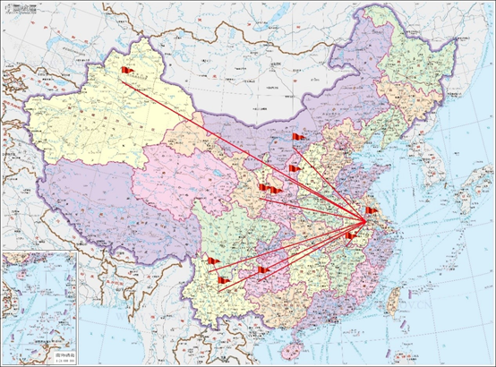

*东南大学支教地点分布图*

东南大学研究生支教团的足迹遍布大江南北，祖国哪里需要我们，我们就去哪里。历史上东南大学设立的**全部支教点**包括：内蒙古准格尔旗第一中学、第三中学、第七中学、第九中学、第十中学、民族中学、世纪中学和蒙古族学校，江西共青城西湖小学、东湖小学、甘露镇坪塘村小学、甘露镇中心小学、共青中学、红军耀邦小学，陕西省延安市延安中学、宝塔区冯庄乡冯庄学校、咸阳市武功县河道乡初级中学，贵州省平坝县逸夫小学、第一高级中学，云南省楚雄州南华县南华民族中学、第一中学、丽江市永胜县第一中学，甘肃天水第十中学、街子中学，以及新疆生产建设兵团150团第一中学。

对比各支教地服务时间，**内蒙古准格尔旗、江西共青城和云南南华**三个支教点存续时间较长，支教团在此服务的人数也比较多。而陕西、贵州、甘肃等地则只设立了一到两年就被撤销。对比这两类支教地，可以归纳出以下几个原因：

1. **第一类支教学校**对支教团队员的工作相较更加支持，**给予一定的经济或人力帮助**，支教工作可以较顺利开展，而**第二类学校**领导则相对冷淡，不太过问，或者学校较为支持，但是当地教师不太理解支教团队员举办的一些活动，**存在一定隔阂**；
2. 第一类支教学校往往**和东南大学本校存在交流合作**，如有东大老师在当地挂职等，当地支教队员与学校的交流较为顺畅，活动开展能得到更多帮助；
3. 受**每届支教地数目和所跨范围**的限制。

经过近二十年的尝试探索，东南大学研究生支教团的支教服务地点已经呈现出一种**整体稳定，试点开拓**的局面。将具有良好支教传统的学校设为稳定的支教点并不断发展壮大，设立根据地，开展多项具有延续性和开创性的活动，最大程度的实现支教的价值和意义。同时，又**每年尝试开拓创新**，在更多祖国需要的地方设立新的支教点，为西部地区的孩子带去一些改变，也为支教团带来更多生机与活力。

# 3 待遇

研支团成员服务期间，生活补贴、交通补贴、艰苦边远地区津贴、综合保障险执行**西部计划志愿者有关规定**，各地标准不一。

## 3.1 志愿者补贴

支教团志愿者服务期间，中央财政给予一定**生活补贴**，按月发放。目前东南大学研究生支教团服务地暂时固定为内蒙古准格尔旗、云南南华、江西共青城、新疆石河子，各地补贴扣除社保费用后分别为2144元、2222元、1743元、3142 元。志愿者所在服务县、服务单位也会帮助支教团解决生活、工作中遇到的实际困难和问题，有条件的会给予志愿者适当补助。例如在我校研支团服务地之一江西共青城，西湖小学发放800元/月补贴，另加课后服务费用。

## 3.2 五险一金费用

“五险一金”指的是五种社会保险以及一个公积金，按月缴纳，“五险”包括养老保险、医疗保险、失业保险、工伤保险和生育保险；“一金”指的是住房公积金。其中养老保险、医疗保险和失业保险，这三种险是由企业和个人共同缴纳的保费；工伤保险和生育保险完全是由企业承担的，个人不需要缴纳。**但研究生支教团不属于企业，故企业应缴费用也由个人承担。**

## 3.3 体检费用

体检费用由东南大学团委预支，在研支团成员到岗后，中央财政按照实际到岗人数拨付至校团委。

## 3.4 交通费用

交通费用可凭交通凭证**报销**两次往返支教地的来回费用，最高标准为航班经济舱。

# 4 相关政策

研究生支教团志愿者按照教育部有关推荐免试研究生的要求办理相关手续，**服务期间，应届本科毕业生保留 1 年研究生入学资格，在读研究生保留 1 年学籍。**东南大学研究生支教团面向全校具有推荐免试研究生资格的应届本科毕业生进行招募，招募指标由教育部专项下拨。

目前，东南大学**每届研究生支教团志愿者的招募人数暂时固定为22人**，选拔程序由报名、笔试、面试、公示、体检、报送材料等组成。具体招募条件如下：

1. 拥护中国共产党的领导，拥护社会主义制度，理想信念坚定，具有较强家国情怀和志愿精神，具有较高思想政治素质和专业能力；
2. 身心素质能胜任西部地区基础教育志愿服务工作。
3. **符合学校关于支教保研的成绩要求**：
4. 思想品德优良，**无任何考试作弊、剽窃他人学术成果以及其他违法违纪受记过及以上处分记录**。
5. 身心健康并达到体育教学基本要求。
6. 学习成绩优秀，修完并通过前三年(五年制前四年)所属专业指导性教学计划中规定的所有课程。
7. 前三年(五年制前四年)所属专业指导性教学计划中规定的必修和限选课课程平均学分绩点(按课程首修成绩计算)在**专业排名前40%**。
8. 英语水平要求**CET-6在430分及以上或CET-4在520分及以上或托福100 分及以上或雅思 7 分**(单项分不低于 6.0 分)及以上；小语种参照上述标准执行。**英语专业的学生要求TEM-4在70分及以上**。
9. **破格条件**：(1)、(2)、(3)款为必须具备的条件，不能破格。申请对第(4)款破格的学生，平均学分绩点至少在专业排名前45%。申请对第(5)款破格的学生，英语水平要求CET-4在425分及以上或TEM-4达到60分及以上或托福95分及以上或雅思6.5分(单项分不低于6.0分)及以上。至多只能在第(4)款和第(5)款中破一项。
10. 满足第1款、第2款和第3款的基础上，符合以下条件之一者优先考虑：

中共党员；
11. 主要学生干部；
12. 获得校级及以上志愿服务荣誉。

总体来看，由于大部分申请的同学都可以满足对英语条件的破格，所以研支团申报所需满足的成绩要求较低与院内免研条件，在成绩方面较为宽松。对于优先考虑的三项，大部分的研支团队员都或多或少参与过院级或校级学生工作。

但如果三者都没有沾边，我觉得也不用过早放弃，这是加分项而非必须项。

# 5 如何申请加入研支团

首先看看研支团申请需要满足的基本条件，文件来源于网站 ([https://youth.seu.edu.cn](https://youth.seu.edu.cn))

（中国共青团东南大学委员会）：

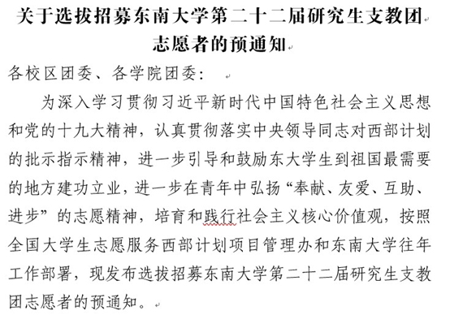

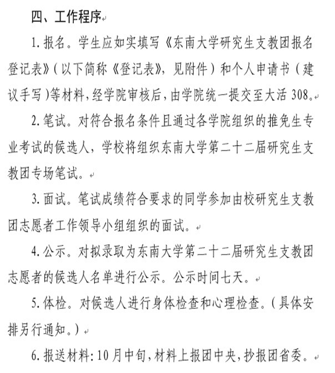

需要准备的就是前三项：**报名、笔试和面试。**学院会下发报名通知，填写登记表（如下）

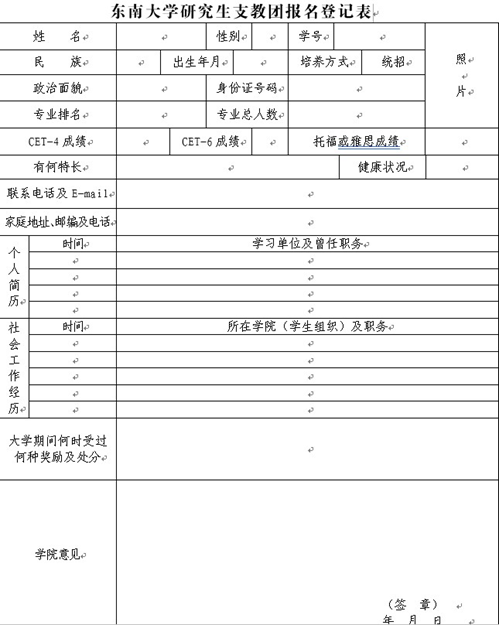

并由学院收集之后上交校团委，接下来就安心准备笔试面试就行。后面的体检以及报送材料环节在加入研支团之后会具体安排。

由于每年研支团的时间节点都会根据当年学校课程安排具体情况进行微调，这里以 2019 年研支团招募（第 22 届研究生支教团）时间节点为例。

报名时间：2019 年 8 月 28 日——2019 年 9 月 4 日截止笔试时间：2019 年 9 月 10 日面试时间：2019 年 9 月 12 日

从时间流程上可以看出，**研支团的招募时间非常紧凑，从笔试到确定入选最终名单，在两天之内全部完成。**在笔试（9 月 10 日上午）结束当天下午，就在共青团委官网上公式笔试成绩排名及面试入围名单。**在面试（9 月 12 日上午和下午）结束当天晚上，在同一个网站上公布最终入选名单（取综合排名前 22 名）。**

# 6 考核形式/申请攻略

**研支团的考核形式分为笔试和面试两个部分**

## 6.1 笔试部分：

形式每年都会有变化，但**不变的项目**有：研支团的历史（包括重要事件及杰出人物榜样）、对支教的理解（例如：你为什么想要加入研支团）、对支教过程中突发事件的处理（例如：学生突然在课堂上打架你会怎么做）和英文作文。在 2019 年的考核中新增加了党政知识选择题（例如：五位一体具体指的是什么）和活动策划题（例如：让你策划一个五四青年节校园活动）。英文作文难度不大，类似于高考英语作文，主要命题围绕对支教的理解。

总体来看，除了必须记住的知识点（支教团的历史等）以外，笔试环节着重考察的是同学对支教的理解以及对开展活动的想法，这样有过学生工作经验或承办活动经历的同学会比较有优势。由于大部分题目很主观，因此笔试成绩分差都很小，看起来难度不大但每年上 90 分的只有几个人（2019 年没人上 90），因此分数扎堆在 80—85 分，竞争还是比较激烈的。

## 6.2 面试部分

面试部分采用的是单独面试的方法，形式可以用“**一个人面对一群人**”来形容。面试官大概有 10 个，在你面前坐成一排听你表述，气氛还是比较有压迫感的。

**面试也分为两个部分：中文部分和英文部分。**

中文部分就是自我介绍，2019 年是 1 分钟自我介绍，之前几年是 3 分钟自我介绍，为了保险起见可以准备两个。

英文部分是回答问题，在进面试室之前抽取题目，有 3 分钟左右时间准备，题目内容也是关于对支教一些问题的看法或事件的处理，难度不大，流畅即可。

中英文面试大部分人都没有问答环节，进到面试室之后坐定，会有计时人员专门计时，然后就可以开始中文自我介绍了，自我介绍结束之后不用等待，调整后就可以直接开始英文回答，回答结束以后就可离开。

**关于考核的小攻略：**

笔试部分可以找往年参与过的学长学姐要一些资料，断断续续流传下来的资料也挺多的了，里面会有一些对支教团历史、杰出人物和突发事件处理的整理和总结。一般不用提早太多开始准备，**大部分人都是从暑假开始准备**，这些有标准答案的问题要好好背诵，确保不失分。在平时的时候可以多思考一些问题，关于支教的意义、关于自己的初心和关于当地支教活动的理解。

这里推荐**研支团的公众号“SEU 研究生支教团”**，里面有很多正在支教队员或往届支教队员的分享，从中可以对支教地有更深入的了解，对当地的活动开展和风格也会有更好的把握。主观题类型的考核还是建议回答问题写得全面一点，逻辑清晰有条理，字写端正，我相信问题不是很大。

面试部分建议当天稍微整理一下自己，不要穿太花太潮的衣服，精气神方面要多体现。**个人认为正装也没有太大必要，虽然会很显眼。**建议自己备一个手表，在候场的时候所有电子移动通讯设备都会被没收，可以通过手表卡时间练习自我介绍。

进到面试室的时候要自然大方，跟评委老师问好之后，可稍微调整状态再进行自我介绍。面试全程不要低头，眼神可轻扫环视，与面试官有一定的眼神交流。英文部分重点在于流畅，有一些磕绊也不用太紧张，及时调整状态。不要担心老师没有问你问题是不是因为你回答得不好，由于时间关系大部分人没有问答环节。

可以**自己备一点吃的**，因为面试时间按抽签顺序决定，中途会有吃饭时间，备一点吃的也可以补充补充体力。

---

# 开篇：东南求职规划浅析

** 陈超、王宗辉**

对于高校，其实清华北大也好，东大南大也好，职业院校也好，**决定不了学生发展的上限和下限**，只是设定了一个**符合概率分布的平均水平**——这句话同样适用于求职。

当你来到东大的时候，首先要恭喜的是你获得了一个在**求职领域里有很高的人才平均标准认可度**。

这个认可度来自于过去十年甚至几十年中东大人才的对社会塑造的基本形象，也来自于东大在对应的学科和专业建设进步，也来自于985的名头(2%的985比例放在人才市场中终归是少数) —— 这个认可度可以作为敲门砖，让你在符合基本标准的前提下有资格去向国内任何一家公司投递简历。

但同样的，我们也说过，东大能给到你的是一个**平均水平**，意味着至少学校限制不会成为你求职的门槛，意味着你有更大的概率获得一份还不错的岗位，但这份概率坍缩到你个人，上限和下限在哪，取决于**你的职业规划和为之付出的努力**。

一般来讲，我们做职业规划主要会根据两个参考维度**“行业+岗位+公司”**，在这两个维度之下，结合**“爱好+特长+发展”**，作出合理的职业发展规划。一来可以在面试中用到，另一方面可以让自己明确自己的发展方向。

如果你对自己的具体能力定位比较模糊，可以**优先选择一个合适的行业**。

就业的行业可以**划分得比较详细**，比如ICT、互联网、房地产、金融、快消等等。

不同行业有不同行业的特性，这个特性是在这个行业的长期发展中形成的**风气和规则**，比如互联网行业的996工作制、年轻人为主的风气等。

同时也需要重点关注的是一个行业的**发展空间和发展势头**。我们习惯用水涨船高来描述，如果这个行业的平均利润比价高，发展势头比较好，那么这个行业对应的所有岗位都有比较大的发展空间、比较高的收入水平。

举一个简单的例子，同样是写代码做软件开发，在互联网公司和在银行系统里做软件的收入水平、发展空间和工作风气可能都互有出入。

**如何选择合适的行业？**

一方面，可以结合自己本身的**学习专业方向**，毕竟求职的时候公司会倾向吸纳有行业背景学历的人，哪怕岗位不需要（比如我面试华为市场岗位的时候，本身不需要IOT领域专业知识的，但我的电子专业依然是加分项）；另外可以根据**国家政策**（比如在2020年的国际环境和国家政策背景下，集成电路产业就是加分产业）和**行业发展**（比如5G、人工智能等有较大发展前景的行业）来进行选择。

当你明确了一个准备投身的**行业**之后，可以**重点关注这个行业的公司**，关注他们每年的招聘人数和岗位比例、岗位要求，选择自己适合参与其中的岗位。

同时另一方面，如果你是先确定了自己适合的**岗位方向**，也可以以此来重点进行职业规划，比如你确定自己就要做客户经理方向、就要做产品经理方向、就要做软件游戏开发等，那也可以**整体了解这类岗位的素质和能力维度要求**（相信我这大概率是大学课程所不能培养的能力），然后在此基础上**选择合适的行业**（有你的岗位要求，同时行业条件较好）。

当然，以上建议都是建立在你不确定自己喜欢什么行业、喜欢做什么岗位（简而言之，对你来说做什么都行）的前提下，如果你已经有确定的热爱，那么，坚持你的热爱！

---

# 1 东南大学2019年就业报告浅析

- [1.1 本科就业比例相对小](#7gzdzy)
- [1.2 数字上的就业率接近100%](#43gxde)
- [1.3 前十就业城市没有北方的，1/3的毕业生选择南京就业](#62b7hb)
[1.4 本科就业中，每四个人就有一个去了IT业](#8gzsvr)

感谢东大的就业指导中心等官方组织，每年都投入大量的精力在东大毕业生的就业统计分析上，按年发布详细的《东南大学xx届毕业生就业质量报告》，通过对相对全面的学生和企业样本进行分析并得出了很多有参考价值的结论。

然而实际上，不得不说，可能有不止一半的同学整个本科四年都没能认真看一眼这份报告，然后糊里糊涂地毕业，成为其中的分母之一——我就是这样子，有点遗憾。

其实我建议这份就业质量报告要**越早看越好**，最好在你刚上大学刚要做职业规划的时候，就仔细的研读一下。了解你所在的发展平台的平均水平和一般培养规律对做职业规划十分重要，所以我们接下来决定拿出本章中比较大的篇幅，来对last的2019届毕业生就业质量报告做解读。

原文件链接：[《东南大学2019届毕业生就业质量报告》](http://seu.91job.org.cn/attachment/seu/ueditor/file/20191231/9087_%E4%B8%9C%E5%8D%97%E5%A4%A7%E5%AD%A62019%E5%B1%8A%E6%AF%95%E4%B8%9A%E7%94%9F%E5%B0%B1%E4%B8%9A%E8%B4%A8%E9%87%8F%E6%8A%A5%E5%91%8A.pdf)

## 1.1 本科就业比例相对小

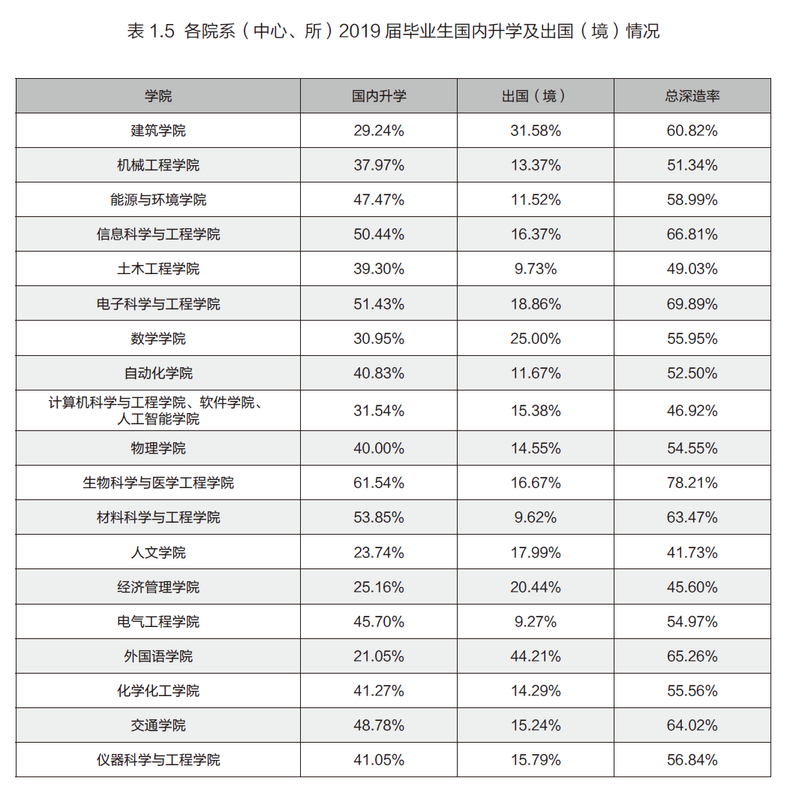

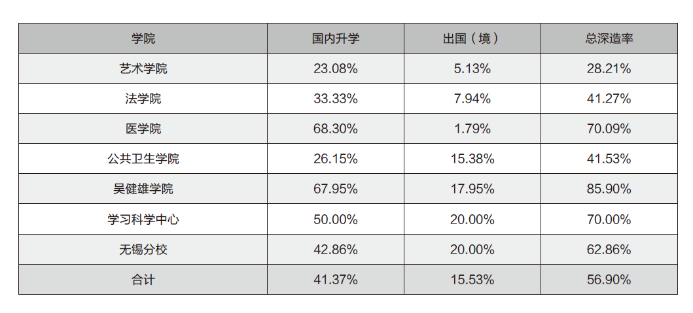

从图中我们可以看到，东大的本科毕业生中，**平均深造率达到了56.9%**，多数学院的深造率在50%-60%之间波动，而选择在这一阶段中就业的同学只有32.9%。

这其实也不难理解，东大等多数985层次综合学校都是**重学术、重科研**的，本身的多数本科教育就是为学生的深入科研和深造打基础，本身涉及到的和行业企业接轨的学习和实践环节少之又少。

## 1.2 数字上的就业率接近100%

涉及到就业率这样一个数字的话，其实想必每个同学在填报志愿之前，都会去各个学校的一个简介中看一下相关数字，这个时候其实你会发现和东大平均水平的985学校，基本都是达到了100%的就业率。

物以稀为贵，当你发现大家都达到一个同样的高水平的时候，对于这样一个数字其实就不必深究了。毕竟在我们整个就业环境中，985高校的毕业生终归是少数，只要你愿意去找工作总会有岗位提供给你的。

近几年来包括东大的毕业生群体中有的就业难的声音也并不是因为大家**“找不到工作”**而是**“找不到符合预期标准的工作”**。

对于动辄100%的就业率数字，我的建议是**忽略掉它**，它绝对不是你躺赢的保证，最多能在心态崩了的时候安慰安慰自己。

你要清楚的是岗位的待遇水平和发展空间是**参差不齐**的，另外其实对于学校来说就业率的话也是一个评价的硬指标，所以的话学校也会尽更多的“办法”帮助学生去找到一个工作，但是不保证水平。

## 1.3 前十就业城市没有北方的，1/3的毕业生选择南京就业

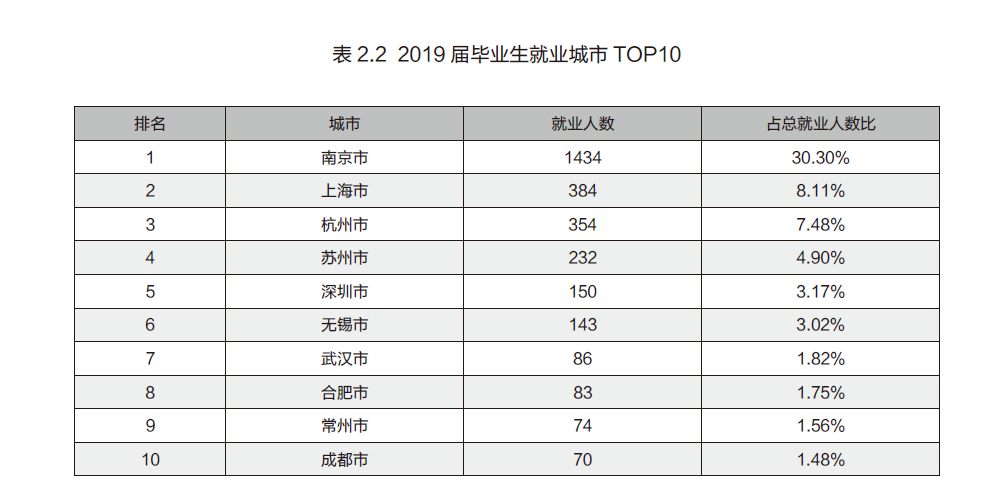

而涉及到每一年本科生就业的地区分布，这份报告的结果又有比较浓厚的东大特色。

首先从就业取向的前十大城市中我们至少能得出以下结论：

1. 前十的城市（近总人数的60%）中，没有任何一个北方城市。
2. 主要分布在长三角或者沿长三角经济带城市，珠三角地区也有一定分布。
3. 留在南京的毕业生占比高达30%，每三个东大求职的毕业生，就有一个会选择留在南京。

整体城市分布情况和**我国城市地域产业发展**、以及**东大毕业生行业分布**相吻合。东大毕业生中相当大概率前往比如说互联网业、信息服务业、先进制造业等领域,而这些领域更多的是分布在南方以长三角经济区和珠三角经济区和沿长江经济带为主，北方该类产业较少，没有北方城市也情有可原。

而对于东大的就业毕业生中，每3个人中就有一个会选择**留在南京**，可能很多人对这个数字是比较惊讶的。毕竟南京这座城市的就业环境并不是特别好，在整个长三角地区中，南京是被其称为互联网沙漠的。同时的话，南京的物价房价又不输给任何一个同层次的二线城市，甚至处在其中的高位。

但存在即为合理，之所以有这么多毕业生选择南京这座城市，就必然有选择的理由。相信一方面是因为在多年在南京的读书生活中，南京这座城市给同学们带来了更大的归属感和依附感。另一方面可能也是是因为东大的“区域知名性”（至少在南京，东大毫无疑问是很出名的嘛）。

同时，南京这座城市目前仍在**快速发展**中，不止互联网行业，南京的集成电路产业、半导体产业等领域都是国家的重点发展城市，而且南京这座城市本身的人文气息、文化气息又非常的浓厚，生活压力的话也小于北上广深等一线城市，基础设施建设也非常完善。

## 1.4 本科就业中，每四个人就有一个去了IT业

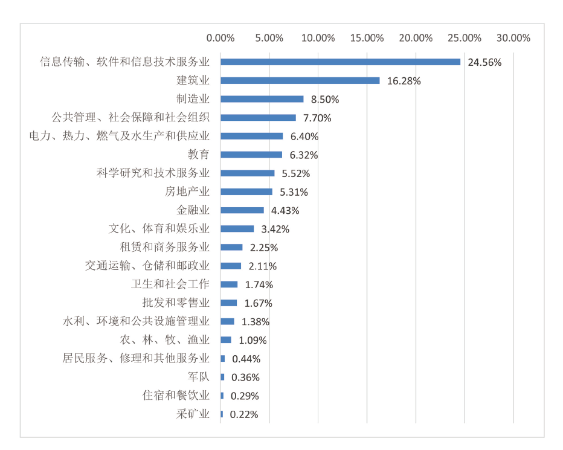

在东大的本科就业中，每四个人就有一个人选择了IT业，而在东大的硕士就业中这个比例提升到了40%，几乎是每两个人就有一个人前往IT业求职——其实也没太多好意外的，毕竟条条大路通CS……

近年来随着移动互联网的高速发展、华为中兴等IT巨头业务和体量增大、5G等建设推广，水涨船高得让**IT领域能提供更多的岗位和更高的薪资**。

而且传统制造业、建筑业行业趋于饱和，吸引更多的人转入**新兴行业**。

---

# 2 求职观念

- [2.1 更高的学历＝更好的就业机会 ？](#dakypp)
[2.2 更好的学习成绩＝更高的薪水？](#37ohpo)

## 2.1 更高的学历＝更好的就业机会 ？

**不一定**，对于**非技术类岗位**尤其如此。

比如销售、运营、产品等岗位对学历并没有强要求，而且在工作压力很大的行业中，年轻三岁意味着更强的学习能力、更多的精力体力（加班hhh）、更多的婚前时间。

## 2.2 更好的学习成绩＝更高的薪水？

这里存在的一个根本问题是，东大以及多数高层次高校的本科教育的出发点本身就**不是为企业培养员工**，学校所传授的知识也好、设立的考试体系也好，目的在于**培养有更高科研能力的人**。

矛盾就在此，**并不是所有人都适合科研**，有太多人考大学、选专业本身的目的就是为了找一个薪水更高的工作——这也无可厚非，不同人的成长环境不同，追求不同，谁也没必要站在高地上指责谁。

简单讲一个故事，我的一个信息的朋友，在自己大二挂了一科确定自己不能保研之后，就下定决心要本科毕业后直接找工作。之后的所有学期里，考试都以60分作为目标，其他所有的时间用来参与实习。最后实现了在面试的时候已经有了6份实习经历，他最后也如愿地拿到了华为那一年在华东地区最高的薪资offer。

企业是**逐利**的，它希望的是员工能为自己**创造实实在在的商业价值**，而不是帮助公司在一场考试中考一个更高的分数。

所以在实际的求职面试中，无论是技术类还是非技术类岗位，你会发现企业也基本不会看重面试者的学习成绩（甚至挂科也不会在乎的），更多在乎的是你在求学期间所**参与的项目**、**做过的事情**，如果这些事情是和企业的岗位需求有较大的**契合度**，并且你在其中**发挥了较大的价值**、**体现了自己的能力**，那就足够了！

---

# 3 求职方法论

- [3.1 信息获取技巧](#1whcsd)
- [3.2 简历技巧](#4fbwho)
[3. 面试技巧](#cdsxz7)

团队成员有限，希望更多人能参与到其中的建设（欢迎联系 微信/电话：15852980022，微信 jianglaoshiSEUNJ）

## 3.1 信息获取技巧

东大的同学求职，建议主要以下三部分信息来源即可：

1. **对应公司的官网**

（不必迷信求职类公众号，东大同学所选择企业一般是比较集中的Top企业，到对应的官网完成招聘投递和招聘流程即可）

1. **对应公司的校友群、东大的公益求职互助群**

（不必迷信各位收费的求职群、内推群，东大的校友足够提供各个行业各个公司的内推资源；另欢迎加入Talent+东大公益求职互助群，加微信15850606321注明身份拉群）

1. **东大就业办官网和院系年级群导员发布的求职信息**

（这类信息主要是针对东大的学生甚至是针对特定学院的，所以具有较高的针对性，而且人岗的匹配性和面试通过率较高）

## 3.2 简历技巧

简历**内容为王**，陈述形式为辅，排版和设计尽量**简约**。

简历模板建议模板网站（非广告，有更好的简历模板平台欢迎推荐）：[超级简历](https://www.wondercv.com/)

## 3. 面试技巧

对于求职面试而言，现在一般的面试流程都有3-5轮：

1. **群面**（无领导小组讨论）
2. **专业面试**（或者是业务面）
3. **综合面试**（公司业务部门相对较高级别的领导来做面试官）
4. **HR面 **，部分公司或岗位可能有语言能力面试。

关于面试，无非是**面试前准备**和**面试过程中的随机应变和发挥**两部分。

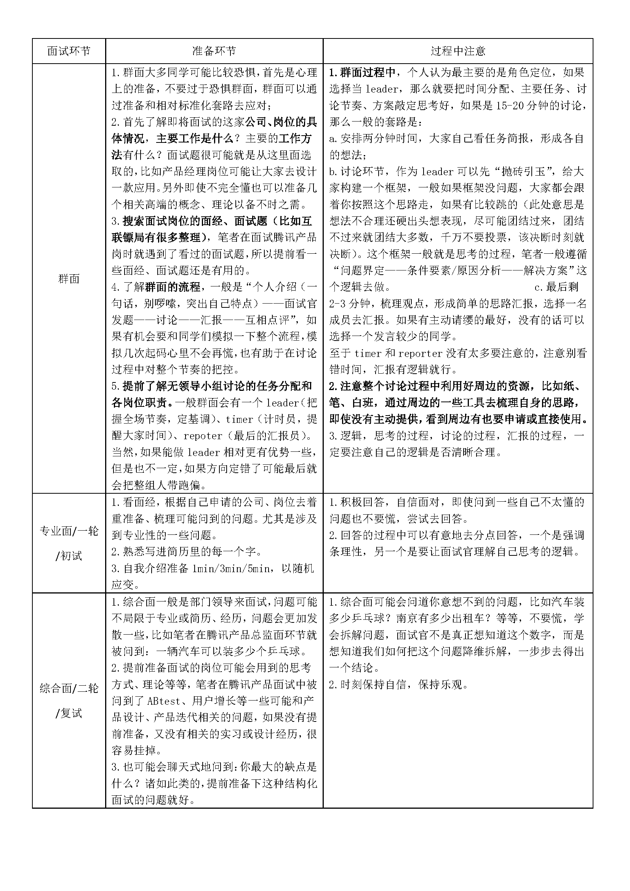

---

# 4 关于职业规划

**陈立锦**

从宏观路上来说，抛开家庭背景因素，合理的职业规划要考虑三点：**个人专业方向、个人性格特点、国家重点发展领域**。

踏上历史进程，个人踩上风口，有机会实现自我价值和相应物质回报。但这一点，就需要**多维度的尝试和探索**。传统学科发展缓慢，不管转专业还是转行工作，大家都要有勇气走出去。不要保持线性思维，我学什么，就只能做什么。

了解国家未来**重点发展方向**，判断自己**专业契合度**，及时**调整自己专业方向**。优先考虑转专业，转专业不成，考虑转行工作，跨入相关领域企业实习，寻找工作机会。

最终就业时，考虑自己**性格特点**，判断自己是适合做**研发**，还是做**销售**。销售和研发是一个企业最为重要的两个岗位，前者意味着企业今天能不能活下来，后者是企业未来能不能活下来。

---

# 互联网运营岗

- [1 行业选择——进入互联网产业的心路](#fzwd3a)
- [2 岗位选择-运营岗](#cj02sx)
- [3 互联网技术岗和非技术岗的比较](#8n1vdw)
- [4 不一定要进入互联网行业](#ayy0j7)
- [5 非专业的如何找互联网大厂实习呢？](#6vz2h0)
[求职建议](#ep3zpv)

**杜亮 东南医学院 2019届**

在校期间曾在苏宁易购、腾讯手Q校园圈实习；拿到阿里巴巴-菜鸟网络城市运营管培生offer实习并就职。

### 1 行业选择——进入互联网产业的心路

我虽然是医学院的，但是学的是生物工程专业，也是工科背景的同学。在大一的时候我参加了苏宁云商的实习，第一次接触到了互联网公司，发现自己对工作环境和行业前沿的一些内容比较向往。

另外，在学习的时候觉得对自己的专业不是很感兴趣，而且在转专业的时候遇到了阻力，所以也相当于坚定了做更多的实习来慢慢地向这个行业踏进。

### 2 岗位选择-运营岗

运营岗其实包括的内容也很多，例如**线上渠道、销售、客户、数据产品运营**等等。

我现在做的行业渠道运营倾向于销售和商务拓展这种。因为自己在大一实习的时候，对公司环境比较了解，另外商务洽谈的机会也比较多，同时也参与了对接学校社团和公司的工作。因此，我也具有了更多的对接、洽谈这样的经历和相应的能力。所以选择了这个岗位。

### 3 互联网技术岗和非技术岗的比较

首先是**了解一些背景信息**，尤其是不在校内发生的一些实时情况，这些可以通过**公众号、哔哩哔哩、抖音等**渠道来了解。

第二点就是拥有了这些信息之后，要看自己对这个**感不感兴趣**，例如哔哩哔哩的盈利方式等一些问题。

而后可以考虑是否和自己的**专业匹配**，考虑一下自己行业中哪些公司和互联网行业相匹配，例如能环学生的话可以考虑海康、支付宝蚂蚁森林这样的地方。

在这些考虑清楚之后，可以进一步**增进自己的简历**，用实习来丰富简历，或者参与一些在校内的活动。

我觉得最重要的还是前面两个点，**信息搜集和决策能力**。

### 4 不一定要进入互联网行业

首先要知道这样一个问题，互联网的光鲜亮丽是摆在明面上的，但是实际上情况可能并不是自己想象那样的。这个又牵扯到之前说到的实习，大家可以**通过实习来了解这个行业真正的样子**，以及自己的兴趣点到底在不在这个上面。

其次就是建议大家在开始的时候**眼光放的宽一点**，例如金融、房地产、外贸、国企或者是银行等等也是可以作为备选项。如果一开始就把眼光收的很窄，会影响自己的选择。

还是建议先把**信息搜集**好，考虑当中的**模式和机理**，然后可以通过**公众号和up主**来了解。当你看不进去这些文章的时候，可能自己的兴趣不是很大，就不是很适合这个行业。

### 5 非专业的如何找互联网大厂实习呢？

可以考虑看一下**boss直聘**，**58同城**这样的网站。除此之外，东南大学也是一个比较好的平台，可以利用好这些优势。

实际上，应届生要做的工作好多时候是很low的，**不要眼高手低**，否则兜兜转转反而浪费了时间。

另外也要尝试打开心门，**接纳社会上交流的不适感**，如果这种角色转变比较成功，在实习的时候收获就会很大。

### 求职建议

因为我是直接转正的，所以我想从阿里对人才的要求来聊聊自己的看法。

阿里对于应届生要求有这样四点：**聪明、乐观、皮实、自信**。我觉得还是总结的比较到位的。

**聪明**就是说院校出身比较好，年级排名可能要年级前三十这样；**皮实**就是说自己在校的时候最好要有一些社团经历，再比如说阿里是有一个三个月的试用期的，在这个过程中肯定会遇到一些挫折，是否能够很好的克服也可以证明这个人是否是皮实的。而**乐观**和**自信**我想指的就是自己在每个阶段都会有一些考核，对自己成长和反思以及下一阶段努力的方向。

除了这些之外，对于不同的岗位也会要求一些**专业知识**。例如政务岗位，会要求一些法律相关的知识。再比如用户型的产品经理，虽然不是专业的技术岗，但是也要求有一些基础的代码能力，可以和技术人员去交流。这些在岗位的介绍上也都会有要求，大家可以重点关注一下。

在校的时候同学们可以**主动一些**，接触一些社团和社会上的企业最好不过啦，即使是出去玩一玩，打开自己的认知也很不错。

当你为这些考虑的时候，实际上就已经是一种进步了，而有了这种意识，好多事情就更加的顺理成章了，例如在刷手机的时候也会更有倾向的关注一些行业信息，逐渐地就会越来越明朗。

当然，这些也和生活环境关系很大，平时可以多接触一些关于求职类的信息。

---

# 互联网前端开发岗

- [1 秋招的过程](#e86l8e)
- [2 求职准备](#6m1l6l)
- [3 求职前端开发工程师建议](#dm3u1d)
- [4 前端开发推荐的书目](#86pud2)
- [5 学校里如何锻炼前端开发的能力](#r3600)
- [6 推荐学习方法](#4fooog)
[7 推荐求职方法](#2t40an)

**杨昱昊**

现美团小象事业部前端开发工程师；2019年春季取得阿里巴巴钉钉前端开发实习生offer并参与暑期实习，秋季取得并接受美团offer

### 1 秋招的过程

刚开始的时候不是很顺利，秋招刚开始的时候目标不是很明确。春招的时候能幸运地拿到了实习offer，在一段时间的实习后，因为比较大的工作压力选择离开。秋招就短暂地失去了目标，胡乱投过许多简历，没有有针对地准备，也挂了几次笔试面试。

后来去了XXXX实习，意识到在这样“舒适”的环境下各方面成长都很慢，最终还是选择了美团的offer。

### 2 求职准备

首先是准备比较充分，因为没有准备继续读研，在求职方面有一个**长期准备**的过程；同时因为**“广撒网”**，经历了多次面试，也不会有紧张情绪的的影响，临场发挥比较稳定。

比较多的**校内项目实践**以及有一段在钉钉的**实习经历**，可能使我在准备的时候更多考虑一些项目中实际会有的问题，以及一些更加有深度广度的问题。

### 3 求职前端开发工程师建议

前端有一个大家调侃的说法是“前端娱乐圈”。因为前端这方面新的框架，新的技术层出不穷，所以要做好**长期学习**的准备。

一般来说，前端是**“易学难精”**的，相比其他职位可能入门简单一些。所以在平时多多积累，在面试过程中体现出自己**掌握技能的深度和广度**可能有助于得到面试官的青睐。

除了前端之外，面试官也会通过**做过的项目**、**学习成绩**以及**比赛**等来考量你的学习能力，这是对一些前端开发能力稍弱的同学的一个**校招buff**，如果学习能力不错，比较有潜力，也是可以得到面试官的认可的。

### 4 前端开发推荐的书目

不仅是“前端”，其他类型的开发也是一样，**通过网络学习**可能是更好的学习方式，因为有些知识技术更新很快，纸质书和不会更新的电子书不太具有时效性。

除了**阅读官方文档**（如Vue官网，React官网，WebPack官网等），在一些**技术社区中阅读博客**之外，也可以关注一些**知名前端团队/知名大牛的博客或者专栏**，如张鑫旭、云谦、腾讯AlloyTeam、腾讯IMWeb、京东凹凸实验室、蚂蚁金服体验科技知乎专栏等等。

有两本比较经典的书，**前端红宝书《JavaScript 高级程序设计》**，和**犀牛书《JavaScript 权威指南》**，一方面可以在语言特性方面更加深入，另外也可以作为一个“词典”，有指向性地去翻阅学习。

### 5 学校里如何锻炼前端开发的能力

我们学校并没有具体开发技术的选修课程，所以要自己去**做一些小项目**。

首先可以出于兴趣**自己做一些项目**，如果能够坚持长期维护就更好了；其次，在**日常课程的大作业**和**实验室的项目**中，有时会需要一个网站/网页，这时候就是一个比较好的动手机会；另外，在一些**比赛**中常常会有需要做网站或者混合应用开发，这个也可以利用起来。

另外，**加入一些社团**也会有帮助。我也加入了我们学校的**小猴偷米**，虽然没有写多少东西，但是在这个过程中确实学到了不少。

最近做的一件事是参与到了**“校友圈”**项目的开发中，五湖四海未曾谋面的几个人一同开发了一个顺利上线的项目，也因为这个认识了很多新的朋友，得到了为大家做分享的机会，这个可以说是比较自豪的一件事。

### 6 推荐学习方法

首先要**知道你想要学什么**。如果真的不知道，不同行业有不同行业的途径。

对于程序员来说，会有一些**开源的社区**，这里有一些博客和文章，可以进行学习。除了这个途径，参加一些**业界比较前沿的会议，论坛，活动**，可以拓宽自己的眼界，让自己知道需要去学习什么。

有了学习目标之后。可以看某一个技术**官方的文档和说明**。这个途径我个人认为是最好的，因为官方的东西，比较**深入浅出**和**规范**。同时还可以搭配**别人的一些文章**进行学习。对于确实摸不着门道的知识和技术，可以看一些**别人录制好的视频**，边听边看边做，效果也是不错的。

最后，在学其他东西的时候，要**真正把它用起来**。

我还会在学习完之后，**尝试去写博客**，如果自己能很清楚地把文章写出来，能证明自己学的深度达到了。

### 7 推荐求职方法

学校会有求职招聘内推的大群，另外一些公开的招聘网站，还有公司的招聘公众号和网站，都可以找到一些信息。

---

# 互联网游戏开发岗

- [1 工作规划](#4gyh8m)[1.1 学习、工作和生活的平衡](#co9hlt)
- [1.2 读研还是直接工作的思考](#2gbmn1)
- [1.3 工作规划](#5fpbpu)

[2 经验总结](#f1k36s)

- [2.1 实习经验分享，第一份实习](#8wti5i)
- [2.2 offer取舍](#g0lwx1)
- [2.3 腾讯实习趣事分享](#af9wyq)

[3 写在最后](#abu72n)

**李煜炜 东南大学软件学院 2020届本科生**

目前在腾讯和平精英项目组担任游戏客户端开发，绩点排名前十，曾经拿到过腾讯、网易等一线大厂的offer

### 1 工作规划

#### 1.1 学习、工作和生活的平衡

我主要是利用**暑期**去实习，所以没有很大的冲突。我一直认为**该学习学习，该玩就好好玩**的原则。每周末抽出一天时间完全的休息放松，一般玩玩游戏、看看电影、品尝美食之类的，其他时候都好好工作学习。

#### 1.2 读研还是直接工作的思考

我认为读研与否与未来的**生涯规划**确实关系很大。

我的目标岗位是游戏开发，所以也问了一些有经验的人，他们说其实游戏开发未必一定要硕士背景，好多东西也是在工作当中学的。

当我拿到这个让我很满意的offer的时候，我想要抓住这个机会，因为即使我选择了继续深造最后可能也是得到一个类似的offer，毕竟机遇不等人，所以我放弃了继续深造，进入腾讯游戏开发的项目组。

#### 1.3 工作规划

长期的规划目前还是没怎么考虑的，短期内我希望可以在入职之后能够努力工作，达到更高绩效，达到一个绿色通道的考核标准，实现更快的成长。

对程序员来说，工作也是学习的一部分，我想的是在工作中多多学习，现在大厂普遍是996，所以更倾向于**提高工作效率**，挤出一部分时间进行**系统性学习**。

### 2 经验总结

#### 2.1 实习经验分享，第一份实习

其实我最开始的时候对专业的细分领域并没有一个很好的认识，所以我从大一到大三几乎尝试了所有的细分领域，例如APP开发、人工智能深度学习、以及游戏开发等。最后觉得自己对游戏开发更感兴趣，所以将求职意向确定在这个领域上。

我之前没有游戏开发经历，但是在大三下刚好有一个机会，有人发起了一个游戏项目，我就加入了进去，大概工作了半年的时间，在这里面积累了一些经验和技术。

最后在面试的时候发现，大厂很关注这方面，如果有一个**成熟的项目经历**，实际上是非常非常加分的。

#### 2.2 offer取舍

面对手头的offer，当时我也很纠结，薪资其实不是我最关注的点，主要考虑的是**留用率**，**意向城市**，还有**在各个部门的发展前景**、**未来的稳定率**等。综合这些，我最后选择了腾讯。

#### 2.3 腾讯实习趣事分享

我记得项目后期有给每个人一个课题，我最大的收获就是逼着自己不依赖搜索引擎，依赖一些一手资料，比如论文什么的来解决问题。

这可能是许多本科生如果不做科研就很难遇到的一个挑战吧，也是之后的工作中会遇到的问题。当网上没有可靠资源时，必须靠自己摸索。

### 3 写在最后

想进入大厂的话，先要找好自己的**意向方向**，在这个**细分领域**中不断地去**深入挖掘**。

如果有机会**参加一些比较大型的项目，**尽可能去**多积累一些有价值的经历**。这实际上是一个比较长期的过程，你需要花半年甚至提前一年去做准备，但是会对你未来的求职过程会很有帮助。

在本科期间可以尝试**SCN**，有利于提高算法水平，在SCN大赛中拿奖对今后面试一些国内大厂也会很有帮助。如果不打算参加这些竞赛，可以尝试一些大厂举办的**软件精英挑战赛**，积累经验。另外，一些**面向全校的校内项目**也很有意义，帮助我们了解如何从用户角度出发去考虑，和用户打交道就会积累很多实际经历。

---

# 互联网产品岗

- [1 关于产品经理](#atorj9)[Q1：学长的专业是交通方面的，为什么会选择产品经理这个岗位呢？（产品经理岗位必备的素质要求有哪些？）](#ecrf1k)
- [Q2：上次分享会您说其实产品经理有门槛的，能够浅谈一下腾讯的门槛吗？](#3fgz39)
- [Q3： 产品经理经常会和运营、开发沟通，有时候甚至会发生一些不愉快，这个时候有什么好的解决方法吗？](#54gbr4)
- [Q4：产品经理的一天是怎么度过的呢？（您的日常工作内容是什么？）](#e89083)
- [Q5：产品经理是个很辛苦的岗位，会占据我们大量的时间，您是怎么平衡工作和业余生活，在业余生活都有什么兴趣爱好呢？](#b6l4bd)
- [Q6：《人人都是产品经理》那本书中提到过，10年以后，也就是2026年产品经理这个岗位就不会那么多了，会和硅谷那儿一样，都是能力超强的产品经理，像产品小白这些就几乎灭绝了，你怎么看待这个观点呢？](#e8wuz5)

[2 求职准备](#9dafe4)

- [Q1：大家都梦想着去互联网巨头企业工作，那么怎么才能有机会进入BAT这种大厂呢？](#2mmy7f)
- [Q2：现在暑期实习的竞争相当激烈，怎么有机会在暑期实习里面脱颖而出呢？](#4lwwed)
- [Q3：产品经理这个岗位需要很好的产品sense，那么怎么培养自己的产品sense呢？](#c1vvg2)
- [Q4：网上流行一句：懂技术的产品经理更吃香。那么请问一下怎么做到“懂技术”呢？](#48dzju)
- [Q5：在面试产品经理岗位时，需要提前做好哪些准备工作呢？](#4bb1ld)
[Q6：经常会听到hr在面试时会问，你最喜欢的一个app是什么？针对这个问题，学长会怎么去回答呢？能否提供给我们一个好的模板？](#4da9aa)

**肖若愚 交通学院2019届毕业生**

现任腾讯信息流商业策略产品经理，负责腾讯看点业务广告、游戏分发等商业化相关策略工作。校招期间拿到腾讯、网易、招行、爱奇艺、咪咕等互联网产品经理offer。

### 1 关于产品经理

#### Q1：学长的专业是交通方面的，为什么会选择产品经理这个岗位呢？（产品经理岗位必备的素质要求有哪些？）

在校期间我和一些小伙伴做了很多**尝试**，包括一些创业项目，和小程序刚刚兴起的时候，我们也做了一些实践。在这些经历的逐渐积累中，渐渐觉得产品经理这个岗位是适合自己的。所以也鼓励大家通过实践来找到心之所向。

关于产品经理所需要的一些品质，最大的一点要求是能沉下心来**发现事物背后的逻辑**。举个简单例子，当你拿到一个新的产品时候，你的第一反应是自己去摸索去挖掘而不是参考说明书。

#### Q2：上次分享会您说其实产品经理有门槛的，能够浅谈一下腾讯的门槛吗？

**针对不同领域的产品，这个门槛可能是不太一样的。**

举个例子，做策划类的产品经理，关注点主要在一些交互界面以及功能设计等，求职这类产品经理可能需要求职者展现他有创意和有经验的一面。相对的，做AI，区块链或者平台类的产品经理，这类对技术背景是有一定要求的。

#### Q3： 产品经理经常会和运营、开发沟通，有时候甚至会发生一些不愉快，这个时候有什么好的解决方法吗？

**各司其职**，好好做呗。

在实际工作中，我们要去**换位思考**。比如运营喜欢从商务的角度去思考，提一些感性的需求，这时你就要去多和他们沟通，做好前置、排期、上线等工作；而开发是技术流的，你要做好接纳和解决他们的疑问和挑战，所以建议大家在把方案给他们之前，多做一些**前置沟通**，让他们觉得你不是在闭门造车，而是真正地在和他们**用心谦虚地交流**。

其实在大厂的话，产品经理与他们的沟通还是挺顺畅的，**大厂的环境好，也够专业化**，所以大家彼此之间很有**信任感**；而在一些小公司里面可能因为环境比较一般，大家对自己可能比较自信，所以在日常工作交流中会出现分歧矛盾

#### Q4：产品经理的一天是怎么度过的呢？（您的日常工作内容是什么？）

第一个是**需求收集**。当产品产生迭代时，往往是要更新它的功能点，产品经理要挖掘这些需求。当收到大大小小许多的需求时，也要注意实现这些需求的**优先级**。通常有这样一些途径：第一个是产品经理日常的积累和思考；第二个是用户提出的需求；第三个是合作方比如说运营提出的需求；第四个是老板提出的需求。

第二个工作内容是**需求策划**。在确定了需要实现的需求后，就要考虑相关的各个细节。假如微信决定做视频号，就要考虑视频的格式，点赞，评论功能等等。

第三个工作内容是**需求评审**。把整理后的结果向运营，技术，老板等工作伙伴展示，他们就会来评审方案的可行性，实现方法等。可能也需要同步的对方案进行修改。

等通过了需求评审，就可以来进行**开发工作**，这就是第四个工作内容，即**研发跟进**。这主要是在扣一些细节，确保环环相扣，顺利完成开发任务。

等到了第五个步骤，**上线验证**，邀请一些内测用户来验证这个功能点，收集他们的反馈，检测一些使用数据，据此来判断这个功能点的开发是否达到了目标。如果没有，就要考虑进一步的**优化**工作，这就回到了第一步。这就是产品经理工作的日常流程。

当然还有第六个工作内容，是对一些**日常问题的处理**，过去已经推出的各种功能也会有bug出现，这也是产品经理需要关注的工作。

#### Q5：产品经理是个很辛苦的岗位，会占据我们大量的时间，您是怎么平衡工作和业余生活，在业余生活都有什么兴趣爱好呢？

现在的互联网公司多是996，我这边现在是10105的安排，工作日期间，下班后基本也到了休息时间。休息日就可以和同事朋友聚聚餐，玩一玩狼人杀。

互联网的工作时间是**有弹性的**，你完成了任务，或者你今天过生日，女朋友过生日，兄弟来找你，老板也允许你可以提前下班。所以也**有足够的空间来把握自己的生活节奏**。

#### Q6：《人人都是产品经理》那本书中提到过，10年以后，也就是2026年产品经理这个岗位就不会那么多了，会和硅谷那儿一样，都是能力超强的产品经理，像产品小白这些就几乎灭绝了，你怎么看待这个观点呢？

我是比较**赞成**这个观点的。

第一点，以前如果你比较聪明、逻辑能力强，会画一些原型图、写分析报告的话，你就很有机会进入这个行业。但是现在随着互联网行业的饱和，产品经理岗位的成熟，**门槛也越来越高了**，比如阿里更喜欢去社招。

第二点，现在产品经理岗位也越来越**“垂类化”**了。比如它会分成商业化策略产品经理、短视频内容推广产品经理等，所以它也更加看重你的**专业能力**，而你需要做的准备工作也要越来越多了。

## 2 求职准备

#### Q1：大家都梦想着去互联网巨头企业工作，那么怎么才能有机会进入BAT这种大厂呢？

首先，**不能好高骛远**，对于毫无经验的人来说，需要一年的时间规划准备，我个人感觉对咱们东大学生真的不难。

其次，针对**产品岗**，学校的一些项目给我们提供了很好的机会。比如小猴偷米、校友圈等。

最后，虽然南京的互联网大厂比较少，比不上北京深圳，但是去苏宁、途牛等公司**实习**也是不错的选择，而且门槛比较低，在里面积累实习项目经历会对你的求职很有帮助。

#### Q2：现在暑期实习的竞争相当激烈，怎么有机会在暑期实习里面脱颖而出呢？

现在实习求职都有一个**“二八效应”**，就是20%的人拿到了80%的Offer。但其实，竞争也没有想象中的激烈，现在中国的大型互联网也挺多的**，**多去准备，暑假实习还是很有机会拿到的。

虽然厉害的人的确有过人之处，但是机会对大家来说都是均等的。你可以针对你想去的具体岗位做**针对性的准备**，多搜集相关信息。

以腾讯为例，除了网上投简历之外，还有一个**“霸面”**的方式。就是面试官如果去南京面试的话，你可以提前了解他入住的酒店，找机会和他沟通交流。这也算是搜集信息给我们带来的好处。

#### Q3：产品经理这个岗位需要很好的产品sense，那么怎么培养自己的产品sense呢？

做产品，**不能限制自己的视角**。如果沉浸在自己的工位或者家里，怎么能做出用户喜欢的产品呢？

以这次疫情举例，公司招募了志愿者去一线做一些交通服务资料服务等等，经过**实地考察**，才能知道用户的需求。

经过一些**实践项目**的考验，才会对产品sense有更好的理解，会逐渐产生自己的方法论。

#### Q4：网上流行一句：懂技术的产品经理更吃香。那么请问一下怎么做到“懂技术”呢？

想要提高你的技术能力，就需要做**针对性的准备**。

比如你想去从事数据产品经理，那么你就需要先去学习一些数据库原理，SQL等技术，然后再去学习前端、后台方面的知识，做到互通有无。

**实操**也很关键。因为你只看了一些理论知识，理解的会比较浅，在实际沟通中，对方可能会觉得你比较自以为是，对你留下不好的印象。而实操不仅能让你对理论知识理解的更深，还能让你用最少的时间去达到最好的预期目标。

#### Q5：在面试产品经理岗位时，需要提前做好哪些准备工作呢？

其实对所有岗位的面试准备工作都是相似的，最重要的是**弄清楚面试流程**，针对不同的面试流程和类型也有不同需要注意的地方。比如说群面，群面的特色是人多机会少而且刷人也多，所以应对群面时，要确定自己可以扮演的角色，比如说参谋还是leader这种，就可以做针对性的准备。

还有一些tips，比如做一份通透的简历并随身携带，适时递出名片，主动和面试官交流等。

同时，可以询问一些已经在公司就职的学长学姐，他们也会提供很多有用的建议。

#### Q6：经常会听到hr在面试时会问，你最喜欢的一个app是什么？针对这个问题，学长会怎么去回答呢？能否提供给我们一个好的模板？

我建议做好一下两点。

第一点，你要选择一个**自己体验多又不大众的app**，最好它能和时下的主流渠道相结合，比如像Normal、盒马等新颖的app；

第二点，在分析它时，你首先要考虑到它的**用户群体**是什么，并且针对用户需求它做了哪些**针对性的调整**；然后考虑一下**用户群体和它的功能契合点**有哪些；最后点出它的**亮点和细节。**

---

# 互联网软件测试岗位

- [1 在校期间一定要多经历](#4xr5vh)
- [2 找工作前一定要有清晰的目标与坚定的信念](#7oi7kl)
- [3 找工作时一定要注意信息收集与整理](#1mlhr9)
[4 一定要有好心态](#3zjlkr)

**我是信息学院2020届本科毕业生，入职某银行做软件测试。现将我的一些求职经验分享给大家。**

### 1 在校期间一定要多经历

大学时期是**试错成本低**的绝佳社会预备平台，如果你有明确的目标，这里有舞台让你积累自己的力量；如果你还没有规划，这里也有机会让你找到自己的方向。

在保证学习的前提下，科研竞赛、学生会、社团活动、志愿活动、社会实践、兼职实习等等，都是很推荐大家根据兴趣选择参加的，多彩的经历能让你get众多技能点以丰富简历，更能结识很多人，并通过他们“经历”不一样的经历，这些都是非常宝贵的精神财富。

### 2 找工作前一定要有清晰的目标与坚定的信念

丰富的经历并不只是简单的体验，我们要从这些经历中**找到自己日后的方向**，并坚定地走下去。

虽然我们是信息学院的学生，但这并不代表所有人都适合搞科研、做开发，也不是所有人都必须做相关行业的工作，合适的才是最好的。

在我找工作的时候，我其实并没有做好这点。我会因为长辈的话怀疑自己不读研的选择是否正确；我会因为认识的人获得大厂高薪而盲目跟风投递并不适合我的岗位；我也会因为收到一封拒信而不自信。

后来发现，如果有清晰的职业规划，那就应该朝着目标坚定地走下去，因为别人终究只是建议者而不是决策者，只有你最懂你自己，也只有你能为你自己负责。想通这一点，就会少很多纠结与痛苦，也能帮助你看清自己的方向。

### 3 找工作时一定要注意信息收集与整理

在有了明确的职业规划后，就要**寻找合适的岗位进行投递**，这时候就要注意**就业信息的收集**。

我推荐大家在投递简历时，针对目标城市、岗位、岗位进行**有目的性地海投**，在此期间要多关注智联招聘、应届生求职网、学校就业办等靠谱的网站寻找可投岗位，查看公司官网的相关招聘公告匹配招聘要求和岗位职责，诸如牛客网等就业平台也是收集内推信息和职位要求的好渠道。

这些信息应该**列表整理**，尤其是时间地点与要求，并在之后笔面试阶段补上笔面经，这有助于你有条理地准备。再加上多次实践经历后的**定期复盘**，能提高你的备战效率和求职成功率。

### 4 一定要有好心态

我是参加过秋招和春招的，20年的春招与19的秋招相比，难度级别很明显高了许多。受疫情的影响，心仪公司与岗位需求量减少、简历投递石沉大海、求职进程缓慢……这些困难都让我在准备毕设的重要时期一度焦头烂额。往年都是金三银四的春招不断拉长战线，到了五月我还没有offer。

但是焦虑不安、自暴自弃有什么用呢？并没有。这时候只能不断纠正自己的目标，提升自己的实力，并不断总结自己的笔面试经历，仍旧自信地面对试题和面试官。

很幸运的是，我在五月底六月初接连获得几家offer，比较后签约了现在的工作，结束春招。

签约后，也不要去想自己的公司或者薪资比不上别人什么的，放平心态，继续认真准备入职。要相信走好自己的路才是最成功的。

以上就是我的一点经验与建议，希望能给大家些许启发。祝大家都能享受美好校园生活，并顺利过渡到满意的职业生涯！

---

# 地产篇

- [1 为什么地产行业很卷？](#cviw40)[第一，卷源于当下社会价值判断的高度同质化。](#5kusix)
- [第二，卷来自于供需关系的失衡。](#46jitg)

[2 那么，如今的房地产行业是否还值得加入呢？](#6yw4fz)

- [第一个基本的共识是，房地产行业已经跨过黄金和白银两个时代，进入青铜乃至“打铁时代”。](#8fvq47)
- [第二个基本共识是，房地产行业并不是一个容易形成寡头的行业（至少在当下尚未形成），但是随着政策的收紧，国企央企地产从长远来看必将获得资源和政策倾斜。](#ak9el6)
- [第三个基本共识是，房地产行业的盈利能力已经较过去大幅下降，并且逐渐呈现出一二线城市盈利不如三四线的特点。](#de3k2k)

[3 究竟房地产还是不是一个能去的行业呢？](#4ku3ak)[4 如果要去房地产，需要具备哪些能力呢？](#8y312u)[5 房地产内部的岗位有什么，大概要做什么？](#6hihq0)[6 在当今的时代背景下，有无推荐加入的房企呢？](#1zgjmp)[7 想入门地产行业，有哪些值得推荐信息渠道呢？](#fltwew)

**赵于畅  东南大学建筑学院 2021级研究生**

要数当今三大最卷行业，莫过于拉动经济的三驾马车——**金融，地产，互联网**。

### 1 为什么地产行业很卷？

#### 第一，卷源于当下社会价值判断的高度同质化。

这种同质化又主要体现在，地产行业的确会开出**高于社会平均水平的薪资**。上有某大湾区房企为城市更新总开出千万年薪的神话，下有某宇宙房企用40W+的年薪重点培养博士作为“未来领袖”，这些都成为地产圈津津乐道的话题。

#### 第二，卷来自于供需关系的失衡。

近些年的大建设时代催生了很多高校开辟建筑相关专业，如土木工程，建筑学，工程管理等，**市场人才过饱和**。在综合比对设计院与施工单位等其他中下游职业去处的工作强度，工作环境，薪资待遇，发展前景等投入产出比后，就导致以上很多专业的同学涌入地产开发行业，以谋求“更有保障的未来”。

就卷的表现而言，双985的学历放在高手林立的地产圈几乎没有太大优势，甚至是一些老牌央企地产的学历“标配”。即使是“清北复交乃至常春藤”出身人才，在一线城市的头部房企内部也绝不是“稀缺物种”。因此，**工作经历，性格特点，组织领导力**是在学历门槛达标后，房企所要重点考察的对象。

### 2 那么，如今的房地产行业是否还值得加入呢？

首先，如果你想进入房地产开发行业，我们必须先围绕这个行业达成**三点共识**。

#### 第一个基本的共识是，房地产行业已经跨过黄金和白银两个时代，进入青铜乃至“打铁时代”。

借用一句名言，**“房地产行业长期看人口，中期看土地，短期看政策。”**

关注国家发展和政策变动的同学也不难发现，目前无论是从人口的增长忧虑，还是城市化的总体进程，抑或是2021年来一系列政策的收紧，诸多证据都在显示着房地产行业的发展速度将会显著下降。特别是依赖高周转，大规模收并购运作的庞大房企，在国家提出了**“三红线和两集中”**政策之后，无不积极寻求转型，降低负债率和周转速率，尽管这意味着利润的下降，但如若不知变通，则事关生死存亡。

概括地说，如今考虑是否要加入地产行业，是需要经过大家深思熟虑的。

#### 第二个基本共识是，房地产行业并不是一个容易形成寡头的行业（至少在当下尚未形成），但是随着政策的收紧，国企央企地产从长远来看必将获得资源和政策倾斜。

不同于互联网行业的赢者通吃，即大厂吃掉大半市场份额，TOP50乃至TOP100的地产公司会靠各自的特点在拿地开发中**各显神通**。

各显神通体现在每家房企的**优势岗位和特征**并不一致，比如中海地产（母公司为中建，世界500强第13位）以极低的融资成本，极高的利润率和成本控制能力为地产人所惊叹；融创以极强的资产运作和收并购能力迅速崛起，近年来突飞猛进，跻身房企TOP5；绿城和仁恒以极其严苛的产品品质设计和施工，产出了为广大消费者喜爱的高端社区，具备极高的溢价率和市场认可度等等。

另外，地产企业也具备很强的**属地化特性**和**发展不平衡性**。比如华润置地在深圳的地位最高，碧桂园主导下沉全国三四线城市，擅长郊区大盘造城等。

概括地说，尽管地产行业并不是寡头的天下，但从长远来看，必将经历大浪淘沙的过程，最后体现为资源**向头部集中**的趋势。

#### 第三个基本共识是，房地产行业的盈利能力已经较过去大幅下降，并且逐渐呈现出一二线城市盈利不如三四线的特点。

由于一二线城市逐渐进入**存量竞争**时代，很多头部房企也纷纷开始向三四线布局渗透。

举个例子，杭州的很多楼盘品质往往很高，但地产开发商甚至常常出现**“赔本赚吆喝”**的尴尬局面，只能靠土拍拿下地块开发来保证公司的正常周转，即使亏钱也在所不惜。以品质和盈利能力著称的滨江集团CEO表示，“我们保证每个楼盘能有1-2%的利润“，南京的楼盘开发做到5%的利润成绩也已经十分优秀。当前房地产的盈利能力可见一斑。

近期的政策收紧导致的**土拍市场乱象**也能看出这一特点，有些企业宁可花5000万也要把自己辛苦竞拍来的土地放弃掉——因为开发后产生的亏损远不止这个代价。

概括地说，由于**“房住不炒”**的定调和国家坚定致力于**推翻“教育，医疗，房地产”三座大山**的决心，早期决定房地产高利润率的**金融属性将会逐渐弱化**，未来随着碧桂园等房企推进的用机器人造房等技术，房地产将完成**向制造业的转型**，盈利能力也必将回落至市场平均。

### 3 究竟房地产还是不是一个能去的行业呢？

**是，也不是。**

这关键要看每个人对于职业规划和生活意义的理解。

房地产作为**国民经济的压舱石**，上游下游全链条涉及的行业众多，体量极其庞大。因此，保证房地产行业的稳定性是国家工作的重中之重。可以想见的是，尽管房地产行业会逐渐回落到普通行业，但对于我们普通人而言，机会依然是存在的，只是不如大建设时代丰富了而已。未来的地产还能活下去，但是会活得相对艰苦些，对个人来说，这份工作的”性价比“也就会显得更低些。

但还是老观点，任何行业都缺人——缺那种**深耕某个领域的高端人才**，因此如果对于这个行业感兴趣并且认为地产行业是契合自己性格的，不妨大胆留下，**选择精细化的赛道加以深耕**，假以时日，自然会有所成就。

另外，需要纠正的一个认知是，地产企业目前纷纷向着**谋求新赛道**的目标进发了，近年来也纷纷对组织架构，管理模式等进行了大幅调整。

以龙湖集团为例，通过搜索其官网不难发现其目前已经划分为**六大航道**，其中包括不动产开发（包括写字楼，商业综合体，如TOD天街等），长租公寓（龙湖冠寓），物业智慧服务，甚至包括装修搬家等平台，形成了以城市服务和运营为主体的全链条整合。

所谓**“混乱里必然酝酿着机会”**，在大规模的组织架构变动的时代下，一定会有属于我们的新机会，关键看我们是否具备这种“投资眼光”了。

### 4 如果要去房地产，需要具备哪些能力呢？

借用某地产HR的一句话来精炼地概括房地产的人才画像，最重要的其实是**“建立与人连接的能力”**。某头部房企总裁也曾说过，“如果我们能够把各个学校的学生会主席都召集起来，一定可以取得伟大的业绩”。

如上所述，我们不难看出，地产行业对人才的描述，相较于精深的专业能力，**与人沟通**和**合理的资源调配管理组织能力**是地产行业更加在意的。

因此，必要的**在校实践**，特别是组织人手，协调资源，策划活动类的经历对于地产而言相当重要。学生工作，重要班委乃至部长、主席等身份由于贴近地产管理职能的本质，也会更受欢迎些。就性格而言，虽然因岗位而异（比如对于工程岗，龙湖的要求是性格有充分的张力），但总体的画像是要求呈现**积极主动且外放**的特点。

除此以外，**头部房企的实习机会，**特别是**暑期实习机会**对于入职房企是非常有含金量的，因为暑期实习往往是正式入职的前哨，有相对正规化的集训和培养方案。如果考虑入职地产，强烈推荐在**本科的大三暑期**或者**研究生的研二暑期**投递暑期实习。

### 5 房地产内部的岗位有什么，大概要做什么？

传统意义上房地产企业的岗位主要包括：投资拓展、营销、设计管理、工程管理、成本、财务资金、客研、运营、人力等，这些职能岗位构成了房企招聘的主体。当然了，这些专业在不同房企的称呼可能不同，也会有下设的细分方向，比如设计管理岗就有建筑设计、景观设计、室内精装设计等方向，适应于不同设计类专业出身的同学选择。

房地产的开发是一个多部门密切配合，协同攻关的复杂流程，牵涉诸多专业岗位的对接，充满了基于不同立场和考量的矛盾乃至冲突。比如最典型的设计与成本、施工之间的矛盾，营销与成本、财务之间的矛盾等等，在理想状态下，这些矛盾最终将通过沟通达成动态平衡和全局最优解，以保证项目开发的顺利推进。

此外，正如上文所提到的，很多地产正在**经历转型**，朝着**多航道**，**数字化**的方向迈进，寻求新的增量空间。如龙湖的数字科技仕官生航道，就会招募大量的互联网科技类人才，比如算法工程师、视觉工程师、产品经理等。如果在校有积累互联网和地产的复合背景，这些岗位就是很好的选择。

### 6 在当今的时代背景下，有无推荐加入的房企呢？

这个问题其实**没有标准答案**，因为与自身的学历和专业背景以及与企业的调性契合密切相关。

关于房企选择，地产圈的两句口头禅是：**“招保万金龙”**或**“中华万金龙”**——“万金龙”指的就是万科、金地和龙湖，而前面的差异之处则是指招商蛇口、保利、中海和华润（地产界四大央企）。

一般而言，在当今地产行业下行的大背景下，大家的选择会更倾向于以下几种类型的房企：（1）融资较低、体量较大、发展稳定的央企单位，如上述四大央企——中海、保利、招商和华润。（2）有自身独特的竞争优势和独特眼光，比如追求匠心和创新的万科，比如把商业做大做强保证强盈利能力的龙湖，比如专注住宅高端品质的仁恒、滨江、绿城等。（3）其他口碑类房企，比如”是家好公司“的金地，走小而美路线的东原等等。

当然，TOP50乃至100中也有很多其他值得加入的宝藏房企，需要大家仔细甄别和打听。

具体而言，**企业的整体实力**需要考量，但**具体岗位**和**城市公司的区位**也是择业就业的时候需要提前打探清楚的信息，特别是**近期该公司的拿地情况**。如果得知该区域公司近期拿到了一块乃至数块城市土地，那么此时加入就可以拥有经历完整项目的机会，个人的能力也会得到充分的锻炼。

### 7 想入门地产行业，有哪些值得推荐信息渠道呢？

**（1）公众号：**各大房企的官方号和招聘号；校园好地产；地产小黑；地产招聘会；明源地产研究院；克而瑞地产研究；地产面经干货；Offer ER地产求职小队等

**（2）书籍：**一本书看透房地产；房地产项目全程策划实战全案；大运营；各大头部房企文件等

**（3）APP：**虎嗅，36氪等地产金融板块

---

# 金融行业岗位

- [券商行研](#81q8v0)
- [1 券商研究所是主要做什么？](#2tcxrn)[（1）总量研究](#elyg95)
- [（2）行业研究](#c2e8hm)

[2 卖方行研研究员主要做什么？](#8di5x0)

- [（1）研报撰写](#9pjg3m)
- [（2）商业路演](#djxtkk)
- [（3）调研交流](#31hkwa)
- [（4）其他服务](#24cuov)

[3 成为一名研究员的要求？](#epapfg)

- [（1）金融财会知识金融知识作为一名合格的研究员，对基本的金融知识必须有所涉猎.](#e01aee)
- [（2）行业知识熟练认知所负责行业的基本特征。](#fad935)
- [（3）沟通交际能力。](#5fmg0t)
- [（4）名校光环+研究生学历。](#b4q2oi)
- [（5）能吃苦，肯加班，皮实乐观。](#531n3q)

[4 行研的成长与出路？](#5ibrd)

- [（1）知识与技能](#ae2qqp)
- [（2）高质量的人脉圈子](#g8i88u)
- [（3）投资家的起点](#f4taix)
- [（4）相对丰厚的经济报酬](#6u9g8o)
- [出路（对于卖方研究员而言）：](#4um2ri)

[5 行研的弊端](#8lgshr)[6 如何进入研究所做行研？](#1oevxg)[7 寻找行研实习的途径](#afsfi4)

## 券商行研

**李路遥：卖方行研**

## 1 券商研究所是主要做什么？

### （1）总量研究

包括宏观研究、策略研究、债权研究（固定收益研究）以及量化研究。

### （2）行业研究

包括但不限于交通运输业、计算机业、电子业、传媒业、银行业、非银行金融业、房地产业、化工业、环保业、农林牧渔业、食品饮料业、医药生物业、商贸零售业等等。

一般我们常说的行研就是**行业研究**。行业研究也分为**买方行研**和**卖方行研**，由于笔者只在卖方行研实习过，因此将主要介绍卖方行研。

## 2 卖方行研研究员主要做什么？

### （1）研报撰写

研究报告分为两类，一类是调研结束后撰写的**公司调研报告**，另一类是**常规研究报告**。

卖方研究员，需要定期撰写行业报告、深度报告、跟踪报告等，研究所体现的是综合能力，论证过程中的正向和反向分析都体现了研究员的专业能力与职业素质。

在具体的报告撰写上，标题、首页的**关键点总结**与整体信息的**呈现方式**都非常重要。

具体来说，最常见的研报是**定期报告**或**事件点评报告**，一般是对公司季报、半年报、年报和重点公告的点评，由事件、观点和盈利预测组成，篇幅较短。而**公司深度报告**一般为在15页以上，涉及内容包括但不限于公司所属行业分析（如宏观经济、行业概况、行业特征、行业政策、产业链分析、产业供需分析等）、公司分析（如股权结构、业务分析、财务分析、同业比较等）和盈利预测。

**主要的资料来源**为公司实地调研、相关官方渠道的新闻报告、行业协会资料、咨询报告、行业重要网站信息、企业招股说明书、企业公告和企业财报等。【来自网络】【感兴趣的同学可以去萝卜研投、惠博资讯下载一些研报观看学习】

### （2）商业路演

券商研究员到基金等买方展示研究成果、推荐公司股票的活动称为路演。

卖方分析师的主要收入靠**佣金派点**。因此卖方分析师为了获取佣金和提升排名，必须**获得买方和市场的认可**。而路演是一种与买方建立关系、深化感情的极佳途径，因此，对于卖方分析师而言，除了**充分扎实的研究分析能力**外，**处理好跟买方的关系**也是一项必备技能。

经典的路演场景是买卖双方循例礼貌问候一番后，卖方分析师开始热情洋溢地分享自己的研究成果，有时候还会播放精美的幻灯片（PPT）。

对卖方研究员而言，没有**独特见解和亮点**的路演无疑白费口舌，准备不充分或经验不丰富的路演则是绝佳的安眠药，一两个无关痛痒的提问可能就是这场路演的结束语。

### （3）调研交流

组织调研，联系公司高管（例如董秘等），从而更深入地了解公司，了解行业，便于推票。

### （4）其他服务

业内传言**“票不够，服务凑”**。如今，分析师的工作整体走向同质化，出挑的研究员和研究报告越来越少。因此，研报已不能体现出分析师的全部价值，针对买方具体需求的个性化服务也成了研究员工作的一大部分。

有些《新财富》上榜的研究员，可能对于投资决策的建议能力并非最强，不过他们非常勤奋，邮件、短信、点评实时到位，并且经常组织调研，以保证信息的及时性，从而向买方展现自己的价值。可以说，现在卖方比拼的很重要的一块内容就是服务，服务做得好，具备投票资格的买方对你的认可度提高，在《新财富》评选中就能多得一票，分仓也会相应增加。

## 3 成为一名研究员的要求？

### （1）金融财会知识金融知识作为一名合格的研究员，对基本的金融知识必须有所涉猎.

比如微观经济学、宏观经济学、金融计量和定价、固定收益分析、投资学、股票市场运作机制等。

### （2）行业知识熟练认知所负责行业的基本特征。

行业研究员必须掌握行业整体供需状况、行业主要的技术经济特征以及市场在当前阶段对供需水平的一致预期。比如，该行业生命周期阶段、是否具有规模效应、竞争的主要手段（技术、品牌、渠道、管理）、波特五力模型要素等。熟知行业估值的历史区间。

### （3）沟通交际能力。

研究员的价值来自**市场影响力**，因此，不仅要洞察行业规律，发现股票价值，同时也要懂得向基金经理以及市场传达自身的投资思路。一般行业研究员要与买方基金经理交流、与上市公司高管沟通、与同行沟通，所以不单单是写好报告就可以。

### （4）名校光环+研究生学历。

行研或者说金融这个行业都很看重名校背景和学历，一般本科生很难进入研究所留用，即使是清北复交或是海外名校的研究生，也需要一年左右的实习并通过考核后才有机会留用成为正式研究员。

### （5）能吃苦，肯加班，皮实乐观。

因为行研的工作压力还是很大的，基本全年无休。

## 4 行研的成长与出路？

个人认为行研还是一个**靠脑子吃饭**的工作。行研对于人的锻炼是全方面的，无论是知识、技能，还是眼光、人脉。

### （1）知识与技能

研究员需要不断地学习成长，不断地接触新事物、新公司、新行业。因此，这本身是一个不断成长、丰富自我的过程。对于自己的思维逻辑的优化提升也是非常迅速的。几年工作下来，分析问题的眼光会更加独到。

### （2）高质量的人脉圈子

这个行业里基本上都是高学历、名校背景的人。所以认识的人、共事的人，平时谈论的话题，玩的东西相对更“高端”一些。同时，这些人脉的积累，也便于后期转行，跳槽。这个高质量的圈子很重要。

### （3）投资家的起点

不管是否从事这个行业，每个人这一生总会面临投资的选择，那么行研的经历会辅助自己更好地去做好人生中的投资（当然，行业规定研究员是不能炒股的）。不过行研可以作为进入金融行业的起点。

### （4）相对丰厚的经济报酬

### 出路（对于卖方研究员而言）：

1. 可以“一条道走到黑”，直到成为行业领军人物，例如首席分析师、首席经济学家
2. 跳槽到买方做研究员
3. 单飞创业
4. 转行实业界做董秘
5. 转到一级市场做PE/VC

## 5 行研的弊端

（1）非常辛苦，基本全年无休，对身体素质和心理素质要求高，不过回报与付出永远是呈一个正相关的关系

（2）要学的东西很多，压力比较大

（3）入行前几年可能会比较艰苦

虽然很辛苦，但是一般在行研锤炼过之后，对于其他很多行业、很多工作都不再虚。

## 6 如何进入研究所做行研？

行研分析师一般没有校招进入的，基本是通过**社招**或是**实习留用**。因此，对于想进行研的同学而言，实习非常重要。

**实习的要求一般有：**

1. 对卖方研究、二级市场感兴趣。（比较虚的）
2. 有金融和财会的知识基础。有CPA、CFA、ACCA等相关证书的更好。
3. 最好对相关的行业有所了解。
4. 最好有wind、Bloomberg等软件的使用经验。
5. 文笔好。
6. 抗压能力强。
7. 国内名校研究生或本科高年级学生（本科生也可以的，大胆去尝试，去投简历）。

## 7 寻找行研实习的途径

南京除了**华泰证券**之外大的券商机构不多，因此，在南京找行研实习相对困难。

一般上海、**北京**行研实习需求量巨大， 不过基本都是小黑工，补贴很少，但是即使补贴很少，也有很多人赔钱要去实习，如果想好了要做行研实习，就要抱着学习的心态去实习，去成长。

途径一般有：今日实习、金融小伙伴、交大实习圈、名校金融圈这些公众号，各大券商都会在这些平台发布各种实习生招聘需求，可以多多关注。

---

# 销售类岗位

//团队成员有限，这部分暂无内容，希望更多人能参与到其中的建设（欢迎联系微信/电话：15852980022，微信 jianglaoshiSEUNJ）

---

# 南京

下载**“我的南京”**APP可以完成多数申请流程，南京的各区人社部分办事效率也很高。文件地址：[南京市关于优化青年大学生“宁聚计划”的实施办法（修订）](http://chuangye.njit.edu.cn/system/resource/storage/download.jsp?mark=MTgyNjgxMjcwMzNGQjEyNkIyQjZGN0Q3MEFDMkI0MTQvQkM0NDE2MEMvMTg1QzAw&filename=%E5%8D%97%E4%BA%AC%E5%B8%82%E5%85%B3%E4%BA%8E%E4%BC%98%E5%8C%96%E9%9D%92%E5%B9%B4%E5%A4%A7%E5%AD%A6%E7%94%9F%E2%80%9C%E5%AE%81%E8%81%9A%E8%AE%A1%E5%88%92%E2%80%9D%E7%9A%84%E5%AE%9E%E6%96%BD%E5%8A%9E%E6%B3%95%EF%BC%88%E4%BF%AE%E8%AE%A2%EF%BC%89%281%29.doc)

1. 一次性面试补贴 2000 元。（非在宁高校毕业生可以申请）
2. 住房补贴（本科600每月、硕士1200每月、博士2000每月），持续提供不多于3年。
3. 就业见习服务、创业见习服务，及补贴

---

# 关于选调生

- [1 开篇](#9kqex9)
- [2 基本流程](#c9nemu)
- [3 政策解读](#7o5inh)[3.1 选调对象及数量](#abtn2k)
- [3.2 选调条件](#f8qvkv)
- [3.3 选调程序](#2cvrrc)
- [3.4 相关政策](#fynh0o)
- [3.5 工作纪律](#fdlccj)

[4 心得体会](#2wzpif)

- [4.1 选择](#66rob1)
- [4.2 考试](#2hx75s)[4.2.1 笔试](#bwwev6)
- [4.2.2 面试](#53wat7)

[5 待遇](#f0hucm)[附录：](#abxp4n)

**罗蕴轩**

## 1 开篇

“自信人生二百年，会当水击三千里。”如毛主席当年，现在的你我也正值青春年少，定当在各个领域奉献自我，成就一番事业。

在公务员体系中，选调生是特别的一批人，承载着国家对于**高素质公务员**的期待。许多人可能认为，进入公务员体系意味着安定闲适的工作、生活。但在我看来，当你选择了选调生，你也选择了一份沉甸甸的责任——**做人民的“服务员”**。

## 2 基本流程

1. 报考阶段；
2. 笔试阶段；
3. 面试及考察阶段；
4. 拟录用阶段；
5. 体检阶段；
6. 录用阶段；
7. 报道阶段。

## 3 政策解读

接下来以“江苏省2021年名校优生选调工作公告”（网址链接见附录）为例，对选调生录取条件进行解读。

### 3.1 选调对象及数量

**原文：**名校优生选调550人（不含委培、定向、专升本和独立学院毕业生）。其中：面向部分名校选调430人，每校一般不超过30人；面向江苏省内高校选调70人；法院系统专项选调50人，每校一般不超过10人。优先选调经济金融、信息技术、智能制造、城乡建设、社会治理、生态环境、公共卫生等大类紧缺专业人才。每职位选调计划男生不少于50%。具体高校名单见附件（见附录）。

**解读：**东南大学学生参与江苏省名校优生选调（接下来简称为江苏名优）一般参与“面向部分名校选调”，由于“每校一般不超过30人”设定的存在，东南大学每年被江苏名优录取的人数大约为30人。“优先选调经济金融、信息技术、智能制造、城乡建设、社会治理、生态环境、公共卫生等大类紧缺专业人才。”则意味着在面试考察环节中，上述相关专业的同学会被**优先考量录取**。额外的，江苏名优在性别方面保持了尽可能的公平，其初发布的录取名额中男女生一般是等额分配的，即不出现特殊情况时，**男女生等额录取**。

### 3.2 选调条件

**原文：**1﹒政治立场坚定，爱党爱国，有理想抱负和家国情怀，甘于为国家和人民服务奉献；品学兼优，综合素质和发展潜力好，有一定的组织协调能力；志愿到基层工作。2﹒中共党员（含中共预备党员，截至2020年10月17日）。3﹒面向部分名校选调对象：在选调范围高校就读期间（研究生含本科阶段）担任过班委及以上职务，含班级（党团组织）、学生会（研究生会、党团组织）职务；并且获得过校级以上综合性表彰奖励，报考镇江、盐城、淮安、宿迁、连云港市职位的放宽至院系级以上表彰奖励。　　面向江苏省内高校选调对象：在选调范围高校就读期间（研究生含本科阶段）担任过校学生会（研究生会、党团组织）主席、副主席或院系学生会（研究生会、党团组织）主席满1年（任职时间截至考察之日），并且获得过校级以上综合性表彰奖励。大学本科生学习成绩应在班级排名前50%。　　法院系统专项选调对象：在选调范围高校就读期间（研究生含本科阶段）担任过班委及以上职务，含班级（党团组织）、学生会（研究生会、党团组织）职务，并且获得过院系级以上表彰奖励。法律类专业，报到时取得国家法律职业资格证书（A类）。大学本科生学习成绩应在班级排名前50%。    4﹒大学本科生一般为1996年7月1日以后出生，硕士研究生一般为1993年7月1日以后出生，博士研究生一般为1990年7月1日以后出生。    5﹒具有正常履行职责的身体条件和心理素质。    6﹒在校期间未受过纪律处分。    7﹒法律法规规定的其他条件。

**解读：****条件1** 主要在考察及面试阶段进行，通过简历体现、面试提问、政治体检表格填写等方式。**条件2** 要求考生**在规定日期前入党**。经过测算，本科生必须在大一时递交入党申请书并成功成为入党积极分子，且后续积极分子转发展对象、成为预备党员、预备党员转正均没有出现问题，才可以在大三报名阶段满足报名条件。**条件3** 要求考生需要**有指定的职务和奖励**，且职务或奖励均是考生**在“部分名校”就读期间所担任或获取的**（若研究生为“部分名校”学生，但本科阶段不属于“部分名校”学生，则本科阶段职务及奖励作废，不可作为报考条件）。其中，班委包括且仅包括班长、团支书、党支书，其余职务包括院、校学生会部长级及以上，团委、党委组织的部长级及以上（部分职务由于建制不同可包括组长），不包括任何普通社团职务；校级以上综合性表彰奖励包括但不限于三好学生、三好学生标兵、优秀学生干部、优秀团员、优秀团干、优秀党员（校级、省级、国家级均可）。上述情况有不够清晰的可以致电询问江苏省省委组织部。**条件4** 要求考生满足年龄限制。由于选调工作基本只招录应届生，且应届生一般均满足此年龄限制，故而在此不赘述。**条件5** 主要在体检阶段进行。**条件6、条件7** 在此不赘述。

### 3.3 选调程序

**原文：**1﹒推荐报名。报考人员填写《江苏省2021年名校优生选调推荐人选名册》，向所在院系党组织提出申请，高校党委组织部（学生处、就业指导中心）审核汇总，并报高校党委研究确定推荐名单。高校推荐不设计划限制。推荐名单须在学校就业信息网公示。具体职位及选调计划见附件。报考人员于2020年10月12日至10月17日登录江苏省人力资源和社会保障网（jshrss.jiangsu.gov.cn）的“江苏人事考试服务”栏目，填报个人信息。考生只可填报一个职位。报名截止时间：10月17日16∶00；缴费截止时间：10月18日16∶00。2﹒资格审核。各高校推荐人选名册（Excel格式和盖章后的PDF格式）于10月15日前发至邮箱jssxds@126.com，江苏省委组织部对推荐人选进行资格审核。3﹒素质测试。通过资格审核的报考人员统一参加素质测试，以笔试形式进行，时间为10月24日上午。考场分别设在北京（只接受本校本地校区考生）、上海（只接受本校考生）、天津、西安、武汉、南京，具体地点另行通知。准考证打印、笔试成绩查询在江苏省人力资源和社会保障网（jshrss.jiangsu.gov.cn）的“江苏人事考试服务”栏目进行，准考证打印时间为10月22日至10月23日。素质测试不指定考试大纲和辅导教材。4﹒综合考察。根据素质测试成绩，按照各职位选调计划1∶1.5的比例，从高分到低分确定考察人选，达不到1∶1.5比例的相应调减选调计划（男女生选调计划同步调减）。面向部分名校选调每校考察人选一般不超过45人，法院专项选调每校考察人选一般不超过15人。考察人选在学校就业信息网公示。江苏省委组织部组建考察组，对考察人选进行综合考察。5﹒确定拟录用人选。对素质测试和综合考察成绩按4∶6的比例进行计分，从高分到低分确定拟录用人选。拟录用人选名单在江苏省委组织部网站公示。6﹒组织体检。按照公务员录用体检有关规定，组织拟录用人选体检。因体检阶段放弃或体检不合格产生缺额的，进行一次性递补。递补人选名单在江苏省委组织部网站公示。7．确定录用。体检合格的人选，由江苏省委组织部部务会研究确定录用，录用人选名单在江苏省委组织部网站公布。江苏省委组织部与录用人选签订高校毕业生就业协议。8﹒办理录用派遣手续。录用人选确定后，发录用派遣通知到各有关高校。教育主管部门办理派遣手续。各有关高校及时将档案转递到派遣地的设区市委组织部（法院系统专项选调转递到江苏省高级人民法院政治部），并注明选调生档案。录用人选逾期未取得毕业证和学位证（法院系统专项选调未取得国家法律职业资格证书），录用关系自动解除。

**解读：**程序1、程序2 即**报名阶段**，时间约为每年9月底-10月初，需要考生在院系和省人力资源和社会保障网分别提交报名。程序3 即**笔试阶段**，时间约为每年10月底，不设考纲，需要考生自学完成。程序4 即**考察及面试阶段**，时间约为每年11月底，需考生自行准备职务、奖励等的相关证明。程序5 即**拟录用阶段**，时间约为每年12月。程序6 即**体检阶段**，时间约为每年1月，可能存在少量递补名额。程序7 为**录用阶段**，完成录用阶段后，幸运的考生就成为了一名选调生。

### 3.4 相关政策

**原文：**1﹒面向部分名校选调人选，原则上安排到设区市市级机关或县（市、区）级机关工作，试用期满后，安排到乡镇（街道）锻炼不少于2年，其间在村（社区）锻炼不少于1年。面向江苏省内高校选调人选，安排到乡镇（街道）工作不少于3年，其间在村（社区）锻炼不少于2年。法院系统专项选调人选，原则上安排到省和各设区市法院、南京海事法院工作，试用期满后，安排到县（市、区）法院锻炼不少于2年，其间在人民法庭锻炼不少于1年。2﹒选调生试用期1年，试用期满考核合格的，办理任职定级手续，并进行公务员登记；不合格的，取消录用。3﹒报考人员按照江苏省公务员招录考试有关收费标准缴纳考试费。享受低保的城镇家庭和农村绝对贫困家庭的报考人员，先在网上缴费参加素质测试后，凭有效证明材料于2020年10月30日前向江苏省委组织部申请减免考试费。

**解读：****政策1** 首先**保障了选调生的岗位起点**，即至少为区市市级机关或县（市、区）级机关，诸如党政办，党委组织部、宣传部，团委，发改、住建、教育、人社相关部门等等。同时提出要求，选调生在试用期结束后需去往基层一线服务两年及以上。**政策2** 为选调生设置**试用期门槛**，需满足试用期考核才能正式任职。**政策3** 为贫困考生**提供保障**，报考费用为180元。

### 3.5 工作纪律

**原文：**选调工作要贯彻从严要求，坚持公开公平公正，严格标准、规范程序、强化监督，严把入口关。请各有关高校党委坚持条件，严格程序，认真做好推荐人选审核，配合做好组织考察等工作。参加选调的应届毕业生，要如实填报个人信息、提供任职奖励、学习成绩等证明材料。发现弄虚作假，一律取消选调资格，并严肃追究纪律责任。

**解读：**不做赘述。

## 4 心得体会

### 4.1 选择

如果你没有**政治抱负**，不要选择选调生；如果你没有**吃苦的心理准备**，不要选择选调生；如果你选择选调生是因为安逸，那么建议你去考一个办事员，朝九晚五，完成任务就是胜利。

### 4.2 考试

选调生考生要面对两个大关，笔试和面试（含考察）。

#### 4.2.1 笔试

笔试阶段考试内容可大体分为**行政能力测试**和**申论**两个方面。行政能力测试包括常识、语言、数学、逻辑等方面的内容，申论则包括概括、公文、评论文、策论文等方面的内容，具体视不同地区的考核内容而有所区别。

笔试的学习方式可以有多种，如：**①跟班学习。**市面上有很多考公培训班可以供大家选择，笔者并未跟班学习，所以不甚了解；**②视频学习。**中公、粉笔、华图等大型培训机构每年都会推出多类别的课程。笔者在考公期间曾参考过粉笔的精讲课程，有所收益，但是也认识到视频由于篇幅限制，提供的很多方法存在局限性，需要进一步内化于心、举一反三；**③教材学习。**大型培训机构同样~~也~~会推出许多教材。经过使用，笔者认为：教材购买理论一本、真题一本、真题试卷一本即可（申论行测可以分开购买，且由于选调生试卷不公开，所以可购买对应省的省考版本或者直接购买国考版本），一般情况下教材都比较生涩，建议辅以视频服用；**④APP学习。**刷题方式不仅仅只有教材，在信息化的今天，中公、粉笔等都推出了线上APP。笔者使用了中公题库APP觉得效果不错，听考友推荐粉笔题库APP也很好，非常方便在非学习环境使用（如厕所、餐厅等）。

经过多方询问，笔试的**有效学习时间**（抛开一切杂念，不停学习的时间）至少在300小时以上，才能够上岸。

#### 4.2.2 面试

面试阶段各省有各省的不同，无法统一概述，但是大致都在考察考生的党性、工作、社会、生活、学习等几个方面。

面试的准备也有多种方式：**①跟班准备。**笔者建议跟班准备的同学选择跟**针对性比较强**的机构学习，例如某机构就专门针对江苏名优、浙江选调、上海选调进行研究，教学效果较好；**②自行准备。**笔者建议考生至少准备简历一篇、自我介绍一篇，并复盘自己大学多年以来的工作（尤其是工作成就和工作失误），还要与考察协助对象（一般情况下，考察会要求考生提供一名同学、一名导师，并与提供的人员进行情况了解）进行事前沟通。

在此祝各位考试顺利。

## 5 待遇

肯定很多人最关心的就是待遇问题，那么笔者在此大致谈谈。

首先是**岗位**。一般情况下，如政策中所述，选调生都会被分配到较为核心的岗位上，所以这一点大可不用担心。

其次是**收入**。如果你成为一名选调生，那么你已经赢过了当地一半的人。因为公务员工资是以当地GDP为准的，具体数额在此不多说，各位移步知乎可以看到。

最后是**福利**。下至节日礼品，上至五险一金，公务员都能拿到，并且是较好的，所以不用担心。

## 附录：

江苏省2021年名校优生选调工作公告[http://www.jszzb.gov.cn/tzgg/info_112.aspx?itemid=30888](http://www.jszzb.gov.cn/tzgg/info_112.aspx?itemid=30888)

江苏省

2021年名校优生选调工作高校名单

---

# 【选调】一个意识流青年的碎碎念

- [1 了解选调](#dz2yky)[关于选调](#f1guyp)

[2 选调考试](#9c7z16)

- [2.1 初筛](#eozrft)

[2.2 笔试](#31427h)

- 

[2.3 面试](#5h2zbf)

- 

[3 选调后续](#3o3ic1)

**2017 土木工程 宋周翼**

今天是贰零贰壹年的八月六号，刚刚拖着箱子从隔离的酒店出来，双脚踩实地平线，望着头顶温暖的太阳，感觉又回到了现实世界。再过一周，就要入职浙江宁波的选调工作了，很荣幸受宗辉学长与琼瑞学姐之邀来这里抛砖引玉。其实对于选调这一方面我也是知之甚少，所以只能说一些无关紧要的话，还望以后优秀的学弟学妹补充。

我大致从了解选调、选调准备工作、选调后续三个方面进行介绍，全部为个人主观理解，不喜勿喷。

## 1 了解选调

选调分为中央选调、部分高校专项选调（如清北优选）、名校优选、定向选调、非定向选调、三支一扶等，东南大学比较多的是定向选调。

除了这些国家级省部级的选调，还会有各地政府事业编专项人才招聘，获取信息的渠道包括但不限于东南大学就业指导中心公众号、各省人事组织官网信息、国家人事组织官网信息、就业导师、选调宣讲会等。

### 关于选调

个人感觉选调就是**公务员**，没啥区别，关于信息要有自己甄别的能力，建议大家根据自己真正的职业规划来进行选择。

选调是这几年刚热起来的职业方向，外因不外乎疫情冲击经济，中美贸易战等不确定因素对经济冲击导致应届大学生对就业的不确定性。任何工作都是一座围城，外面的人想进来，里面的人想出去，不应人云亦云，如果想选调，需要有一定的**政治觉悟和信仰**，否则没有必要。

## 2 选调考试

每一个种类、每一个省份的考试可能都不一样，介绍浙江省的供参考。

### 2.1 初筛

初筛通过**简历投递**来满足一些基本要求，比如中共党员（含预备党员，有些省不需要，比如浙江）、学生工作（会长、部长、班长等）等。

#### 

**初筛准备：**大一到大三可以根据兴趣做一些**党政工作、学生工作**，**尽早入党**，给自己更多选择的空间。对于报名初筛，不同学历，是否党员，性别等也决定了是否可以报考，所以还需提前了解相关信息。

### 2.2 笔试

笔试内容和国考省考差不多，我的室友准备了江苏省考，最后上岸了宜兴，所以当时也一起参加过模考啥的。考试内容就是**行测+申论**，不同省两者比重不一样。最后按笔试成绩排名进面。

#### 

**笔试准备：**我当时做了出国和选调两手准备，因为出国申请在前，等准备完材料已经比较晚了，笔试准备了大概二十天左右。

**行测**对于工科生来说难度不大。我用两周刷完了中公浙江历年省考真题和一本分模块的参考书，稳定在均分70-75即可，每套真题最好**掐时间**做，**模拟考试环境**，最重要的是**时间合理分配**，有时间看看**答题小技巧**。讲解很详细的那种网课性价比较低，如果时间紧张没必要看。

关于**申论**没啥好说的，考得惨不忍睹，我舍友斥巨资买了一套网课，钻研了一个月也考的差不多。申论小题目可以练习，大作文是需要政治敏感度和政治素养的，和语文作文差不多，不太能临时抱佛脚。不过时间充足，跟着网课一步步来是可以有很大突破的，不过不在我的能力范围内，就不多说了。

### 2.3 面试

浙江省是按照笔试成绩1：3进面试，然后按照面试成绩排名录取，有些省会折笔试成绩，这个也看各省政策。面试和省考也类似，不过比省考要灵活一些。

#### 

**面试准备：**浙江省当时笔试成绩出到面试只有不到一周时间，所以大家一定要**提前准备**，不要等笔试出来后再准备面试，我当时就一无所知，根本来不及准备面试。

关于面试，考官是会听你的内容的，而且一定要**自信**，我当时和一同选调的研究生学长学姐一起**模拟了几次面试**，帮助很大，这里要着重感谢他们。其他也看了一些B站UP主的视频（一个上岸的小李由、面试学长等），背了一些答案，就直接去面试了。

面试题目是一幅漫画，一句古文，几个词语编故事，言之有理即可。我最后面试成绩也惨不忍睹，最后一个压线录取，和家人商量了一下还是放弃了出国的offer准备入职。目前在备考2021届的浙江大学社会工作非全硕士，打算在工作同时提升理论水平与学历。

我的舍友报了半封闭面试班，最后也是压线录取了，据他本人回忆，这个班不报也罢，无非是找人和你一起模拟练习一下面试。

## 3 选调后续

目前组织部的任务是每个月发表一篇投稿的时政网评，估计入职时间在八月中旬，于是在家享受最后的学生时光。

关于选调，借用我舍友一句话，比待遇，心胸越比越窄；讲奉献，境界越讲越高。这是一份**服务人民性质**的工作，是**需要有思想觉悟**的一份工作，如果只是想躺平、想当米虫、想摸鱼，那必将被体制所淘汰。

体制内没有体制外的自由，体制内不容易出去，即使出去了也不容易回来，所以如果不是**自愿**，还需慎重考虑，不过对于真正有想法有才干有觉悟的同志，我们当然十分欢迎你的加入。

关于入职以后的一些情况，有机会再度更新，感谢读到这的你。

（注：如果有同学还有其他尚未得到解答的疑惑，可添加微信【szy995574559】，宋学长有空都会回复）

---

# 从军

- [目录框架 ( by 王绍勇)](#abgj5f)[1 携笔从戎为哪般？](#42txvb)
- [2 复学福利有点甜](#7pej8q)
- [3 入伍流程别错过](#c41b2t)
[参军报国莫等闲](#g1wfvs)

**感谢东南大学国防实践团承接该部分的撰写**，但由于军训安排多数实践团同学时间冲突故目前仍在内容撰写中，预计该部分今年10月底完成撰写，敬请期待！

## 目录框架 ( by 王绍勇)

### 1 携笔从戎为哪般？

- 大学生为何选择去参军（动力源泉、理由、部队成长优势、圆梦情怀）
- 军旅生活选择有哪些（军兵种的区别、大学生可能分配到哪些单位、不能错过的岗位锻炼、在部队不能错过的任务、义务期满后选择有哪些）
- 军旅生活多姿多彩

### 2 复学福利有点甜

- 大学生参军国家政策解读
- 在南京入伍的民政福利
- 东南大学的入伍奖励支持办法

### 3 入伍流程别错过

- 大学生士兵的征集范围和基本条件
- 东大入伍流程（如何报名、何时体检、政审、入伍）
- 入伍前后的注意事项

### 参军报国莫等闲

- 优秀大学生士兵的成长之路
- 身边的优秀榜样

---

# 开篇

各位东南的朋友好，本篇章是由王宗辉（16级电子）、陈雄辉（14级软件）、徐潇航（17级材料）和代光志等多位东大创业圈子的伙伴共同撰写的《SEU生存指南-创业篇》。

在本篇章中，结合几位素材的内容，按以下部分完成了这一篇章的整理：

1. 开篇
2. 为什么不鼓励创业？
3. 为什么不反对创业？
4. 我们聊聊创业比赛
5. 在东南，如果你决定创业……

**创业篇篇章编撰整理 16级-电子-王宗辉**

写下这篇文字的时候，我刚刚大学毕业，过去的大学四年里，我一直和“创业”这个标签互相“纠缠”着：我在“大众创业，万众创新”的氛围下来到大学；我加入东大学生创业协会并在其中一口气呆了三年；我和团队采访过几十位创业者；我参加了很多创业比赛甚至保持了全国最好成绩；我后来又开始连续创业，商业服务公司、智能硬件公司、软件服务公司……

这次借此机会，我和所有创业篇编写朋友将向每一个东南后来人，诠释下我们对“大学生”、“创业”、“东南”、“南京”几个关键词和他们的组合的理解。目的不在于鼓动或者劝退，而是告诉你在东南还有这么一条路，这条路上有很多你不曾料想过的悲喜得失，这条路**值得了解，不必害怕，慎重尝试**——

---

# 1 为什么不鼓励创业？

- [1.1 很多创业的基础条件我们不具备：](#57q4qa)[1. 没有足够的资金](#7mgmyr)
- [2. 没有足够的资源 （人脉资源、市场资源等）](#s7ow0)
- [3. 没有足够的视野和领域的专业水平](#34dj6y)
- [4. 不具备对公司运转和管理的深入认知](#73qyz0)

[1.2 你可能在非常低质量低价值的地方拼尽全力而不自知：](#g6dho7)

- [1. 我们对所选择的创业赛道的价值预判具有极大的偏差，你可能拼尽全力可能最后只是验证了一个方向不可行、没有潜力、或者天花板极低。](#9d57o3)
- [2. 即便仅仅以锻炼为目的，同样由于我们大多没有很多的基本经验，导致一些本应该作为基本方法论的知识，需要自己从零开始进行摸索和总结。](#cwh97p)

[1.3 你将面临的是可能足以改变你人生轨迹的沉没成本：](#7af0w8)

如开篇所提，整个创业篇撰写的首要原则便是**“不鼓励，但也不反对”**，关于为什么“不鼓励”，大家可以完全参考雄辉所提的三点和对他们的解释：

1. 很多创业的基础条件我们不具备；
2. 你可能在非常低质量低价值的地方拼尽全力而不自知；
3. 由 2 带来的，你将可能随之面临的是足以改变你人生轨迹的沉没成本；

## 1.1 很多创业的基础条件我们不具备：

如果创业是一件困难模式的人生经历，那么大学生创业，则是直接开启地狱模式。创业九死一生，对于学生创业而言，**失败率更高**。

作为大学生，我们大多数不具备的条件**有且不仅限于**：

### 1. 没有足够的资金

这导致一些需要一定资金铺路作为盈利前的基础成本的项目，在大学生手中更容易失败；

### 2. 没有足够的资源 （人脉资源、市场资源等）

这将导致大学生在**打开市场**、**寻找合作伙伴**的过程需要花费更大的精力才能完成，甚至可能无法完成；

### 3. 没有足够的视野和领域的专业水平

在多数情况下，我们并不具备足够的社会阅历和行业积累，这可能导致：

1. 我们提出的想法本身就有问题而不自知；
2. 我们应对不断变化的未知场景更容易找不到解决问题的方案；

### 4. 不具备对公司运转和管理的深入认知

这将导致我们在实际运作项目的时候，更容易因为缺乏基本的能力而在内部运转上就踩坑而从内部直接失败。

## 1.2 你可能在非常低质量低价值的地方拼尽全力而不自知：

由于**基础能力、视野的缺乏**，我们很可能陷入低质量努力的陷阱：

### 1. 我们对所选择的创业赛道的价值预判具有极大的偏差，你可能拼尽全力可能最后只是验证了一个方向不可行、没有潜力、或者天花板极低。

这个观点很可能是在你有足够阅历后通过认知或经验就能直接判断出来的。

比如，你可能拼尽全力去实践了一年校园O2O快递项目，可能最后发现供给需求都不稳定，导致用户满意度和留存度都很低；为此你可能发现需要实际需要注入专业的供给人员维持平台运转；这之后你发现项目直接变成重资产项目，盈利计算模式也随之发生改变，本来的净收益项目变得难以获利，这个项目陷入死局。

但是若你提前看到过众多O2O项目如何倒闭之后，你本就可以基于倒闭的O2O项目分析出这些问题，并且提前否决掉这个项目，以及你节约对应一年的时间投入。

### 2. 即便仅仅以锻炼为目的，同样由于我们大多没有很多的基本经验，导致一些本应该作为基本方法论的知识，需要自己从零开始进行摸索和总结。

比如，由于缺乏公司经验，几乎所有职场/公司运转相关的事情我们都需要从零开始经历，你可能需要花费大量的时间进行自己摸索和踩坑从而知道正确的做法。

然而，这其中又有很多是经历一份正经的工作甚至只是校园项目就可以高效获得的。

引用查理芒格于哈佛毕业时提出“避免过上幸福生活的芒格四味药”的其中一点作为本小节结尾：“尽可能从你们自身的经验获得知识，尽量别从其他人成功或失败的经验中广泛地吸取教训，不管他们是古人还是今人。”

我们需要拼尽全力与通过实践得出真知。但是如果可能的话，我更鼓励**从已有的经验中进行汲取“真知”**。

## 1.3 你将面临的是可能足以改变你人生轨迹的沉没成本：

大学时间是自由的，充足的，同时也是有限的。你的**全情投入**将意味着你对所有其他选项的**放弃**。

这其中至少包括：

1. 你可能没有时间兼顾你的**成绩和其他指标**，从而失去大三的保研机会，好的交流项目；
2. 可能你做的事情与你的**专业技能**是冲突的，从而失去了专业上的好的实验室和后续的实习机会；
3. 你可能没有办法兼顾你的**其他目标**，比如准备出国读研，考公务员等；

这些事情都**有对应的timing**的，如果你没有及时做，等到对应的申请到来时，你将更难达到对应的目标。

---

# 2 为什么不反对创业？

- [2.1 99%的创业失败率吓到你了吗？](#9fc4uh)
[2.2 创业不是一场商业行为，没学“商”不意味着你不能创业。](#7xqfgu)

创业是一条**风险和成本高**但也**收益更高**的路，是一条**小众**的路——这是整个社会的分工和分配结构决定的，不可能所有人都去搭架构、拉资源、推项目——所以我们首先提出了**“不鼓励”**的观点。

但同时你也要清楚，“小众的路”意味着是少数人才适合走的路，但作为在高考教育中通过小于1%录取率来到东南的大家，我们绝对不敢否定大家中确有很多“少数人”。

如果在我们的社会中，连大家也都不假思索地直接默认自己为“多数人”，把小富即安作为生活的终极梦想，那社会就很难找到发展的希望了——当然，这不意味着做少数人就要去创业——我们只是想说，作为新加入东南一员的你，**不必提“创业”色变**，至少应该有把《创业篇》读下去的勇气。

## 2.1 99%的创业失败率吓到你了吗？

徐潇航：“我觉得这个说法不全面，需要**根据时间维度与空间维度进行综合判断**。时间维度我们先简单的看作大学生经历创业的**时长**，空间维度可以理解为创业时选择的**方向**。”

## 2.2 创业不是一场商业行为，没学“商”不意味着你不能创业。

很多同学会说，我没学过管理学、没学过财务、没学过商业模式，我怎么创业嘛。

但你回头看看会发现——拥有丰富创业知识、商业知识、财务知识的人，我们一般称之为**“创业学院派”**——其实整个创业圈子中他们并不占多数比例。

像潇航也写到：“创业需要很强的**管理能力**和**商业思维**，同时它也**并不仅是一场商业行为**。创业是以实体（具体的存在事物）为基础或者搭接实体产业的一场商业行为，创业的过程可以看作是**棋局博弈**的过程，棋子走向的规划安排合理与否、思维框架的完善与否都会影响一整个博弈过程。”

创业意味着你要从0到1做一件事情。你需要有承担风险的能力，发现市场和机会的能力，引导、凝聚并管理团队的魄力，抗压、抗焦虑能力，学习能力等等。这些都不是你能在商学院中能学到的知识，而需要你**在实际的项目摸爬滚打**中得到。

而至于财务知识、管理学知识、商业模式知识，其实不限于这些知识，所有的**方法论和知识**在创业中，对于一个创业者的成长都有很强的**边际递减效应**——完全不学不行，学太多了你一开始也用不到。

---

# 3 我们聊聊创业比赛

- [3.1 基础概念](#ge59ab)
- [3.2 创业竞赛比什么](#dijbyr)
- [3.3 项目宿命论](#alqmsf)
- [3.4 得与失](#br88mz)[3.4.1 创业能力？](#9dfvty)
- [3.4.2 创业之外的能力？](#fcba4z)[1. 演说能力](#ahigfp)
- [2. 文书撰写能力](#9zi9uw)
- [3. 团队组织和协作能力](#589bqn)
- [4. 视角](#fqxizc)

[3.4.3 你的代价有什么？](#bsndz2)

- [1. 时间](#1q476u)
- [2. 风险和受益指数都很高](#xhvty)
- [3. 对务实为本的困惑](#90maxk)
[4. 视角](#djllrf)

**16级-电子-王宗辉**

这个小节就由我来主笔了，其实对我来说写这部分的挑战很大，因为在本科阶段我是创业比赛的深度参与者，在其中付出了很多也收获了不少，所以我需要努力给自己一个不偏不倚的立场去向大家介绍清楚“创业比赛”——这个提到“大学生创业”就绕不开的话题。

## 3.1 基础概念

《SEU生存指南》立足东南大学，那么我们就仅讨论对东南多数同学有潜在关联的国家级创业竞赛，即**“创青春竞赛”**和**“互联网+”**竞赛。

“创青春全国大学数创业竞赛”前身为“挑战杯全国大学生创业计划赛”，也称为小挑，而中国国际“互联网+”大学生创新创业大赛是由李总理发起、教育部主办的全国大学生最高级别创业竞赛——两类竞赛本质**没有区别**，只在细节和展示形式上略有不同，之后将细致讨论。

此两个创业竞赛目前在东南受到校官方和院系的高度重视，在同学中的认可度和关注度也在提升，很多学院已经将该类竞赛**与保研加分深度**挂钩。以我所在的电子学院为例，目前保研竞赛加分政策中，此两个创业竞赛的最高加分已经超过电子设计竞赛。

竞赛项目和团队由各院系和校官方共同选拔项目，通过东南举办的校庆杯竞赛和多次赛前赛后培训作为筛选，通过筛选的项目将被推送至省赛进而优胜者进入国赛。

## 3.2 创业竞赛比什么

有些人说创业竞赛比的是商业包装能力，有些人说创业竞赛比的是创业能力，也有些人说创业竞赛比的是“吹牛”能力——我觉得这些都有些片面了，其实很多人对创业竞赛的诋毁本身就来自于对他**不够充分的理解**或者**过高的期望**。

其实说到底，创业竞赛从性质上来讲本身就是**“融资”竞赛**。

真正的创业包含太多环节，而融资只是其中的一个流程，指望着通过把“创业比赛”作为“创业”的一个模拟过程，本身就是**过分期望**——会融资的人不一定能创业，能创业的人得会融资。

说到融资，在创业比赛中，你可以理解为台下的评委都是**“投资人”**，他们的100分满分就是他们的资金，他们会根据项目的市场前景情况、竞争力情况、团队情况、投资回报情况为项目打分（投钱）。

所以参加一场创业比赛，你要做的全部就是面对评委，以一个融资者的身份，通过PPT**讲述你项目的优势**（presentation），并在讲述后和评委进行**交流细节**（答辩）。

## 3.3 项目宿命论

在一场融资中，投资人真正关注的从来不是你商业分析做得多透彻，展示人语言功底多强大，PPT做得多么美观漂亮——好项目就是好项目，差项目就是差项目——作为参与者，你进行商业包装的主观能动性没那么强，很多时候在你抓牌的那一刻，输赢就已经决定了。

很多人说这不公平，创业竞赛确实不像电设数模一样，每个团队每个人都可以凭个人实力说话。

但实际上从国家发起并每年大力支持该竞赛是初衷上讲，国家希望的是评价一所高校所孵化出的实际优秀创业项目质量，当然应该以项目实际情况做考核，国家从来没希望过通过创业比赛选拔出有商业思维、商业素养的同学，这甚至不是评分维度——创业比赛是**“融资类”竞赛**，参加比赛的从来都是**项目**，不是个人或团队。

## 3.4 得与失

### 3.4.1 创业能力？

如果你参赛的项目本身就是你的创业项目，或者你在参赛过程中抱着强烈的探索一个行业创业机会——那么我觉得创业比赛可以帮助你培养**商业分析能力**、**财务能力**和**市场分析能力**等必备能力，帮助你**更好地了解一个行业**，**接触一定数目的投资人**。

### 3.4.2 创业之外的能力？

#### 1. 演说能力

这点的提升毋庸置疑，如果你担当一个创业比赛团队的展示人的话，你将有大量的演说锻炼机会（主动或被动）。

#### 2. 文书撰写能力

创业比赛中每个项目都约定俗成地被要求写一本**商业策划书**，撰写这本商业策划书的过程中，尤其是撰写其中**市场调研部分**的过程中，对文字组织和撰写能力的提升是有一定帮助的。

#### 3. 团队组织和协作能力

不同于其他比赛（电设、数模等）一般三人组队或单人参赛，创业比赛团队一般会有10个人左右——而且这10个人能力不同，观点不同，专业不同，利益诉求不同——所以如果你恰好是这个团队的组织者、leader，你会在这个过程中非常充分地锻炼一个小团队的**管理能力**。

#### 4. 视角

创业竞赛因为其特殊性质，涉及和关联到的群体非常多——高校领导、科研和实验室工作人员、地方政府、投资人、媒体工作者、创业者，还有游走在这其中说不出身份的很多人——对有些人来说，这是创业竞赛的福利，给了参与者所有其他学科竞赛都给不了的视角和经历，帮助参与者更好地完成从大学到社会的过渡。

### 3.4.3 你的代价有什么？

#### 1. 时间

随着创业竞赛高校间竞争的白热化，一个参赛项目的备赛周期往往是**以年为单位**，在备赛过程中你需要投入的时间和精力会多于专业类竞赛。

#### 2. 风险和受益指数都很高

上一条提到过，你的备赛投入是很高的，但是项目的真正的成功与失败，你却并没有很强的决定能力，甚至在有些时候还会有些**无力感**。

#### 3. 对务实为本的困惑

东南自古以来的校训便是“嚼得菜根，做得大事”，但在创业竞赛中，受上一条“项目宿命论”影响，会有更多项目采取相对更极端的包装方式，而受限于比赛审核条件，这些行为往往能取得不错的效果，置身其中，作何选择，也是一种考验。

#### 4. 视角

见上一条“创业竞赛因为其特殊性质，涉及和关联到的群体非常多——高校领导、科研和实验室工作人员、地方政府、投资人、媒体工作者、创业者，还有游走在这其中说不出身份的很多人——对有些人来说，这是创业竞赛的福利，给了参与者所有其他学科竞赛都给不了的视角和经历，帮助参与者更好地完成从大学到社会的过渡”——但对有些人来说，这也是一种困扰，太早地将自己置身名利场感受利益纷扰，也不一定是对的，对错只靠自己来选择。

---

# 4 在东南，如果你决定创业

- [4.1 思考框架](#8gvse0)[想清楚： 事情本身是否有价值](#fucfls)
- [有基础：内部外部条件是否具备](#emduzl)

[4.2 在东南，你的开局资源](#9l1n7b)

- [1. 项目](#fhuuyp)
- [2. 团队](#7cell8)
[3. 资源（资金、渠道）](#9pf06c)

## 4.1 思考框架

对于“不鼓励和不反对”中的场景进行思考后，如果这些对你来说最终引向了实践一次创业的想法，你可以先思考这些，以下雄辉所写——

“若上面的场景在你身上不存在、对你不重要或者你能克服【比如你的项目不需要太多的资金、资源，或者你已经有了获取这些资金和资源的能力；你非常确定你相对于其他人而言你很（或有能力快速）熟悉将要从事的领域；这个项目的沉没成本并不高，或者他所产生的价值完全大于这些成本 等等】，那么关于创业，我并不反对。希望你能够准备一些**思维框架**，进行自己的项目的有效性的论证。这里举一个简单的思维框架的例子，一共有两点：”

### 想清楚： 事情本身是否有价值

1. 基于自己的逻辑判断下，该事情是否具备**可行性**（包括痛点、商业价值等）？
2. 是否有人做过？做过的人失败的原因是什么？这个问题是否在我们身上也存在，目前可以克服吗？
3. **询问**你所能找到的**最有经验的人**，他是否认为可行？他认为存在的问题是什么？你认为这个问题是否存在，是否能够被克服？

### 有基础：内部外部条件是否具备

1. **内部条件是否具备**：你的个人能力，资源，你所能找到的团队等是否满足项目启动所需；
2. **外部条件是否具备**：市场环境是否适宜；竞争对手是否存在，情况如何；基础环境（技术基础，用户习惯基础等）是否具备等。

在这之后，你可以使用一些其他商业分析框架，去论证你所做的事情的可行性，比如：商业画布，SWOT，波特五力，PEST等。

如果在以上的基础上，经过**充分地论证**后，你发现这件事情上，没有任何人，有任何办法能说服你”他不值得做“，那么不管实际情况如何，**去开始行动吧**！

## 4.2 在东南，你的开局资源

创业首先**需要的是什么**？

1. 项目（你的创业项目是什么，模式类还是技术类，生存型还是创业型）
2. 人（团队）
3. 资源（资金、渠道等）

接下来我会结合我四年的本科创业经历，向你介绍在东南这所学校里你有可能获得这些的方法——

### 1. 项目

参加创业比赛的话，你的项目来源很多，校友企业也好、实验室也好等等；但如果你是真的要落地创业，你会发现自己将窘迫很多……

受限于学校的知识产权政策，本科的你几乎不可能有机会以实验室科研成果作为自己的创业出发点，同时对于本科阶段的你（当然了，在东南我们不排除有特例的可能），你和你的小伙伴们很难研发出具有市场竞争力的产品，技术创业（至少是纯技术创业）这条路，在你的本科阶段很难走得通。

把以上排除掉，你可以选择**半技术类项目**（单纯举例，比如做一个视频工作室，做一个软件外包工作室，做一款消费级硬件产品等），或者选择**纯模式类项目**（单纯举例，比如搭建一个校园销售团队等）。

另外做什么项目，往什么方向发展往往不是由你一个人决定的，要**和团队经过充分地讨论和论证**。同时也不是一开始就能百分百正确的，要**在不断试错和复盘中迭代**。

### 2. 团队

呆在宿舍是找不到合伙人的，尽量走出宿舍、走出班级、走出学院、甚至走出学校，加入不同的圈子和组织，**去见到更多不同的人**。在东大的话，推荐东南大学学生创业协会。

**不要害羞**。你要相信在我们的社会，在我们的学校，有创业想法并愿意承担风险和责任将之付诸现实的人永远是少数，更多的人是希望能参与其中一起搞事情。勇敢地和你想合作的人交流，和他们说出你的想法。

### 3. 资源（资金、渠道）

东大本科学生创业的**支持和组织**方面，官方工作主要归属于东南大学校团委创业实践部，同时教务处也有相关部分，学生组织中，目前以学生创业协会为主要组织。

校官方并没有针对学生创业的直接经费支持窗口，但是每年有创业类SRTP项目，该类项目和大家一般熟知的创新类SRTP项目并立。

**申请创业类SRTP项目**中包含创业“实践”类SRTP项目和创业“训练”类SRTP项目。

- **“实践”类项目**的经费支持标准可以达到十万甚至更多，但对于结题要求会更高，硬性标准是必须注册公司（如果你的创业项目是连公司都不需要注册的项目，一般不会得到这个标准的经费支持）。
- **“训练”类项目**的经费支持标准可以最高达到两万元左右，不要求注册公司，最终成果以商业策划书和一场路演性质答辩即可。

---

# 自由职业

- [1 什么是自由职业](#g1q9m7)
- [2 需要的能力包括四个部分](#1fxvzx)[1）专业能力](#36qxup)
- [2）产品能力](#f3i1bi)
- [3）营销能力](#727xm4)
- [4）运营能力](#dqcm7p)

[3 结语](#g101qf)

**17 计算机 王振宇**

在2020年刚发布的“最具幸福感的职业”中，“自由职业者”连续多年再次排名第一。在当下这个互联网几乎已经连接所有人的信息社会，个体的能力越来越受到重视，个体品牌的变现能力也越来越强，有越来越多人希望成为自由职业者。

另一份《中国自由职业者现状报告》总结自由职业的**三大好处**是：时间自由、地点自由、不用看老板脸色；但**三大缺点**是：收入不稳、社会范围窄和心里负担大。

职业选择当然是一件重要的事情，如果你有想法成为一名自由职业者，下面这些都是你需要提前知道的。

## 1 什么是自由职业

**自由职业者**的英文是“**Freelancer**”这个词的原意是自由作家、自由记者，现在已经泛指自由职业者。

从这个单词可以看出，最初的自由职业者主要是文字工作者，因为文字工作者的工作边界比较清晰，一个人可以对工作成果承担独立又完整的责任，不需要和他人有明确的分工协作。

但现在自由职业者的含义已经广泛了许多，主要有独立撰稿人、设计师、培训师、程序员、独立翻译等等。可见当前的自由职业者指的其实是能够**独立提供服务**或者**独立打造可售卖产品**的工作者。

为什么人们喜欢自由职业者，因为这个名字里有两个非常诱人的字：自由。

但事实上，**自由职业者并不自由**。

虽然可以自己决定自己的工作时间工作地点，但客户的最终时间点却是确定的，所以时间空间并不自由。虽然不用看上司的难看脸色，当那些难缠的客户的脸色也不见得就比上司的好看，所以关系也并不自由。

反过来看，如果在一个组织或者公司里，只要能力出众依然能够获得很大程度的自由。比如公司的高管一般都不坐班，一个好的设计师也拥有和自己的管理者讨论方案甚至直接拒绝的权利。

所以，“自由职业”的关键不在自由二字，而在**“职业”**二字。“自由职业者”这个名号其实是在新环境下对从业者的“职业能力”提出了**全新的要求**。

塔勒布在《利益攸关》一书中有一个观点：公司替雇员承担了直面市场的风险，所以最终创造的价值应该倾向于分配给公司而不是员工，即所谓高风险对应高收益。

比起公司的雇员，“自由职业者”就是**直面市场风险**的存在，拥有获得更高收入的可能性但也面对着严峻的市场挑战。

由此延伸开去，人与职业有三个阶段的关系：**雇佣——自由交易——共创**。

**雇佣**对应初入职场时公司雇你做事，你的付出基于公司的平台进行放大然后进行交易，不用承担巨大风险但也没有高收益。第二阶段**自由交易**，是指随着你的能力和业内知名度的提升，有了自行主导和其他个人或者公司发生交易的权利，多家公司向你抛来橄榄枝，你有了不必为某一家公司服务。这时你就成为了所谓的**“U盘型人才”**，即插即用。最后是**共创**阶段，此时钱很可能已经不是你的首要考虑，你有能力根据自己的兴趣或者喜好选择一个或几个组织，和他们进行共同创造你喜爱的事业，这无疑是人和公司以及事业关系最紧密的阶段。

而“自由职业者”其实就是跳过了第一个雇佣阶段，**直接进入了自由交易的第二阶段**。

“交易的发生基于双赢的考虑”。毫无疑问，这一阶段最重要的就是，你需要具备“让交易发生的能力”，或者说背后隐藏的其实是**“一个人就是一家公司”**的能力。

## 2 需要的能力包括四个部分

### 1）专业能力

毫无疑问过硬的专业能力是你能给客户满意服务或者打造满意产能的基础，有能力把事情做好是交易的前提。

### 2）产品能力

指**把能力包装成产品**的能力以及**持续学习不断迭代优化产品**的能力。利用互联网产品思维可以帮你将能力打包成为可以**重复售卖**的产品，避免一份时间只能出售一次的效能天花板，利用时代的特性尽可能扩大自己的影响力。根据“罗森效应”，建立了品牌效应再批量出售是当今时代获得巨大收益的不二法门。

### 3）营销能力

指**把自己能力卖出去**以及**塑造个人品牌**的能力。“马歇尔效应”指出，“在后工业化时代，具有品牌属性加持的“超级明星”会赚取比普通工作者多得多的收入”，把自己打造成为超级明星，你将有机会获得为**更高端客户**提供服务的机会，那会是职业发展的重要**爆发机会**。

### 4）运营能力

包括**自我管理**和**基本的财务和法务能力**。没有公司的约束你必须要有强大的自我管理能力才能保证个人和品牌的持续发展，同时财务和法务的基本问题也是需要你自己去应对和处理的。

总而言之，自由职业者需要的能力其实就是**运营一家公司需要的能力**。

所以，要在“自由职业”的职业道路上更好的发展，树立“**我就是我的公司**”的理念非常重要。要像运营一家公司一样来运营自己，从绩效目标到项目计划，从流程优化到知识管理你都需要为这家名为“我”的公司全权负责。

可见，看似“自由”的自由职业者实际上对从业者提出了**更加严格更加多维度的要求**，并非一般人以为的那般轻松和惬意。

加之近年来选择自由职业的人越来越多，**竞争越来越激烈**，如果你在上述的能力中还有明显的欠缺不建议操之过急地做出跳槽或者离职的决定，**“做好能力储备，留出资金空间”**，有备无患也许是更好的打算。

当然，反过来，如果你已经拥有了这四种能力，是否成为“自由职业者”其实都不再是限制你发展的主要因素，无论是自由工作还是在公司或者组织里你都将必定有巨大的发展潜力和机遇。

## 3 结语

最后，就像信息论告诉我们的一样“人的价值在于他克服了多少的不确定性”。

自由职业者用自己的生活去面对世界的不确定性，用自己的未来去挑战真实市场的风险。你也许并不想成为他们中的一员，但我们不能否认，他们的存在让这个世界变得更丰富也更有趣，他们的价值值得所有人尊重。

---

# 待业/GAP

由于资源和渠道有限，该部分我们没能成功完成撰写，目前该篇章仍处在无进展状态。

在此向读到的东南朋友表示遗憾，我们也希望所有看到这部分内容并有相关分享能力的同学联系我们（微信/电话：18088398808，微信 TIPqing），补足这一部分，提前感谢！

---

# 关于学习的一些小心得

顾盼

**一、基础学习**

或许你时常会有这样的感觉，明明大学一个学期的科目比高中要同时学的科目少，但就是学得比较紧张，有时候甚至会感到吃力。首先想要说的是，这其实是很正常的现象，我们不应因此感到胆怯与不自信，不应认为自己学不好。想要在一门课上收获满满并取得理想的成绩，最重要的就是建立自信。相信考入东大的每个人都很棒，我们都有独属于自己的学习方法和学习习惯，但如果发现自己在一段时间状态以及取得的成效不是很好，可以考虑调整自己的学习方法。

以我自己来说，课堂是非常重要的，要保证自己在课堂上能够跟上老师，不遗漏细小的知识点，可以通过记一些关键内容的笔记，积极主动地回答老师的提问来促使自己思考（即便是在座位上应和老师也是非常有用的）。不过要是自己的老师不是很给力的话，建议在慕课和b站上找一些对应的网课，上面不乏很多讲课很好的老师。其次就是要做好课后复习工作，尽量保证今天学习的内容在两天之内复习到，并且及时做作业题来巩固。尤其是像高数、大物这样的课，复习与练习尤为重要。如果自己学有余力，可以主动找一些练习册多做一些题，而在做题的过程中一定要注重思考！！！期中以及期末的复习讲座也是很好的提升机会，建议去现场听讲座，这样效果会更好一点，一般讲座都请的是教学水平和能力较高的老师，听完讲座后也要及时复习，将这些新思想和方法转化为自己的东西。

平时上课的时候也可以主动结交一些志同道合的朋友，在大学期间和同学朋友讨论问题、互相交流想法是一件很宝贵也很重要的事情，或许你能够在他们那里学到很多很棒的新思路，几个人一起进步也会给自己带来幸福感。也可以在期中期末的时候一起梳理知识点一起复习，有时候会有事半功倍的效果。

**二、拓展学习**

大学期间的课程其实对于我们自身能力的提高不会有特别大的提升，学校安排的课只是起到了一个引导的作用，它会让我们对一个方向有一些粗浅的了解和认识。那么想要进一步提高自己的话，拓展学习就是不可或缺的了。如果想要在自己的专业方向有所进步，以我所在的计算机系为例，倘若想要提高编程、算法方面能力，可以关注一些编程竞赛和练习网站，上面会经常发布相关的比赛与习题，多多实践，提升还是蛮快的。如果想要摸索出自己的专业兴趣点，可以尝试着多参加一些比赛和项目，与此同时，会倒逼我们自学一些平时上课不会学到的东西，并且将知识运用于实践的能力也会提高。

平时也可以和自己的导师多多交流，了解自己专业内的东西，在课余时间试着学一学。也可以参加自己院的俱乐部，听一听学长学姐定期举办的沙龙，他们会分享很多课程之外的干货。这些都是拓展学习的机会。

---

# 有关基础性学习的一些分享

- [日常学习](#f0ajli)[by James Kobe](#92flj9)
- [by 桥段ccc 沈俊羽](#3lz120)
- [by 雷明月](#e1sdh0)

[选课](#eg8a52)

- [by 雷明月](#7b7bg2)

[期末复习](#6jxy3z)

- [by 桥段ccc 沈俊羽](#438tce)
[by 雷明月](#z75mw)

## 日常学习

### by James Kobe

**专业学习（材料学院）**

材料学院在东大处于调剂接收大院，也是每年人才流失大院，每年转专业报名人数高达30%+，想转到电子、通信、软件和建筑(当然强系竞争异常激烈，成功率都不高)。这其实也是弱院的优势所在，大一的学神都往强势学科转了，竞争下降，相同绩点要求的精力投入可能较低，绩点的性价比比较高，可以有点时间搞搞科研，顺便吃喝玩乐之类的。

除了大一的通识课比如高数、几代、C++有点难度之外，有点拉分，材料学院的专业课都是成绩与投入精力成正比的，数理要求比较低，更多的是偏文科内容，最经典的就是材料科学与基础。大家只要上课认真听了，课后花点时间把作业完成了，绩点top10%妥妥的，因为前两年真正认真学习的人不多。我就是大一的时候绩点比较高，大三的时候大家都知道认真学了，学年绩点都妥妥4.0+，我大三学年排名都23/94了，因为这把我学习优秀生还给刷掉了，但是因为大一大二的底子我总绩点还是第一。所以大家刚入学前两年一定要把学习放在第一位，绩点年级前20%是保研的基本要求，top10%是保外的基本要求，至于清北除非科研方面特别优秀（极少数大佬），起码top5%。

**英语学习**

保研对英语要求不高的，六级过520就够用了，考级前刷刷题就行。但是我强烈建议学弟学妹们，大一大二入学的时候就学一学托福或者雅思，选择面会更广，况且现在搞科研都是老美那一套，都必须要有一定的英语阅读与写作能力。保研和出国要求的东西有很大一部分是重合的，对于材料学科，绩点、科研，这都是核心竞争力。大一大二努努力学学语言，在保研/出国季就会有更多的选择。我大三花了半年时间拿到托福97和GRE325，保研出国两手准备，7月中旬同时收到了东京大学的phD offer和清华的硕士offer，比较优劣之后选择了后者。总而言之，英语好可以拓展人生更多的可能性，更容易选到适合自己的路。

### by 桥段ccc 沈俊羽

距离大学生活的开端过去三年了，或许真熬成“老狗”了，我已经忘记三年前的我带着怎样的心情，有着怎样的目标了，满身只剩下不那么热烈的青春尾巴了。

奇怪，刚高考完的那个夏天，也有人跟我说要好好学习，但当时的我还有着“天大地大我最大”“没有谁可以指导我的人生”诸如此类观点，所以一点都没听进去。现在回头想想，可能这就是年轻人吧，全身上下都是气劲，自己不走一遭都认识不到前辈的经验有多深刻。后来又想想，年轻人也不是都是如我一样不知道自己要什么的、不听前人言的。所以作为一个前辈（允许我不要脸一下，自称前辈吧），有些话还是想跟你们说说，即使我对年轻的你们，满怀嫉妒。

大学嘛，最重要的就是学习。无论以后你选择什么样的道路，学习总是百利而无一害的（你的头发：哦不，别把我遗忘到角落）。如果你对现在你所处于的专业很有兴趣的话，恭喜你，努力学吧，兴趣是你最好的老师。但遗憾的是，光是应付12年的教育，大多数人已经精疲力尽了，也不会去思考自己的无限可能，所以在结合自己的位次排名和身边五花八门的选专业建议之下，选择了现在的专业。但没关系，你还年轻，有无限可能——大一下还有个转专业的机会，而且毕竟大一基本都是基础学科，哪个系都差不多。

对于学习，相信大家经过高考的角逐，都有自己的独特的学习方法习惯，所以在此，我也不说什么学习方法上的建议，只是希望大家意识到，大学也没有那么轻松——大一几乎放飞的我，最后好几门基础课都是60+。当然，也不是说还要保持像高三一样的刻苦状态，这是根据个人目标来调整自己的刻苦程度的，但如果不知道自己想要什么（大部分人都没有一个清醒的目标），这个努力程度怎么也得有一半吧。令人惊喜的是，开课一个月后将会迎来高数月考（现在好像叫工数，老了老了），通过这次考试，你很快就能意识到，自己的努力能收获多大的果实，从而调整接下来的努力程度。大部分同学经过大一上学期的学习，都能摸索出自己的学习之道。之后的日子就很轻松了，如果你想更上一层楼，那就是得加倍努力；如果你只是想混过一门课，那么还有更多缓口气的机会；如果你觉得大一上的成绩令人满足，那么，少年，保持你的刻苦吧。令人奇怪的是，大一上学期就取得比较好成绩的学霸，如果后面没有什么乱七八糟的事儿，那么学霸的名头大概率是摘不下来了；而学渣，当然还有逆袭的机会，只要你肯付出更多的努力（与微不足道的天赋）。

在日常的学习中，如果学有余力的话（说实话，学有余力是肯定的，如果不逼自己一把，都不知道自己有多能肝），除了上课老师所教授的内容，去学学其他感兴趣的内容吧。现在可是万物互联的时代，网上的课程多得很，点开一节吧，然后享受自己的学习时光。对于学校所举办的竞赛，挑选一些自己感兴趣的，不要怂，大胆地报名，去结识不同院系的小伙伴，与队友征战“沙场”。这样，到了大三大四申请留学、申请保研、找工作的时候，你的简历不会是一无可写。

### by 雷明月

1. 课前回顾上节课的笔记，预习下节课的标题和大纲；
2. 下课时把本节课没听懂的地方依次标记出来，自己查资料思考/问同学/问老师，及时解决疑问~

## 选课

### by 雷明月

提前确定好哪几门课是需要抢的，进入选课界面后，不建议从上往下一门一门选，而是先选择需要抢的课（选修、院内限选课等），再点击已经分配好的必修课。这样可以为抢课争取一点点时间~

一些学院的大二、大三选课是给出总学分的要求，由同学自行选择几门院内选修课。建议选课采取“劳逸结合”的方针，即选择：（任务重、上课严、能学到很多干货的课程） + （上课较水、给分高的课程），在自己可承受范围内尽可能多学点知识，也保住绩点。

## 期末复习

### by 桥段ccc 沈俊羽

时间总是那么快，还没好好玩就期末了。考试周是一段恐怖的时期，每个人都必须全副武装，才能平安度过这段“危险期”。

往年试卷的收集是必须的，所以与本专业学长学姐打好关系的必要性就体现出来了，他们就像（只有一点用的）哆啦A梦NPC，在你触发关键词时，给你传送各种代代相传代代丰富的jar/zip包，里面的资料小到每一次作业，大到每一年试卷（但是我还从未获得一份历年试卷都有的jar/zip包，哭哭）。除此渠道之外，往年试卷的获得渠道还有学校的打印店，但打印店存放的试卷更多是基础学科相关的，专业性比较强的还是得寻求学长学姐。

老师的重点是得画的。一个学科那么多知识点，点点都学得会、点点都考是不可能的，老师出题必然有所侧重。有些老师会开复习课，那么无论平时你的上课状态是睡觉还是玩手机打游戏，复习课的那天你一定得打起精神，好好与老师遨游在知识的海洋里。如果没有复习课的话，那些重点可能就藏在每一节普普通通平平常常的课上。要是你没听那怎么办，速成方法当然就是去咨询学霸啦，在班群问问哪位大佬有拿到出自老师的小消息，去私戳问问相熟的学霸哪些是重点——人际交往就不用说了吧，不要只到考试周或者有求于人的时候才去联系人家，平常记得多互动，保持一个良好关系。

最后，只剩下肝了。八点开门的图书馆欢迎你，仔细听听，夜晚十点的闭馆音乐有多少首；更近也更挤的教学楼也欢迎你，一天24小时，总有你的归处。

当然，身体健康最重要，同学们都很惧怕120救护车“呜啦呜啦”的声音来自自己周围。还要意识到，考不好，甚至挂科也没什么，只有少数人是天才，大多数人都是平凡世界下的凡人，站在整个生命的维度上，大学的每一场考试也不过那么回事儿。每个人都拥有自己独一无二的人生，不存在复制粘贴；人生也没有好坏，自己过的舒服就可以了。

好好学习每一天，好好珍惜当下的生活和你大学遇到的那些有趣的人。

### by 雷明月

1. 找学长学姐要往年试题资料，了解题型。
2. 不同的题型和考试方式对应不同的复习方式，包括刷题类、上网搜集文献资料整理类、看书划重点背诵类。对于基础学科，如果以计算为主，建议购买《东南小题》等资料刷题，配合阅读书本的概念介绍和例题讲解；如果以偏文科类型简答题、论述题为主，建议翻阅老师PPT，上网搜索此科目各类试题卷，整理出自己的答题思路和逻辑框架。
3. 一些闭卷考试内容可能是书本或往年卷子原题，因此可以询问各班划重点情况，明确哪些考点需要背诵。
4. 制定每门科目每项内容复习的时间节点计划，将一门课的复习拆成几个任务依次或同时解决。

---

# 竞赛相关

- [by 雷明月](#b099m4)[信息获取](#ah2n98)

[by 李想](#chw7u5)

- [信息获取：](#cc9iys)
- [组队方式：](#7my9q4)

[by 王佳钰](#6u38a0)

- [信息获取](#684541)
[组队方式](#2odbag)

### by 雷明月

#### 信息获取

1. 东南大学教务处网站、课外研学栏目

[https://jwc.seu.edu.cn/](https://jwc.seu.edu.cn/)

[https://jwc.seu.edu.cn/_t155/10101/list.htm](https://jwc.seu.edu.cn/_t155/10101/list.htm)

1. 院内、校内优秀学长学姐的相关推送，里面一般会有他们参加过的一些竞赛的荣誉，可以作为参考。
2. 对于校外的竞赛可以关注相关内容的学习者公众号，如公众号：Datawhale会提供一些算法类竞赛的信息。

### by 李想

#### 信息获取：

最省事的就是平时在校园里走的时候，观察海报，一般来讲竞赛都会有对应的海报挂出，海报上面通常会有竞赛QQ群信息，方便大家交流。此外还可以通过查询SRTP网站来查看竞赛信息，不过有时不够准确。

#### 组队方式：

组队方式通常不拘一格，可以和舍友，和班上同学，和社团同学，和课程同学，和竞赛群里不认识的其他同学等等。但是原则要注意，不求一定找大佬，但是要找认真负责的，这是影响竞赛组队体验的关键一点。

### by 王佳钰

#### 信息获取

其实在大学期间参加竞赛的渠道非常多，比如校内每年都会举办的结构竞赛、智能车大赛等等，还有全国性质的英语竞赛、大学生知识竞赛、挑战杯等等。而我想要和大家分享的是文科专业参与竞赛的渠道以及信息获取的方式。

就我个人而言，我所学的专业与知识结构不能够支持我参加智能车、结构竞赛等偏理工性质的竞赛，只能去参加一些与个人知识结构适配的竞赛。这些竞赛的信息获取渠道主要有两个：一是像英语竞赛、大学生知识竞赛这种全国性质的竞赛相关的任课老师和辅导员会发通知，我们自己也可以在一些官网和平台查询到相关信息，大家可以根据自己的兴趣以及能力报名就可以。二是与自己所学专业息息相关的一些竞赛，这类竞赛的信息获取方式主要是依靠系里老师的推荐。拿我所学的旅游管理专业来举例，每年中山大学会举行“遗产旅游“提案大赛，江苏省旅游学会会举办”文旅融合创新设计大赛“，这些竞赛的信息我们都是通过系里老师转发的相关文件来获悉的。此外，除了一些竞赛之外，文科专业还可以尝试会议论文投稿，许多的期刊杂志会举办年会或者论坛，这些会议以及论坛都是向大众公开征集论文的，而且论文的门槛也相对较低。如果自己有这方面的规划应该提前与老师沟通，请老师帮忙介绍一些高质量、合适的会议或论坛，然后关注他们公众号多留意征稿信息。

#### 组队方式

就我个人经验而言，竞赛的组队概括起来有三个要点。

一是选择合适的指导老师，在竞赛以及论文投稿中，指导老师是非常非常重要的，要提前对系内的老师的研究方向有所了解然后根据自己的参赛内容来邀请指导老师，如果是跨专业参赛可以请其他专业的同学为自己介绍指导老师。

二是分工协作，这里的分工协作可以从两个方面具体来讲，其一就是根据参赛内容合理选择队友，现在的许多竞赛都是交叉学科竞赛 ，完成一个参赛作品往往需要几个不同专业的知识，那么就应该根据自己所参加的比赛以及项目设计来选择队友；其二就是要提前做好规划，有明确的项目分工以及时间安排，这样不光可以明确地掌握进度也可以避免分工不明确所造成的矛盾。

三是个人品质，我们必须清楚，现在无论是竞赛也好还是日常的生活也好，是离不开团队合作的，而高效、成功的团队对团队内每一个人都有要求，团队内的人可以有缺点，这些缺点可以通过合作还互补或者中和，但是有一些缺点对于团队合作来时缺失致命的，比如说懒惰、拖延、责任心不强……所以，我们要先看看自身是否有这些知名的缺点，其次在选择队友的时候也要全面地了解和考量一下哦！

---

# SRTP项目

[by James Kobe](#1erdwr)

### by James Kobe

以材料为代表的实验学科保研时有竞争力的除了出身校和绩点，就是科研经历，有没有论文发表。材料专业其实没啥硬技能，就是懂点物理懂点化学，硕士阶段也就是给导师打打工，做做实验。如果在本科阶段就有两三段科研经历(不管有多水)，起码证明学生大致熟悉科研流程，没有论文的是绝大多数，能有材料领域有一篇不水的sci论文(IF>5)，不管是不是一作，那竞争力就高了一个档次，完全可以弥补绩点或者出身学校的不足。论文既是科研能力的象征，也证明你已经接触过从搬砖到发表论文的一系列流程。就相当于招聘，导师往往更喜欢有科研经验的学生，研究方向如果有一定程度重合，那就稳的不谈。

我在本科期间参与过三项SRTP项目，校级一项(优秀)，省级一项(优秀)，国家级一项(受疫情影响只是通过)，这些科研项目不仅可以给简历加分，极大增强个人在保研或者出国时的竞争力，但在出成果的同时，更重要的是科研活动对于个人科研兴趣的激发，科研能力的提高，使学生具备基础的科研素养。

**SRTP项目时间线**

每年秋季开题(11月左右)，开题成功后立项为为院校级项目。

来年春季(4月)，作中期汇报并根据中期成绩申报省级/国家级项目

未能成功申请为省/国级，即校级项目，在第二年的秋季结题(10月)，也即项目周期为一年。省级项目项目总周期为一年半，即第三年春季(4月)结题，而国家级项目周期为两年，即第三年秋季结题(10月)。因为国家级项目周期较长，故大三学生参与时最好带上大二的队员。

**SRTP项目选择技巧**

那么作为一个刚入学的新生，如何去准备科研呢？核心的核心，如果想在保研的时候有文章出来能早进实验室就早进，最晚大二要进了。那么如何选择实验室，选择老师呢？我在三个实验室待过，有坑有糖，慢慢总结出了一些经验。

首先，大树好乘凉，带有院士、杰青帽子的老师背后往往是一个成熟的大课题组，有比较成熟的研究体系，在这种课题组一般安安心心给博士打工就好了，出文章那都小事，能够以较快的速度熟悉科研流程，效率比较高。但不足的一点就是自由度较低，可能就真的只是搬搬砖。总的来说，就是出文章的概率比较高，但是自主性的培养比较受限。

第二种值得选的就是海外名校博士(top100)，入职三到五年的年轻老师领头的课题组，最好有青年千人的头衔。现在有科研能力的海外博士越来越多，教职竞争愈发激烈，能进来的都是有出众科研成果的，所以年轻老师的质量不用担心。为什么说入职三年以上呢，因为老师入职前几年，实验室是从零搭起的，实验方向也是在不断试错摸索当中的，去的太早，做实验会很大程度上受硬件支持不足的限制，也只能帮忙搭搭实验室。老师入职后三到四年，该有的硬件基本都全了，而且老师这个时候实验室也缺人，方向探索空间比较大，能够很好培养学生独立思考，自主创新的能力(其实就是他没啥时间管你)。风险就是论文出的会比较慢，但是一旦出了，那绝对含金量不菲。

当然，选择实验室不光看学术能力与条件，更重要的是结合个人兴趣。我比较推荐的路线是第一个实验室选择院士/杰青课题组，师傅领进门，熟悉科研基本套路，也有把握出成果。第二个实验室选择年轻老师，在前期打下的科研基础下充分发挥，体验科研乐趣，岂不美哉？那到了保研季既有文章也有科研的自主创新能力，竞争力那就满绩了。

以上是针对材料学科保研，并且对科研有一定兴趣并且不排斥的情况下。如果你体验了两到三个实验室，在充分体验之后认定自己不喜欢材料，那转行要趁早，争取凭实习或者自学专业基础课弥补非科班出身，跨专业保研。或者继续本专业去名校水个硕士学位，蹭个名校光环，毕业转行无门槛，这也完全ok。人生总是有路可走的。

---

# 科研相关

- [实验室](#apylle)[by 李想](#e2l503)[信息获取：](#4hb9l)
- [套磁技巧：](#9uc9nx)

[by 雷明月](#divdne)

[套瓷技巧](#4n5r8z)

## 实验室

### by 李想

#### 信息获取：

除了学长学姐之外，要善用互联网资源。一般来讲，进实验室是为了发论文，那就要选好导师。导师评价网是不错的网站，可以参考。此外，导师近几年的论文发表情况也具有参考价值，这些可以从导师的个人学术主页，比如google scholar获取。

#### 套磁技巧：

这个我感觉主要还是一方面展示自己的实力，把自己的课业成绩，竞赛成绩以及科研情况在邮件中说明；另外一方面要展示自己对老师研究方向的兴趣，可以讲讲自己都读了哪些相关文章，有什么思考等等。

### by 雷明月

#### 套瓷技巧

1. 和实验室师兄师姐取得联系，咨询实验室目前的项目进展、是否有需要人手的地方；
2. 获取老师联系方式，发邮件说明实习来意（对某方面感兴趣；说明一下自己的相关科研项目经历等，内容和实验室目前的项目有关）

---

# 关于实习

- [by 顾芯怡](#abeirh)[信息获取](#5zv72h)
- [流程](#ek14ck)
[时间](#acixrq)

### by 顾芯怡

实习（下述根据各个方向略有不同，详细请参考求职板块）

#### 信息获取

a)线上：学校求职网站及公众号、各大公司微信公众号、年级群内的信息、学长学姐的内推信息等；

b)线下：线下宣讲会、双选会等；

#### 流程

目前根据方向及岗位不同，一般是在实习开始前1-9个月开始投递简历：

a)简历投递：多分为直推（简历直接推到对应部门）、内推（公司内部推荐，现多以内推码形式）、网申（各大公司线上申请入口）；

b)线上笔试：简历通过后，可能会安排笔试，30-90min不等，涉及专业内相关知识；

c)面试：目前主要有电话、视频、现场这几类形式，至少2轮，主要是团队内成员提问，回答一些专业相关问题，考察思考和沟通水平。

d)Hr面&确认offer：公司人力资源联系面试情况，确认入职时间等信息。

#### 时间

a)假期：寒假暑假都是实习的好时期。大二暑假开始就有很多国外名企愿意招收去参加实习工作。出国和准备工作的同学都要把握好大三暑假这个时间点，丰富简历的同时，也提供了转正的机会。

b)院系安排：部分院系对实习有一定的课时学分要求，并固定排在学期内如大四上等。

c)日常实习：对于在南京的公司及机构，可以考虑日常实习，一般是要求一周上班3-4天，课少或者时间比较灵活的同学可以考虑。

d)线上实习：部分公司及机构会开放一些日常的可以在线上完成的工作，这类信息一般需要自己联系。

---

# 海外交流体会（一）

- [by James Kobe](#esfxss)[前期准备](#2tiu8d)
- [交流过程](#ee3n45)
[结项事宜](#33n7tf)

## by James Kobe

我在大四下学期，也即2020年1-5月，到澳大利亚的莫纳什大学(Monash University)进行交流，完成毕业设计。我将从前期准备，交流过程以及结项事宜来进行介绍。

### 前期准备

我在大二就萌生了出国交流的项目，但苦于材料学院的交流项目比较少，我当时收集到的就是美国田纳西大学与澳洲莫纳什大学，二者均是大四下学期的毕设交流项目。项目信息的网址来源就是学校的教务处网站-国际交流。

我的项目跨度为1.20-5.31，申请时间为交流前一年的5-6月份左右，具体可关注教务通知。报名时需要准备个人简历发送到指定邮箱，然后等候邮件通知。通过校内筛选后需要填写项目选题意愿，跟外方教授研究方向对接。如果外方同意接受，即完成项目报名阶段流程，接下来就是准备签证，机票事宜。个人觉得签证还是比较麻烦的，在网上对照攻略，需要准备各种材料，不过跟同行小伙伴一起琢磨的话也还挺有趣的。

我参加的这年恰逢此项目CSC资助取消，项目申请时间推后到了9月，我的408签证是12.8提交申请的，在1.9拿到的，拿到签证时距离项目开始只有10天，时间还是比较赶的。不过按照正常的5-6月报名，时间还是非常充裕的。虽然没了CSC资助(生活费1600澳币/月)，但是学校出于人文关怀给了我们1200澳币(6000人民币)/月的生活补助，并且报销往返机票(上限1万)。

### 交流过程

我在国内疫情到来的前三天到达墨尔本，非常幸运地开启了我的交流生活。下面是我的交流日记节选：

2020年，注定是不平凡的一年，新年伊始，新冠疫情在武汉爆发，而后席卷全国，影响全世界。每个人的生活或多或少都产生了一些变化，对于我而言，拥有留学生与毕业生的双重身份，庆幸自己留学伊始未受国内疫情影响顺利达到澳洲开始留学生活，却又遗憾留学归来疫情影响仍未消除，无法与好友相见告别，无法体验一个正常毕业生应该有的毕业季。但归国隔离这几天来，我切实体会到了国内隔离工作的严谨，使我充分相信国家和人民共克时艰的决心和勇气。

2019年4月2日。当时我正在图书馆准备两周后的GRE考试，准备申请日本东京大学免试修士，无意中浏览国际合作处的项目名单，作为材料学院仅有的两个项目之一，我想大四下学期有大把空闲，于是在大四刚开学申请了MONASH-SEU毕设项目。校级审核通过之后便是办签证、租房、买机票、课题双选等准备工作，这些准备工作是比较费时的，尤其是签证办理，需要准备大量材料并去指定医疗场所体检。我们一行五人都是新手，大家一起在网上搜集各种有用的信息并在群里分享，这种合作探索未知的过程还是挺令人享受的。

2020年1月19日。国内的冬天还没结束，我们穿着羽绒服，在来到了正值盛夏的墨尔本，到达的时间是下午，天气炎热，我穿着秋衣秋裤，脱掉了所有我可以摆脱掉的衣物，但依然汗流浃背，接机师傅是个华人帅小伙，因为飞机晚点已经等候多时。我坐在接机的奔驰里，行驶在高速公路上，对沿途的每一帧风景都感到强烈的好奇与兴奋，期待着未来在澳洲的四个月生活。

2020年2月15日。不知不觉已经在澳洲生活一个月了，开始逐渐适应这里的生活，烹饪经验为零的我居然在生存压力下表现得不错，初试牛刀即得舍友大加赞赏，不由得激发起我对做饭的兴趣与热情，这也奠定了我后续几个月大厨的身份标签，这还应验了那句接机师傅的玩笑话：来了澳洲你啥都会了，生存压力就是最好的老师。碰巧这天是我的生日，我亲自下厨并专门买了个小蛋糕庆生，大家还一起商定了未来的出游计划，准备游遍澳大利亚。在疫情来临之前，我们领略了墨尔本与悉尼的城市之美，惊叹于Monash校园里的建筑设计，体会澳洲生活的休闲惬意。

2020年3月15日。我的毕设课题很有意思，是我一直比较喜欢的应用探究课题。导师是土耳其人，名字叫Tuncay，按土耳其语发音和英语完全不同，第一次见面就叫错名字超级尴尬，不过我的名字他也没说对，所以彼此彼此啦。导师人非常亲和，而且我感觉师生关系非常平等，组会上通常是直呼其名，玩笑也很随意，氛围非常愉悦，我很享受组里的氛围。Tuncay不仅在实验进展上给我指导，而且项目初期每次跟他讨论问题他总是关心我的感受，是不是喜欢这个课题，压力大的时候就别工作了去玩玩放松放松，而且非常不鼓励加班和周末工作，这和国内强调竞争的快节奏完全不同。而且时间安排十分具有弹性，我真的挺享受这里的工作环境。实验室的硬件条件也非常棒，各种细节都做得非常到位，让我印象深刻的就是实验药品的转运，到实验室第一天的各种安全培训非常到位。除了办公室之外我经常会去图书馆里自习看看文献，写写论文，偶尔摸摸鱼，真想这种状态就一直持续到项目结束。但是今天，受到疫情的影响，Monash宣布一周后彻底关闭学校，包括我所在的实验室。澳洲民众似乎对疫情并不担心，各种活动照常举行。组里的土澳博后表示，无论出现什么事，澳洲人的第一反应都是“That will be fine, do not worry about that.”。我认为这种自然的乐天态度在一定程度上会带来好的感觉，缓解焦虑，并且我也相信好的心境大概率带来好的结果。但如果一旦事态严重，继续保持这种天真乐观的态度实则为逃避矛盾，缺乏对现实问题的深度思考。今天应该是我在实验室的最后一天了，拍下这具有纪念意义的自拍，接着我会把实验电路与器件带回家完成后续测试。

2020年5月27日。在家关了两个月禁闭，唯一的放风机会就是每周一次的生活物资采购。我在家里继续思考实验方案并进行测试努力完成毕设论文预期，同时大把的空闲时间我也继续对未来的规划思考。从小到大我没有做过任何选择，直到大二暑假，我才真正意义上第一次经历着人生的岔路口，未来是出国还是保研，思来想去，焦虑万分，最后发现直到做决定的那一刻，最好的状态就是不断搜集信息，实时动态修正想法。过度思考是焦虑的本质原因，而且过度思考收益及其底下。我的脑海里不由得冒出收益与思考时间的关系曲线，类似于指数函数，不过是凸型的。我在大三暑假选择保研还是出国的那一刻，根本不会想到今年的疫情爆发，留学生大受影响，我庆幸自己做了保研的决定但是这都是运气，谁也说不准，不是思考就能解决的。我有想过研究生毕业后直接工作，有想过申博，也有想过工作后找到工业界痛点再去申相关博士。但未来的路只有体验才能知道自己适不适合，获取再多的二手信息也只是把零零散散的点大致拼凑，只有新鲜的一手信息与感觉才能让自己做出最佳判断，适合自己的就是最好的。我很庆幸自己选择出国交流，体验到了国外的科研硬件条件支持与科研氛围，在国外读博的道路上迈出了坚实一步。在研究生阶段我会认真对待科研，寻找内心对于科研的真实感觉，我也会认真实习，发掘深层对于工作的具体态度。今天就是回国的时间，内心非常激动，能买到时间合适的机票也实属幸运。感谢所有，让我有了这段人生中不可多得的体验，感谢这段经历，让我有了独特非凡的人生。

### 结项事宜

我参加的毕业设计项目，需要在项目结束，从国外返回后，参加东大的毕业设计答辩，受疫情影响所以我也就在隔离期间完成了答辩。答辩结束后，需要根据教务处的通知准备材料进行机票报销，然后写个人交流感悟。

---

# 海外交流体会（二）

- [2017级 仪器科学与工程学院 测控技术与仪器 招梓枫](#et07vv)[一、寒暑假短期交流](#8bm3gq)
- [二、暑研](#d87pi4)
[三、长学期交流](#294qhv)

## 2017级 仪器科学与工程学院 测控技术与仪器 招梓枫

东大的国际交流机会其实是非常多的，虽然不太容易去到Harvard、Oxbridge这些一等一的全球顶级名校，但是我们的合作院校总体来说还是不差的。出国交换的机会大体上可以分为3类：寒暑假短期交流、暑研、长学期交流。

### 一、寒暑假短期交流

寒暑假短期交流，又叫暑校/冬校，一般时长2周到1个月不等。

交流内容包括参观对方学校、体验国外生活、短期专业课学习等。因为时间较短，所以主要还是以体验为主。有的项目是学分项目，如果学院认可并能进行学分认定的话，能替换掉短学期(学分相近)的课程，且有机会获得资助。如果是非学分项目，那么大概率是要自己掏腰包的，而且不能替换课程，时间冲突的国内课程需要回国后补修，且获得较难资助。每个假期都有很多暑期交流的机会，且基本不太需要选拔或竞争，有校级的、有省级的~~，~~等等。总体来说，短期交流还是以体验为主。

### 二、暑研

暑研即暑期研究，一般3周到3个月不等。

疫情之前比较热门的项目包括像UCI的科研项目、加拿大Mitacs的CSC资助项目等。如果不是有疫情的话，暑研还是性价比比较高的，因为它充分利用起了暑假的机会，且能在国外学校进行一段时间的“真正的”学习。尽管短时间的科研不一定就能得到满意的科研成果，但在学习和研究过程中，一方面跟指导老师有较多的交流，会比较容易拿到推荐信；另一方面，经过2-3个月的生活也能较好的检验自己到底能否适应国外的学习、科研、生活。疫情之前，在国内尤其是清北这种顶尖学校里面，本科大二大三出国暑研是非常热门和常见的。

### 三、长学期交流

长学期交流就是到合作学校学习1学期(6个月)到1年，即一般所说的“交换生”，一般是选派大三大四高年级学生。

有校际项目、SAF项目、IEF项目。校际项目合作学校列表在教务处和国际处网站上能查看，SAF/IEF的话可以通过教务处/国际处给的链接到机构的官网上去查看。SAF/IEF机构项目的选择面更广一些，会有机会能去到很多顶尖英美名校，譬如UCB、密歇根安娜堡、JHU、爱丁堡等等，缺点是价格高昂且不是通过东大的渠道。

幸运的是，东大的校级资助是非常给力的，就算是要付高昂费用的收学费项目，如果拿到资助大概能cover掉三分之二的花销。而且东大自身的校际合作协议也是不赖的，有慕尼黑工大、北卡教堂山、UWM、亚琛工大等一流大学，有收学费的项目，也有免学费的项目。

交换生在合作学校学习期间享受与当地学生完全一样的待遇，在住宿、选课方面甚至会有优先权，且交换结束后还能继续使用学校的部分服务(例如邮箱、网课系统、学术数据库、论文下载等)。

对于有出国深造准备的同学而言，交换生经历是能够胜任国外学习生活模式的一个很好的体现，在出国申请中是一个绝对的加分项，哪怕学校或国家不同。且只要上课跟老师多混混脸熟，拿推荐信轻而易举(国外老师推荐信的公信力比国内老师的普遍要高，如果~~是~~和申请学校同国家则更加，当然了国内大牛除外)。如果是大四申请季期间在国外交换，还能直接以对方学校学生身份进行申请，是非常有帮助的，因为国内本科教育的声誉在国际上还是比较弱的(top7除外)。

而对于计划留在国内读研的同学而言，国际经历在保研、考研面试中都是降维打击，特别是在学习经历和学术英语水平这一块。并且东大有些学院是会对交换经历进行保研加分或者奖学金加分的。

所以总的来说长学期交流基本是有百利而无一害，有机会有条件的都应该争取一下。

注：我在【飞跃手册2021】中也做了出国交换的相关分享，链接：[https://pan.baidu.com/s/1QR8NUhdItxP8OOpKq8DpVA](https://pan.baidu.com/s/1QR8NUhdItxP8OOpKq8DpVA)

利益相关：大三在德国亚琛工业大学交换半年，免学费项目，期间获CSC资助生活费

---

# 1 写在前面

转专业部分我们收集到了几篇转到不同专业的同学写的分享，然而建议有意向选择转专业的朋友每一篇都点进去看看。除了转到新专业外，有一些转专业前后的准备过程、方法论或是心得分享，都值得一看。

作为编者，我们简单粗暴地把目录标题以专业来区分，然而指南伙伴们所写的，并不只涉及于自己所转的专业或是如何准备的：有些伙伴写得很详尽，介绍了转专业的几乎所有流程；有些伙伴分享了宝贵的考试准备经验；有些伙伴分享了自己的心路历程……这些都有可能是有意向转专业的朋友有可能经历的过程，因此编者在此建议朋友们不要因为所转专业不是自己的意向而选择跳过，哪怕是大致浏览，或能为你提供些许帮助。

---

# 2 心得分享

- [by 杜舒婷](#bt7zxu)
- [想清楚是不是真的需要转专业](#1jlpj7)
- [做好长远的学习和复习计划](#bzx6yj)
- [学分置换](#bu3i8f)
[by 李想](#2dir7x)

### by 杜舒婷

转专业分为兴趣转专业和学习困难转专业两种，这里想和大家分享的是前者。转专业考试的时间一般安排在大一之后的那个暑假。我的原专业是机械工程，在通过考试后转入电子学院，学习电子科学与技术。

### 想清楚是不是真的需要转专业

很多同学报名转专业考试的原因都是觉得原来的专业就业不好或者在东大的排名和学科建设不够强，这样考虑没有问题，但是如果你想转专业，需要想清楚新的专业是不是真的适合自己，还是只是盲目的跟风，发现身边的好兄弟好姐妹都报名了，自己也想试试。以我自己的经历来说，我是在入学之前就有想转到电类专业的想法，之前报志愿选择机械工程专业，是为了能在有限的高考分数下选择最优的学校而填报了相对容易录取的专业（这里没有说机械工程不好的意思）。但是如果你没有和我一样有同样的需求，就要谨慎考虑了。

### 做好长远的学习和复习计划

如果你想好了确实需要转专业，最好在考试前做好充分的准备。每年暑假，东大小宝公众号都会推出系列推送，请转专业成功的学长学姐介绍各个学院和专业的特色，转专业考试的科目和学习心得。同时，你也可以通过浏览教务处网站，查找前几年各专业的转专业招生名额、具体考试科目和时间。需要注意的是，作为报名考试的要求，有些学院会要求你在大一期间没有挂科，不同学院对于学科（如高数、大物）的考察程度也不同，这些最好都尽早了解。考试的难度会略难于平时的期末考试，这就需要你在平时的学习中多思考多探索，平时抓住机会一次学懂，复习的时候也不会太困难，只要稍加回顾就可以。我在大一的暑假预留了考试前的最后十天返校复习，复习的资料是课本、作业、笔记和东南小题转专业版（历年的转专业试题，难度可做参考，一册包括高数和少量的英语试题），一边复习一边和同学探讨题目，十天时间很充实且没有很枯燥。

### 学分置换

大一各专业的基础课重叠度较高，尤其是理工科，专业之间一些相同必修课的学分可以置换，同时个别专业（如建筑、计软）需要降级（重新从大一学起），需要办理相关手续，和教务老师协调，调整学习计划，个别课程可以申请免修，或者到别的学院学习，或者提前或者延期学习，只要能按照教学计划修满学分就可以。

### by 李想

**是否要转专业，转入哪个专业，可以考虑如下问题，包括但不限于：**

1. 拟转出/转入专业都在学什么？
2. 拟转出/转入专业的学风如何？
3. 拟转出/转入专业未来的出路？

这些问题光靠自己是不能回答的，要充分询问身边人的建议，用好学长学姐这块资源。

转专业是否成功，主要取决于个人意志。很多同学报名转专业的时候斗志昂扬，结果过了一个暑假就消磨了斗志，最后自己安慰自己“原专业挺好，不转也行”，就不去参加考试了。我周围有个想转建筑的同学，第一科考完就觉得自己没考好，转不过去了，后面的考试就放弃了，成绩出来后并没有那么糟糕，所以十分可惜。多数情况下坚持下来就一定会有收获。

---

# 转仪科，保研转计算机

- [一、转专业的规则](#7vseav)
[二、专业的选择](#dymkqq)

2017级 仪器科学与工程学院 测控技术与仪器 招梓枫

### 一、转专业的规则

转专业一般在大一结束的暑假进行，在大一夏季学期期末之前教务处会公布通知，详细说明每个专业接收的转入人数和报名条件。

与大部分学校相比，东大的转专业政策可以说是相当友好和良心的。以前会要求GPA3.0+不能挂科，近几年要求则放得越来越宽松了。多数专业考察3门课，工科一般必考数学、英语。考试及格线为50分，达到及格线且排名在招收人数之内即录取。

除建筑、外国语、吴健雄学院的专业外，其余专业不需要重读大一（但也可以自愿申请降级），即转专业结束后直接转入对应专业继续大二的学习，但需要自己合理安排时间补修大一没上过的几门课。

越相近的专业往往补课越少，例如电类之间转专业、工科之间转专业。而像经管、理科、文科、工科之间跨度较大的转专业，可能就需要补多一些课程了。

另外，因为近几年的大类招生政策，转专业只适用于不同大类，一般同大类之间无法互转，只能通过分流去到大类内部专业。

### 二、专业的选择

另外一个值得关注的问题是：到底转什么专业好？

本科，特别是刚入学大一大二时候，有些同学会有一定的“专业崇拜”心理：觉得某些专业一定很好，某些专业很烂。

诚然，不同专业在学习内容、难易程度、就业形势等方面难免会有差异，但也不必过于焦虑，切不可有“考不上xx专业我就不读了”的心理。在漫漫求学路上，其实是有很多“转专业”的机会的：高考、转专业、辅修、自学、读研、工作……

在转专业上，选择比努力更重要。这里的“选择”是指选择“对的专业”，而不是一味盲求“好的专业”。毕竟转专业的录取名额是有限的，如果盲从、跟着大家一窝蜂地去报考某个热门专业(比如近几年计算机的报名人数很疯狂)，最后卷不过大佬，落榜后还是回到原专业。

所以，除了重点关注最想去的那个“好专业”之外，不妨多花点心思研究相近的专业。如果很想学计算机，是不是也可以考虑下网安、软件？如果很想学自动化，是不是可以看看隔壁的仪科？如果自身硬实力不能保证自己一定能卷进最想去的专业，不妨多留意同大类里面相对没那么热门的专业。认真调研调研培养计划就会发现：同一个大类专业前2年甚至前2年半的学习内容其实都很相近。“选好的专业”或许只是逞一时之快，而“选对的专业”、“选适合的专业”才是有利于更长远生涯发展的秘诀。

利益相关：交通大类转专业到仪科，保研转计算机

---

# 转系分享-stella

- [从机械到信息，一段平平无奇的转系经历](#70d0b5)[Step1 多方了解，提升自我（大一上学期）](#bcpg9y)[选择工科数学分析](#ec7yve)
- [学好高数/工数、英语这两门课程](#94l1xp)
- [学习转系考试中本专业不学习的课程](#4e9a2n)

[Step2 明确选择（大一寒假）](#8q5wvf)[Step3 在自己舒适的状态努力（大一下学期）](#cx75b1)

- [建议参加高数竞赛和英语竞赛](#8w6pg1)
- [工数：按照考研难度准备](#1h6b54)
- [英语：按照六级难度准备](#3ntowp)
- [大物：按照比平时难度高一点准备](#f1nd7u)
- [不要错过报名](#7vkntb)

[Step4 最后的努力！（大一下最后两周+考试周+暑校前两周）](#9agejy)

- [工数：转系原题+考研题目](#9iormk)
- [英语：六级真题+1.25倍速听力](#gaes6m)
- [大物：清华题库](#cmi0r4)
- 
- [保持良好心态](#6fu6td)

[STEP 5 GOOD LUCK!](#nm0s7)

## 从机械到信息，一段平平无奇的转系经历

**Stella**

这篇文章主要是从时间线上给学弟学妹们理清一个思路。关于转系的分享有很多，写这篇文章是想要让大家更清楚地明白在每一个阶段需要做些什么。在和我同一届的转系同学中，有些是在原专业绩点第一、转完系后仍然绩点第一的大佬，对于他们来说，转系考试就是有手就行。我和他们比起来，非常的平平无奇。在这里就和大家分享一下一个成绩普通、平平无奇的我的转系历程。

### Step1 多方了解，提升自我（大一上学期）

在这个阶段，如果是转系考试没有本专业大一学习科目以外的科目，其实并不需要太过于把思绪放在转系这件事情上。可以趁这段时间享受大学生活，同时多多了解自己现在的专业与想要转去的专业。一些建议：

#### 选择工科数学分析

某些院系辅导员可能会说选择工科数学分析会影响绩点，笔者认为工数与高数的差距并不大，选择工数是为了转系后不用补修，总之选择工数的益处肯定是很多的。

#### 学好高数/工数、英语这两门课程

几乎转所有专业考试科目中都有这两门，所以打好基础非常关键。笔者认为高数/工数至少应努力达到90+，我身边转系的同学几乎没有高数90以下的。英语则是注重平时积累，不要丢掉高中的底子即可。

#### 学习转系考试中本专业不学习的课程

如果是转电子信息、电气自动化等专业，可以忽略此条。但是**转建筑或计算机等专业**的同学，一定要注意此条。我身边转上述专业失败的都是因为程序设计或者建筑类专业课程没过线。

### Step2 明确选择（大一寒假）

在大一结束之后，通过大一的绩点水平大体可以判断出自己的水平。寒假的时候在家也方便与父母交流专业选择等问题。在这个阶段，就可以做出一个初步的专业选择。

此处附上东大小宝转系群里的转系数据可供参考。

### Step3 在自己舒适的状态努力（大一下学期）

在这个阶段，需要认真学习的有3门科目，笔者建议可以在此阶段做一些转系试卷的练习，在平时加强各学科题目的练习，但不必过于焦虑，在自己舒适的状态下努力。在这个阶段的一些建议：

#### 建议参加高数竞赛和英语竞赛

参加高数竞赛以及后续省赛国赛培训是提高高数水平的一个好方法。如果竞赛题的难度都可以掌握，那么转系考试就并不是特别困难了。同时高数竞赛也是一个很好的水SRTP学分的方法，很多同学考参加一年的校赛省赛国赛就可以获得6-7分SRTP。如果校赛没有通过也不要灰心，可以找高数老师推荐。这件事不要害羞，就是一句话的事情。后续的省赛国赛获奖概率也会比校赛高很多，基本上去了就给。同理，英语竞赛也是一个水SRTP学分的好竞赛。

#### 工数：按照考研难度准备

工数是非常建议大家去刷考研题目的，在转系考试中会出现大量的考研原题，刷到就是赚到。此外刷历年期末考试真题，保证期末考试能考出理想分数。还有一本辅导书是很多大佬最爱并且刷好几遍的——东南大学自己出版的高等数学试题分析。

#### 英语：按照六级难度准备

英语的准备就是两部分——背单词+刷题。个人觉得英语这种东西，只要提高了自己的基础，无论怎么考分数都会很高的。背单词我用的不背单词app，每天背40-60个雅思词汇（因为同时在学习雅思）。刷题就是六级真题，每周一套是比较合理的速度。

#### 大物：按照比平时难度高一点准备

大物的准备我主要是刷清华题库，但最后转系考试的难度是大于它的。所以清华题库的正确率必须达到90%以上，并且每道题的每个知识点必须理解清楚。

#### 不要错过报名

### Step4 最后的努力！（大一下最后两周+考试周+暑校前两周）

在这个阶段，你将同时面临考试周与即将到来的转系考试。一般来说，转系考试在考试周结束后的两周左右。但不要慌张，这两个考试其实并不是相矛盾的。尤其是转信息工程，转系考试科目都是期末考试的学科。

#### 工数：转系原题+考研题目

考研题目的重要性上文已经提过。转系原题也是非常重要的。除了熟悉题型外，转系考试中也会出现很多与往年题相似的题目。这个阶段就是刷题+反思总结，不可以停下来。

#### 英语：六级真题+1.25倍速听力

由于转系听力每年都非常迷惑，所以建议此阶段以1.25倍速的速度练习。转系考试中也会出现一些词汇与语法的选择题和改错题，所以可以额外练习一些，注重词汇和语法。其它的阅读写作模块，按照六级真题准备是没有问题的。英语的练习要一直保持到考试前的最后一晚。

#### 大物：清华题库

#### 

大物当然也是刷题+反思总结。由于大物是最后一门，加之期末考的不错（90+），我准备的时间不长。考完之后我就非常后悔，最后只考了70多分。所以建议大家不要因为期末考的分数高就轻敌，除了清华题库也多去做点其它的题。

#### 保持良好心态

如果你缺乏动力，你可以不断提醒自己转系对于自己人生的重要性；

如果你容易焦虑，你要相信就算转系没有通过，仍然有出国、考研等途径可以跨专业（我的一个机械学长通过学校3+2早稻田项目成功转码，跨考成功的例子也非常多）。

一个小建议就是，不要拿自己要转系的事情炫耀或者让大家都知道，我始终是相信好事要成了再让大家知道才是最好的。对于身边传播焦虑、喜欢炫耀的同学，也要保持“不听不听我不听”的状态。（大部分考试前搞得全世界都知道他有多努力的同学，最后失败了）

### STEP 5 GOOD LUCK!

考试之后就是等待成绩，成绩一般会在一周左右在教务处公布，如果成绩与预估出入很大（如最终成绩只有27分），可申请去教务处查分。而教务处改分也基本只可能是因为分数统计问题出现的错误。其它情况下，查分是没有任何作用的，想要老师重新批卷也就基本不可能。如果有成绩达标但自愿放弃的同学，名额将顺位到下一位。最终名单与第一次公示成绩最多会有1名左右的差异。最后一句话，是我在转系前学姐告诉我的：

**转系考试只是最简单的考验。**

转系之后，你将面对很多困难。补修的课程会让本来繁重的大二课程雪上加霜；刚转系时基础不够，一些实验不会做；到新环境你会非常不适应；新的学院非常卷，压得你喘不过气……

总之，你必须充满面对这些困难的勇气。你要相信，转系考试只是在测试你是否有拥有面对一切困难的能力。所以不必太过焦虑，Good Luck!

---

# 附件

由于文件数量较多，放于百度网盘，需要的同学可自取~（或添加指南工作人员微信TIPqing直接获取）

链接：[https://pan.baidu.com/s/1ZOLIozTB20HibYZwU3Do0Q](https://pan.baidu.com/s/1ZOLIozTB20HibYZwU3Do0Q) 提取码：mmzd —来自百度网盘超级会员V1的分享

---

# 转电子

[汪涵](#ag9d68)

## 汪涵

我个人是转系到电子学院的，工科专业除计算机类外主要以高数、大物、英语为主。我具体聊一下转系的科目准备和可能遇到的困难两部分。

科目准备上，高数自然是大头，这涉及到一个及格线的问题，高数最易不达线。高数的准备我个人以课本基础知识复习、往年真题、课外提高性试题为一循环，可按个人情况重复多轮。课本基础知识复习以东大教材为主即可，主要力求达到基础知识的“随想随说”的记忆效果、对知识实现的基本认识和自我思考。达成这一阶段，可以应付期末考试。然后，可以做一套往年真题了，不出意外的话，对大多数人，会产生一种焦虑和不自信，因为转系试题难度是与考研难度近似的。这时，可以参考一些提高性教材和试题，我当时用的是张宇的高数十八讲，学习到了一些强化提高的技巧，同时辅助以一些课后习题，提高了应试技巧。这一阶段过后，可以再次挑战往年真题，也可以对不熟的基础知识进行重温。根据真题效果，再次启动一轮新循环，对知识缺陷进行弥补。

转系的难度其实不止于大一暑期的考试准备，更在于大二到新院系的适应。这里涉及到课程补修、新环境适应等问题。针对课程补修，我觉得对有强烈转系愿望和有信心的同学，可以在大一就选择转入院系的课程，减轻后续负担。至于新环境适应问题，我个人碰到大二组队竞赛没有熟人可以一起尝试的问题，这里建议大家多多联系一同转入的小伙伴，一起面对挑战，也能收获不少珍贵的友谊。

---

# 学困转中文

- [一、确定自己在原专业学不下去](#6y5a1c)
- [二、确定要选择的专业，以及尽量确保在新专业能学下去](#girbd6)
- [三、准备材料](#4y08q7)
- [四、准备考试](#22gdt5)
[五、后续](#a867x1)

17级 程清

如果你在原专业学习困难：学得很痛苦、学不进去、屡屡挂科，如果你处于大一大二这个阶段，或许这篇文章能够帮到你。

当你产生学习困难转专业的想法时，要做的有以下几步：

1.确定自己在原专业学不下去2.确定新专业自己能学下去3.准备材料4.准备转专业考试

### 一、确定自己在原专业学不下去

这个其实很玄，要看个人的具体情况吧。对我而言，我是看本专业（电子）所有专业书都非常痛苦且难以理解（尤其是数学物理方法），并且挂科实在太多了，挂到留级的程度，觉得自己确实“学不下去”。

### 二、确定要选择的专业，以及尽量确保在新专业能学下去

学习困难转专业可供选择的多是文科类专业，或许意味着即使依旧学习困难也能顺利毕业。但是既然选择了转专业，还是尽量确保自己对所学专业有热情比较好，不然依旧是痛苦的三年（个人看法）。

如何最大程度确保自己对所学专业有热情呢？

教务处可以查到全校课表，可以查找意向专业的课程去试听，也可以直接问认识的该专业同学要一份课表。除了课程试听之外，也可以看看相关专业的专业课教材或者专业方向的论文，看看自己能不能看得进去，有没有学习热情。

我当时问过父母意见，结合自己兴趣之后先是定下了三个专业：英语，法学，汉语言。之后分别咨询了该专业的朋友，问到了课表（其实有些专业看课程名字大概就能知道学些什么内容）。

我当时在对三个专业都做了一些了解后，做了以下考虑：

首先是法学。我曾经选修过一门知识产权的课程，认为法律系课程对我而言似乎不太合适，所以把法学从考虑专业中去掉了。

其次是英语。转到英语需要从大一开始学习，而我选择转专业时已经大二了，我认为我不太能接受总长六年的大学生活，因此也弃选了。

最后是汉语言。我在试听了古代戏曲小说精读以及古代汉语两门课程之后，觉得自己有些兴趣，最后选择了这个专业。

### 三、准备材料

在教务处可以搜索到往年学习困难转专业的通知（包括学习困难开设专业、考核要求、附件），大概是在每年5-6月份，期末考试前两周左右出来，算好时间关注一下教务处通知。通知带有附件，一般是转专业申请以及学习困难认定，把表格填好之后去找导员签名盖章、提交材料。我是19年转的专业，政策可能有些变化，大家做个参考就好。

### 四、准备考试

汉语言考核科目是最多的，包括文学和写作以及面试。

我当时在原专业（电子）挂了很多科，大二下学期只通过了一门毛概和一门模电实验，对考试抱有非常大的恐惧心理，心态、状态都很差劲，对转专业考试也不是非常有把握。

因此我在一个兼职群里付费咨询了一个汉语言专业的学长，刚好他也是学困转专业过去的。和他了解了教材的选择以及考试大概内容，后续也向他咨询了很多东西，对我帮助很大。

在决定转专业后的那个短学期，电子的短学期课程我都没去了。我想的是万一转不成功大不了第二年再重修，现在主要准备转专业考试。

### 五、后续

一般短学期第四周（现在可能是暑期学校最后一周）会出转专业考试的结果，到时候关注一下。通过后，到教务处更改学籍。

刚到新专业的时候，新专业可能还没有自己的信息。我当时等到第三周才选上课，于是拿到了一个正常转专业同学的课表，先去上课。

关于学习困难转专业我所想到的就这么多，希望能帮助到有需要的同学。

---

# 学困转社会学

- [关于“学习困难生”转专业的那些事](#7owfci)[原19级仪科 现20级社会学本科生 贾东晓](#c2dkmq)
- [一、开篇](#79fkyv)
- [二、“学习困难生”转专业基础知识](#jdcdy)[1.“学习困难生”转专业是什么](#61inl1)
- [2.“学习困难生”转专业报名条件](#7rrnuq)
- [3.时间线](#35yseq)

[三、经验分享](#c4qwdh)

## 关于“学习困难生”转专业的那些事

### 原19级仪科 现20级社会学本科生 贾东晓

### 一、开篇

每个人都因为不同的原因来到这个学校，或许高中时的你对大学生活充满向往，却又有些懵懂无知。我相信能够进入东南大学学习的每一位同学，在应试教育阶段的成绩一定都是很优秀的。应试教育的机制会有各种各样的力量推着我们往前走，可能只是随着人流，不知不觉就走到了这里——大学。努力学习再进入优质的大学接受高等教育，也许只是一种习惯性的机械行为，这群人中的大多数可能都没有认真的思考过，“为什么要继续向前走？”“经历了大学之后又要去做什么？”。我们只是在社会的规范下通过自己的努力选择了大多数人都必须要走的路，因为上了大学，接受高等教育，才能找到好工作，成为社会的中坚力量，结婚生子，周而复始。

可是我总会在这套行为体系中感受到一点虚无，我觉得我在做的事情是正确的，但是却缺乏个人的实现意义。我了解到，很多同学因为种种复杂的因素，可能是对于所处专业的兴趣缺缺，亦或是因为上大学后放松了对自我的管理造成了学习成绩上的一败涂地。后来，这部分群体逐渐不知不觉的变为了“边缘人”。挂科乃家常便饭，面对辅导员的耳提面命也逐渐麻木，甚至可能会有“挂科就挂科吧，大不了补考，补考不过也还能重修”这样的想法，进而放任自流。

**但在专业学习上的不优秀不代表完整个体的不优秀**，可能身处学习困境的你，只是还没有找准自己的发力点。“学习困难生”这个看起来令人难堪的名字，也只能代表在原专业学习成绩不优秀的自己，不能代表未来的自己。**无论你处在何种境地，请大家永远保持主动积极的态度，带着对生活的热情，为自己找寻一条适合又自恰的出路。**而“学习困难生”转专业，便是我经过一番自我探索与挣扎之后，为自己选择的实现自我价值的出路。

### 二、“学习困难生”转专业基础知识

#### 1.“学习困难生”转专业是什么

2019级本科生的大学生手册上，有几页专门介绍了“本科学生转专业工作实施办法”，第三条的第四种类型（一共有四种转专业方式）说明的便是本篇要介绍的“学习困难生”转专业，也称为“兴趣”转专业（以下简称学困转系）。参加学困转系的人大致可以描述为两种，大一或大二结束后，成绩不好，实在是不想学理工科了，但是对人文社科的专业有些兴趣，经过一些思考便决定换个方向；还有一种是在原专业学不下去了，甚至不能正常毕业，觉得人文社科比较好混毕业，就转了，有些学院的辅导员也会劝成绩不好的同学考虑学困转系。学困转系可以选择的范围非常有限，每年能选择的也都只是人文社科类专业。

可转学院和专业如下：1.人文学院包括政治学与行政学，汉语言文学，社会学，旅游管理，哲学。2.外国语学院包括英语，日语。且转入后均需进入大一学习，也就是说即将成为大三的原大二同学也要重新成为大一萌新。3.法学院包括法学。法学是每年竞争最激烈的专业，以2021年学困转系为例，法学考试报名了24人，坚持到面试的有19人，最后录取了12人。4.公共卫生学院包括劳动与社会保障。转系之后要搬去丁家桥校区，且课业压力也不小。

#### 2.“学习困难生”转专业报名条件

1. 大一或大二的本科生；
2. 无纪律处分；
3. 不能在原专业学习，但可在其他划定范围的专业继续学习的学生；
4. （1）艺术类专业与非艺术类专业之间不能互报；（2）外国语中学推荐保送录取的学生不能报名转入非外语类专业；（3）招生录取在大类的学生，不能报名转入该大类包含的专业【注：通过综合测评等方式直接录进大类中的专业（专业小类）的学生可申请报除该专业（该小类包含专业）外的其他专业，具体情况以教务处审核结果为准】。（4）以特殊招生形式录取的学生，国家有相关规定或者录取前与学校有明确约定的，不得转专业。（5）通过正常考试转专业资格审核的大一学生不能报名；（6）学籍处理后予以退学的学生不能报名。

以上报名条件转自教务处发布的学困转系通知文件。

**这里要强调一下**，已经大二的同学只有学困转系的资格，不能进行正常转专业。如果想转到理工类专业，需要大一就作出决定，好好准备。**另外**，并不是只有成绩不好的同学可以参加学困转系考试，成绩很好但是在人文社科领域有所追求的同学可以和辅导员、学院教务老师说明情况，从而获得学困转系的资格。

#### 3.时间线

教务处每年**5月底左右（在正常转系通知发布一段时间后）**会发布“关于做好xx级、xx级学习困难生转专业”的通知，通知中会告知报名条件，可报名的专业范围，考试科目等重要内容，一切消息都已教务处当年的通知为准！**6月中旬**发布“学习困难生转系网上申请”的通知，这时候就要登录网上办事大厅，按照文件中的流程进行申请，超出时间范围后即不能申请和更换报名专业。**7月中旬**，各学院审核转专业资格完毕，向教务处上报最终的资格名单。**9月初**，教务处公布考试资格审核结果和考试日程安排。**然后很快就会进行转系考试**。**考试结束后的2-4个工作日就会出成绩和预录取名单**。之后根据教务处发布的通知，办理转专业手续，选课，到新专业学习。由于疫情的原因，2021年的转专业考试时间安排与往年都不同，故以上时间仅供参考，时间安排都视具体情况而定，有转专业打算的同学一定要多多关注教务处在**学籍管理板块**发布的消息，同时多多和本院的教务助理老师保持联系！

### 三、经验分享

转专业考试本就是给了同学们多一次的选择机会，所以在做出选择之前一定要慎之又慎！多多考虑转入专业的学科实力、社会评价、就业前景等多方面因素，**找一找之前转专业的学姐学长或是本来就在对应专业学习的前辈**。和他们多沟通多交流，问问学习体验，学习方法和对未来的规划（我是在熟络之后才问的）。有些具有正常转系资格的大一同学也会选择学困转系这条路径，因为**学困转系是没有名额限制的，只要成绩达到预转入学院的要求即可**，如此，就不存在要PK掉其他人的情况。当然，学院为了控制转系的人数，确保教学质量与秩序，可能会压低分数，来淘汰一部分准备的不充分的同学。

**学困转系相对于正常的转系来讲是容易一些的，但是不要因为简单就轻视。**即使简单，也总是会有不幸未通过考试的同学。有些同学因为长期浸在理工科里，加上在思政、毛概、马原等考试中随随便便就取得了不错的成绩的经历，容易轻视人文社科的专业甚至产生一定的偏见。其实不然，我认为人文社科是需要一定的天赋和热情以及极大的后天努力的学科，要求学习这类专业的同学们在学习中逐渐形成深厚的文化底蕴和扎实的理论积累。因为我本身对理工科实在提不起兴趣，便在这个可转范围中做了许多尝试，我读了一些经济学、文学、社会学、哲学方面的书籍，选修了几门人文社科方面的通识课，还通过各种方式认识了这些专业的同学，和他们进行了一些交流，才最终确定了想转入的专业——社会学。

为了进一步了解社会学，我选修了社会学专业德高望重的聂春雷老师的**通识课**——“社会调查方法原理与实务”，“当代中国研究”。我在课堂上受益匪浅，尤其是“当代中国研究”，课程要求独立撰写一篇读书报告和一篇社会学方面的研究小论文，写论文的时候会接触一些文献资料，加深了我对某方面问题的思考。我也在老师的推荐之下开始读《社会学概论》，了解社会学的一些基础理论。平时多多关注社会现象，思考现象背后的原因和道理。**多读书**（虽然我也没读多少，但多读书真的有好处！），如果前期读不下去艰涩难懂的社会学理论著作，也可以先接触人类学的书，可以去网上搜搜社会学专业要求的书单，随便挑几本读一读。我当时最先开始接触的是费孝通的《乡土中国》，我觉得还是比较通俗易懂的。

《现代社会学教程》是转系考试的参考书目，可以具体了解理论，但学困转系考试的笔试并不会要求大篇幅的理论默写，**社会学概论**考的更多的是对理论的理解，比如举例说明xx理论。可以总结一些自己认为重要的理论，做到能大致讲出理论的内容即可，不用非常严谨一字不差的背下来。不过，熟悉这本《现代社会学教程》对进入专业后的学习很有帮助。**社会热点问题分析**会考一些你对当代某些政策和热点社会现象的思考，比如“健康中国的社会意义？”，“如何看待内卷？如何破解？”。灵活地阐述你的思考再稍微结合一点点理论就好！到了**面试**环节，人会相对的松弛。面试前想一想老师会问的问题，我准备了三个问题“为什么想转社会学？”，“在你看来社会学是什么？”“最喜欢的一本社会学著作是什么？书的内容，喜欢的原因。”，因为怕自己太紧张导致逻辑混乱还写了文字稿。

面试时，老师会先让自我介绍，这个时候我就把前两个问题准备的东西说完了，老师再根据我讲的东西提问，这里建议大家多说一点，让老师能根据你的经历问出问题。之后回答问题的时候，就当做是在和老师聊天，保持放松和真诚就好啦！因为进入大学以来我在工科的成绩一直很差劲所以很想用高分来证明自己的能力，只求通过的同学大概是不用准备这么多的，进入社会学之后再努力学习也行。

本科阶段有很多的时间，可以用来阅读和积累，扎实自己的理论基础，培养过硬的专业素质，希望每位看到这里的同学都能找到自己的热爱，去到心仪的专业学习！如果有学困转社会学的问题，也可以放心大胆的联系我，很愿意为大家提供我最大的帮助！

---

# 暂停键：休学

- [一、休学前的思考](#b04jq8)
- [二、休学需要办理的手续（以湖区为例）](#6ynzky)
[三、休学需要注意的事项](#c29cmd)

小摩尔

首先希望所有学弟学妹都能顺利毕业。但是如果你真的走到了休学这一步，也希望你明白，休学并不是一件可耻或者丢脸的事情。它只是说明我们的身体或者心理暂时不太适应学校的学习生活，需要休息一段时间。如果能好好珍惜、利用这半年或一年属于自己的时间，相信你会以一个更加积极的状态面对接下来的大学生涯。

### 一、休学前的思考

休学不是一件小事。在开始休息之前，我们需要明白自己为什么休学，休学期间都打算做些什么，并对自己这半年或一年的空闲时间进行一个大致的规划。因为骨折等意外受伤休学？那就努力做好康复锻炼；因为生病手术休学？那就积极配合医生治疗；因为心理原因休学？那就坚持按时服药，定期检查，用休息的时间还自己一个健康积极的心理状态；因为创业休学？那就做好创业期间的规划，争取让这段时间成为自己人生中浓墨重彩的一笔……可以看到，休学的目的不同，休学期间的规划也是不同的。我们不能因为看到别人休学了就也想休息，或者因为一门课太难不想学习就按下暂停键。休学是一件非常麻烦的事情，涉及到大量繁琐的手续（第二点会讲），只有当休学的正面影响确实超过了它的负面影响（比如找工作的时候大概率会被HR问为什么本科读五年），我们才有必要考虑休学这件事情。

### 二、休学需要办理的手续（以湖区为例）

休学首先需要和自己的辅导员和家长说明情况，如果他们都同意的话，辅导员会给你一张表格，上面首先需要本人和家长签字，然后分别到教务处学籍科（教5一楼103室）、学生处（大活523）、宿管科、图书馆二楼、财务处（南门）等行政部门签字或办理相关手续。在这个过程中，家长一般需要赶到南京（因为需要家长签字）【工作人员补充一点点：签字可以用电子的，我的家长没跑南京】，同时还需要准备好自己的学生证以及一张一寸照片备用。如果是因病休学，还需要就诊医院以及校医院开具相关证明。整个休学的流程大概需要3天到一个星期的时间。具体的步骤可以咨询自己的辅导员。

### 三、休学需要注意的事项

一般来说休学是休息一年，最短也要休息半年（即6个月，且这6个月不包含寒暑假，也就是说，实际上休学至少要休息七个多月，才能回到学校）。办理复学手续同样是比较麻烦且需要一段时间的，因此休学就要做好休息七八个月的准备。

休学期间，学生证上交学校。部分公司实习签订劳动合同是需要学生证的，因此休学期间实习也会受到不小的影响。建议实习面试时如实地和单位讲清楚自己正在休学，不要隐瞒。

在学业方面，休学需要注意上一级与下一级培养方案的变动情况。以我所在的18级为例，休学降到19级之后，需要补修大量大一大二专业课，还有不少课程需要学分认证（比如军训从1学分变成了2学分）。相关的事项可以咨询学院教务助理或学校教务处。

---

# 南京玩乐

[by Fei](#epkfm0)

### by Fei

作为博爱包容、高速发展中的二线城市，南京的现代气息和人文关怀会在初见时向你扑面而来，同时又作为国内唯二带“京”字的城市之一，**六朝古都**的历史厚重感和神秘色彩也会在你们的相处之中慢慢展现。

南京四季分明，每个时节都有一番独特的景物可堪玩味，SEUer不妨在这四年时光里参考下面这份指北漫游金陵城吧！

**九月：**

1、凉爽的天气里最适合在**夫子庙、老门东**一带夜游秦淮啦，初识南京的必打卡地，相信**梅花糕、烧饼、酒酿圆子**等各类小吃不会让你失望。

2、乘坐S9号线前往**高淳**，游玩**高淳古街**，品**固城湖大闸蟹**。S9号线地上部分视野开阔，能欣赏到一度登上热搜的**南京版“天空之境”**——石臼湖美景。

**十月：**

1、金秋十月是钟山风景区游玩的好时节。尝一碗每日限量的**灵谷寺素面**，喂几只**音乐台白鸽**，在**明孝陵**登高望远，离开时再回景区门口吃一顿南京大牌档，岂不妙哉？

2、国庆是音乐节最多的时期，**南京森林音乐节**就在方山音乐谷，四舍五入就在校门口，你喜欢很久的歌手说不定就会来哦。

**十一月：**

1、**四牌楼的梧桐落叶**是SEUer必打卡的秋日胜景，快在阿姨扫掉之前欣赏壮观画面吧。

2、是红叶疯了的季节，**栖霞山**的枫叶等你来赏。不管三两好友同行，还是班级社团集体秋游，都是不错的体验。

**十二月&一月：**

1、圣诞元旦的到来总是意味着临近期末了，也不妨去**新街口**压马路缓解一下压力，虽然这个行为有些老年，不过捧着热奶茶在商场门口挂满灯饰的圣诞树前留个影还挺青春的。

2、考试周还是认真待在学校，如果运气好下雪了，九龙湖的雪景就够好好体验了！

**二月：**

1、每年都有持续时间近一个月的**秦淮灯会**，除了夫子庙主会场，还有白鹭洲公园等相对人流量少的分会场可供选择，各式各样的花灯和精彩纷呈的活动非常热闹。

2、凌寒独自开，一开便是整座山。**梅花山**也是钟山风景区里独具特色的一景，扑面而来春的气息，快快接住。

**三月：**

1、三月的主角是**樱花**，鸡鸣寺门前，南林校园里，还有四牌楼“最美教室”的窗口，都是观赏樱花的好去处。

2、如果说东大、南林最具代表的植物是樱花，那南理工就是**二月兰**了。大片的紫色一定会让你心情愉悦的。

**四月：**

1、绽放着的洁白绣球花，在红墙的映衬下格外好看，许多汉服爱好者都会化着美美的妆来**朝天宫**取景拍照，古典韵味十分相配。

2、趁天气渐暖又不至于太过燥热，可以去中山码头坐轮渡去浦口转转，不远处就是**浦口火车站旧址**，对，就是依萍和书桓吻别的那个地方。

**五月：**

1、都说“**春牛首，秋栖霞**”，位于江宁的牛首山对于SEUer来说占尽天时地利人和，独特的建筑风格，还有适合放风筝的大草坪，爬山或者野餐都没问题。

2、每年5·20**南艺**都有**毕业作品展**，满足视觉听觉“美”的享受，对艺术感兴趣的朋友们可以去好好感受。

**六月：**

1、以食堂好吃闻名的南航，有**小龙虾节**好像也不值得奇怪了，价格美丽口味耐思，冲！同时，南航后街小吃一条街也值得体验，夏日晚风配上美味夜宵，叫上几个“酒肉朋友”一起，非常之绝。

2、从总统府出发，沿中山路向西绕过南京大学鼓楼校区，再往北拐就到了号称“半部民国史”的**颐和路**，钟爱民国风的你怎么可以错过在这里感受历史文化气息的机会呢。

**七月&八月：**

1、假期留校必然是有学习任务了，如果还有闲余时间不妨早早出门，在广州路上**先锋书店**、雨花客厅的**西西弗书店**，或者遍布各大商场的**大众书局**呆上一天，换个地方沉迷学习。

2、夏天当然是有空调的室内最快乐，南京博物院、江宁织造博物馆、六朝博物馆、大报恩寺一起拍了拍你。

当然，南京值得好好游玩体验的地方绝不止以上列举的这些，城区处处俯仰皆风景，**浦口、江宁、六合、溧水、高淳**也都种种有情种种可爱。学习之余漫步金陵城，你一定会喜欢上脚下这片土地，爱上美丽南京。

---

# 爱好

由于资源和渠道有限，该部分我们没能成功完成撰写，目前该篇章仍处在无进展状态。

在此向读到的东南朋友表示遗憾，我们也希望所有看到这部分内容并有相关分享能力的同学联系我们(微信/电话：15852980022 微信 jianglaoshiSEUNJ)，补足这一部分，提前感谢！

---

# 生活观察

由于资源和渠道有限，该部分我们没能成功完成撰写，目前该篇章仍处在无进展状态。

在此向读到的东南朋友表示遗憾，我们也希望所有看到这部分内容并有相关分享能力的同学联系我们（微信/电话：15852980022，微信 jianglaoshiSEUNJ），补足这一部分，提前感谢！

---

# 2 “心理健康”

小摩尔

心理健康这个话题，我作为一个非心理学专业的学生，并没有太多专业话题上的发言权。但是我长达三年的治疗和咨询经历，或许能为学弟学妹们提供些许帮助。也希望我的亲身经历可以帮助学弟学妹们在大学生涯中少走弯路，拥有一个健康、积极的心理状态。

**一、初入大学，如何快速调整心态**能够考入东南大学，相信很多学弟学妹在中学阶段都是班级甚至年级的佼佼者。然而来到高手如云的东大，面对一大批和自己同样优秀的学生，曾经的优势不再，难免会产生心理上的落差。此外，一些同学是高考失利来到东大，或许多少有些意难平；还有一些同学被调剂到了并不喜欢的专业，也难免心情郁闷。遇到这些问题，该怎样调整心态呢？

首先是要放下过去耳濡目染形成的学生思维。在中学阶段，我们不断地被打分、被排名，学习能力、学习成果都有一个量化的指标去评价。这种单一的量化评价体系让我们形成了一种思维定势：什么都要拿高分，什么都要争取拿第一名，处处都要超过别人。但是到了大学，评价方式是多元的、丰富的。在我心目中，没有所谓的第一名之说，每个人都可以成为自己的“第一名”：擅长学术？那就多参加学科竞赛，认真做SRTP项目；热爱专业学习？那就努力学习争取拿到高绩点；不想读研想早点就业？那就多做实习，为四年（五年）后的就业增加筹码；爱好社工？那就在保证学业过关的基础上多参加学生组织和社团，多参加志愿服务和社会实践项目；喜欢运动、艺术？学校也有丰富的文体活动让你大显身手；对新媒体感兴趣？可以利用课余时间运营自己的公众号、当up主……每个人所处的圈子和群体都是完全不一样的，没有哪个群体比另一个群体高贵之说。**你不需要在所有的领域都超过别人，只要找到自己真正热爱的事情，然后在这件事情上全力以赴就好**。不是只有绩点第一、国家奖学金、国创省创、学生会主席、最具影响力毕业生才是成功。在我看来，大学里成功的标准是**多元的**。只要**找准自己的方向**，明白自己喜欢什么适合什么，并为之不断努力，不断进步，你就是成功者。

其二是要在大一一年尽快找到适合自己的专业方向，并利用专业分流、考试转专业、兴趣转专业等机会争取进入自己喜欢的专业。据心理咨询中心的老师说，不少同学的心理问题其实都是来自于对专业的不适应。试想数学不好的同学学习理工科、害怕解剖的同学学习医学、毫无语言天赋的同学学习外语，岂不是十分痛苦。通过高考进入喜欢的专业固然是非常好的，但是一旦发现专业不合适，**建议学弟学妹们抓住每一个换专业的机会，进入自己真正擅长的领域，**这样接下来三年的学习体验才会比较愉快，也避免了很多由学业引起的心理问题。转专业的具体操作可以参考生存指南中的转专业篇，这里就不再赘述了。

第三是要适当降低对自己的期待，专注于自己的生活，不要总是和别人比较，不要把自己逼得太紧。很多学弟学妹在中学都是班级甚至年级的前几名，还有很多人当过学生会主席、班长、团支书，到了大学却可能一下子成了后50%，难免产生落差。但是，来到东南的学生都是中学阶段非常非常优秀的，在这群很优秀的人里面排名靠后，其实放在全人群当中依然是很不错的。遇到考试失利、绩点排名落后、学科竞赛没获奖、竞选班委失败、社团面试不过等等情况，要学会自己鼓励自己，同时根据自己的能力及时调整对自己的期待值，而不是一味地追求成功，追求第一名。豆瓣有一个小组叫做“普通学”，有兴趣的学弟学妹可以去看一看。**过去六年的中学教育往往只教会了我们如何成功，却没有教会我们如何做一个健康快乐的普通人。**在我看来，在竞争激烈的东大能够做一个普通学生，顺利按时毕业，找到一份适合自己的工作，其实就已经很成功了。不要总是和金字塔塔尖的那几个人比，这样**比来比去并没有什么意义**，做好自己适合的事情，过好自己的生活才是最重要的 。

**二、出现心理问题如何自救**不得不承认，校外的检查治疗、药物、咨询的费用都是非常昂贵的。那么如何用最少的花销解决自己的心理问题呢？这里推荐学弟学妹加一下校心理咨询中心的官方QQ号“东大心理”（QQ号：1163648889），如果有咨询的需要，可以及时与东大心理联系，预约心理咨询。学校的心理咨询保密工作做得还是很好的，只要不是流露出想伤害自己或者伤害别人的想法，一般不会通知辅导员和家长，学弟学妹们可以放心前往。此外，校内的心理咨询不会收取任何费用，也可以很大程度减轻大家的经济负担。

当然校内心理咨询中心也不是万能的，如果需要做进一步的专业诊断、开药等等，学弟学妹们可以前往东南大学附属中大医院心理科，或者南京脑科医院等专业的门诊挂号、就诊。这里需要注意的是，抑郁症、双相情感障碍等**不知道会不会对以后的就业产生影响**（这个我也不是很清楚），如果在这方面有顾虑的话记得要早点跟医生讲，像我的医生在病历上一直写的是“抑郁状态”而不是“抑郁症”。

一旦开始服药，就要遵照医嘱坚持下去，**不能中途自己随意减量或者停药**。每隔一到两个月，还需要到医院进行复诊，**定期地检查和咨询**也有利于自己康复。相关的报销事宜可以咨询校医院，一般是需要先在校医院开转诊单，然后到转诊单上的医院就诊才能报销。

部分药物会有一定的副作用，有时候副作用甚至会非常严重。比如我在中大医院开过一次药，头天晚上吃了第二天早上差点爬不起来，腿都是软的，根本没法上课。因此每次去医院开药之前一定要问清楚医生药物的副作用，并且告知医生自己正在上学，**最大化减轻药物的负面影响**。

**三、写在最后**出现心理问题并不可耻，也并不丢人，只是说明我们在某一段时间遇到了难以承受的压力，心理调节机制出现了一些问题。遇到这样的情况，尽早地寻求专业人士的帮助是最重要的。也祝愿学弟学妹们都能在东大开开心心地度过大学生涯，做一个健康、快乐、积极的东大人。

---

# 3 恋爱

17级 程清

一直在犹豫要不要写这个关于恋爱的主题，毕竟自己也不能说算是有多经验丰富，而且“爱情”这种东西，向来是一千种人有一千种观念，没有哪一种观点是绝对正确的。不过也有一些过了几年才明白的道理，思来想去，还是决定做一个分享，不一定能够适用于所有人，不过大家大可以做个参考。恋爱是比较私人性的东西，我就我自己的经历给大家说一说那些走过的弯路，希望能够对有所困扰的朋友提供些许帮助。

第一个想说的是，在恋爱中不能认为什么事情都是理所当然的。一方面，每个人都有个体差异，观念是不同的，可能每个人都觉得自己从小接受的道理才是对的，殊不知对方可能从小接受的又是另一套观念。另一方面，男女之间也有一般性的差异，可能有些男孩子不会注意到一些细微的小事，有些女孩子又太执着于一些东西。

拿我自己的经历举例吧，刚开始谈恋爱时我会觉得很多事情是天经地义的，比如我男朋友就应该帮我做我的事情，比如我当时在一个社团里，有些体力活或者需要人充数的事情，我就想会让我男朋友来帮忙，但这不应该是一件理所当然的事。而从我男朋友的角度呢，从刚谈恋爱开始他就一直在邀请我去他家里吃饭，而我、我的家人包括我的一些女性朋友，我们的观念都是应该要谈婚论嫁的时候才去男方家里做客（这是我的观念哈，可能会有些朋友觉得有些保守或固执了，各人观念不同，这个问题也没有必要争执），我男朋友就会觉得很奇怪，甚至最开始一度认为我不去他家就是不爱他。

提到这个，就是我想说的第二点，恋爱中双方都应该有自己的空间。**爱情不应该是道德绑架，对方也应该有自己的空间。**刚在一起时，我男朋友会比较想让我陪他（几乎是除了上课睡觉社团工作外所有空闲的时间），这是很恐怖的一件事情。有些朋友可能会觉得，这是好事呀，另一半这样不是爱你的表现吗？不是的，当你所有的空间包括自我的时间都被侵占的时候，人是很压抑的。

我当时的情况是这样，当我想要正常和我外校的小姐妹吃顿饭/社团团建、聚餐时，我男朋友一定要跟着，其实某种程度上这段恋爱也让我失去了一些本可能发展的朋友，甚至原本的一些朋友，联系也变少了。大家都知道，我们学校大一是有晚自习的，我男朋友翘掉了他学院的自习，来我们班的教室陪我自习。怎么说呢，有些朋友可能觉得很甜，但这带给我的是所有空间都被占据的窒息和压迫感。可能又有朋友要说了，那你怎么不拒绝呢？这也是我想谈的一个问题，就是一方面，我很难拒绝我男朋友，尤其是他所做的事（陪我）都是打着爱我的旗号，如果我拒绝，在当时的他看起来就是不想让他陪我，进一步想就是我“不爱”他，算是爱情里的一种道德绑架吧。另一方面，这是我的第一段恋爱，我以为“正常”的恋爱都是这样的，这又是一种理所当然的想法。

这两点我想表达的是什么呢，其实简单来说就是**恋爱里双方应该互相尊重，不能够说我爱你，你就应该牺牲所有时间来陪我去回报我对你的这份爱**（达咩！），或者说我爱你，我就得帮你做什么事，否则就是不爱你，这都不是一段健康的恋爱该有的样子，健康的恋爱私以为应该是**相互尊重、有商量有沟通**的相处。

第二个想说的是，不要把恋爱当成生活的主线，不要失去自我。其实说白了就是不要太恋爱脑。“我负责赚钱养家，你负责貌美如花”这种言论其实是有点理想主义的，当然如果貌美如花是职业需要（模特/美妆博主）那当我没说。我想说的是，恋爱中的两个人都是有各自的生活和未来的发展计划的，你可以把恋爱纳入自己的计划中，但这段**恋爱不应该是你生活的全部**。最重要的还是自己的发展，不能说我好爱他，我要逃课兼职给他买礼物，或者我要放弃学业……咳咳，举的例子可能有点极端，大家明白我意思就好。恋爱毕竟是不确定的事，如果因为一段恋爱放弃了提升自我，恋爱结束了自己可能什么都不剩下了。当然这只是我自己的观点，大家做个参考就好。

第三个想说的是，多进行有效沟通。恋爱其实是需要经营的，有一个彼此了解的过程在，你怎么去了解你的另一半？有效沟通是一个比较好的方式，有时候我们情侣之间会吵架，有时候是误会，有时候是对方做了什么让你难受的事（然而他可能不知道这件事会让你难受），吵架之后冷静下来彼此复盘，如果是误会那就说开，如果是双方在意的事情那就约定之后不再犯，如果涉及到原则问题（比如约定好谈一段彼此之间的恋爱你却找了第三个人）那也及时止损。需要注意的是不要用比较激烈的方式进行沟通，最好是用比较正式的态度以及冷静、温和的语气，也不要都把过错都归结到另一方身上（还是那句话，原则问题除外）。

我想要分享的大概就是这么多，希望会对在感情里有困扰的朋友有所帮助。相信大家可能都听说过一句话，好的爱情是双方互相变好、有成长的，这其实也是我想要表达的。一万对情侣有一万种不同的恋爱经历，大家切莫把其他人的恋爱生搬硬套到自己身上，强求自己或者另一半做到“模范”的样子，那样我以为其实也不是健康恋爱的样子。

---

# 4 美妆

17级 程清

开篇来个自我介绍，我在19年加入inclub彩妆社，20年担任了一年东大**Inclub彩妆社**的副社，两年内参与了很多场化妆活动（给主持人、演出人员化妆）。平时也有看一些美妆博主的视频、化妆教程学习、练习，不能说化妆方面有多厉害，也算是有一些自己的心得和建议，就想尝试写一个相对全面一些的教程（也算是心得分享吧），希望对大家有所帮助。

其实化妆个人感觉还是靠**多练习**，练习多了慢慢就能比较得心应手，化出合适自己风格的妆容，关于美妆我比较推荐的两个学习平台是**b站**和**小红书**，有很多实用的化妆教程。值得注意的是因为相机吃妆，所以有些博主会把妆化得重一些，日常妆容太重反而奇怪，**适量就好**。

- **化妆品种类的选择**

对于新手而言，我个人认为需要购买的是**底妆**（粉底液+美妆蛋或粉扑/气垫/bb霜），**定妆**（散粉/粉饼），**眉笔**，**口红**。如果你上妆不服帖或者脸上有红血丝、痘痘或者暗沉地方比较多，可以视情况需要买具有填平毛孔或者均匀肤色功能的**妆前乳**（也就是隔离）。

新手底妆选择**气垫**或者**bb霜**可能比较容易上手，缺点是**不持久**；选择粉底液的话需要搭配一个**美妆蛋或者粉扑**，持久度比前两者好一些。眉笔选择显色度低一些的比较友好，注意不要选深黑色，建议根据发色选择灰黑色或是棕黑、深棕色眉笔，不容易化成蜡笔小新。口红的选择依据自己的肤色和唇色深浅度，深唇谨慎选择浅色口红/唇釉。

如果是接触化妆一段时间的朋友，想要购买一整套化妆品，我的建议是底妆、遮瑕、定妆、眉笔、口红之外，再加上**眼影、眼线笔、睫毛膏+睫毛夹、高光、腮红、修容，以及相应的化妆刷**。

- **化妆顺序：**

我个人的习惯是在化妆前先抹一遍爽肤水，涂唇膏，偶尔会再加上妆前乳及防晒（只涂爽肤水粉底贴合程度、持久度最高，且不易卡粉）。等脸干以后上遮瑕，用遮暇刷晕开，再打湿美妆蛋上粉底液（一泵的用量），然后用散粉+定妆喷雾定妆。底妆的步骤总之就是，妆前保湿，遮瑕粉底，最后定妆。

眼妆部分首先眼影，再夹睫毛，化眼线，刷睫毛打底及睫毛膏。再是画眉，腮红，修容修鼻影、侧脸，打高光（这几个步骤谁先谁后都没关系）。最后再补一层定妆，散粉或者定妆喷雾。

- **各步骤教程**

1. **底妆**

底妆部分需要注意的是妆前保湿以及上妆用量、手法，妆前步骤尽量简化，不要太多，妆前脸上涂太多东西容易造成卡粉、底妆搓泥等现象。妆前步骤我的建议是爽肤水+妆前乳，可以再加上精华、眼部打底、防晒（防晒能不涂尽量不涂）。

妆前乳的选择有填平毛孔与均匀肤色，如果你毛孔粗大、皮肤粗糙，上妆很难服帖，可以选择填平毛孔功能的妆前乳（如w.lab妆前乳，贝玲妃反孔精英）。如果你脸上有红血丝、痘印或者暗沉，选择有颜色的妆前乳来调整肤色（比如unny的粉色、绿色、紫色隔离霜），当然也可以通过彩色或肤色遮瑕来解决这一问题。

妆前保湿做好后，可以根据需要涂遮瑕或者直接上粉底（我个人习惯先上遮瑕，不影响肤色，与自己肤色相近的遮暇也可以在底妆后涂）。

对于粉底的选择，我的建议是选择合适自身肤质且与自身肤色相近的粉底。首先确定自己的肤质，干皮（不容易出油，平时经常觉得脸干）、油皮（洗完脸后过一段时间全脸都出油且出油量大）、混干（平时不易出油，偶尔觉得脸颊或t区部位干燥）、混油（t区或脸颊部分部位容易出油，其他地方平时不易出油）。挑选粉底时直接搜索干皮粉底或混油粉底即可比对挑选。确定色号有两种方式：第一是去专柜现场试用，第二是购买小样或色卡试用，在脸侧与颈部交界的地方涂上少量粉底再拍开，如果感觉这个部位的肤色和脸的肤色差不多，那么这个色号可以选择。

（图片来源：小红书【拔草吧NANA】）

如果你的底妆产品是粉底液，挤1-2泵（一般粉底液挤一泵即可，觉得不够可以再加一点，用量太多也容易造成卡粉、浮粉）在手背，用手指/指腹沾取点涂在面部、额头、下巴等位置（就是全脸照顾到），然后用美妆蛋拍开，也可以先用粉底刷涂均匀再用美妆蛋拍开。

美妆蛋可以选择湿用或干用，看个人具体情况，我的习惯是湿用，如果你底妆容易卡粉，建议选择湿用。美妆蛋使用手法是首先用重一点的力度按压，等脸上不会出现印后再轻轻拍脸，**注意不要搓开或抹开**，容易造成底妆不服帖。

如果你的底妆产品是气垫或者bb霜：气垫用自带粉扑按压上脸，注意用量别太多、均匀拍开即可，bb霜用手直接抹开，均匀就可以。

1. **定妆**

底妆上完后，选择散粉或者粉饼进行定妆。可以用大粉扑或者散粉刷来进行定妆，需要注意的是不管是粉扑还是散粉刷，建议现在手上摁压两下/抖两下再上脸，粉扑与散粉刷使用方式均是轻轻在脸上按压，注意眉毛画之前一定要先使用散粉或粉饼在眉毛部位定妆。

1. **眉毛**

画眉之前用散粉或粉饼在眉毛部位拍一拍，后续画眉不容易结块，也好上色。个人认为眉毛是比较有难度的，需要一段时间的练习，“化习惯了就好了”。

我之前刚学化妆找眉笔的时候，看到有推荐植村秀砍刀与资生堂六角眉笔的（但是我没用过），大家选择显色度低好上手的眉笔就可以。画眉之前先用眉梳梳一遍。

画眉之前最好先修眉，修好眉毛之后再画眉会轻松很多。修眉方法建议参考小红书【化妆师麻麻子】的修眉教程，讲得很详细。也可以选择去化妆品店/理发店出钱让专业人员帮忙修眉，之后自己用修眉刀把新长出的眉毛刮掉就好。

刚开始画眉可以选择定眉头、眉峰、眉尾，再连接填色的方式：眉笔紧贴置于鼻翼侧边垂直摆放，正对的眉毛部位就是眉头的位置；眉毛的最高点即为眉峰；正视前方，眉笔紧贴置于鼻翼侧边斜放，与眼珠边缘的延长线即为眉尾。

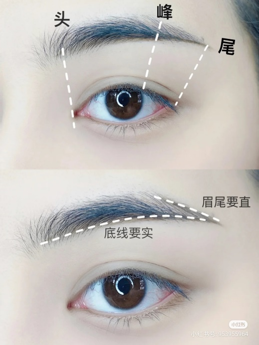

（图片来源：小红书【Amber】）

用眉笔分别在眉头、眉峰、眉尾位置做浅浅的标记，确定好位置后，把眉尾与眉峰连接，眉毛的粗细根据自己的眉毛/修过的眉毛来定，从眉头位置开始平行化两条浅浅的线，与刚刚的连接线交叉后，把中间位置颜色填上就好，填色顺着自己的眉毛生长方向轻画即可，一般画法眉头往上，眉中左右，眉峰眉尾位置斜向下。

新手建议不画眉头，只画眉尾，把中间颜色稍微补一补就好。我最开始画眉时看到一个很简单的画眉教程，就是眉头部位化一条比较重的线到眉尾，然后用眉梳疯狂往上梳，再把眉峰眉尾画一下，我最初用这个方法化了一段时间，大家如果觉得画眉很难的话可以试试这个方法。

熟练以后可以不再每次找点，按自己觉得合适的位置化即可。关于修眉和画眉的教程可以看小红书这个视频，讲得很详细，这也是我修眉的入门视频：[化妆师麻麻子：修眉画眉](https://www.xiaohongshu.com/discovery/item/5d56185b00000000020181f9?xhsshare=CopyLink&appuid=5c74e5ca000000001003f2d2&apptime=1630400315)（点击即可跳转）

1. **口红**

我一般会在化妆前**先涂一层唇膏**，用纸巾擦掉再涂口红。初学者口红可以先在唇内侧涂一层，然后再抿开，叠加两三次，就能得到一个比较均匀上色的唇妆。我之前看一个口红试色博主教的方法是不要抿，上下嘴唇前后碰的方式，这样涂出来的口红会很好看，我现在就经常用这种方法，大家可以试一试。

也可以先在唇内涂一层，再用手指均匀抹开，这种方式比较简单方便。深唇可以先涂一个浅一点的口红打底，再涂深一点颜色的口红。这样能够一定程度上减弱自身唇色对涂出来的口红颜色的影响。

1. **遮瑕**

遮瑕有彩色遮瑕和肤色遮瑕两种，彩色遮瑕只能在粉底之前用，肤色遮暇在粉底之前之后都可以。瑕疵不多的话其实可以省略这一步，平时戴眼镜的话正常社交距离黑眼圈也不会很明显。

新手建议购买肤色遮暇液，比较容易上手。遮瑕的手法与粉底略有不同，先取部分遮瑕在手背上，再用小刷子（或者遮瑕盘搭配的遮暇刷）沾取少量遮瑕轻轻涂/按在有瑕疵（一般是痘印或暗沉）的部位，在用小刷子把瑕疵部位周围轻轻晕开，等遮瑕干了之后再上粉底。遮黑眼圈的话注意取用的量不要太多，容易造成眼下卡粉，把遮瑕涂在黑眼圈最重的地方，再把周围轻轻晕开。

1. **眼妆（眼影+睫毛+眼线）**

**（1）眼影**眼影的选择我建议新手选**四色眼影盘**，色系选择**红棕大地色系**或是**粉橘色系**，比较日常实用，四色眼影盘颜色搭配好了，比起多色眼影盘更适合新手。

我购买眼影盘前会先在小红书上搜索一下想要购入的盘，看看有没有搭配教程，大家对眼影搭配不是很熟练的话也可以和我一样先搜搜教程，有教程再买。

关于眼影的话，以四色眼影盘为例，一般四色眼影盘会有最浅（打底色），次深色（加深色），亮片/闪片（提亮色），以及最深色。

- 一般先用一个稍微大一点的眼影刷/火苗刷沾取最浅色，在眼皮上铺色，铺色范围大概在眉骨下方眼窝处，前不要超过眼头，后不要超过眼角，下眼睑三分之一处轻轻带过。
- 然后用一个小一点的刷子沾取加深色在双眼皮褶皱处加深，下眼睑三分之一处稍微带一带，再用刚刚那把铺色刷晕染一下上眼皮褶皱处边界。
- 之后用一把更小的刷子/或者之前加深的刷子也行沾取最深色加深眼头眼尾（或者只加深眼尾），注意如果自己购买的眼影盘最深色颜色太深，这步可以省略，或者用一个小眼线刷把靠近睫毛根部的地方勾画一下再用小晕染刷晕开。
- 最后用手沾取亮片色涂抹在眼皮正中间做提亮。也可再在下眼头或眼中部位轻涂一点。

值得注意的是**取粉**的问题，我一般用眼影刷取粉之后会把刷子抖几下，去掉余粉，或者先在手上按两下再上妆，这样是为了避免手重或者眼影太过显色不好晕染的问题，平时画眼妆容易手重、化出来像被打了的朋友可以像我一样。

具体化眼影的范围可参考下图：

（图片来源：小红书【雪糕和仔仔】）

**（2）睫毛**关于睫毛其实比较重要的是夹睫毛的问题，很多朋友不会夹睫毛，包括我自己刚开始学的时候曾经还把眼皮夹肿过。首先你需要一个适合自己的睫毛夹，有塑料的和不锈钢两种，看那种好上手选哪种就行。我自己用的是玛丽安和无印良品的塑料睫毛夹，大家如果不知道买那种，可以参考我用的。

夹睫毛的过程不太方便用文字表述，我找了两个视频，大家可以参考一下（包括了刷睫毛膏的教程）：

简单版的：[小红书 程十安](https://www.xiaohongshu.com/discovery/item/5f63766100000000010012a1?xhsshare=CopyLink&appuid=5c74e5ca000000001003f2d2&apptime=1630404458)（点击即可跳转）

详细版的：[小红书 大金Golden](https://www.xiaohongshu.com/discovery/item/6048865c00000000210365be?xhsshare=CopyLink&appuid=5c74e5ca000000001003f2d2&apptime=1630404365)（点击即可跳转）

值得注意的是正常夹睫毛是不会痛的，如果眼皮痛，那么就是你夹到了眼皮，这个时候就要换个位置重新夹，因为夹到眼皮不仅痛，睫毛也夹不起来。而有些朋友睫毛天生比较硬，比较不容易夹起来，可以尝试用烫睫毛的方法（用专门的加热烫睫毛的工具辅助）。

**（3）眼线**

眼线的话我个人觉得新手不会用眼线胶笔或者眼线液笔的话，可以用眼线刷沾取深色眼影在眼尾拉一条线出来（日常妆也够用了），我化内眼线的时候是把眼皮抬起来然后用眼线刷在睫毛根部一点点贴上颜色（个人觉得这个方法比较简单且实用），化内眼线显得眼睛比较有神，当然眼睛比较敏感或者觉得比较难的话不化内眼线也没事。化眼线（包括化眉时）时可以把手搭在桌子上，比较稳，不容易化歪。

同样分享一个比较实用易懂的眼线教程：[小红书 正义的宝妹](https://www.xiaohongshu.com/discovery/item/610fc27f0000000001028da8?xhsshare=CopyLink&appuid=5c74e5ca000000001003f2d2&apptime=1630405091)（点击即可跳转）

1. **面部（腮红，修容，高光）**

这方面其实没什么好说的，主要还是根据自身脸型，大家多看看美妆博主教程，多练手，找最合适自己的面部上妆范围就好，或者直接套用博主修容模板，看哪个合适自己就用哪个。

腮红的范围就在眼下面中部位，往下范围不要超过鼻头。可以用腮红刷横扫或是画C字，注意不要太重就好。

（图片来源：whispersun）

高光的部位一般是在鼻头，眼睛正中鼻梁的位置，颧骨位置以及眉骨位置轻扫。

（图片来源：小红书【美美的小蕾蕾】）

修容根据自身脸型，简单来说就是你想让哪里显小就修哪里。

（图片来源：小红书【小嗝儿】）

---

# 5 宿舍生活

- [by 赵鹏风](#5fk59v)
- [by 小海螺](#dv5bsk)
[by 雷明月](#1l62nh)

### by 赵鹏风

东大的宿舍卫生对于**评奖评优**是跨不过去的一个坎，所以需要给予一定重视，**查卫生一般有固定的时间**，比如说你这幢是哪一天阿姨检查卫生，有的阿姨会**写在小黑板上放在宿舍大厅**，注意关注，在那一天收拾收拾一般问题不大，和阿姨打好交道也是宿舍卫生分高的重要一个手段；宿舍的神器来说，一般在开学都有的买比如说床头挂篮这些，对于书多的同学可以网上买一个小的书架自己组装一下可以节省不少空间，南京的天气有时候会比较潮湿，衣柜里**除湿袋**这些也可以准备一下，定期晒棉被洗床单，如果不注重棉被和床单卫生，天气诱因什么的很可能有螨虫，对皮肤会侵害，其他也没什么神器，可以备一瓶衣物消毒剂什么的，因为你很大概率上可能会去使用公用洗衣机。

### by 小海螺

在大学里，大多数人日常都过着宿舍食堂教室三点一线的生活，想要宿舍生活过得舒适体面，当然是需要大家用心经营的。

首先不得不说的就是**宿舍卫生**，如果你本人或是宿舍小伙伴中有爱打扫卫生的人那就再好不过了，但若是碰巧四个人都不拘小节，那也不用担心，长学期会有宿舍阿姨**每周一次的例行检查**，勉强能帮助宿舍维持基本的整洁。当然，宿舍卫生分对每个大学生来说还是非常重要的，特别是对于自己有要求的、想要评奖评优的同学，宿舍均分90以上是必要的。其实只要做好宿舍整体基本的清洁，每次检查达到90分是非常容易的。每个围合每周检查卫生的日期是会变动的，关注宿舍围合门口的小黑板就能看见，如果难以维持宿舍每天的清洁，就需要在卫生检查前一天特别清理了。根据经验，阿姨检查卫生时特别关注的就是**宿舍地板是否有明显垃圾，每个人的桌面是否整洁，卫生间、浴室、洗脸池是否有明显污渍**，只要基本都过关，就能有90分以上，要求比较严格和扣分多的点主要在于桌面是否整齐、卫生间是否干净。(特别重要的一点是检查卫生时阿姨如果发现违禁电器是会没收批评警告并且扣非常多分的，大家一定要注意)

说完宿舍卫生，就来谈谈宿舍生活，大家到了大学，一定都会想要努力过好自己的小日子，特别是离开了繁重的学业，待在宿舍里的时候，都想过得舒服些。我就结合自己的一些经验给大家推荐一些宿舍神器，帮助大家在宿舍生活中过得开心舒适，当然适合自己的才是最好的，有些东西不需要盲目跟风购买，选择自己需要的，把宿舍生活过成自己想要的样子。

**1.压缩袋**

压缩袋比较推荐衣物较多的同学购买，特别是随着在校的时间越来越长，很多同学会发现衣柜空间告急，这时候几个压缩袋，瞬间就能节约大量空间，夏天可以收纳冬天的衣服和厚被褥，同时还能将衣物分类。

**2、磁吸LED灯**

宿舍一般在11点之后会熄灯，所以拥有一个台灯是非常必要的，磁吸LED灯相对于其他台灯来说占用空间小，对于宿舍书桌结构来说也非常合适，安装和移动都非常方便(如果有需要的话安在衣柜里也非常合适)。

**3、除湿袋/除湿盒**

南京天气特别是冬天非常潮，衣服容易潮湿发霉，并且楼层越低会越严重，所以在衣柜里放一个除湿袋或者除湿盒是很有必要的，并且最好及时更换哦

**4、简易鞋架**

宿舍里会有给每个人提供几个小层的鞋柜，对于鞋子比较多或者想把鞋子放到宿舍外晾晒的同学，我推荐一个简易鞋架，安装拆卸方便，体积也小，适合宿舍用。

**5、置物挂篮**

宿舍里是上床下桌的形式，睡在上铺总会有不想下床的时候，这个置物挂篮可以挂在床边，充电器耳机等等随手可以放在里面，在床下想拿东西也可以直接把篮子取下来拿，不需要再爬到床上去。

这里就仅推荐一些用过的并且我认为适合在东大宿舍使用的宿舍神器，还有一些基本的床帘收纳盒之类的就不做推荐了，大家选择自己喜欢的就好。宿舍是大家在大学里共同的家，想要拥有一个好的大学生活，当然也要努力把宿舍生活过得多姿多彩，希望每个同学都能拥有一个快乐充实的大学生活，不要把太多时间花费在宿舍里，劳逸结合，多去图书馆教室充实自己的大脑也是非常重要的。

### by 雷明月

1. 落地抽屉柜：厕所可以放一两个落地抽屉柜，用于摆放洗漱用品、吹风机，因为墙角的大理石板摆不了太多东西，也容易变脏；
2. 墙纸：有时间可以贴墙纸，宿舍会看起来干净；
3. 落地晾衣架：两个宿舍可以合买一个落地晾衣架，一次可以晾晒很多衣服；
4. 桌面抽屉柜，可以分类存放小物件；
5. 床头挂篮，可以摆放充电宝、手表、眼镜、床头灯。

---

# 开篇：每一代人都不一样，也都大差不差

转眼已经本科毕业了小半年了，最近我又回了趟九龙湖校区。

这天下雨了，我打着伞走在路上，看着新入驻的苏果超市、精灵球一样的大草坪、搭起一大半棚子的游泳馆，一切都变化了但却并不让人陌生，我觉得哪怕十年之后自己找教室、去图书馆、去食堂宿舍的肌肉记忆都还会在的。

可唯独看着身边来来往往的同学们，有了种恍如隔世的感觉，一转眼这里已经不再属于我们了，走在路上也不会有熟悉的打招呼声音了。一批人走，又一批人来，周而复始得干净利索。

但对这所学校来说，依然有新的一批人在去图书馆看书、去教室复习、去食堂吃饭，在走着我们曾经走过的路、思考着我们曾经思考过的问题——每一批人都不太一样，其实每一批人也都大差不差。

这是我坚持提议并和大家一起推动了【生存指南】项目的原因之一，也是我坚持在[生存指南]中加入【校友篇】的原因。

自南京工学院以来，东南大学已经累计培养了超过30万的东南人，这些人分布在新加坡、德国、澳洲、加拿大、美国等众多国家和全国各个省市，**仅南京一地就有3万余人的东南校友。**

**东大的百年历史、几十万前路人的经验和帮助，是这所学校给我们弥足珍贵的礼物。**

我在本科期间做过不少和东大校友相关的工作，包括发起了SEU校友圈的项目，为数千校友提供了人脉连接和需求连接服务，这个过程一方面让我感叹东南校友资源的广大，在全国多数城市，你都能找到东大校友会的存在；另一方面也让我在和这些先我几年甚至几十年离开校园去开拓人生的前辈身上，学到了太多在校园中学不到的道理。

时代在变化，每一代东南人都不太一样，每一代东南人都有些不变的内核和可以传承的智慧。

校友篇章将分为**“三年之后”**、**“五年之后”**和**“十年之后**”几个板块进行划分，划分出对应毕业年限的校友采访或自述故事，初期感谢16级信息薛彤的统筹组织安排，东南大学学生创业协会、东南大学校友会、SEU校友圈等组织的支持，以及生存指南团队、创协20周年团队、校友圈运营团队、先行说团队的参与。

生存指南校友篇 薛彤、王宗辉

**PS：**欢迎加入SEU校友圈-东南永久公益的校友服务平台：

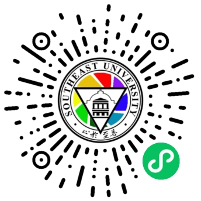

---

# 三年之后

- [2018年毕业 陈雄辉](#8cvllf)
- [2017年毕业 胡杨](#1l21rh)
[16年毕业 毛叶帆](#95vffb)

## 2018年毕业 陈雄辉

**学长好。第一个问题是经过蒋瑞同学的联系，我们想让请您分享一下您的创始人的经历。您在大学期间参加过创协社团，当时是因为什么因素让您对创协产生兴趣？**

其实这个理由也没有特别复杂，就提两点，第一个我对创业这件事本身是比较有兴趣的，所以当时有关注到这个社团，然后最后让我决定加入的还是当时我的部长叫董一涵，我们叫他董大，他的演讲特别有感染力，当时我是听了他的演讲，我就直接进决定加入了。当时也没想着我会留，没想到我是留了当部长，然后又留了当会长，其实也是挺意外的。

**好的。您还记不记得当时担任创协会长，整个创协的事务都需要您负责，有没有什么特别难办、让你印象最深的一件事？**

回顾当会长期间的话，三件事，第一件事首先从换届，换届的时候就比较难办，关于选我当时的部长的时候，我当时下一场的部长主要难办的原因是当时我们大二那年做的还不错，所以大二是大大一的那些小孩做的还不错，所以当时留任人特别多，我就很难挑，然后必须很残忍的刷掉一些人，所以当时那件事情还是挺难办的。

整体在协会处理一些日常运营和活动的话， 我当会长那一年反而是相对比较轻松的。在我当外援部长的时候，当时我们基本上是我们那会儿算是前面的一些活动和我们有一些断层，所以当时很多我们的活动都要涉及到重新的设计，重新的组织，有一些经验是遗失的，所以在大二那年我们一起去做，现在我们还在做沙场点兵的活动，当时我们开始重新做起来的，然后当时在这个方面我们也是遇到了挺多的问题，包括整个活动整个流程要怎么理，中间遇到什么问题，怎么处理这些事情。大三的话我们重新再办一场这场活动，相对会轻松一点。协会的其他活动也是在大二的基础上略有创新，所以活动这方面我们做的也还行。然后第三个我觉得问题比较大的是当时的新媒体运营，我不知道现在叫什么名字，因为我们协会做的一直不算特别突出，所以好像一直在改他的名字。我们当时是把算是做宣传的部门改成了叫做新媒体的工作室，新媒体工作室。当时的想法是希望他们从一个专职负责宣传的部门变成一个有一定的活动策划能力的部门。不知道你们平时有没有关注像心事像这样的一些公众号。当时他们做了非常一些比较有意思的活动，我们希望说协会也能有这么一个部门，去用自己做的一些新媒体的活动的创意去引发一些思潮，通过这个活动给大家传递一些我们的思想一些理念，一些想法。当时大概就是以为初衷，我们做了一个新媒体运营，希望既做宣传又做活动策划，最后结果是我们的宣传也没做好，活动策划也做的不咋地。因为当时一个问题，一方面是没有我们也没什么经验，另外一方面是我们当时留任下来的小孩在或宣传部这边留下来的小孩，也是心有余和力不足，所以当时有点期望过高，最后这块也是没有做的特别好。我看后面的几届也是有在做继续的改进了。总之这算是我们当年遗留下来的一个比较大的问题。

学长比较谦虚，做一个简单的反馈，可能您对现在的活动还是不是那么了解，就是沙场点兵，去年的话还是办得很成功的。最后在有一场是在场外，在老门东，我印象里，因为我身边也有几个同学参加了，他们组队反响还是很不错的。然后新媒体的话现在是改名叫风信子。我知道。

对这个名字起来我觉得还是比较有创意，比较有吸引力的。

对，大概在我们那一年，我大二那年重新启动大沙场点兵，大三那一年开始准备把新媒体这个事情做出来，反正当时刚起步没有把这些事情都做得特别好，有这么一些想法。

万事开头难，您给我们提供了一个好的创意，后面的人才能慢慢的发展。

不用这么说。

**然后第二个部分就是我们想向您了解一些经验，就是关于创业比赛，本科期间我们想问一下您有没有做过什么形式的创业实践？还有怎样得到这些创业的机会？创业的实践这三方面。**

大家所认为的一些创业实践，我可能大多都做过。一个是创业比赛，什么大挑小挑那些比赛，我有做过一次一些比较偏实践的，在咱们学校不知道你们清不清楚、现在还有没有，一些比如我们寒假回来，回去之前我们会做一些特产的销售，一个是我们在大二或者大三的时候，我们会组织给大一的同学销售一些新生的生活用品，包括被子这些东西，这些实践我也做了。第三个是做了一些偏互联网项目的一些产品的算是项目管理，包括做产品经理做一些产品设计，还有一些项目项目管理带我的团队的一些程序员去开发这些项目，然后去把它推到线上，虽然最后线上的东西我们做的比较弱，反正主要还是做项目管理这方面的事情。

Ok然后怎么样得到这个机会的话，我觉得这个问题就挺奇怪的。我觉得大学这一个这个环境是机会机会非常多的，基本上你想做都可以做。你知道，这件事情你想做基本上都可以做，好像不存在怎么得到这个问题。当时我想做这个事，然后我就去做。

**想问一下，这些创业实践对您日后工作和深造的具体的帮助。**

第一个创业比赛方面，创业比赛方面当时我是大一参加的，给我的帮助大概是我觉得以后我可以不再参加这个比赛了。我们协会是有做创业比赛的项目的，包括现在有创始人一起进来会更多的做，但是我自己对这些比赛的观点还是比较悲观的，因为我觉得这个东西有点脱离实际，它可以作为一个实践，但是它的实践更多的是在什么方面？是在于你能够快速的学会一些未知的事情，然后你能够更快的去完成一件事情，在这方面他是有帮助的。我之所以这么讲，是因为我发现有些人真的把当成一件创业的事情去看，我觉得这和真的创业是差很多的。当有些人把真的当成一个创业去做的话，就感觉那些人之后会变得有点膨胀，然后也觉得自己参加过这个比赛变成一个创业的大佬，我认识很多、但其实之后根本联系不上的一些所谓的人脉资源，就觉得自己特别牛逼，我觉得这个并不是特别好。但并不是说这个东西没意义，这个东西意义在于说我对自己更有信心了，我对自己去完成一件我原本不知道的事情，我也更有信心了，我知道，其实我去努力，我可以做完这些事情，也提高自己的抗压能力，提高自己的学习能力，提高自己面对未知的一些挑战的一些自信。在这些方面是有帮助的，但是我不太希望有人把它当成真正的创业。

第二方面是创业的实践，创业的实践的话，其实我觉得对我的锻炼还是蛮大的主要还是说一个是还是沟通和表达，然后一个是自信。自信实际上也是我在大学后期给自己或者说我发现了一个道理，我发现大学这个场所大多数人其实都是一张白纸，包括我，包括在座的大家。这意味着什么？一方面是大家都不是很懂，另外一方面是你不需要有非常多的基础能力，只要你去足够努力，你能够把一件原本不会的事情做的还不错；只要足够努力，你的队伍足够靠谱，就够了。所以这给我比较大的自信，我可以去做任何我想做的事情。

第三个就是一个比较偏我的专业背景相关的，我本科是做软件工程的，后来我去做人工智能了，软件工程就涉及到不管是你作为产品经理或者你作为项目经理方面的能力，比如说一个团队过来了，首先你是找到了需求，或者说你确定哪些需求，这些需求是否重要，这些需求具体如何变成一个产品的原型，又如何从产品原型转化成具体的产品设计，又如何从产品的设计转化转化为具体的技术实现，你如何评估各个技术实现之间的重要程度和难易程度，如何安排你的组员和你自己去完成你这个项目。大概是这么一整套流程，对我而言算是在专业能力，包括整个在专业上的带团队的能力还是有比较大的帮助的。大概就是这三个方面。

好的，谢谢学长的分享。我觉得您我们在整个创业时间还是比较看重过程的。结果是一方面，然后对过程可以锻炼我们很多的多方面的能力，不管是专业上的或者是 各方面的能力。

**然后下一个问题就是您对双创是是怎样理解的呢？您也提到过您参加过大创小创。**

我们其实有点像我刚刚说的答案。你说的双创是指我们现在学校所做的那些什么挑战杯这类的比赛吗？对。

理解大概就是我刚刚说的。第一个是它是有用的，但是有用的点可能不一定在于说对于真的创业能力的锻炼，但是有用点在于说它能够在这个过程很好的锻炼的一些综合素质，包括你的演讲、沟通、表达、学习、抗压、资金这些能力，所以我觉得他是有用的，但是我觉得我们大家在做这些事情的时候要避免一方面是觉得自己真的是已经在创业了，我会做这些事情，说明我们创业做得好，或者说我把我在这里取得一个比较好的成绩，我就是一个创业方面的大佬，或者说我在这个过程中我认识特别多牛逼的人脉资源，我比同学厉害很多，还是要保持一些比较谦逊的姿态， 去面对自己的其他的事情。好的，然后下一部分就是由刘立远同学向您提问。

**学长您好，就是我提问的问题可能和保研或者深造工作有关，和您自身的专业背景可能有一些是有比较强的联系。我们知道您大三去了阿里去实习，您是怎么样得到这样一个去阿里实习的宝贵的机会的？**

首先和我们的专业比较有关系，我们软件工程是有门课叫做实习的，所以我们就借着实习这门课去找实习了，就这么简单。具体这个机会的话，其实也是很正规，当你们实习季到来的时候，都会有都会有各种的内推渠道，但是内推渠道说好听叫内推渠道，说难听一点就是免简历筛选，然后正常的走面试的流程，然后一面二面3面4面，然后就录取了，就是这样子。

每次面对实习的时候，我们会五花八门的公司五花八门的实习机会，当这样的时候，您对我们学弟学妹们有没有一种什么建议？怎样去筛选这样的实习机会？怎样去鉴别哪些实习机会对我们是有价值的，哪些其实是没有什么价值的。

Ok我觉得这个问题的话三个方面，首先最重要的还是说和你的未来长期的一个职业规划的相关性，首先这份实习不一定等于你未来的职业规划，但是它应该和你未来的职业规划是有相关的。你觉得你能从这份实习中锻炼什么，锻炼得到的能力，对于你最后找工作是否有帮助？比如说——不一定是一个恰当的例子——比如说我最终想要从事的职业a对于英语的能力比较有帮助。我可能在实习的时候看到了一份和英语强度相关度比较高的工作，但可能不是我最终想从事的工作，我可能会去尝试一下。再或者这份工作是你所好奇，在你未来所想从事的职业中的一个选项之一，但你不确定是否适合自己，这个时候为了真实的去感受这份职业的话，你也可以去尝试一下这份工作。

第二个方面的话就是你确定这份工作是你可能需要的时候，再去判断这份工作是不是适合你。我觉得主要的判断方面还是说最好你能了解到这份工作的具体业务和你的领导这两个方面，这两个方面是我觉得比较重要的考虑的因素。因为在公司里面我们能做什么，有时候和学校不一样，就像我们刚刚说的说学校里面你问我说怎么得到一个机会，我觉得学校里面机会是很多的，你想拿到什么机会，你愿意去做，你就能拿到什么机会。在公司不一样，你能做什么，实际上是取决于你的领导在干嘛，你的所在的业务线在干嘛。所以你需要看这个业务线是否有价值，领导是否是否牛逼，或者说是否适合你，是否有学习的地方。好，大概是这样子。

看来学长对于实习的就是理解比我们要深刻，透彻很多。那么我们想接着这个问题，我想问您一下，阿里是一个非常巨大的公司，国内仅有腾讯能和它抗衡，那么在阿里这样大的公司里头实习，您有没有什么独到的体验，或者说这家公司是否带给您一些价值观，或者说您觉得这家公司有什么独特之处？刚刚我说的那些东西，一部分我从阿里实习过程中所总结出来的一个结论。除此之外，整体来说，我觉得我当时只是一个普通的一个研发岗，所以你说非常深层次的公司里面的一些东西，我觉得我不能看的特别多，看不到特别多，整体体验还是不错的。我的同事我的领导都非常有热情，他们都非常的实干。另外一方面也是说这算是我最后确认去的。我当时算是为了测试自己，我去面了腾讯的一个产品岗，腾讯微信的产品岗，然后又面了阿里的一个技术岗。最后我当时已经决定去考研了，然后我就面着玩，然后又都过了。以当时我是冲着体验去的。作为我第一家体验的公司，我也是大概去了解了一下公司的一些规章制度流程组织架构，阿里里面的技术部门他们是怎么做的，整个体系是怎么样的，他们是怎么做技术的沉淀的，就这么一些比较我觉得还是比较表面的东西。然后我觉得从那里面得到了一个主要思考，还是刚刚说的东西，公司和学校的区别，其实上在学校你有很多的空间、很多的时间去选择你的经历，或者说选择你能做什么，你想做什么。在公司的话，实际上你做的是一个输出的过程，大家是看你有什么去告诉你你要做什么，并且你的上级是什么样的人，你所属的业务是什么样的人，决定了你能做什么。所以这就是一个很矛盾的地方。就是在公司你要做晋升，你要做职业的发展，它是取决于你做过了什么事情，这些做的事情你取得了什么成就，但是你能做什么事情又不一定取决于你，而是一方面取决于你过去的经历。比如说举个例子，我在大学我一般一张白纸，我想去干销售，我就能去干销售，在公司里面你想去干销售，不会有人给你去干销售，除非你过去在这方面有非常牛逼的经历，大概是这么一个意思。再举个例子说现在公司有一个新的业务，他对接的刚好是一个外国人，并不是说我虽然不懂英语，我英语口语不是特别好，我说我想尝试公司就会给你这个机会，而是你之前有英语的基础，你告诉公司我之前在哪个方面做过和外国人交流，公司愿意就愿意给你做一个机会。所以它是基于你过去的经历的一个基础上，在公司去做一个输出的过程。然后公司的上级又决定了你能做什么。所以像我们经常说的，你的选择会比你的努力还重要，你在业务线会比你自己真正能做的事情还重要。所以我觉得选择还是比较关键。好，我最近有陪女朋友在打荣耀，就这个过程有点像荣耀里面你去做发育和参团之间的关系，你自己有好的发育，你去参团才能有额外的收益。当你发育好到一定程度的情况下，你去做参团，你这个收益是大于你自己，自己在那打野打怪的，反过来也是一样，当你自己发育不好的时候，你就去参团，你可能就是一直被你，一直对鸟的命运。大概是这样子。

学长讲的非常深入浅出，我们也了解到了很多东西。那么既然您刚刚提到的关于保研的问题，保研也是学弟学妹们一个比较理想的最终的大学本科的结局，那么对于保研您有什么样的建议。我们应该怎样去联系学校的招生老师？如何去关注一些信息，怎样或者说为了保研，除了我们提高绩点以外，我们还应该去做哪些事情？

首先我不觉得保研是一个唯一的途径。但是说如果你决定要保研的话，首先我推荐去做的事情是看一下你们的招生简章，就是保研的规则，每个院系有自己的一个保研的规则，这个规则告诉你你最后的得分有什么样的东西去组成的，你去看这些规则里面，成绩占多少？你的项目竞赛占多少，或者其他的因素占多少？基于你现在的视角下，你能做的东西有哪些？我当时是看到其实我的成绩并不是特别好，因为我大一大二并没有去做怎么样的学习。我发现一个好的突破点就是我们学院的竞赛的分数占了非常高的比例，所以我在决定保研之后，我就去冲我的竞赛分了，我把我的最后是把我的竞赛分给冲爆了，我算是保研里面成绩最差，基本绩点最差的，但是我综合排名是排第二，大概是这么一个结果。你说的至于说关于怎么联系老师，怎么关注各个学校的一些信息的话，其实你可以具体去看知乎的一些面经，一一些经验。但是有一个事情你需要提前做好准备的，你要提前一年甚至更久去看一下你们学校的规章制度，他的分数最后由什么组成的？ 为了达到这些分数，你现在能做什么？

**学长最后是保研成功的，并且进入了南大λ组。我们知道南大的λ组是国内非常富有盛名的一个AI的组，就请问在这样的一个组当中，是我们比较好奇读这样的一个组是什么样的体验？**

我觉得自己不能算体验，就是说变化。第一个是我在这个组里面，一个是科研能力，一个是除科研能力以外的一个独立思考的能力，这些是能感受到比较实质性的提升的。我觉得从本科到现在，我是从一个能够比较好地完成一件事情，或者说去反思一件事情，下次再做这件事情的时候，能够有所提高的一个实干者去变成了一个开始去思考各个事情背后的逻辑是什么，背后的本质原因是什么？A和B后面是不是同一件事情，建立自己的一个逻辑的体系，我觉得这是科研组，包括我的组里的老师的一些教导所带给我的一些思考。组里的这些学生，这些老师都有这么一些能力，我也逐渐的去学会了又怎么样。然后第二方面，确是如你所说，他在国内还是比较有名气的，并且有这个名气给我带来的有两方面，第一方面是有更广阔的视野，我对于我未来应该做什么有一个更全面的思考。并且也借由这个组的名气，会有更多的结识一些我所需要的资源的一些基础。基于这个名气，我可以去接触到更多的一些人和他们进行交流，包括更多的一些机构去聊聊他们在干什么，以及借此去思考我能干什么，我是否需要去做这件事情，诸如此类等等。

**学长，接下来可能我会问几个和您专业比较具体的一些问题了，我们是了解到现在是在滴滴的AI那个时期的，我们知道很多公司开设的类似于AI性质的部门，比方说阿里有他的达摩院，腾讯有它的技术大咖CSIG请问这样的一些部门在整个公司是起到了一个什么样的驱动作用？或者说就这样的部门对业务的盈利和业务的发展有什么作用？**

两方面，第一方面，首先是辅助业务去做一些算法方面的一些工作，你可以理解为算法方面的外包部门来外包其他部门的算法，这也是我们一方面的KPI。另外一方面的KPI或者是公司的声誉和影响力方面的工作。这方面一般是由AI LED里面的一小撮探索性质的部门去做的，他会做一些不一定能落地的、一个比较前沿的学术成果。对于公司而言，这是一个pr的部分，也就是说是作为一个公关的部分告诉大家，滴滴这家公司或者腾讯这家公司在科研能力上非常的牛逼，我可以吸引更多的人，我可以借此去宣传我的影响力，大概是两个方面。是不是本质上来说，比方说我作为在滴滴这样的公司，我发表了一篇顶会论文，是不是其实对公司的经济效益并没有多大的影响，向更多带来一种声誉上的提升，可不可以这样理解？

论文其实有两个方面，就是说一方面本身是有业务上的一些成果，我把它抽象起来转化为一篇论文，另外一方面我是单纯的去做学术研究都有可能，也就是说不一定是和业务没关系，也有可能和业务有关系，有转化成功。

**我们现在大家AI处在一样的一个风口上，很多人说AI的核心其实就是数学，您觉得我们做AI是不是需要学会很坚硬的数学知识？**

我觉得首先是分领域。有一些机器学习理论，相关的领域是有很深的数学基础的。对于其他的领域，你说尖生我觉得不至于。比专门做数学的，我们所用的数学，我觉得远远谈不上。但是AI是不是以数学作为支撑的，我觉得是的。主要还是一些概率统计积分方面的知识，我们用的还是比较多。

好的，现在我们都知道AI现在已经处在了一个风口浪尖上，大家对他的就是评价也两极分化，有的人把AI这个神话到了说AI马上要控制人类了，可能要毁灭地球的至关重要了。也有人就说不过风口上的猪很快就会掉到。那么就从您这样一个业内的角度来评价的话，您觉得AR的未来的前景是怎样的？

首先我觉得这两种说法都不太客观，一个是AI现在也没有那么强。第二AI也很显然不是泡沫。前景的话，这算是一个螺旋式的发展的过程。像CDRNP这些东西，企业能落地的，其实我自己感觉落地的是一些比较简单的基础性的工作，其实大家都已经做得差不多了，一些比较复杂的工作，现在又处于一些比较有点青黄不接的阶段。学术研究还在进行，但是能不能转化成工业界的成果，我们还需要继续看一下。但整个学术界还是有继续在做这方面的推进。但是怎么说我感觉算是青黄不接这个词。简单的成果我们都已经转化完了，那一些复杂的成果现在又很难落地，大概是这么感觉。

**那么现在AI领域目前来讲的热点是什么？就是我们AI的前沿领域希望下一个落地的成果，现在是往往哪个方向在努力？**

我觉得我来回答这个问题会有点太年轻。如果硬要我回答的话，我觉得我自己感觉的两个方面，第一个是最近学术观会比较关心的或者说感兴趣的是叫做因果推断相关的领域。什么意思呢？就是通俗的来讲就是说我们之前的机器学习关注的是一些统计上的推断、预测。就是说比如说我发现 A的选项在历史的数据里面有70%的概率出现了。B的选项在历史的数据里有30%的概率出现了。我机器学习到的规律，我认为这个时候我的这个东西就应该是a因为它的概率比较大，但我并不知道背后的原因是什么。这是现在机器学习做的因果推断，就是希望或从逻辑学或者说从一些概率推理的方面去解释清楚后面的原因是什么。我是通过某种形式去数学建模这个背后的逻辑，借由这个逻辑我去推断出对应的结果应该是什么，大概是这样子。

第二个方面的话，比如说我所在的强化学习的领域，现在的话还在很多工业界都在关注强化学习落地的一些方法，但是现在的实际落地成功的例子也非常有限，但是大家都觉得这是一个比较有潜力的方向，所以也都在尝试。这是工业界可能比较关注的，当然不只是这两个，我只是基于我目前看到的东西来说出一些见解。

好的。谢谢学长对于保研和自己的工作和实习方面做出了比较深入的分享。那么我的采访的三四部分就完了，接下来请锦洵会会进行第5部分的采访。最后希望您谈一谈对创业协会的发展的未来进行一个展望。您期待我们创业协会作为一个大学里面的兴趣社团和一个活动组织的社团，您希望它未来向一个什么什么样的方向去发展？或者说他的理想型是什么样子？

我之前好像有问过蒋瑞说给我发一下现在协会去年做了什么，然后后来想想，我聊这个好像太细了。其实我之前也和后面的会长去讲过，就是说唯一的一点希望就是说在你们上任前或者说上任时，不管是部长也好，还是会长也好，能够思考清楚一件事情就是说我干这一年能为协会留下什么？就是说留下的意思，不知道你们可能都了解过复利，就是1.01×365次方会变成什么，就这么一个道理。我一直希望协会是一个一层一层往上垒的这么一个过程。这也是我从大二开始一直向我的小孩去讲的一个事情，也希望在和你们这里强调一下，你能给协会留下什么？你思考清楚这一点，你做完这一年，并且成功做到的，你就成功了。希望我们每一个人在任职期间都能为协会留下一点东西，这是然后具体留下的是什么东西，你们可以一起去讨论，你们觉得协会的未来应该往什么样方向去发展？企业未来的形势应该是什么样的？我觉得这个不应该由我这么一个过去两三年的一个老人来定义，由你们自己来定义。

但我希望你们会去思考，你自己能为他留下来什么，你们应该为它留下来什么？我去看看自己能不能把它给做到。甚至我不知道现不现实，比如说你可以定义一个说三年的规划，当年我们想要做到什么，然后分解分解起来，这三年我们每每一年去为目标去努力一点，希望然后这些经验你们能够留下来，我记得我当时有去推的一个百度云盘，就是留下我们协会的历史的一个东西，不知道现在还有没有留着。希望这些东西你们都能把它技术记录下来整理下来，然后为后人去做同样的事情，做更多的事情，去打下一个基础，大概是这样子。

## 2017年毕业 胡杨

**请问胡杨学长当初高考报志愿是为什么选择东南大学**?

胡：因为成绩调了一下沿海城市，因为家乡是山西太原，内陆城市，想来沿海城市走走，来南京东大，很好的一个学院。也是因为机缘，被学长推进加入创协，在创协呆了3年。大学四年倾注三年时间，有很多感情。在这方面，我认为学校社团方面对个人的话，影响还是很大的，当然每个人的重视的点是不大一样的，有的人倾向于学术，有的倾向于商业，有的可能喜欢体育兴趣类。其实每个人的大学选择都不同，其实我认为只要大学四年不要荒废，多去做一些事情都是有些意义的。

**嗯确实每个人在四年里面，无论是管专一还是广泛参与寻求丰富性，其实加入社团能有个美好的体验都是大学四年中不错的体验。既然学长提到社团问题，那么请问一下学长除了创协，还有没有参与其他的社团，然后这些社团对您的学习生活有何意义呢？对个人的影响可以分享一下吗？**

胡:大一加的社团蛮多，想多尝试多看看，至善东南，做校园校史的分享，也就是现在的至善讲解团，做一做志愿者。另外还有一个跑步协会，与一群志趣相投的人一起做感兴趣的东西。然后关于创协就是倾注更多时间精力的事情，不管是组织活动参与比赛，倾注很多时间精力，对于个人的借鉴点，也可以和大家分享的就是，在大学期间多参加一些比赛，使自己的时间变得更加紧张充实，因为实际上大学生活还是很轻松的，相当于给自己加加油，保持一种紧张的状态，因为大多数人都比较松散。

辉：确实应该紧一点的，现实生活对我们可能是一个推的作用，我觉得可能在大学里面我们面对的选择确实多了一点，然后可能就是一个紧张氛围，还是有一个阶段性的目标，或者是阶段性努力的方向还是挺好的。

宗辉：然后还有一点胡大说是我也非常认可，你看我现在说虽然比胡大还小几届，不过我也大四了，马上本科也毕业了，确实是我也觉得其实就竞赛的话，你的精力很丰富的，我之前也看过你们做了一个流畅流水，有跟自己专业相关的，有跟专业不相关的，所以这块我相信你肯定更有更多的想法，也毕竟你也在学校可以跟他们去分享更多的东西，这块我觉得你可以多跟他们聊一聊，胡大说竞赛确实是因为竞赛它有DDL在，它可以让你一个人短期内快速的成长，快速的学一些东西，快速的做一些事情，我觉得真的提升还挺大的，有时候你单靠自律，单靠自己来做的话，可能你确实还不如有个DDL有压迫感。

胡大：是的，而且像去参加这些活动的话，我个人的感觉是能当队长或者能当组长尽量的去当，因为在这些项目上面的话，一般来讲如果说不是组长的话，可能会水水就过了，但是如果说你自己作为这个项目的发起人，你作为团队的leader的话，你就需要承担更多的责任，你会逼着自己不断的往前走，如果你你对我觉得这一块的话尽量去当一个团队的领导。然后第二块的话就是他的结果我觉得不是很重要，当然有最后的话获得了很好的结果，当然更好的比如像作为之前我记得你好像当时参加了一个比赛，最后拿到了内推各种各样的东西，我觉得这些都挺好的，然后但是即使说是没有拿到一些东西，我觉得这个过程也还是很值得记住的，真的是。

宗辉：嗯对，有机会多重去当队长，包括作为队长，其实一个思考的视角也会有一个更高级的思考视角，就你看团队的话，可能要思考到每一个人，思考到整个团队的进度和团队的一个结果。

**学长学校里面你的经历中印象最深的一件事情是什么？我们从这种给我们比较深的东西谈，可能也也会有很多启发的东西会能够挖掘出来。学长可以分享一下在学校中你印象最深的一件事情是什么？**

胡：我挑一个事情，可能他对于我来讲也不是属于一个很光彩的事情，我只是觉得作为就是一个教训，也如果说能给学生能给之后的人有一些借鉴的话，也还可能会好一点我觉得。Great，一定要很重视自己的学习成绩。当你第一次可能发生挂科的时候，整个人我觉得弦就应该要绷起来了，因为这种事情的话是因为毕竟作为一个学生，在学校最主要的你的主线其实还是学习，不管你去参加其他的任何竞赛社团，然后兴趣爱好活动也好，但学习一直都不能丢下，我觉得这块是真的还是需要格外注意的，因为现在我看很多人也是在学校的话就玩的也挺多的，然后也尤其像最近疫情了，大家可能在家里面呆着，可能很多人也就是自己找点自己的事情去做，但学校的就是最主要的任务学习这块，我觉得一定不能落下，这个是我觉得对于学生来讲，我觉得还很重要的一点，也是我自己有一个比较惨痛的教训的这么一个点。

**刚刚前面的话，学长不是说也是负责一些在做创业，然后负责教育行业的对吗？您可以简单谈一下，您怎么是跟创业者创业行教育行业结缘了，然后怎么就开始想到在教育行业创业？**

胡：大概是这么个问题。这块的话它不像小说，可能没有那些什么听上去特别有趣的一些故事，其实创业其实就是哪里有一条路可以走，然后当你看其他路都不合适的时候，你就会去选择走这条路。其实我们去做创业也不是我们一开始就想着要去做这件事情，只不过后来因为有一些人也是有些关系也是介绍了最后去选择这件事情，这块上面没有什么很宏大的一些故事什么的，这些东西都没有，最后选择去做这件事情。 最开始做的事情比较大，原来想的那一个很宏大的事情，虽然它是对的，但是对于现在的我们来讲可能不是很合适，我们也接着满足以后，对，我们也是自己走了弯路以后，如果去发现应该去做一些更落地一点的，然后能存活下来的，尤其是像现在已经这个时期，其实最主要的就是要活下来。 如果说做一家企业活不下来的话，其实他什么东西都是白搭。所以就这一块的话，选择这条路其实不是怎么样机缘巧合，这些东西都没有发现这有一条可以往下走的路。我说清楚一点，我也不是项目的发起人，我也是跟着我的一个学长刚刚提到的冯博，他一起在做这件事情，属于是参加创业的人，对是这样一个身份。人对，当然我们时间也比较久了，我们从17年毕业到现在，三年的时间相当于三年的时间一直在做事情，就在做各种各样的事情，我个人的就是一个感触，在这里面我经历了很多，我相信可能很多我同龄人完全没有经历过的事情，就是真的压力还是很大的。我们之前做项目的时候的话是说是被债务的或者被到几百万的债务，有这些其实现在能说出来的话，也是因为现在相对稍微有好转，所以才会所以才可以把说出来。

其实这些事情我个人感觉对于大学生去做创业这件事情的时候，一定要想清楚，一定要想好。你在做这件事情上面，你比其他的早就已经在做这件事情的人，你有什么优势？你作为一个学生，如果说你只是抱着你有一个idea，有一个想法去做一件事情的话，其实是很不成熟的。之前就在大学在校园里的时候的话，还可以去用这种思路去做一些事情，这其实相当于是在玩这个都没有关系，就是去试错，但是真正到了商业社会，你需要去做一件事情的时候，完全是去靠这种模式去靠互联网的思维去做的话，我觉得其实难度还是比较大的。 除非说是你有比较好的资源也好，不管市场资源还是渠道资源，还是所谓的这种投融资的资源，除非你有非常好的资源，然后占据了天时地利人和，不然的话去大学生刚毕业的大学生去做创业，我一点都不建议，这是我个人的一个想法。辉：您提到说现在包括您和您的创业公司现在都好转，您觉得您当前的职业前景和行这行业的一个看法有哪些呢？

胡：对这个行业是一个首先它存在已经很久了，第二个是因为跟我们做的东西是属于学校里边的，就是一个智慧校园，智慧校园是一个大的模块，智慧校园下面更细的一些东西，更细的一些东西，这几个细分领域现在做的人比较少，所以我们选择做这件事情，它的整个市场就是像教育行业的这种周期性的市场是非常大的，是一个万亿的市场。 而且因为教育现在在国内的越来越被重视，如果很多人提到说是就需要去拿互联网加的概念，就是需要去拿信息化的概念去跟教育结合起来，最新的应该就属于5g,5g就跟校园结合起来，就这块的新的一些概念，包括它未来的一个趋势的话，一定是会有更多的机会，更多的项目可以去做的，这个行业是一个非常好的行业，但是在这个行业里面的话，比较典型的行业特征的话，分散，就行业里面的话没有所谓的这种巨头，没有这种垄断出现。

行业里边一个非常小的细分领域，大家做学校里边的这种电子屏的这种厂家来说，就孵化出来两家上市公司，但这两家上市公司它占到的整个市场占有率的话，也不过就是1%~2%这样子的一个市场占有率，你就可以想象这个市场有多大，它还可以容纳非常多的就是上市公司在这里面。为什么这么大一个行业只有两家上市公司还只占了这么小的一个市场比例，就说明它的市场的这种独特性，就交易市场跟其他市场不一样，它不是完全的纯商业行为的事情，它里边的话因为你是在跟学校打交道，你还需要去考虑到学校它的一些它毕竟是属于这种事业单位，它属于也不叫事业单位，它属于这种国家所管辖的这种组织，你可以把它理解为类似于是在跟你可以把它列为跟这种政府的人打交道，你上上下下的人都会需要去接触这个行业它的每一个每一个地区它的地域性非常的强，没办法去把所有的地方全都去做到自己的手里去，所以这个行业就属于是我刚刚讲的这样一个就是市场很大，但是很分散，就行业里面没有巨头没有垄断。同时的话这个行业的话它非常的依赖于这种地域性的合作商，他的资源的话都是在分散在全国各地的这些一些集成商手里的。对，就大概这个行业的背景就是这个样子的。

**非常感谢学长给我们介绍一下，然后其实还是当时比较爱看看有没有您当时本科的时候就大一大二或者大三的时候就还没走上就业的时候，你有当时有没有很详细的规划这职业道路，然后就职业规划这方面有没有想和学弟学妹分享的一些经验？**

胡：职业规划这一块的话，我可能没有办法给他太多的帮助，因为我在现在的公司做的事情，因为我们公司规模也不大，我在现在公司做的事情其实也很杂，最开始到现在的话一直都在变，这也是创业公司的一个就是特质，所以创业公司想要去参加一个创业公司的话，一定要想清楚你有没有有没有很强的一个适应性，有没有很强的适应能力，能不能去把所有事情全都带在自己的身上，并且把这些事情当做自己的事情来做。

## 16年毕业 毛叶帆

其实可能因为已经年纪大的原因，我现在反而和当时上学的时候想法不一样，我现在反而想如果有机会，如果有合适的契机，不是工作，而是想去做自己真正想做的一些市场行业，就是行业和具体的内容可能待定，但是如果有这样的机会，如果能找到的话，我觉得我还是很愿意去做这件事情。

我觉得做自己真正喜欢的事情真的更合适，因为你工作的时候，像我一直在工作，我说这些东西都不能够算工作，你工作的时候你会发现很多时候你遇到了一些人和事，不能由你来决定，而导致说干的不爽。给老板打工，不如给我自己打工，我觉得如果有机会，我会更愿意给自己打工。

还有一个问题就是说今年是创协成立20周年，就是希望学长能够对此送上一段祝福。

So they’re trying to get out I should do it。创协，我那一年是15周年。现在创协的口号是什么？为吹过的牛逼奋斗终生。我跟你说这句话是怎么来的？这句话是在我后一届来的，当时在我及我之前那几年的创协的符号叫人生也是一种创业，然后这句话是我在可能大一大二的时候听过，然后我是大三的时候招下一任的主席团和主席团他们聊天的时候，为了打鸡血，为了框人，说为年轻时吹过的牛逼奋斗终生。

后来被当做协会的标语，就让我更记住了这句话。其实我个人是更喜欢原来的标语，因为现在这句话可能看起来很热血，很有哲学意味，但其实我是觉得这句话没有太多的内涵，没有太多的内容，鸡汤味过重了。反而人生也是一种创业，我觉得至少在我看来更能诠释创协的理念。我是更喜欢那一句话。

以至于后面几年我刚卸任会长的那几年，天天看到朋友圈在宣传什么？用为年轻时吹过的牛逼奋斗终生做宣传文案。就你知道我有一种难受点在于什么？就是在于有一种骗人进来的感觉，大一刚进来啥都不懂，然后很容易被鸡汤被热血的话所感动。所以这句话好厉害，我要进来，然后进来之后会发现，其实很多时候你真正遇到的事情，真正做的事情和你这么热血的话，可能没那么多直接的联系，反而可能会有一种落差，我自己在瞎猜，但当然也有可能会更好，这个不好说。

创协从你们刚刚创办应该是2001年创办的时候，至今20多年了，真的是到现在有多少人？现在人也只有七八千了。

七八千规模还是比较大的，真的是在这样的一个学生组织能够产生这么多年，我觉得是一件非常伟大的事情。因为学生组织和社会组织部很大的不一样的一点，就是每一年都会产生根本性的根基性的人员更替。

但是在这样的一种情况下，包括你们联系上我，你还能联系上更早的人，包括在这样的一种情况下，创协能延续这么久，真的是很伟大的一件事情。但是据我了解，协会到目前为止，可能真正走出去有头有脸的，可能反而还是第一任的创始人。这个也对于我们来说，某种程度上也是可能说传承足够，但是升华有所不足。所以在这样的情况下，我觉得给协会的祝福就是不念过往，不为将来，希望未来协会能越来越好。

在没有过去的传承的情况下，能够每一年或者每几年都会有自己新的想法，能够开出更多的果实，那就是要有创新，就是越来越有自己的想法。而不是说我们协会只有创始人不错。我念过往不为家了，是的，说的比较接地气，你毕竟土木学院又土又木，那可不。现在土木还是很吃香的。怎么说如果你作为工作来看的话，其实是这样的，你保底的话找一份合适的工作，可能不能说你自己很满意，但是在社会看来还不错的一个工作，其实难度不大，尤其是东大出去的难度不大，但是其实每个专业都是一样的，是不是？你的专业就是你只能想做到一件事情？

其实我有的时候随便聊聊天，我就觉得真的是每个人几十年很多时候每一个小小的阶段的某一个选择，真的就完全改变了你未来的所有年份的走向。比如说你选专业选学校填志愿的时候就这那么几天，但是就是这么几天的纠结，你可能志愿稍微改那么一下，对于你未来这辈子所有的走向可能都完全都变了。

包括你毕业之后，有可能你拿到10个offer或者5个offer或者8个offer，这几个offer你选哪一个，真的是随便选了一个，你就会发现你未来的几十年的走向又变了，类似这样的选择真的太多了，所以真的觉得人生无常。

这些年看到过一句话，之前也有看到过一句话说什么，你现在的选择就是决定你未来的走向，就是这也是你的缘分。有的时候很小的选择都决定了你未来的走向，未来的，你会去见什么人做什么事，这都是缘分。说不定万一过10年之后，你们都成为社会的一流人物。？现在你们是不是有一个感觉自己也对自己的专业不是很感兴趣，然后也不知道自己以后要做啥，就觉得很迷茫。

不知道去学啥，也不对自己的专业特别感兴趣，完全处在不知道自己喜欢啥以后该干啥。我那时候也完全一样。 因为我大一大二大三都在创协，但是当时的时候创新很重的一个风气。非常崇尚互联网行业的相关工作以及相关的创业，所以导致我当时一心的想转互联网，但是土木行业和互联网的专业鸿沟又非常大。所以其实我当时毕业的时候，快毕业的时候找工作，其实一开始都是往互联网公司去投的。

然后说出来也不怕你们笑话，其实我就想去bat加1个网易这四个之一，但是最后我拿到的都是比这4家公司稍微次一点的互联网公司的offer，所以我就没想去了，然后我去就灰头土脸的回去，要不试一试地产行业找工作，今年拿了几个offer，最后就中间选了一个。到现在其实我是觉得真的觉得迷茫的阶段真的很多，包括我现在也是有迷茫的阶段，你在这个行业里面处于我的岗位，我的未来的行业发展，我应该怎么办？

但是其实我现在回想起来，我是觉得还是那样，你们现在才大二其实还很远，你们现在我觉得去想想清楚我以后一定要干嘛。我觉得也没必要，你们比如说就像刚才说的去看更多的人去见更多的事情，然后慢慢的如果没有遇到自己没有遇到自己真正喜欢的事业的话，但是至少你可以通过你去了解更多的东西，去获得更多可以妥协的。

现在创协大概人员架构是什么样？

因为我跟你说我们当时一般都是大一进来招进来十多人，但是一个部门可能10多个人，然后到大二的时候换届，大二当部长，大三就去主席团，然后有过研究生，但是比较少，可能是研究生入学以后看到创协的招新，然后也一起过来了。没有专门的研究生部。以前是有的，我那个时候就没有了。 我们那时候也是理论上都可以，但是很多时候你到大三大四的时候会顾及所谓的面子，就不好意思再去当干事了，我觉得这一点其实挺不好的。对，然后我们就有一个大四的学生也挺好的。他好像是要出国，出国可能学校都订好了。没什么事情，就大四的时候期间可能事情不多。给我印象特别好的一点就是我大一刚进创协的时候，我当时也是在外联部，我也是外联部出来的，我当时刚进创协的外联部的时候，大概10来个人，有一个研究生，然后有三四个大二大三的，然后部长是大二的，然后就每一个年龄段，每一个学校里面各个年级段的人都有，但是在那样的情况下，大家的氛围也没有说我是研究生，我是大三大四的，我就要什么比你们强，其实也没有这样，完全真的做事情的那种态度，很平等的那种交流，就给我印象特别好。

所以我最后大一结束的时候就纠结是学生会还是创协，因为可能再往后面留，就是需要去当部长了嘛，然后纠结2选1，最后选择创协这样子。

以后20周年你们打算是做成什么样子的？我还不太了解你们整体的策划。

还有很多项目，比如说现在采访聊天什么也是一部分。对整体的各个阶段大概是什么成果做一个纪录片，要拍个微电影。然后之后本来是预计三四月份会请一些创协一些人，然后回来一个开幕仪式。

之后设想要建个什么创协的纪念碑之类的，那是一个球。本来是不能是带着我们做的项目的一个老师，他们俩就是想做一个这跟跟房间一个大小的一个巨大的球，然后上面刻名字的好像。类似于东南大学的名人堂。

我不想读研究生的，不想那样，其实我觉得也挺好，因为我觉得你们其实也不想读，但是感觉现在的大趋势感觉去找工作的一个基础，你是研究生的那种感觉。我觉得这个还是要看行业的，我不太清楚能还行业为未来行业是什么情况，就是现在我这个行业其实我现在越发觉得如果真正做地产的话，研究生的学历没那么重要，因为我现在我带着的就有好几个研究生，是和我同一届的，跟我同一届的，但是他们比我多读了三年研究生。

然后现在毕业了之后，发现我带着他们结果这我和他们同一届的结果毕业之后发现是被我带着的，就这种感觉我估计他们心里面会不太好受。但是还是要看行业。这个也是能力是一方面，另外也是要看行业，有的行业可能对于学历对于技术的要求可能会比较高。但是像地产这个行业怎么说，其实说实话我上了4年土木，我学的东西对于我工作有用的东西可能不足1%，很多东西这些你过往你所接受的所学习的东西，只是你未来的敲门砖，只是你未来敲门砖，你一步一步走下去，你都要有很多要学习的东西。

所以其实我觉得还是要看朋友，对，因为我感觉研究生基本上都是在搞老师的一些研究，然后我又不喜欢搞搞研究这些，但是又觉得读研究生以后又找不上工作，然后就很有可能本科生竞争力就没有那么大，对，然后又觉得本科职业毕业去找工作不太现实，然后就也不太知道，如果你们经历过的上的话，我觉得你们可以一边一边找工作，一边准备读研究生。对，一般准备读研。比如说如果你拿到一些你觉得 很不错的offer的话，你完全可以接受的那种offer，我觉得你可以不去读研。

如果你没有拿到那种理想的offer，你可以先读研，然后报实话读研，有的时候给你多两年多三年的一个思考的阶段，思考的时间，我觉得读研也没坏处，看看个人想法。其实像我们这个行业是刚才我现在这么说，我多解释一句，虽然我说可能很多和我同届读研究生出来的，结果发现自己同届的人变成了领导，但是其实土木这个行业，如果你是往科研机构科研方面发展，你要去做那种高精尖的工程的话，我觉得还是必须要读研究生的。如果走科研这条路的话，真的是必须要读研究生的，看个人追求，其实我真的是很佩服比如说什么杭州湾跨海大桥类似这种建筑的做这些东西的这些人，因为我主要是因为我自己没这个能力，没有这个学识，但是我很佩服他们能做出一些能做出这些东西，做这种做出这种标志性的国家骄傲建筑的这种人，如果再给我一个机会，我可能会好好学习。

我现在想要的会不一样，可能有的人就会想，我朝九晚五，然后收入也不需要多高，我也不需要完成人生的多多多少的高度，我也不想名垂千史，就做一个很简单的工作，每个月可能收入也没那么多，但是就很开心，我觉得这也很好。有的人可能就是想我要当总裁，我要当总经理，然后天天去拼搏，天天去努力，然后就累得跟狗一样。

其实我觉得也没什么，各取所需。那就你返回到对于这些企业的文化来说的话，我觉得倒不用，我是没有去想太多的，主要就是去看一些企业一些行业的重点的追求点和自己的追求是不是相匹配？比如说你们以后可能也要工作，可能也要创业，假如工作的话，其实就是去想清楚你们要什么，你们要的这些东西，你们会选择什么样的行业，什么样的企业去满足你们，能匹配就好了。可能我想法就比较接地气，没那么高级，也没那么极端。

这样我今天也了解到那些企业文化，比如说还有饿了么，他就属于那种是狼文化的晚上12点也可能都是在加班通宵什么的。然后就有一些也是不一样的。

然后还有是腾讯的话，腾讯跟阿里有点不同，他们就更加的那种今天晚上可以不需要工作了，很晚就主要介绍是这一些，但是他们有很多是员工没有培训没有吧？

我有几次去上海，腾讯上海有个分部，然后去找腾讯的朋友去想跟他夜里面出来吃个宵夜啥的。然后他吃完菜之后，可能吃一两个小时吃点东西之后，回去加班工作了。这也是他们共同点。要想成功的话，你就必须要付出很多努力。这也讲到我发展的一种传承。

还有一种说法就是你想要不失败，你想要不被干掉也要付出很多的努力，不只是想成功有的时候。

对。

然后对现在创业教育有什么建议吗？如何从大学生发起就为下一代创业教育做贡献？

这也是我当时跟你说的，我没法回答了，层级不够，能回答这么大一个问题。也是一样的，通过个人看法。所以说个人看法其实我之前也说到过，你不需要说我是觉得创业这件事情是不需要教育的，没有创业去教育别人，让别人去创业这回事。我是觉得给学生也好，给哪怕进入社会的人也好，给他们的东西，我觉得不是说你需要怎样，而是我去告诉你这个世界上有很多东西你不知道，你没接触过，你去看一看，你去聊一聊，你去了解一下，可能你会感兴趣，可能你不感兴趣。

我觉得应该是这样的。比如说在学校里面可能初中、高中、大学都好。其实从小从上学的开始，老师们所谓的素质教育的学校其实也都是在做这些事情，让你能见识到更多的东西，在这些里面你才有选择权去选择你去感兴趣的事物，来去作为你终生的事业，有可能是创业，有可能是工作。但是如果你不去，你连去了解到有这么一个东西的机会都没有，你就无从谈起你未来，你要做什么才是适合你的。我是这么觉得的。

所以反过来说，我觉得创业这件事情是不需要教育的，只是需要开拓人的眼界。你如果想创业，你在了解到足够多的环境的情况之下，你自然而然的你会去创业，如果你不想创业，去告诉你再多的东西，你真正想清楚了，你也不会去做创业的，我是这么觉得的。所以创业不需要教育，真的我觉得创业不需要教育。

像我其实在创协的那个时候，我当时给自己的方向其实就是很明确，我是不会创业的，我当时就这么想的。但是我在创协我就是为了去能够我觉得这件事情我觉得很感兴趣，虽然我以后不一定会去做，但是我觉得这么一件有意义有意思的事情，如果能够在我上学的阶段能够接触到更多，我觉得是一件很棒很好的经历。其实就是这样，就是这么简单。

但是其实我现在可能也是年纪大了，我现在反而和当时上学的时候想法不一样了，我现在反而想的是如果有机会，如果有合适的契机，我反而想不去工作而去做自己真正想做的一些事情，就是创业行业和具体的内容可能待定。但是如果有这样的机会，如果我能找到的话，我觉得我还是很愿意去做这么一次尝试的。

是的，做自己真正喜欢的事情，因为你工作的时候，像我一直在工作，我说毕业的时候也是公司工作，你工作的时的你会发现很多时候很多时候你遇到了一些人和事，不能由你来去决定，而导致你说简单一点就是干的不爽，说简单一点就是干的不爽。给老板打工和给自己打工，我觉得如果有机会，我可以更愿意给自己打工。。

然后有个问题，今年是创协20年，希望学生能够对此送上一段祝福。

我那一年是15周年，转眼都5年过去了。现在创协的口号是什么？为吹过的牛逼奋斗终生，不会吧？

我跟你说这句话是什么意思，这句话是在我后一届来的，当时在我之前那几年的创协的口号叫人生也是一种创业，这句话是我在可能大一大二的时候听过，然后忘掉是哪边听过的。然后我是大三的时候招下一任的主席团和主席团他们聊天的时候，为了打鸡血为了诓人吗？对。说为年轻时吹过的牛逼奋斗终生。然后莫名其妙的后来被当做协会的标语，就让我其实我个人是更喜欢人生，是一种创业的，因为现在这句话虽然可能看起来很热血，很有智商意味，但其实我是觉得这句话没有太多的没有太多的内涵，没有太多的内容。

鸡汤味过重了，反而人生也是一种创业，我觉得至少在我看来更能诠释创新的理念，不能全是创新的理念。我是更喜欢那一句话的。

至于后面几年我刚卸任会长的那几年，天天看到不是就那样，就经常看到朋友圈也好，以及人员还用的时候也好，在宣传什么？怎么说来着，为年轻时吹过的牛逼奋斗终生，还有宣传文案，就你知道我有一种难受点在于什么？就是在于有一种骗人，骗人进来的感觉，大一刚进来啥都不懂，然后很容易被鸡汤被热血的话所感动。所以这句话好厉害，我要进来。然后进来之后会发现，其实很多时候你真正遇到的事情，真正做的事情和这么热血的话，可能没那么多直接的联系，反而可能会有一点落差，我自己先瞎猜猜，当然也有可能会更好，这个不一样。

你问题是什么？好像扯远了。是现在就可以。I love you。创协从林嘉喜刚刚创办应该是2000年2000年还是2001年创办的时候，至今20多年真的是到现在有多少人？。

对规模还是比较大的。真的是在这样的一个学生组织能够产生这么多年，我觉得是一件非常伟大的事情。因为学生组织和社会组织部很大的不一样的一点，就是每一年都会产生根本性的根基性的人员更替。但是在这样的一种情况下，包括你能联系上我，你还能联系上更早的人，包括你我觉得你们肯定也能联系上驾驶员，包括在这样的一种情况下，你们能产生传承的传承这么久，真的是很伟大的一件事情。

但是据我了解，协会到目前为止，可能真正走出去的，真正走出去的有头有脸的，可能反而还是第一任的创始人家庭家事。这个也对于我们来说，某种程度上也是可能说传承足够，但是升华有所不足，生活有所不足。所以说了这么多，所以在这样的情况下，我觉得给协会未来过去现在和未来一句祝福就是不念过往，不为将来，希望未来协会能越来越好，能美在过去的传承的情况下，能够每一年或者每几年都会有自己新的想法，能够开出更多的果实。

好的，要有创新，对，差不多是这个意思，就是越来越有自己的想法，而不是而不是说我们协会名下走错名家史走错，是这样子。没有，我为了。

是的。说的比较接地气。毕竟土木学院出身又土又木，那可不，现在我们还是很吃香的。怎么说如果你作为工作来看的话，其实是这样的，你保底的话找一份合适的工作，可能不能说你自己很满意，但是在在社会看来还不错的一个工作，其实难度不大，尤其是东大出去的难度不大，但是其实每个专业都是一样的，是不是你的专业就是你真正想做的一件事情？其实我有的时候随便聊聊天，你有事吗？没有事情随便聊聊天，我就是其实有的时候我就觉得真的是每个人几十年很多时候每一个小小的阶段的某一个选择，真的就完全改变了你未来未来的所有年份的走向。

比如说你选专业的时候可能就纠结那么一两天几天，但是选专业选学校填志愿的时候纠结那么几天，但是就是这么几天的纠结，你可能志愿稍微改那么一下，对于你未来这辈子所有的走向可能都完全都变了。真的是。这是一个，包括你毕业之后，有可能你拿到10个offer或者5个offer或者8个offer，这几个offer你选哪一个，真的是随便选一个，你就会发现你未来几十年的走向又变了，类似这样的选择真的太多了，所以真的觉得人生无常，包括三大块的情况，现在也就是看到这个情况说是满意，现在选择就是决定你未来的走向，就是你这也是你的缘分。

对是的。有的时候很小的选择都觉得决定了你未来的走向，未来的以后会出现什么，人家做什么事，这都是缘分。说不定万万一过10年之后，你们都成为社会的一流人物，你们可可可以提拔几百五五？没有，我们暂时没有没事。这个现在有一个感觉自己也对自己的专业不是很很特别感兴趣，然后也不知道自己以后要做啥，就觉得很迷茫，对。

你们都是大二吗？对，我们俩是一个班的。一个班的。对，其实大二还能转专业吗？我觉得是大一才能转专业，大一还有转也不知道，及时转也不知道去学啥，然后不转，然后也不知道自己的专业，也不是特别感兴趣的那种，完全处在不知道自己喜欢以后该干啥的一个很不舒服的，那时候也完全一样。

因为我大一大二大三都在创协，但是当时的时候创新很重的一个风气，我不是说好也不是说不好很重的一个风气。非常崇尚互联网行业的相关工作以及相关的创业，所以导致我当时一心的想转互联网，但是土木行业和互联网的专业鸿沟又非常大。所以其实我当时毕业的时候，快毕业的时候找工作，其实一开始都是往互联网公司去投的。

然后说出来也不怕你们笑话，其实我就想去bat加1个网页这4个之1，但是最后我这4家公司我拿到的销售都是比这4家公司稍微次一点的互联网公司的offer，所以我就没想去了，然后我去就灰头土脸的回去，要不试一试地产行业找工作，然后也拿了几个offer，最后就中间选了一个到现在其实我是觉得真的有的时候迷茫的阶段真的很多，包括我现在也是有迷茫的阶段，你在这个行业里面处于我的岗位，我的未来的行业发展，我应该怎么办？

然后包括我记不记要不要继续在这个行业里面去干，继续在这个行业里面去待，真的我觉得每个阶段真的是充满了迷茫。我的人生就是这个样子。

但是其实对是真的就是这样。但是其实我现在回想起来，我是觉得还是那样，你们现在才大二其实还很远，你们现在我觉得也不用太早了，想想清楚我以后一定要干嘛。我觉得也没必要，你们比如说就像刚才说的去看更多的人去见更多的事情，然后慢慢的如果没有遇到自己没有遇到自己真正喜欢的事业的话，但是至少你可以通过你去了解更多的东西，去获得更多可以妥协的。

我不知道我这么说是不是就我这么说表达清不清楚？对是的。比如说现在我举个极端例子，我不是说你比如说能还，可能如果你们不在创协不在或者别的地方去接触刑讯诉讼的事情事物，可能你们未来自己本专业找一个本专业相关的工作，但是如果你们去接触了，有可能在跨专业之间，a专业和b专业的中间点，你们可能能找到你们自己的空间。类似这样子我是觉得你不要急，你们才多大，不用急着迷茫，有极其迷茫的时间可以去多读书多看报。

多多多少没坏处，多少没坏处。你们现在大二还是干事吗？现在创协大概是人员年龄架构大概是什么样的？因为我们当时我跟你说说我们当时一般都是大一进来招进来是，但是一个部门可能10多个人，然后到大二的时候换届，大二当部长，大三就去主席团，然后研究生有过研究生，但是比较少看，可能是研究生入学以后看到创协的招新，然后也一起过来了。没有专门的研究生部以前是有的，我那个时候就没有了。

你们现在大二还是干什么？是今年刚刚加入双节吗？给我们很大的压力。他的一些现在招新是各个年级层的都可以来，我们那个时候也是理论上都可以的。但是很多时候你到大三大四的时候会顾及所谓的面子，就不好意思再去当干事了，我觉得这一点其实挺不好的。对，然后就有一个大四的学生也是挺好的。

我是这样，我给我印象特别好的一点就是在我大一刚进创协的时候，我当时也是在外联部，我也是外联部出来的，我当时刚出刚进创协的外联部的时候，大概10来个人，有一个研究生，然后有三四个大二大三的，然后部长是大二的，然后就每一个年龄段，是每一个学校里面各个年级段的人都有，但是在那样的情况下，大家的氛围也没有说我是研究生，我是大三大四的，我就要什么比你们职级高一点，其实也没有这样，完全真的做事情的那种态度，很平等的那种交流，就给我印象特别好。

所以我最后当时我大一结束的时候就纠结是学生会还是创新，因为可能再往后面流就是需要教学当部长了，然后纠结2选1，最后选择创协这样子。当时土木学生会不提也罢，学生会这种东西吗。

还有你们有人学生会的吗？你们有我们两个班次，我们两个带学生会意思不好意思是言多必失，可能每个学生会不一样，但是我每一届的学生会都不一样，但是我能理解我是很不喜欢当时的土木学生会的，给人感觉非常的没劲，就做事情要做很多事，就有点像打工仔，重庆的打工仔，告别人告诉你你要干什么，对于这一些很没有创造力，你只要按部就班去做就行了，类似这样的事情你可能继续往上，你可以当个部长当个主席。但是其实本质上还是会是哪些事情，只是从接收工作者变成了分配工作者，这样子，而不是带着大家一起去探讨事情，他探讨你们想做什么这样子，我觉得这没什么意思，是这样子。

我跟你讲，我们今天采访大概是这么多。行好的，你像现在以后20周年你们打算是做成什么样子的？我还不太了解你们整体的策划。

How are you比如说现在采访和了解的话，也是一部分对整体的各个阶段，然后每个阶段大概是什么成果，大概是什么样的？比较好奇。然后他就要做一个纪录片，要拍个微电影。对，先是这么设想的，然后之后本来是预计三四月份会请创协出来的一些人，然后回来一个开幕仪式，然后再给他们每个人发一个类似记名对纪念册这种东西。

然后之后还说要设想要建个什么创协的纪念碑之类的，那是一个球，那是一个基本我们俩是带着我们做的项目的一个老师，他们两个就想做一个跟房间一个大小一个大球，把上面刻名字的好像是丽丽在东南大学里，然后后来我们觉得这个有点所以好像是成本有点高，然后好像也没地方放大概几个。

现在创协会长是谁？好像去年的时候好像加过我微信我忘掉了，因为每一年创协都会有创始人。真的是越发觉得年纪大了，在我们毕业内当你离职那几年，基本上每一届创始人的核心人员都还认识，然后渐渐的就发现越来越生，越不认识的越来越年轻。

你们不是有一个什么会长有兴趣给他妈问题，为啥你说对是有的。有过好几个类似的就是创始人的各种人，包括有黄、胡汉辉你们知道吧？经管学院的一个教授，他就现在给我们做这一次，他要做那个球，就他想做那个球，这样子的，然后他就跟校长理论。

杨姐谢谢沈阳现在在学校吗？对，他也是他也是在我们这个项目的一个老师。是谢谢的，这是胡汉辉的关门大弟子。他也是，但是我们深入一下，我当时快毕业的时候是我知道他回学校了，回学校去任职的。在外面留学回来的是之前的会长也是国家发改委强烈的不同的一种总结。

一年之前应该是比较老的机械的行，还有别的问题或者要聊的内容，却让我在多问一句，你是15年毕业的吗？16年毕业，我是14 14~15年当的会长，当的是大三，你是毕业了就直接去工作了，还是又在读的研究生？没读研究生，因为这么棒。为什么应该是学渣才会这样，我不想读研究生了，不想念书，不过其实我觉得也挺好的，因为我觉得其实也不想读，但是感觉现在的大趋势感觉去找工作的一个基础，你是研究生的那种感觉。

看我觉得这个还是要看行业的，我不太清楚能环行业为未来行业是什么情况，就是现在我这个行业其实我现在越发觉得如果真正做地产的话，研究生的学历没那么重要，因为我现在我带着的就有好几个研究生，是和我同一届的，跟我同一届的，但是他们比我多读了三年研究生。然后现在毕业了之后，发现我带着他们结果这我和他们同一届的结果毕业之后发现是被我带着的，就这种感觉我估计他们心里面会不太好，我估计他们心里面会不太好受，但是这个还是要看行业。

这个也是能力是一方面，另外也要看行业，有的行业可能对于学历对于技术的要求可能会比较高。对，有就可能会需要研究生。但是像地产这个行业怎么说，其实说实话我上4年的上了4年土木，我学的东西对于我工作有用的东西可能不足1%。很多东西这些你过往你所接受的所学习的东西，只是你未来的敲门砖，只是你未来一步一步走下去，你都要有很多要学习的东西。所以其实我觉得还是要看行业看个人，对，因为我感觉研究生基本上都是在搞老师的一些研究，然后我又不喜欢搞搞研究这些，但是又觉得读研究生以后又找不上工作，然后就有很多的设备对的就没那么大，对，然后又觉得本科职业毕业去找工作不太现实，然后也不太知道如果你们经历过的上的话，我觉得你们可以一边找工作，一边准备读研究生。

对，一般准备读研。比如说如果你拿到一些你觉得 ok很不错的offer的话，你完全可以接受的那种offer，我觉得你可以过去工作。如果你没有拿到那种理想的offer，你可以先读研，然后报说实话读研，有的时候给你两年多三年的一个思考的阶段。我觉得读研也没坏处，看看个人想法。其实像我们这个行业是刚才我虽然这么说，我多解释一句，虽然我说可能很多和我同届读研究生出来的，结果发现这结果自己统计的人变成了领导，但是其实土木这个行业，如果你是往科研机构科研方面发展，你要去做那种高精尖的工程的话，我觉得还是必须要读研究生的。

如果走科研这条路的话，真的是必须要读研究生的，看个人追求，其实我真的是很佩服，或者说很佩服那种，比如说什么杭州湾跨海大桥类似这种建筑的那些做这些东西的这些人，因为我主要是因为我自己没这个能力，没有这个学识，但是我很佩服他们能做出一些能做出这些东西，做这种做出这种标识性的国家骄傲建筑的这种人，如果再给我一个机会，我可能会好好学习。

然后如果有什么问题，没关系，这些问题你们都可以来问我们。虽然我们知道的不太多，然后很有可能我们以后怎么进社会，有什么问题，也有可能会出现这样的问题。没事，也不存在带不带，反正聊聊天大家都是同学，只是我早早早上几年学，大家都一样。好，以后阿里网对接上，好好可以，今天谢谢大家，你们辛苦了，拜拜，好在让你们辛苦了。

---

# 五年之后

- [2015年毕业 王贤文](#5364qt)
- [2013年毕业 吕尚西](#6qui3o)
- [2012年毕业 王成龙](#c3zusu)
[2011年毕业 钱成](#e56iuh)

## 2015年毕业 王贤文

各位同学，大家晚上好。今天接受采访的嘉宾是创协的十四届会长王贤文学长，曾就读于东南大学计算机专业，现从事腾讯的游戏策划。接下来让我们大家一起加入今天晚上的采访。

**1.首先是第一个问题，我们了解到您是在2013到2014担任了创协的会长，距离现在不知不觉也已经过去了6，7年的时间了。那么当年的创业协会是主要有哪些部门？然后当年的定位和活动，主要是有哪些？**

部门的话，当时就是外联部，然后秘书部，然后创业服务部，然后大讲堂，然后人资部，应该就这几个部门了，如果我没记错的话。活动的话主要当时应该是有沙盘点兵，然后由创业大讲堂。然后我想想看，我印象比较深的原因大概就是这两个，在我任期内的，大概影响比较深的是大概这两个大型的活动。还有一些展览的创业沙龙和交流，这里就不做具体介绍了，大型的活动就主要是在创业，大讲堂和沙盘点兵这两个稍微大型一点的活动。

**2.对于您现在来说，当年在东大创协的这段经历，对您后来的这个职业规划，还有职业发展又有什么启发呢？ **

我觉得，我现在从事的职业跟大学里的经历，其实包括在协会的经历，没有什么特别直接的关联。但是协会的精神我觉得是一直我觉得是蛮好的。之前有一些会长啊提出，人生也是一种创业，其实无论在做什么，都是有一种自强自息就是你要充实自己不断的去进一步，这样的一种对自己负责任，对自己做的事情负责任的这样的一种精神在。就是我觉得会是一种对于自我的要求。以这样的态度去做，无论是工作上的还是生活上的事情，这大致是协会对我潜移默化的影响。具体说直接的工作，的话我觉得其实跟现在的从事的职业没有什么特别大的关系。不过你这个倒提醒我一点，其实就是沙场点兵这个游戏或者说活动，当时有意思就是说有很多参赛者嘛，你要去为这些参赛者去制定各种各样的规则，同时要用规则去规避一些人性的一些，跟活动本身你想达成的目的相违背的一面。那我举个例子啊，就比如说商品壁这样的活动的话，那会让同学们自己组成团队去做跳蚤市场也好，或者是买卖东西也好，就在规定的时间内，给一定的初始资金，这个团队然后完成一个创收，最后再比大家最后的创收的资金，然后包括一些答辩的环节来综合组成的这样一个这个活动了。尤其在这个市场买卖这个环节，你需要制定很多的策略来保障选手不会逃脱你的规则去降低对这个活动的参与热情。就比如说那如果说有一个团队，那他在在这个买卖活动当中创作的利润特别高，那他其实可以就会产生一些跟活动相违背的规则。就比如说那他可以选择就不参与后面的比赛，我直接把我正常的利润，在团队里面分完就就结束了，就over 了。那其实这个不是我们活动想要达成的效果，我们还是希望所有的团队能够保持对整个活动过程的参与热情，包括之后的展示答辩的环节啊，都能够保持一个全新的参与。或者说就是我们想降低这个中途退出率嘛。但是因为这个买卖活动的过程存在会导致很多团队会产生一些自私的想法。但这个是我们觉得是可以理解的。所以我们要在活动规则上去规避这样的事情。这个包括在后面自己做游戏做了一些系统设计上面都是一样的。你需要跟玩家的人性去搏斗去博弈。根据你的系统规则去限制他们的一些行为，来保证你自己系统设计的一个目的。如果说有什么关系的话，我觉得这个大概是有关系的。但是我觉得从大的层面来讲。其实关系并不大，主要是协会的朋友啊，协会的一些精神的引导。我觉得这个对我还蛮重要。

**3.那您刚才提到的就是说在创协会有认识到一些对您有意义有帮助的这个朋友，那就是根据您的这个经历。当年您在创协的小小伙伴里面，后面踏入社会以后有真的去创业，曾经创业过的或者是正在创业的吗?**

其实我觉得这样的人较少，在上下两届，，这样的人数也并不多，确实不多，但是有为数不同的同学确实走上了创业的道路。我记得我们下一届应该是有一个创服的会长去做了那个南京达芬奇就是一个裸眼3d的一个项目吧，其他的我没有特别深刻的印象，确实走上了创业的道路。这个我觉得可能跟一些当前的大环境有关系的，就是说其实在我们毕业15年到现在其实已经过了早期移动互联网时代。可能和这个行业有关系，我觉得这个行业互联网那种过了人口爆发那些红利期。那很多领域其实已经有人驻扎，或者已经有人进驻，也已经建立了不小的这个行业壁垒。所以我觉得这跟环境有关系。所以其实这两年互联网创业的热潮也没有那么大，相信你们应该也有体会。所以我觉得这个跟环境就跟近两年的环境也有一定的关系。就是相对于互联网整个的市场红利没有那么多。所以我觉得这些可能是这边就说近两年学校里面或者说从创业出来的小伙伴们，走上创业的人数不多的一个原因嘛。当然可能有为数不多的同学，那他真的很聪明，对这个市场洞察力真的很强，也能够去发现一些市场上为数不多的机会。

**4.然后的话就是你刚才聊到的就是这个关于游戏策划这个行业，其实可能就是说跟我们就是在在学校里面学到的这些专业知识，他还是有一定的距离的，也是一个让大家都比较感兴趣的一份职业。您能跟我们简单介绍一下吗。 **

这个岗位，他平时的一些工作内容主要是什么呢？，我简短介绍吧，就是说有些情况可能相当于互联网行业的就是一些行业的产品经理，可以说游戏策划就是游戏的产品经理。就是你要了解清楚你要推给用户的是一个什么样的游戏，或者具体来说是一个什么样的系统。那你这个系统里面他们体验直接体验是通过什么样的东西来组成的。那比如说画面啊，包括功能。 里面的一些博弈机制啊，这些都是你自己需要去考量。然后把它按照一定的思路去梳理出来，然后去推动利用现有的开发人力或者美术人力，或者说视觉人力，把它做成你在游戏里面想要的样子，然后再他推向市场，推向用户的过程中呢，能在不断再去看这个的一些数据反馈，或者说要一些用户调研的用户的直接反馈，来再去改进和迭代优化你所做的产品或者工作的系统，大概是这样一个工种跟行业。

**5.那您就是在这个岗位上的这些年中，就是曾经参与过哪些令自己比较深刻的一些项目。**

我目前在腾讯天美工作室。然后再一个，项目可能你们知道，天天消除跟那个使命召唤手游。使命召唤手游因为那个版号的关系嘛，我们国内一直没有上，但是我们是发了海外的版本。在欧美这样的国家还取得了不错的成绩，包括也拿到了那个游戏界奥斯卡，就是tga 的最佳移动游戏的奖项,在去年的时候。因为我不知道你们玩游戏的多不多，所以可能大多数人对这个行业会就比较比较陌生一点。 就可能现在大学生玩的比较多的，是叫什么吃鸡，王者荣耀啊，这些。

然后的话就是对于一些比如说现在在大学阶段，然后以后想可能也想从事这个游戏行业的这样的一些同学，就是你对他们有一些建议吗？就是比如说他们现在这个阶段可以为未来做哪些准备。

多玩游戏，然后自己多思考。就说这样的游戏，其实说从这个游戏存在意义上，就是看这样的游戏其实满足了每一部分用户的需求。他里面某一个机制为什么是这样的运行的，它背后的原理是什么。他们为什么这样做，就是首先你要考虑的。第二个是你要多思考，多想别人为什么选择这个品类，怎么在这个平台里面做成这样的成绩。你要多去想背后的原因，当然在这两个之上的话，就是说我觉得就是可能你自己要对游戏要真正的热爱。如果你不热爱的话你很难在这个行业里面会做的特别久吧。因为你会觉得就跟你实际体验玩游戏不太一样。在整个研发的过程中还是更多的会很枯燥。在你一个想法到最后落地这个过程，给用户反馈的过程还是比较长的。所以如果你没有足够的对这个地方的，对这个行业的耐心，对游戏的热爱的话，会比较难以坚持下去。而且这个行业相对来说也会比较辛苦。因为整个手游的这个市场的环境跟研发的周期就比较短，其实都是跑步前进。所以就是在这些原因上，如果你没有耐心或者说热爱的话，就会比较难以坚持下去。但是可能你对游戏有足够的了解，玩了足够多的游戏，你思考的也比较多，想法比较多而且你的执行能力也不差的话，就应该是没什么问题的。但是你要想在这个行业干的久的话，那还是需要就是你对这个行业本身的确是感兴趣。

**6.那就是在校阶段的话，就是有没有一些相关的一些技能需要学习。比如说一些数据的分析能力啊，还有这些方面。就您刚才说就是要多去玩游戏，多去思考的话，那可以给大家一个能够思考的大概方向吗？**

这个行业的工种还是比较多的嘛。那你看你是不是想速成的。比如有前端开发嘛。作为一个前端开发呢，你可能就是会去了解一些游戏引擎的知识会比较好。就比如说现在大家行业也普遍用的u e4 啊，以及最新发布的这个ue5啊。大学期间就可以去从事一些引擎相关，自己去搞一些小的demo 啊，能够去了解一些引擎的机制，对你后面工作会帮助比较大。那你要是策划同学呢，那你就可能对一些数值啊概率啊多加关注。其实对他要求主要是看想法多不多，然后你的表达能力要能够让你跟你做事情的同学能够充分的get 到你的感想。或者说把你思维把你想做的事情给他表达清楚。运营同学的话呢可能会更偏重一些综合的能力啊。运营煤也分很多嘛，社区，平台，还有商务，还有宣传。当然数据分析能力是我觉得都很重要，就是你自己数学的能力可以在大学里面可以进行相关的尝试。然后开发的话，这个专业相对来说没那么好的入手，除非你是计算机或软件学院的，对于后台开发知识有了解。那其实那如果作为美术或者说文化的同学呢，进入这个行业的，那就是勤加练习咯，你的作品就是你的语言，就是你说话的力量。现在有很多年少成名的这些原画师啊和场景师或者概念师，他们能够做出很多的作品去给到一些媒体或者给到一些行业里面都比较正常。就是看你想从事这个行业，然后想从这个行业的话是想做什么工种，然后会有你在大学注意培养相应的技能就可以了。

**7.那您能跟我们讲讲，您在腾讯工作的这样平时的一个工作氛围和工作强度大概是什么样子的。**

我们部门这个公共氛围还是挺好的，大家都很友善。就是机会也会比较多，对于失败容忍度也比较高。我觉得工作范围还是挺好的。工作强度这个要具体看项目的，有的项目就处于研发攻坚期。那比如说你们预定了什么时间要上线，那在整个研发攻坚期里面，基本应该是一个十十六的一个状态。或者说大小周就说一周六天，然后下周工作5天，这样大小周轮换的这样一个工作制。然后如果过了研发期，在稳定运营期的话，那你工作会相对轻松一点的。可能早上9点吧，下午6点，就下班。一周五天，看项目具体的节奏了，研发期确实会辛苦一点，因为要赶版本，赶进度要上线了。那到了版本上线之后进入稳定期了，那你开发内容并不很多的话，整个时间安排会相对宽裕一些。这个是分项目而言的。

那一年中的话，大概会有多少个这种比较紧的项目。 现在一般手游都是一个半月一个版本吧，那一个半月里面可能有两三天，可能要发版的时候会稍微忙一点。对于成熟期的项目来说，一般1个半月或者2个月一个版本。那在这段时间，一个半月或者两个月里面有2到3天在发版的时候，微忙一点，其他的话都可以保持一个正常的一个休息的节奏。

**8.那就是像您现在做这个工作的话，身边的同事平时空余时间会花一些自己的时间都玩一下别的游戏之类这样子吗。**

对啊，首先你竞品肯定知道体验的嘛，对吧，然后你还需要扩展别的品类，因为你不可能在你的生涯里面做一款从生做到死了。当然可能也有。那当你团队或者说部门需要利益倾向的时候，你是否能够这个热点或者热潮的时候，那就考验你平时对于游戏品类的涉猎跟游戏的理解能力了。那比如说像17年18年的时候，当时吃鸡这样的游戏从steam跨界，这样一个量的一个品质的游戏，到后面玩法大户，做成现在手游里面数一数二的位置。那这种玩法诞生，你需要保持一个时刻关注了。因为当时其实所有的工作室都会有做这样的项目，那也很有可能你会被抽调去做出这样的东西和产品。那你就要为这样的东西去做好准备。所以平时的积累很重要。

**9.那您能跟我们讲讲这个行业他的一个职业的发展的路线一般是什么样子。**

就是一般从基层做起了，这就不用说了。然后后面就是组长了，之后就是项目组某一个模块的负责人啊，开发就是那个开发组组长了。那如果是策划那就是策划组组长了，美术的话就是美术组组长，然后到项目组的制作人嘛，制作人就是你统管各个模块的东西，然后所有人向你汇报，那下面就是工作室的总监。那就比如说像天美工作室，天美工作室下面有L1工作室，下面就是是王者的工作室。那就说L1好了，L1还有别的产品，就比如说圣斗士对吧，还有像那个q q 三国，那他是有多个产品组成的一个工作室，工作室总监以上就是他们这个工作群总监。那所有天美的游戏都是姚晓光这个人负责，这个已经是这个行业能够做到一个很top 了。

**10.那像一般就是我们很多互联网创业，腾讯系的占比是非常高的。那您身边的同事自己出去创业的多不多。**

这个多跟少都要看怎么比了，我们公司出去创业的同事确实不少，而且做出成功产品的就是腾讯系你们多多少少的都了解。就比如说像那个做股票软件了，叫附图对吧。还有前段时间微信的一个早期的一个比较核心的一个产品经理，出去做了一个，应该也有一些比例的商量。我觉得这东西还是挺多的，能够看到很多这样的身影，你们应该有也有了解到。

那就是咱们有游戏这一块的话，就是出去自己创业，做自己游戏的i p 的这样是有吗？

有，但对你们可能比较陌生了，所以我们其实海内海外都会有一些投资的，就国内的一些公司可能会给你一些投资。我们有专门的这样的一个基金去做这样的事情。国内海外都会看一些一些团队的一些作品。

**11.作为游戏策划来看，是如何看待明日方舟这个游戏的成功呢？**

今年4月的17号那个公主连结不是也开始开放的国服吗？就是我想问一下这么传统的一个dota 游戏模式的核心玩法，为何可以到持续从日服台服到国服一直让玩家有抱有这么积极这么大的热情，依旧去玩这个游戏呢。 这样的游戏的爆点肯定是抓住了一部分用户的需求，这个是肯定的，比如这个明日方舟。那他在整个世界观的塑造或者画面的这个呈现，包括我看过一些ui 图片，那我觉得真的是确实在这个游戏行业里面相对于其他的ui 的品质，明日方舟这样的ui 的品质就确实就拉开了一个档次。在美术品质世界观包装在讲述故事，包括在原画设计跟整个人物塑造上是不是就切中了这个二次元层用户他们的喜好，那他至于市场推广怎么做，那这个我确实没有深入研究过。那比如是不是从b 站或者从taptap 一个核心圈层，然后慢慢去做一些营销，去扩大到一些外部的用户，导致一个出圈的现象。让大多数人都开始知道这个游戏。这个是对明日方舟的一个看法。

公主连结吧，是卡牌游戏，卡牌它是一个周期性变化特征特别明显的一个游戏。你很难严格定义一款卡牌游戏，有数据养成之后，那他就是一个卡牌游戏对吧，从我周边的渠道了解到，对于上古时期被卡牌游戏洗过的用户，他其实不愿意再去尝试公主连结的。就比如说我们玩过dota传奇的那玩过少年三国志了。那对于15年14年这样的一些玩过卡牌游戏的人的话，可能就不愿意尝试这样的游戏，包括他年龄也在这里。我们可能到30岁就已经不是这个核心用户了。但是作为年轻一辈的，他换了一个题材一个包装，又是b 站推广，又是在日本爆火，就是墙外开花，墙内在再引进一个产品，尤其是对于你们这些没有被卡牌游戏洗过的用户，那会很痴迷于它的整个数值养成的节奏，再加上如果他对整个人物的立绘，动画的品质，在这个技能的反馈上做的很好的话，你很容易被吸引。因为这样的题材的吸引背后，数据养成是很讲究的一个东西，他能够让你持续的有不断的反馈，能让你知道每天在变强，那你获得新的卡片，打到后面再去推新的副本，打新的材料。就是一个不断的一个往前递进的一个过程，他就会能够让你有一个不断有很好的体验。这其实卡牌游戏是一个周期性的游戏，就你每隔一段时间你都会发现都会有一款卡牌游戏在市面上会收到欢迎，那他肯定是做了一些变化的。无论是题材还是整个品质，那比如说dota传奇，就是从纸片到一个骨骼动画这样一个小人儿，这样的很大的一个变动的创新嘛。在整个品质或类型提升上，都会让这个品类推出一个新的作品来迎合当时的这个需求。所以卡牌游戏是一个周期性特别长的一个游戏。

**12.现在市面上端游的核心玩法都能在手游上面找到。那像warframe能不能完全把它整个不管是画面还是操作系统东西完全移植到手机上面的，就是这种手游来玩。**

我觉得我之所以没有出现在市面上，并不是因为他的品质多么的高，而是因为……这么说吧，资源消耗量，因为他是一个以射击和pve游戏为主的一个游戏。那你作为一个网络游戏，你去不断的迭代跟更新。你在一个手机性能跟包体量有限的情况下，包括在整个研发周期有限的情况下，你很难去还原这样的体验。就是说我们可能一个关卡策划去做一个关卡地图，或者做一个副本boss 。我们可能做两个月。但是可能上线3天就被玩家已经消耗殆尽了。那这样的话，在整个内容消耗的产出上就是说会导致整个研发的周期会节奏会变得特别奇怪。甚至我觉得就是我们在内容的产出上。迎合不了大众这样的一个迫切的需求。所以我觉得这个包括在有限的包体限制的情况下，我觉得是很难做到这个这样的一个程度。所以这个就是你看为什么现在就是这个fps 就是说在吃鸡领域也火了,在那个团竞领域，就是说像那个cs go 这样的团竞领域，在手游里面也火了。但是呢fps加pve 这样的游戏在手游里面还没有出现，并不是大家没有意识到这样的机会。而是这个品类确实有它难做的地方。我觉得就是资源的产出的节奏很难达到玩家消耗的节奏上。这个对于研发的要求太高了。你可能做两个月做了一个副本上线一天玩家就被打完了，消耗殆尽。他对游戏的热情就结束了。所以我觉得并不是说他的画面品质。

**13.您怎么看待，现在很多公司在做的一些云游戏，云桌面会对未来的这个手游的这样一个影响。以后如果说游戏无需下载的话，会促进手游第二次春天的到来吗？**

这个有待观察，我不好下评判。因为当年VR 在爆火的时候其实有无数的概念在吹这个会对游戏行业带来怎么样的改变。但其实呢，11年是VR元年吧，十年过去了，VR 有什么样的游戏?除了业内的这个一个节奏的一个游戏，音乐打击的这样一个游戏。跟前段时间那个半衰期，好像就没有这样的东西再出现了。那我觉得云游戏我保持一个观望的态度吧。我不确定他能够对这个行业确实产生多么的改变。就像5g对于生活有多么大的变化。我自己觉得5g对于整个手游行业的变化，我觉得应该是有限的。因为其实4g网络的带宽已经完全能够满足你在于实施对战联网这样的一个需求。5g能对这块有多么大的提升，我不确定。云游戏可能是5G的一个机会吧，但是具体它是呈现什么样子，我们可能有待观望。

## 2013年毕业 吕尚西

各位同学，大家晚上好。今天我们要采访的是吕尚西学长，2013年毕业于东南大学的物流管理专业，是东南大学创业协会的第十二届会长。他现在从事于金融行业，主要做的是区块链金融，包括动画交易和区块链的投资等等。

**1.当年的创协是有哪些部门呢？当时创协的定位和主要的活动是什么呢？**

回忆起当时啊当时由哪些部门，我还今天还专门找了点资料，然后把当时的那个部门设置的情况找出来了。当时设置的部门还蛮多的。有秘书处，然后还有个研究生部，然后有个人力资源部，有一个竞赛管理组，还有一个宣传部，外联部，还有一个专门的对接南京高校创业联盟的一个部门。还有个创业大讲堂，还有一个创业服务部，九个部门。那会儿协会人也比较多。然后一共我印象中可能。最多的时候有八九十人吧，一个部门平均下来啊将近10个人的样子。有些部门他比较大，然后他比较多。比如说像那竞赛管理部他就十几个人了。 而有些部门人稍微少一点。反正总体下来就是八九十个人，当时那部门的像秘书处，还有人力资源部宣传部，外联部这些部门啊都是之前创新的组织架构，他就一直有的。然后后面有些部门是我们后来加上去的。比如说像那个竞赛管理部，在最开始在我这接之前，他叫实践部，不叫这个名字。我们这一届才把它改成叫竞赛管理部。因为当时啊就包括我最开始加创业协会的时候，我都是觉得哎这协会是不是搞创业的呀。那进去创业自己挣点钱也挺好的。然后就冲着这个目的加了协会，后来发现不是这样的，这协会根本就是专门组织一些比赛，或者是服务创业者做这个事情的。然后当时协会有个实践部，然后大家都以为是做创业实践的。所以说每年面试的时候都会非常非常多的人。然后我那一届直接就给他名字改了，改成竞赛管理，让大家不要产生这个误会。 然后还有那个南京高校创业联盟。我不知道现在还有没有啊，我上一届王成龙。他当时当会长的时候搞了一个全南京所有高校创业协会之间的联盟就叫南京高校创业联盟。然后当时他就。当时我们作为发起者嘛，然后就认了那个第一届创业联盟的那个会长单位。然后当时那个联盟，因为也有很多学校，有好几十个学校的。然后也需要专门的人去组织他们的活动。然后也要设一个尝试一个秘书处一样的东西。对接他们。然后所以我们有了这个部门。 然后创业大讲堂呢就是专门做一些讲座。有pstream 的那个老总，但是后来这个公司好像已经被合并了。还有那个艺龙旅行网的老总。然后这个公司后来也被合并了，我不知道为什么来我们学校演讲过的创业者哈，后来都被别人收购了。然后还有一个就创业服务部，就是专门对接校内的各种创业团体。然后并并且为他们服务的。研究生部呢是这样，那会儿是我们基本上所有的那个创协的干部都是包括会员都是本科生，然后很少研究生，然后刚好有这么一一个研究生，他一个大四保研的学长，然后加入我们协会。然后我们当时就觉得哎研究生是不是应该跟本科生。分开管呀，那当时那会儿的人可能也比较蠢。然后就根本就没觉得他们应该跟本科生一起管，然后就专门设这个部门。但是后来回忆起来，觉得自己那时候太蠢了。然后其实也跟别的创协管理层大家有一起讨论过这个事情，那当时也都觉得还是单独设一个研究生部比较合适了。然后就那么设了一个，现在觉得这个做法好像有点扯。那会儿是有一个专门研究生部啊。人力资源资源部。可能你们现在也有吧，这个我就不太清楚了。 然后来我来给学长反馈一下，就是现在的创始主要是五大部门，一个是创服依旧还在。然后接下来就是风信子，主要做的是一些新媒体宣传海报，然后外联拉赞助，然后到中心负责整个创协的内部的运营，然后内部培训还有一些组织或者是我们的协会的资金的管理。然后最后一个就是秘书处，好像还有一个是今年刚刚合并的竞实，就是您刚刚说的一个专门管一些竞赛的部门。

**学长您当年毕业，伙伴有没有跟您一起呢，从我们创协从东大走出去的。创业的人多吗？**

我的了解也就是只是局限于我们这两届上下的两届。然后再远的可能我也不是很熟了。还是不太清楚，信息有限。然后我们这届的话，当时跟我一届的那个副会长。陈忠良，他现在就在创业。他自己开了一个私募。专门做投资的。在深圳。是蛮厉害的。然后还有我上一届的一个副会长。刘伟，然后他现在也在创业，他开了一个工厂，制造业，专门做那个风机，就是风电设备，反正就是风电设备的其中的一个部件，就是我们做那个东西。 所以其实这个学长您了解的创业的人也并不是特别多，对吧，嗯对，那像那种富二代回去继承家产的，我觉得这可能不算创业了。他如果是自己做了一个企业，用自己家里的资源来支持自己。然后我那我觉得可以算，但是如果自己直接回去继承家产，然后成为自己之前那个那个家族企业的老板，我觉得这个就不能算，确实跟我们的对定义有点偏差了。

**学长，我刚听您就是我跟说您是金融行业的负责区块链经济，你能跟我们介绍一下区块链经济和量化交易，区块链的投资等等。这些是大概在做什么的吗？**

我现在这个行业是这样，区块链的就是跟比特币是有一些关系。然后比如说是那个比特币的那个交易。用量化的形式去做交易。跟前程学长做的是有点像，但是啊他们主要做的那个是股票跟商品期货。然后我们主要做的是比特币这样这种东西啊。 量化交易这个就是发现市场，使用发现市场的一些那个数学规律。然后用程序的方式去做交易。然后这是其中一块业务，还有另一块业务就是跑一些区块链里面的机会。比如说是投资那个挖矿。去买了矿机，投资比特币的矿机。做一些大规模的挖矿。 这些能不能再简单一点的跟面向大一大二初进入大学的学弟学妹来解释您这个行业。 如果用通俗的语言来说，就是投资区块链行业一些有机会的东西，比如量化炒币。再一个就是那个挖矿。 比特币听上去不是特别适合刚刚本科毕业的大学生去做的工作吗？

这个工作肯定是要对行业有一些了解才能做。但是这个东西其实学校里也不会讲，都是大学毕业了之后自己学习学到的知识，通过学到的知识，然后才作为自己那个后续工作的那个储备。学校里也不会讲啊。 比如说这东西是不适合，是不是和刚毕业的那个那个本科生去做，我觉得可以做啊，就是主要学习能力强，只要熟悉一段时间，他也是可以做的。

**哦，那您刚说学校有没有交，你也是自己学习。那请问您选择这么你现在工作的行业到现在，那您这些学习的经验，工作的经验，你有什么想要分享给学弟学妹们**

对吧，经验，其实哎我觉得我这么长时间，感觉自己也不是很厉害。然后说经验其实也就不敢当吧，就是分享一点自己的心得。 我觉得就是第一点还是我们作为学生，还是要首先把自己的本职工作做好。比如说你是哪个专业的，你就最好把你那个专业的课要学好。创业这个事情其实没有那么急。很多时候。 很多机会啊，他都是你在那个你对你的行业有比较深入的了解了之后，你发现哎这个地方可以创业也行，也许就去创业了啊。 嗯，举个例子，比如说那个前程前老板他们他创业就是跟自己的专业是相关的。他本来就是学统计学的嘛，然后他就是统计那个股票跟期货市场里面的运行规律发现唉这个好像这样可以挣钱，然后他们就出去开了那个私募基金嘛。 那还包括我刚才提到的那个我们这一届的副会长啊啊，他也是。他是学工商管理的，然后他的大学时候就非常喜欢分析各种各样的公司和行业。然后他现在思路主要也是投资股票市场啊，他对他所要投资的那个股票所对应的行业，跟那个公司本身都是研究的比较深入的。就是用了他当时在大学时候学到的知识。当然有他毕业之后学到知识。但是这跟他在大学时候。 打下这个基础也是密不可分的。就是我刚说的第一点是还是要做好自己的本职工作。 就无论是创业吧，还是未来工作也罢，反正这个我觉得非常重要的。 然后第二点的话，其实我觉得创协也还是挺不错的东西。然后就是如果你在协会的话，珍惜你跟协会里面这些朋友这个这个关系，珍惜这段经历。 我现在回忆起来，我觉得大学里面我创业的经历是人生非常重要的一个点。也是我青春不可或缺的一部分。认识的这些朋友啊。很多在毕业了之后还是能提供帮助的。比如说我现在这工作，他其实就是那个。前老板前程推荐的有前辈的指引。 对对对，其实我们除了创新以外啊，就是我们东大的这些校友去很多还都是蛮愿意帮助后浪的。确实是一个很好的传统。

**那学长看到你，你也听到他们说创业不能急，那在你角度看，可能现在好像，没有个创业的做的还行。那你认为当下的中国的创业同学有没有缺失什么呢？**

我觉得我的。当下中国的创业圈了解的也有限啊，我不敢说缺什么，我觉得好像不缺什么。 这市场其实蛮均衡的。如果在如果缺某一块的东西，他一定会有人在那块儿就突破了。 像有人专门擅长营销，然后他们的公司你要有人专门是做技术。 比如说深圳人，然后人华为也做的很大。 各种各样的各种类型的创业者，他都有，他都可以把公司做的非常的大。缺什么我觉得倒不是很全，好像没有你缺什么，这个市场蛮均衡的。 哦，因为之前那个会长，他跟我说，他认为当下创业学员可能现在不好的地方是一种沉淀和走向比较平稳的过程，现在有点趋于浮躁。 嗯，是，我认同他这个说法。整体来说还是偏浮躁的。但是这种不浮躁，踏踏实实走的人还真的有也也不少。 是的嗯，那根据我们之前我们也说过了，就是现在的创业学员也什么都不缺。但是如何从大学生，就是对于上学来讲，我们要如何在大学生的这种学习氛围中，我们如何在学校里面就可以培育自己。我们如果未来想要有创业的想法的话，我们应该从哪方面去抓起，我们从什么方面去培养自己，我们该有怎样的品质素质能力等等等。就是对创业教育有什么建议吗？ 创业教育这块，我觉得因为具体的技能可能你没法交。因为每个人。想创业的那个行业可能都不一样，具体的行业知识没法交，其要说交了，也只能教一些基础的这些东西。我觉得第一点就是要保持那个开放的思维，开放和理性思辨的这个思维。很多人有时候年龄大了，然后他就会变得特别的封闭。对一些新的知识新的东西不是很接受，我觉得这种思维是要不得的。这种人如果去做创业者，他成功的概率也会以较低。然后我觉得这一点其实是创业教育可能比较关注的一点，当然这个东西他也不只是用于创业，可以用于创业了，也可以用于就业。在工作中如果有这样的特质，那其实你也可以干的非常好啊。确实那老板也会比较赏识你啊，也许你很快就能升到那个中层或者高层啊。这个特质我觉得是比较重要的。在第二个特质就是坚韧。坚韧这个东西也提的人也比较多。其实真正真正做的时候，我们可能意识到他到底有多重要。这块我就不细展开了，反正这也是我觉得非常重要的品质之二。就这俩品质应该是比较关键的。主要是创业教育可能主要强调那个个人特质以及一些那个思维方式的转变。 主要教育这两块可能比较合适一点。因为具体的行业其实没法教。 是的。

**那学长，有个小点的问题想要问一下，就是刚才你有提到您现在是做区块链这块的投资分析的。我想请问一下就是您做这方面的工作主要是从哪个角度给投资者提出建议呢？**

是从技术层面还是从这个投资的趋势和风向。 这个看具体投什么了。如果要投资挖矿的话，肯定我们要做一些计算，做一些分析。分析他的那个。回本周期就会分析它的收益率，分析他的风险。从各种各样的维度去分析，然后最终得出一个结论。

其实我觉得应该投或者应该不同，我觉得风险高或者怎么着。如果是做量化投资的话，那就是我这儿有一个模型，我先首先提出一个模型，然后我用历史数据去验证。去分析他这个模型是否有效。如果有效的话，我可能会拿着来。做一些小金额的尝试。如果效果还不错，那可能就大金额实盘直接尝试了投不同的东西，可能他的那个分析的模式完全不一样啊，总结一下这些东西的特征就是一定要理性。不能说是为了投而投，就一定要理性客观分析。 嗯，好的。然后我们记得之前有很多人说过，就是比特币炒比特币的最高潮已经过去了。那其实我在上大学本科的阶段，我的室友还有他导师所在的课题组有一个专门的方向，就是做这个基于区块链挖矿。这方面的就是高校的科研。然后你您觉得就是这个研究方向，未来的前景是怎么样的，然后以及他会有哪些就业机会。 区块链整体我觉得币价的角度上来说呢，高潮是过去了，我最高的时候应该是18年初吧那个比特币的价格有将近2万美元一个。 从币价角度上现在确实比那时候低。但是从整个行业来说呢，可能这还是个朝阳行业。   区块链这个东西在去年去年10月份吧，应该去年10月份。 中央政治局还专门组织了一次学习啊，把区块链当成一个国策。首先政策上他很支持啊。 然后再一个就我们判断他是不是朝阳，其实并不光是通过币价，除了币价以外。 然后就是我们。不要急于求成，就不要想着挣快钱，我就捞一波钱就走了。 就是想着怎么把事情做好。想着他到底想着区块链到底能为哎人民群众带来什么好处？出于这样一个目的的话，慢慢在区块链里面区块链这个行业里面摸索研究啊，然后持续不断的这样走，我觉得还是挺有机会的。 当然很多行业都这样，不只是区块链，不过别的行业可能没有那么了解啊，就区块链而言，我觉得这个是挺不错的一个选题。专门搞这方面的研究的话。

**嗯，然我刚才有听到，您是物流管理专业毕业的。那您这个就是毕业后的话是怎么选择跳转到这个区块链投资的这个行业上来。然后以及在您现在的这个工作环境中，可能在求学学习或者是研究这个方向的人占比多吗？还是大多数人都是跨行来做这个，然后如果说把它当做一个研究生甚至博士阶段的一个研究方向，这样是不是可取。**

嗯，我是经管，然后物流管理。你们好像都不是经管的。物流管理我大概介绍一下，它其实是一个经管类的专业，他有点像工商管理啊，里面有一些供应链管理的课程，然后这个专业被叫物流管理。你说跟那个快递。有关确实也有些关系，但是他本科学的本来就非常的宽泛，也有很多经管的东西。然后区块链这个东西他其实很偏。这种说底层技术那块啊，除了底层技术那块，那其实是非常偏金融。 嗯，这个东西跟我当时学了那个专业，也不不算是跨了很大的跨度啊，我觉得也是当时其中的一个方向吧。我们物流管理也有一些去做金融的，银行的什么的都有。然后区块链是金融的一个分支。其实我觉得并不是跨度特别大。我刚毕业的时候。去了那个一个i t 咨询公司的汉得信息。然后那会儿是专门的分析数据啊这之类的乱七八糟的事。然后后来来到这个区块链，然后也要分析数据。不是说跟之前的行业关系很小，更不是说是跟。当时大学学的那些东西关系很小。我觉得。反正本来本科学的就非常非常杂嘛，也很宽泛。然后其中选择其中一个方向就业就可以了。然后你刚才说是就是那个研究生或者博士生以这个为方向是否可行，是吗？嗯，我觉得这个是一个挺不错的东西。就跟刚才你你问我那个，选的这个。本科生选的这个行业是不是觉得是一样的。就如果你研究生生活合适，以这个为方向。然后研究都有比较深那真的挺好的。 嗯，就是就是刚才想问的就是说就你目前的工作环境里，就是可能在求学阶段对他有专门的研究的人所占的比例高嘛。然后就是如果是做这块的技术方面的话，他毕业以后有哪些就业的可能性。 我工作里面啊其实这东西他很深。08年比特币才出现。然后到真正的接触人比较多了，那可能都1516了。就这东西他很新，然后根本就上学的时候没有专门研究这个。都是从别的行业转过来了。但是区块链这个行业基本上那个人员啊这个从业人员是从i t 就是一个是互联网。一个是从金融从这两块来的人比较多，他们的侧重点也不太一样。做i t 那边可能偏技术偏底层，然后金融那边就偏那个规则设计，以及区块链的那个交易。就业机会现在机会我觉得是这样。首先是体制内嘛，其实那像那个工信部啊，央行啊会有这一专门研究这个的这就是考公务员。再一个就是区块链的那个有专门投区块的vc 跟pe 就专门做投资的。如果你比较了解这一块，你可以做这块的投资。再一个就是。区块链的交易这块，可以去做交易所。因为这个行业也有很多很多的交易者。交易所的发展那个也都不错。然后很多交易所然后也都非常非常赚钱。然后除了交易所以外，还可以那个就是去一些专门做交易的公司就类似于嗯一个小的基金。然后专门投资各种各样的币可以择时啊，或者是可以找人投资啊，那都可以。

**是想我刚刚这边有一个小伙伴想要问一下，就是做您这样的工作，薪资方便透露一下嘛。**

哎，薪资的话是这样，就看还是看个人的那个资历吧。就是那个本科生刚毕业的话，那应该一年十几万。如果资历比较老的话，那一年这里比较老。怎么定义啊？就是假设你已经干了35年了，30到40万应该是可以的。如果资历更老，然后能力更强的话，那可能就比较高了，月百万啊，那都很正常。 我来理解是不是像电子行业一样，就是如果说硬件工程设计师好像是越做越久越吃香的意思。 方差也挺大的，就是有些有些人就能力有限，然后又不是很上心，不是很认真的话，可能真的待遇也很一般，跟别的行业差不多。如果能力很强。那个又比较有责任心。那可能收益就很高。其实可能觉得行业也都是这样。还是要看个人的努力程度的。

嗯，大概好像跟程序员好像是也差不多。

程序员他是这样，程序员黄金期比较短。 程序员年轻的时候干的比较好，然后年龄大35岁以上，然后找工作就比较难。然后公司。对这些年龄比较大的程序员也有一些不满。工资又高，对公司来说就成本又高。然后其实能力嘛跟新人比起来又差的不是特别多。然后程序员就是黄金期比较短，然后做金融的话可能跟别的行业还是有点像，就是年纪越大，他其实年纪越大越吃香。

那我还有一个小问题嗯，就是前几天我看那个两会的开幕式，就是在政府工作报告中很多次强调，就是要在今年就是大力的去加强对于中小企业创业的数值啊，那么其实从全世界的经济形势来看，可能未来的2到3年，整个经济形势应该是比较低迷的。您怎么看待在这样一个大环境下去创业它的利和弊。这个环境全世界来说确实挺低的。但是中国的经济其实还好。我觉得中国的经济未来可能比别的国家还是要强一些。在中国创业还是有有机会的。主要还是要找自己擅长的那个点。然后自己看好的一个行业。如果。自己看好那个行业，自己又对这个行业比较了解。其实我们创业也是可以做。并不是说是在这种环境下，风险就一定很大。9.然后就是其实您刚刚也也有介绍一些学长就是成功创业的。那就是根据您身边的这些经历，还有您自己的经历，就是这些创业者在创业之初是怎么选择到他所要创业的那个很小的细分领域的。他们还都是对那个行业的比较了解。嗯，我给你们举个例子，比如说我上一届会长，我上一年，然后他当时是怎么选择他这个行业的，最开始他在远景能源就一个专门做那个风电设备的。然后他采购的过程中呢，他就发现好像有一块东西啊是比较欠缺。然后他刚好有这个资源可以组织一个生产。哎，于是他就去真的做这么一件事情后，真的就是找了一些资源，开了一个厂，专门做那个的那个，他们当时那个厂子欠缺的东西，然后做了之后就卖给他之前那公司，那就好了。那这不就是一个比较好的创业方向，既有需求，然后他自己也有能力能力组织这个事情来更好。然后再举一个例子，比如说我这一届的副会长陈荣良。然后他就是他毕业了之后也是做了很多东西，但直到真正的开始炒股。做证券投资。然后他才发现，这东西好像是他挺擅长，他也挺喜欢的。就是分析不同的公司，不同的行业，这个行这个公司他的那个优势跟劣势到底是什么，到底好不好。然后他觉得好他就会买入他用知识，然后。 真正的那个公司好，然后被市场所发现了，他股票涨了，来给他带来收益。 他自己也获得了成就感，和到了那个金钱的收益。觉得这个就是这这就是我刚才说那个就是自己先对这个行业有所了解。在深入了解的过程中，我发现哎这个行业有什么机会呀，自己去做。

**那其实像您提到的这个他应该是属于就是在校园毕业了以后，在社会上有一定的工作经历和这个阅历之后，然后选择自己所比较熟悉的一个行业。那您怎么看待就是现在大学校园里面很多在校大学生创业的一个机会。然后根据您当年的一些经验啊，或者是朋友的经历，这些在校创业的这些大学生，后来都就是创业的结果会是怎么样。**

我觉得大学生创业也都是对自己比较了解的。主要还都是大学生服务嘛。然后除了大学生服务以外，别的东西都做的很少，基本上都是这样。这个东西能不能做能做，真的可以做。 饿了么最开始不就是做这个起家的么，人现在不也做的很大。对还有共享单车对对对，都是做大学生服务起家的，后来也可以做的非常的大，也可以做。 也不是说选择自己了解的当下，了解的这块领域。

嗯，比如说当时刘伟啊，就是我刚才说那个就那个也是创业的一个学长。他当时在大学的时候，他也做外卖就是类似于饿了么这样一个平台，做了一个专门给链接了当时东南大学外面的一些小商家，以及那个当时大学的学生做了一个这么小平台，但是后来他们没再继续做下去了。他当时如果去做下去，那可能还没有饿了么什么事了。不过这个都是后话，至少这个事情对他锻炼对他们个人能力成长来说是非常有好处的。可以在大学期间我觉得可以做这种尝试。就他现在能成功的创立一个工厂。我觉得跟他当时在大学期间这个实践也是分不开关系的。 那您当时在毕业的时候是为什么选择，就是去公司里面就职而不是自己创业了。 哎呀，当时还是就是觉得没有特别好的机会。我做事情比较猥琐，我就觉得给得万事俱备，只欠东风的时候，就我觉得好像各各各方面都已经水到渠成了，我才会去。就他我觉得那时候我是一个创业的好时机，盲目创业又没有，当时又没有什啥特别好的点子已经特别好的思路。或者是对那个比较好的思路也有了比较好的思路，还要对那个行业有所了解。当时这两点我都比较欠缺，然后我就说那还是先工作吧。

**那就是就您目前的这样的一个工作情况的话嗯，你未来还有就是未来5到10年内，有没有自己创业的这个计划和打算。**

创业的种子其实一直都在。自从我。09年上大学加了创业协会，我觉得这个种子就在我心里埋下了。我未来有没有创有有没有可能创业，我觉得是有可能可以的。但是至于会不会创业，这个就很难说。如果机会比较好，就我刚才说的那种已经水到渠成了。那我就去创业了。如果还如果还没有这样的机会，那我可能就不会。至于那个种子，他真的是还在，他并没有消失，种子并没有腐烂。对不忘初心。 嗯，那就是你目前所在的这个区块链行业。其实刚才您也说了，他这个蓬勃发展的朝阳产业。那就您目前在这个行业里所了解的这些情况。您有没有就是自己现在心里面比较看好，或者是周围大家普遍比较看好的一些方向。 我感觉区块链里面，我了解的东西好像都已经有人做。我最开始也有一些比较好的想法，但是那些想法很快就有人去做了。主要还是金融衍生品上的。但是嗯暂时好像还没有啥特别好的想法有时候自己的。认知可能跟大佬的认知还是有一些差距。有些东西我可能觉得这个东西也就那样了，也不是特别特别厉害。但是唉人家最后就做的非常非常的大，很做的很成功。 这个就是说人和人的认知还是有差距。

**那您刚才提到的就是说您第一份工作是在咨询公司。那您能跟我们就是对比一下这个咨询行业和金融区块链这块，他的这个职业发展的道路有什么不同以及您为什么选择放弃咨询行业，然后转行到区块链这边。**

咨询行业是这样，就是看是哪种咨询。咨询他其实非常多的，i t 咨询，战略咨询，财务渠道的，然后我觉得咨询行业整体来说都挺锻炼人的，这个工作量比较大。还是比较适合嗯。 比较想提升自我的人去那个去尝试一下。嗯，而且那咨询行业有一个好处就是能让自己一直保持比较强的那个学习能力。后面即使转型别的行业。我觉得难度也不是特别大，学学就好了。啥都能干。咨询行业现在啊现在其实我觉得这个行业关注的少了，但是我觉得i t 咨询还是蛮有前途。因为i t 咨询其实主要就是企业信息化，就帮助传统的企业实现自己的信息化，这个这个活儿肯定是干不完的。就企业一直不断的需要信息化，啥企业都需要信息化。 就当时我在i t 资源的时候做的主要是机械制造行业。那些行业对他们很多都是小地方出来的，慢慢做成一个比较大的厂子啊，甚至有好多个分厂哎，他们的管理都会比较粗犷。他们现在需要上一个系统，然后对自己的公司做一个全面的信息化升级。像这样的，首先这样，中国企业非常非常多。然后再一个他信息化不是说一次可以完成的，他都是一步一步走的。 即使是到达了，你现在觉得已经很高的水平了。但是过两年可能技术要升级了，想继续升级，所以这个行业它是永远干不完的。战略咨询的话其实我不是很了解。貌似在我刚工作那段时间，那个东西还蛮火。后来过两年外资咨询好像不厉害了。也不知道是为什么，就突然一下在中国的市场占比降低了，但具体情况我也不太清楚啊，因为我。跟i t 咨询也不是一个细分行业。

转行的一个推动力。我当时觉得咨询行业其实干起来其实。有时候觉得也有点枯燥乏味，再加上那个钱老板，他刚才也给我介绍，他挺欣赏我这个人。我觉得哎呀，伯乐嘛。 既然赏识我，那我就干脆。不干了跳槽了，就这种随性。  当时感觉投资行业机会还是蛮大的。就这样。那我暂时没有别的问题了，把话筒交给主持人了。 好的好的，谢谢谢谢。 嗯，那就像我们今天的采访也差不多到此为止了。 好的好的好的，十分感谢下今天学长能接受采访，然后分享自己的经验的看法，给予我们一个分享的机会。

## 2012年毕业 王成龙

hello大家好。这里是SEU生存指南下游访谈栏目，本次访谈的嘉宾是王成龙学长，计算机专业12级毕业，在百度作为产品经理，负责商业产品相关工作两年。目前在某创业团队负责在美国的二手电商平台，中间还做过约两年的区块链项目，首先我要自我介绍一下，我是来自15级电子学院的李森。

**Q:您能不能讲讲你的职业经历？具体介绍一下这些工作。**

A:可以,现在是在一家刚才有提到的创业团队，做面向美国市场的二手交易平台。然后之前刚毕业之后是在百度待了两年，然后做商业产品，后面其实还是想要，其实我更想的要做一些创业的事情，然后就加入了一个创业团队，很初始的创业团队，基本上是差不多前10个加入的。然后现在一直在创业团队做到现在，然后然后反正中间在创业经历过的一些项目的变化，然后什么反正各方面，然后一直做到现在还是在去，其实还是一个创业的阶段，所以很不好意思。

**Q:主要想问一下您是怎么会遇到这些创业团队，比如说您是怎么把握，然后这些机会又是否有很多很高的门槛？**

A:现在我想说，因为其实不一定是你的问题，我直接回答你的问题好吗？其实这个问题也是可能后面跟你后面的一个问题，直接相关的毕业之后的一个职业发展的报告的想法。其实一开始的时候在学校里面其实就是想着创业，要不然也不会加入创业协会，到后来一直做到我们创协的会长，然后到了毕业之后，其实一开始想着是加入百度，是因为觉得大平台大平台里面的这种项目会比较多，初始项目一可能会比较偏向于创业的感受，当然就是没有资金的压力了，所以会选择了一个大的平台想要去进入加入进去。在百度待了两年之后，其实学到蛮多东西的，然后但是也发现确实是大的团队是有大的团队的一些问题，比如说可能工作会相对比较细，然后刚才也提到的生存的压力没那么大，其实这些东西其实对创业的过程的感受还是蛮重要的。从百度走的时候，也主要是想着就是说加入一个小的团队试试看，尽量是早期的那种机会。所以当时其实是有一些大的公司的offer，还是权衡了一下，还是找了一个小的团队。至于怎么加入的，其实各方面其实有自己投简历，看到一些好的项目或者是好的方向，自己有投简历。还有一种就是说其实有朋友介绍，有的朋友他们也在去创业，有一些项目这样可以加入，需要早期的比如说产品这个方面的，因为我自己的职业定位是产品经理，在这些情况下的话，反正是全国选择加入了一个当时是面向海外的，觉得其实可能美国的机会也比较多，而且做美国的市场其实可能跟做国内的市场不太一样，当时其实也只是一个重点想要经历一下。对，所以当时选择了现在的这样一个项目。差不多这样的。

**Q:好。获得了很多新鲜的知识。您能讲一下您在工作中会遇到什么令人印象深刻的挫折，你是如何去面对它的呢？**

A:其实都是挫折，因为简单的说，如果你采访的是一个已经创业成功的人的话，其实挫折是成功过程中的趋势。像我刚才其实不太好意思，我们这个团队现在还是不太成功，然后再就是反正各种探索方向，所以真的就是感那种感觉，其实每一步都走得比较艰难，都是挫折那种感觉。因为最大的挫折其实什么忙碌这种都还好，忙碌什么的，最大的问题其实是方向的问题，其实就是去做一些方向的选择，比如说我们创业的过程中，我提到为什么有几年区块链的经验是觉得从面向未来的角度来说，我们一开始选择的方向可能并不是很对，所以就想要做从事一些新的面向未来的就是技术方面的事情，所以当时反正也是全红选择了区块链，但是区块链这块的事情，其实后来看跟整个的市场的大势会比较相关，尤其现在我不知道你们知不知道，就是相比比特币这些，其实在大势不太好的时候，我们也只能埋头做一些基础的工作，说说把这块事情做起来或者是做成功，还有很长的路要走。所以其实更多的是在做一些选择的时候，尤其是不知道选择的方向正确不正确，然后要带着团队整个的几十个人扑上去做这样一些事情。当这个事情其实做的并没有预期的效果好的时候，其实对整个团队来说都是一个比较大的负面的情绪，差不多这样。

**Q:这个问题现在您也处在这个阶段，您您觉得在大学时期的经历就没有什么印象深刻的？经历？可以聊聊这方面的。**

A:其实印象深刻的就是在创协这段时间的经历，因为正好我在创协的时候是我先问一下，好像你们两个人是有一个人是创协的事，我看是创服务部门的。对创服这个部门好像就是那会儿我那会儿有的部门创业服务部好像我在时候做出来的一个部门，因为当时做过正好做过部门调整，其实比较难忘的经历就是这一块，因为我上大学之后相对而言对之后的职业的发展，我觉得还算是比较清晰，就是有方向，所以当时其实花了一些时间在比如说所谓的加强自己的人际沟通能力，然后看一些想做互联网，当时觉得也是CS看一些前沿的产品的发展，技术的发展就是在这方面。所以在创协的时候，其实也偏向更偏向于锻炼自己的能力这个方向去包括组织能力什么的，偏向于这些方面去做一些事情，就像当时组织和南京高校的一个创业联盟。现在现有有一段时间还没有关注了，现在的情况具体也不知道怎么样，包括当时在做一些活动，然后认识一些朋友，其实主要是当时这一块的经历都比较印象深刻，主要是比较有意思。

**Q: 行，那您知道我们在大学中会遇到很多选择，您当时在怎么去做出这样的选择，比如说继续升学或者去留学或者直接就出来工作这种选择。**

对这个问题其实我看到的时候，我也不知道该怎么回答类似这种的问题，其实我在大学的时候有一个比较坚定的想法，包括大学之后这个想法也一直没有变过。大学是人生中最后一段可以自己浪费时间的一个时间段，大学毕业了之后，这个想法其实更坚定了一些，尤其我们招新的同事招人的时候，如果他在大学之后有一些浪费时间的行为，我们会觉得他工作经验会比较可惜，而且会觉得他在职场上不太稳定，或者是反正各种会有一些想法，但是大学里面其实去自己的浪费时间去做一些什么，其实是最重要的事情，就是找到自己真的在毕业的时候该怎么办，其实这个答案理论上只能你自己给你，你是想做学问，像继续深入在你这个行业的领域里面，其实你读博继续深入，反正一直在学校里面我觉得都是没有问题的，如果是想创业或者是加入职场，如果是偏技术领域的话，其实也是一样的，因为像我有舍友，当时他们是读的叫什么深度学习这一块的专业，然后现在他就是在百度的和aI这个团队，然后做这样的事情，其实就是需要有一些技术积累的，所以如果是这样类型的话，其实也是建议可以深造一些。然后创业选择的话，其实职业就是个人的选择了，但这两个选择基本上看怎么说，经验会比较重要。我跟包括面试的时候跟一些朋友聊，觉得其实在这里面积攒几年的经验，可能会比大学比如说复读到一个更高的学历，更重要一些职业里面的，比如说某一些行业，比如说我们现在互联网这一块，市场运营产品这都是还是比较注重经验的，差不多是这样的一个目前差不多这样的想法，基本上跟大学的时候想法还差不多。

**Q: 学长，您刚刚也提到了，您觉得经验这块比较重要，我想问毕业后这么几年中有没有觉得有一个更高的学历会是比较重要的，或者说他们如果在你工作几年再读个在职等，不一定是在职研究生再去读个MBA之类的东西，你觉得这样是划算吗？或者说有没有？是不是值得这么去做？**

A: 其实我觉得是不同的情况，如果是我自己现在的情况的话，其实跟着团队一起还是在去其实还是去从一个小团队的成长的过程中，其实还没有在互联网界还没有找到一个大的团队。虽然我们的不管是营收还是用户，还足以满足我们自己的生存，但是做成一个众所周知的10亿美金市值的这种独角兽，还有一些路要走。其实在这个过程中，其实我们自己去突破去自己研究可能会更重要一些，这个时候我肯定不会去选择读 MBA。如果是一个比如说要成为一个大公司了，如果是一个大公司去要更多的关心组织结构，更多的关心团队里面人员的成长，更多的关心这个团队在未来比如说有一个战略视野的事情的话，其实可能到时候会读一个MBA，也说不定，只是在不同的阶段，在具体的工作过程中，其实所有的感受是第一重，有一个事情是第一，重要的就是学习能力是第一重要的。至于学历其实我自己感受反而没有，至少是在现在的一些职位上面，学历没有那么明显。因为我们的创业的时候用的技术也没有说用到那种需要比如说自己写论文出去创造一些算法或者是什么的，这种级别的技术是没有用得到的，更多的还是现在现有的技术的一些应用，所以怎么把这些技术用得好，或者是去了解，比如说我的工作里面有一块比较重要的去了解怎么去了解用户这种事情去是准确的说学校都不会教的。学校里面教的这些知识，在这个职业里面不会完全的有一个匹配的关系。所以其实现在没有特别明显的感觉到，我会想象说读到硕士的话，会不会对现在的职业更有帮助？现在应该并没有。但是学习能力这件事情本身是非常重要的，就是能够当一个新的东西过来，你能够很快的学习了解怎么去运营，或者是怎么去了解它，这件事情其实非常的这样，尤其现在互联网这块，不管是技术还是产品还是平台，或者是尤其是经济发展的情况下，各种变化都会非常的大。这种情况下，其实比如说两三年前的经验，很多的时候其实可能就已经不适用了，比如说你像新浪以前在新浪做编辑的经验，其实现在到了一些互联网公司其实就会很有用，但是如果在这种公司里面积攒了很好的经验，或者是总结出来自己一套方法论的话，这套方法论对你的一直以来的工作会一直都会比较有效。差不多这样。

**Q: 我在学长的回答中听到了很多关于产品经理的一些技能方面的东西，我想你能不能介绍一下这个产品经理，因为我相信有很多同学也对非常感兴趣，但是在本科阶段真的是很少接触到这一个方面的工作。**

A: 不会学习到的，对，因为本科的阶段基本上还是学的是一些叫什么通识对吧？这些针对职业的那都是要去自己学习的。本科阶段什么比较有效？高数是有用的，高数我现在就有点后悔，当时没有学得很好。我们现在其实做很多数据的时候，包括去做一些模型的时候，高数的支持还是有用的，岔开了。产品经理这块的话，你是想听怎么做产品经理，还是说想听产品经理是要干嘛的？我可以说一下产品现在其实一直以来从互联网起来之后，尤其是分工越来越明确，产品的职位其实一直是比较火热的一个职位，实际上在职场上也是因为像乔布斯这种不是也是所谓的自从产品经理，所以给这个职位加了一些光环。其实我大学的时候想做主要是因为觉得这样的一个职位可以走在所谓的夸张一点，走在科技发展或者是产品去改变产品，改变生活或者是科技改变生活的前沿，这种感觉会比较爽。所以就当时选择了这样的一个职位，大学里面反正了解的也没有那么深。现在的话我可以大概介绍一下，其实产品的两个的事情，比较重要的两个，一是沟通，他其实是要所谓的带团队这件事情，其实要带着技术工程师同学，然后运营同学、市场设计和各个模块的同学一起去把一个产品做出来。这个过程中其实协调整个团队，领队团队选择哪个方向是对的，这件事情我激励大家，这都是要去从一个沟通的角度去想，能够把整个团队协调的很好，这是第一个角度。第二个角度其实就是产品更为人所知的一个特性就是说用户产品更了解用户，知道做一什么样的产品，给用户提供什么样子的价值就是说做了一个产品肯定是要用户用，然后用户会怎么用，会喜欢用不喜欢用，其实去了解钻研的过程，是产品经理要比较重要的一个事情。另外一个就是其实对于用户产品而言，商业产品其实是通常来说对于一个好的产品是不分家的两件事情。产品的引擎要去想。我们做了一个事情，理论上对一个创业公司来说不可能是就完全做公益，肯定是要有给用户提供价值，然后从用户角度有时候就赚到钱，最简单的赚到钱之后，这个团队能活下来，也可能才给用户传提供更多的价值，其实它是一个完整的闭环。所以想象不是想象设计一个产品的价值模型，让价值能够更好，让价值更好的流通，怎么给用户提供价值呢？同时让用户愿意为之付费，其实是一个比较重要的能力。通常来说刚入职的产品经理一般就是会更多的往用户这个角度去考虑，考虑会比较好。我也可以就是给一个学产品经理学习的方法，这个方法其实我也是从别人身上学到的是一个比较有用的实际实战类的方法，就是当你自己其实没有去办法做一个真正的产品，或者是面向几十万上百万用户的产品的时候，这个方法会比较有效的去培训或者是磨练产品作为产品的能力，包括创业其实创造一个产品也是一样的，需要去找到自己的用户，想好怎么服务他们，怎么服务的，比他们比其他的创业团队更好，这样的话用户才会留在我们这，甚至为我们的产品付费。我的建议是这样的，有一个实战的方法是说你可以把 APP store或者是Google play的比如说前100的 APP全部下载下来，每一个试用自己写对产品的实用的感受，比如说去研究这个产品，它假设自己是产品的产品经理，去想象它这个产品的面向的用户是谁，他们是怎样去给这些用户提供价值的，他们想要提供的核心价值是什么？在这个里面，比如说短期、中期长期给用户的 lifetime，就是生命周期提供的价值是什么样子的，然后怎么去运营这些用户跟用户，让这些用户成为产品的忠实的粉丝，能够一包括再怎么去传播这个产品，所谓的口碑传播，然后怎么去从用户身上有得到金钱的收益，然后这些收益怎么是让用户反过来可能更好的的用在用户身上，让他能够更加的呈现在使用。反正大概举这几个例子，但是具体的方法的话，其实就是更多的自己去试用，去想象自己是用户的产品经理。然后在实践的过程中的话，其实会就知道自己会遇到什么样子的问题，自己反正去 Google百度一下或者百度Google一下都行，然后搜索的过程中自己去解决这些问题的过程。差不多这样，因为这个是自己现在的职业，所以这一块说的有点多，这个关系非常好。

**Q: 非常谢谢，感谢学长。我刚刚本来想问一个问题，如果有一个学弟学妹要是走上你的道路，就是创业或者做产品经理，你会嘱咐他什么？因为我们面向的对象可能是一些从高中上来刚到大一大二的同学，然后如果你还有什么想说的吗？对于这些这一批人，就非常年轻的这么一批人。**

A: 好，其实这几个对，其实这几个话题里面反而可能是最想说的，因为这个是自己踩过空的。可能因此比如说在职业发展里面多因此多花了一年或者是两年这样的一个时间，两个点。这个真的是想说的就是说，第一是培养自己积极的习惯，所谓积极的习惯，其实我想想怎么说用老话说，第一就是积极这件事情有两层，用老话说，第一层就是说眼里有活儿，就是老人不是老说孩子你干什么事儿，眼里没有活儿，眼里有活。所谓积极这个事情就是说很多进入反正职场或者自己创业之后，其实大部分的活都是给自己找的。我看到太多，包括自己刚开始的时候看到太多人，其实净值创收其实是手足无措的，因为不知道该干什么，这个不知道该干什么。持续的时间越久，其实对职场发展的拖延的就越不利，尤其是刚进入职场的前三年可能是非常珍贵的，这几年是养成，包括不管是职场习惯，还是去培养自己能力最重要的一个时期。所以因为我自己是加入的创业团队，不太用去在去创业的过程中不太用去考虑，比如说资本这些方面的事情，所以更多的可能分享的是在一个偏向于职场，尤其是前两年的工作经验。积极的事情就是说你得自己去观察，因为我自己感觉大学包括大学到大学之前，大学开始其实已经有开始有些变化了，大学之前我们做的都是命题作文，所有的生活经历差不多都是这样。如果你自己有一些比如说创业或者是自己摆摊或者是卖点东西，这种小的经验其实挺好的，或者是打工，这是你自己的选择，但是大部分我们的主流的时间上，其实大部分都是命题作文就是说我们学学知识高考这种目标都是很明确的，是不需要别人告诉你要干什么的，不是别人告诉你，这是别人要告诉你要干什么，其他的也没有别人再告诉你还要干什么了。其实进入大学之后，很多人包括之前有一些分享，很多同学会问到很迷茫，不知道该干什么，其实才真的是正常的。因为突然从命题作文论文变成甚至作文题都没有你不知道现在自己没有提让你做，没有那个方向让你选，你现在要做的是自己找题自己解，这种感受，所以积极的方向就是说你得自己去研究，这个里面我能干什么，我能给这个地方提供什么样子的价值，别人能看到一些能给你分担一些，但是如果你只能做这些事情的时候，只能做这些事情的话，你的职业不管是职业发展，还是说创业的话，肯定都是都不可能的，因为尤其是创业，因为我现在有带团队吗？有太多的活是不知道突然的活或者事情，不知道的事情突然冒出来，有过这样的事情。其实自己在这块就比较欠缺，就只能自己补，因为团队可能刚才开始招聘或者是组织的时候，没有被去为这样的一件事情安排人，那就自己只能自己去学习。这种事情一方面如果能提前发现越早发现越好，但是发现的过程确实只能是自己去积极的探索了，别的也没有什么点，这个心态首先是第一重要的吗？或者这个习惯是第一重要的。具体探索的时候肯定是有些方法论的。比如说其实像这样找一些做过这样的人，比如说我也可能找一些类似行业的人，然后前辈去讨论，这种方法其实是有一些方法论的可以做到。这是积极的第一层第一个层面。然后积极的第二个层面是这样的，这个是积极的心态，乐观的心态。因为创业对。加入创业团队这是多长时间了？6年7年14年。6年时间。其实6年时间在互联网里面，有很多公司其实已经向像陌陌像瑞幸这种其实已经是很大的公司，甚至已经上市了，这种其实都是我们听了非常眼前的这种故事，但正常的大部分创业团队，我们在北京这边是在望京搜狐，其实是眼看着更多的团队，比如说隔壁隔壁的隔壁走了一家又一家很多，更多的是做关门了，我们现在其实是坚持，包括其实是坚持这件事情是好事还是坏事，也不一定没准。早一点宣布团队解散，或者是重新起台也是一个好的事情，但是谁知道呢？最后还是得几年后看看真正的结果。来说过去的选择是好是坏对吧？但是在这个过程中，其实就像我们会去改变原来项目的方向，会做到很多的工作，其实真的有可能80%的工作在比如说产品或者团队的成长上是没有效果的，但是这些工作其实花费了团队很大的时间或者是精力。这个时间的精力和花费，其实对团队不管是精神还是氛围或者是各个方面，其实都会是一些打击。怎么去比如说自己是得有一个乐观的态度，积极的心态，因为创业真的就是90%甚至99可能是失败的，怎么去面对这些失败，然后包括鼓励同事鼓励一些创业的小伙伴，去面对这样的一个失败，把它激励他们。其实这样是一个真的是一个非常重要的事情。然后刚才说的里面还有他这其实是第一说想说的积极的第一件事情。第二件事情其实也是想对大家分享的，也是说大学时间一定要真的是一定要去努力做的一件事情，形成一个总结和反思的习惯。总结和反思这件事情，其实在不管是在职场还是在未来的工作里面，其实大学也用得到了，其实之前说回想起来，所谓的学习方法就是这么一件事情，就是你自己在学习的过程中怎么学习是最有效的，比如说所谓的解题思路索赔的，这些词反正是我现在能想到的跟学习相关的一些词了。学习方法，解题思路，上了在职场里面反正重视工作之后，发现方法论是真的是一个非常重要的事情，有真的是看到有太多人做了5年6年，这样都没有形成自己的方法论，就是做一件事情，可能只能看到这件事情的一个点，完全看不到这件事情的整个的链条，可能你自己有些人比如说看到在大公司做一个链条上的一个螺丝钉，做着做着就真的觉得这件事情可能就这么一点，而且做的事情都是说还有可能相对机械的，但实际上很多机械的事情都是能够总结出，我们可以叫做套路，就是说先比如说我们做一个产品调研的时候，怎么去问用户怎么找到我们的用户，从什么平台里面找，其实这些都是可以有一定的套路，把这个事情做出来的话，其实在职场里面是一个非常加分的项目，包括其实创业也是一样的。创业的时候，刚开始我们起一个我们自己团队里面想一个新的产品的时候，大概想这个产品要开始设计哪些方面产品，设计上要设计哪些方面，工程团队的搭建上要设计哪些方面，比如说 APP里面，然后什么消息系统，这个是具体的活了，或者是运营角度应该怎么去搭建团队，比如说有活动运营，有什么用户运营，有什么内容运营，反正各种运营的点，在运营这件事情的时候该去怎么做？其实这个里面做的过程中最重要的就是方向里面的基础方法。因为我举一个例子做一个社交产品，比如说做一个微信这样的产品，或者是腾讯会议这样的一个产品或做一个电商产品，其实里面具体的设计的点是完全不一样，也不能说完全不一样，就是说可能有个50%的不一样，或者是60、70%，这都有可能看具体的产品之间的差异，但是一个产品经理在做这个过程中该怎么开始做？怎么发现里面的问题，这些都是有套路的。在大学里面其实完全就可以去比如说通过创业做活动，我们这次也是一个活动，比如说刚开始的时候你们问问题，就是我自己感觉有问的有点机械，我也没什么好回答的，你就是不是可以优化这个问题，为什么会这个样子有可能是我的问题，也有可能是你们在组织你们的撰写问题的时候的问题，但没关系，但是问几个人其实就可以开始回顾总结说为什么会比如说我的回答是不是符合你们的想法，有可能不符合，为什么？其实这个过程里面是在做任何事情的时候都要去提醒自己，我该总结反思了，反思这个词是是一个后来我看一个哲学课的时候，完全重新认识了一个词，这个词是古古希腊那边的时候，其实他们做哲学的人经常用的一个词，这个词的意思对他们来说是反思是你要反过来思考，自己当时为什么那么想那么思考，反过来思考自己的思考路径，不只是反思说我现在做这件事情是做错了我怎么做错了，而是说当时其实自己做错这件事情的时候，是有一个思考思考过程的，这是一个关键的是要去看思考过程里面的问题，因为如果不去看思考过程里的问题，只是看比如说一些客观条件的话，就很容易在遇到下一次问题的时候，还是会被受限于客观条件，因为客观反正有时候没办法改变，但是主观的思考或者是你该去争取资源的时候，其实都是你自己主观的事情。所以这个事情是我特别想说的也是特别想说的另外一个点，对，应该就是这样两个点，积极和总结和反思。差不多这样。

**Q: 在这里还有一些问题就是关于创协的，离开东大也有好几年了，这几年里你就是知道的从东大走出去的创业的人多吗？**

A: 对这个问题其实我不太会回答这个多你们是想要一个什么量级的多还是算多呢？10个人算多还是100个人1000个人算多？这个问题我其实看的时候我也不太知道我该怎么回答。问问问题，我们当初胡老师的时候想要去找到一些数据，为他的创业教育的建议，提供一些基础的那种借鉴。我现在说肯定因为我是有看到一些了，但是我理解我看到的，比如说我不管看到几个人还是十几个人，应该都是一个比较窄的数字，所以这种问题我还真的不太好去回答你们，因为我刚才说可能看到了，包括有一段时间没有联系他们开始有从事别的工作，因为反正我看到很多开始创业未果，然后就开始加入职场，或者是在职场干久了，觉得没有意思或者是自己想干一下，自己有一个什么新的想法出来，创业创一段时间，这个都看到比较多，所以如果是想给胡老师提供数据的话，我可能没有办法了，或者我可以换一种方法，您现在之前的那些同学都在什么行业去做什么事情，你大概了解这些。我这边看到的多的还是工作，就是加入职场的多，偏加入职场的多一些，包括我们创业协会里面的。好。然后第二个问题是20创业到现在有其实已经说过了，你到现在已经结合自己的创业经验，有什么想象学弟学妹分享的经验吗？创业经验，创业经验，其实我自己在创业团队里面两个比较大的感受，我可以也可以说一下两个比较大的感受。真的作为一个没成功的创业团队的一员，可可可以说的可能可以是因为对确实是没有成功，所以没有什么成功的经验分享。只能说是目前来说只能说是在还是一个探索的阶段。想说的有两个点，第一个就是说包括也是我看到好像是你们的最后一个问题，创业教育的建议，其实创业这件事情特别适合，非常有热情慢慢然后一言不合就开干的人。对，这种人其实是非常适合创业的，有那么一股劲顶着他使劲往前走。其实我自己现在就觉得自己可能过于冷静了，为什么这么说？不管是我们再去选方向，就是选创业项目的方向。其实最大的问题就是说一是做选择，二是怎么快速验证选择是对还是错。如果是错的的话，其实越晚发现这个是错的，我们白白花的精力就会越多，这个也是有教训的。如果是对的话，快速知道了这个事情是对的，那也能够快速的比如说投入更多的资源，就是所谓的人力物力财力，投入更多的资源在铺到这个方面上去，把这个事情做得更比如说更加速的做这个事情。所以其实第一重要的就是想到了就去做能力，行动起来的能力真的非常的重要，就是创业起头千万别想太多，足够的论证后，其实有足够的成功率，或者觉得这是大概率值得做就先做了。大部分的人估计都是可能比如说像我这种过于理性了，想太多，想的觉得有些条件不成熟，或者这个市场没看清楚的时候，可能就做了其他的选择了。这个是第一个事情。第二个事情真的就是说压力这件事情，其实我压力这件事情，我光说其实可能你们真的没有，不会有太多的感受，真的去做创业团队真的带着三四十个人一起往前走的时候，这件事情就会格外的明显。我们创业团队合伙人这样的，其实头发都掉的比较厉害，是因为毕竟所谓的要带着大家自己如果是自己一个人往前走扑上去的时候，其实说实话是失败了，自己也就是自己的事，你真的要带着一群人往前扑。现在结果发现这件事情不太对，其实对所谓的对大家其实也没有一个交代。为什么最开始的时候选择这个方向？其实是说当时是中经过充分论证的，但是回过来其实还是压力真的还是挺大。大的，包括当遇到压力我就还小了，因为我看到我们CEO当遇到资金链的问题的时候，其实这种压力让这个团队就活下去的这种压力真的还都挺大的。对，但是这个事情其实我估计我说了也是白说，后面因为其实不是自己真的在那感受到的话，其实没啥用没关系，反正总得反正听了听我说了这个点总也不说好，有时候我自己也是这个感觉，为什么有时候发现读书很有用，就是在于不是说读了书我就能避过这个坑，而是说我读读完了书之后，我空自己还是踩进去了，但是我会有一个书告诉我原来是一个这样的坑，然后我就知道自己怎么避免下一个了，反正总得自己踩坑踩一次的。对，差不多这样，所以这也是我为什么说这件事情。反正可能有未来学弟学妹们自己踩过一个坑，反正有个学长说可能有个这样的事情，自己也就知道，反正所有人都踩过这样的空，也没有关系，心里有个安慰。好。对差不多这样。

**Q: 其实最后一个问题，创业教育我想我觉得它是在讲我们是不是要从高中开始就有这样一种思维去锻炼这种创业的意识，或者从初中开始就这样很小的时候，你就要有这样一个目标什么的。希望这块觉得怎么样？**

A: 其实这个事情就是我上大学的时候有一些意识，但是当时没有想的非常清楚，现在稍微清楚一点，也就是为什么当时是我印象中是有创业协会有实战部好像是我现在有点记不清楚了，毕竟已经批了好久了，然后还有个创业服务部为什么会有这个部门？其实创业教育这件事情，我现在自己觉得我因为好长时间也没跟胡汉辉老师联系了，大学的时候跟胡老师还做过项目，跟创业相关的事情，创业教育这件事情，其实我自己觉得真的学校最重要的就是提供的支持，然后剩下的事情真的一定是要让大家实实干起来。实干这件事情就是实实在在的去创业。这件事情其实会让大家教育的感觉比较更明显更有用，因为创业这件事情其实就是要实操的事情，听过再多的理论，我看过再多的创业的成功案例，真的自己做的时候瞬间就完全不一样了。我举一个这也是产品经理的例子，比如说我们做一个产品，即使是做一个电商产品，看到别的电商平台，我举一个细的例子说，这个按钮可能就要掰闹，就是京东和天猫，我就举个例子，立即购买，然后在天猫或者是京东上可能有按钮就加入购物车，两个按钮两边可能都能说出很多的道理，这个例子好像不太好，换一个例子，换一个例子。是这样的，对，当时有一个乌龙的例子，腾讯的微信的有一个微信支付，它有一个按钮，就是说我输入完密码之后，我到底要不要有这个按钮。对，当时反正有各种外面的人说是我们产品这个行业设计去讨论说有这个按钮有好处，有123，没有这个按钮好处有123。为什么腾讯选择了应该这么想的？其实后来张小龙不也说，其实有没有这个按钮，只是可能是某一次一个妥协的结果，就是说别人的经验对你来说真的就是经验，就是你站在旁边看，看到的再好，其实都不如自己进去摔一把。别人的经验只是在你摔了之后，你能更快的爬起来，或者是更快的知道自己面临的是一件什么事情。因为很多时候其实你遇到了一个问题，失败了，其实也会有很大的概率，你都不知道为什么会失败，失败的时候为什么到底是遇到自己做错了什么，其实也是不知道的，别人的经验会更快的让你知道这个失败是什么，这是真的是有用的，但是对自己的个人来说，你自己不去摔那一跤，别人的经验可能作用就不是那么大，所以现在创业教育，包括就是我现在回想当时做创业服务部，其实主要的目的就是说我们可以做一些什么样的事情，让大家真的开始创业做起来，不管是合着和他们一起沟通，比如说选择创业的方向，还是说我们这边知道，比如说是是有一个人人力人才库知道有些人擅长什么，当大家有组团队的时候，有人才的需要，可以我们在中间牵线让他们认识。因为其实就是后面说的人才库这个事情其实就是很多vc在去投创业者的时候经常做的一个事情，比如说创业者觉得这个团队可能缺某一种角色的人，其实vc也会愿意去说我给你推荐一个人，这个人可能在你这个角色上会比较有用。我们做的事情真的有可能是类似就是所谓创业教育可能真的会类似，比如说孵化器会比较好，如果做一个孵化器这样的话，其实孵化出来的项目是什么样子的，让大家去给大家提供所谓的办，这就是孵化器在做的事情，办公场所可能初始的启动资金，可能初始的方向的建议，大家也可能一起沟通一起聊。然后初始的搭建团队的时候的想法，然后可能这个会是在大学里面比较值得做的事，这个会用到我回头一开始说的事情，大学是人生中最后一段时间，你可以肆意的浪费这段时间，当然你真的肆意了，那就没啥好说的了。但是你在这个里面走了弯路，走了做错了什么事情完全不会影响你后面，因为你后面其实举个例子，比如说你原来是做运营的，做了三年运营，但是觉得这个方向不太适合你，其实在想做产品的时候，其实你这一步在真的在职场里面去迈出来这一步说我要去做产品，我有很多产品的想法，然后其实比如说我从我的角度去面试的时候，会觉得你前面三年会非常可惜，现在你再加入进来。对你去包括你自己的心态也会不一样了，因为你跟一个同样刚毕业的11年的产品经理和一起去学习产品的时候，自己心态肯定也会不一样，当然你的运营的经验有多少能运用到这件事情，这是你的能力。总体来说你要去做转行，总会来总会来说真的会非常的可惜，尤其是我经常看到一些简历，比如说他干了9年时间，然后中间换了两次行业的这种赛道，一开始比如说干销售，后来转运营，后来又想去做那个产品，在这个过程中他其实前面的经验，比如说前面可能有个7年的经验，可能对我来说可能只能当两年经验用，我看我去看他的时候，所以这种时候反正真的非常的会为他可惜，甚至是所以大学里面你去把这些玩转了，毕业了之后或者是说毕业了，前一两年把这个班转了，事情找到了，说我真的想做这样的一件事情，其实是非常值得的。大学可能作为一个孵化器去实践这样的一个事情，给大家这样的机会会更加重要。如果能有这样的机会，大学的时候。

**Q: 行，我还有最后一个问题您认为当下的中国创业全缺失了什么？**

A: 这个问题。这种问问我真的还挺难的，挺难回答的。我不觉得缺什么，你想得到什么样的答案，你觉得缺什么？我可能是想要知道从什么方向去针对缺失的点，然后去培养一些我们从大学生就可以抓起的，因为胡老师他们提过一点是中国的企业好像缺失了企业文化这一个部分，我说我的想法你们适不适合，包括转述给胡老师，你们来听我说我的想法，我现在没觉得企业创业缺失什么，说实话，真的是我觉得还挺好的。因为你确实是看到太多敢打敢拼的人物，因为这件事情是第一重要的事情。第二重要的其实企业文化这件事情，我自己现在明显的感觉，包括从百度，包括现在在创业，包括因为很多朋友在不同的也在不同的不管是创业团队也好，还是大公司也好，其实企业文化这件事情，第一重要的基本上就是创始人的风格，他是什么风格，他更看重什么就会会形成一个什么样子的。企业文化说说实话，这个事情也是另外一个说法就是说当一个团队，当一个公司，你企业文化不管怎么样，当创始人因为一般这种是精神支柱，当创始人走了，变成一个职业经理人在负责这个团队往前走的时候，其实大部分的团队就已经不叫什么，不可拒的话，就是说如果两个创业团队一起往前走，再抢一个赛道，再到就是说抢一个市场，一个团队的创始人，因为某些事情离职了，这个团队基本上就没有什么战斗力可言了。中国现在其实对我理解为什么胡老师会说这样的事情了，其实现在基本上中国的大公司创始人都在，大部分的都在，所以其实只要创始人在精神支柱在的话，一般来说团队的你不管是凝聚力还是方向选择还是战斗力的话，其实都会强很多。然后像马云这种词，虽然说他已经辞职了，但是其实也是因为他还在甚至还在这个领域里面，真的是很多时候阿里的决策也会有，它也会介入。像阿里的这种点就是战斗力可能还会再后未来的事情其实可能不好说，包括其实国际上为什么会会比较注重企业文化这件事情，因为其实大部分创始人都不在了，需要文化来去团结或者是激励团队，才可以。因为创始人不在了，剩下的全是经职业经理人，说实话真的职业经理人我们看到本来有一些有干劲的创业团队贯穿职业经理人之后，这些经理人的想问题的方法就是完全不一样了，因为他会去想，尤其是上市公司，他会去想现在的股价应该怎么样，现在应该做什么事情是最赚钱的，而不是应该做什么。就像Google原来的文化里面有一个很重要的就是don’t be evil。不要做邪恶的事情，做恶不要做恶，如果做恶的话，尤其是Google的创始的公众团队是会否定，甚至是会拒绝做。比如说给他们提一些什么样的需求，如果他们觉得这个事情已经在做饿了的话，是可以拒绝做这样的事情的。但其实Google近两年也把好像是不要做文化，已经从他们的文化里面去掉了。所以现在好像他们的团队里面会更多的偏向于财务，所以像谷歌格拉斯这种的完全不赚钱的项目就会被砍掉。所以企业文化这件事情，中国的创业团队现阶段这个事情，我真的是觉得只要创始人在创始人去领着团队往前走的时候，其实理论上还都还好，实在是做的巨特别巨大了，要开始加入巨量的那种 b a t这种级别。那种时候其实会说实话会考虑企业文化比较多，因为那个时候这创始人可能更多的是精神支柱，更多的还是 call组织结构去运转，一般小的创业团队的时候，其实创始人领着大家往前冲，这件事情会更多的更重要。这个事情有点像有一本书叫闪电式扩张，它里面就会把创业这件事情举一个很好的例子，比如说一可能某一个阶段是家庭，某一个部家庭，我觉得是家庭部落，然后正从事和国家不同的阶段，可能比如说在家庭或者是部落或者村子这个阶段，创始人是极其重要的，比如说村长或者部落首长，他组织起来大家都看着他，他是怎么样激励这个团队给大家简单的就是说有一个提到一个什么样子的愿景，往前走，从阵子从事国家的时候往前走，就会开始要有文化这样的介入，尤其是到了国家这个层面，可能bat这种大大的公司就必然会提文化，比如说我们中国的文化是什么？要怎么塑造中国的传统文化，或者是复兴中国的传统文化，或者是美国的文化是什么？其实这个层面我觉得文化的作用会比较大。然而其实大部分的创业公司或者是创业团队意识一般都会在镇或者是到城市这个阶段，一般是百人或者是500人到1000人往这个阶段扩展的时候，可能大部分都倒在路上了，所以对创业一开始的时候面临生死存亡。说实话没那么多时间想写奉化的事儿。对。差不多这样，对，好的，我这边问题基本上问完了，不好有什么问题吗？ Ok那就这样单个去了很多多采访了大概半个小时左右实在是。抱歉。好，我是谢谢学长，对实际时间没关系，对我是第一个吗？还是我是前几个吗？你们几个问你们问的应该是第6第7个了。20届会长里面。Ok你们可以再优化一下处理流程，因为我自己觉得一方面好像也没有特别有点乱是吧？不是，是说我自己感觉好像不管是问题，还是反正没有特别触及到可能我特别想聊的点，或者是说一方面可能也没太说过瘾，另外一方面可能在说的时候，我不太知道该跟你们说到一个什么样的度，因为当然这个点有可能是我自己多想了，可能别人聊的时候可能会聊得比我更好，也说不定，因为大家可能阶段不一样。学长你想要更深入的聊一些是什么，因为我也想要提一提，我自己其实没有特别想这件事情，因为说实话具体的事情比较多，因为昨天还在加班。所以你们跟我说的时候，我也是倾向于就是你们一问一答的方式，这样的话我就自己不用动脑子了。因为是的对，其实训练思维的时候也很重要的事情就是有时候提问比回答问题更重要吗？这个就是去积极探索的时候的一个非常重要的意识，就是你能问出好问题，只要能问出问题找答案，就会相对容易，大部分的时候都是我不知道自己不知道，实际的情况下都是大部分都是我自己不知道，我不知道，对就差差不多这个点。我想分享什么我还能分享什么。对，没有什么想分享的了，其实我最想说的就是那句话。大学真的是4年里面最后一段时间可以任意浪费的，你自己选择浪费还是去干啥，这个是自己的选择。犯错不能说重新说这句话，就是说大学是最后的可以任意犯错的机会，不能叫浪费，可以把帮我把前面的减一减，任意时间去犯错，对这样说法比较准确。这个时候不犯错，大学毕业了犯错真的成本很高的。说实话，这是非常中肯的一个建议，现在使劲犯错，真的尤其有学校如果能给提供机会或者资源犯错的话，那就更好了。这是给创业教育的建议，学校给我们机会，让我们使劲犯错，差不多这样。

## 2011年毕业 钱成

**Question1我们知道您是2009年到2010年的这担任的创协会长，距今已经不知不觉已经过去10年了。我们挺好奇的说当年的创协是有着哪些的部门？当年创协的定位和主要的活动有哪些呢？**

Answer1我想一下当时创业协会，当时我们是我们有外联部，有秘书部、有企划部，然后有实践部,实践部就是干活的（笑）。差不多就这些部门，还有一个研究生部，就把所有的研究生都放到一起。其实像我的前一任会长，是研究生，我之前全都是研究生，但那个时候我当会长了，不是研究生，我当时是大二、大三的样子。

所以说我们之前的活动主要还是围绕着经济管理学院的研究生，我们之前搞了好多活动，然后后来我当会长之后，也就当时我们有做叫赢在东南，跟经管学院一起搞的，然后还有就搞一些，其实说白了类似于一些类似于什么职场闯关类的一些游戏，反正其实挺费劲的。然后设计出来各种各样的场景，当时我们以前一直团委关注还比较多的，像可能别的社团是学团联，下面相当于是先通过学团联再联系团委的，但是我们创协一直是校团委直属的，以前是全国十佳社团，所以说我们那个时候经费还是比较充裕的。所以说搞的活动规模也都比较大一些。对，其实大概是这样的一个情况，主要还是都是搞一些这种类似于现在看起来就像那种真人秀一样的节目，把那些让学生来报名，然后一些能力比较强的同学，让他也在里面有一个展示的机会，这样子。

**Question2我们现在的创协是可能让学长可能比较欣慰，我们现在依然是十佳社团，就是依然有独立的办公室和充足的经费。但是可能部门设置有些沧海桑田，基本上可能都没听说过了。像创协、风信子，然后服务中心，这些可能您是不是都没怎么听说过是吧？**

Answer2对，没有，肯定是根据现在与时俱进了，对吧？那个时候名字多土。现在你的名字好听。(笑)

**Question3您离开东大毕业也有好几年了。从这几年当中从东大走出的创业的人士，请问您知道有多少？**

Answer3其实不是太多。我也觉得其实这几年不太适合创业，没事就不要去尝试那种事情。感觉性价比太低了。还是现在这种经济环境。我觉得这种经济环境就是一个成功的企业家，你让他多招聘几个人，然后让他多开几个项目，他都不愿意，对吧？大部分的企业家现在情况，所以我想这一届的同学，大三的同学，其实后面的工作其实这个是比较难的，说是找工作和找实习都比较难的。大四可能好一点，因为他们之前就找好了，对吧？所以说整体还是经济环境，在这个上面，其实我觉得还是要谨慎一点，现在我的观点是这个样子了。

那么从过去几年我们看到的东大的一些创业者来看，事实上我觉得其实也有一些，但是整体来看的话，我觉得可能也是这几年经济环境的关系，整个PE还有说是那些资本，还有是这些东西其实没有之前那么厉害了，他们也会缺钱，也会退不出之前的项目这些东西，所以说我是觉得这几年其实我觉得不太适合创业，大家还是多积累。

**Question4谢谢学长的提醒。那么之前我想问的关于东大的创业精神有没有在社会上流传，可能这个问题也显得有稍稍有些多余了。（笑）**

Answer4创业精神我们在社会上流传肯定也有，像我们的老会长林家喜,他其实一直都是在做一些泛娱乐的一些,他投了各种各样的项目，你说家喜他投了那么多项目，其实像创协20周年什么的，又把家喜请过来，然后他其实很热心的，就是你喊他一定来，，然后像他投了好多项目，你说。他是东大的。那么他投出来的项目虽然都不是东大的，或者很多不是东大的，但是似乎他也算是东大的创业精神了，对吧？因为他投的然后还有我印象中在南京有一个做那种立体展示的案例，也是瞎起头来，然后也是我们东大的校友做的挺好的。

然后就在南京下次可以交流一下，其实我觉得整体东大的人还是很务实的做出来的，尤其工科的同学做出来的东西还是比较有意思。我们非常高兴能看到东大精神在社会上广为流传。

**Question5那么我接下来可能问一些关于学长您个人的问题了，请问学长您是哪个学院毕业的？现在从事于什么行业？**

Answer5我在数学学院毕业的，现在我们在做量化投资，然后是在做资产管理，就是说是类似于像这种银行理财、券商的一种买我们理财产品，然后我们提供资产管理的服务，量化投资也是现在讨论的比较热点的一个东西。

**Question6很多人对于量化投资的认为的观点，它是计算机加数学加金融的结合，您怎么看待这样的一个观点？**

Answer6计算机加数学的结合跟金融好像关系不是太大。

**Question7您认为现在的中国的创业圈子里头，我们哪些方面是做的比较好的，哪些方面是稍有欠缺而不足的呢？**

Answer7中国整个创业圈子我觉得还是有点复杂，就是说其实还是太依靠资本。我们觉得还是应该是首先自己能够有稳定的盈利能力。而不是一直都靠资本加快发育的速度。像我其实觉得更好的创业的状态，应该其实像日本人一样，就是说是像匠人一样，很多年去做好一件事情。而不是说是感觉是有一阵风吹过来，大家都上了，然后拿很多投资，然后就烧。我觉得其实有点复杂，不太喜欢啊。。

**Question8那么现在国内的圈子里头有些比较大的企业，比方说像阿里、华为、小米、腾讯那些，您对于这些企业的传播出来的文化价值观，您是怎么评价呢？**

Answer8其实我觉得像阿里，还有他们这些其实文化价值观相对来说，还是一种拼搏的文化，我觉得这是比较好的就是说我从来没有觉得听说哪个阿里的员工，说自己是很轻松的，他们基本上来说都是晚上9点才开始离开办公室的。然后其实本来就是这个样子的，现在整个节奏也越来越快，像这种你说有些年轻人其实也可以是像就觉得我拿这份工钱我就好好工作，对吧？

那么下班了之后，我应该有自己的生活，对不对？把工作和生活分得开就好好工作的，该拿的钱这个思路也没错，对吧？

但是这个怎么讲呢？这种阿里小米他们其实强调的还是一个拼搏的文化，对吧？像刚才我说的这种生活状态，其实你听了也蛮有道理的，对吧？你就想好好工作有什么错对吧？好好生活有什么错对吧？把工作和生活分开，又有什么错，对吧？阿里和小米他们肯定他们的员工肯定不是这么想问题的。如果你这么想的话，其实你在他们价值观那一关就没过去，肯定进不去。

所以说这个一定是这个样子，原因很简单，到底是因为有工作和生活是一一体的，是这个意思吗？其实不是叫工作和生活是一体的。

是说你本质上来讲，其实像刚才之前那个说法的话，用马云的话其实就分对不对？当然就是我知道00后95后肯定不是这么想的。

所以说这个东西价值观就是有冲突的，对吧？其实就是我们说的他们这些公司传递的价值观，像我跟他们很多高管都很好。然后所以说我们其实都是知道他们公司里面内部什么价值观的，换句话说，假如你以后毕业之后想去这些公司工作的话，你装也要装成那个样子，对不对？

**Question9现在根据当下，现在您对于大学生的这种创业教育，有什么建议吗？我们应该在大学生里头让通过什么方式让学生培养创业者应该拥有的品质、素质、能力这些？**

Answer9其实首先创业教育最重要的还是说是那个嘛，对吧？就针对某个理想，你要有激情，对吧？

一般来说创业是要吃苦的，比如说你出去干，一年，比如说是可以拿15万年薪的，你如果要自己创业的话，那么你就要做好一年只拿五六万的一个准备嘛，对吧？这个肯定是要吃苦的。那么你怎么支持你去吃苦，你肯定是有一个比较好的愿景，对吧？就像我刚开始做我们现在这家公司的时候，其实我们好几个人，当时有三四个初创的同学，在上海的一个1楼的就是一个小区里面的1楼的一个60平的房子，住了三四个人，我们办公也在里头。然后你想就是一个1楼的有点潮的房子。然后像我是密西根大学的博士，其他的都是什么密西根的研究生、中科大的研究生，其实我们正常找工作，我们生活条件也不差的，对吧？

然后当时就搞在一个小平房里头，当时我都知道，小区的，名字叫陆家嘴花园，特别老的一个校区，然后60多平都没有，我觉得50多平，每天上班吃饭，然后什么都在里面，我们请了一个阿姨，每天过来给我们做饭，就在里面其实生活条件很一般的，跟传销组织差不多。你说也就这么过来了，对吧？你说如果正常我一名博士，我去哪？其实都挺好就业的，对吧？所以说其实肯定都是吃苦吃上来的。

现在我们至少办公室什么的都是挺大的，就跟那个时候不一样了。那个时候肯定是要吃亏的。就是说不可能说是你什么好处都给你占了嘛，对吧？这是的。

**Question10那么今天的采访可能就接近尾声了,正值创协建立20周年，我们希望您为创协送上您的祝福。**

Answer10不知不觉其实离开创业协会，其实真的已经毕业了快10年了，对吧？也是。

一直创业的经历，其实对我还是比较大的影响的。

像当时我们的团委指导老师，当时邱峰老师，像邱峰老师其实过两年又要回团委当副书记了，也是其实都是同一拨人，前两天还跟邱老师聊了聊，反正对我个人其实有挺多的影响，其实我们觉得创业本身不是说我们要创业，就毕业了之后一定要创业的。其实人生做什么都是在创业，我们尝试在某个领域成为专家，我们也是在创业，对吧？就是说从本质上来讲，我希望创新还是能够像在胡万辉老师带领之下，还在谢陈阳的带领之下，能够说是让每一个同学其实都能够去了解我们说在创业的过程当中，学习到创业的经历、精神本身能够给我们带来的一些东西，那么对我的影响很大，我也希望能够对咱们协会每一个同学都有好的影响。

那么这个也祝咱们协会越来越好，反正以后等到大家都回校的时候，也希望你们有机会能组织一个线下的，对吧？然后大家都回来一起聚一聚。

结束语 谢谢学长今天的到来，谢谢学长，也辛苦你了。

---

# 十年之后

- [2009年毕业 谢呈阳](#6e3z4s)
- [2008年毕业 刘梅](#3jbfk5)
- [2007年毕业 黎宏伟](#9o1dxy)
- [2006年毕业 周应波](#b6l9g6)
- [2004年毕业 张黎明](#c53giq)
[2002年毕业 胡鹏](#bsbzw)

## 2009年毕业 谢呈阳

**Q：前辈当时高中毕业为什么选择东南大学呢？**

A：当时我高考没考好，高考前本来是想去南大，当时东大和南大的分数差别还蛮大的，十来分这样。然后就去了东大，后面东大给了我很多平台，所以就一直留下来了。

**Q：您是如何平衡学习和学生工作的呢？能否和我们分享一下时间管理的秘诀？**

A：其实我觉得没有什么平衡之说，平衡都这是一个伪命题。你想要得到很多东西，你就必然付出更多，对吧？这是很正常的，那个时候。实际上我毕业的时候，我本科毕业的时候，我是我们学校的学习优秀生，学校招生的比例是全年级前5%，你必须每年都是这样的成绩才有可能。

你知道的这个事情，你是东大的学生，很多人都问过我，就在我读书的时候，很多人都问过我你是如何平衡的，但实际上平衡就是一个伪命题，你是不可能平衡的对吧？你要是学生社团的活动来了，你得要做。虽然说大家都很团结，虽然说你是一个会长，因此很多事情你可能不用去亲自去执行，但是你所费的心血还是很多的，同时你也不能够完全不执行对吧？你自己也要执行，而且你的绩点你也要保证对吧？

比赛你要做，那你就只能努力去做，其他我觉得没有什么平衡之说，我也有过比如到期末考试，然后跟活动冲突，然后我自己一定要保证绩点。我也哭过，但是怎么说人生这条路其实很神奇，你走过特别顺的那段路，你不太记得，比如说你跟我说你在创协有什么愉快的经历吗？

我记不得了，我只记得的是我们一起数过的时光，我只记得快乐地感觉这是我特别开心的，因为那个时候合作很顺畅，可是你回头看的时候，你只有在泥泞的路上走过的脚印，你才能看得见。所以怎么说你如果再去回首，包括现在其实我的状态也是很辛苦的，因为年轻的时候在爬坡状态总是很辛苦的，很不舒服。

但你再回头看，当时你所经受的痛苦，不能说是痛苦或者是辛苦吧，其实它是成就了你的你各方面的能力，从读书方面来看，他是定力或者是毅力，你可以坐在那边，从早到晚看很长时间的书写很长时间的东西，包括现在也是这样，现在的这种状态是早年的积淀，没有人生下来就是可以坐在那边一整天，我们小时候可能都不愿意读书对吧？

然后可能很小的时候都是喜欢玩，为什么现在可以后来慢慢可以坐在那边很长时间一直都在攻一个难题，包括你对事情的负责，对资源的组织能力，包括你接下来的身后的友谊，都是这样的一帮人，你在本科跟你们的结交下来的朋友，其实也是你日后的财富，是吧？其实都是财富，所以就没有平衡这种伪命题。

你在什么地方付出多少努力，最后它都能够让你看到，假如说你不搞社团，你因为你的学术只读书，那也只能是我现在的学术作品，我的学术前景会比现在要更好，如果当时不读书，我知道也许我可以去创业，或者是我去企业可能有更高的收入，或者是会在事业上做得更好，因为我采用的是二者都兼收的这样一种状态，所以我现在的自己是现在的这个状态。

**Q：您大学期间有没有遇到什么生活或学习上的挫折？当时是怎么处理的呢？**

A：人生的路从来就不会是平坦的，挫折肯定会有啊，很多的挫折，从读书到今天，一直到在东大留下来，我应该没有遇到过什么特别大的挫折，比如说我想要去到什么地方去读书，或者是我想要实现的目标，我没有达到，这样没有。可是达到目标的过程极其艰辛的，我觉得是没有一个目标是能够轻松达到的，从我读书到现在，我不曾觉得有什么目标我是容易达到的。

所以你说我走的这条路是否是顺畅的，我觉得它不顺畅，可是你说他是不是有那种重大的挫折，我认为我没有经历过重大的挫折。但是比如说你跑到一座山上，那么你爬这个山会遇到一个个的小山坡，你必须扒过一个一个的小山坡的时候，你才能到终点，最终的山上可能还会再爬小山坡。有可能你中途鞋掉了，然后你肯定有伤痕，这些东西它都会经常会有。再怎么说，比如说你要发一个特别好的文章，你发不出去，你一直碰壁，或者是你希望能够找到一个什么样的工作，但是你没有找到，但是我没有面临这样的问题，因为我所有的路跟我自己设想的路几乎是一样的走下来了，可是在这个过程中所受的煎熬，无论是付出的辛苦还是心里的煎熬，因为你比如说要读博，假如说你要读博，你在硕士的时候你必须要达到多少的成果，你才有可能有老师愿意去要你，对吧？

比如说你要觉得就在东大，你必须要出多少的成果才有可能留下来，但是每一个成果的出来他其实是极其不容易的，他可能是比如说你要发论文，你可能是不断的被推广，然后发上去了。

属于是这样的一个状态，所以我觉得没有什么遇到大规模的挫折，但是在这样一个成长的过程中，他带给你最重要的是什么呢？其实我一直经常跟别人、一直跟自己说的一句话，一直就是我不害怕我走的这条路比别人辛苦，我只是怕没有希望。只要你有努力的方向，你就肯定是风雨兼程的去往前走，你可能跌倒，但没关系，你爬起来再往前走。 像这样整个这样一段的过程。今天之所以跟你们说这么多，实际上是因为在这个过程中，怎么说呢，我也悲伤失望过，或者是也觉得很辛苦，实在是扛不下去，这个都有过的。但是这种辛苦，这件事情你慢慢就成了习惯，慢慢的你自己得到锻炼了，积累的其实是你的经验。你受过伤，然后你还是爬起来继续往前走，一步一步最后达到你的目标，下一次你在面对挫折的时候你就会更加坚强。

读书的时候所有的困难，现在回头看都是最小的困难。我们在年轻的时候会觉得我们很辛苦，我们读书很辛苦，我们怎么样。实际上在这个时候讲一句良心话，就是你这个阶段，上面有你的父母给你支撑着，你下面没有什么你需要付出的东西，可是等到你走过20多岁，你到了30岁，我还不算是年纪很大的人，跨过30岁的门槛的时候，父母正在老去，你的生活必须是完全靠自己，然后听听家里面的各种的事情，当你变成是一个依靠、一个支撑的时候，你才会发现其实读书的时候遇到的事情都是最小的事情。

**Q：您能不能给我们分享一下您当时在创协的一些比较有趣的经历，或者说一些故事呢？有趣的经历和故事？ **

A：其实因为时间太久远了，这都是13年了，我其实不是非常记得有很多的故事，但是我知道的是当时创协的时候拿了很多奖，包括我们当时搞活动，拿学校的十佳活动，当时我觉得说一点感动的东西，就是我觉得大家的分工都很明确，当时我们的协会可以同时做很多的事情，我记得当时因为是挑战杯，07年我们在北京比赛，我们也是一个比赛团队的小伙伴，是我们的副会长，当时他就在创协全心全意去搞活动，然后等我回来的时候我们把奖拿回来了，然后我们也把学校的十佳的活动也给做出来了。

我觉得这个是就让我非常感动的。我们当时为了去争取团委的更多的经费的，想要去给创业协会印彩色传单，想要去争取更多的学生团委的资助。然后我们大家就去背东南大学学生手册，背了之后看到里面有一些条例什么的对我们有利的，我们去跑到团委老师的办公室里去跟他们去谈判，争取更多的钱，有很多类似的，反正点点滴滴。那个时候我们每个月都还会聚餐，钱哪来的？我们组织大家去卖东西，摆摊卖东西，很多点点滴滴的小事情，可能你说不出一个特别让你觉得特别好玩的事情，但是之所以那段日子让你觉得很开心，是因为你每天都很充实，每天都有各种各样的事情，然后大家都是你又觉得是完全能够信任对方的，觉得大家都是在尽全力的，就是力量在往一个地方去使。

其实现在就是我们的那帮小伙伴，现在已经是各个行业都非常好的了，已经在各个行业应该是一个中流砥柱的，可能没有到最高层，大家现在联系也很少，可是有什么事情那都是，说一句话就可以两肋插刀，属于这样，真的很棒这样的一种情谊。

**Q：是什么样的机缘让您选择了毕业之后成为一名东大的老师呢？ **

A：没有，我说过我可能在读书的时候，比如说我到了读博的时候，我不想在东大读，我想去清华读，当时也是有机会的，但是因为其他的一些机缘巧合，我还是要在东大。或者是读硕的时候，我不想在东大，但是也是由于一些机缘巧合，遇到了一些老师，希望我能跟他读博，然后留在东大。可能只有这方面的偏差，但是从大一开始我自己设想走的路就一步都没有走偏过，但是这不是因为我很顺，所以没有走偏坡，有很多时候我就觉得是运气也是努力，然后是因为在这个过程中真的是受到了很多的挫折，但是我又没有走偏。

**Q：您最开始给自己定的职业规划就是本硕博连读，然后最后成为一名老师这样吗？**

A：对。

**Q：从老师到学生身份的转变，您的心情是怎样的呢？**

A：没有什么太多的心情，因为我经营的目标是这样的，因为你自己是从学生时代过来的，你会更加去设身处地的去为学生着想，我觉得这个是会的。因为我整个的过程不是非常顺利，很多的你会更愿意去帮助学生。其实我觉得是我觉得是这样的，这也有可能是因为，怎么说呢，我是这样觉得，在转换的前期，我都不觉得我自己是一个老师，我都觉得自己是一个学生，还是一个学生的状态。到现在的话可能因为我已经工作第4年了，第4年你会觉得更多的时候你是更加愿意去帮忙。你会更加愿意去站在学生的角度去为他为他们去考虑问题，但是很多时候也是没有办法，因为毕竟年轻老师有很多的压力，真的是很忙，所以也没有时间去做更多的事情。

**Q：其实我一直都蛮好奇一个问题，您现在作为老师，然后如果看到班上成绩不太好的学生，您会不会有一种恨铁不成钢的心情？**

A：不会。每个人他有自己的想法，有些人他可能成绩不好，但是他可能其他地方很强。大学跟高中还不一样，你会看到有学生不好好去读书或者是什么，但是人他是很奇怪的，你无论怎么苦口婆心的去说，你是没有办法去说服他去转变自己的心意的。老师跟学生之间确实是有这样的，你这样做确实是老师跟学生之间确实是有这样的一个过程，老师觉得我为你好，我教统计学，所以我一直都觉得我教难一点对吧？

我对你严格要求，我是对你好，可是你会发现你教难一点之后学生是不会听的，他们更愿意接受的是好玩的东西，这样的状态，但是因为我自己本身就是一个比较喜欢自己读书的，自己来看东西，而不是听老师讲的人，所以我很理解有些学生他的就每个人的接收方式不同。你会觉得为什么自己好好备课，但是还得不到肯定，你会有这样的想法，你会觉得我其实是非常认真的去备课的，我甚至把数学系的数理的书都拿过来去把它仔仔细细的去读一遍，把里面的细节都看一遍，就是为了去把这个事情我更加清楚的讲给学生听听，也会有这样的想法，可是他们还是不愿意听。

有没有这样的感觉？有的。但是你们会说觉得他不听你的课，你觉得怎样？我觉得也不是。因为有些时候真的是自己看书或者是做自己所选择的正确的事情，比如说他去实习的，别人有的时候他目标他就不是要读书，他的目标要毕业之后就工作，他可能突然有一个非常好的实习机会给了他，他如果拿到实习机会，他以后会有更好的前景。那么为什么不去选它对吧？所以我的话其实也对于学生的学习的就是他的自己的选择，我其实没有太多的强求。

**Q：您在东大度过了本科生活，也在毕业后成为了一名东大的老师，可以说与东大有着非常紧密的联系，您可以简单评价一下您心中的东大和东大人吗？**

A：我觉得比较踏实，这是真实感受。你可能会看到其他的老师或者是学生，他们有非常花哨的简历或者是非常花哨的展示的东西，但是这些东西都是很花哨，而没有实在的东西。东大的学生他就非常踏实，他实实在在地做事，但是他不太会真正的把自己包装出来，我觉得这是我最大的感受。

**Q：您现在是除了授课以外，有没有在自己做一些研究？**

A：对，我们主要主业是科研，我副业是教师。因为其实这是我一直比较以后的一个点，教师不是主业，不能说主业是科研跟讲课是各占一半的，科研本身就是主业。否则的话就不会压力那么大了，对吧？

**Q：您在授课或者说科研之外有一些空闲时间吗？您有没有发展一些兴趣或者爱好？**

A：我现在真的是没有了，我现在因为我跟你说青年老师压力很大，在曾经我读书的时候，我当时就是跑步，我基本上每天我会在操场跑10圈到20圈这样的，每天都会跑。

这两年确实是没有时间去发展一些别的东西，所以我说去读书的期间，你所觉得的辛苦其实在你人生中是微不足道的。当你走上工作岗位之后，你会发现在工作岗位的那几年可能也是爬坡期，蛮年轻的时候，肯定会是比较辛苦的，因为我没有经历过后面的人生，所以我也不知道后面是否是更辛苦，但是我知道读书的时候总觉得我们学生孩子最辛苦，等我毕业了我就会轻松一点，但是这是不对的，但是我因为还没有走到后面，我现在也不可能以过来这样的眼光来说什么，是不是以后也可能以后会更辛苦对吧？因为到时候有老人有孩子那时候会更辛苦。

**Q：您对还在校的学弟学妹们有没有什么建议或想说的话？**

A：有。这是保留节目对吧？

我觉得第一个是一定要确定好你的目标是什么，就是你人生的规划到底是什么。然后当你确定好了你的人生规划的时候，比如说你要做学术，你要找这个领域中的成功的人，问他们路该怎么走，但是成功的人如何鉴别，这是一个非常重要的话题，并不是看上去厉害的人，他真正的就厉害，他不是这样的，你要去真正的去鉴别说这个人他真的是能够给你指导的人，或者是你在这个领域，在这一个领域内做得好，他有很多种的原因导致他今天的好，他真的是自己的能力让他自己站到了今天，你只要去看，你必须要去向那些真正的是靠自己走到了你所期望的这样一个目标的人，你去问他们路该怎么走，而且你最好是问刚刚走到这个位置上的人，比如说你希望的是到一个什么样的企业去工作，你就去找这个企业刚刚进来的学长去了解。为什么呢？ 因为他有一个时间差，比如说我想留在东大，你就问刚在东大的年轻的老师，他们是怎样走到今天的？

你要问跟你时间间隔比较短的这部分的人，真正的成功的人，因为时间长了之后，他的其实路径可会是不一样的，由于时代的背景路径会不一样，你要去的是首先你要有一个自己明确的规划，第二个是你要去找到合适的人去跟他们学习走过来的经验，我觉得这是很重要的，然后一定要好好学习，因为你到了工作岗位就会之后，你就会发现，因为我的岗位还不一样，我是在我一直在做学术的东西，但实际上有很多的我的朋友们走上工作岗位，又想回来继续在读书，事实上就是你现在荒废的时光，你以后你只会付出代价去弥补你现在所一切，你现在越辛苦越努力，那么你以后的路会越顺畅一点，而且没有任何一个企业说是可以单纯的，我不看你的成绩，不看你以前的学生时代的经历，我就录取你，他是不会的。

你所有走过来的路都是你未来的痕迹，我可以说现在是你最没有压力的时候，你就应该多承担一点，就是我看过一句话，叫如果你不吃学习的苦，你就要吃生活的苦，为什么很多人宁愿去吃生活的苦，而不愿意去吃学习的苦？因为因为学习的苦是一种主动吃苦，而生活的苦是被迫吃苦，让一个人主动去吃苦是很难的，而让一个人被迫吃苦他是没有办法，他只能如此，因此读书的时候很多时候你是要去主动的去吃苦，去好好读书。

我好读书不是说你要好好听课，这是两回事，虽然我是老师。你要去读真正对你有用的东西，就是你要去学习，然后所有的学习或者说就是所有的你获得成长的过程，他都一定伴随着痛苦，不痛苦一定是没有成长的，就是不辛苦一定是没有成长的，包括读书，如果你一直读停留在自己能够理解的领域之内的东西，你是没有成长的，你只有去突破你的领域才能获得成长对吧？

你比如说读数学，你读了觉得难，你再往下读再往下读，你才有可能一步一步的成长，所以如果你觉得在读书的时候你是很轻松的一个状态，那是因为你还没有把自己的能量用到，我觉得就每个人能量不一样，比如说如果我们读高中的课本我们觉得很容易了对吧？但是我读大学的课程，我可能觉得他有难度，每个人能量不一样，但是如果你觉得你很轻松，你一定是没有把你这个能量用足，可是能量不用足，你永远得不到真正的成长。

## 2008年毕业 刘梅

**问：您还记得当年您为什么选择东南大学吗？**

答：其实这个志愿是我我高中的，当时志愿时间不是我自己填的，是我爸跟我的班主任老师他们俩一起在办公室填，他们当时其实一个方面是想我离家近一点，因为江苏的，觉得南京挺好的。第二个他们觉得工商管理这个专业挺好的，觉得东南大学挺好的，所以他们就帮我填了。看那时候可能高中还没有什么判断，就是说不知道未来到底在哪里，然后家里跟老师因为他们比较了解，然后他们觉得东大挺好的。

**问：然后您简单介绍一下您大学期间的经历可以吗？比如说学业方面社团，然后包括参加的一些竞赛之类的。**

答：大学期间的话像我应该算过的应该是总体来说应该是很充实的那种。学习方面，我基本上是我们系的第一，然后就是拿了学习优秀生，还有连续拿校长奖学金，然后还参加了挑战杯创业大赛，然后先是本科的时候参加的校级的，后来参加了省级的国家的反正都拿了，应该省级挑战杯应该是特等奖，然后国家的应该是个铜奖。社团的话进了学校，当时就团支书。我觉得院里的老师们比较好，他是愿意去培养小朋友，然后去成长， 如果你想，基本上能争取到的机会，他们其实都会给到去锻炼。我应该是社团基本上能参加的，应该也都参加，当时精力比较旺盛，也比较小。那时候除了学习，然后参加各种社团工作，包括跟社会上去，各个企业包括企业家去接触，因为我学的是这个专业，像经济管理工商管理，然后所以就跟企业接触的很多，包括那时候应该就跟这些像南京当时的一些就做珠宝的，包括苏宁，这些当时在学校那会都跟他们接触，因为我们还是觉得学习跟实践要挂钩，在我们学管理的知识，所以就参加了很多的社团，因为这里面会涉及到一个团队，包括合作，然后包括校外的这些，因为你可以直接的接触到这些企业，它怎么去运作。基本上这方面平衡的还是蛮好的。

**问：您是怎么做到把这些所有的事情都做得特别好，因为我感觉我自己平时可能学就是学业带给我的压力已经很大了，然后就觉得自己有时候没有那么厉害，也不太敢去参加这些什么挑战杯的竞赛之类的。**

答：其实我觉得如果从自己的角度来说的话，一个是这么去想，一个信心一定是自己给自己的，你像只要能进东大的学生，一般都是学校里面其实非常优秀的，不管是家长也好，还是其他的老师包括同学，其实他们都会有一些对我们进入东大的人都会有一些崇拜的，实际上都是很优秀的一些学生。 这点不用去担心和怀疑自己。然后第二个的话我觉得还是要有一个自己的目标，比方说你其实可以从刚开始就可以尝试去想你未来的一个就说你希望过一个怎么样的人生，或者说你希望将来比方说在大学里也好，或者说你几年之后， 你希望在社会上有一个什么样的位置？或者说3~5年之后，或者是你希望大家怎么来看待你？就像大家说你在社会上也好，或者说你在学生群体中也好，你的一个标签是什么？虽然很多人他说我不喜欢被标签化，但实际上我们很多人给人总会有一个，比方说你的第一印象是什么？其实我们要自己要去想，就是说你的未来你希望过怎么样的一个生活，或者你希望有怎么样的一个职业的一个规划。因为我们在学校里学习，最终未来还是会更好的去适应社会。 不管是生活更好，或者说你的工作上能达到一个什么样的水平，实际上是要你从进大学开始，我觉得可以去想这个的，就说你有一个大概的一个人生的目标，你就不会那么迷茫，就是不太会容易偏。对，我刚刚想可以再补充一点，就是因为东大学生每次进学校，他会给你发一个东南大学好像叫学生什么手册，对，然后他那个手册上其实这个手册还是蛮有用的，就是对于刚刚比较迷茫的，可能一下子因为到大学里面像是有的很多人他是远离学校的，是远离家长的，就没有家长管着看着，然后老师也不会天天盯着你，其实时间就会有时候容易感觉一下子又是好多时间就好多自主权。然后有时候会容易时间就这样没了。其实那个手册它是可以他在上面都会有每一条的一些要求，比方说你要成为一个优秀的学习优秀生，你必须要符合哪些要求？或者说你要拿到一个什么优秀学生干部或者说优秀毕业生，他都会有一些要求，其实这些也可以作为一个参照。 这个手册很重要，不要把它单独的看成是一个比方说一个枯燥的教材，实际上它就是相当于一个指导，你怎么去过好一个丰富的大学生活。 然后还有一个其实东南大学的校史，当我们对自己没有信心的时候，我们可以去看一看东大的校史。东南大学的校史是很让人振奋的，我觉得东大的很多的学生，因为东大像在南京可能被其他学校压着，然后可能在比方说全国的时候，包括大家说的时候，可能大家会觉得说有很多人他不知道东大是南京的，就让人会觉得很郁闷的，但实际上大家去看一下东南大学的校史实际上是非常非常优秀，而且有着非常辉煌的一个历史的高校，它值得我们每一个东大的人都去为他感到骄傲，然后我们也有这个责任去把它做得更好的。 然后各种的机会只要想去尝试都去尝试，因为东大的老师还是蛮好的，他们是愿意去支持和帮帮你去挑一挑也好，去够一够这个目标就想去参加就去参加，不用担心。

**问：大学期间有没有觉得做过对您今后影响特别大的一个决定呢？**

答：坚持去实现自己比方说想要的一个位置，我觉得这个应该对我影响很大。就说包括当时因为我们那一年应该是大二的那一年，我们当时做学生刊物，这个应该是以前大家都没做过的，然后我们就觉得可能就这个事情可能没有办法实现，但是当时的辅导员老师，包括其他的各位老师，包括同学，大家一起把不可能实现的事情把它做出来了。我们应该做了第一本院刊，我们院的院刊当时应该叫学恒。

**问：您研究生也是在东大读的是吗？**

答：对，我是研一的，我是大四的时候大四加入创协的

**问：研究生也在东大读的。然后因为我看您研一去了出国交换，然后您当时有想过大四的时候选择出国读研吗？**

答：我大四的时候倒没有，我其实一直想去清华读的。比较喜欢北京，然后当时觉得觉得我一直因为我自己比较认可我自己的一个是文化也好，不管是我自己所处的环境，我还是觉得国内很好，我没有想过去国外，但是我的同学他们有去国外的， 其实这个想法是有偏颇的，我现在如果给我的建议，我肯定是建议大家有机会出去的话，一定要出去走一走。

**问：是因为交换给您带来的体验不一样吗？**

答：对，交换之后，其实对人的就说不管是你的去看待东西的一个一个角度，或者说整个对人的怎么说说的比较空，人的心胸也好，就是说其实都会帮你变得更大一些。这就是说大家说你多出去走一走，实际上你看到的东西，它会让你对这个世界也好，或者说对身边发生的事情会更从容一点或者更包容一些，就不会那么太多的去执着于某一个一个事情或者说某一个点。 其实这个还还是要回到一个点，就是说有一些问题，我觉得人可能要不时的都要去思考的。一个就是说其实很简单的一些问题，就是说你到底想过一个什么样的人生？你是谁？你想成为一个什么样的人？你想过什么样的人生？他这个会直接影响到你的选择的。但是从如果大一般的角度来说，肯定是你出去走出去学习，因为它差异化的环境实际上对对人的整个思维都会有很大的帮助的。

**问：您去读了一年的话，觉得自身有没有什么变化？包括从学习的方法，然后看待事物的角度这些。 **

答：我们交换应该没有一年就一个学期，然后他是这样说，学校里有这种交换计划的，密切的关注一下学校里发布的信息，然后平常有事没事都跟教务处的老师搞好关系，是因为他们会应该是负责这些报名招生，学校有交换计划，而且会有奖学金，可以早一点准备，如果有这个条件的话，可以早一点准备，这个事情肯定是用处好处多于坏处的。但是现在疫情这么严重，也可以考虑一下，就是说安全是第一。你说去国外的经历，比方说对的人的影响，我觉得这个影响其实是真的非常大的，因为他是这样，就是说你不同的文化，就说差异化的不同的文化，不同的风俗，包括你不同的环境，他们的包括老师他们教学的方式，实际上是国外跟国内是有很大差异的，包括同学之间的这种相处，包括老师教给你的这些这些

这些知识它其实是锻炼了你的一个思维，就说它其实让你的思维更加包容和多元化。就说这个点其实这个点我觉得用处是非常大的，其实它就相当于它能让你去更好的去去兼容并包，不同的差异的这些比方说不同的肤色也好，不同的种族，或者说就像我们国内的不同的少数民就是少数民族跟我们汉族这些，所以他能让你更好的去一个是从别人的角度去思考问题，然后更好的理解你自身的一个文化就是说我觉得这方面影响很大，然后包括你的国际化的视野，像因为我们是学管理的，像他会让我们从一个国际的交流的角度去思考企业的 一个发展。就说他不单是国内的发展，我们要去海外的市场，其实这些他都能给我们一些包括你在那边可以结交一些国外的朋友，他们这种就说因为不同的人让你更加强烈的感觉到，其实一个是人比较渺小，第二个是这个世界上其实很多不同的人不同的事情，其实大家他们有他们自己的一些视觉和生活其实都是值得尊重的。多元化的，然后包括我们像以前大家可能觉得你企业必须要达到一个很大的体量，你才能去做。海外市场实际上现在不是的，包括互联网让大家就是说就很快的，其实很多企业它的业务其实你是可以去做海外的，就像我们现在包括我们身边的朋友，他们直接公司从开始创办它就是一个立足于国际化的交流，他其实会对人的一个思维会有一个很好的拓宽或者说让你在创意和创新这个方面就是束缚，摆脱掉很多的束缚的。

**问：现在您是自己创业，您是什么时候开始自己创业的**

答：我其实从毕业的时候，我当时就觉得我这样作为东南大学创协的会长，我感觉你让我去去通过正常的就是应聘的方式去一家公司，我总觉得咽不下，总觉得怪怪的，我感觉可能比较适合创业公司，所以我刚开始毕业之后，其实就是加入了一个创业公司，实际上也就是相当于跟他们一起在创业。然后后来做服务创业公司的投融资这一块，我们公司是14年就成立了，但是后来成立之后没有没有一下子就做很多事情，这中间我又去了两家朋友的创业公司，相当于跟帮他们一起做了一些事情，我们自己的业务真正开始是从19年11月底，

**问：我看您做的是有关传统文化的一些事情，然后您是什么时候开始有了这个想法的？也是从去年开始的吗？**

答：对我自己很喜欢。然后第二个可能年纪大了，然后现在已经30多岁了，以前可能没有这么强烈的认知，就是说觉得文化这一块到底能给我们带来什么，因为大家真正做文化的话，实际上它跟生意来讲，作为一个生意来说的话，它可能不是一个大家都觉得好的生意，因为它意味着没有那么多的一下子比方说暴富，或者说一下子意味着很多的钱，它文化这块很慢的。然后他是这样，我是因为一直很喜欢读书一下，因为平常在学校里面就是说在学校里面老师因为刚开始我们像刚进学校老师们他们说将来就会成为一个 比方说一个优秀的职业经理人，因为这跟我们的专业相关，我们可能将来会成为一个优秀的职业经理人。你优秀的职业经理人，因为现在国内他们其实也很缺这种素质，比方说各方面很好的这种职业经理人，你职业经理人，我们就会去看这些职业经理人，他会有一些别人怎么样成为一个很好的职业经理人，他一般他们都会提到当你烦躁的时候就去读书，就是说当你觉得我突然之间到瓶颈的时候， 那就去读书。看书是我一直以来就是说自己也很喜欢这一块，然后正好是17年的时候，当时我两个朋友，我们也是很多年的朋友，他们正好在做故宫的项目，然后包括故宫出版的图书，文创，然后当时他们就找我，因为我平常像我们是14年公司创业公司成立，然后平常会组织一些活动，但是读书会主要是财经方面的，然后当时他们因为看我在做读书会，然后我们因为做的蛮好的，然后他们俩因为都属于工科生，他们不太正好涉及到图书，因为大家都觉得图书特别是传统文化的图书都觉得这块的市场很小，而且感觉图书行业都已经是夕阳行业了，就是说 没什么人大家觉得做不下去没什么希望。当时他们就找我说故宫这边有图书，看我这边有没有兴趣就跟他们一起做，所以我是从17年的时候现在先去去我朋友他们那边作为合伙人加入了他们的公司，然后就负责传统文化，那时候主要是故宫的图书，包括电商，然后还有一些文创这些工作，然后做了两年多。我是到19年10月份，然后那会儿正好我就单独出来了。出来了之后，因为发现对这一块因为还是很喜欢。包括在服务故宫的过程中，实际上我们也接触了很多的人，就包括顾问的老师，然后故宫的像这些，我大概在电视里面看到的这些很有魅力的这些，研究员他们的包括像夏院长王院长他们就是说他们实际上也给我很大的影响。我觉得30多岁还是蛮年轻的。其实传统文化它是需要像我也好，或者说像我们身边的这些更多的年轻人，他去不断的去理解它，然后去学习，然后去再去传承，然后再把它传播开来。我觉得我们年轻人其实有这个责任去做这个事情。然后以前的话，可能大家就觉得好像很有距离感，觉得这些 文物也好，或者说传统文化的艺术的藏书，好像它就是放在那的，跟大家的生活很远。但实际上这些东西它对对年轻人也好，对我们的生活时间会有一些很好的一个就说的文艺一点，它可以实际上让我们的生活会感觉到更加更加美的。因为他是艺术的本身，他有一个一个就是它的美感，第二个的话就是说身上他们都是有时代感的，就说他可能比方说故宫博故宫，他一个600年的建筑，你在他面前你是能感受到历史的这种历史的这种从古到今的一种就年代下来的一种，你有时候当你安静的去看着他的时候，其实你能感觉到就这个世界上好像就是在很多年前，比方说有多少人，他们在这里，然后发生了多少事情，就说这个其实是很有意思的。

所以我就跟对跟他们一起，我们就继续我们就自己做了一个品牌，就是叫松兰这个品牌，然后以松南宿舍的方式在对外继续做对传统文化的解读，然后去传承和传播，去影响到更多的人。

**问：您在做了做这个行业整个过程中有遇到什么困难吗？**

答：比较难的事情。创业太难了。之前我是跟朋友我们一起做，那会就相当于是因为加入进去的方式，然后现在是我们自己在做，我们现在团队人也不多，然后做的图书，因为我们主要以图书跟文创切入的，然后图书这块就当我们自己做的时候，遇到了各种困难，各种大大小小的事情，所以我觉得企业家也好像民营企业家就是他们这个群体真的是非常辛苦的，他们自己承受的压力应该非常大，像我们还好，因为我们人还不多，再加上疫情的影响， 对我们还好。但是它会影响到一个比方说大家在文化上的消费就相对会会压缩很多。就说如果你单纯考虑赚钱的话，肯定是这个也会是我们遇到的一个问题就是说他的现金流肯定是很缓慢的，就因为你企业的现金流这个是很重要的，因为保证企业就是说它一个正常健康的一个成长的节奏。像我们的话像目前问题，整个的 这个过程就是更慢了。就说我们包括你回收周期投入的回收，然后包括我们希望比方说一件事情，大家说引流，因为我们也有电商业务，像引流的话，实际上就不会像以往的效果那么好，然后再加上我们肯定是需要融资创业，然后现在整个的环境，实际上就是整个投融资的环境也不是那么宽松，竞争也是很激烈，不过也还好了，大家还比较我们内部都比较理解，这个事情大家还是在很努力的。把事情做好，

**问：我觉得您在干一件自己喜欢的事情，我觉得这个就很棒。**

答：对，我觉得这个也是学校里其实给的一个很重要的一条，就是说当我们想清楚这个事情，它确实是很有意义，也是正确的话，在中间确实会遇到很多的困难，但是我们其实坚持去做好它，就总会好的。有目标的话，一定会遇到很多的你可能意想不到的问题。坚持，因为也听别人说，说其实大在大学其实还是最轻松的，因为工作了之后的困难会比现在难好多倍。 大学的时光是最值得珍惜的。而且一个是同学的关系，就是这些同学有可能都是会是一辈子的朋友，就是大学你一个是你要接交到好的朋友，第二个是遇到好的老师，第三个是你确实是你为你自己以后进入社会也好，或者说你进入关就是比方说去公务员这些方面就是给自己打好一个基础，很应该说是进入社会前最快乐的一段时间。很单纯也很简单。

**问：因为您已经步入社会已经有好几年了，然后您有什么 建议可以给现在还在读大学的？我们比如说 大学期间的重心应该放在什么地方，或者说比如说大学期间要多找几份实习，对以后工作有帮助之类的。**

答：我倒不建议说一定要积攒很多的社会经验，因为你进入社会之后，就是人很容易变的，你变的就是人进入社会之后，就说你有时候会很被动，你不得不去适应这个社会，他各种的规则，他跟学校里是不一样的，学校真的很单纯，老师会尽量给你营造一个公平的竞争环境，然后同学之间其实关系也好，各种其实都比较透明，社会上很多事情是不是这样的？ 然后包括你在学校里，比方说你去怎么去努力，你都能得到很好的收获，这个都是很直接的，但是你社会上真的不一定的，有很多你可能意料不到的，所以没必要很快的把自己就快速的去适应社会。其实还是说你先想好，比方说我将来想过什么样的生活，你可以去多去看，看一些比方说你能不能找到现在社会上就是说你觉得很好的一个标杆，就比方说我我假设我可能比方说喜欢哪个， 学生可能喜欢雷军对吧？你可以把雷军作为你的一个榜样，你要去想就是说我想成为一个什么样的人，或者说我想过什么样的生活，然后你要从各个方面来辅助你能够比方说我将来能过上这样的生活，我能成为一个这样的人，他一定会有各种的办法的，比方说你要多读一些哪些方面的书，然后或者说你去多参加一些哪方面的社团，或者说你多去听听什么样的什么艺术类的表演，或者说演唱会，还是说什么什么音乐会，然后还有一个比方说我多去看看展览，或者说我都去跟我感兴趣的这一类的人，我都去跟他们多交流。

我觉得这是一个方面，你要有一个自己的计划，就说可以不用那么详细，但是大概的要知道自己心里有一点点数，比方说我能大概知道我将来能够怎么样，这是第一个。第二个的话就是说我觉得什么样的年纪就做什么样的事情去也不用去太特别的去羡慕说那种比方说一下子能很成熟，很熟练的掌握很多，其实不用那样，在你承受的范围之内，比方说你可以去找一个什么样的事情，不用多，我不建议多，因为这样美好的时间可能真的只有在大学里， 你不读研的话，可能就只有这4年。然后我觉得第三个都去图书馆看一看，然后多去看一看，你在的城市的它的一些历史，包括东大的校史，就真的非常辉煌了，你说看了之后会很自豪的，它绝对不亚于国内的其他高校，包括国外的高校，包括比方说一些博物馆，这个都是可以多去看看的，包括他们的一些展览，然后还有一个多读一些书，我觉得这个很重要，书一定是人一辈子最好的朋友了。不是因为我卖书说这个非常重要，有时间就多看看书，因为这个时候的心境跟你毕业之后是完全不一样的，你可以去问很多人毕业之后他根本没有时间看书的，每天他应付公司里的那些事情，包括公司里那些同事发生的各种事情可能都搞不定，多花时间看看书，然后多跟老师聊一聊，就说找到好的导师，然后导师不一定是指研究生之后才有的导师，学校里一定会有让你们喜欢的老师，你可以跟他保持联系，比方说加个微信或者有个电话EMAIL什么的，然后多跟他们聊一聊，他们应该会有很多的一些小能给予一些很好的建议，

就多学习，我觉得这个很重要。然后还有一个是尽量的多去思考，你学了这么多的东西，你要去想，就是说对我的比方说可能是你可能是班级的一个班长，或者说一个学生干部就怎么样去把他是不是对你的这些工作也好，是不是有学生工作，是不是有一些什么样的帮助？这个也可以多去思考，你多看了这些东西，还是要把它用到用到你的一些 实践中。当然有很多东西它并不是这么说，我现在看了什么，我一定能够对我的实践有很直接的作用，但是可以往这个方向去想。再多多读的之后，要去多思考一下他跟你的现实生活也好，包括你的一个目标也好，他们之间去怎么样去 去连贯。然后还有一个多去尝试任何机会，只要你想去弄你就去弄，没有关系的不要犹豫。对。想参加挑战杯就去参加，或者你去拉团队，不要怀疑自己直接去做就行了。因为现在这个时候你尽管犯错其实没有关系的。对，因为有时候觉得自己能力好像没有那些就是这样的。 一个是自信，这个东西永远只有自己给自己，别人是给不了你的。然后第二个自信驱动力是是最免费的，他是不需要你花钱去买的，你为什么不对自己 相信你自己的能力。第三个就是说你想做这个事情，那就想办法去做，不管做到什么程度，你自己去尽力去做就可以了，就别让自己有遗憾。在准备的过程中，他一定会给你带来收获的，就不用担心，不要去太在意结果，比方说我只拿了一个什么优胜奖，我只拿了一个什么鼓励奖，这个其实不重要，重要的是你为你想做的这个事情，其实你去不断的去努力，或者说你去找别人来支持你的过程。因为这些方法它会直接会影响到以后你再遇到类似的事情，你会不会去争取， 还是说我选择放弃或者说我逃避？就是说当你们发现自己有你想要做的事情，或者说哪怕你喜欢一个人，就去争取，不要犹豫，不要让自己觉得我做不到或者说什么。其实每个人他都会有自己的一个优点的，你要去不断的去试才能知道就是说你到底在哪个方面你可以很游刃有余，或者说更好的去让这个事情呈现好的结果， 就是多去尝试，其实真的没有任何关系的。听您说完，我觉得我自己心里充满了勇气，因为这个东西都是你自己给自己的，外面的人他们有时候可能自己还在害怕，他们怎么会给你自信和勇气呢？而且只有你自己知道你想要什么，你要走的路是什么，然后还有学校里的这种各种机会真的都去参加都去报，就不用担心结果。比方说有时候单价我被刷了或者说什么的，没有不用这么去想。然后包括交流这种国外的交流，其实能申请就去申请，这种机会就会把他抓住，因为学校的很多机会他相当于其实它是属于成本很低的，你要是真的到了社会上，你再去想去比方说参加一个交换项目，或者说 真的反正比学校里的难度要大。我觉得多去接触一下这些创业者跟做成功的企业家， 成功指的并不是世俗的，而是你觉得他很成功，你和认可的人，和他们哪怕接触很短的时间，可能跟你看一个星期书的 帮助一样大。东大的老师也都很愿意帮助学生，他们的经验见闻都很丰富，可以多找这些老师聊一聊。

## 2007年毕业 黎宏伟

您离开东大也有十几年了？这些年里您知道的或者身边的从东大走出的创业人多吗？因为我是学法律专业的，所以我身边的东大人走出去创业的好像还比较少，但是现在有一些在比如我有同学东大的同学研究生同学在南京的国资集团下面的一个管创业公司的就是去找一些这种有创意的或者有想法的或者有技术含量的一些初创企业，有类似于天使投资。可以这么理解，对政府基金他是南京国资集团的，为他们提供这种融资或者是其他的资金的支持。

对。您是学法律的，这样的话可能您的就业和专业联系的比较紧密，这个问题就对。对，所以第三个问题我是法学院毕业的，所以大学所学的专业知识和这个行业联系大吗？我后面我其实两段工作经历，我08年研究生毕业之后就是考公务员，到上海然后做检察官，他在检察院做检察官。后面15年我是从公务员辞职到上海复星集团，飞行器到现在其实也是它也是一个投资集团。不知道你们有没有听说过郭广昌的复兴集团？

我们可能现在还不太了解这些，但是你们我觉得复星集团现在是中国民营企业里边一个比较有名的一个投资集团，所以你们如果说搞创业协会的连投资圈有哪些比较知名的企业？我觉得你们要去多看看一些财经新闻，多关注一些科技新闻财经新闻，这个确实是我们有些不足，我们主要还是可能太我们现在也在反思梳理一下过去20年，我们现在还需要做什么？我们可能现在也反思了，可能太注重于学校内部的这样一个就是学生之间的交流，就是我们现在20年也想重启一下之前的南京的创业协会的这样一个联盟，高校联盟把它们整合起来，过去的格局可能有点小，年近几年对我没啥问题了。

然后跟现在所在的行业联系大吗？其实这一点我想谈的大学所学的知识，尤其是专业知识，尤其是最前沿的知识基础知识，这是你的一最基础的一个东西，必须要掌握的东西。所以大学里面所学的任何知识，这个不单单是对你的就是一种是一种知识。其实更重要的是一种对你的这种思维方式的锻炼，你分析问题解决问题的这种能力，其实就是需要在学习大学的各种基础知识专业知识去培养。所以大学所学的知识无论如何无论你将来从事什么行业，都是非常重要的。

这个是你的就是一个核心的能力，一个核心的本领，一个基础的能力，所以不管你将来有没有用到这些知识，大学里面所学的知识都是非常重要的。

好的，我们房地产行业现在我觉得法律行业当然学了很多法，这个跟现在的行业联系干部在检测期间肯定联系很大，现在我在公司里公司里这个也是我的法律专业知识，也是我一个谋生的很基础的能力，所以我是觉得任何一个大学的时候提前回去辞职，非常重要。

然后接下来想问您一下，您怎么看待现在的创业圈，或者说说现在的到底是对创业的创业者有不友善，整个生态泡夜圈我不知道创业圈是什么圈子，如果你关注中国的财经新闻、科技新闻，互联网新闻好像中国的创业圈，搞一些在一个某个平台，然后有个创意就去搞一个创业，但其实我觉得缺少技术含量，别着急，因为现在国家特别重视科技创新能力，但是现在的中国创业家我觉得还缺少了一些科技含量，很多人认为现在还是政府各方面管的比较死，但是另一方面很多人又觉得政府的扶持力度不够，可能您您作为一个法律专业的可能就站在这方面角度会比较特殊，想听一下您的这样一个看法。

创业，就是说你走入社会之后，政府的扶持，尤其是政府对创业的扶持，你不能指望政府太多，怎么可能政府就像我那个同学在南京国资集团，他管这个创业基金。对他也有考核的。可能你们现在在学校的一些考试，在你们走上工作走上社会以后，可能就要对你的考核，不管在政府里，还是在民营企业里，还是在国有企业里，对你都是有考核，所以我在南京国资集团的工作同学，他去投资，他去投资一些这种初创型的公司，政府也对他有考核的，因为它要确保他投的钱能够给他带来收益。

这公司是一个好公司，然后这个公司是有核心的竞争能力，有核心的技术含量的，所以不能指望于政府的扶持还是要自己的这种核心能力核心技术，要有。学长您说的让我想起了就是另外一个问题，关于现在银行的这种放贷的问题，就是现在有人提出财政部或者说是国家这样的管控很难，然后导致很紧，导致企业不敢银行不敢把钱带给那种风险高的或者是创新的小企业，然后就带给大企业，国有的这种大企业，然后持有大笔的资金，又不敢去做一些高风险的行业，又投资到房地产这种传统的比较保值的行业，就进一步导致了这种经济的过热。

这可能是一个额外的问题，想问一问您的这样一个看法。对，其实都是层层链条，因为投资就扶持创业。

像以前搞的大概一几年17年、18年、16年，那么鼓励万众创业，万众创新，后面都搞出一堆 p to p搞出一堆P2P你知道吧？然后搞什么互联网贷款，这些其实都是伪创业的，所以大家现在国家也不提万众创业万众创新，因为没有核心技术，没有核心能力，还创什么业，这其实是骗钱的，这好多都是骗钱。如果你这个企业没有核心的技术核心能力，你去银行贷款，其实就是骗钱，银行不可能贷给你。所以这是一个系统的工程，所以国家现在虽然可能没有提万众创业万众创新，但是国家正在特别重视科技行业。

对于这种比如现在的半导体这些电路国家又建立了各种大基金，去投这些有核心技术核心能力的这些公司。当然是一方面了，一方面政府要去扶持真正有技术的这样企业。

另一方面我觉得一旦搞那种大部分人去搞创业搞创新，其实是伪命题，还是说要要把资源我终于用在好的一些企业好的项目上。那么这样说，对。

不知道您对现在的就是大学生这方面的创业教育有多少了解，然后您是怎么看的现在这样一个这样的一种情况？互联网加这种新闻发出的这些比赛，因为我在东大做办学会，因为当时面临学校搬迁，后面我可能时间比较短，大学的创业教育我可能对关注的比较少，但是我是个人感觉从大学里创业的能够做出来，后面如果做大做强还是导致又少，少之又少，后面能做成功的人少之又少，所以我觉得大学的创业教育主要还是在学好本专业知识，学精学透的基础上，自己可以去探索一些比如根本专业知识相关的一些东西，然后争取在自己的所学的本专业知识上去找到一个核心的技术或者应用于相关企业的核心的这种产品，其实都要结合自己所学的本专业知识去做。

对创业教育，我觉得还是要一个一方面去。可能学校现在开这种课吗？现在有这样的选修课。选修对可以继续听一些这样的课。

第二个也我觉得如果对创业感兴趣，一定要去不断学好自己的专业知识，除了锻炼好身体以外，我觉得还是要去多读些书，多读一些创业方面的书籍，然后去听一些现在互联网上有很多这种企业家的一些一些专访，这个就是去关注一些财经新闻，科技新闻。其实这些对。

能够保持自己比较宽的眼界，你单纯的到学校的这种创业教育远远还不够的，自己要去获取多方面知识，你要知道中国的企业家，中国的公司有哪些故事，有哪些这个经验教训，以及或者说你某一段时间你集中研究某某一家公司，看他发展思路，发展方向、发展脉络，对于你将来自己的创业，或者说你将来的就业都是有好处的。我觉得我们那个时候在学校里就一味的学这些，就是说专业知识还缺少了一种去看世界的一种一种思路，所以我觉得你可以去。

Wang这个方向都去看。好的，非常谢谢您。

最后今年已经是创协成立的第20周年了，希望李学长您能对创业协会成立20周年，后面这样一个活动说一段您的祝福，然后让您稍等一下，我们我们把视频退出来，就是这方面。这个地方可能需要一个剪辑，征求一下您的意见，后面我们会做一个纪念的视频。我这边还没想好说什么，我到时候说好之后我录段视频，然后发给任静宇好吗？好的。可以。

可以，好，谢谢你们。好好谢谢您辛苦了，好再见。

## 2006年毕业 周应波

采访同学：好，我先自我介绍一下，我是之前与您微信联系的任俊羽，然后今天主要负责采访您几个问题。非常感谢您能够在百忙之中抽出这样一个时间接受我们的采访，因为之前在微信上有所交流，但是都是以文字的形式，我们一直都非常希望能够有一个这样正式的机会与您进行更加深入的交流。

周应波：可以的，没问题。

采访同学：好的，谢谢学长。那我们就正式开始了。首先我们了解到您硕士是在北京大学读的控制理论与控制工程专业，但是据我了解您在现在中欧基金公司工作。在我们看来其实算是一种跨界，我们想问一下您当时是怎么与这一行业结缘的？

周应波：好的，我就大概说一说。我在东大是在八系，当时我们叫自动控制系，现在可能改成叫自动化学院了。后来读研的时候，我们当时是保研，我去的是北大的机器人实验室，但他的名字叫控制理论与控制工程是方向之一，当时没有太清晰的一个……说实话，本科毕业的时候没有特别清晰的一个职业规划，只是说在本科阶段适当的参与了一些社团活动，包括像创协这样的一些社团活动。 东大虽然说学生协会没有那么多，但其实每个协会的活动质量应该说还是挺高的。创协就是其中之一。当时同时参加创协的一些社团组织工作，然后同时也在那一年2006年的创业杯有个是一个挑战赛是吧？挑战杯也是去参加了比赛。当时的出发点就是说作为理工科的一个学生，去适当的和经济管理类的一些议题做一些接触，去了解。所以当时你可以看到像这样一些比赛，他的比赛方式一般都是组成一个团队，可能三四个人，可能五六个人。那里面有懂技术的，也有懂懂经济的，这样的话相对来说大家学科上有一个交流，这个是我对于等于说跨领域的专业有个初步的了解。

然后其实当你在本科毕业的时候，实际上是你第一次非常重要的选择。我当时选择保研的学校的时候，可以选择像上海交大和浙大这样的跟东大差不多的学校，还是以工科为主的，也可以去找一些综合类的学校。我当时想去多接触一些面，所以我当时就选了北大这个实验室。 我硕士阶段还是读的自己本专业，相当于是——可能一半以上的时间还是在实验室里面做度过的，但是因为北大它是——相对来说——是一个比较综合的院校，在经济金融方面它比较强，所以我在硕士阶段也通过社团或者是其他朋友的一些方式，也接触了很多其他领域的一些知识。 同时研究生基本上读了一年以后，基本上大概就有了一些思路，因为实际上是找到了一些实习的机会去接触一些行业。比如说我研究生阶段可能接触了一些像咨询会计这样的行业。那么我其实本来是有机会去四大会计师事务所去实习，后来我没去，后来我还去了创协的创始人林嘉喜他那个公司，我在北京还给他打了一段时间工，然后那是很早了，那是06年年底的事。后来我就去 IBM和新华鑫好像就是两个咨询公司去做过实习。 其实后来并没有进入这个行业，但是是在实习的岗位上——短的两三个月，长的三四个月——可能还是接触到了很多东西。但是我后来就觉得咨询这个行业太虚了，我觉得又也好像没有太大意思，所以只是作为一个参考。所以这些零零总总基本上是作为一个跨领域的尝试。

因为我硕士是三年时间，所以其实还就给自己找找方向的时间还是挺长的。所以我大概是09年硕士毕业的时候，我在毕业之前决定去做，从行业这个角度进入证券行业，基本上那个时候就差不多是毕业之前一年多就定下来了，需要着手去做一些准备，因为你如果是一个理工科学生，如果你确定了是想转某个方向的话，你大体上你的知识结构上需要做一定的储备。比如说你如果是做法律的话，你总得去考一个司法考试，或者是去读一个法硕。像我这样去金融的话，我就决定了去考一下CFA。CSA的一级和二级基本上我在学校硕士毕业的时候基本上都准备好了。这是一个知识结构的准备。很多人还选择——就是说我可能本科的时候我就想好了，可能读硕士的时候，我干脆就去读一个经管的硕士，这个是通常来说就是最常见的一条路。但是我可能来相对来说想清楚的比较晚，所以我就是在后面再去做这个事情。 我通过考CFA这种方式把自己知识结构上补充上，因为实际上有比较扎实的理工科的数理基础的一个人去学，经济金融的知识应该没有那么难。其实基本的会计理论非常简单，更多的还是实践。所以我大概08年年底09年开始找工作的时候，那个时候刚好碰上金融危机，那个时候其实整个的形势不是特别好，就所有招人的名额全部冻结了。所以当时因为我女朋友在深圳里面，所以我就是先去了深圳，然后先去了腾讯工作。 所以我硕士毕业其实找的工作是腾讯。我是在腾讯先工作了一年的，先做了产品经理。大体上我是觉得求职基本上前面三四年都是给你一个找方向的一个时间，就是不用特别着急，一定要找一个直接对口的工作，因为很可能你的想象和你的工作不一定一致，所以我就在没有找到适合自己的方向的工作的时候，我就选了一家比较好的公司去。所以我就选择去腾讯做一个产品经理，大概从09年去，然后到10年上半年的时候就有了一些机会，因为工作之后，其实你的校友，你的朋友都是你的一些社会资源。我到2010年上半年的时候正好有一个契机出现，有一个北大的师兄就叫许丹丹，还是挺有名的一个互联网创业人。当时在学校里就认识，然后当时有一个正好一个机会就把我介绍到平安证券去做行研了。所以我正式进入金融行业是从那个时候开始算起。

但我觉得有个感悟就是说，我基本上在腾讯还是在平安，基本上每个岗位上每年的考核都是在最前面的，就是说你不管是做什么事情，你一定要把这个事情做好。就算你这个事情不是你长期的一个目标，但你也要把它做好，因为你总能从这样的一个所在的岗位或者是所在的专业里面得到回报的。所以到了平安之后差不多一年多时间，然后我后面的路相对来说比较顺。 在一个行业里面，我当时是先做的卖方研究，然后后来去北京华夏基金做买方研究，然后后来又在上海的现在的中欧基金做投资。基本上这条路是一个典型的证券的一条路，就没有太多可讲的了。但是这段时间里面基本上我在每个公司还都是做的不错，所以相对来说进步的还是比较快的。即使是以金融行业本身来说的话，也是进步很快的。基本上工作从10年进入行业到15年开始做投资，然后从15年做到现在的话，这个程度应该说还是相对来说走得比较顺。

我觉得在这个过程中，其实运气还是挺重要的，包括你刚好有一个师兄或者朋友给你介绍工作，或者是你到了一个新的岗位，刚好也干得不错，这个挺重要。但是其实我觉得在年轻的时候或者是在有精力的时候工作比较拼，也是一个很重要的点。就是你在每个岗位上，基本上你对自己的要求就是你在这个岗位上起码考核要到最前面，这样的话你到下一个岗位的时候，大家才会比较认可你。 我觉得这个是一个长跑，有不断的小的短跑积累而成的还是挺关键的。但是我觉得其实像我这条路和嘉喜师兄他这种就不太好比，他这条路其实不是特别好复制，他那条路相对来说需要天赋异禀，要有非常强的这种天才的东西结合上一些时代的背景，才能做到。我这个还是其实算是比较正常的，因为其实我工作之后接触到很多的工科背景，同学或者是朋友都是转行进入的行业的，大多数人都是比较典型的路就是本科读工科理工科，然后硕士读个经管，然后再找个相对应的工作，硕士经管可能比如说你去个上财或者去个复旦，或者是在南京的话，你最起码可以从东大跑到南大去读个硕，这样的话会顺一些。这种路会比较多，我这种是会比较少。 但是基本上你要想最后做的好的话，还是得在你经过的每个路上都做得比较好才行。

采访同学：好的，谢谢学长。其实就是您说的经历，其实对我们黄柏皓学长是非常有指导意义的。因为据我了解，他现在也是读电子信息，也是属于工科，但是他硕士也是想往金融这边转。

周应波：黄柏皓现在是读几年级？大三，Ok。那是需要想这个事情的时候了。马上大四了是吧？对上财是一个相对来说比较快的路，因为确实上财和复旦的甚至北大的校友在这个圈子里面都没有他们多，这两个学校是最多的。

采访同学：谢谢，好，那就再问您一个小问题，您在学生时代就是在东南大学会不会有某些经历对您未来的发展有一定的影响或者有关键性的作用，可以跟我们分享一下吗？

周应波：你是说本科时期有哪些经历会非常有影响对吧？（采访同学：对，就是在工作上或者个人发展上。）我觉得一个就是说首先这个成绩得学好，要不然比如说你无论是保研还是考研都搞不定，这个可能还是挺重要的。这是一个。

第二个本科阶段通过比如说专业的一些竞赛活动，比如说像黄柏皓如果是6系的话，可能会参加电子设计竞技大赛，对吧？ 当时我是拿了全国一等奖的，当时应该是大三的暑假参加这个比赛。当年东大是一共拿了一个挑战杯的金奖，当时是4系的一个同学叫我记不清名字了，你们可以查一下，他当时是自己一个人把示波器能做出来的。 然后我们是一共是两个一等奖，一共是三个奖。我的意思就是专业的比赛和这种非专业的社团活动其实都要参与，其实都能够得到一些回报。因为本质上讲其实都是一种一种团队合作的锻炼，它最重要的是锻炼大家的团队协作的能力。不一定非得跨校，但是我是觉得你在这种团队合作里面去完成任务，这个过程其实还是很锻炼人的。然后同时也能结交一些朋友，这些朋友大家以后会是比较宝贵的一些财富。不一定非要去一些公司去实习，其实在社团里面去完成一些任务，或者是就像他们互相协作，然后每个人看一个行业，然后就互相的去做一些研究。相当于自发的给自己定一些任务，这样的方式也很好。这是很简单的一个就是学习学好。

第三个学习之外的专业或者是非专业的活动。其实你整个本科阶段做个两三件或者一两件比较出彩的事情就ok了，不用做那么多。因为你经历这样的话我觉得作为本科阶段基本上就ok了。另外就是说如果真的是对非专业的领域比较感兴趣，你可以自己去读一些书。就很简单，因为像经管金融类其实这种学习的壁垒，你去找一些书来找一些专业的这种考试考题来把东西过掉的话，实际上是很容易的。比如说你可以就可以把cfa一级考掉，然后到了到了研究生的时候把二级考掉，那些东西很简单的，就是数学根本没有东西的。 或者说其实那些东西其实对于数学和英文比较好的同学来说，应该不是门槛，数学很简单，英文只要能够死记硬背下来都能考过去，再结合上一些那些书籍。我觉得你这个硕士阶段也不用学，就是那些东西。很多时候也都是通过学习，然后进入这个圈子而已。比如说你去上台，你可能跟这种师兄师姐包括同学的联系，其实对你长远更加有帮助，大概是这么个情况。

采访同学：好的，谢谢学长，其实今天学生关于跨专业工作，这个话其实对我有很大的影响，因为我也是这半年对于自己的专业也有疑虑，可能未来从事的行业也和我现在专业不太一样，也想有一个想跨界的选择。

周应波：主要6系和4系可能相对来说跟自己的专业还比较紧密一些。 8系确实本身是一个万金油专业，什么都能干，对专业方面的可以去做6系4系的活。然后如果是非专业的那就广了，什么做公务员的什么都有。但总体上来说，因为本科都是一个通识教育，你其实我觉得你可以等一等到大三的时候，像黄柏皓他这个时候去把这件事情想明白，或者是因为你到时候要面临抉择，是找工作还是读研到底是读什么研，对。别着急，多观察。

## 2004年毕业 张黎明

**1、可以简单聊一聊您在大学期间以及大学毕业以后的经历吗？**

大学时光过的飞快，除了完成学业，积极参加各种活动，喜欢接触新事物，尤其是互联网相关，节奏较快，丰富充实，萌发出创业的想法。毕业后，开始创业，比原来更加忙碌、折腾至今，在一个领域已经坚持14年。

**2、可以简单聊一聊您目前的工作和所在的企业是什么样子的吗？**

从06-16年，做到省内最大的物流信息平台创业开始，到2016-2020这四年的网络货运平台创业，紧随着行业发展，从信息平台深入到交易、结算、开票全流程探索，初显成效，接下来将快速发展，致力于行业降本增效。

**3、您当初是如何与该行业结缘的呢？**

进入物流信息技术领域，是因为需要完成毕业论文，在南京苏果物流中心实行，感受到信息技术初步应用，预计将会从内部分散到社会化的转变，提升行业效率。

**4、许多本科准毕业生面临着国内读研、留学、求职就业的抉择，在成长的道路上，您有什么叮嘱想对学弟学妹们说的吗？**

我觉得不管是考研、求职还是留学，都没问题，建议定位好未来的方向，并做好当下，积累每一点的成长，坚持付出，总会收获不少。

**5、您当时是怎样规划自己的职业道路的呢？可以就职业规划这方面和学弟学妹们分享一下经验吗？**

当初我的职业规划非常清晰，在大学阶段，已经萌发创业的想法，尤其是加入创协得到的锻炼，更加坚决创业想法，后期并找到创业方向，建议学弟学妹们，要发现自己内心的热爱，大胆实践自己的想法，锻炼自己快速的学习能力，注重团队能力的建设。

**6、您如何看待校内学生与社会人士之间的身份转换？**

我觉得身份的转变，可能受是环境变得复杂，外界的定义，年龄的成长等因素影响，但我觉得可以接纳新环境，锻炼交际能力，更重要还是专注于所从事领域，把工作做好才是最主要的。

## 2002年毕业 胡鹏

**是什么机缘巧合让您选择了东南大学？**

填报志愿时，根据我的预测考分去查，预估是600分我，就去查590,600左右的，在重庆那边比较合适的就是东南大学了。

**能否简单聊一下您大学期间的经历（专业）**

我是机械制造及自动化专业的，2系的。大学里面，学习上就按部就班，也参加了很多社团活动。大一时是英语协会的会长，英语协会当时挂在外语系下面，我主要负责当时的浦口校区的英语电台。到了大二的暑假之前，就辞掉了会长，因为有蛮多其他事情的。当时召集了一堆朋友，从南京骑自习车到西安的西北大学，大概有一千五百公里左右，当时有这个计划后，整个学期都在做这个事情，有8个同学骑单车，2个同学做后勤，后面帮忙写写文章什么的。大一到大四一直有锻炼，每天早上练3千到5千米跑步，校运会去掉特招生基本上都是我是冠军。在校的同学真的可以多锻炼身体，工作后锻炼的时间会少很多。大三除了学习之外，主要精力都放在创业协会了，创协是97级林嘉喜创办的，现在是深圳校友会会长，当时他做了一年，因为创办了个公司没时间了，就把理事长给我做了，一年后就当了会长。到了大四就找工作，也尝试了考研，本来想考经管系的，但数学没过关就没考上。没考上也无所谓。这些都过去好多年了，平常也没想过，大概就是这样子。

**那说完了在学校的事情，接下来问点毕业后的经历吧，学长当初是为什么选择了来到广东工作呢？**

当时按照大部分同学的想法来说，应该是留在华东那边多，实际上也是大部分留在那一带，我当时是想广东这边没来过，这边也是比较发达，工作个三五年，看情况吧，体验一下，有可能又回到上海去发展，当时是这么计划的。但是过来以后呢，因为认识了我现在的老婆，就结婚了，就没离开这边了，计划是赶不上变化的，也是缘分吧，当初如果不过来这边也不会认识她。

**那这也是影响一生的一个决定了，那学长您当初是为什么选择从计算机转成了销售岗位的呢？**

当时是做机械的造型设计，用计算机建模这种，因为一开始去的台湾公司也是做OEM，做贴牌的生意。当时做了一年后，感觉挺枯燥的，和自己的性格也不是很匹配，感觉静不下心来搞技术，当时有一个机会，一个西门子的HR翻到了我大学毕业时留的一份简历，他觉得合适，就打电话问我去不去，后来就在那边工作了七八年，也是机缘巧合吧，去到那里就从事销售的工作了。

**您可以简单介绍下销售岗位主要的工作内容是什么吗？最需要培养什么样的技能呢？**

说白了，搞销售就是卖东西的，和外面卖西瓜卖苹果的类似，不过卖的产品不一样。现在竞争很激烈，销售是非常重要。所谓商场如战场，销售是冲在最前面的，我们要把东西销售给客户，转变为营业收入，才能盈利。每个销售都有目标，否则就变成大锅饭了，要实现这些目标要掌握两个方面的技能，一个是专业方面的，要懂卖的东西，否则没法和客户沟通，要了解客户需求同时懂产品。第二个就是沟通能力，要和客户建立信任，最好是成为朋友，双方共同探讨来如何达成交易，最好的状态时实现双赢，买家买到合适的产品，像我们作为，能为公司创造营业额，这也是沟通的过程，沟通过程信息的获取也很重要，就像打仗时的情报一样。大概就这两方面的技能比较重要。

**那您觉得当前行业的前景如何，未来自动驾驶汽车，电动汽车等方面应该是有很大的发展前景的吧。可以简单分享下您的看法吗？**

我个人感觉，汽车及零部件，相关度是很高的，现在应该是个非常重要的时期，在汽车发展这一百多年看来，过去的这几十年，基本上是围绕内燃机发送机进行优化，最大的变革应该就是福特T型车，从固定工位生产到流水线生产，使得汽车成本大大降低，从奢侈品变成了日用品，后来丰田做的精益生产。还有其他一些小的变革。最近这些年是汽车工艺上非常重要的时期，新能源带动了汽车行业的“四化”，首先是电动化，电力成了首选能源，电动化又带动了汽车的智能化，智能化包括自动驾驶，然后是网联化，车会接入互联网，最后是共享化，这主要是商业模式的变革了。这“四化”对行业冲击非常大，几乎是翻天覆地的变化，整个车的结构都改变了，不再是以前那种发动机简单的排放升级，电子零部件的增加等。包括对基础设施的要求，如V2X，就是车和外界的连接，这些对行业的影响都非常大。对我们这些从业者来说，挑战非常大。我很看好，这个变革会带来很多机会，但竞争也很激烈，最后会优胜劣汰，有些公司能生存下来，有些可能就不行了，包括一大堆公司要转型。但总的基本面是好的。

**那刚刚聊了那么多学长的主页，那可以聊聊您的副业投资吗，比如说您愿意投资什么类型的公司呢？**

我投资的公司也不多，就一两个，基本上都是汽车及零部件行业的，我懂这个行业。我觉得要做一个事情的话，要做懂的事情，只有自己懂的话资源才能整合，才能进行评估，才有竞争力，相比不懂的人就有优势。除非我投资就是去玩，那就无所谓，但长期的价值投资，还是会投自己行业里面的，而且会长期持有，不会撤资的。举个例子，我投了一家公司，他是我的朋友，他做的东西是我很多年前从事过的细分市场，因为汽车工业有很多细分市场，那个公司是做工程机械里的液压系统，这个是比较专业的，当时我也找了很多圈子里的专家朋友咨询过，我觉得还ok的，就投资了，但也不参加管理，更多是去看一看，整合下资源之类的。

**最后一个问题，学长有什么建议可以给我们东大的学子吗？**

身体很重要，在学校时要经常锻炼身体，我现在工作和生活，说到底工作还是为了生活，还是为了身体健康，家庭和睦。有些人工作太拼命，搞得身体也挺差的，家庭也不和睦，没有什么必要，不过也是我个人觉得，每个人的选择不一样。年轻人可能想着要奋斗终生，但也不要忘了总有一天还是要生活的。

---

# 我们想对你说

// 排序随机，不分先后，如有疏漏错误，联系微信18088398808

**张一凡**    2.0 3.0…未来的路很长，我们依旧在！**郝世杰**    比起变成你们的模板与框架，我更希望生存指南能成为你们打破框架，定义自己的助力——无论绵薄与否，我都荣幸备至。**李路遥**    不负韶华，只争朝夕，希望这本生存手册能够指引大家开启在东南大学的黄金岁月！**张乐**    不管是哪一方面，能做到在自己擅长的方向突出，可以是科研，竞赛，成绩等等，然后在其他方面缩短差距我觉得是比较高效的方向，毕竟真正全面发展的方向也是自我的追求吧**孙文婷**    不留遗憾，不留遗憾！不留遗憾。**李哲**    大学没有最正确的路，只有最适合自己的路，希望大家都能早日找到兴趣所在，加油！**龚子豪**    道理都懂，弯路照走，这就是青春**许婕**    分享经验的同时也是我对自己大学生活的回顾和思考，是很宝贵的一段经历。希望能对阅读生存指南的朋友们有所帮助，也祝愿大家都越来越好＾＾**王振宇**    你不用成为好人也不用成为坏人但至少要做个体面人。**徐潇航**    人类走向自身的全面发展的道路是漫长而艰难的，它包含了人的发展形态演进的全过程，包含了人类从必然王国走向自由王国的全过程。       现在的我们都处在必然王国中，希望随着自由时间的发展，我们每个人都能走向自己的自由王国。不忘初心，继续前进。**刘天祺(祺小宁)**    如果你对这个话题感兴趣，欢迎关注个人公众号祺小宁的妙想 一起交流。这里就不多占篇幅了！**小园**    如果我上大学的时候，就已经有SEU生存指南，在大学也许会有更多的可能，羡慕学弟学妹们~希望SEU生存指南也能越来越好！**VV**    生存指南是我们的路，希望大家能找到自己的路！比我们更闪耀的路！**Jove**    四年匆匆，东大和南京的环境相对闭塞，希望大家不要被框住视野、随波逐流，多接触外面的世界，感知大环境，做好规划，持续努力**薛彤**    希望大家可以开心的度过大学时代，不一定非要多么精彩，但是请一定要快乐！**王佳钰**    希望大学四年后，我们只被自己定义。**小海螺**    希望新来的小朋友们都能早日找到自己的目标和努力的方向，珍惜最美好快乐自由的校园生活，加油呀！**周远航**    辛苦宗辉付出这么多！也真心希望我们的经验能帮助到学弟学妹**Fei**    永远满怀热忱，永远热泪盈眶！**侯宏卫**    愿你拥有仰望星空的理想与抱负，也有脚踏实地的决心与勇气。**尚小宇**    愿走过的路是一生最闪亮的财富**程清**    真正想做的事情一定要去尝试**王辉**    值得期待**陈婉宁**日拱一卒，止于至善**王宗辉**哈哈，总算告一段落啦。那天晚上朋友圈普普通通地吹了个牛逼，没想到最后花掉了整个下半年来圆，中间的挫折和质疑一直都有，但还好这颗种子生根了、发芽了！感谢过去几个月所有的伙伴们，是大家的支持和努力加在一起做成了这件事情——这次是你们让东大领先了全国绝大多数高校，率先发布这篇了这份综合版的SEU生存指南！2020年挺魔幻的，这份热情让它有了些亮色。百年东南，止于至善，我们不过起了个头而已，这份生存指南还太单薄——接下来我们会努力让这份生存指南更开源，希望2.0版本的时候，所有的读者都成为我们的笔者，一起构建东南育人生态的另一条自循环！

**//2.0新增****曾晗 **找准方向，脚踏实地。** 贾东晓 **希望学弟学妹们带着学长学姐们的经验勇敢前行！在大学里积极探索自我，追求自己所爱！**小摩尔** 其实从世俗意义来说，我是不太有资格作为生存指南的创作者出现在这里的。学业平平，科研竞赛成绩平平，还因为抑郁休学一年，可以说大学生活是极其失败了。但是我依然想用自己的亲身经历鼓励学弟学妹，在大学里，摔倒并不可耻，只要摔倒后还能重新站起来奔跑，你依然是值得鼓励值得赞许的。#前段时间记不得在哪里看到一句话，“成功和失败之间，应该有第三种人生”，希望学弟学妹们不要被世俗意义上的种种成功的标尺限制住自己，希望学弟学妹们可以在学习之余有更多的时间做自己的真正想做而不是评价体系要求你做的事儿，做自己世界里的成功者。加油！**赵于畅 **如果不知道自己想成为什么样的人，那就先通过积极试错，排除掉自己未来不想成为的样子~**小司 **祝学弟学妹生活顺利**程清**又参与了一次指南的编纂~生存过后，是无尽的可发展的未来。前路人走过的路口，会有无数后路人接踵而至，又或者，后路人能够徒手开辟出一条属于自己的崭新道路。生命和未来有无数的可能，我们提笔写下自己曾有过的经历，也期待着它能够对读到这些经历的朋友有着哪怕只是一瞬间的帮助。曾经的从零到一变为现在的摇摇晃晃却步伐坚定往前，这份生存指南又迈出了它的第二步。感谢指南的伙伴们，无论是繁忙之余抽空写下文字的分享者，还是收集整理投稿编纂成册的朋友，正因为所有人的付出和努力，才有了这份指南的第二次延续。站在第二次延续的起点上，我们也期盼着第三次、第四次……也期待着更多更多的朋友能够加入，让这份指南能够有着无限存在的可能，也期盼着一个更加温暖的东南！

---

