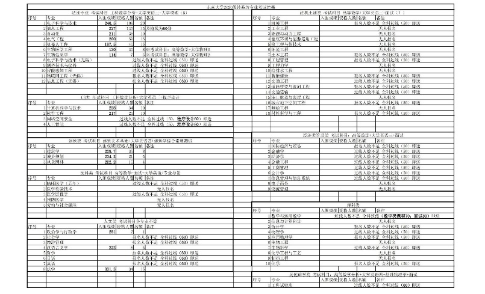
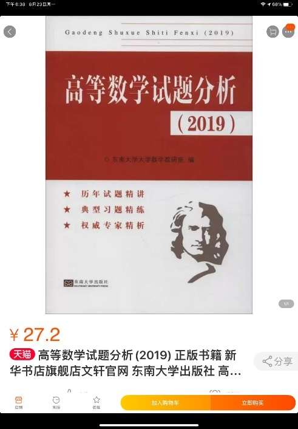

- [从机械到信息，一段平平无奇的转系经历](#70d0b5)[Step1 多方了解，提升自我（大一上学期）](#bcpg9y)[选择工科数学分析](#ec7yve)
- [学好高数/工数、英语这两门课程](#94l1xp)
- [学习转系考试中本专业不学习的课程](#4e9a2n)

[Step2 明确选择（大一寒假）](#8q5wvf)[Step3 在自己舒适的状态努力（大一下学期）](#cx75b1)

- [建议参加高数竞赛和英语竞赛](#8w6pg1)
- [工数：按照考研难度准备](#1h6b54)
- [英语：按照六级难度准备](#3ntowp)
- [大物：按照比平时难度高一点准备](#f1nd7u)
- [不要错过报名](#7vkntb)

[Step4 最后的努力！（大一下最后两周+考试周+暑校前两周）](#9agejy)

- [工数：转系原题+考研题目](#9iormk)
- [英语：六级真题+1.25倍速听力](#gaes6m)
- [大物：清华题库](#cmi0r4)
- 
- [保持良好心态](#6fu6td)

[STEP 5 GOOD LUCK!](#nm0s7)

## 从机械到信息，一段平平无奇的转系经历

**Stella**

这篇文章主要是从时间线上给学弟学妹们理清一个思路。关于转系的分享有很多，写这篇文章是想要让大家更清楚地明白在每一个阶段需要做些什么。在和我同一届的转系同学中，有些是在原专业绩点第一、转完系后仍然绩点第一的大佬，对于他们来说，转系考试就是有手就行。我和他们比起来，非常的平平无奇。在这里就和大家分享一下一个成绩普通、平平无奇的我的转系历程。

### Step1 多方了解，提升自我（大一上学期）

在这个阶段，如果是转系考试没有本专业大一学习科目以外的科目，其实并不需要太过于把思绪放在转系这件事情上。可以趁这段时间享受大学生活，同时多多了解自己现在的专业与想要转去的专业。一些建议：

#### 选择工科数学分析

某些院系辅导员可能会说选择工科数学分析会影响绩点，笔者认为工数与高数的差距并不大，选择工数是为了转系后不用补修，总之选择工数的益处肯定是很多的。

#### 学好高数/工数、英语这两门课程

几乎转所有专业考试科目中都有这两门，所以打好基础非常关键。笔者认为高数/工数至少应努力达到90+，我身边转系的同学几乎没有高数90以下的。英语则是注重平时积累，不要丢掉高中的底子即可。

#### 学习转系考试中本专业不学习的课程

如果是转电子信息、电气自动化等专业，可以忽略此条。但是**转建筑或计算机等专业**的同学，一定要注意此条。我身边转上述专业失败的都是因为程序设计或者建筑类专业课程没过线。

### Step2 明确选择（大一寒假）

在大一结束之后，通过大一的绩点水平大体可以判断出自己的水平。寒假的时候在家也方便与父母交流专业选择等问题。在这个阶段，就可以做出一个初步的专业选择。

此处附上东大小宝转系群里的转系数据可供参考。

### Step3 在自己舒适的状态努力（大一下学期）

在这个阶段，需要认真学习的有3门科目，笔者建议可以在此阶段做一些转系试卷的练习，在平时加强各学科题目的练习，但不必过于焦虑，在自己舒适的状态下努力。在这个阶段的一些建议：

#### 建议参加高数竞赛和英语竞赛

参加高数竞赛以及后续省赛国赛培训是提高高数水平的一个好方法。如果竞赛题的难度都可以掌握，那么转系考试就并不是特别困难了。同时高数竞赛也是一个很好的水SRTP学分的方法，很多同学考参加一年的校赛省赛国赛就可以获得6-7分SRTP。如果校赛没有通过也不要灰心，可以找高数老师推荐。这件事不要害羞，就是一句话的事情。后续的省赛国赛获奖概率也会比校赛高很多，基本上去了就给。同理，英语竞赛也是一个水SRTP学分的好竞赛。

#### 工数：按照考研难度准备

工数是非常建议大家去刷考研题目的，在转系考试中会出现大量的考研原题，刷到就是赚到。此外刷历年期末考试真题，保证期末考试能考出理想分数。还有一本辅导书是很多大佬最爱并且刷好几遍的——东南大学自己出版的高等数学试题分析。

#### 英语：按照六级难度准备

英语的准备就是两部分——背单词+刷题。个人觉得英语这种东西，只要提高了自己的基础，无论怎么考分数都会很高的。背单词我用的不背单词app，每天背40-60个雅思词汇（因为同时在学习雅思）。刷题就是六级真题，每周一套是比较合理的速度。

#### 大物：按照比平时难度高一点准备

大物的准备我主要是刷清华题库，但最后转系考试的难度是大于它的。所以清华题库的正确率必须达到90%以上，并且每道题的每个知识点必须理解清楚。

#### 不要错过报名

### Step4 最后的努力！（大一下最后两周+考试周+暑校前两周）

在这个阶段，你将同时面临考试周与即将到来的转系考试。一般来说，转系考试在考试周结束后的两周左右。但不要慌张，这两个考试其实并不是相矛盾的。尤其是转信息工程，转系考试科目都是期末考试的学科。

#### 工数：转系原题+考研题目

考研题目的重要性上文已经提过。转系原题也是非常重要的。除了熟悉题型外，转系考试中也会出现很多与往年题相似的题目。这个阶段就是刷题+反思总结，不可以停下来。

#### 英语：六级真题+1.25倍速听力

由于转系听力每年都非常迷惑，所以建议此阶段以1.25倍速的速度练习。转系考试中也会出现一些词汇与语法的选择题和改错题，所以可以额外练习一些，注重词汇和语法。其它的阅读写作模块，按照六级真题准备是没有问题的。英语的练习要一直保持到考试前的最后一晚。

#### 大物：清华题库

#### 

大物当然也是刷题+反思总结。由于大物是最后一门，加之期末考的不错（90+），我准备的时间不长。考完之后我就非常后悔，最后只考了70多分。所以建议大家不要因为期末考的分数高就轻敌，除了清华题库也多去做点其它的题。

#### 保持良好心态

如果你缺乏动力，你可以不断提醒自己转系对于自己人生的重要性；

如果你容易焦虑，你要相信就算转系没有通过，仍然有出国、考研等途径可以跨专业（我的一个机械学长通过学校3+2早稻田项目成功转码，跨考成功的例子也非常多）。

一个小建议就是，不要拿自己要转系的事情炫耀或者让大家都知道，我始终是相信好事要成了再让大家知道才是最好的。对于身边传播焦虑、喜欢炫耀的同学，也要保持“不听不听我不听”的状态。（大部分考试前搞得全世界都知道他有多努力的同学，最后失败了）

### STEP 5 GOOD LUCK!

考试之后就是等待成绩，成绩一般会在一周左右在教务处公布，如果成绩与预估出入很大（如最终成绩只有27分），可申请去教务处查分。而教务处改分也基本只可能是因为分数统计问题出现的错误。其它情况下，查分是没有任何作用的，想要老师重新批卷也就基本不可能。如果有成绩达标但自愿放弃的同学，名额将顺位到下一位。最终名单与第一次公示成绩最多会有1名左右的差异。最后一句话，是我在转系前学姐告诉我的：

**转系考试只是最简单的考验。**

转系之后，你将面对很多困难。补修的课程会让本来繁重的大二课程雪上加霜；刚转系时基础不够，一些实验不会做；到新环境你会非常不适应；新的学院非常卷，压得你喘不过气……

总之，你必须充满面对这些困难的勇气。你要相信，转系考试只是在测试你是否有拥有面对一切困难的能力。所以不必太过焦虑，Good Luck!
