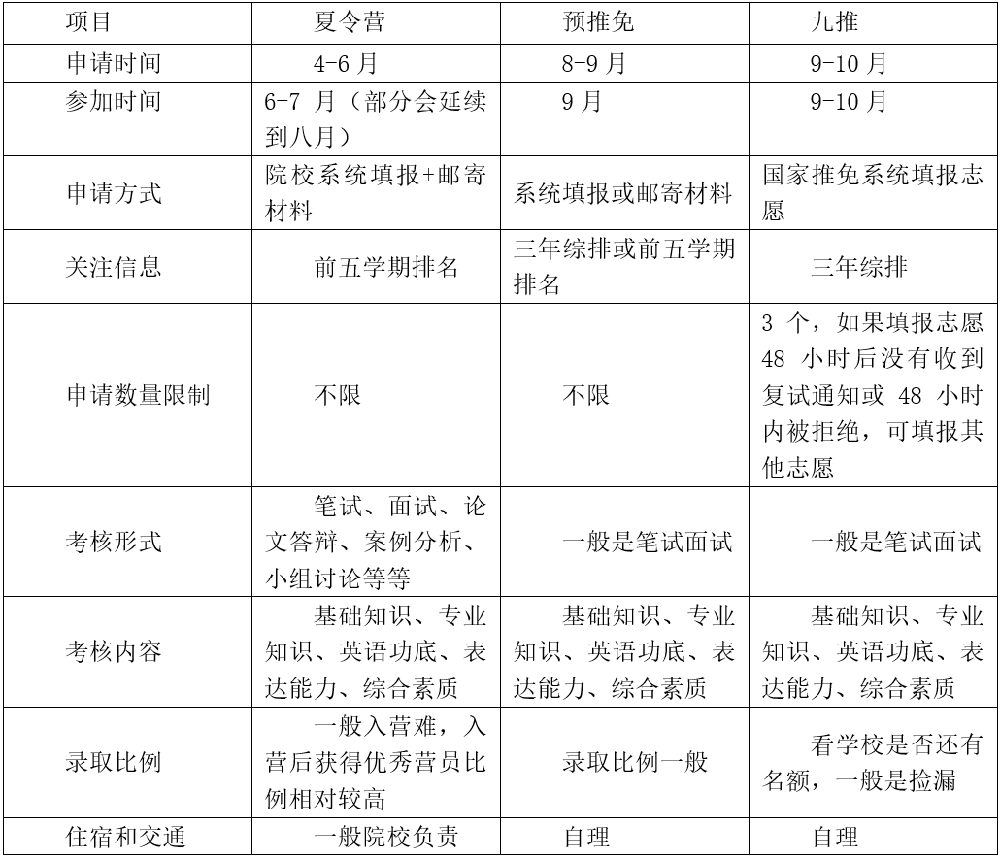

- [1.保研之路的开启](#8sj8zg)
- [1.1 保研是什么](#8dx3ar)
- [1.2 保研的分类](#733wm4)
- [1.3 保研流程](#frupmy)

[2.保研之路的铸就](#bcxeus)

- [2.1基础条件](#8xmkic)
- [2.2 保研是一场持久战](#b3fe7d)[一、课内学习](#1jolz3)
- [二、科研准备与竞赛](#1o93xt)
- [三、英语](#5i1wuv)

[2.3 保研过程当中各种经验](#eu6sxg)

- [关于信息搜集。](#2p6swi)
- [关于材料准备。](#9wpfmq)
- [关于材料投递。](#5guoqw)
- [关于导师选择与联系。](#bjt6p4)
- [关于面试经验。](#bbo94)
- [关于保研心态。](#bfd06j)

[3. 保研之路的延续](#5f6kod)[4. 关于保研，我想和你说](#4hpvdi)

- [4.1 保研案例分享](#cgh7ve)[1.我的大学之路](#fn7747)
- [2.一个万万没想到能保研的人的保研之路](#dottc0)
- [3.东南大学经济管理学院保研至上海交通大学中美物流研究院](#2t8o81)
- [4.经济管理学院物流管理，保研至南京大学工程管理学院物流工程与管理专硕。](#9mvqs5)
- [5.仪器科学与工程学院测控技术与仪器专业，保研至北大深研院学硕](#81vph7)

[4.2 保研真的是大学最优解吗](#eaetlp)

# 1.保研之路的开启

## 

## 1.1 保研是什么

保研（全称：推荐优秀应届本科毕业生免试攻读硕士学位研究生），又称推免，顾名思义，保送者不经过全国考研统考笔试等初复试一些程序，通过一个考评形式鉴定学生的学习成绩、综合素质等，在一个允许的范围内，直接由学校保送读研究生。在东大，保研成为很大一部分本科阶段的目标，东大每年的保研率控制在**学生总人数20%-30%**，在**吴健雄学院、建筑学院、部分学院的荣誉班的保研率更高**。**支教保研、流动助教保研等特殊情况不在本方向讨论范围内。**

## 1.2 保研的分类

**·学硕**学术型硕士一般是指拥有学术型学位(academic degree)的人员，按学科设立，其以学术研究为导向，偏重理论和研究，培养大学教师和科研机构的研究人员为主。

**·专硕**专业型硕士的简称，取得专业学位（professional degree），中国学位类型的一种，与之对应的是学术型学位（academic degree）。专业学位与学术型学位处于同一层次，培养规格各有侧重，在培养目标上各自有明确的定位。专硕的目的是培养具有扎实理论基础，并适应特定行业或职业实际工作需要的应用型高层次专门人才。值得注意的是，当前许多高校和专业的专硕培养与学硕并无二致，在保研过程中需要相对应了解。

**·硕博连读**硕博连读指招生单位从本单位已完成规定课程学习，成绩优秀，且具有较强创新精神和科研能力的在学硕士生中择优遴选博士生的招生方式。拟进行硕博连读的学生需根据招生单位规定提出申请，并通过招生单位组织的博士生入学考试或考核，被录取后才能进入博士阶段的学习。

**·直博**直接攻博的简称，是博士招生方式之一（统考招生、硕博连读、提前攻博、直接攻博）。简而言之，就是本科生直接读博士学位。通常是在获得保研资格的学生里面选拔优秀学生直接攻读博士。直博是无需参与博士入学考试的，获得直博资格，就从硕士开始，一路直接读到博士毕业。

**·保内**指具备保研资格后，保送至自己本科就读的学校，一般是直升原专业对应的研究生方向。

**·保外**指具备本校推免资格后，保送到其他学校读研。保外的话可以跨专业，也可以不变专业。

**·跨保**指跨专业保研，即具备保研资格后，选择与本科所学专业不同的跨学科的另一种专业读研，其具体流程和保研类似，如申请夏令营、九月推免等。

## 1.3 保研流程

申请推荐免试研究生一般有如下几个阶段：

**一、3月-7/8月 **

具备招收推荐免试研究生资格的高校院系陆续发布保研夏令营办法或者保研简章，预计具备保研资格的学生按高校院系要求准备申请材料在规定期限内寄送/邮件给高校院系，并根据是否入选去参加对方高校考核，并将考核依据作为是否录取的重要标准。

如果夏令营录取情况不理想不要灰心。因为毕竟是**第一波录取**，各路大神喜欢抢很多offer托底，因为清华北大不是所有学院都开夏令营，这波大神会等着9推的时候推一波清华北大，夏令营先收割一波offer留底。

**二、8-9月 **

具备招收推荐免试研究生资格的高校院系陆续发布保研办法或者保研简章，此阶段简称**“预推免”**，具体流程同上，并将考核依据作为是否录取的重要标准。在这一阶段，自己院系会确定你是否具备保研资格。

**三、9月28日 **

经历保研夏令营与预推免后，最终确定去向，填写全国推免系统，此时大部分学生的保研之路已经完成。

**四、9月28日以后  **

**正式推免**，但这一阶段绝大部分高校已经结束保研工作，极少高校未收满或特殊情况会再进行招募，捡漏机会较少。

注：2020年由于疫情，考研复试时间线往后移，相应导致部分高校保研工作延后，所以今年全国推免系统时间节点不再是9.28，而是相应后延，这是特殊情况，按往年经验都是9.28，所以看疫情发展不知道明年会不会改变时间点，时间点仅是参照，特此说明。

**五、10月-   推免生公示**

具体来讲，**保研精华过程就是夏令营和九推**。夏令营一般都在大三暑假期间，各学校的夏令营招生简章基本上在每年的3-4月份发布，要多收集相关信息。

夏令营过程中一般时间较长（3-5天），期间会**包含听讲座、参观校园、与大咖交流、面试笔试等等环节**，内容丰富，可以遇到各个学校优秀的小伙伴们。如果夏令营获得了优秀营员或成绩合格，学校会在结束后发放拟录取通知，这就相当于自己已经有了接收的学校，那么在九月份本校的资格面试中获取推免资格后填报系统即可。现在各大高校基本上都是通过夏令营来招收推免生，是保外的主要渠道。

**九推九推，顾名思义，九月正式推免**，就是国家推免服务系统开始到结束的时间，推免服务系统正式开放时间是9月28日，在9月28日到10月25日之间，各院校会根据自己的招生名额进行招生，一般是进行名额补录。九推所交材料较为简单，考核也较为简单，一般只有笔试面试。

除了夏令营和九推，还有一种形式叫**预推免**，通常我们也会把它算作九推的一部分，因为时间和九推很近，一般在8-9月份。有的学校或专业没有夏令营，只有预推免，例如东大部分院系就只有预推免。预推免的流程一般也较为简单，获取复试邀请后参加复试（笔试+面试或纯面试）即可。

综上所述保研的流程，能概括为分两步，不管是保内还是保外。

**第一步：拿到保研资格，东大放你走人。**也就是8月-9月的东大院系保研流程通过后，你的综合排名在可以保研的名额内，你就算是拿到保研资格了。

**第二步：有目标学校正式接收你读书。**这里如果保内就是联系本校的导师，让本校接收你，如果是保外就是联系外校的导师，让外校接收你。

这里有必要提一句，因为为了让本院的学生在保研第二步有优先权，所以**如果选择了保内，那么学院就会给你在第二步的时候预留名额**，然后把剩余的可以接收推免学生的名额留给外校的推免生。这样一来在拿到保研资格后你必须决定你是保外还是保内，**两条路不能并行，一旦选择了保外就没有回头路**，最焦虑的情况是决定了保外但是夏令营没参加或者没有保底offer，这时候预推免阶段压力就会很大，所以建议多尝试夏令营，9月初的预推免是你最后的机会，撕破脸皮去抢offer吧。

# 2.保研之路的铸就

## 2.1基础条件

**基本条件（以东大为例）**

被推荐的学生应是政治思想表现良好，学习成绩优秀，综合能力强，学术研究兴趣浓厚，有较强的创新意识、创新能力和专业能力的优秀应届本科生，并须符合以下基本条件：

（1）思想品德优良，无任何考试作弊、剽窃他人学术成果以及其他违法违纪受记过及以上处分记录。

（2）身心健康并达到体育教学基本要求。

（3）学习成绩优秀，修完并通过前三年（五年制前四年）所属专业指导性教学计划中规定的所有课程。

（4）前三年（五年制前四年）所属专业指导性教学计划中必修和限选课课程平均学分绩点 (按课程首修成绩计算)在**专业排名前40%**(吴健雄学院的学生平均学分绩点在年级排名前 60%)。

（5）**英语水平要求 CET-6 在 430 分及以上或 CET-4 在 520分及以上或TOEFL 100分及以上或IELTS 7分**（单项分不低于6.0分）及以上；小语种参照上述标准执行。**英语专业的学生要求TEM-4在70分及以上**。

**破格条件**

基本条件中的第（1）、（2）、（3）款为必须具备的条件，不能破格。申请对第（4）或第（5）款破格的学生，平均学分绩点至少在**专业排名前 45％**，或**英语 CET-4 应达到 425 分及以上或TEM-4达到60分及以上或TOEFL 95分及以上或IELTS 6.5分（单项分不低于6.0分）**及以上。

（1）一般破格

在本科学习期间具备以下条件之一者可进行一般破格，**至多只能在基本条件中的平均学分绩点或英语要求中破一项**。 ① 获得相关专业的具有学术意义的省级一等奖、国家二等奖以上各类学科竞赛（见《大学生手册》中的竞赛项目）奖项（第一获奖人）。

② 在规定刊物（见《东南大学学位与研究生教育重要刊物目录》）上发表过与所学本科专业有关的学术论文（第一作者）。

③ 参加科研课题的研究，有较强的科研实践能力并取得优秀成果者（通过省级及以上成果鉴定前2名或取得授权发明专利的第一发明人）。

④ 省级及以上“三好学生”、“优秀学生干部”、“优秀团员”，校长奖学金获得者、校级“三好生标兵”、校“学习优秀生”。

⑤ 平均学分绩点3.0及以上，同时满足专业排名前5％或前三名者。

⑥ 申请西部支教计划。

（2）特殊破格

在本科学习期间具备以下条件之一者可进行**特殊破格**：

① 获得全国挑战杯课外科技作品竞赛特等奖或全国挑战杯 创业计划大赛金奖的第1、第2、第3人，可破基本条件中的平均学分绩点和英语要求二项，第1获奖人破平均学分绩点排名时，可不受排名位次的限制。

② 获得数学建模竞赛国际特等奖的第1、第2、第3 人，可破基本条件中的平均学分绩点和英语要求二项。

③ 获得数学建模竞赛国际一等奖或全国一等奖、在本科学习期间获得经校推免生工作领导小组认定的相关专业的具有学术意义的全国竞赛一等奖的第1人，可破基本条件中的平均学分绩点和英语要求二项。

④ 对个别确有特殊学术专长或具有突出培养潜质的学生，经三名以上本校本专业教授推荐，学生申请及有关说明、每位教授的推荐信和学院审核签署意见表等材料，必须进行公示，报学校推免生工作领导小组审定。

（3）**申请破格程序：**

① 学生本人填写申请表，并向学院推免生工作领导小组提交符合破格条件的相关证明材料（原件和复印件）。

② 学院推免生工作领导小组和专家考核（审核）小组，可会同相关期刊杂志单位、赛事主办单位等，对申请者的科研创新成果、论文（文章）、竞赛获奖奖项及内容进行审核鉴定，排除抄袭、造假、冒名及有名无实等情况，并组织相关学生在一定范围进行公开答辩，专家审核小组及每位成员都要给出明确审核鉴定意见并签字存档。

**答辩全程要录音录像，**答辩结果要公开公示，未通过审核鉴定或答辩的学生不得推荐。学院将经学院领导小组组长签字、加盖学院公章的符合破格条件的申请者申请表和汇总表上报教务处。

③ 经学校推免生工作领导小组审定批准后，学生所在学院方可公示申请者名单并填写相关表格。

**其他说明**

不同院系在进行推免工作确定保研名额时，主要是根据最终综合排名，按序录取。若学生自愿放弃录取资格，须签署相关声明。各学院的加分条件不一致，部分学院没有综合加分，主要以学习成绩作为重要参考条件。

## 2.2 保研是一场持久战

### 一、课内学习

关于课内学习。绝大部分“过来人”都认为关键在于如何**高效利用课上时间**尽可能多的去获取知识，从而节省出课下时间去做自己想做的事情。绝大部分人在考试周没到之前不会刷题，主要还是**上课听，然后尽快完成作业和老师的任务**。

有一些学长学姐传下来的一套说法是“平时不学，考试突击”，有一定概率能取得不错的成绩，但是学知识不是为了考试。并且考前突击真的很累，每个学期东大的考试周都有在通宵自习室学习，然后第二天在考场上晕倒的。也有学长学姐说：“我上课不听，我课下自学”。实话说，大学的知识，你上课不听课下自学确实能够学会，但是，如果你计算一下时间成本，还是上课认真听合适。课都是要上的，你上课不尽量去听的话，你课下补的时候就吃力很多，这样时间就没了，就很难再去做竞赛、项目，而且你还会学的很累。

关于大佬的**时间管理**：

*“我的时间管理不敢说很好，但是很独特，我大一的时候中午如果是11：25下课，一下课我就立刻收拾好冲到楼下，骑上车，到达梅园食堂（我住桃园为什么去梅园吃饭呢？当时还没有桃园新食堂，一般教学楼下课的同学都去旧食堂，我如果去桃园食堂的话骑车就没有**时间优势**，照样得排队；于是我骑车去梅园，到那也没多少人，因为大多数人都是走路的；然后我买了饭，吃完饭大概11：45左右），到达宿舍11：50，写个40分钟的作业到12：30，再睡一个小时的午觉，就准备去上课。**课总有没满的时候，没课的时候如果作业还没写完就接着写。***

*这样的话一般到了晚自习之前就写的差不多了。**那晚自习干嘛呢？我当时是看其他方面的书，心理学的、法学的、经济学的，当时也是想多学一点。下了晚自习之后有的时候还要去排练。**周六日呢？做志愿、做竞赛？都可以。所以，其实**你效率够高的话，课下的时候花在课业上的时间是很少的**。—— 李想”*

许多学长学姐都强调**重视课本**。为什么呢？因为很多人课下光拿着老师的PPT在看，丝毫不看课本，觉得课本内容多，废话多，没有必要看，在PPT上的内容都是重点，只要看重点就行了，而且省时省力。其实这是错误的，课本的叙述具备完整性，具有逻辑和脉络，但从应试角度来讲光看课本和光看PPT都不可取。**“过来人”的建议是，平时的时候看课本，等到考前（也就是著名的考试周期间）看PPT。**换句话说就是，平时掌握牢固，考试抓重点（有些院系部分老师的PPT是自己做的不按照课本的，那就更应该重视课堂学习，往往老师会有推荐书目或者课本，这时候也就又是重视课本了）。

课内学习一个很有趣的现象，年级越高（一直到大三），我们越会发现身边的同学们上课出勤率变高、听课的专注度和回答问题的频率变高、课后拥上讲台向老师请教问题的次数变多，因为他们意识到了成绩的重要性，但往往在大家都知道努力的时候你再努力就已经来不及了，**因此如果想要保研，大一、大二时期的成绩是非常重要的**，保研看的是大学前三年的综合成绩，因此对每一门课都不能掉以轻心。

如果学弟学妹们想要保研，那一定要尽早准备。当然也不要为了绩点放弃所有的大学活动，在组织活动与参与活动的过程中自己的沟通、表达能力是能够得到提升的。如果决定了要做一件事情，就不要轻易放弃，大家都知道学习成绩很重要，但能够坚持下来的人不多，如果你坚持下来了，你其实就已经成功了。

**关于刷题。**这个是困扰许多学生的问题，甚至也有人因为不刷题吃过亏。东大有著名的《东南小题》就是应试法宝，大多数进入大学是比较讨厌刷题的，因为高中的时候刷的太多了，到了大学就怎么也不想刷题，都大学了为什么还要刷题，实际上是需要的。

慢慢的你们会发现，有些人平时不咋学，考前疯狂刷题也能考个还算可以的成绩，这是因为，东大的考试卷都很套路，几乎所有科目，每一年的题目分布啊，题型啊都差不多。你不刷，就会发现可能你跟那些人考的差不多，虽然你知识掌握的比他们牢固。为了不出现这种尴尬的情况，**“过来人”建议，需要刷题。**

而考试周期间大部分人基本上可以快速地刷完往年题。但是这个刷要讲方法，有时候没有必要非要动笔去做一整套。

拿大一时的高数为例，比如有10套往年试卷，其中7套一般拿来用眼睛扫，看哪些题目第一眼看到没有思路，如果有这种题目，通过看课本，跟同学讨论甚至直接看答案的方式弄明白，基本上看到第4、5套的时候就掌握套路了。最后3套用于练手，练什么？练练看你会的题能不能做对，不因马虎而丢分，避免眼高手低，高数课大部分人都提及课堂只要平时高数听懂了就会快很多。

**关于专业基础课与通识课。**专业基础课“过来人”觉得功利一点讲应该按照学分，然后是个人兴趣爱好来划分重要等级，虽然都很重要，但你若做不到面面俱到，门门高分，还是应该明确一下的。

像高数，大物，线代几代（线性代数几何代数）抑或是C++这样的高学分有难度课程，一定是要排在高等级重视度的行列，为什么很多院系都有吃大一大二绩点的说法，就是因为**专业基础课较专业课相对好拿高分**，学分高，所以可以提供给你之后大三大四比较高的下限成绩。关于思政课类通识课，学分多，所以不要不重视，对绩点影响很大，而这些课，大概率你上课多互动（即便是不会讲也应该积极发言让老师记住你），再加上考前背背就不会有太大问题。

**关于专业课。**相较于专业基础课，专业课的学习相信各大院系都有共通之处，就是难度大，学分中等偏高，都要求你**和老师保持比较积极的交流**，刷题在专业基础课的作用较大，在专业课这里也一样重要，只是除了刷题，理解和课堂交流互动格外重要，这里需要你花更多的心思去慢慢消化，保研需要好成绩，很大程度上取决于2-3年的专业课学习，认真完成专业课老师的任务，积极参与课堂，善于表达想法和讨论，给老师留下好印象，都是很不错的提升成绩的办法。

### 二、科研准备与竞赛

**关于找老师尽快铺垫科研经历。**保研过程当中，**具有科研经历和基础**，会是你最重要的敲门砖，许多学长学姐建议**在有条件的情况下尽早进组**，多向学长学姐打听哪个老师会管本科生，然后直接发邮件联系，不要怕。大不了就是一个拒绝，再联系下一个，问题不大。**在保外中，对科研的看重一般是大于竞赛的。**

快的人从大一时候就已经进了老师的课题组，等到了大二的时候就已经在国际期刊发表论文了，大学不会有人催着你，有老师主动找你，说“你要不要来考虑一下我的项目？”这种情况是不存在的。要尽量主动一点，尽量抢占先机，可以先从你们的任课老师开始了解，然后问问学长学姐，甚至是研究生学长学姐：这个老师带不带本科生，管不管本科生？本科生找老师带的话，**不要过于要求老师的实力**，老师的实力强你也用不到，主要找一些对你负责，愿意帮你管你的老师。

**关于大学生科研训练项目（SRTP）。**

科研不能算成绩，更多的是荣誉和经历，东大学生大多有选择SRTP项目的机会，可以尝试，一些人是为了混SRTP学分，不得不说，无数学子进了东大校门被告知SRTP很难得到，需要重视，但其实这个没什么用，不需要太过重视，只要你想毕业，2分总能得到，所以这个SRTP项目更亮眼的是那张省创或者国创的证书，更大的意义是**通过项目进行的科研尝试、论文写作和发表尝试、团队合作、导师指导及结识的人脉关系**。

在这个过程中队友需要给力，建议大家找到几个**靠谱的队友**就一直保持联系，抓住别轻易放走，既然都培养出了默契，真没必要参加下一个项目的时候就换人，几个人熟悉了也好协调工作。从项目里面延伸出来创新想法可以转化成专利、写论文、或者跟老师紧密交流向挑战杯发展。

项目方向问题也需要重视，既然是科研，不免谈到你以后的研究生方向，大家可能会说，我现在只知道做项目攒经历，还不知道以后读研是啥方向呢，但是你肯定有一个兴趣点或者有个大概的选择，那就不要做太多样化的，可以抓住一个方向多做一些项目，简历看起来会好看许多。

**是奔校创还是奔国创还是奔省创：**校创是基础，有校创项目，你可以在这个基础上添加内容和创新点来申请省创或者国创，所以觉得校创不需要多谈，省创和国创看你个人选择，能国创就一定要国创，其实含金量和工作量没有很大的区别，就是手续方面复杂一些，但你之后面试可以说自己做过国创项目，会好听一些。

**关于paper和会议。**科研除了SRTP项目以外，不得不谈的就是文章和出国参加国际学术交流会议。本科生也是可以写文章的但万事开头难，所以比较费时，但你花心思进去就能得到一些回报，可能也会失败，但积累下来的经验都会在你之后的科研生活之中被用到。文章的内容可以是你的SRTP项目或者你的竞赛部分，做出一些拓展，一旦见刊，具有非常大的含金量，哪怕不是SCI或者EI，是一个核心期刊论文也会让你的简历多出一行亮眼的内容。

出国的经历看机会，很多东大学子本科生参加国际学术交流会议，要相信自己，如果**有类似的学术性质的出国机会**大家还是要把握住，注意是学术性质，非学术性质的出去玩看你自己选择，“过来人”觉得有时间就去，没时间自己成绩也不够稳就不要浪了。因为你最后保研面试什么的有国际性的内容介绍还是很加分的，哪怕是比较low的一些活动。

文科专业同学而言，从身边的保研经验来看，**文科专业的同学在本科期间是否发表过论文并不重要**，发过核心期刊的当然另当别论，这种同学天赋异禀，人数极少。对于大部分同学而言，**发一篇“水刊”对保研的作用并不大**，老师们一眼就能看出你的论文质量如何，如果论文本身的质量不高，发再多篇也无济于事。如果你发表过论文，老师对你第一印象会比较不错，因为你有发论文、搞研究的意识，但并不是谁发的论文多就录取谁，老师最看重的是你的**思想的深度、你的人生态度、你的专业能力和研究潜力**。那上述能力老师该如何对你进行考核呢？在面试的过程中，老师问你几个问题，就能把你的底细摸个大概。所以想要保研成功，必须有真材实料。

**关于竞赛的认识**。竞赛与科研并驾齐驱，往往会被广大学子取舍发展，学术强而竞赛弱，竞赛多而科研薄，身边诸多同学也难逃精力有限，但也有少数并驾齐驱，皆露锋芒，所以二者非鱼和熊掌。

见过很多学生把本专业所有相关竞赛全参加并获奖了的，这很难确实，但有机会，就上竞赛校网报名呗，报名没有成本，找几个之前在科研部分中介绍过的靠谱稳定三两队友一起拼搏一波，你竞赛越全，奖项等级越高，之后面试初始啥的就越亮眼，也要考虑竞赛和科研的相辅相成，若是能够将竞赛的奖项和科研有机结合，方向和内容相辅相成，帮助自己在相关领域的个人自述更具优势，那就是本来就强的AD带了辅助加了C了。

**关于竞赛的过程。**第一点，**提高自身实力**永远是最重要的。要抱着学习的态度去做竞赛，尽量让自己成为carry全队的那个，至少是不拖后腿的那个。第二点，除了像高数竞赛这种单枪匹马式的，很多竞赛都需要组队，有的时候队伍组的好不好就决定了你能不能获奖。找队友的话，实力和责任心要兼顾，但这两者在不同的情况下占的比重不一样。比如像数学建模这种竞赛，队友的合适与否会极大程度地影响你的参赛体验，像这种比赛，**找更负责任的队友比找更有实力的队友要好得多**。良好的竞赛体验，可以收获友情，更可以收获爱情。

做竞赛是要**吃苦头**的，比如数模、电设之类的一般来讲都是要**熬夜**的。那个时候你会在金智楼或在教学楼下观看日出的全过程。不要害怕啊，其实那个时候还是蛮有成就感的。比如我做机器人大赛的时候，比赛那四天每天只睡4个小时不到，凌晨2点睡，6点左右就要起，去调试。有的时候突然想到代码应该怎么改了，会惊坐而起，下床，改代码。参加竞赛，也能锻炼你的一些意志品质，你也会收获很多。

竞赛也没你想象的那么难，大多数竞赛都比较好拿奖，所以**尽量参加自己感兴趣的竞赛。做自己不感兴趣的竞赛就很容易在潜意识里划水**。随着年级的增加，竞赛做的数目要减少.。乍一看，跟刚刚讲的，要广泛地体验竞赛似乎有些矛盾。其实是不矛盾的，建议你们**广泛的参加竞赛，是为了试错**，去寻找自己的兴趣点。等到了你大二大三的时候，你们要学着去**缩小竞赛的范围，要更专，更精**。尽量别把时间花费在对你自己发展而言无意义的竞赛上。

### 三、英语

保研对英语要求不高的，六级过线、四级过520就够用了，考级前刷刷题就行。但是强烈建议学弟学妹们，大一大二入学的时候就学一学托福或者雅思，选择面会更广，况且现在搞科研都是老美那一套，都必须要**有一定的英语阅读与写作能力**。保研和出国要求的东西有很大一部分是重合的，对于材料学科，绩点、科研，这都是核心竞争力。大一大二努努力学学语言，在保研/出国季就会有更多的选择。总而言之，英语好可以拓展人生更多的可能性，更容易选到适合自己的路。

## 2.3 保研过程当中各种经验

### 关于信息搜集。

有人常常说保研是一场**信息战**，不管是在准备申请还是准备参营阶段，信息获取程度都会对保研结果产生很大的影响。对于申请学校、学院、项目和学科领域等方面，都有大量信息需要及时获取，以免影响申请。保研信息收集渠道主要有以下几个：

**（一）保研公众号（信息分享类+知识分享类）**

微信公众号上不仅仅能找到保研信息汇总、经验分享，也有很多知识分享型的公众号会提供很多学习资料。

1. **保研类：**保研人、保研夏令营、保研福利社、保研网、保研论坛、易保研、中公保研。该类公众号会综合梳理各类专业的项目信息，能节省自己搜集信息的时间。但要注意有时会出现遗漏或者没有及时更新新增项目信息的情况，可能会影响自己错过申请时间而错失机会，这些保研类平台，大多不是公益的，**东大这样的学生建议只使用信息就可以，那些让你报班、保研保过的都是忽悠，东大的学生不需要这些辅导**，这些辅导经验你很大程度上自己就可以积累或者问学长学姐就可以取得。
2. **思享系列高校公众号**：在微信搜索 “思享”即可，会出现各个高校的思享公众号，也有大量保研经验贴。学长学姐会详细地分享自己的保研经验，包括申请时间线、项目偏好、笔面试经验等。这些信息能加深你对于申请项目的了解，从而在申请阶段有针对性地写材料，在入营准备期间全面备考。
3. **目标院校/学院/项目公众号**：大部分学院或者项目都会有自己的公众号，除了会和官网同步发布项目官方通知，也会分享以往夏令营/推免信息、学院学习就业情况等。关注公众号后能及时看到最新的申请通知，比每天查看官网会更便利（**值得注意的是，许多院系夏令营通知会发布在官网，蹲守公众号可能会落空，千万以官网为准，要蹲守目标院系官网的实时动态！**）。

**（二）保研群**

很多保研公众号上会发布群号，可以直接加入。相关项目或者专业的保研群里，大家会在群里讨论一些共性的问题，比如是否有人收到入营通知、学校的官方回应、申请进度等，信息会比较及时，也能与申请同方向的同学有更多交流。

**（三）院校官网、咨询电话**

在官网上都能找到对应项目的咨询电话。对于通知中不明确的内容或者在申请过程中出现的问题都可以**直接打电话**问，这是最直接、准确、有效的途径，相关负责老师也会耐心给出解答，**遇到疑问自信大胆打电话发邮件**，是获取直接信息和解答的最好途径。将目标院校发布信息的网页收藏，每天点进去浏览一下。一定要注意找准该院校发布保研信息的网站是院系官网还是研究生院，如果因为信息缺失而错过报名会很可惜。

**（四）老师和学长学姐**

自己院系的人能去什么样的学校，本科老师最清楚，老师也有很多的人脉、门生故吏、学术圈子，所以有时候**老师推荐或者打招呼**有很大用处（这时候千万要注意自己甄别，老师很可能会为了维护关系或者其他原因想让你去某个地方抑或想把你留在本校，这些情况不可避免，自己注意抉择）！而很多人的保研之路其实是重复学长学姐走过的路，这时候他们的经验至关重要，对于你了解**对方高校的套路、老师的脾气、面笔试的喜好**等等有很大帮助！

### 关于材料准备。

**保外一般需要以下一些材料**：成绩单（加盖教务公章）、院教务出具的排名证明、简历（注意与求职简历有所区别）、个人陈述、推荐信（一般需要两位老师的推荐信）、英语成绩证明、各种证书奖励的复印件/扫描件、部分专业需要作品集等。

1. 教务处的成绩单可以在机器上自己打印，多打印几份，并**扫描存档**，有些学校需要网上提交扫描件。
2. 院系出具的成绩排名证明记得提**前准备**，因为要**加盖院公章**，有些院系公章可能需要跨校区去盖，因此要注意提前准备。并尽可能多准备几份。
3. 简历与个人陈述主要要结合自身情况及申请学校或专业的特点进行撰写，**多参考案例**，有条件的同学也可以选择参考例如保研论坛、保研人举办的活动，学习一下相关专业的文书技巧。
4. **推荐信一般都是自己写好，找老师签名**，最好找比较熟悉的老师，给自己上过课的老师签名。
5. **将自己的获奖经历、荣誉称号、科研项目、论文发表等信息提前编辑好放在一个文档里**，这样省去了在后面填报各校系统时的繁琐与重复性工作。
6. 将各类证书材料提前扫描、存档，最好去打印店扫描，不要用手机扫描全能王之类的，质量还是有差别的。
7. **所有文件记得备份！！！**

在准备材料的过程中注意不断打磨、完善自己的材料，尤其是简历和个人陈述，要突出自身特色和闪光点。保研是一个双向匹配的过程，**你不仅需要论证自己有实力，更需要论证自己为什么适合这个项目、能够给这个项目带来什么。**所以，丰富的个人经历需要和项目特点及要求挂钩，同样的经历在申请不同方向、不同项目时，呈现在简历和个人陈述中的内容是全然不同的。

**可能用得到的小tips：**大部分院校都要求申请者**寄送纸质版材料且要发送电子版材料**到某邮箱。有一个整理纸质报名材料的小细节，你可以买一包**长条形的那种彩色便利贴**，首先将上述的9种材料**按目标院系的要求按顺序排好**，然后**在便利贴上写上“申请表”、“个人陈述”等等，贴在每种材料的第一页**，这样一来，可以为负责整理报名材料的老师节省很多时间，增加他们对自己的好感度，有利于申请成功。

### 关于材料投递。

无数过来人的经验都是认为**夏令营一定要海投**，主要原因是前面保研流程里已经提及，夏令营是“保底”阶段，有了保底预推免就可以从容不迫“选优冲优”，每个学校要求准备的材料在官网都清楚有写，但不外乎成绩单，简历，个人陈述，英语成绩等。

但不排除自己院系老师不希望你海投的情况，因为考虑到你夏令营拿到offer但最后没去，会对后续的产生影响，但其实从学长学姐的建议来讲，夏令营可以海投，因为绝大多数开夏令营的高校都会知道最后的优秀营员转化率，每年都有大量的人选择更好的放弃原有的，**最不道德的是为了自己的利益，满口答应对方高校并把话说的很满但最终不去的人**，这种情况建议不要发生因为会对后续的可持续产生影响。

### 关于导师选择与联系。

从导师角度来看，你的**本科背景及项目经历**与**他的领域**是否贴合？如何通过**你已有的项目经历**令他信服你**在他的领域**会有很好的建树？导师录取学生的时候也会看这个学生的背景是否能够吸引到他，所以一个做什么方向的导师就会去寻找做过类似方向的学生，毕竟这样的话导师会觉得你既然做过一些这个方向，他会默认你在这个方向将来会得心应手一些；同样，如果自己将来想做什么方向，那么做项目的时候就要有选择的贴近这个方向，这样才有机会被青睐有加。

从“术”上来看，联系导师的过程一般称作“套磁”，在保研过程当中一般都会提前联系老师，在前期联系老师有三个节点。第一个节点是夏令营通知出来后联系意向老师问他的招生意愿，这时候可能会增加你进入夏令营以及夏令营成功的概率，第二个节点是夏令营入营后，这时候代表你已经通过院系初筛，所以导师认为你能来的概率比较大会更有信心一些，第三个节点是在营期积极和老师保持联系，最好在营期约时间提前见面聊聊，可以增加夏令营成功概率。

而在预推免阶段，也是同理，没有规定一定什么时候联系，自己按照实际情况联系，值得注意的是**不要联系同一个院系的两个老师“脚踏两只船”**，很容易翻船，要在这个老师对你没有太大意愿或者没有招生名额时，再联系别的老师。而在导师联系和选择过程中，通过导师评价网、前人读研经验等评判导师是否适合自己也是很重要的一环，**如果你有老师和意向导师熟识，最好是让你本科老师帮你牵牵线说说话**，有这个背书，会大大增加成功概率。

### 关于面试经验。

面试是保研复试过程中一个很重要的环节，在综合分数评价中占比较高，有些院校院系只有面试，有些院校院系会有笔试加复试，有些院校会根据本科出身和综合情况评定一个加成分，但无论如何，面试都是不可避免的。无论是夏令营还是预推免，面试的过程一般是：**自我介绍（中/英文）+专业英语问答+导师提问（针对简历、自述、发表论文及获奖各方面的情况）+导师答疑（部分会在结束前让面试学生问老师问题**）,也有院校会采取PPT汇报的方式（介绍自己大学成果或者自己做过的一个研究项目）然后老师提问。

在面试环节老师主要也是看着简历对学生进行提问，所以**简历上最好把科研经历都列上**，并且着重标明自己的参与度与贡献。面试之前最好准备好自我介绍，熟悉自己做过的项目。面试时尽量表现自然，没有什么把握的问题也试着思考，拓展一下思路，向老师展现一下思考能力，千万不能不懂装懂。每一次面试也是经验积累的机会，多入几个营，多参加几次面试这套路就自然而然熟悉了，面起来也更得心应手，所以呀，还是要海投。

首先谈谈自我介绍的准备与注意事项。一般自我介绍都要求英文进行，时间一般在1-3分钟不等，建议大家可以多准备两份，比如准备一份一分钟的介绍，一份三分钟的介绍，有备无患，这样的话如果老师有时间要求，也不会惊慌失措。在准备自我介绍讲稿过程中，首先要有一个**逻辑框架**将自己大学三年的学习生活串起来，同时注意突出自己**在科研、竞赛等方面的特点和长处**，尤其是突出**与自己申请专业的契合度**。准备好讲稿后多练习，可以用录音器录下自己练习的过程，以便纠正错误的读音。

在导师提问环节，可能会涉及到方方面面的问题，比如介绍一下你对专业的认知和理解；为什么你的论文写的和专业不太相关？研究生阶段准备朝哪个方向学习？毕业论文准备做什么？还有就是专业相关的一些问题等等。这个环节一般时间比较长，问的内容和方向也大不相同，建议在准备阶段多找找所报学校和专业的面经，提前准备一下。另外就是面试前在面试间外的等待环节，可以多和周边一同面试的同学简单交流交流，尽可能多的获取信息。

有些面试中老师可能会问：“你有什么问题想问我们吗？”这个环节就坦诚提问就好，但是**不要问得太过分或者太功利**。

其他就是一些细节上要注意的地方:

1. 着装要求。尤其是商科专业面试，很多学校要求必须着正装参加面试。**即使没有特殊要求，也尽可能穿得正式一些。**
2. 礼仪。敲门问好这些就不用提了，另外就是要听从现场的安排。例如是否可以坐下面试。有些面试室内即使有椅子，但是还是要求全程站着参与面试（虽然有点奇怪，但是还是**不要一进去就坐下了**，因为下一秒老师可能会问：谁让你坐下的？）
3. 保持阳光与自信。在面试的全过程中，保持积极向上的精神面貌，保持阳光与自信，即使遇到不会的问题也不要惊慌，可以思考下自己的知识库里有没有相关的一些信息，尽可能说出一些，实在不懂也不要瞎编，可以坦诚地说不太了解，后面继续加强学习。
4. 不要顶撞老师，保持谦虚谨慎的态度。

### 关于保研心态。

在准备保研期间，很多人都会面临压力大的情况，所以找到适合自己的方式来调节压力很重要，也要注意劳逸结合；在参营的时候不要紧张，保持自信从容的状态，只要充分展现出自己的优秀就肯定没问题；如果夏令营没有拿到优秀营员也别灰心。

虽然可能会觉得周围同学已经定好了升学方向而自己似乎还前途未卜，因此产生更大的心理压力。但是，8、9月预推免和9月推免还是有机会的，**也有很多同学是在九推成功保研心仪的学校，或是从夏令营中的“待定”资格变为正式offer**，要相信自己到最后一定会收到好消息的。

# 3. 保研之路的延续

关于**保研后的生活**。于保研的同学而言，9月底基本就确定了研究生的去向，加之大四课程相对较少，因此相比于考研、出国或是找工作的同学而言，保研同学就多出了将近一个学期的相对闲暇的时间。然而**保研之后并非万事大吉**，因为大四之后将迎来研究生的学习生活与更加艰巨的挑战。因此，对于保研后相对空闲的这段大四时光，一定要好好规划，因为时间过的很快，尽量不要虚度。

“凡事预则立不预则废”。首先，需要思考一下**研究生阶段的规划**，建议可以准备一下**研究生阶段学习计划的撰写。**因为对于硕士研究生而言，**一方面是硕士毕业，另一方面就是研究生结束后的选择**（是就业还是继续读博？）。

在硕士毕业方面，要考虑**硕士毕业的要求**，需要什么样的研究成果，从而规划自己在研究生阶段大体的科研计划及进度安排，最好还可以和导师提前联系沟通下；在**毕业后的选择**上，如果是考虑好了继续读博，那在硕士阶段的学习中就应该做好相应科研计划，掌握需要的技术和知识，尽可能地顺利毕业；如果是决定了研究生毕业后要就业，那意向的行业是什么？除了科研学习成果之外，还需要哪些技能和知识？是否要去公司或单位进行实习？

建议可以利用大四的这段时间去好好思考和安排一下这些事情，这样也可以结合后面研究生阶段的学习生活不断进行调整，从而实现自己的**目标**。

另外就是大四阶段空闲时间的安排了。当然这段空闲的时间可以选择“放羊”水过去，但是考虑到后面的研究生阶段的学习生活，还是建议大家有所规划，珍惜这宝贵的半年时间。

如果是**研究生毕业后准备就业**的同学，这半年时间可以选择去进行一份高质量的实习，从而为后面的学习和求职增加经验；除此之外，能做的还有很多，比如学习英语，把雅思托福考出来；学习一些技能、考一些职业相关的证书等等；旅行+读书，所谓“读万卷书，行万里路”，多看看自己感兴趣的书扩大知识面，利用这段空闲时间出去旅行，见识不同地方的风土人情；健身锻炼，保持良好的身体状态，即使不锻炼也不要过度糟蹋身体，规律作息，健康饮食。

保研后的时间能做的还有很多，希望大家都能珍惜时间，利用好这段宝贵的时间给自己充电。保研之后应该做两件事，**一是弥补大学前三年的遗憾，二是为未来做打算。**

在保研成功以后我在大四做了很多之前因为太忙而没有时间做的事情，比如出去旅行，学游泳，看每一场校园里的演出，在跨年晚会上唱歌等等，这些事情其实是丰富的大学生活中很重要的一部分，但这些有意思的事情对大二或大三的我来说实在是有点奢侈，毕业后才知道大学生活是多么可贵，好好享受最后的大学时光吧，你的研究生时期的生活，真的未必有本科时期这样丰富多彩。

在**为未来做打算**方面，**你可以联系自己未来的导师，加入他的课题组，提前为研究生阶段的学习与研究做准备。**也可以看得更长远一点，如果你未来不打算读博，想要就业的话，可以在保研后的日子里去实习，如果不知道自己想找什么样的工作，那就多去实习几次，每次都换一个行业、换一个岗位，用大四这段时间去思考到底选择怎样的人生道路才能发挥自我最大的价值、实现自己的人生理想。**也可以考证，多参加一些招聘会和宣讲会**。

# 4. 关于保研，我想和你说

## 4.1 保研案例分享

### 1.我的大学之路

写在前面：“希望本是无所谓有，无所谓无的。这正如地上的路；其实地上本没有路，走的人多了，也便成了路。”谨以此文纪念自己大学四年走过的路。

——2016 级机械工程学院本科生冯海钊

其实我并不是一个很自律的人，我只是一直知道自己想要什么，并愿意为自己想要得到的，去承受别人承受不了的。

**【那些曾经有过的迷茫】**

故事从四年前讲起，高考考得并不如意，当时心气高，一度想复读一年。后来来到这座城市，走进东大的校门，很大程度上就是想离我女朋友近一点，她在上财，十八岁的想法单纯而青涩。

大学的生活和高中的确完全不同，我大一学习成绩并不突出，普普通通，平平庸庸，朋友倒是交了不少。成绩不算优秀，那个时候打心底觉得绩点不太重要，因为短期内看不到它能带给我什么我想要的。倒是挺想转个专业，想去信息，也谈不上喜欢，仅仅是因为听说东大信息最牛逼。

转专业考试记忆中考得不低，奈何当时信息转专业竞争最激烈，失败了，上大学第一次感受到挫败。失落了几天，自己自尊心也还是挺强的。大一成绩平庸，转专业失败，我开始认真思考我想要什么。心里一直觉得研究生还是必须要读的，不甘继续平庸，**决心还是好好学习至少争取个保研机会**。

**【未来的不确定应该成为活在当下的笃定】**

我其实曾经一度比较怀疑大学教育的意义，好像学的很多知识就是为了应付考试，考完就扔。未来也似乎有太多的不确定性。大学，跟我曾经想象的高大上好像不太一样。所以，我打算找个机会**接触一下实验室里“高端”的事物**。通过 SRTP项目，我进入到了江苏省微纳医疗器械重点实验室。身边的同学好多都参加 SRTP项目，但大多是划划水，中期和结题前胡乱赶赶进度。我做的东西是关于一个电化学刻蚀的项目，需要反复的实验，一开始项目的目标和规划都很不明确，但自己也没考虑那么多，就是想做出点同龄人做不出的成果。

这个项目几乎贯穿我整个大学的生活，过程其实蛮枯燥，一周去两三次实验室，一去就是一整天。过程中总有那么些瓶颈，经历的绝望真的只有自己知道，好几次想要放弃。但就是觉得不甘，投入了那么多时间，别人在寝室打游戏，我在实验室“吸盐酸”，故而还是坚持了下来。**整个大二一年和大三上的一学期都在做实验**，暑假也没回家，倒也不觉得可惜，因为心里有想要的东西，就觉得付出得比别人更多也是应该的。

生活渐渐地充实起来，天空也变得明朗。我渐渐地明白，**自信来源于对生活的掌握力，而未来的不确定性更应该成为活在当下的笃定**。与此同时，自己在学习上认真了很多，尤其考前的两周还算刻苦，早出晚归。排名和绩点每学期一直都在上升，学习之余也参加了一些竞赛。大二结束，我的综合排名在大一比较糟糕的情况下，已经可以碰到保研线了，有幸还凭大二的成绩拿了一回校长奖学金。大三上结束，获得保研资格对于我而言，基本算是水到渠成的一件事了。

其间不得不提，在创协的三年，从部员到部长再到主席团的三年。坦承地讲，我自身的成长离不开在这里的经历，在创协我结识了东大最优秀最有想法的一群朋友，事实证明，这群朋友的出路都非常棒。主席团的三位搭档，一个保研去了上交，一位从能环跨保金融去了人大，还有一位是今年东大最具影响力毕业生；当部长时的搭档，一位跟了院士，一位去了华为。是和这一群人共同成长的经历，让我渐渐明白：**优秀的定义有一百种，不是路不同，仅仅是选择不同。**

创协的会训叫“为吹过的牛逼奋斗终身”，在这里有个有趣的传统，每年换届的时候，新任会长和部长要上台吹个牛逼，然后努力去实现它。尽管当时我并没有作为代表上台，但在心里也暗自吹了个牛逼：**要成为学院第一个发表一作 SCI 论文的本科生。**

幸运的是，自己吹的这个牛逼前一段时间实现了。毕竟，越努力，越幸运。

**【想要成为卓越，就得承受孤独】**

大三上结束，获得保研资格，对于当时的我，已经不算挑战。通过一年半的时间，算是实现了大一刚刚结束，经历挫败后自己定下的目标。 也许这样的经历，对于绝大部分同学，已经算是升学道路上的大逆转了。但人心，总是会膨胀的。其实我从来不觉得自我膨胀是一件坏事，坏事的仅仅是，有野心却没魄力。自我膨胀的过程会让你知道，自己想要得到的更多。当站在时间的节点上重新审视自己，我发现保研本校已经不能满足自己的欲望，交大和浙大成为当时自己的心之所向。然而，虽然保研资格十拿九稳，但新的目标无疑需要更丰满的软性背景。

简单讲一下大三下的背景，作为保研资格确定前的最后一学期，大家似乎都格外拼命，想方设法地争取保研加分的各种条件。然而机械学院大三下的课程并不轻松，4 门专业必选课，2 门专业限选课，数不尽的实验报告和项目大作业。当所有人都疲于应付繁重的课程压力时，这些在我日程表里仅是冰山一角。

严格地讲，**大三下这学期我的时间和精力几乎全部集中在三件事上：参加竞赛**，我几乎把一个机械学生能参加的竞赛都做了一遍，二月的数模美赛，三月的江苏省工程训练大赛，四月的 CAD 竞赛，五月的机械设计竞赛。其中经历的曲折可能永远无法用语言描述清楚，也数不清熬了多少夜，只是记得竞赛肝项目期间半夜两三点的工培是常态。好在这些数不清的熬过的夜，基本都换来了满意的成绩和结果。

修改论文，前前后后做了一年半的实验，我无比迫切地希望能把它整理成文，投稿发表，我就是想做到别人不曾做到的事情。**一篇 SCI 论文**无疑会在保研外校的过程中给予核心竞争力极大的加成。然而，撰写一篇逻辑清晰、数据完整、图片美观的英文论文对于一个大三的本科生来说谈何容易。

每一个从零到一的过程都是值得被铭记的。也忘不了，那些在图书馆四楼的窗边撰写修改论文的晚上。和指导老师每周一个来回，反复修改，前前后后历经了十二个版本。然而，论文修改完成并不意味着结束，接下来是繁琐的投稿和无尽的等待过程，期间还可能遭遇拒稿、邀请不到审稿人等各种不可预料的糟糕情况。总而言之，这对于当时的我来说，绝对是一件费力又费神的工作。

准备夏令营，我一直觉得做事情，策略非常重要，加上自己的性格比较细腻，整个学期从四月开始，花了非常多的时间去准备和策划。在工培有一间小教室，绝大多数时候我都会一个人到那里研究和准备夏令营相关的事务，也是经常忙到深夜。要想成为卓越，就得承受孤独。我其实是一个特别喜欢热闹的人，但我也无比享受这种孤独感，看似矛盾其实不，因为我享受的是这种通过自己的精细谋划去掌控一件事情走向的感觉。

其实并不是所有事情都能如你所愿，但站在某个时间的结点回望过往，会发现这些实现了的和没实现的事情，按照一定比例组成了你来时的路。而比例的高低，很大程度上取决于你策划事情的态度。大概就这样，**超级硬核**地度过了我的大三下，之前五个学期还会经常练练枪法吃吃鸡或在峡谷里逛逛街放松一下，大三下真就忙到没玩一局电脑游戏。现在再回想走过的那段路，依然还是感慨万千，也不知道自己当时怎么坚持过来的，

但还是无比感激那个不断膨胀且不曾认输的自己。

**【从六朝松下到水木清华】**

保研季自己花了许多时间，研究目标高校的夏令营政策和往年招生情况，有针对性的准备各项材料。当时准备的对象是清华、交大、浙大和中科院。期间历经的波折，几千字的文字可能根本描述不清，就简单分享一下其中的一两个片段。

想要收获与众不同的成功，就要敢去做别人甚至不敢想的事情。保研季我也做了一个现在自己都觉得很疯狂的选择。作为一个**非电类机械的学生**，我却投了清华电类微电子的夏令营，并幸运地通过了初审进入夏令营。前面提过，虽然当时保研交大和浙大是我的阶段性目标。但清华无疑是我从高中到现在心中一直的梦，无可替代，确切地讲，她更像是心中的一种情结，有着其他高校都无法比拟的情愫。

但当时情况远比想象复杂，与清华微电子夏令营入营邮件同时来的，还有中科院的入营邮件，但是二者时间完全冲突。二十二年的人生，我也曾遇到过很多两难的选择，但无疑的是，我从来没有如此纠结过。中科院那边在收到通知之前已经联系过了导师，竞争小，参营很可能就能成功拿到我保研季的第一个 offer。

而清华，要面临的是层层的考核和爆炸的竞争，除了面试以外，还有笔试，内容为三门我从未学过的电子课程，且即使通过所有考核拿到优秀营员，也还得参加九月的复试。求稳还是从心，抉择之际，想起了高三同样面临极大升学压力时，女朋友塞我抽屉里的一张卡片，上面写着八个字：“子梦清华，岂付东流”。我最终还是选择了后者，因为真的没有办法拒绝清华的诱惑，哪怕九死一生，也要了我心中的情结。

然而**留给我的时间只剩四天，面对三门从未学过的专业课**，只能从头学起，上网课，找视频。四天的时间里，每天的学习 14-16 个小时，没睡过一个安稳觉，甚至到夏令营报到之后的下午都还在清华的教学楼自习。即使到考前，我都没能完整地学完三门课，也是意料之内。但我还是把能做的题都做了，看不懂的坦然放弃，最后也算顺利地通过了笔试。夏令营的面试和之后九月复试的面试多多少少也遇到了一些问题，不过都顺利地解决了。终于，我成为了**一个从非电类跨保电类的清华直博生**。

讲到这里，我大学四年的故事可能就要接近尾声了。

故事还很温热，未来依然可期。

**写在最后**：后头再看，觉得人生真的很长很长，长到**过往每个无比焦虑的时刻，不过是时间生命长线上一个小小的点**。愿每一个人都能活成自己心中想要的模样。

### 2.一个万万没想到能保研的人的保研之路

杜舒婷（电子学院大四学生 现保研至东南大学电子学院MEMS教育部重点实验室）

入学时我的专业是机械工程，大二转入电子学院。大一时我在机械学院的专业排名还是不错的，根据以往惯例，保持住排名获得研究生推免资格完全没有问题，但是综合很多因素考虑之后，我还是坚定地选择了转专业。电子学院算得上是东大的招牌之一，成功转专业自然是好事，但是迎接我的也是更艰巨的重重挑战。

刚转入电子学院不久，我便发现我身边的**学习环境**不尽相同。也可能是因为我们班是成绩最好的一个班，大家在课堂上和老师积极互动，课余时间排队找老师答疑，从低年级起就有利用空闲时间参加各种竞赛和项目的习惯。最开始我以为自己还是像以前那样边玩边学，便能融入这个优秀的群体。事实证明我错了，转专业之后放松了一学期，大二上结束时的绩点下降了0.2。

我很快意识到问题的严重性，并且之后我一直努力弥补自己的过失，不敢再松懈。虽然之后成绩有了不小的提升，但是排名鲜有变化。优秀的同学之所以优秀，就是有时自己就算拼尽全力也不一定能追赶上他们。尺有所短，寸有所长。我没再和自己较劲，只要在自己能力范围内做到最好就行。当然心中保研的想法也就随之打消了。

不能保研，读研的计划也不能打乱。我自己一直有出国留学的打算，家里也比较赞成，于是在大二我就做了**读美研**的决定。大二之后我几乎不再参加社团活动，但是每一天依然非常充实。**每天认真复习课堂内容，努力刷绩点，同时抽出固定时间准备语言考试，余下不多的时间去找老师做项目积攒科研经历。**

忙碌的日子一直持续到大三下，那个时候大家的专业排名已经基本固定了，谁能进最终的免研大名单一目了然。我的专业排名最终只冲进了前30%左右，和保研要求的前20%相差甚远。有些人羡慕出国党，我也羡慕保研党。那时候我的语言成绩还是没有考出来，始终不太理想，留给我的时间不多了，美研录取是公认的玄学，以后有没有学上很难说，而保研看起来就看似简单了很多，有好的成绩只少保到本校就成功了一大半。

理想是丰满的，然而现实却是骨感的，我想绷着劲沉下心做好每一件事，为自己的未来努力，事实上患得患失成了家常便饭，惶惶不可终日。我没有考研的打算，而保研需要积攒的很多加分项我也欠缺，既然自己选择了出国，只能横下心一条路走到黑。

转眼就到了大四，八月底一切都出现了转折。那个时候出国的很多条件都已具备，唯有语言关还没过，八月我仍然在准备接下来的几场考试。与此同时，**院内推免报名开始了，我的成绩符合报名资格**，出于对自己出国选择的不自信，我也递交了推免材料，虽然我知道这一切可能都是徒劳。

电子学院推免资格的获得不仅仅由成绩决定，每个人的最终分数由成绩和加分项两部分组成，其中三年的学习成绩占90%，剩余10%的加分需要荣誉证书、社会工作、各类竞赛和项目获得，加分权重也各不相同。**虽然有保研加分细则，但是不到最后一刻，谁也不知道哪些证书是有用的，谁会以0.1分的优势排在谁的前面。**在准备证书和材料的同时，我抱有一丝侥幸，于是早早联系了本校意向实验室的几位导师，导师们都很热情，欢迎我的加入，只等我的推免资格落定。

随之而来的是本校本院的保研面试，根据往年经验，我填报的实验室对本校学生要求并不会太过苛刻，加之我没有为保研做太多准备，我的面试表现一般却也拿到了录取资格。几天之后免研资格公布，由于我没参加过很多加分权重大的竞赛，大学三年积攒的杂七杂八相关证书都拿出来，也只加了三分左右，**最终与推免资格失之交臂**，总分数比最后一名只低零点几分。

有人为我感到惋惜，但是我知道和其他很多大佬同台竞争，自己确实优势不大，内心比较平静。辅导员也和我聊过，让我再等等，往年可能会第二批免研资格，听完我也没往心里去，只当全是老师的安慰罢了，内心觉得希望渺茫，认为保研这件事就到此为止了。直到一周之后的一个晚上，院网发布消息称我院有第二批有一个补充名额，学院教务老师也给我发消息，告诉我获得了免研资格。我盯了手机很久试图平静下来，但还是觉得不可思议，这个名额宛如天降馅饼。

第二天早上我和之前联系过的导师们重新取得联系，确认是否还有带学生名额，然而终究还是晚了，面试后一周的时间内大部分导师都和有意向的学生进行了双选，留给我的选择不多。经过和上一届的学长学姐联系，我**对可选择的导师有了更多了解并重新进行评估，最终在比较之后确定了自己的导师。**（导师没有好坏之分，但是全面了解各位老师，并根据自己和导师的特点选择适合自己的导师非常重要，会对自己之后三年的学习生活状态有较大影响。）

补充一些我的心得：

**1.做好充分准备**

保研和出国留学两条路看似毫不相干，其实有一些共通之处，如果时间充裕的话，可以多做一些准备。

首先，**成绩**是国内保研和国外院校都很重视的部分。对于保研而言，需要前期通过比较靠前的专业排名和其他加分项来获得本科院校的推免资格，同时一些院校对于报名参加保研的学生的专业排名有一定的要求；对于留学而言，绩点非常重要，大部分院校对于申请的学生有一定的最低绩点要求，甚至有时其重要程度高于语言成绩。

其次，**参加竞赛和科研项目**对于工科生的实践能力培养非常重要，但是国内侧重点稍有不同。国内保研比较看重学生参加过的竞赛，竞赛和科研都是免研综合评定的加分，但是一般竞赛加分更多，同时竞赛和科研也都是面试的重点提问内容；国外院校则更看重科研项目经历，通过学生在项目中的学习和工作细节判定科研能力，对策是可以多找老师参加科研项目，或者参加项目体系比较完整的竞赛。

最后，**社团和学生工作起到锦上添花的作用，加分作用不大**。国内保研对于个人荣誉和社会工作贡献的加分比重很小；国外院校需要通过参加过的社会活动了解学生的综合实力，但是**不以这部分作为录取的主要评判依据**。

**2.能不能保研不要太早下定论**

本科前三年的成绩确实在免研资格认定排名中占很大比重，但是不是决定性的，往往是大家加分项的微小区别拉开了差距。有的同学成绩排名非常靠前，本以为保研问题不大，但是却因为加分项太少，失去保研机会；同样有的同学成绩刚刚够保研资格，但是加分很多，可以比较轻松地获得免研推免。所以在准备保研的过程中，需要多关注学院的保研政策，同时多了解可能存在竞争关系的同学的思想动态，万万不可掉以轻心。

**3.哪条路**

如果自己兼具保研和出国的条件，最好尽早做出选择，避免过多不必要的焦虑，完成自己的预定计划。

### 3.东南大学经济管理学院保研至上海交通大学中美物流研究院

2016-经管-李路遥

**踏实学好课程**

我是大二上学期结束才决定保研的，因为本身我是转系生，大二除了要学习专业安排的课程，还要补修大一的一些课程，例如高数、管理学、C语言等等。所以刚进入大二的时候并不敢有保研的想法，只是想着把每一门课都扎扎实实学好。对于大学之后的规划只有一个粗略的读研的想法，也没有想一定要保研，后来大二上学期结束后，成绩排名还可以，所以就努力争取保研的机会。在此也建议大家不论是否决定读研，最好都能**踏实学好课程**，这样再以后才会有更多选择的机会。

**戒骄戒躁，保持良好心态**

大二下一学期的努力让我大二一年的综合成绩排到了专业第一，这让我保研的意向更加强烈。但与此同时，大三上学期学习之外的压力也相对较大，一方面作为社团主席事情较多，另一方面还做了院系的助管、参加支教志愿活动、参加各类竞赛，这些事情都占用了较多的时间，由于日常时间安排的不合理，加之课程比较难，在最后期末考试过程中很多课程没来得及复习就去考了。结果大三上成绩大幅度下滑，综合排名到了第五，一般我们专业能推免六个同学左右，排名第五的话保研相对选择就少了很多，并且有被挤掉的风险（因为大家绩点相差都很少），所以大三下的压力就比较大。

在大三下，其实内心有些动摇，当时想着如果能够有不错的工作机会就选择去工作，于是在大三下稳绩点的同时，投入了实习春招的大潮中。大三下的学习生活其实还是挺忐忑的，因为心里有时候也会有些患得患失、焦躁不安。后来在实习求职中，发现求职选择似乎也还可以，**有了兜底的选择**，内心后来踏实了很多，在学习中底气也越来越足。最终三年成绩排名稳在了保研范围内。

无论在保研过程中遇到什么样的意外或者问题，希望大家都能保持一个良好的心态，戒骄戒躁，稳扎稳打，不要一直患得患失。即使调整。

**锐意进取，把握机会**

经过了两个月的实习，我更加坚定了自己读研的想法，一方面觉得自己修炼不够，另一方面，实习结束后我认为如果能继续在学校，那我就有更大的可能性去突破自我。

在实习期间，每天下班后，我都会抽时间看看专业课，背背英语，略带焦虑地等待着保研资格面试。保研资格面试后，我的综合排名在第四名，此时的我内心已经相对轻松了不少，本校的接收面试一般问题都不大。但是，又有个机会摆在了我面前。

我之前**一直在关注上交的中美物流研究院**，但是2019年由于学位改革，研究院一直没有发布推免接收通知，直到本校接收面试结束后才看到招生通知。怀着试一试的心态发了材料，结果意外地收到了复试通知，收到复试通知还是有点纠结，因为已经提前联系了本校一位很好的导师，所以准备放弃这个机会。偶然的机会在院楼碰见了导师，聊了这个事情，导师很支持我去参加复试，当时真的是很感谢导师。于是又怀着忐忑的心情准备中美物流研究院的复试。

恰巧当时刚刚保研面试结束，很想出去玩，但是考虑到复试还是压着性子每天在教室里复习，大概复习了四五天的时间就去上交参加考试了，有些小紧张，但更多是坦然。考试题并没有我想象的那么难，加之在求职面试中积累的各种面试经验和实习经验，在面试中和老师们交流得也很好，最后顺利拿到了上交的offer。

其实事后还是没有想到最后会拿到上交的offer，因为本身成绩排名确实不突出，加上准备时间较短，复习很仓促。能拿到上交的offer一方面是自己平时的积累和努力，另一方面也要感谢老师朋友和自己的选择。

**总体回忆下来，想总结三点：**

1.不论未来如何选择，要**保持一个不错的成绩**，因为这将给自己更多选择的权利。

2.心态很重要，保研之路可能很艰辛，但是请**保持踏踏实实、坦坦荡荡的心态**，不要过于患得患失，否则只会影响个人水平的发挥与选择。

3**.把握每一次可能的机会，对未知报以自信**。

### 4.经济管理学院物流管理，保研至南京大学工程管理学院物流工程与管理专硕。

2016-经管-Jove

保研过程中参加了同济大学经济管理学院管理科学与工程硕博连读夏令营和南京大学工程管理学院二期夏令营，都拿到优秀营员。

我是一个真**边缘人**，边缘到什么程度呢？我们专业一共6个名额，直到大三结束，也就是保研绩点尘埃落定后，我的排名依然是第七，而且我前面的同学都不打算放弃名额。我们院保研也没有任何竞赛加分，保研成绩组成由面试25%+均分75%决定，但是往年几乎没有靠靠面试逆袭的。

是的，我可能是一个非常特殊的例子，一是我**通过面试逆袭拿到专业最后一个名额**，二是我**以一个保研线外人的身份拿到两个学校的优秀营员**。这个过程很艰难也很戏剧，连同学都说：“你这大概是不可复制了。”这个结果，我觉得运气大于实力，我自知还有很多很多的不足，真的感谢运气的眷顾。

之前把保研看得很重，经历了之后会觉得这不过是拿到了下一段旅程的门票，自身还有诸多的不足，学历和学校只是暂时的光环，未来要学习的还有很多。

这个过程真的走得蛮难的，大二转专业来到现在的院系，奔着保研的目标很认真地去学，课也很满，然而几门很认真去学的课都考砸了，最难过的是考完金融学的晚上，最失望的是概率论出分的时候，最艰难的一天大概就是考数据库和高数的前一天，在自习室呆了超过十四个小时，所幸这两门的结果都还不错。

大二下在课最多的时候做了两个竞赛（数模和创青春）、申了一个国创，身心俱疲，而且那个学期有点放飞自我，结果就是排名从大二上的专业第6直接跌倒大二下的专业第23，并且竞赛和国创也做得并不好，辅导员告诉我的时候整个人都是懵的，知道会崩，没想到崩得这么厉害，难过了一整个暑假，算是完完全全地怀疑自我的一个时期。

大三努力地去追赶差距，在上学期结束看到自己的本学期排名还是第十的时候想：就去考研吧，也没什么大不了的。于是在大三下开始着手考研，同时希望自己还能再追一追（当时的综排是第七，距离保研名额差一名）。五六月份的时候，班上前面的同学都在疯狂申请夏令营，但我真的没有什么底气，当时想的是，如果侥幸保上了，留在本校也不错。

后来同济来学校宣讲，正好也是我考研的目标院校，于是抱着试一试的心态投了同济的夏令营，不过当时没有想过会进，或者进了也没想过会过，没想到在考完线性代数那一天收到了入营电话，真的完完全全没有想到，因为当时我的综排还在保研线外，其他方面也不算突出，或许正如后来在面试现场引导我们的同济学姐所说：我和这个学校有缘，只可惜，最后我还是放弃了这个缘分。

去同济的当晚，全部课程的成绩出来了，两门我比较有把握的课程都爆冷，我厚着脸要了前面同学的成绩，算了好几遍才总算接受了现实：均分差0.13，真的非常崩溃，当晚失眠到三点左右，一直在想这三年白费了，在想后面考研的种种困难，在想自己就差了这么一点······

第二天昏昏沉沉办完了同济的手续、答完了笔试，第三天的面试也很神奇，老师们开开心心和我聊了五分钟天，当时觉得凉了，这大概是不想要我吧。

从同济回来的第二天收到了我联系的导师的邮件，当时他也在面试现场，人很NICE，这封邮件给了我希望，觉得优秀营员有戏。

参加完同济夏令营之后就回家了，打算休息一个礼拜后回学校开始备战考研，结果在回来的前一天傍晚，家里下了暴风雨，我想起来去关房间后窗的时候，好巧不巧被掉下来的窗玻璃砸到（玻璃胶老化松动，加上我关窗户带来的震动，整块玻璃碎了砸到我），腿上缝了针休息了半个月。

当时的想法就是，凉了，前面准备得也不是很好，这样下来接近一个月被浪费。回到学校后一直进入不了状态，在此期间还遇到了一些别的糟心事，前前后后就来到了八月中下旬，当时真的觉得自己考不上了。

八月中下旬的时候申请了南大工程管理学院的二期营，可能当时还是不死心吧，结果八月底的某一天，南大的老师打电话给我了解了一下我的情况，虽然没有说录我，但我还是觉得有戏，非常激动。

然后当晚和之前的辅导员聊天，**被泼了很多盆冷水**，他告诉我基本不可能靠面试，还告诉我如果有机会走第二批也无法去外校，并且第二批的机会也很渺茫，我听完心如死灰，毫无意外的，那天晚上我失眠了······

自那天之后，情绪陷入了一个怪圈，一方面心有不甘，觉得已经拿到了外校却拿不到本校，另一方面并没有做好双重失败的心理准备，那段时间每天晚上都失眠，越失眠越想多，越想多越想哭。

有朋友劝我不要抱太大希望，该怎么样怎么样，能上最后；也有朋友劝我不要去南大的营了，免得给自己增加失望。但是情绪陷进去了，只有自己知道，走出来有多难。

最后还是硬着头皮去南大参加了复试，面试的时候被问到：”你的排名能拿到保研资格吗？“，我心里那个时候认定自己是拿不到了，但还是笑着回答可以。

从南大回来之后继续不死心地复习校内面试，也和同学做了好几次模拟。9月10号那天，真的很紧张很紧张，面试到我们专业的时候感觉老师已经很疲了，最后连自我介绍都省了，直接抽问题回答。

面完觉得挺凉的，在宿舍发呆了一下午，到傍晚实在觉得太自闭了，感觉学也学不进去了，索性叫了同学出去吃烤肉。

大概晚上六点多，突然收到了同学的一句“恭喜！！！！”，然后一看官方群，天呐！结果出来了！忐忑的打开发现自己的面试比前一位同学高了一分，反超了！

当晚收到了很多的祝福，然后突然想到了大一转系的时候去找文数老师签免听，当时他说：“你们不可能成功的。”，后来，我还是做到了啊。

我并不是一个多么厉害的人，否则也不会有这么坎坷的保研经历了，自身也有很多很多的不足需要在以后不断弥补，前三年偶尔有些功利，偶尔有些自我放弃，但还是选择了坚持，**无论是大二下跌到23的时候，还是最后综排依然在线外的时候，甚至是大一选择转系的时候，都从一而终地坚持了下来。**

最后想和大家说一些心里话：也许现在看起来保研的是最轻松的一批人，但是**“你不能一觉得痛苦就怀疑自己选得对不对，因为根本不存在好走的路”**，大家都会经历那个迷茫痛苦的阶段，但旁人都会只看到光环，看不到光环下的阴影。

第二个就是我希望和我一样处于边缘的同学不管什么时候都不要放弃希望，也不要因为当下看不到收获就放弃努力，因为光，总是留给走到洞口的人。并且也要积极地参加夏令营，一方面夏令营是一个很好的学习+公费旅游的机会（大部分夏令营都会包食宿和车票），另一方面如果最后拿到名额，不至于因为这个而后悔。

第三个是**不一定非要在读研这一颗树上吊死**，保研后我思考了很多，其实本科985学历对于大部分工作、尤其是非技术性工作都够用了，学历之外，与岗位的匹配度和个人能力更为重要。不妨把眼界打开，思考一下自己是否真的需要读研，毕竟两三年的工作历练可以让你在一条赛道上成长很多。所以本科期间对于自己要有一个认知，做好规划，不能完全受大环境的影响。

洋洋洒洒写了那么多，在最后很俗气地祝大家，前程似锦，万事胜意！

### 5.仪器科学与工程学院测控技术与仪器专业，保研至北大深研院学硕

2017级 仪器科学与工程学院 测控技术与仪器 招梓枫

保研分为保内和保外。由于获得保研资格即能保内，故不做额外的讨论了。大家一般更关心的是如何获得保研资格、政策保研，以及如何保外校。

**一、保研资格的获取**

保研条例一般由学院自行制定，除每年的一些动态调整外，大方针和侧重点基本较稳定，因此**往往可以根据前2年的政策来估计自己是否能拿到保研资格。**

保研排名一般会综合考虑前三年学习中的各种表现，包括专业课成绩、学术成果、竞赛获奖、国际交流等。其中，专业成绩是最重要的(占比最高，视学院从80%到99%不等)，其他环节一般都以加分项的形式出现，且有数量限制。近2年来，为响应教育部政策，加分开始向志愿服务、国际交流、服兵役等功利性较弱的经历倾斜，而削弱学术加分和竞赛加分(大概率是因为前段时间小学生发论文的丑闻，好一个蝴蝶效应……)。

**保研流程：**

保研排名一般在大四的短学期进行(对于新学制有可能在大三暑校或大四刚开学时进行)。首先教育部向各高校下发保研名额，然后学校、教务处、学院举行联席会议确认各学院的名额分配方案(包括常规保研、政策保研)，然后保研名额从学校下发到学院。

在此期间，学院发布保研通知并公示本届学生的保研条例细则、征集保研意向、收集材料(学生提交加分项支撑材料，**一般有3天到1周的准备时间**)。学院收集材料后，对有保研意向的学生进行综合成绩计算并排名(一般由院教务员完成)。排名完成后，根据本年度名额划线并公示录取名单，公示无异议后学院报备学校，最终学校将名单上报教育部。

**二、政策保研**

留任辅导员、西部支教等，可以进行额外的保研加分。一般预估在保研线附近或者相差5-10名以内的同学有机会通过这个加分搭上保研的末班车，但相应的条件是留任1-2年辅导员或者到帮扶地区进行1年(带薪)支教。

虽然多花了一些时间，但对于有从政想法的同学未尝是件坏事，因为这段时间也是一种工作经验和基层履历的积累。**缺点是政策保研只能保本校**，且在选导师方面优先级更低(政策保研占用导师当年的招生指标却不能到岗，相当于导师在当年少了招1个人，有的导师会婉拒)。

对于辅导员保研，**精力充沛且学院允许的情况下也可以边做科研边做学工**，利用好时间的话也有可能与同期的同学一起3年顺利毕业。

**三、保外校**

保外除了需要顺利获得本校推免资格之外，还需要通过夏令营、预推免等额外的招生考核获取外校的录取资格。

**1.夏令营**

夏令营一般在大三结束的暑假，即6～8月期间举行。

首先(对方学校相关)学院发通知公布入营规则，然后学生有半个月左右的时间准备申请材料。材料一般通过网上或邮寄方式提交。学院接收到海量的申请材料后，逐一审核并综合考虑成绩、科研经历等确认入营名单。获得入营资格的学生可以自行选择是否参加，如果参加则需进行进一步的笔试/面试考核。如果通过夏令营考核则获得“优秀营员”称号，即对方学院录取你的offer。

**2.预推免**

预推免在8～9月举行，所谓“预推免”指的是在9月底10月初的推免系统填报之前的一次预先考核，性质、参加方式与夏令营基本无异。

夏令营/预推免不具有排他性，即无论是线上还是线下举行的，理论上来说只要时间安排得当都可以去参加，多拿一些offer。

注意，**只有最终通过了夏令营/预推免的考核才算拿到offer，只入营是没用的**。如果夏令营/预推免都没有拿到目标院校的offer，也可以尝试在9月底10月初的推免系统填报之前(大概1-2周)自行联系相关教务老师或学科导师，询问是否还有多余的保研招生名额，但一般大部分的招生名额会在夏令营/预推免中发放完。

教育部推免系统的正式填报大约是在9月底10月初进行，根据院教务老师给的指引操作即可。系统上一共可以选填3个平行志愿，且以“先确认先录取”的规则进行投档录取。

每次投档都经历3次握手确认的过程：首先选择填报第x个志愿，然后选择目标院校，确认后系统向所填院校发送投档请求(1次握手)；对方收到请求后检查你是否在名单上，若在名单上则向你回复录取确认(2次握手)；你收到录取消息后确认要被录取(3次握手)。双方进行3次确认后你的投档即被对方收走，投档到此结束，无法再投别的院校。

所以需要**在填系统之前一定要先确定好自己到底要去哪个(拿到了offer)的院校**，根据他们给出的指引进行操作。**切不可几个学校同时填**，否则很有可能被没那么想去的学校截胡录取了。

关于保研资讯，在【保研论坛】上有很多最新的夏令营/预推免通知汇总、面经和讨论，保外期间最好多多关注。

利益相关：保研北大深研院学硕

## 4.2 保研真的是大学最优解吗

和保研、考研等所有想要读研的同学们说，**不要为了逃避进入社会而选择读研**，也不要因为别人都在准备保研、考研而选择读研，在做人生的下一步打算时，一定要先问问自己**我想要的是什么，我的职业规划是怎样的，我到底想要成为一个怎样的人**。

对于很多人而言，保研其实也没有想象的那么轻松。首先，要保持近三年的优异成绩，平时还要提高英语水平，参与各项科研项目、竞赛、实习、实践、志愿活动来提高自己的综合能力和经历。其次，现在想保研的同学都会有意识地提早准备，不给自己留短板，所以在大家准备越来越充分的情况下，保研的竞争压力相比前几年也越来越大。此外，如果保研失败再转战考研或者秋招，准备时间也很短。

相比考研，能保研就尽量保研，东大保研比例还是很高的。虽然这版块的“过来人”没有经历过考研，但从了解的信息来看，**“千军万马过独木桥”的考研会有更大的精神压力**，因为①要用大半年的时间去专心投入到考研复习，②在名额有限的情况下考研的竞争对手也比保研更多，③保研能同时报名多个项目而考研只能选择一个专业。

相比出国读研，国内读研对于英语水平的要求没有那么高，而且学费等费用也更低，部分项目还会根据考核成绩等方面给予全额/部分奖学金，对家庭经济条件没有特别高的要求。

**从保研经历来看，保研还有以下几点优势或者收获：**

① 相比出国读研或者考研的同学，保研同学在**确定录取后有近一年的时间是相对轻松、自由、可支配的**。选择硕博或者学硕的同学可以提早和研究生导师沟通联系，开展研究生学习的准备工作。专硕的同学可以用这一年的时间去参加实习，提高实践能力。

② 在**保研过程中，特别是参加保外校的项目，可以认识来自其他学校的优秀同学，感受不同学校的氛围和特色**。一般夏令营都会在笔面试之外安排几场学术讲座，由业内专家、教授们分享他们关注的行业热点、研究方向和学术成果，可以与他们近距离沟通和提问，这是很宝贵的交流机会

③ 此外，**自己的各方面能力、水平和心态都会有很大的提升，比如抗压能力、沟通交流能力、对专业前景的认识水平等等**。在准备材料的过程中，比如写个人陈述时要梳理自身优劣势和能力，也要提及未来研究或者发展方向，所以在这个过程中会对自己未来的学术、职业发展前景有更清晰的认识，能更好地认识自己。

当然，**不管选择哪一个方向，肯定会有得有失**。保研要看前五或前六个学期的成绩，所以可能要放弃本科期间出国交流的想法。因为用学期时间去交流的话，并不是所有课程都能换回学分（如思政类、体育和部分专业课），就可能会影响保研资格的获取。如果想保研又想有出国交流体验的话，可以选择在暑假或者寒假去短期交流，或者到研究生阶段再尝试出国交流，也可以直接申请国内与国外大学合作的保研项目。

保研篇主编者：2016-人文-赵鹏风
