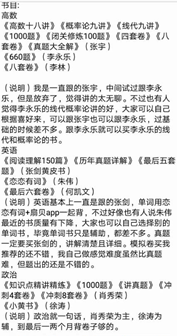
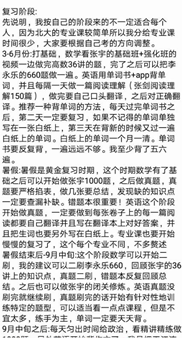
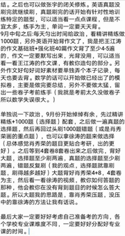
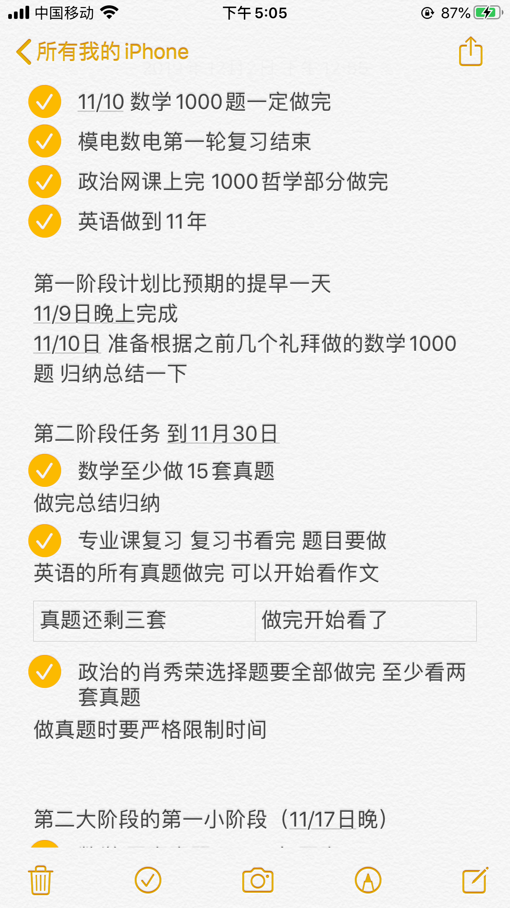
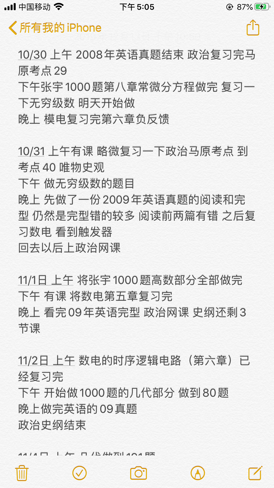

- [1 开篇](#c4fce7)
- [2 考研基础知识](#83uv1n)[2.1 考研是什么](#e637eg)
- [2.2 考研报名条件](#cylcpe)
- [2.3 考研时间线](#caburr)
- [2.4 考研初试](#4g649x)
- [2.5 考研复试](#cclrll)
- [2.6 考研调剂](#f53yof)

[3. 考研经验分享【分享人+上岸方向】](#cijhbh)

- [3.1 吉星宇：17年-东南大学-电子](#ek5mum)
- [3.2 王楠鑫：19年-北京大学-软微](#6p13ts)
- [3.3 户晓雅：19年-北京大学-会计](#dwnhc6)
- [3.4 高谦：19年-北京大学-软微](#fpcbyg)
- [3.5 曹宗元：20年-东南大学-电子](#3gnut7)
- [3.6 周远航：20年-东南大学-电子](#2lrzff)
- [3.7 王颖怡：20年-复旦大学-图书情报](#9gfouq)
- [3.8 陆瑶：20年-复旦大学-微电子](#flvs6k)
- [3.9 杨昊月：20年-江苏省委党校-社会学](#1xq6kn)
- [3.10 高佳琪：20年-南京大学-社会学](#8hfnrx)
- [3.11 王舒园：20年-中山大学-金融](#2n3zar)
- [3.12 刘鹏程：博士-东南大学-电气工程](#fvq1xe)
[3.13 汪涵：21年-东南大学-网安](#69ebb)

# 1 开篇

我一直都知道来到东南大学的每一个学子都是优秀的，大家穿着绿色的军训服打成一片的时候，谁也不知道各自轨道只是在这里短暂的交汇，脱下军训服，开始正式的大学生活之后，各自便划出完全不同的轨迹，在大学毕业的时候大家的感触会尤为强烈，发现和同辈的**差距**竟已经如此之大。

大家处在相同的平台，时间对每个人也都是平等的，为什么最后的结果会有如此差异呢？我们了解投资领域里投资收益和未知风险总是正相关的，想要稳定地拿到满意的收益，必须收集足够信息消除信息熵，减低未知风险。**其实自我发展的过程也是一种投资**，很多人没有抓住更好的机会，并非是由于自身能力不够，而是因为缺乏信息，找不到正确的目标、找不到合适的路径、没有正确的自我认识和评估、面临机会却不敢尝试甚至是对机会浑然不知……在大学结束之际回头满是遗憾。

针对这个普遍存在的问题，我们通过收集整理相关知识与经验，帮助后来的学子尽可能多地了解在大学里将面临的各种情况，虽然路还是要自己努力自己走，但是至少可以提前开一下视野，一览副本地图，更加清晰地自我，根据自身情况选择合适的道路，做出规划，把握大学这数年黄金时间好好地发展自己，我相信大家都能够得到自己满意的结果。

回到本版块的内容，对于升学比例很高的东大来说，出国、保研以及考研这三条升学选项中，考研似乎是看起来是最退而求其次的选择，但是实际情况因人而异，如果你想换一个平台、换一个专业赛道或者是只想继续在学校环境里深造和发展，考研都给你提供了一个相对低门槛和低成本的机会，这个角度看它也是一个很有价值的选项。

或许你正在犹豫要不要选择考研；或许你已经决定考研，但是并不知道如何走好它；或许你已经在路上，但是有一些彷徨和迷茫。但是今天你所面临的，有许多人早已经历过，所以我们不仅整理了一些考研必备的**基础性知识**，还有一些**过来人的经验**，每个人的背景和经历都不同，希望能给你提供一些有价值的参考和帮助。

考研终归只是漫漫人生征途中的一站，不如你作何选择，结果如何，人生不会到在这里止步，人生也不会因此而被决定。希望大家能够直视自己内心的想法，立足现实需求理性分析，做出自己的选择。希望每个人都能得偿所愿，不虚此行。

最后要**特别感谢**参与到参与考研部分的王彬龙、吴冰晶、尚小宇、王宗辉、田蕾、刘鹏程、吉星宇、王楠鑫、户晓雅、高谦、曹宗元、周远航、王颖怡、陆瑶、杨昊月、高佳琪、王舒园等诸位校友，感谢大家的倾力支持与帮助，正是因为大家对我们这个项目宗旨的共同认可之意、对母校发展的热切期待之情，对后进学子的善意提携之心，让大家能结缘于此，共同参与到这个项目之中，共同推进这个考研版块顺利面世，我相信今后会有更多身怀此心、志同道合的伙伴会加入进来，大家的努力也会发挥出应有的价值。

需要承认的是，由于缺乏经验、缺乏准备、投入不够等诸多因素，我们的工作尚存在许多不足，希望大家多多指正。但是止于至善是一直在路上的事，我们只是跨出了从0到1的一步，希望这个项目和精神能够一直传承下去，各个版块也能不断迭代更新，内容越来越科学、越来越充实、越来越贴近大家的实际需求。非常感谢这个项目让我认识到了如此多有趣又有才华、热心善良又有责任心的伙伴，聚是一团火，散是满天星，希望每一位学子都能在大学收获属于自己的精彩，希望东南大学能走出越来越多的优秀校友，希望母校能发展成真正卓越的世界一流高校，任重而道远，大家都在路上。

考研篇主编者 20届-电子科学与工程学院-聂杰文

# 2 考研基础知识

## 2.1 考研是什么

考研（全称：全国硕士研究生统一招生考试），是应届本科毕业生、本科毕业及同等学历学生攻读高校硕士研究生的招生考试，由国家考试主管部门和招生单位组织的初试和复试组成。考研是大学毕业生获得硕士、博士学位的主要通道，是考生从前期准备、择校、报名、初试、成绩公布、国家线公布、调剂、复试、录取等一系列过程的总称，参加研究生考试的人员必须符合教育部《研究生入学考试招生简章》的相关规定。严谨地说，它可分为硕士研究生考试和博士研究生考试两大类，但一般情况下，人们把考研狭义的理解为硕士研究生考试。

**【考研分类】**

**【学硕】**学术型硕士一般是指拥有学术型学位（academic degree）的人员，按学科设立，其以学术研究为导向，偏重理论和研究，培养大学教师和科研机构的研究人员为主。**学硕一般可以调剂到专硕**，学术型硕士的考试科目一般比专业型硕士的初试科目难度要高或者达到专业型硕士的考试难度。

**【专硕】**专业型硕士的简称，取得专业学位（professional degree），中国学位类型的一种，与之对应的是学术型学位（academic degree）。专业学位与学术型学位处于同一层次，培养规格各有侧重，在培养目标上各自有明确的定位。专硕的目的是培养具有扎实理论基础，并**适应特定行业或职业实际工作需要**的**应用型**高层次专门人才。值得注意的是，当前许多高校和专业的专硕培养与学硕并无二致，在考研过程中需要相对应了解。有些学校专硕的考试科目和考试难度相较于学硕略低一点，这时**专硕几乎没有调剂到学硕的可能**。

**【硕博连读】**遴选出完成规定的课程学习、成绩优异且具有较强创新精神和科研能力的学生并通过博士生资格考核后确定为博士生。

**【考内】**报考单位选择自己本科就读的学校。

**【考外】**报考单位选择非自己本科就读的学校。

**【跨考】**指跨专业考研，选择与本科所学专业不同的报考方向。

## 2.2 考研报名条件

报名参加全国硕士研究生招生考试的人员，须符合下列条件：

1.中华人民共和国公民。

2.拥护中国共产党的领导，品德良好，遵纪守法。

3.身体健康状况符合国家和招生单位规定的体检要求。

4.考生学业水平必须符合下列条件之一：

（1）国家承认学历的应届本科毕业生（含普通高校、成人高校、普通高校举办的成人高等学历教育应届本科毕业生）及自学考试和网络教育届时可毕业本科生。考生录取当年入学前必须取得国家承认的本科毕业证书，否则录取资格无效。

（2）具有国家承认的大学本科毕业学历的人员。

（3）获得国家承认的高职高专毕业学历后满2年（从毕业后到录 取当年入学之日，下同）或2年以上的人员，以及国家承认学历的本科结业生，须同时满足以下三个条件，可以按本科毕业同等学力身份报考：①自考或成人本科进修通过本科6门主干课程（与报考专 业相关，现场确认和复试资格审查时须提供相应成绩管理部门出具的成绩单）；②必须在省级以上刊物以第一作者身份发表与报考专业相关的学术论文一篇；③报考专业与所学专业相同或相近。以同等学力身份报考的考生，复试时须加试两门本专业本科主干课程。

（4）已获硕士、博士学位的人员。在校研究生报考须在报名前征得所在培养单位同意。在现场确认和复试资格审查时需提供原培养单位研究生主管部门出具的同意报考的证明材料，否则取消其报考及复试资格。

## 2.3 考研时间线

**【2月-4月】调研&规划**

在这个阶段要了解**考研报考条件、考研学校、考研报录比、考研科目等相关的考研基本知识**，要结合自身实际情况，综合**拟报考学校所在城市、专业发展、师资情况、就业前景**等因素进行考虑，然后初步确定考研目标。院校、专业的选择是考研中的关键一步，提早确定专业方向和院校，对考研专业课复习是更有针对性的。这一阶段也要**准备复习材料**，多征求该专业的学长学姐的复习建议，了解往年考试的重点难点，从而对公共课和专业课考研试题有整体认识，还要搜集备考资料，购买备考辅导书，制订复习计划，有序推进复习进程。

**【5月-6月】基础复习**

这个时间段开始全面进入**第一轮复习**，是打好基础的重要阶段，对公共课复习要细致，英语方面要注重英语单词的积累，数学要多练多算，政治上要有知识的储备，了解今年的时事新闻的等等。在专业课的复习上，同学们时时跟进目标院校的专业课方向，有针对性地收集专业课的复习资料，包括往年专业课试题和老师的讲义、论文、专著等。可登录相关院校网站查找上一年备考数目，查找不到可向学长学姐了解信息，最好能借阅到他们的备考资料。同时，还要在前期资料的基础上总结形成自己的笔记，构建自己的专业课复习的知识框架。

**【6月-8月】暑假重点突破**

要根据自身情况制定复习计划并严格执行，突破自己弥补弱项，制订的复习计划要尽量细致，但也不能不合实际，先给自己定个小目标，要让自己每天都有成就感，暑期是**提高薄弱科目**的好时机，要多安排时间复习薄弱科目，尤其要进行专项突破。此外，对于自制能力比较弱的同学可有针对性地参加辅导班，通过有规律地听课控制复习进度，听取老师监督指点，课后及时整理消化知识，有效掌握知识点。 **【9月-10月】大纲及计划发布&网上报名**

**9月份公共课考研大纲会相继的公布，学校招生单位的招生简章、专业目录和招生计划也会陆续公布**，这个时段不仅要**注重复习**还要**关注目标学校研究生网站的信息发布**，并**认真阅读政策和考研大纲**，**查看专业是否取消招生计划或者考试科目，这对是否继续该专业复习有着决定性的意义**。这个时段考生还要注意**预报名时间**，按时登录**中国研究生招生信息网**进行**预报名和正式报名**。 **【11月-12月】现场确认&材料准备&冲刺复习&正式考试**

**11月进入现场确认阶段。**考生要到**根据官网公布的时间到指定地点现场或网上确认网报信息**，**采集本人图像等相关电子信息，并按规定缴纳报考费**。12月中旬初试临近，考生应登录研招网下载**打印准考证**。准考证使用A4纸打印，正、反两面在使用期间不得涂改或书写。12月下旬初试，一般在四六级考试后一周周末。考生复习也进入最后的冲刺阶段，调整心态，认真复习。 *_【考研报名】包括**网上报名**和**现场确认**两个阶段。所有参加硕士研究生招生考试的考生**均须进行网上报名**，并到*报考点现场确认*网报信息和采集本人图像等相关电子信息，同时按规定缴纳报考费。_

***应届本科毕业生**原则上应选择**就读学校所在地****省级**教育招生考试机构**指定的报考点**办理网上报名和现场确认手续；**单独考试考生**应选择**招生单位所在地****省级**教育招生考试机构**指定的报考点**办理网上报名和现场确认手续；**其他考生（含工商管理、公共管理、旅游管理、工程管理等专业学位考生）**应选择**工作或户口所在地****省级**教育招生考试机构**指定的报考点**办理网上报名和现场确认手续。*

*网上报名技术服务工作由**全国高等学校学生信息咨询与就业指导中心**负责。现场确认由**省级教育招生考试机构**负责组织相关报考点进行。*

*报考点工作人员发现有考生伪造证件时，应通知公安机关并配合公安机关暂扣相关证件。*

**【次年 1月-4月】查分&准备复试&下一步打算**

每年查分大致在2月-3月，分数较高，开始准备第一志愿院校和专业的**复试**；分数较低但参考往年可以过线，准备第一志愿院校和专业的复试，同时要时时观察研究生网站的信息发布，联系**调剂院校**；分数较低但总分和单科分数线参考往年可以过线，联系调剂院校。

一般调剂分校内调剂和校外调剂，校内调剂为报考单位有一些院系和专业未达到招生计划，可以从相近专业未过该专业分数线的考生中选拔一些学生安排复试，校外调剂为除报考单位外的院校未达到招生计划在全国范围内招收相近或相同专业考生安排复试。

教育部根据全国不同地区经济发展情况和教育水平等，分为**一类地区**和**二类地区**，前者国家分数线高，后者稍低。一类地区为：北京、天津、上海、江苏、浙江、福建、山东、河南、湖北、湖南、广东、河北、山西、辽宁、吉林、黑龙江、安徽、江西、重庆、四川、陕西。二类地区为：内蒙古、广西、海南、贵州、云南、西藏、甘肃、青海、宁夏、新疆。

**调剂时报考一类地区的同学可调剂到二类地区，报考二类地区的同学也可以调剂到一类地区，但过了二类地区分数线没过一类地区分数线不能往一类地区调剂。**调剂除院校外，还可关注各个研究所，可多找几个合适的调剂院校，关注复试科目及时间安排，做出合理选择。考生需按报考单位要求准备材料，在规定时间内参加复试。复试考试过后也要时时关注报考学校的复试分数线、调剂信息、复试录取名单、录取之后需要准备的材料等等信息。往年复试在4月底结束，2020年由于疫情推迟至6月底，2021年未知。 **【次年 4月-6月】拟录取名单公示**拟录取名单公示，一般可在复试结果出来之后**联系心仪导师**，争取选择感兴趣的导师和喜欢的方向。

## 2.4 考研初试

**【初试时间】**2021年12月26日-27日**(具体时间依据每年研招网发布时间)** **【初试科目】**1.硕士研究生招生初试一般设置四个单元考试科目，即**思想政治理论、外国语、业务课一和业务课二**，满分分别为**100分、100分、150分、150分**。

2.教育学、历史学、医学门类初试设置三个单元考试科目，即思想政治理论、外国语、专业基础综合，满分分别为100分、100分、300分。

3.体育、应用心理、文物与博物馆、药学、中药学、临床医学、口腔医学、中医、公共卫生、护理等专业学位硕士初试设置三个单元考试科目，即思想政治理论、外国语、专业基础综合，满分分别为100分、100分、300分。

4.会计、图书情报、工商管理、公共管理、旅游管理、工程管理和审计等专业学位硕士初试设置两个单元考试科目，即外国语、管理类联考综合能力，满分分别为100分、200分。

5.金融、应用统计、税务、国际商务、保险、资产评估等专业学位硕士初试第三单元业务课一设置经济类综合能力考试科目，供试点学校选考，满分为150分。

6.硕士研究生招生考试的全国统考科目为思想政治理论、英语一、英语二、俄语、日语、数学一、数学二、数学三、教育学专业基础综合、心理学专业基础综合、历史学基础、临床医学综合能力（中医）、临床医学综合能力（西医）；

全国联考科目为数学（农）、化学（农）、植物生理学与生物化学、动物生理学与生物化学、计算机学科专业基础综合、管理类联考综合能力、法硕联考专业基础（非法学）、法硕联考综合（非法学）、法硕联考专业基础（法学）、法硕联考综合（法学）。

其中，教育学专业基础综合、心理学专业基础综合、历史学基础、数学（农）、化学（农）、植物生理学与生物化学、动物生理学与生物化学、计算机学科专业基础综合试题由招生单位自主选择使用；口腔医学专业学位既可选用统一命题的临床医学综合能力，也可由招生单位自主命题。

7.医学学术学位硕士研究生初试业务课科目由招生单位按一级学科自主命题。 **【初试内容】**

初试方式均为**笔试**

12月26日上午8:30—11:30思想政治理论、管理类联考综合能力12月26日下午14:00—17:00外国语12月27日上午8:30—11:30业务课一12月27日下午14:00—17:00业务课二12月28日 考试时间超过3小时的考试科目

每科考试时间一般为**3小时**；建筑设计等特殊科目考试时间最长不超过6小时。详细考试时间、考试科目及有关要求等由考点和招生单位予以公布。 **【有关规定】**

1.初试的组织工作和考务工作由教育部考试中心及各级教育招生考试机构按照相关文件规定执行。

2.单独考试须在省级教育招生考试机构指定的考点组织进行。

3.因试卷错寄、漏寄、邮递故障**等非考生本人原因**而无法正常考试的考生可参加**补考**。补考程序为：招生单位将初步审查同意补考的考生姓名、报考单位、补考科目及补考原因一一写明，报所在省级教育招生考试机构审核批准后，自行安排或协商有关考点在规定时间内组织补考。各补考科目均由招生单位命题。补考试题的形式和难易程度应与原试题相一致。补考一般安排在考试结束后1个月内进行，具体时间由相关招生单位确定。

## 2.5 考研复试

**【复试】**复试是硕士研究生招生考试的重要组成部分，用于考查考生的创新能力、专业素养和综合素质等，是硕士研究生录取的必要环节，复试不合格者不予录取。

1.复试时间、地点、内容、方式、成绩使用办法、组织管理等由招生单位按教育部有关规定自主确定。复试办法和程序**由招生单位公布**。全部复试工作一般应**在录取当年4月底前完成**。

2.教育部按照**一区、二区**制定并公布参加全国统考和联考考生进入复试的初试成绩基本要求。一区包括北京、天津、河北、山西、辽宁、吉林、黑龙江、上海、江苏、浙江、安徽、福建、江西、山东、河南、湖北、湖南、广东、重庆、四川、陕西等21省（市）；二区包括内蒙古、广西、海南、贵州、云南、西藏、甘肃、青海、宁夏、新疆等10省（区）。

**报考地处二区招生单位**且**毕业后在国务院公布的民族区域自治地方定向就业**的**少数民族普通高校应届本科毕业生**；或者**工作单位和户籍在国务院公布的民族区域自治地方**，且**定向就业单位为原单位**的**少数民族在职人员考生**，可按规定享受**少数民族照顾政策**。

3.招生单位在国家确定的初试成绩基本要求基础上，结合生源和招生计划等情况，自主确定本单位考生进入复试的初试成绩要求及其他学术要求，但不得出台歧视性或其他有违公平的规定。

经教育部批准的部分招生单位可直接自主确定考生进入复试的初试成绩要求及其他学术要求，相关要求须报省级教育招生考试机构备案，未经备案的不得公布执行。参加单独考试的考生进入复试的初试成绩要求由招生单位依据教育部有关政策自行确定。

相关招生单位依据教育部有关政策自主确定并公布“退役大学生士兵”专项计划考生进入复试的初试成绩要求和接受其他招生单位该计划考生调剂的初试成绩要求。

相关招生单位自主确定并公布报考本单位临床医学、口腔医学和中医（以下简称临床医学类）专业学位硕士研究生进入复试的初试成绩要求。教育部划定临床医学类专业学位硕士研究生初试成绩基本要求供招生单位参考。

招生单位自主划定的总分要求低于教育部划定的初试成绩基本要求的，下一年度不得扩大该专业招生规模（不含“退役大学生士兵”专项计划）。

4.对初试公共科目成绩略低于全国初试成绩基本要求，但专业科目成绩特别优异或在科研创新方面具有突出表现的考生，可允许其破格参加第一志愿报考单位第一志愿专业复试（简称**破格复试**）。破格复试应优先考虑基础学科、艰苦专业以及国家急需但生源相对不足的学科、专业。对一志愿合格生源不足的专业，招生单位要积极做好调剂工作，不得单纯为完成招生计划或保护一志愿生源而降低标准进行破格复试。合格生源（含调剂生源）充足的招生专业一般不再进行破格复试。破格复试考生不得调剂。

5.**复试应采取差额形式**，招生单位自主确定复试差额比例并提前公布，差额比例一般不低于120%。招生单位要按照教育部有关规定制定本单位的复试录取办法和各院系实施细则，提前在本单位网站向社会公布并严格执行。复试录取办法中应当明确考生进入复试的初试成绩和其他业务要求，以及复试、调剂、录取等各环节具体规定，特别要明确破格复试条件和程序。未按要求提前公布的复试录取规定一律无效。

6.**招生单位在复试前应当对考生的居民身份证、学历学位证书、学历学籍核验结果、学生证等报名材料原件及考生资格进行严格审查，对不符合规定者，不予复试。**考生学历（学籍）信息核验有问题的，招生单位应当要求考生在规定时间内完成学历（学籍）核验。少数民族考生身份以报考时查验的身份证为准，复试时不得更改。少数民族地区以国务院有关部门公布的《全国民族区域自治地方简表》为准。

7.以**同等学历**参加复试的考生，在复试中**须加试至少两门与报考专业相关的本科主干课程**。加试科目不得与初试科目相同。加试方式为笔试。报考法律硕士（非法学）、工商管理硕士、公共管理硕士、工程管理硕士或旅游管理硕士的同等学历考生可以不加试。对成人教育应届本科毕业生及复试时尚未取得本科毕业证书的自考和网络教育考生，招生单位可自主确定是否加试，相关办法应在招生章程中提前公布。

8.会计硕士、图书情报硕士、工商管理硕士、公共管理硕士、旅游管理硕士、工程管理硕士和审计硕士的思想政治理论考试由招生单位在复试中进行，成绩计入复试总成绩。

9.**外国语听力及口语测试**均在复试中进行，由招生单位自行组织，成绩计入复试总成绩。

10.招生单位认为**有必要**时，可对考生**再次复试**。

11.参加**“大学生志愿服务西部计划”“三支一扶计划”“农村义务教育阶段学校教师特设岗位计划”“赴外汉语教师志愿者”**等**项目服务期满、考核合格**的考生，**3年内**参加全国硕士研究生招生考试的，**初试总分加10分**，同等条件下优先录取。

高校学生**应征入伍服现役退役**，达到报考条件后，3年内参加全国硕士研究生招生考试的考生，**初试总分加10分**，同等条件下优先录取。纳入“退役大学生士兵”专项计划招录的，不再享受退役大学生士兵初试加分政策。在部队荣立二等功以上，符合全国硕士研究生招生考试报考条件的，可申请免试（初试）攻读硕士研究生。

参加**“选聘高校毕业生到村任职”**项目服务期满、考核称职以上的考生，3年内参加全国硕士研究生招生考试的，**初试总分加10分**，同等条件下优先录取，其中报考**人文社科类专业**研究生的，**初试总分加15分**。

加分项目不累计，同时满足两项以上加分条件的考生**按最高项加分**。各省级教育招生考试机构、各招生单位应严格规范执行硕士研究生招生考试的初试总分加分政策，除教育部统一规定的范围和标准外，不得擅自扩大范围、另设标准。招生单位应对加分项目考生提供的相关证明材料进行认真核实。

12.**考生体检工作**由招生单位在考生**拟录取后组织进行**。招生单位参照教育部、原卫生部、中国残联印发的《普通高等学校招生体检工作指导意见》（教学〔2003〕3号）要求，按照《教育部办公厅 卫生部办公厅关于普通高等学校招生学生入学身体检查取消乙肝项目检测有关问题的通知》（教学厅〔2010〕2号）规定，结合招生专业实际情况，提出本单位体检要求。

## 2.6 考研调剂

**【调剂基本条件】**

1.符合调入专业的**报考条件**。

2.**初试成绩**符合第一志愿报考专业在调入地区的**全国初试成绩基本要求**。

3.**调入专业**与第一志愿报考**专业相同或相近**。

4.**初试科目**与**调入专业初试科目相同或相**近，其中**统考科目原则上应当相**同。

5.第一志愿报考照顾专业（指体育学及体育硕士，中医学、中西医结合及中医硕士，工学照顾专业，下同）的考生若**调剂出本类照顾专业**，其初试成绩必须达到调入地区该照顾专业所在学科门类（类别）的全国初试成绩基本要求。第一志愿报考非照顾专业的考生若**调入照顾专业**，其初试成绩必须符合调入地区对应的非照顾专业学科门类（类别）的全国初试成绩基本要求。体育学与体育硕士，中医学、中西医结合与中医硕士，工学照顾专业之间调剂按照顾专业内部调剂政策执行。

6.第一志愿报考工商管理、公共管理、旅游管理、工程管理、会计、图书情报、审计专业学位硕士的考生，在满足调入专业报考条件的基础上，可申请相互调剂，但不得调入其他专业；其他专业考生也不得调入以上专业。第一志愿报考法律（非法学）专业学位硕士的考生不得调入其他专业，其他专业的考生也不得调入该专业。

7**.报考“少数民族高层次骨干人才计划”的考生不得调剂到该计划以外录取**；未报考的不得调剂入该计划录取。

8.报考**“退役大学生士兵”专项计划**的考生，申请调剂到普通计划录取，其初试成绩须达到调入地区相关专业所在学科门类（专业学位类别）的全国初试成绩基本要求，符合条件的，可按规定享受退役大学生士兵初试加分政策。

报考**普通计划**的考生，**符合“退役大学生士兵”专项计划报考条件的**，可**申请调剂到该专项计划录取**，其初试成绩须符合相关招生单位确定的接受“退役大学生士兵”专项计划考生调剂的初试成绩要求。调入“退役大学生士兵”专项计划招录的考生，不再享受退役大学生士兵初试加分政策。

9.相关招生单位自主确定并公布本单位接受报考其他单位**临床医学类专业学位**硕士研究生调剂的成绩要求。教育部划定临床医学类专业学位硕士研究生初试成绩基本要求作为报考临床医学类专业学位硕士研究生的考生调剂到其他专业的基本成绩要求。

报考临床医学类专业学位硕士研究生的考生可按相关政策调剂到其他专业，报考其他专业（含医学学术学位）的考生不可调剂到临床医学类专业学位。

10.**参加单独考试（含强军计划、援藏计划）的考生不得调剂。**

11.符合调剂条件的**国防生**考生，可在允许招收国防生硕士研究生的招生单位间相互调剂。

12.**自划线高校**校内调剂政策按上述要求自行确定。

**【特别注意】**1.招生单位接收所有调剂考生（既包括接收外单位调剂考生，也包括接收本单位内部调剂考生）必须通过教育部指定的**“全国硕士生招生调剂服务系统”**进行（各加分项目考生、享受少数民族政策考生可除外）。

2.招生单位每次开放调剂系统持续时间不得低于12个小时。对申请同一招生单位同一专业、初试科目完全相同的调剂考生，招生单位应当按考生初试成绩择优遴选进入复试的考生名单。不得简单以考生提交调剂志愿的时间先后顺序等非学业水平标准作为遴选依据。

3**.考生调剂志愿锁定时间由招生单位自主设定，**最长不超过36小时。锁定时间到达后，如招生单位未明确受理意见，锁定解除，考生可继续填报其他志愿。

4.招生单位应根据本单位实际复试录取情况，通过“全国硕士生招生调剂服务系统”及时、准确发布计划余额信息及接收考生调剂申请的初试成绩等基本要求，并积极利用调剂系统在线留言功能、咨询电话等渠道为考生调剂提供良好服务。

# 3. 考研经验分享【分享人+上岸方向】

## 3.1 吉星宇：17年-东南大学-电子

**为什么选择考研，选择这个方向？**

原因：我本科前三年忙于社团活动，专业排名和竞赛成绩方面都不是很有竞争力，也并没有好好考虑过自己想做什么工作，对什么行业和岗位有兴趣，转眼间到了大三下学期，觉得考研对自己来说是一个性价比挺高的选项，可以给自己更多的时间去**感受科研**，也可以去**思考自己到底喜欢什么样的工作和岗位**。

方向：我对于**考研方向的理解**是一定要**具体到导师的研究方向**，因为我在读研期间的感受是：虽然我们专业的导师都是归在显示中心这个实验室里面，但是他们研究的方向都有着很大的差异，有研究图像处理算法的，有做FPGA的，有做光学实验的，还有做材料研究的，五花八门；在和其他实验室同学聊天的过程中也发现了这个现象。因为研究生不是统一培养的，大部分的时间还是跟着自己的导师做实验做项目，所以建议各位同学在确定自己报考方向的时候尽可能地多在网站上还有正在读研的学长学姐那里了解导师的相关情况。

**你觉得考研对一个人来说意味着什么？**

考研对于我来说是一次成长，一次锻炼，也是一次自信心的树立；收获主要是最后让我顺利通过考研初试的**一个好成绩**以及**内心的磨练**吧。

**在考研过程中有经历哪些心路坎坷？**

**坎坷**：当室友们都安排好了自己的下一步，开始享受大学最后的时光，自己却要每天7点起床，10点以后才能返回寝室的那份坚持；16年11月的时候有几门大四的课程需要交大作业了，当时自己一边忙着复习一边想着不会做的大作业心里很痛苦；还有就是**考研其实是一个人慢慢付出努力的过程，并不像高考备战那样会有一大帮同学和你一起有一个拼搏的氛围，而且过程中也不会模拟考试，所以也并不清楚自己到底是进步了还是退步了，没有信息其实比有坏的消息更加让人痛苦**。

**克服**：比较幸运的是，我大学本科的一个好朋友当时和我一起准备考研，我们基本上每天都在一起复习，有不懂的问题可以相互讨论，彼此有心事也会相互交流；还有就是我**提前联系**了所在实验室的师兄师姐，和他们进行了很多的交流，偶尔也会向他们**求助自己考研过程中的问题**。

**如何确定目标院校的？**

对于我而言，研究生不是人生的终点，只是自我提升过程中的一环，它是为下一步服务的，想要**继续深造读博做研究**和**想要工作**的**目的不同**，选择不同目标院校和专业的情况是不一样的。我自己是**想要工作**的，下面谈谈自己的情况，工作在我看来其实也分两大类，第一类是做**与自己专业相关**的，第二类是做**与自己专业无关**的；第一类的话则需要找到**学科实力较强，项目经验对于自己以后求职有帮助**的导师；第二类的话则最好可以找到**能够给予学生比较多的时间去自我培养，能够允许学生实习**（至少是暑假实习的）

**信息收集渠道？**

我考本校本专业，多和身边的同学还有已经考上研究生的学长学姐聊聊天就好了，跨校跨专业真的很难，在这里向各位跨考的朋友致敬Respect

**备考过程中的时间规划？**

整体节奏7月-9月 数学基础知识 英语阅读和单词；9月-11月 数学刷题 英语刷题 政治基础知识 专业课复习；12月 整合冲刺 背政治押题；

每天建议把上午刚开始的时间留给背英语单词，然后在自己头脑清醒，思维活跃的时候进行数学和英语的学习输入，在**效率较低**的时候进行**相关整理和总结**，具体时间因人而异。

**提高效率的方法？**

手机开飞行模式，去图书馆复习，**政治可以买网课**，会给你理清很多重点。

**复习效果最好的是哪一门课？对于这门课有什么学习方法嘛？**

说白了其实都是**坚持，重复，多总结，不懂就问**

**总结考研前后以及过程中，您觉得自己最有价值体会和经验是什么？**

1. 弄清楚自己到底**为了什么**而考研，如果明确了自己以后不是想要做与读研相关的工作**单纯地为了提高学历来读研的话真的没有必要**，我自己就是最好的例子，为了读研而考研，就像为了恋爱去追求一样，你一开始读研你就后悔了，如果读研的生活对于你来说真的没有什么吸引力和必要的话，真的不建议大家读研，科研没有那么的容易，为了获得学历而浪费自己三年的青春真的不太划算。
2. 各位同学在**选择导师的时候一定要慎之又慎**，综合考虑，因为读研三年导师一直会管理你的生活，导师的**管理模式**你能不能接受，也不排除存在国内某些导师过分压榨学生的情况，这些情况希望大家多了解，之后经过综合的思考再做出选择真的很有必要。
3. 希望各位学弟学妹们能在**大二结束之后大三刚开始**的时候或者是更早就开始思考自己下一步需要做什么，我虽然考研成功了，但我把我的经历中很多的因素归结于幸运，可能由于自己数学几门基础课和英语底子本来就不错，可能是本校考本校所以有着很多有力条件，希望各位学弟学妹们在参考我的经验的时候也能看到这些东西，不要单纯地以为可以**复制**任何一个人的经历就能成功。

## 3.2 王楠鑫：19年-北京大学-软微

**你为什么选择读研？是什么具体原因和经历让您选择考研以及选择这个方向？**

因为觉得微电子这个专业需要**进一步深入的学习**，感觉本科才入了个门，所以想趁着年轻在学习几年。而且考虑到本科自己不太认真，出来之后很有可能比较难找到专业对口的工作，而浪费了本科四年的学习。

**你觉得考研对一个人来说意味着什么？在考研过程中有哪些收获?**

我觉得考研是一场非常**孤独**的斗争，对我来说考研真正让我把心收起来了，在本科四年中自己一直比较放松，只有考试周才会努力学习，但是考研的这段时间，我能够**真正地自己有计划地按时学习**，自己的自律性提高了，并且最重要的是经过考研的磨练，**对于研究生的生活更加珍惜**，更加愿意认真钻研学习了。

**在考研过程中有经历哪些心路坎坷？怎么克服的？**

其实我觉得考研路上最大的坎坷就是**日复一日地复习真的非常枯燥**，每天做重复地事情，没有人交流，时间久了确实会感觉想放弃。但是我自己来说我还是对自己的自律能力比较放心的，所以当**不想学习的时候**约朋友出去吃个晚饭或者玩一个晚上，在不耽误第二天学习的情况下我觉得还是比较可取的。

**如何确定自己的目标院校的？**

**报录比**很重要，一定要量力而行。

**考研过程中收集信息的渠道有哪些？**

**QQ群，以及一些考研公众号**中获得的，因为我这个学校的这个专业好像我没有了解到有学长学姐报考过，所以我找这些资源确实花了很大的力气。

**有什么值得分享的考试科目的经验？（特殊科目，考得好，复习心得）**

**关于考研有什么需要避开的误区？**

首先一个误区就是**选学校太纠结**，到处看经验贴然后加各种群，疯狂水群然而**复习并没有真正地抓起来**。我觉得选学校和专业确实是需要好好决定，但是这些时间一定不能影响自己复习地时间，在决定了学校和专业，拿到相应资料后，群消息什么地能不看就别看，考研群里影响复习心态的发言是很多的。

然后就是考研一定不是谁复习得久就好得，**效率很重要**，我也不推荐把战线拉得太长。在暑假之前可以都是利用课余时间复习，暑假开始重点发力。期间一定要注意适当放松，不要太压迫自己了。我个人非常反对通宵复习，或者早上起很早就开始复习，中午不睡觉复习，晚上12点了还在复习的那种模式。如我经验贴中写的，每天高质量复习10小时足够了。

还有就是尽量结交研友，一起交流问题，一起疏通情绪问题会有很大的帮助。

## 3.3 户晓雅：19年-北京大学-会计

**基本情况介绍：东南大学经济管理学院2019届毕业生户晓雅，在2018年参加了全国研究生笔试，以第八名的初试成绩进入了北京大学光华管理学院攻读MPAcc（会计硕士）。考研英语二成绩：88，管理类联考成绩：168**

**确定自己的目标院校**

首先考虑**城市**，由于我家在河北，所以北京算是首选城市，而且北京学校众多，于是就在北京几所院校中进行了选择。

其次考虑北京各所院校的**初试和复试的占比、复试的考核方式**。我对于初试把握很大，所以选择了北京大学（只有北京大学初试成绩占总成绩70%，比例相当之高），此外北京大学复试考核只有综合素质面试，更多侧重学生的综合素质。而其他几所院校无一例外都包含专业笔试，**在外校参加笔试我们学校的学生可能并不占优势（考虑培养模式和答题习惯等因素）。**

最后就是**名校情结**，但这一点在我的最终决定中影响不大，更多影响我的是第二条原因。因为考研毕竟只有一次机会，**还是劝大家要选择有把握的院校**。不过我也曾和阻止自己的家人说过：就算我考不上北大，我也不会后悔，但是不让我去尝试，这将是我永远的遗憾。

之所以会规劝大家选择有把握的院校一方面是因为我的决定曾给我带来巨大风险，运气不好的话可能大家就不会看到这篇文章，大半年的辛苦也付之一炬，另一方面也是真心希望各位学弟学妹能在毕业季的时候拥有更明媚的未来，希望能为你们探明道路，但是又不希望你们承担过多的压力。

**整个备考过程的时间规划**

我在2018年12月份参加考研，同年三月份便开始确定了要考取会计专硕，并查阅、购买各种相关资料（包括考研经验分享，各个科目老师的教科书和网课）。但是我在3月份到7月份每日学习时间始终不长，直到暑假我提前返校在八月初开始认真进入考研模式。

都说暑假很关键，刚返校的我像打了鸡血每天6点起床，中午不休息，晚上学到10点才回宿舍。但这些其实都是在感动自己，每天去J2-209都顶着黑眼圈昏昏沉沉。到九月份我开始**注意提高自己的效率**，每天早上七点半起床，中午会午休，晚上也不会熬到很晚，**每天学习时间大概只有八个小时**，但是这八个小时每一分每一秒我都用自己最好的状态来学习，事实证明，**效率才是关键**。

进入北京大学之后，我问到身边的同学，发现大家都是很注意效率的，并不是一味追求学习时长。当然学习时长也很重要，我前前后后进行了**三四轮的复习回顾**，每天都是在**完成自己规定的任务之后才会去休息或娱乐**。这里就是希望大家能够完成一个**正循环**：**提高效率——较为高效迅速的完成每日学习任务——有较多的时间休息。**

关于具体复习情况，我是在3月份到7月份进行的第一轮复习，由于基础比较好，我基本上都是看看网课做一些简单的题目（比如老吕的基础题目）；8月份到10月份我开始做一些较难的题目（例如陈剑高分指南，历年真题），并且将错题都记录在错题本上，但同时我也会回顾基础知识；11月份我重新将所有的历年真题进行“模拟考”，在这一轮中记录重复做错的题目；12月份我只是偶尔做一些真题保持手感，更多的是回归基础看自己**重复做错的题目**（错题本划重点，会考的）。

**英语二和199联考经验分享**

英语二：因为很久没有接触英语，一开始我会错4或者5个阅读，后来每天练习，我的英语水平渐渐得到提升，但是还是会错1到2个阅读。由于会计专硕的考试每一分都很重要，所以如何把错误消灭到0我花费了很大力气，也给我留下很深刻的印象。我开始**认真的翻译每一篇真题**（注意英语二一定要回归真题），所有的英语二的阅读我都手写进行了翻译，在翻译中留意单词、句型等。事实证明笨方法总是有一定功效，最后我的英语成绩在北京地区很高。

199联考：联考里的数学我很擅长，几乎没有花费过多时间，所以跟大家分享的可能就是一定要**细心**吧，不要因为粗心丢分，这会很让人沮丧。逻辑对于大家来说都是新的起点，认真跟好一个老师按部就班就能取得不错的成绩（这里推荐**赵鑫全老师**，他的思路很不错）。对于写作，我的建议是**多写多练**，不用写太多题目，好好**把握真题**即可。**一开始可以仿写，后面就要不断地修正自己的文笔、自己的表达。**写作我是找了研友互批的，这的确让我们进步很多，在互相批改中可以发现自己很多不足。

**备考过程中如何调整好心态**

回想本科我所做的一些事情，有很多没有坚持下来的，也有很多没有取得预想的结果，只有很少的一些事有了还不错的结局。在此我十分感谢考研阶段所有包容我的朋友、室友甚至陌生人、对于考研，我最想说的就是**开心的去做这件事**。压力巨大的时候大家可能很难去体会到开心，更多的是焦虑和莫名其妙的烦躁。但是这些都需要你在做这件事的时候褪去而不是蔓延。要把每次完成规定任务当做是一个**小里程碑**，给自己一些**奖励**；也要认真的投入到每一次做题中，这样就不会因为心不在焉导致出错而产生焦虑。

我们的愤怒大多源于自己的**无能**，我认为调整自己心态的最好的方式就是提升自己的实力，如果每一次真题模拟都能拿到不错的分数，每一个难题都能在绞尽脑汁后通关，那我相信这种快乐会延伸到你的生活，会缓解你的压力，会给予你一个又一个的正反馈。

**信息搜集渠道**

说一下我搜集信息的渠道：（1）知乎经验贴；（2）哔哩哔哩经验贴；（3）学长学姐经验分享会；（4）微信强大的搜索框。

最后一点是我最推崇的，也是我对**微信**对心水的一点，**具体操作步骤：打开微信，搜索关键词“会计硕士 考研经验”进行搜索，点击搜索文章资讯**，你会发现宝藏（这算是给看完我废话的学弟学妹们的隐藏福利吧）！

**考研路上有哪些需要避开的坑**

第一个就是**复习时长**的问题，我认为每天完成自己学习任务就可以从J2-209拎包走人，不要在意其他人的目光，前提是你已经高效的完成了学习任务，那就让自己放松一下。人不是机器，懂得劳逸结合才是打持久战的关键。

第二个就是**不要迷信某些考研辅导机构**，在做决定前一定要认真咨询学长学姐~

**外校复试经验**

外校的复试会很容易让人**抓不住重点**，你不清楚自己会被哪位老师面试，也不清楚外校考试的风格，这里**一定一定一定要咨询学长学姐**，如果没有学长学姐可以像我刚刚说的**在微信搜索复试经验贴**，做好充足的了解；实在找不到的话也可以添加一下我的联系方式，我会尽最大努力去帮你找到可以指导的学长学姐（但其实我认识的同学相对有限，可能只能在北京这几所高校帮忙寻找）。

当时我错过了一个北大的学长开办的辅导班，那个辅导班是让你在实际复试的教室里进行数次模拟，成功上岸的学长学姐会亲自帮你修改个人陈述，会迅速的帮你复习面试重点提问的专业知识，所有的去辅导班的同学都成功上岸。我在这里不是说辅导班的重要性，是说**复试其实更多的是一场信息战**，了解足够的信息会让你更加顺利。

**写在最后**：我周围有很多人考研成功，也有更多人考研失败。希望学弟学妹不要被“**经管每年就十几个人能考上**”这样的话困扰到，既然选择了这条路，就要坚持走下去，总有人能行，为什么不能是你呢？考研对于我来说更像是一场性格的淬炼，我珍视现在的一切，这是当时我自己拼尽了全力换来的，我从此再不敢有半分的松懈，因为我懂得这一切有多么难得。我希望通过这个决定，大家都能为自己的未来奋斗一次。于我而言，不过是在这条路上比你们早了一两年、两三年，仅仅能为大家提供一些个人的建议。希望有更多问题的学弟学妹与我联系，我会尽力回答，也希望每位学弟学妹青春无悔！

## 3.4 高谦：19年-北京大学-软微

**为什么选择考研，选择这个方向？**

当然是**计算机热门，工资高**啦。而且，我个人觉得，在信息时代，计算机肯定是未来的一个大风向，**顺应时代潮流**总没错。

**您觉得考研对一个人来说意味着什么？**

对我来说，可能就是给自己一个**缓冲期**，去**弥补和科班的差距**，毕竟自己是跨专业；而且，自己暂时也不想工作，所以选择考研。

**在考研过程中有经历哪些心路坎坷？**

关于学习方面的都还好，网上有很多**学长学姐的经验贴**，跟着他们的步子走就行了。比较大的困难是宿舍太吵，和室友也协商不过来。无奈9月开始只能自己花钱出去租房，这样给自己一个舒服的学习和休息环境，虽然租房有点贵，但是现在回过头来看，这笔投资还是蛮值的。

**确定目标院校**

因为是一心想考计算机，而且不想留在本校继续读硕士，并且结合自己是跨考，基础薄弱这样一个情况，一开始考虑了大概以下几个院校：浙大计算机/软院，中科大软院，上交计算机，南大软院，北大信科/叉院/软微。

**浙大**的好处就是全程都很公平，初试专业课试408，**复试有上机**，上机可以用那个pat考试的成绩替代，一年好像有两次考的机会，然后听说面试也很公平。这也是我一开始的考虑。

**上交**计算机，名额少，考408，而且好像也要上机。

**南大**软院，专业课不算很难，名额也还算多，研究生在鼓楼校区。

**中科大**软院，在19年之前几乎年年都招不满，会收很大一批调剂，然后培养方式是放养，所以我也没优先考虑，因为我想着可以考别的学校，然后万一没考上，调剂到中科大也是美滋滋（结果19年就不收校外调剂了）

**北大**信科/叉院：专业课自主命题，据说题目是从mooc和某几本书上出的，有复习套路，但是分数线忽高忽低，某些年爆高，某些年爆低，也要上机，考虑到自己是跨考，也不敢赌，也就没考虑这两个院。

**北大**软微：专业课不难，北大牌子，大概率可以研二甚至研一就出去实习，或者联系本部老师，进本部实验室；**缺点是据说北京公共课压分严重**（考完发现并没有，研一需要在大兴区上课（不在本部燕园），和本部有点脱节的感觉，然后前几年因为生源问题也被黑得蛮惨的(300上北大的梗不是假的)，不过近几年生源有所改善，虽然比不上本部，但是也不算很差了。按照往年来说初试380左右差不多就可以稳录了，还是蛮香的。所以最后选择了它。

**信息收集渠道**

（1）北大信科/软微考研qq群：分分钟99+，群友疯狂吹逼，适合复习放松的时候看看。当然，群文件里面有很多**往届的一些考研信息和复习资料**，自己可以下载下来看看。

（2）王道论坛：上面有很多学长学姐的经验贴，一定要去看

（3）淘宝/公众号/b站：**公共课视频**，你懂的

（4）知乎/贴吧：看了一些**计算机考研院线推荐和难度分析**的帖子

另外，**想考北大计算机的话，建议百度搜索“北大cs考研百问”**，这是一个学长写的关于北大计算机的四个院：信科/叉院/信工/软微的考研分析，还算很全面的。

**备考过程中的时间规划**

**3月：**决定考研学校，然后看经验贴，找资料

**4-6月初：**

数学：结合视频，把数学一看了一遍

英语：背了一些高频词，做了00年左右的几套真题（只做了阅读）

专业课：开始看数据结构

**6月中旬：**考试周复习

**7-8月：**在家复习，每天9个小时左右（个人感觉效率有点低，在家总是感觉慢悠悠的，没有那种紧迫感，但是实在不想留宿舍复习了，因为很吵）

数学：把全书高数部分看了一遍，开始做660

英语：继续背单词做真题，大概做到了09年之前的

专业课：结束数据结构的一轮复习，开始复习（学习）操作系统。

**8月底-9月上旬：**学院要求实习，于是自己去实习了一段时间，975的生活作息，期间没怎么复习，利用空余时间看了看英语单词，零零散散地跟着强化班视频把线代和数理统计又看了一遍，把660做完了，专业课基本没怎么看。

**9月-考前：**每天12小时+

政治：买了肖秀荣全套，对着书做了一遍1000题。大题则是考前买了肖8肖4，做了他们的选择题，然后背了肖4大题（本来想背小黄书的，奈何太懒了，还好肖老永远滴神，肖4压中很多原题）

数学：开始做考研真题，大概是三天两套的速度，做了快两遍，同时看了冲刺班视频，查漏补缺，把660的错题再看了一遍。之后还买了一些模拟卷来做，个人觉得比较好的有李正元，合工大的卷子，张宇的是真的难…个人觉得没有必要做。

专业课：开始看计算机网络，最后把三科专业课再过了一遍。买了408真题和王道的模拟题做了（软微有些题目选自408）

英语：把真题做完（留了16/17/18年的卷子做考前模拟)，整理自己的作文模版。

**备考过程中有哪些提高效率的方法？**

像课表那样，把**今天各个时段要复习的内容写出来**，这样显得清晰，有计划。

**复习效果最好的是哪一门课？对于这门课有什么学习方法嘛？**

感觉除了政治，其他都普普通通，中规中矩的样子（政治差点没过线233），所以在这里我反向建议一波：**千万别认为某一门课不重要，就放松它**，万一到时候总分过线了，单科线没过，那真是欲哭无泪。比如政治，其实我大题答得还不错（肖4压得准），但是选择题惨不忍睹，这可能是因为我政治没看视频，然后1000题也才勉勉强强做了一遍，没怎么记忆，个人平时对政治时事也没有过多了解，基础比较薄弱。

**复试经验**

首先肯定是要有充分的准备。去王道论坛看经验贴，加复试群以便及时获取信息。然后**如果是跨考的话，肯定在项目和专业基础上和科班的有差距，这个自己在复试的时候要体现出来**（可以是写在简历上，也可以是现场自我介绍的时候提一提），这样老师可能不会过多为难你（仅针对软微，软微属于跨考友好型）。

在现场面试的时候，肯定会有些问题自己不怎么确定，甚至不知道的，但是这时候不能在那儿一直沉默，可以**利用已有的知识，从各种角度上往老师问的问题上靠，老师可能会指出你的某些错误，这时候你虚心接受就好**，千万不要和老师争。

如果是**准备得早**的话，比如**大二就有换专业的想法**，但是又错过大一那次换专业的机会，可以自己联系计算机学院的老师，进实验室，做做项目，丰富简历（有同学是这样做的）。

**需要避开的误区**

**考软微的话，不用找所谓的学长学姐买资料；真题都是公开的。**复习资料则看看王道的三本书就行了，还有余力的话可以做做课本的课后题。

考研其实是有很大的运气成分的，个人感觉很容易爆冷或者爆热，特别是计算机这种热门专业，所以前期自己一定要花精力从各种渠道搜集信息，结合个人基础，选择报考学校，学校和专业选对了，考研就成功了一半。

总结考研前后以及过程中，您觉得自己最有价值体会和经验是什么？（您认为最值得告诉学弟学妹的东西、您觉得做的好的地方和遗憾的地方等）

**如果我要重考一次，那我会选择把一本书做三遍，而不是把三本书做一遍。**考研其实就是**熟练度**，它没有高考那么灵活。

各科都要重视，该做的题目要做，该背的要背。

数学模拟题不用太重视分数，不要被分数影响心情，主要目的是查漏补缺。

英语作文要重视。

锻炼身体，保持愉快的心情。

## 3.5 曹宗元：20年-东南大学-电子

**为什么选择考研，选择这个方向？**

本科课程内容较浅，研究不深。另外，本科期间感觉自己表现不好，很多想做的事、想拿的荣誉都没有时间付诸行动，所以我觉得我应该考上研究生，有一个全新的起点来证明自己。

**您觉得考研对一个人来说意味着什么？**

考研的过程中，我渐渐明白了这个决定不仅需要明确的目标，也需要坚强的**意志**，就好像军训一样，随时都想要产生放弃的想法。我是一名**二战**的考生，因此，这一过程比初战考研的同学更加艰辛，这其中的甘甜坎坷只有经历过的人才能体会。

考研的收获：一是自学，通过各种资料书本，制定学习计划，**自学**是成为研究生的必要课程。二是自律，二战的话每天在家更容易懒散起来，和父母说好，约束好自己，最好每天去图书馆自习，不要在家里放羊。

**在考研过程中经历的心路坎坷**

一战还好，有大把同学陪着，虽然没考上那咱就不提了，主要是二战，一起考的同学也不是很多了，经常会希望快速结束这个无尽的折磨(好在有一个大学同学和我一起考，虽然远在两地但是还是有鼓舞效果的）。

这里我要说一下二战的同学，一般辅导员会**劝退**二战的考生，除非你是因为意外没有过复试，我也被劝退过。大四的时候，因为要考研和去工作心里做的巨大斗争经常难以入眠，经过长期的思想斗争，我决定还是考研吧，二战不行那就工作呗。结果被我们亲爱的辅导员叫过去泼了一盆冷水。

这里倒是没有指责的一说，确实这里是辅导员考量**家庭条件和学习成绩**做出的劝告，但是我和另一个同学还是坚持选择了考研，总不能被一句话打到吧:-) 结果是，当时和我一起被叫去劝退的三个同学今年都考上了，也是有感而发，可能自己的力量超乎自己想象，面对恐惧对好的办法就是微笑着面对它，加油，奥力给！

**确定目标院校**

主要是环境熟悉，工科强校（有个学上就不错了）

**信息收集渠道**

信息无所谓，有加**东大的考研群**的话信息大大的有，注意是非盈利的群，不是卖资料的

**备考过程中的时间规划**

时间规划是老生常谈的问题，这对于考研这种自学过程尤为重要，认清自己的实力，以此确定自己的学习计划。利用便签来规划短期内目标，注意是**短期目标，最好在十天到一个月的时间**，每次制定短期计划都是一个审查进度的过程。首先明确此时是考研的哪一个**时间段**，一般很多人在6月开始，以此为起点，到九月左右是一个时间节点，时间节点不同复习的课程和比重有所差别，一般考生会在6到9月集中复习数学、英语，这里建议**政治视频课和选择题**可以抽空作为调节心情的科目。在9月后英语的比重有所降低，转向复习专业课这一个分数占比很高的项目。

我复习的时间是从七月开始的，一战的时候**数学**视频课刷了张宇的高数、汤家凤的概率和李永乐的线代，题目做了张宇的1000题，说实话1000题偏难，导致大把时间花在这本书上，打乱了我的很多计划，真题也刷晚了。这里我推荐**刷完视频课后，用考研数学全书过一遍里面的概念和例题，习题，再刷汤家凤的1800题**。此时时间大约是九月份，数学就可以开始刷真题了，注意数学真题占据考研数学复习过程的半壁江山，非常重要，不建议拖到最后刷。

与此同时，**英语**除了要**每天背单词**外，可以先找时间听一下长难句的视频课，相信大多数人在东大英语课真的是“一笑而过”了，要明白考研英语**除了词汇量的考查，就是长难句的理解**，所以要先打基础。等基础差不多了就直接开始刷真题，**先开始可以只刷阅读和新题型，不管完型**（这货分数占比实在太低，划不来）。先开始基础不太好的可能一下午做不了几篇阅读，但是要坚持就会改善。**英语真题的视频课推荐看唐迟的《阅读的逻辑》**，如果感觉找不见阅读方法可以配合此视频复习，讲的十分清晰明了，但是缺点是比较费时间。

**政治**方面可以看看视频课，刷刷选择题，慢慢就会有收获。

从**九月或者十月**开始，数学的时间比重基本不变，但是要开始**刷真题**了。开始同样会刷的很慢，很多错误，这是必经之路，但是要经常总结才能有效果。英语的话应该刷完一遍真题，并且听完讲解了，这时候还要刷英语真题，重复刷，才能明白英语阅读的考点其实挺明确的，这需要一个过程！此时英语真题刷的就比较快了，下午腾出的时间来复习专业课，我复习的是数模电，数电推荐看江晓安教授，模电推荐看华成英教授。内容比较多，记忆理解也多，需要较多的时间精力。政治方面继续刷选择题，也可以抽出时间把肖秀荣的精讲精练过一遍，梳理政治时间轴。

到11月份就是各种查缺补漏冲刺模拟阶段了，这时候数学、英语真题要至少刷三遍，政治的肖秀荣八套卷已出，至少刷完选择题，专业课应该已经刷了一部分真题了。出了各种模拟卷，可以把数学的做一做。一直到考试都是各种总结、查缺补漏、不停地刷题。

**提高效率的方法？**

没啥，这个因人而异，我的效率从来没高过，不玩游戏就高些，玩游戏就低些。

**复习效果最好的是哪一门课？对于这门课有什么学习方法嘛？**

最好的一门课应该就是**数学**了吧，虽然不是太高也不算低吧，一战考了96二战考了121。数学我刷真题的时间比较早，真题方面总结了很多类型和知识点。

说到数学学习，我最有效的学习方法就是**总结**，考研数学有很多类似题型，除了个别特别难的题目，**很多题目都可以归类的**，用一个活页本，随时把不太熟练的数学题总结起来，分析一下题目的类型，把他们总结到一起，然后在同一类型题目旁边写上一些简单的解题思路。

当然这个战术要首先**刷足够的题目**，我的题目来源首先是汤家凤的1800题，其中很多经典题目大类聚在一起，很方便总结。再后来就是把真题总结进去，再后来就是李林等人的模拟题。其实题海战术的前提就是刷套路，我在11月之前总共刷完了数学复习全书660题，汤的1800题，数学真题至少三遍，李林的八套卷，合工大的模拟题，要是没有总结的可能做题会比较慢（每一次看到题目都是新题，吐了的感觉）。

**复试有什么经验和注意事项？**

建议保研。

**需要避开的误区**

**准确自我定位**：大家都是考到东南大学的学生，都不是太差的，别给自己立下太低的目标，要是喜欢集成电路，那就向着asic出发，首先给自己定下太低的目标那可能到最后都没勇气推自己一把，所以，年轻人应该头铁一点，一开始就向着最好的方向努力，要是发现实在不行，九月份也有回头的机会。

**总结考研前后以及过程中，您觉得自己最有价值体会和经验是什么？**

第一点：做**时间规划**，时间管理是离开家门，不受父母约束的第一件要学会的事，不恰当的时间规划可能会造成恶性循环，导致放弃目标，**建议常驻远大计划，修订短期计划，量力而行，留下缓冲时间。**

第二点：**精神强大**，很多考研或者二战的考生缺乏强大的精神，从而中途放弃。**内心强大，经常暗示自己要坚持，不被外界环境和说法影响，决定的事不要轻易放弃**。考研经常有人劝退自己，本来做出考研就是一个艰难就的决定，万万不可被这一根稻草压倒。虽然说这种东西不是嘴上说说而已，但是考研确实需要强大的内心，这可能就是一种锻炼吧。

第三点：**不能分心**，第一年考研的时候有点迷上电脑DIY，这种东西很费时间，考研很枯燥， 可能会有其他东西转移你的注意，要尽量少接触这些东西。**游戏微博等等各种分心的东西都应该封印半年**，但是要是完全投入考研还是太难了，生活没有一点色彩，给谁也受不了，于是二战的时候简单养了几条小鱼，有时候看看鱼也能调节心情，毕竟也要劳逸结合。

遗憾的东西就是专业课明明很拿手但是考的比数学低，专业课我确实投入了大量时间精力，但是考试的时候就有些失误，很遗憾，没有考的更高。

## 3.6 周远航：20年-东南大学-电子

首先说明，**本文只针对考研初试**，在写本文时，我还在准备复试（受疫情影响），因此较难提供有关于复试的帮助。同时，本人报考的是本校且是本科所学专业，因此**对于考外校或是跨专业考试的同学只能提供有限的帮助**。

想要考研的各位，肯定经常能在微信公众号，微博或者是知乎上刷到“五月份开始准备考研还来得及吗”这种类似的推送。在这里我可以给出肯定的回答，（对于考本校本专业的同学来说）肯定来得及。我在2019年9月15日，**保研没有成功之后才开始着手准备考研，前后总共复习了90天**，最后以专业第五的成绩顺利通过初试。考研所需的时间远没有网络上所说的那么紧张，需要学习的内容也没有那么多，大家放平心态，稳步学习即可。

**影响考研复习的最大因素我觉得是心理状态。**当大家都已经尘埃落定的时候，你还在苦苦的准备考研，也不知道能不能上岸，真的是很折磨人。我在刚开始复习的时候也经历过这么一段时间，当时并不清楚三个月准备考研是否足够，不知道自己能不能成功，看着身边已经找到出路的同学，心中很慌张。这种心理状态对自己的学习也造成了不小的困扰。遗憾的是，我到考试前也未能很好的解决这一问题（也许这就是每个考研人所拥有的焦虑？），但我确实找到了比较好的方法来缓解这一焦虑——**去图书馆埋头学习**。宿舍有太多打消学习动力的内容了，往往在宿舍就会颓废一天；而在图书馆则坐满了同样考研的同学们，和他们一起，会渐渐的融入学习的氛围中，在学习中减缓自己的焦虑。

上面说的这些其实就想告诉大家，**考研不可怕**，每个人都有充足的时间去准备，肯定能取得理想的成绩。下面我就来分享一下我的考研速成经验，给需要的同学带来一些干货。

首先，一定要去了解自己所考的科目是哪些科目。考研科目每年都有可能更改，大纲每年都会变，一定要去了解有哪些变化，知道自己需要学习哪些知识从而有目的性的开始复习。这里就涉及到**收集信息，搜集资料**的这一方面了。

主要有4个途径：1.**向学长学姐借阅之前留下来的考研资料**，这绝对是学长学姐的心血，上面会有很多的笔记心得；2.加入**xxx校xxx考研群**，这里面会有很多一起考研的小伙伴，遇到问题可以相互讨论，同时群文件里也会有很多珍贵的资料，特别是专业课的内容，往往能在群文件里找到；3.**微信公众号**，我希望大家能时不时看一眼公众号的推送，会有很多资料送出；4.最后就是**各大贴吧、知乎、论坛**等，不过里面的帖子多是经验之谈，并没有什么干货。

接着，要对自己做理性的分析，明白自己**擅长的科目**是什么，需要**着重攻关的科目**是什么，能帮助自己更好的分配时间。就像我自己，数学和英语比较强势，专业课当初学的也比较扎实，政治则是完全没有接触。因此在后续的复试进度中，我适当减少了英语的学习时间，更多的花在专业课与政治的复习上。

**关于数学：**

我的考研数学是数学一，包含了高等数学，几何与代数以及概率论这三方面的内容。虽然说大一和大二的时候都学过，但时隔两年很多知识都已经忘记了。因此第一步就是潜下心来认认真真地跟着“教材”把所有的内容梳理一遍，重新学习一次。

这里的“教材”并不是本科学习时的课堂教材，而是“张宇高数18讲”之类的教材，我用的是“**张宇36讲**”，很推荐大家也去使用。因为张老师有很丰富的考研经验，编写的教材完全针对每一年的大纲考点，覆盖了所有的知识点，能帮助大家扫清知识盲区。我建议大家每天完成1讲的学习内容，一讲的内容并不多，但是一定要学的透彻，要想明白。这一轮复习过后很可能没有第二轮的复习时间，因此一定要**争取第一遍复习就能理清知识点**，之后用习题巩固记忆。

在跟随教材复习完第一轮后，就可以开始做题目了。题目分为两部分：教材配套习题+真题练习。**我并不建议大家边复习边做题**，**一是时间不允许，二是数学学习是有体系的，**往往前后所学内容互相之间有联系，只有在学完所有的内容后做题时才能更好的解读题目所涉及的知识点，更好的巩固所学的知识，毕竟题目的意义也是如此。教材配套的习题很多而且很难，我觉得大家并不需要全部会做，**70%的基础题会做就很好了，剩下的20%的中档题努力攻克，还剩10%的高难度题目量力而行即可**。

**做真题**是考研数学最关键的一部分，建议从十一月份开始每天做一套，一定要定时完成！！！做的过程中一定不要翻书！做完一定花时间对着答案看过每一道题，找出所包含的知识点！没什么好多说的，认真做到这三点真没什么问题了。做完这些，就可以开始整理错题，做做名师模拟卷什么的，主要就是保持做题的手感即可。总的来说，数学是一门先苦后甜的科目。前期的复习真的挺痛苦的，往往难以坚持下去，但是经历了两个月的魔鬼练习后就会感觉考研数学不是那么难，做起题目来也得心应手！

**关于英语：**

由于时间有限，我真的只花了很少的时间去复习英语甚至于连作文都没有看就去考试了，因此我只对非作文的部分提出建议。说起英语，我想每个人都会想到背单词这三个字，但其实我觉得**考研英语背单词真的是一件很浪费时间的事情而且很没有效率。**

考研所涉及到的高频词汇其实并不多，通常只需要在做题的时候多留心一下就能记住。而且背单词对很多同学来说都是一件不怎么痛快的事情，背单词的时候往往也只能事倍功半。在我看来，英语的复习也比较简单，那就是**直接做黄皮书上的真题，做完以后对着答案进行复习**。黄皮书的答案非常的详细，详细到每个单词都会翻译出来，每个难句都有解释。因此我们所需要的做的就是**对着这份详细的答案逐词逐句的翻译所做过的每一篇阅读，记住里面常出现的高频词汇**。

**关于政治：**政治的复习其实比较直接，没有什么花里胡哨的东西。第一步：上徐涛的政治网课，跟着他学完所有的政治内容；第二步，做肖秀荣所编写的选择题，用题目来巩固记忆之前所学的内容；第三步，做真题+肖四+肖八的选择题，注意还是做选择题；最后一步，背诵肖四的主观题，在最后一步之前，真的不需要背诵主观题，要做的只是狂做选择题，记住知识点。

**关于专业课（电子科技）：**

我个人认为专业课应该是复习起来最轻松的一门科目了。专业课的复习资料大多都是本科学习所留下来的，都是最新的第一手资料。复习方向我觉得还是**从课本入手，跟着老师之前上课时所留下的PPT以及当时学习的资料重新学一遍即可**。并且，专业课的考试题型其实每年都差不多，在复习完以后去考研群里多找几份真题试卷做一做，琢磨一下。而且，考本校的同学如果遇到了难以解决的问题，也可以**向专业课老师寻求帮助**呀，老师们都是很热心的，而且往往能顺便帮你梳理一下知识脉络，很不错哦。专业课总体来说并没有大家想的这么难。

**有关时间安排：**先说一下整体的考研安排↓（我9月15日开始复习，因为这一学期还有课要上，因此并不能把全部时间投入到复习中。）

- 从9/15-10/10，复习完张宇考研数学36讲，空闲时间背了一些单词。
- 从10/10-11/1，用了3个礼拜的时间做完了张宇配套教材的习题；同时每4-5天做一份英语的真题卷；开始复习专业课的书本；每天晚上跟着徐涛老师上政治网课；
- 11月份，这是一个很关键的时间段，对我来说这是一个冲刺的时间段，这一个月里，我坚持每天做一份数学的卷子；仍旧是4-5天完成一份英语真题（因为我的目标是做完所有的真题即可）；这个月也会做完所有的政治选择题；对于专业课，其实我是比较忽视的，因为我自认为基础不错，因此只是每天抽取一部分时间看书，做当时做过的课后习题。
- 12/1-12/20，**我在月初对自己进行了一下评估，觉得数学和英语的复习结果还不错，因此决定把更多的冲刺时间留给专业课和政治。**在这个月，**每天会做一套专业课的真题卷子**，与同学讨论分析，并且开始**有计划的背诵肖四肖八的主观题内容**，同时**空闲时间里会看一些英语范文**，了解英语写作的格式。这20天的时间固然紧迫，但我觉得大家需要更**注重休息，养好身体**，没必要像之前那么拼命了。

每天的时间规划，这其实看个人的实际情况。我比较喜欢上午复习数学，下午复习专业课，把英语和政治留到晚上。关于每一天要做点什么，我建议大家首先做一份上面我所说的整体的规划，然后按照计划来，保证自己在计划的监督下进行复习。

下面是我当时的备忘录↓

希望大家也能一次上岸！

## 3.7 王颖怡：20年-复旦大学-图书情报

由于家里比较支持，个人也想要获取更丰富的知识技能，考研对我来说是一个很固定的选择。但是确定专业方向就是一件有缘的事了，我算是跨专业考研，**本科汉语言文学考的是纸质文物保护与修复**，完全是依据个人兴趣而做的选择，希望我的经验可以帮助到大家！

**为什么选择考研和这个方向？**

学习汉语言文学的期间，我接触到了很多古籍文献，和我的研究方向也是有一定关系的。至于对文物保护的兴趣，一切都要从一部纪录片说起——《我在故宫修文物》，这种执念从高三带入了大三。**如果说高考志愿很大程度上还是跟父母妥协的结果，考研可能是唯一能够改变自己学习路线的机会了**，对我来说，这也是能够深入研究个人爱好的唯一机会。

家长常说，等你上了大学你就能去玩自己的爱好了、等你工作和生活稳定下来你就能发展个人兴趣了……也不能说他们的话是谎言，社会新闻常有“70岁老奶奶成为画家”之类的励志鸡汤，而现实只会马不停蹄地抽打你，**失去了学习环境与资源就很可能永远地与深入研究告别，仅仅停留在及其业余的水平上**。所以，如果你有什么想做的，勇敢地站出来吧，把自己三年的时间留给它。

**确定目标院校与收集信息的渠道？**

复旦大学的文献信息中心往年开设有古籍修复的方向，今年新增了纸质文物保护与修复方向。

文保专业的高等教育在国内是非常少的，国内文物修复教育中，有5年制莫愁中等专业学校古籍修复专业、4年制本科如南京艺术学院文物鉴赏与修复系、金陵科技学院古典文献学系以及上海视觉艺术学院文物修复学院等；硕士课程包括中山大学、复旦大学、南京艺术学院、天津师范大学、中国社会科学院所设立的专业硕士，学制2-3年。

所以可选择的院校不算多，社科院的文物修复据说与故宫有所联动，但20万的学费如果只看性价比可能是不符的。另外**文物保护修复对于理科生是很欢迎的**哈，毕竟现在文保不断在利用科技手段，检测技术以及新材料的运用对于理化知识都是有很高要求的~

关于信息收集，建议大家**在知乎、考研帮等平台搜索经验**，豆瓣似乎用处较少，确定院校之后时刻关注该校官网，了解专业信息。一个很简单的方法是**在QQ搜索某某专业考研交流群**，一般都叫这样的名字，里面可能会有学长学姐还是很方便的，不过要注意甄别虚假广告。另外，关于考研辅导班，如果知乎经验贴写的很详细（我这么冷门的专业都有！）或者有学长学姐指点一下，真的没有必要报名高价辅导班的，相信大家是有基础的学习自觉性哒~

**初试复习安排与课程学习？**

我总共考两门，一是199管理类联考，二是英语二。总复习时长1个月，我直到10月才基本确定了目标。

10月我对我要考的所有科目进行了评估与安排，管理类联考中包含数学（高中内容）、逻辑和写作三项，另一门英语我一直比较擅长，除了基础背单词外最后也只复习了两三天，考了87分也算高回报啦。数学虽然是高中内容但是也忘得差不多了，向高中老师借了一本53配合陈剑的数学练习。

逻辑和写作是我们从来没有接触过的科目，需要从头学习，这里要推荐大家看网课，纯看教材是很难理解的，毕竟相当于一种新的语言。**网课方面我个人有一个建议，就是很不推荐大家跟所谓的名师**，上课视频常常被截取下来放在QQ空间和微博当段子的那种，我觉得平时刷到激发一下学习兴趣可以，但是在争分夺秒的复习期间，这种课就是浪费时间。

如果有**考管理类联考**的我私心推荐一下**薛睿老师的逻辑和写作**，毫无废话并且生动易懂，因为我还是以写一个普适性的经验为主，所以就不深入介绍我具体科目的复习啦，有需要的同学可以联系我问我~再加上本来我的复习时长就较短，短时间学习大量知识再复习几轮，这样的方法十分推荐接受能力强、讲究效率的同学试试。

**复试经验？**

复旦大学的初试与复试都是按照50%折算的，同学们要了解一下**目标院校的比例**呀。今年（2020）复试很特殊，采用线上形式，其实一定程度上减缓了紧张。如果之后恢复线下，我还是推荐大家着装上轻微正式一些，可以穿一件衬衫，不用穿西装那么严肃啦，大方平稳，对于复试老师来说就是连续几天的面试工作中的一缕清风了哈哈。

复试很大程度上能够展示你对于这个专业的个人认知，所以不要受初试影响，如果是因为喜欢而选择了这个专业，就更是显现个人决心、展现个人能力的舞台，既然选择了，就要对它负责呀！剧透一下，**老师特别喜欢问你本科什么专业，为什么选择我们专业**。

最后，对于考研，确定选择前可能会有各种困扰，各种难处，如果感觉自己不能承受了一定要找信任的人沟通呀，学长学姐、曾经和现在的老师都会尽力地帮助大家，我也是受到了老师的鼓励才能坚持走下来。**一旦确定了方向就不要轻易变动了，全力以赴，对个人负责而不是随随便便抱团混时间**，祝大家都成功上岸！！！

## 3.8 陆瑶：20年-复旦大学-微电子

**为什么选择考研，选择这个方向？**

保研困难，想换个环境学习，还不想离家太远（江苏人），所以选择了上海复旦大学，依然选择微电子是因为时代潮流，相比计算机而言有一定的门槛保护，本科已有的平台不想轻易放弃。

**在考研过程中有哪些收获?**

我觉得意味着你**额外获得一次和保研大佬收获同样学习平台的机会**。在学习公共课和专业课时深刻意识到当初的学习非常不踏实，对于专业基础课有了更深刻的了解。

**如何选择目标院校？**

和买房一样：地段+专业排名

**信息收集渠道？**

专业课：研分网站

公共课：各种微信公众号提供的免费盗版视频

**课程复习经验？**

英语一考了82，但实际上最后看来英语和政治花的时间如果匀一些给专业课会更“划算”。英语单词背的八九不离十之后，就是全部做真题，**自己整理一套适合自己的作文模板**，不要盲目背现成的。后期为了提高，逐句翻译了阅读理解，既可以复习单词，也可以练习翻译，一举多得（前提是时间充裕）。

**关于考研有什么误区需要避开的？**

考外校看实力也看选择，可能有时候选择更重要。

考研群进一两个搜集消息就足够了，大部分考研群里水群的人都是**动摇你的军心**的罪魁祸首。

**总结考研前后以及过程中，您觉得自己最有价值体会和经验是什么？**

如果能重来，我要选高数，这次考研有运气成分在，遗憾就是数学离自己复习的预期蛮远的，和考完当时对答案的估分差了20多分，问题大概率出在解答题的过程，盲目听信了**不扣过程分**的谣言。

## 3.9 杨昊月：20年-江苏省委党校-社会学

**为什么选择考研和这个方向？**

其实打心里是喜欢社会学的，走进田野，进入不同群体的生存空间，麻风病人，老矿工、抑郁症患者……我渐渐去接近最真实的社会，但这些还远远不够，书写出他们的故事可能更为重要，而**不仅仅是把他们的苦难当作是自己的阅历**。社会学者更像是一群理想主义者，但是在没有话语权的时候，所发现的种种社会问题更像是给自己添堵，也是基于此很多人会走在抑郁边缘，在结构面前显得无能为力，**我始终带着对这一学科的反思，也始终在寻找答案，我觉得我还需要向前再走一走，给自己的身份一个定位，给社会学一个定位。**

考研对于我而言仅仅是一个工具，或者只是一个桥梁，**非要讲什么收获的话，那边是日复一日的“自律”和真实的满足感**，像高三的时候生活，突然就有了目标，又不太像，因为没有人会把复习资料放到你手里，精力也远不如高三。其实这种被迫的自律在这一阶段结束后很容易完全崩塌，不断的去反思自己怎么做到真正的自律才更重要。

**在考研过程中有经历哪些心路坎坷？**

其实最焦虑的时候应该是复试前，2020年是如此特殊，高考推迟、复试也推迟了近三个月，所有的行程和安排都是不确定的，每天焦虑地复习、焦虑地等消息，难受的时候一个人悄悄的抹眼泪，却改变不了什么。**在最低谷的时候，我去找人倾诉，选择了一个我认为可以给我想要的答案的人，这种做法是功利的，也是有效的，**他和我讲每个人在毕业前都有一段难熬的日子，只不过没有人拿出来讲罢了，原话我记不得了，就记得当时有了一种“原来大家都和我一样”的感觉，既然大家都如此，我又何必为自己黯然神伤。**扛不住的时候就去和信任的朋友或者父母聊聊吧**。

**确定目标院校**

考研像是一场随波逐流的游戏，人人皆此，虽然很不愿意承认。考研去找老师询问了很多条出路，如直接申请美国的博士、跨考图书情报、考本校如此如此，在做了很多挣扎之后，**选择了人大社会学，觉得人大的报录比可观、试题风格与东大类似**，仅此而已。

**信息搜集渠道**

无论是考研哪一科，渠道都是殊途同归的，**用各种方法联系到学长学姐以及老师会受益颇多**，只可惜我在调剂的时候才懂得这个道理。

**备考过程中的时间规划？**

太过具体的规划不是每个人都适用，大家都是在一边看别人的经验贴一边总结出一套独属于自己的学习方案。在这里谈谈我备考中的感受吧。

我的考研复习是在7月初正式开始的，从大三上时开始做一些英语阅读，阅读一些备考书目。暑假开始之后在教2-309复习，从早上8:00到晚上10:00，日子越往后，晚上回去的时间越晚。第1遍看书的时候心情是愉悦的，第一遍看完书的时候内心要兴奋死了，但是等到第3遍第4遍，要把这些东西全部印在脑海里的时候，真的很不容易，我经常在4楼的天台上背书，位置并不固定，但是必须在台上踱来踱去，**只觉得文科生的东西也得讲出来，背出来才记得住。**我的专业课的分数很普通，只在一百一十多分，可能是在于我太执着于背诵了，把厚的书读薄了，却没再把薄的笔记读厚。

在考研前半个月，我给自己安排了最后一轮复习，我天真地想过自己会在考研前十天或者前五天爆发出惊人的记忆力，但事实是那几天能把肖四背下来已经很不错了。我第一次真切地感受到：**人的精力时有限的**。要正确认识自己属实不容易。

但有些方法还是有参考价值的，比如**白天复习，晚上离开前会拿一张a4纸，回想记忆白天复习的内容**，每天回宿舍的时候觉得是充实的，满足的。以及**考研前半个月给自己安排了一场模拟考**。

**备考过程中提高效率的方法？**

**选择了自己的备考学校之后，就不要轻易动摇**，回看自己考研时候的随笔，每当自己对学校动摇的时候，往往会浪费掉一上午或者一下午的时间，去查询其他学校的报录比，查询公务员、选调生、军队文职、企业工作诸如此类，时间其实是浪费了。

**复习效果最好的一门课的学习方法？**

复习效果最好的应该是政治，76分，一个还算不错的成绩，在考试前其实也是在按照大家的说法，按部就班的去买肖秀荣的几套卷子，但是从来没有看过视频课，因为自己是文科生的背景，所以觉得自己完全hold住。**但是并不是说是文科生就会在政治上占很大的优势**，我能做的就是在出了各种模拟题之后，把各个机构所出的押题卷子的选择题都做了一遍（网盘里找的pdf），大概50多套的样子。其实**每天都有花30分钟来刷政治题去查漏补缺，甚至还做了一个错题本。**事实证明它是有用的。

**复试有什么经验**

万不得已走到调剂这一步的话，**开放调剂前一定要和对方学校联系好，确定是有名额的**。此外**同时开放的三个调剂不要一下子填满**，总有一些学校会放出一些出其不意的名额。

**关于考研有什么误区需要避开的？**

- 选择很重要
- 人的精力是有限的，不要妄想可以像**考试周**一样一周或者一个月复习完。

**总结考研前后以及过程中，您觉得自己最有价值体会和经验是什么？**

老师其实是我们能用得上的最好的资源，前提是我们的能力确实在那里，或许是你曾经做的项目很受老师的赏识，或许是你的考研分数还不算太低，**请一定多向老师求助**，无论是保研考研还是调剂都适用。

## 3.10 高佳琪：20年-南京大学-社会学

**为什么选择考研和这个方向？**

一开始决定考研主要出于以下几个考虑：

（1）现实情况

我们的培养方案是大一上通识课，然后大一暑假分流，选择之后要学的专业，相当于大学四年只有三年的时间读社会学。不评价这样安排的好处与否，只是需要提醒学弟学妹，**千万不要轻视大一的课程**，因为大一的学分占的比例实在是太多了！！！由于我当时的轻视，花费了大量的时间往社团里跑，所以当时绩点不是很高，是以倒数第几的排名进了社会班。

这对考研的影响就是，尽管我大二开始意识到这些问题，并且开始奋起直追，但是最后还远远达不到保研的资格。大二时我的排名大致是10/30左右，大三学年我的绩点排名是1/30，而最后总和前几学期我的排名就只是14/30了。像我们专业保研的话第10名之外（除去前几名出国的放弃保研资格）基本上就没有太大希望了。

**一方面是没办法保研，另一方面，我自己本科期间也没有出去实习的经历**，只有作为学校社团会长的工作经历，出去找工作的话有些没有头绪，而且也没有自己喜欢的方向，所以决定继续读书。加上家里的一些情况，最后只有考研的这条路。

（2）个人实际情况

除去一些客观的现实情况，我觉得个人对**学科和专业的兴趣**也是很重要的一部分。就我个人而言，在学习社会学的这三年，凭良心讲，社会学的主干课程我学的还是不错的。比如社会研究方法、西方社会学理论、社会统计学，这几门当时还是用心学了，最后成绩也都不错，而且方法和理论还拿过几次课程奖。

而考研的话，基本上社会学的专业课也是考这几门，理论算专业课一，然后专业课二包括方法与统计。同时，我个人对社会学理论还是有比较大的兴趣，想要继续深入的了解和学习。所以基于我学习的实际情况和我个人的兴趣，我决定考研，而且计划继续学习本专业。

**确定目标院校与收集信息的渠道**

在这一方面我做的还是比较失败的，现在想来如果一开始就选定方向的话会节省很多时间。我自己选学校的过程是比较坎坷的，而且当时我自己也对自己没有太清晰的认识，一开始就只是想着弥补高考时候的遗憾，考南大的社会学，然后我们一个老师听说了之后，又建议我考中山大学的社会学，我当时又有点心动，准备转战中山。然后从开始复习，一直到九月份考研预报名我都是按照中山大学的考纲复习的，但是对他们考纲的侧重点，以及难度，我个人认识并不是很清楚。加上到九月份的时候，因为久坐，我身体又开始出问题，基本上九月的前两周我总是在往医院跑。那时候就有点受打击，开始怀疑自己，想着要不然转战本校好了，可以稍微容易一点。

而且的确**预报名的时候我是报了本校社会学的**，我们专业的老师都很好，而且都很熟悉，当时想着身体都这样了，要不然留下算了。这时候要感谢**我们专业的另一位老师**，他自身很有经验，而且也比较了解我，在听说了我的情况，然后对**社会学理论方向比较感兴趣之后，给我做了分析**。大致的内容就是，**南大的社会学考研理论部分会特别难，然后方法和统计会相对来说比较简单**，同时我自身又对理论比较感兴趣，所以**执行起来有难度，但不是特别大**，只要找好侧重点就可以，我们专业的学生应对他们的方法和统计试题难度不太大。听了老师这么说，加上我自己的不甘心，还是想往更高的地方走，最后就填报了南京大学的社会学。

通过这个经历我的教训是：**报学校之前一定一定要了解目标学校的考纲侧重点，难易程度，以及了解自身的水平和兴趣所在。**具体渠道的话，可以多和本专业的老师好好聊聊（多参考几位老师的意见），然后参照网上的反馈贴，还有就是一定要找到目标学校近十年来的真题，实在不行的话花一两天时间自己摸索，自己比较，自己总结出试题的特点。我觉得花费两三天的时间好好研究这些，之后可能会节省大量犹豫、徘徊、打退堂鼓的时间。毕竟只有理由充分了，才会有力量坚持做这件事情。

**备考时间规划**

我是大三的暑假才开始正式复习考研的，我们班有些打算早的，大三下学期就开始了。我这个人是那种“不撞南墙不回头”的性格，大三下学期的时候我还在认真听课，想要用绩点逆转来着，有点傻，但是再来一次的话我可能还会这样。而且我自身也很难做到老师在上面讲课，然后我在下面学其他的，但是有些人就可以，所以我觉得什么时候开始复习还是看个人情况吧。不跨考，然后对自己有自信的话可以稍微晚一点，不过也不要浪费暑假，我是这么觉得的。

**专业复习**

我的教训就是：**不要买所有的目标学校的参考书**，因为这样既浪费钱，同时你也没时间看（我就这么做了，然后好多书都是新的，最多翻了几页）。因为市面上，方法、统计还有理论的参考书基本上都是大同小异的，很多内容也是重复的，同时可能有针对跨考的，对社会学了解比较少的学生吧，有的学校就会推荐一些又厚又贵的社会学入门书，而这些书对于本专业的学生来说可能几乎就没有作用。我觉得还是主要在**前期了解的基础上关注目标学校的主要参考书**，例如南大社会学的理论部分主要就是宋林飞老师的那本和周晓虹老师的那本，而其他人的理论书可以作为参考，但是并不必要每本都看过去。

对于理论来说，我的感受是，**参考书目只是有个大致的框架**，就是哪个社会学家有什么样的理论，比较重要的是在了解这些之后，在时间上能把每个时间段串起来，然后同一时代或者不同时代的不同社会学家的理论进行比较，自己总结他们理论的相同点和不同点。

同时，一定要**多多关注目标学校近年来老师发表的论文，以及他们提出的观点**，只看参考书上的内容肯定是不够的，对于关键的社会学家以及关键的理论一定要深挖，看不懂就多找核心期刊上的论文来看，**形成自己的理论框架**是非常重要的。还有一点就是，许多学校现在越来越**注重学生对于原著的阅读**，考研初试的时间紧，但起码**复试之前也要争取多看基本社会学的经典书目**，这个也是很重要的。

对于方法和统计，主要就是时间安排的问题，因为我的目标学校理论的难度很大，我就花费了大量的时间看理论，然后分配给方法和统计的时间比较少。然后最后就栽了跟头，最后的初试成绩出来，这一部分的成绩反而没有理论的成绩高，而且基本上都是我能做对，但是后期没有时间复习而导致的低级错误。**对于考研来说，怎么安排和利用时间，也是挺重要的**，可是我没有做的太好，差点让我付出沉重的代价。

**复试的话主要就是专业课和英语**，相较于初试来说难度更大了，我的排名比较靠后，甚至如果没有复试，或者复试占比较小的话，那我肯定没法上岸。

现在想来重要的就是：**不要花费太多时间在联系对方学校的老师上（没有说这个不重要的意思）**，只是需要更关注于自己的学术兴趣，然后提升自己的水平。其实这个时间蛮紧张的，所以基本上考研结束休息休息就赶紧复习，特别是对于初试成绩不太理想的朋友们来说，完全没有放纵和焦虑的时间，抛开杂念抓紧学习才更重要。

**专业课就多看看目标院校老师的论文，然后多看基本社会学原著之类的**，可以按照自己的兴趣，或者目标学校老师们的关注点来，同时也**不要忘记复习一下初试准备的方法和统计部分**，部分学校有复试笔试这个也会考。考什么，怎么考，还是要多问问之前的学长学姐，因为仅凭自己想象肯定是不行的。

英语的话，其实我觉得我做的不太好，**考研结束之后其实就应该多背背单词、准备可能问到的问题的答案，然后练练口语的**，我当时开始的太晚了，所以复试的时候发挥的不是很好。但是我觉得，**考研复试特别是面试，特别特别特别重要的就是你自身的表达能力和心态**，我知道的很多人就是紧张到什么也说不出来，然后初试高分却没上岸。对那种特别容易紧张的人来说，可以在考试前多模拟几次。我当时没有时间了，所以就直接上了，幸好因为之前的社团经历，对我来说我不太怕和陌生人交流，所以当时表现就还好，其实保险一点，应该是要提前演练的。

**心得体会**

总的来说，我觉得考研这条路是充满不确定性的，除了自身的惰性之外，总是有各种各样的你无法控制的意外情况需要面对，有时候把自己做好真的都是万幸了，因为不会所有的事情都满足“努力一定会有成果”这句话。

我觉得还是需要把自己的心态放平缓，开始准备初试的时候真的因为一点点小事“浪费”了我的时间，我都会马上忧心忡忡，在想“我是不是考不上了“，然后中途一直生病，从九月到十一月，就是上一个病刚好，隔一周，又有下一个病。当时真的崩溃过很多次，感受过很多绝望、不确定和焦虑的情绪。

后面也慢慢想明白，就像社会学所说的一样，**人本身具有社会性，是生活在层层的关系网中的，不可能完全生活在一个不受打扰的真空里面。**有了问题，就去解决，比怨天尤人有用多了。然后就是，一定要好好锻炼身体，学习的间隙活动一下还是有这个时间的，不然像我最后颈椎又出了问题，头晕到没法看书，那时候已经十一月份了，能尽早避免这样的意外就尽量避免吧。

**如果真的出了问题，那就勇敢的去解决，尽早治好尽早学习。**初试之后，复试也是充满太多不确定性，甚至这里面的其他因素我们也很难看到，担心忧虑是正常的，但将这种情绪作为动力做好自己该做的事情可能更重要。这条路走不通那总有适合自己走的路嘛，调整心情继续找到适合自己的就好了。

## 3.11 王舒园：20年-中山大学-金融

**为什么选择考研和这个方向**

就目前的状况来说，不管是为了找个更好的工作，或者是继续从事研究，读研都成为了必要的条件，而读研的途径：保研，考研和出国，最后就选择了考研啦。

**对考研的体会**

考研意味着在**合理的学习安排（进度和内容）下持续不断的坚持。**

**确定目标院校**

首先如果有特别执着的学校，除了它其他都不考虑，那肯定是选择这个学校。如果不是第一种情况，那可以从你想报考的专业的**学校排名**入手，从前往后了解一下各个学校的**统考招生人数**，**每年的报录比，以及它的考试科目和内容**。最好**选择自己擅长和把握大一些的学校**作为自己的目标院校。

**信息搜集渠道**

除了上面提到的这些渠道，还有考研QQ群，群文件一般会有往年专业课真题，录取名单什么的，遇到不会的题还可以在群里讨论，也可以加上研友的联系方式互相咨询信息。

**备考过程中的时间规划**

一个整体的复习进度大框架还是要有的，比如**几月份做什么，最迟几月份要开始看政治**等。特别细致的像每天的规划，如果喜欢计划每天做什么的可以写写几点到几点干什么，如果不爱写可以保证当天有效率的学习即可，不用特别详细。具体的时间安排大家可以搜索你选择的大学的这个专业的经验贴看，然后结合自己的时间进行安排。

**课程复习经验，学习方法**

数学三，刷题，改错。

**需要避开的误区**

**不必花大价钱买考研机构的课**，政治有徐涛或者其他老师的网课足以。**不需要买太多参考资料**，市面上每门课程都有很多质量参差不齐的资料，选择一直以来口碑不错的就持续坚持用就可以，买太多可能根本就没有时间看，还会增加焦虑。

**一些好的习惯**

讲一些我觉得有用的小习惯和一些小细节（有些自己都没有做到hh）。

1. **减少使用手机的时间**。有好多时候拿起手机说查个题，或者怎么怎么，查着查着就变成玩手机了，这种行为多几次累积起来就很多时间了，毕竟手机肯定比学习好玩。
2. **保持健康**。可以吃晚饭之后带着耳机散个步，喜欢跑步的同学可以每天慢跑，保持身体健康很重要，在考研途中生病真的很难受，而且病了之后真的不想看书。
3. **做题计时**。比如后期做数学卷子，可以给自己计个时，慢慢锻炼自己。
4. 有专业课考试的同学，请**考前买好小刀**（用来拆专业课试卷袋）。
5. 英语作文，不管是大作文还是小作文，**作文模板真的很好用**。也不需要太早开始，**在11月后旬开始背模板就好，还要自己写几篇练练手**。

**最有价值体会和经验：**

1.保持好状态（**心态**）。

不要把考研当成一件特别难、特别痛苦的事情。在复习过程中，可能会有看完就忘、背完也忘、做题不会、一做全错（尤其政治多选题）这种情况。这个时候就一定要稳住，因为大家都会这样，但你一定要调整好心态，客观的看待这个事实，继续重复的复习下去，**考研复习就是一个不断重复的过程**。心态很重要，有个好心态才能有一个好的复习效率，才能事半功倍。

2.持续的坚持学习。

重要的还是**坚持**，只要你每天按部就班，把考研复习当成一个习惯，就会持续的坚持下去，就像高中那样。最多不要超过一周不学习（最多最多），在这个过程中，无论是政治还是专业课，你都会切切实实地感觉到自己的进步和知识的积累。

## 3.12 刘鹏程：博士-东南大学-电气工程

**为什么选择考研，选择这个方向？**

有几点原因一起促成了这个事情：

1、大四上学期保研的时候我也在面试范围内，但是由于大一学年成绩比较差导致后来绩点拉不回来了，所以保研失败。同时了解到**每年基本上能有10位大四的同学考上本院的研究生**，感觉机会还蛮大的，于是就准备试一下；

2、大学参加了一些竞赛，特别是电子设计竞赛的经历让我觉得我对于电路，硬件以及软件编程是**有兴趣**的（至少不讨厌），我以后也更愿意能从事研发这方面的工作，而我所了解到的本科生的毕业出路大多是电网（基本上告别研发），去企业也基本上是销售，所以打算读个研究生提高一下科研能力，也比较符合人生规划。

**在考研过程中有哪些收获**

回想起当时考研的情况后，我觉得考研对于大部分的面临这个情况的大学生来说，可能首先意味着在你人生中，第一次要真实地面对自己，并做出选择：你是否做好了走入社会的准备？你本科毕业找的工作是否能让你满意，是否符合你未来的人生规划？你对继续读书是否有兴趣？你对科研生活是否有兴趣？**读研究生除了又是三年的学生生涯以外，你想在研究生的学习中得到什么？**

不要怕麻烦，有些人生节点，想想清楚一些事情，才会走得更顺畅。当时上大学时大家都还年纪尚小，对未来也没有什么认识，经历了大学三年我也不敢说大部分人就能真正了解自己想要什么。而考研正是这样一个机会，让你去真实地面对自己，而做出哪种选择则无所谓对错，只要这是你真实的选择。退一万步来说，即使现在选错了，我们还年轻，未来还有选择的机会。眼下可能你想清楚了，对学习已经了无兴趣，那么就从此告别学生时代成为一个社会人就是一个好选择；你也可能想清楚了对科研有兴趣（至少不讨厌），也可能还没想清楚不知道想要什么，那么选择考研也无不可，未来何去何从则是三年的研究生生涯之后要考虑的了。

我觉得我在考研过程中的收获就是**我好好地和自己对话了一次，尝试着去想清楚自己想要的是什么**。而后面考研，我感觉**不过就是一场普通的针对4门科目考试的时间长了一点的准备过程而已。**当然，在日复一日的准备过程中我也磨练了我的耐心和毅力，也更好的学会了时间规划和安排的能力。同时，考研成功也给了我很大的信心，让我感觉只要下定决心，付出努力，很多事情都是可以做到的。

**在考研过程中的心路坎坷**

考研过程中可能遇到的坎坷有几种情况：1、考研过程和找工作的时间重叠，两者如何权衡是一个比较麻烦的事情（因为你不能保证一定能考得上，所以也想找个工作来保个底）；2、考研准备的时间可能比较长，准备的过程比较枯燥，能不能忍受也是一个问题；3、当周围的同学去向都定下来了，保研的还有工作找好的同学们都浪了起来，受到的诱惑和干扰也是一个问题。

像我基本上是属于目标明确的，**考研那个学期的招聘我基本上没有关注，心里想的是就算考不上的话下学期也有找工作的机会，目前就好好准备考试。**再加上我也比较有耐心能应对日复一日的复习生活，所以整个准备过程比较平静。而当时我是和一群小伙伴一起复习的，在这个过程中他们对遇到的这些问题就做出了不同的反应：有些就是一边参加工作面试，一边复习考研；还有找好工作的，每天虽然也一起复习，但是效率并不高，晚出早归。

我是属于普通型选手，对于也觉得自己是普通型选手的同学们我的建议就是：1、**目标明确**，不要三心二意，有时候选择太多是不是意味着你还没有想清楚自己要什么。2、**规律生活**，早出晚归，这样能让你省去很多精力去面对诱惑和干扰，能够更加全心全意地复习。

**确定目标院校**

目标院校大体上而言无非两种：考内还是考外（这里我就只谈考本专业的，这个相对清晰明了，跨考的涉及到相换一个专业，更复杂一点，我就不是很了解了）。我当时也有想过既然都准备读研了，不如考个浙大试试看，一来可以感受一下不同的学校氛围，二也算圆自己高中时的一个梦想。后来考虑到**准备时间还有考试内容**的因素，还是选择考的本校。

时间上我是保研失败后才想起来要考研的，所以留给我的准备时间是**9-12四个月。**我知道很多同学准备的时间很早，有大四开始前那个暑假就开始准备，还有大三下学期就开始准备的。我的感觉是大三结束以后再准备应该是比较合适的，一方面大学前三年还有课程，学生活动和竞赛等事情，等暑假或者大四上学期再开始没有其他事情的影响，可以比较专心地准备；另一方面时间太长也未必是好事，拖得太久后面容易动力不足。

考试内容上准备本校的可以容易找到复习资料，还有学长学姐的经验和一起复习的同学，考场也是熟悉的环境，复试也是熟悉的老师，这是相对而言比较容易的；而考外面临的可能就是孤军奋战，在准备的考试专业内容上也和大家不太一样，谈论起来不太方便，还有涉及到考场还有复试等的一系列问题。

**信息搜集渠道**

最有价值的渠道来源：1、往届考研的学长学姐，他们的经验还有复习资料是一等一的宝贵，可以避免少走弯路；2、学校旁边的打印店的**往年的专业课考研题目**（虽然有点违规）；3、和你一起复习的小伙伴们，要多和他们交流，谁知道他们就有什么宝贵资料呢。

像往届官方信息，招生数据，分数线是可以在（东南大学研究生招生办公室：[https://yzb.seu.edu.cn/）上找到的，官方而且来源可靠；还有就是要备考的学院的官网（像东南大学电气学院就是：https://ee.seu.edu.cn/）可以看看。经验贴，论坛，公共课建议开始看一下制定适合自己的计划，后面开始复习就不要看了，**主要还是靠自己看书和做题**。](https://yzb.seu.edu.cn/）上找到的，官方而且来源可靠；还有就是要备考的学院的官网（像东南大学电气学院就是：https://ee.seu.edu.cn/）可以看看。经验贴，论坛，公共课建议开始看一下制定适合自己的计划，后面开始复习就不要看了，**主要还是靠自己看书和做题**。)

**备考过程时间规划**

考研主考四门课。数学和电路（专业课）各150分，英语和政治各100分。所以数学和电路是大头，花的时间也比较多。我认为比较好的思路应该是了解往年的分数线，然后根据分数线划定每门课具体要达到多少分（比如数学125，专业课125，英语政治各65，那么总分就是380分，以此为目标努力），根据目标分制定复习计划，后面再根据实际情况调整。

整体的规划的话：数学我一共复习了三轮。第一次花了一个月把高数上下，几代的课本粗略地看了一遍，回忆一下内容；第二次花了两个月认真地把李永乐的复习全书看了一遍，习题也都自己做过一遍。第三次花了一个月又快速地过了一遍复习全书，同时把十年的真题都做了。

专业课我把邱关源的《电路》需要考的章节都复习了一遍，同时那些章节的课后习题全部做了一遍。然后把2000-15年的电路真题都做了一遍。**电路真题的每道题最好都会**，有些比较难，多和同学交流。

英语我4个月背了一遍5400+个考研单词，同时三个月把**张剑的《历年英语真题解析》**做了一遍。英语做真题的意义在于**做好阅读**。英语的阅读是重点，然而阅读里面有很多坑。**做真题就是识别这些坑**，然后考试的时候不被坑到。

政治一开始没有看最后花了两个月粗略地看了肖秀荣的书《命题人知识点精讲精练》《命题人1000题》。**政治最重要的是：最后狂背《终极预测四套卷》（真的非常重要）**。政治真心没有什么好看的，在我看来就是纯粹记忆而已,以及在做完数学无聊的时候的一个调剂而已。

每天的规划的话：我每天在教室有效的学习时间在9-10小时左右。**回宿舍以后也是看政治，背单词。**每天的安排也分3个阶段不同。第一个月每天上午和下午都在做数学，看课本。晚上做电路，看邱关源的《电路》以及做课后习题。闲暇的时候背英语单词。没有开始政治。第二个月开始，上午做数学，看《复习全书》，下午做数学和电路，晚上把电路没有复习完的复习完，然后开始做英语真题，没有开始政治。第三，四个月每天上午做数学，下午做电路，晚上做英语和政治，全都开始复习。

**最后一个月各科的试卷都要做起来**，开始形成一个习惯。数学的复习周期长，要靠做卷子把知识点都记起来。电路只要会了就是会了，不用担心。英语政治最后复习不错的，考试也不用担心。

**提高效率的方法**

**规律生活！规律生活！规律生活！**每天规定几点出去几点回来，什么时间复习什么严格执行，时间长了养成习惯就不会感觉很枯燥和难受。劳逸结合：**多打水，多背单词，少刷手机，少吃零食**。

**课程复习经验**

复习最好的是专业课。学习方法就是**对照考试大纲和往年的专业课试卷，把每一个知识点都真正掌握**。多和同学交流，讨论问题，**同学有疑惑能教就教**，这是一个输出的过程，也是检验你掌握程度的过程。

**复试经验**

本校的面试一般比较友好。好好准备英文自我介绍，回答好专业题，多和老师交流（本科时哪门课是面试老师教的）就好了。

**总结考研前后以及过程中，您觉得自己最有价值体会和经验是什么？**

磨刀不误砍柴工，想清楚了（参见Part1第2问）再去做。

好好享受大学前三年的时光。我指的不是逃课，不是窝在宿舍打游戏这种。如果你知道自己喜欢什么，那么恭喜你，你很幸运，东南大学一定有展示你的平台；如果你不知道自己要干什么，那么不要整天呆在宿舍盯着电脑，不要以为上完课考完试了就是上了大学了，要**学着去突破自己**，多去参加一些文体活动，多去参加学生社团，志愿服务，科研竞赛，或许大学会过得很忙碌，但你会认识很多有趣的人，而且**只有在不断的体验中我们才有机会找到自己想要的**。

如果你选择考研，那么请珍惜，能够没有杂念地全心全意去做一件事的机会很少。以及：**少刷手机，多背单词**。

## 3.13 汪涵：21年-东南大学-网安

我个人是本校跨院系考研，现为东大网安学硕准研一，我将从**考研选择、考研准备、心态**三个部分说明。

**考研选择**

考研选择上，有考研本校和考研外校、本专业和跨专业考研两种区分方式。

一般来说，东大学生以考研本校或者考研“清北华五”为主，本校相对有保障，复习起来更方便；考研外校的话，风险增加，但收益更大。本专业考研相对课程基础更好，跨专业考研需要更早投入更多的精力和时间。此外，选择大于努力，选择大于努力，选择大于努力。对于**求稳定**或者**校内导师已经联系好**的同学，可以选择**考研本校**；对于**有坚定韧性和远大目标规划**的同学，我鼓励大家报考**更强势院校**。

在择校上，可以依据专业排名、学校知名度、地理位置等做抉择。这里需要注意，有一些“捷径”。比如，一些学校的**新设校区**（包括东大自己的无锡、苏州校区）、新设院系或者专业收分比较低，大概率会有“捡漏”的机会。当然，选择上本来就是一个玄学，每个人都不知道自己在第几层，对于有风险承担能力的同学，就算一次不行试两次，能收获心中名校的offer又何妨？至于是否跨专业考研，我觉得还是要结合现专业的发展前景、跨考风险、自身兴趣和能力点综合判断，这需要及早规划，如果下定决心，就准备起来吧。就我个人身边情况来看，考研对认真准备过的东大同学不是难事，能入东大的同学，智力水平都已达到了，它本身更是一种努力值的较量，更取决于你的自控力和愿意付出多少精力。

**考研准备**

在考研准备上，我个人实际是从八月开始的。一般考本校本专业可以在暑假开始，当然也可以提前一些准备。考外校的话，建议还是在暑假前先把数学过一遍，增加对未知专业课的应付能力。这些是建立在普通的一般性东大学生的**基础**上，如果数学或者英语基础比较薄弱，建议暑假前就把薄弱科目看一遍；如果专业课基础比较差，不建议跨考，或者寒假开始就要着手准备了。

**十月是一个节点，你该要做一做真题了，以此判断你是否要增加时间投入。**

**数学**的复习上，我因为基础不错，使用了张宇的课和书，张宇的教材个人觉得比较有趣，当然线代部分还是跟随大流选择了李永乐。如果基础比较薄弱，建议先跟着老汤打好基础，或者尝试武忠祥之类。看课其实不是很重要，刷题重要×3，这直接决定了你对知识的理解度，要是正确率一直提不上去，那说明基础知识要再看看了，有必要重新去看课看书了。

对**英语和政治**，若非基础薄弱或者考研目标分数很高，还是推荐尽量以夯实基础拿大部分分，更多的时间用在数学和专业课上。英语以真题单词为抓手，辅以真题（推荐张剑黄皮书），重视阅读，其他内容考前一两月用力不迟；政治看一遍徐涛的课，自行总结or挑一本政治名师小知识点笔记背诵，最后以肖四肖八收尾，熟记肖四大题。这是我个人认为性价比最高的一种途径。

**专业课**方面，不同专业大不相同，我这里建议铁了心跨考cs的工科er尽量选择备考科目较少的院校；在准备上，考外校可以适当报课，减少一些弯路。

**心态**

心态保持我觉得尤为重要。**运动**，是缓解压力的最通用也最有效的方法，**在时间充裕的情况下尽量安排每天半小时的运动量。**实在学不下去了就去放松一下，半天的休憩要是换来后续的效率提高比持续的低质量不停转学习有益多了。找一两个研友，考本校可以是舍友或者同学，考外校更需要找一个志同道合的研友，这对保持心态、交流学习经验和进度很有必要。
