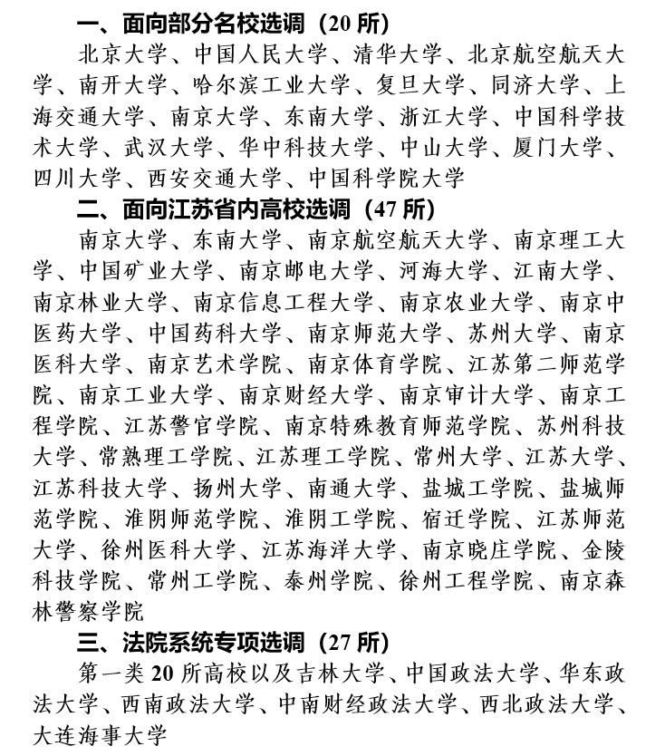

- [1 开篇](#9kqex9)
- [2 基本流程](#c9nemu)
- [3 政策解读](#7o5inh)[3.1 选调对象及数量](#abtn2k)
- [3.2 选调条件](#f8qvkv)
- [3.3 选调程序](#2cvrrc)
- [3.4 相关政策](#fynh0o)
- [3.5 工作纪律](#fdlccj)

[4 心得体会](#2wzpif)

- [4.1 选择](#66rob1)
- [4.2 考试](#2hx75s)[4.2.1 笔试](#bwwev6)
- [4.2.2 面试](#53wat7)

[5 待遇](#f0hucm)[附录：](#abxp4n)

**罗蕴轩**

## 1 开篇

“自信人生二百年，会当水击三千里。”如毛主席当年，现在的你我也正值青春年少，定当在各个领域奉献自我，成就一番事业。

在公务员体系中，选调生是特别的一批人，承载着国家对于**高素质公务员**的期待。许多人可能认为，进入公务员体系意味着安定闲适的工作、生活。但在我看来，当你选择了选调生，你也选择了一份沉甸甸的责任——**做人民的“服务员”**。

## 2 基本流程

1. 报考阶段；
2. 笔试阶段；
3. 面试及考察阶段；
4. 拟录用阶段；
5. 体检阶段；
6. 录用阶段；
7. 报道阶段。

## 3 政策解读

接下来以“江苏省2021年名校优生选调工作公告”（网址链接见附录）为例，对选调生录取条件进行解读。

### 3.1 选调对象及数量

**原文：**名校优生选调550人（不含委培、定向、专升本和独立学院毕业生）。其中：面向部分名校选调430人，每校一般不超过30人；面向江苏省内高校选调70人；法院系统专项选调50人，每校一般不超过10人。优先选调经济金融、信息技术、智能制造、城乡建设、社会治理、生态环境、公共卫生等大类紧缺专业人才。每职位选调计划男生不少于50%。具体高校名单见附件（见附录）。

**解读：**东南大学学生参与江苏省名校优生选调（接下来简称为江苏名优）一般参与“面向部分名校选调”，由于“每校一般不超过30人”设定的存在，东南大学每年被江苏名优录取的人数大约为30人。“优先选调经济金融、信息技术、智能制造、城乡建设、社会治理、生态环境、公共卫生等大类紧缺专业人才。”则意味着在面试考察环节中，上述相关专业的同学会被**优先考量录取**。额外的，江苏名优在性别方面保持了尽可能的公平，其初发布的录取名额中男女生一般是等额分配的，即不出现特殊情况时，**男女生等额录取**。

### 3.2 选调条件

**原文：**1﹒政治立场坚定，爱党爱国，有理想抱负和家国情怀，甘于为国家和人民服务奉献；品学兼优，综合素质和发展潜力好，有一定的组织协调能力；志愿到基层工作。2﹒中共党员（含中共预备党员，截至2020年10月17日）。3﹒面向部分名校选调对象：在选调范围高校就读期间（研究生含本科阶段）担任过班委及以上职务，含班级（党团组织）、学生会（研究生会、党团组织）职务；并且获得过校级以上综合性表彰奖励，报考镇江、盐城、淮安、宿迁、连云港市职位的放宽至院系级以上表彰奖励。　　面向江苏省内高校选调对象：在选调范围高校就读期间（研究生含本科阶段）担任过校学生会（研究生会、党团组织）主席、副主席或院系学生会（研究生会、党团组织）主席满1年（任职时间截至考察之日），并且获得过校级以上综合性表彰奖励。大学本科生学习成绩应在班级排名前50%。　　法院系统专项选调对象：在选调范围高校就读期间（研究生含本科阶段）担任过班委及以上职务，含班级（党团组织）、学生会（研究生会、党团组织）职务，并且获得过院系级以上表彰奖励。法律类专业，报到时取得国家法律职业资格证书（A类）。大学本科生学习成绩应在班级排名前50%。    4﹒大学本科生一般为1996年7月1日以后出生，硕士研究生一般为1993年7月1日以后出生，博士研究生一般为1990年7月1日以后出生。    5﹒具有正常履行职责的身体条件和心理素质。    6﹒在校期间未受过纪律处分。    7﹒法律法规规定的其他条件。

**解读：****条件1** 主要在考察及面试阶段进行，通过简历体现、面试提问、政治体检表格填写等方式。**条件2** 要求考生**在规定日期前入党**。经过测算，本科生必须在大一时递交入党申请书并成功成为入党积极分子，且后续积极分子转发展对象、成为预备党员、预备党员转正均没有出现问题，才可以在大三报名阶段满足报名条件。**条件3** 要求考生需要**有指定的职务和奖励**，且职务或奖励均是考生**在“部分名校”就读期间所担任或获取的**（若研究生为“部分名校”学生，但本科阶段不属于“部分名校”学生，则本科阶段职务及奖励作废，不可作为报考条件）。其中，班委包括且仅包括班长、团支书、党支书，其余职务包括院、校学生会部长级及以上，团委、党委组织的部长级及以上（部分职务由于建制不同可包括组长），不包括任何普通社团职务；校级以上综合性表彰奖励包括但不限于三好学生、三好学生标兵、优秀学生干部、优秀团员、优秀团干、优秀党员（校级、省级、国家级均可）。上述情况有不够清晰的可以致电询问江苏省省委组织部。**条件4** 要求考生满足年龄限制。由于选调工作基本只招录应届生，且应届生一般均满足此年龄限制，故而在此不赘述。**条件5** 主要在体检阶段进行。**条件6、条件7** 在此不赘述。

### 3.3 选调程序

**原文：**1﹒推荐报名。报考人员填写《江苏省2021年名校优生选调推荐人选名册》，向所在院系党组织提出申请，高校党委组织部（学生处、就业指导中心）审核汇总，并报高校党委研究确定推荐名单。高校推荐不设计划限制。推荐名单须在学校就业信息网公示。具体职位及选调计划见附件。报考人员于2020年10月12日至10月17日登录江苏省人力资源和社会保障网（jshrss.jiangsu.gov.cn）的“江苏人事考试服务”栏目，填报个人信息。考生只可填报一个职位。报名截止时间：10月17日16∶00；缴费截止时间：10月18日16∶00。2﹒资格审核。各高校推荐人选名册（Excel格式和盖章后的PDF格式）于10月15日前发至邮箱jssxds@126.com，江苏省委组织部对推荐人选进行资格审核。3﹒素质测试。通过资格审核的报考人员统一参加素质测试，以笔试形式进行，时间为10月24日上午。考场分别设在北京（只接受本校本地校区考生）、上海（只接受本校考生）、天津、西安、武汉、南京，具体地点另行通知。准考证打印、笔试成绩查询在江苏省人力资源和社会保障网（jshrss.jiangsu.gov.cn）的“江苏人事考试服务”栏目进行，准考证打印时间为10月22日至10月23日。素质测试不指定考试大纲和辅导教材。4﹒综合考察。根据素质测试成绩，按照各职位选调计划1∶1.5的比例，从高分到低分确定考察人选，达不到1∶1.5比例的相应调减选调计划（男女生选调计划同步调减）。面向部分名校选调每校考察人选一般不超过45人，法院专项选调每校考察人选一般不超过15人。考察人选在学校就业信息网公示。江苏省委组织部组建考察组，对考察人选进行综合考察。5﹒确定拟录用人选。对素质测试和综合考察成绩按4∶6的比例进行计分，从高分到低分确定拟录用人选。拟录用人选名单在江苏省委组织部网站公示。6﹒组织体检。按照公务员录用体检有关规定，组织拟录用人选体检。因体检阶段放弃或体检不合格产生缺额的，进行一次性递补。递补人选名单在江苏省委组织部网站公示。7．确定录用。体检合格的人选，由江苏省委组织部部务会研究确定录用，录用人选名单在江苏省委组织部网站公布。江苏省委组织部与录用人选签订高校毕业生就业协议。8﹒办理录用派遣手续。录用人选确定后，发录用派遣通知到各有关高校。教育主管部门办理派遣手续。各有关高校及时将档案转递到派遣地的设区市委组织部（法院系统专项选调转递到江苏省高级人民法院政治部），并注明选调生档案。录用人选逾期未取得毕业证和学位证（法院系统专项选调未取得国家法律职业资格证书），录用关系自动解除。

**解读：**程序1、程序2 即**报名阶段**，时间约为每年9月底-10月初，需要考生在院系和省人力资源和社会保障网分别提交报名。程序3 即**笔试阶段**，时间约为每年10月底，不设考纲，需要考生自学完成。程序4 即**考察及面试阶段**，时间约为每年11月底，需考生自行准备职务、奖励等的相关证明。程序5 即**拟录用阶段**，时间约为每年12月。程序6 即**体检阶段**，时间约为每年1月，可能存在少量递补名额。程序7 为**录用阶段**，完成录用阶段后，幸运的考生就成为了一名选调生。

### 3.4 相关政策

**原文：**1﹒面向部分名校选调人选，原则上安排到设区市市级机关或县（市、区）级机关工作，试用期满后，安排到乡镇（街道）锻炼不少于2年，其间在村（社区）锻炼不少于1年。面向江苏省内高校选调人选，安排到乡镇（街道）工作不少于3年，其间在村（社区）锻炼不少于2年。法院系统专项选调人选，原则上安排到省和各设区市法院、南京海事法院工作，试用期满后，安排到县（市、区）法院锻炼不少于2年，其间在人民法庭锻炼不少于1年。2﹒选调生试用期1年，试用期满考核合格的，办理任职定级手续，并进行公务员登记；不合格的，取消录用。3﹒报考人员按照江苏省公务员招录考试有关收费标准缴纳考试费。享受低保的城镇家庭和农村绝对贫困家庭的报考人员，先在网上缴费参加素质测试后，凭有效证明材料于2020年10月30日前向江苏省委组织部申请减免考试费。

**解读：****政策1** 首先**保障了选调生的岗位起点**，即至少为区市市级机关或县（市、区）级机关，诸如党政办，党委组织部、宣传部，团委，发改、住建、教育、人社相关部门等等。同时提出要求，选调生在试用期结束后需去往基层一线服务两年及以上。**政策2** 为选调生设置**试用期门槛**，需满足试用期考核才能正式任职。**政策3** 为贫困考生**提供保障**，报考费用为180元。

### 3.5 工作纪律

**原文：**选调工作要贯彻从严要求，坚持公开公平公正，严格标准、规范程序、强化监督，严把入口关。请各有关高校党委坚持条件，严格程序，认真做好推荐人选审核，配合做好组织考察等工作。参加选调的应届毕业生，要如实填报个人信息、提供任职奖励、学习成绩等证明材料。发现弄虚作假，一律取消选调资格，并严肃追究纪律责任。

**解读：**不做赘述。

## 4 心得体会

### 4.1 选择

如果你没有**政治抱负**，不要选择选调生；如果你没有**吃苦的心理准备**，不要选择选调生；如果你选择选调生是因为安逸，那么建议你去考一个办事员，朝九晚五，完成任务就是胜利。

### 4.2 考试

选调生考生要面对两个大关，笔试和面试（含考察）。

#### 4.2.1 笔试

笔试阶段考试内容可大体分为**行政能力测试**和**申论**两个方面。行政能力测试包括常识、语言、数学、逻辑等方面的内容，申论则包括概括、公文、评论文、策论文等方面的内容，具体视不同地区的考核内容而有所区别。

笔试的学习方式可以有多种，如：**①跟班学习。**市面上有很多考公培训班可以供大家选择，笔者并未跟班学习，所以不甚了解；**②视频学习。**中公、粉笔、华图等大型培训机构每年都会推出多类别的课程。笔者在考公期间曾参考过粉笔的精讲课程，有所收益，但是也认识到视频由于篇幅限制，提供的很多方法存在局限性，需要进一步内化于心、举一反三；**③教材学习。**大型培训机构同样~~也~~会推出许多教材。经过使用，笔者认为：教材购买理论一本、真题一本、真题试卷一本即可（申论行测可以分开购买，且由于选调生试卷不公开，所以可购买对应省的省考版本或者直接购买国考版本），一般情况下教材都比较生涩，建议辅以视频服用；**④APP学习。**刷题方式不仅仅只有教材，在信息化的今天，中公、粉笔等都推出了线上APP。笔者使用了中公题库APP觉得效果不错，听考友推荐粉笔题库APP也很好，非常方便在非学习环境使用（如厕所、餐厅等）。

经过多方询问，笔试的**有效学习时间**（抛开一切杂念，不停学习的时间）至少在300小时以上，才能够上岸。

#### 4.2.2 面试

面试阶段各省有各省的不同，无法统一概述，但是大致都在考察考生的党性、工作、社会、生活、学习等几个方面。

面试的准备也有多种方式：**①跟班准备。**笔者建议跟班准备的同学选择跟**针对性比较强**的机构学习，例如某机构就专门针对江苏名优、浙江选调、上海选调进行研究，教学效果较好；**②自行准备。**笔者建议考生至少准备简历一篇、自我介绍一篇，并复盘自己大学多年以来的工作（尤其是工作成就和工作失误），还要与考察协助对象（一般情况下，考察会要求考生提供一名同学、一名导师，并与提供的人员进行情况了解）进行事前沟通。

在此祝各位考试顺利。

## 5 待遇

肯定很多人最关心的就是待遇问题，那么笔者在此大致谈谈。

首先是**岗位**。一般情况下，如政策中所述，选调生都会被分配到较为核心的岗位上，所以这一点大可不用担心。

其次是**收入**。如果你成为一名选调生，那么你已经赢过了当地一半的人。因为公务员工资是以当地GDP为准的，具体数额在此不多说，各位移步知乎可以看到。

最后是**福利**。下至节日礼品，上至五险一金，公务员都能拿到，并且是较好的，所以不用担心。

## 附录：

江苏省2021年名校优生选调工作公告[http://www.jszzb.gov.cn/tzgg/info_112.aspx?itemid=30888](http://www.jszzb.gov.cn/tzgg/info_112.aspx?itemid=30888)

江苏省

2021年名校优生选调工作高校名单
