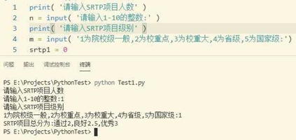
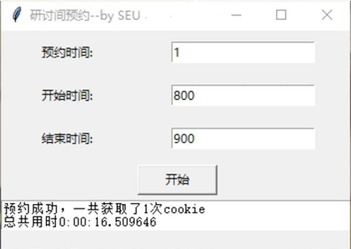
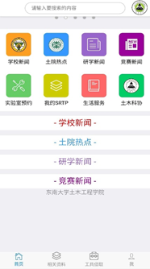
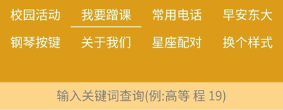

- [4.1 全民学Python的日子真的来了吗](#13d3s9)
- [4.2 我为什么建议每个人都学会计](#2mijf)
- [4.3 社交媒体的功能外延和群众的过度期待](#cvza82)
[4.4 审美其实是一种观察的能力](#evz8yd)

各位亲爱的同学，本章名为拓展。这里不是介绍如何拓展兴趣爱好或者人际资源，而是在学科交叉背景下，从不同专业的事物里，抽选出部分与各位现在或将来的生活紧密相连的东西，以督促各位不要在自己的专业里固步自封，举例的四门专业分别为：计软、会计、传媒和艺术。学科交叉不仅是希望各位提高木桶效应里的短板，更是直指“你想成为一个怎样的人”的思考。你是否意识到这些生活现象的存在？你是否察觉到周遭事物的变化？

## 4.1 全民学Python的日子真的来了吗

各位同学，你也许不是计软专业的，但你毕业后很有可能成了程序员。互联网公司们的不断扩张创造出对具有编程能力人才的大量需求，此时，Python成功凭借其在上手速度、开发效率、应用范围的综合实力成为最受广大学子喜欢的课外语言。关于Python学习的广告也迅速在微信、微博、QQ、知乎等社交媒体上蔓延。相对于C++、Java、Rube等其他编程语言而言，Python的开发效率更高，上手也更加容易，且功能强大。在大数据挖掘的背景下，它不但可以搜集和处理数据，也能开发桌面应用程序、软件、网络及网站后端，同时还能应用到网络智能、科学计算及人工智能等。对于非工科专业的学生而言，Python的数据搜集和处理能力尤为出众，许多经管岗位的招聘简介上甚至直言，“会使用Python者优先”。当你进入大学，发现原来“大学”就是“大不了自己学” 后，Python会是你绝佳的自学技能之一。那些将计算机二级作为电脑技术上限的同学，终归是要在互联网高速发展中逐渐沉没下去。也许你对编程语言是什么还不够了解，也许你现在依旧觉得这是与自己无关的技能，但是没关系，总有一天，总有一个时机，你将突然绝望于人工的落后，那时你定会想起，曾经自己早已见识过Python的魅力。现在来看一看东南大学的学长学姐们用Python做了什么吧？

- **（1）SRTP学分计算小程序**

- **（2）爬取网络情话**

- **（3）图书馆研修间预约辅助系统**

- **（4）爬取炉石传说全卡数据表格**

- **（5）院系课外研学网站系统后端**

- **（6）全校开课时间地点查询系统**

- **（7）服务型虚拟QQ机器人（作者: 东大小宝团队技术组）**

## 4.2 我为什么建议每个人都学会计

会计，是一个很少被合理理解的专业。在大多数人眼中，会计意味着平淡无奇地做账，意味着精打细算和财务造假，意味着在重复性的生活中一眼望得到头的精力枯竭。它所带的老派气质，和医生、教师、公务员一样，被人们赋予了很多正经又稳妥的幻想。人们甚至没法很好地区别学会计、做会计、当会计和会计的用处，却已经认定它在时代浪潮里退步。对于许多高校教师而言，会计是萎缩的，大家为这门专业所保留的最后一点前景是中国市场上不太流行的管理会计，所谓的智能会计也不过是数据收集和处理能力的增强。

对于广大的普通个体而言，会计的真正用处在于，培养认识企业的能力，帮助进行个人理财和金融投资。首先，为什么要进行个人理财与金融投资？因为在资本市场快速发展的当下，不会利用钱去赚钱就是故步自封，是不经济、不划算的。尤其中国的个人投资环境十分宽松，支付宝、微信更是直接与投资平台连通，极大地简化了投资手续、降低了投资门槛。不仅如此，购买理财产品和基金的实践方式能够有效帮助个人从资本市场的角度去了解各行业动态，倒逼着投资者去更好地了解这个世界。其次，投资为什么要靠会计，而不是金融？其实，**会计与金融的关系十分微妙。**不仅两者在专业内容上存在着交叉之处，而且会计信息是金融决策的重要依据之一。所以为什么要以会计的眼光去投资，因为此时你识别出的企业信息是一手的、直接的、更为客观的。在这个金融盛行的时代，会计的落寞在于，它读得懂金融，却读不懂群众。我在本科结束时留下的唯一一个疑惑便是，“为什么大家还不懂会计多么有用？”

我想，来到东南大学的各位同学，无论你就读于什么专业，无论你怀揣着什么梦想，无论你的经济是否富裕，你都应该主动去了解一些会计知识，进而去看看这个世界上资本的翻搅。面对所谓“民族咖啡”瑞幸的崩盘、Tiktok的贱卖危机、土货快手的崛起、美团对滴滴的收购和还没有收回来的单车租金，如果你坚持无视这些商业的残酷与自己的学习无关、与自己的专业无关、与自己的发展无关，那么我只能祝你单纯而美好。但如果，**你想要活的大气从容，不为各种优惠券费尽心力，想要了解一家企业的虚实，想要对现在的经济下行有所感知，那么，请学一点会计吧！**利用会计来更好地生活和工作，绝不是一句空话。

## 4.3 社交媒体的功能外延和群众的过度期待

各位同学，你的手机里有QQ和微信吗？我想绝大部分的同学应该都是有的。社交媒体的广泛应用让我们逐渐放弃了“短信”的使用，QQ、微信、微博等成为现在的主流交友软件。社交媒体，顾名思义，是用来进行社会交际的。然而，事物不会总是一成不变。如果你还在简单地将社交媒体看做聊天和分享动态的工具，那么不免略显老套。尤其对于微博、知乎这样的以信息传递、资源共享为主的平台，社交反而不是最重要的。之所以在这里提到社交媒体，是因为与之相关的一些有趣现象和逻辑，恰好适合作为我们日常思考的例子。

我发现，其一，社交媒体的功能的确正不断外延，它们从最初的社交平台逐渐演变成监督平台、交易平台，甚至具备了金融的功能；其二，人们也许并未意识到这种功能的外延，却用非商业的逻辑对这些外延的功能有了更多期待。然而，事实上，对于微博、微信、QQ这些软件所代表的企业而言，做“合理”的事并不意味着就是做“正确”的事，因为企业绝非慈善机构。

2020年，微博凭借其大量的用户基础和快速的信息传递，在这次新冠疫情的防控中发挥了重要作用。过去半年，由于居家防控，人们花在社交媒体上的时间也更多。逐渐地，大家愈发清晰地发现，微博不仅可以交友，还可以获取资源，更可以“让某地连夜成立公安组”、“帮助破解虚假冤案”、“实名举报违法行为”……微博通过信息传递引起公众关注，在媒体的不断发酵和民众的持续呼喊中，公共治理作用得到了切实的体现。通过这些积极的事件，微博似乎是正义、善良、富有社会责任感的。然而，也正是在这些正义事件中，许多网友发出震耳的一问，“今天微博倒闭了吗？”原因在于，微博内容审核的过度严格和花钱降热搜的捞钱模式，阻碍了大家对自由、公平和正义的追求。

网友是冲动而直白的。我们有时过于坚持充满了道德感的原则，却忘记了微博也不过是一个需要获取利益的软件。它的生存之道，也许就是小心翼翼地审核内容和想尽办法收钱。因为，它可能既不想触碰到政府的底线，又不想在资本力量的蓄积中落于人后。但我并没有说微博如此严格的审核机制和只要有钱就能操纵热搜的行为就是绝对正确的，因为我们并不知道这是众压下的权衡之策，还是我行我素的企业理念。我只是在说，强烈的社会责任感无法适用于所有场景，即使现在的微博倒闭，下一个微博也会迅速崛起，而你无法保证，明天一定会更好。

## 4.4 审美其实是一种观察的能力

各位同学，如果你对艺术、设计、质感、情趣这些词语感兴趣的话，那么欢迎你来到这个探究美感的部分。我要很抱歉地告诉大家，这里绝不会探讨心灵美、内在美，反而是为了去发现那些可见的、直观的、物质的、外在的美。这次，我绝不避讳人对外在美的努力追求，不再一本正经地用心灵美的精神高度去压制外在美的欲望深度。因为，在这个肉眼可见的世界里，色彩的搭配、物品的陈列、服饰的选择、角度的转换、材质的触摸等等，将世界装扮地更具风韵。

个体之间存在不同的人生追求，每个人也拥有不同的生活方式和自我发展模式。但是，很多时候，我们明确了自己要做一个怎样的人，却总是忘记要做一个怎样气质的人，全权将这份气质交给了性格。然而，我说过，这是一个充满了外在美的世界，你的气质虽然不是实体，却能在肉眼下清晰可见。通过气质来分辨人，是我经常做的一个生活游戏。气质是一个人的综合体现，它反映着个体的品质、性格、品位和能力。因此，在认识一个个体时，我们不仅会去了解其已有的成就，更会去观察他的穿衣风格、书桌上物品的摆放、语言表达、走路气势……反过来而言，如果你想要培养自己的气质，你就要明白，气质是以上各个方面的综合体现，它比性格更能反映一个综合的你。

说了这么多，我想表达的是，如果你想成就一个更为丰富、更具质感、更具特色的自己，那你就要往前述方面提升，并且，是从美的角度，而不仅是技术的角度。比如，学习摄影时，以追求照片的美感为先，而不以器材和参数代表的技术为先；再比如，日常穿搭时，用色彩搭配和层次来塑造风格，而不再仅仅只是舒服就好；又或者，在你的书桌上，研究花瓶、书籍和笔的摆放，一杯蜡烛点燃，就是一个宁静的夜晚。当然，如果你对艺术的情趣毫无兴趣，下定决心精简生活，并且毫不在意审美一事，只愿钟情于技术研发、学术研究这类更具价值的事上，那也是极好的。但如果，你想要脱胎换骨般改变自己，那么你就要时刻提醒自己对于审美的要求，质感二字将是你一生的追求。

很不幸的是，生活在九龙湖校区的各位同学，你们来到了一处缺乏设计的地方。在强工科思维的引导下，我们学校的建筑物结构、墙壁色彩、园林造型、室内软装等体现出明显的死板风格。我在学校里寻找了很久，最终发现，焦标的粉色墙壁是这座灰色城堡里最具有现代价值的呐喊。从今往后，于寂寞无声处呐喊、于平淡乏味处寻美，将是各位的艰巨任务。
